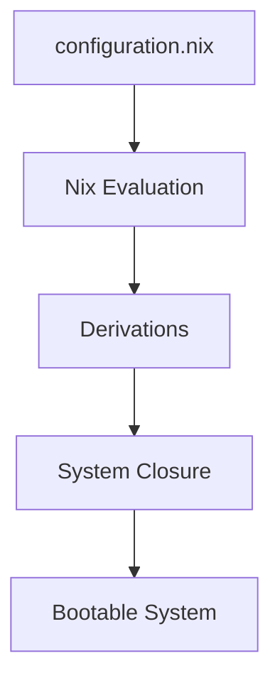

# 書寫風格規範

本文件規範《NixOS 系統配置文件結構完全指南》的寫作格式，所有章節必須遵守。

---

## 文字節奏

- 短句為主，一個概念一行或一小段
- 技術術語首次出現需加括號解釋，例如：不可變基礎設施（Immutable Infrastructure）
- 避免長段落；複雜說明優先使用條列或 Mermaid 流程圖
- 書面中文，不使用縮寫或網路用語

---

## 程式碼區塊

- 所有 Nix 配置必須有完整函式簽名：`{ config, pkgs, ... }:`
- 版本統一使用 NixOS 25.05：`system.stateVersion = "25.05"`
- 每個程式碼區塊前後必須有說明文字，解釋「為什麼這樣寫」
- Shell 命令範例統一使用 bash code fence

```nix
# 正確範例：有完整語境
{ config, pkgs, ... }:

{
  services.openssh.enable = true;
}
```

```nix
# 錯誤範例：缺少函式簽名
{
  services.openssh.enable = true;
}
```

---

## 流程圖（Mermaid）

架構說明優先使用 Mermaid 圖表：



---

## Lab 格式

每個 Lab 必須包含以下段落，缺一不可：

### 目標
說明完成本 Lab 後達成的具體能力。

### 建議環境
以表格列出需求：

| 工具 | 建議 |
|---|---|
| Hypervisor | VirtualBox / VMware / KVM |
| RAM | 4GB 以上 |

### Step N：步驟名稱
每步一個動作，包含完整指令。

### 驗證
列出可執行的驗證指令，讓讀者確認成功。

---

## 漸進原則

1. 先展示最簡單可運行版本，再逐步加入複雜度
2. 模組化示範從「單一大檔」→「拆分小模組」演進
3. 每章新概念都必須建立在前章基礎上，不可跳步
4. 陷阱與錯誤訊息必須出現在「troubleshooting」段落，不散落正文

---

## 標題層級

```
# 章節標題（H1）— 每章只有一個
## 小節標題（H2）
### 子節標題（H3）
#### 補充說明（H4，謹慎使用）
```

---

## 禁止事項

- 不使用「如上所示」、「如下所示」等指向模糊的表達
- 不省略 Nix 表達式的函式參數（即使不用也要寫 `...`）
- 不在程式碼中使用佔位符如 `YOUR_USERNAME`，改用具體範例值（如 `alice`）
