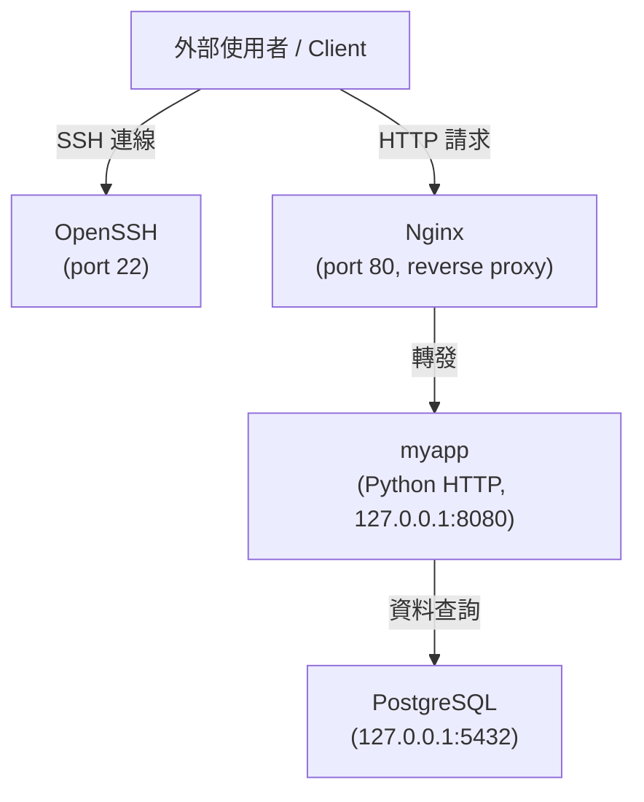

# Lab 5：建立含服務的伺服器配置

**對應章節：** 第 13–16 章（服務配置架構）

---

## 目標

完成本 Lab 後，學員將能夠：

1. 在 NixOS 上部署 OpenSSH（安全配置）、Nginx（反向代理）、PostgreSQL（資料庫）
2. 定義自訂 systemd 服務（以一個簡單的 Python HTTP 應用程式作為示範）
3. 使用 `systemctl` 和 `journalctl` 排查服務問題
4. 理解服務之間的依賴關係（dependency）
5. 在模組化架構下管理多個服務配置

---

## 前置要求

- 已完成 Lab 4（Flakes 基礎配置）
- 了解 systemd 基本概念（第 13 章：service unit、journald）
- 可使用 VM（虛擬機器）或第二台實體機器作為伺服器環境

---

## 建議環境

| 項目 | 建議規格 |
|---|---|
| NixOS 版本 | 25.05 stable |
| CPU | 2 核心以上 |
| RAM | 2 GB 以上 |
| 磁碟空間 | 20 GB 以上 |
| 網路設定 | 可使用 NAT 或 Bridged 模式 |
| 虛擬化工具 | VirtualBox / VMware / KVM / QEMU |
| 操作使用者 | `alice`（具備 `wheel` 群組） |
| 主機名稱 | `nixos` |

> **提示：** 建議使用 VM 快照（Snapshot）功能。在 Step 7 的故障模擬練習之前先建立一個快照，方便快速還原。

---

## 整體目標架構

本 Lab 的目標是建立一台 NixOS 伺服器，同時執行以下四個服務：

- **OpenSSH**：安全遠端管理入口
- **PostgreSQL**：關聯式資料庫（relational database）
- **myapp**：自訂 Web 應用程式（一個用 Python 撰寫的 HTTP 伺服器），以 systemd service 形式運行
- **Nginx**：反向代理（reverse proxy），將外部 80 port 的請求轉發給 myapp

這四個服務的連線關係如下：



架構重點：

- Nginx 與 myapp 都執行在同一台機器上
- myapp 只監聽 `127.0.0.1:8080`（不對外開放）
- PostgreSQL 只允許本地（localhost）連線
- 只有 22 和 80 port 對外開放

---

## 專案目錄結構

完成本 Lab 後，`/etc/nixos/` 的目錄結構如下：

```text
/etc/nixos/
├── configuration.nix          # 頂層入口，只做 imports 和基本設定
├── hardware-configuration.nix # 由安裝程式自動產生，不手動修改
└── modules/
    ├── ssh.nix                # OpenSSH 安全配置
    ├── postgresql.nix         # PostgreSQL 資料庫配置
    ├── webapp.nix             # 自訂 myapp systemd 服務
    └── nginx.nix              # Nginx 反向代理配置
```

這種結構的好處是：每個服務的配置都獨立在一個檔案裡，修改 Nginx 時不會影響 PostgreSQL 的配置，也方便在版本控制系統（version control system）中追蹤每次修改。

---

## Step 1：建立伺服器的 configuration.nix 結構

首先，建立 `modules/` 子目錄：

```bash
sudo mkdir -p /etc/nixos/modules
```

確認目錄已建立：

```bash
ls /etc/nixos/
```

預期輸出：

```text
configuration.nix  hardware-configuration.nix  modules/
```

接著，編輯頂層的 `configuration.nix`。這個檔案的職責是「協調者（coordinator）」：它只負責引入模組，不直接定義服務細節。

```nix
# /etc/nixos/configuration.nix
{ config, pkgs, lib, ... }:

{
  imports = [
    ./hardware-configuration.nix
    ./modules/ssh.nix
    ./modules/postgresql.nix
    ./modules/webapp.nix
    ./modules/nginx.nix
  ];

  # 基本系統設定
  networking.hostName = "nixos";
  time.timeZone = "Asia/Taipei";
  i18n.defaultLocale = "zh_TW.UTF-8";

  # 使用者 alice
  users.users.alice = {
    isNormalUser = true;
    extraGroups = [ "wheel" ];
    # SSH 公鑰在 modules/ssh.nix 中設定
  };

  # 基本工具
  environment.systemPackages = with pkgs; [
    vim
    git
    curl
    htop
    tree
  ];

  system.stateVersion = "25.05";
}
```

頂層配置保持精簡，所有服務細節都交給各自的模組處理。這樣當配置增長到幾十個服務時，`configuration.nix` 仍然一目瞭然。

---

## Step 2：配置 OpenSSH（modules/ssh.nix）

OpenSSH（Secure Shell）是遠端管理伺服器最常用的工具。預設配置安全性不足，本步驟將建立一份強化版本。

建立 `/etc/nixos/modules/ssh.nix`：

```nix
# /etc/nixos/modules/ssh.nix
# 職責：安全的 OpenSSH 伺服器配置
{ config, pkgs, lib, ... }:

{
  services.openssh = {
    enable = true;

    settings = {
      # 禁止直接以 root 身份登入，降低風險
      PermitRootLogin = "no";

      # 禁用密碼登入，強制使用 SSH 金鑰（key-based authentication）
      PasswordAuthentication = false;

      # 禁用鍵盤互動式驗證（keyboard-interactive authentication）
      KbdInteractiveAuthentication = false;

      # 閒置逾時設定：300 秒無操作則斷線
      ClientAliveInterval = 300;
      ClientAliveCountMax = 2;
    };

    # 開放的 SSH port
    ports = [ 22 ];
  };

  # 設定 alice 的 SSH 公鑰
  # 實際部署時，請將下方的測試公鑰替換為你自己的 ~/.ssh/id_ed25519.pub 內容
  users.users.alice = {
    openssh.authorizedKeys.keys = [
      # 測試用公鑰（格式示範，請務必替換為實際公鑰）
      "ssh-ed25519 AAAAC3NzaC1lZDI1NTE5AAAAIExamplePublicKeyReplaceThisWithYourActualPublicKey alice@example.com"
    ];
  };

  # 防火牆（firewall）開放 port 22
  networking.firewall.allowedTCPPorts = [ 22 ];
}
```

**如何取得自己的 SSH 公鑰：**

如果你還沒有 SSH 金鑰對，在本機（不是伺服器）執行：

```bash
# 產生 Ed25519 金鑰對（推薦演算法）
ssh-keygen -t ed25519 -C "alice@nixos"

# 查看公鑰內容
cat ~/.ssh/id_ed25519.pub
```

將輸出的那一行（形如 `ssh-ed25519 AAAA... alice@nixos`）貼到上方 `authorizedKeys.keys` 串列裡。

**驗證 SSH 配置（在 Step 6 套用後執行）：**

從另一台機器執行：

```bash
# 將 <SERVER_IP> 替換為伺服器的 IP 位址
ssh alice@<SERVER_IP>
```

成功登入後，嘗試用密碼登入（應該會被拒絕）：

```bash
ssh -o PreferredAuthentications=password alice@<SERVER_IP>
# 預期輸出：Permission denied (publickey)
```

---

## Step 3：配置 PostgreSQL（modules/postgresql.nix）

PostgreSQL 是功能完整的開源關聯式資料庫系統。本步驟將啟用 PostgreSQL、建立應用程式專用的資料庫和使用者。

建立 `/etc/nixos/modules/postgresql.nix`：

```nix
# /etc/nixos/modules/postgresql.nix
# 職責：PostgreSQL 資料庫配置（僅允許本地連線）
{ config, pkgs, lib, ... }:

{
  services.postgresql = {
    enable = true;

    # 使用最新穩定版本
    package = pkgs.postgresql_16;

    # 資料庫初始化設定
    # ensureDatabases：確保指定資料庫存在（若已存在則略過）
    ensureDatabases = [ "myapp" ];

    # ensureUsers：確保指定使用者存在並擁有對應資料庫的權限
    ensureUsers = [
      {
        name = "myapp";
        ensureDBOwnership = true;  # myapp 使用者擁有 myapp 資料庫
      }
    ];

    # 連線認證設定（pg_hba.conf 格式）
    # 只允許本地 Unix socket 和 127.0.0.1 連線
    authentication = pkgs.lib.mkOverride 10 ''
      # TYPE  DATABASE  USER    ADDRESS       METHOD
      local   all       all                   trust
      host    all       all     127.0.0.1/32  md5
      host    all       all     ::1/128       md5
    '';

    # PostgreSQL 服務本身的設定（postgresql.conf）
    settings = {
      # 只監聽本地迴路介面（loopback interface），不對外開放
      listen_addresses = "127.0.0.1";

      # 日誌設定
      log_connections = true;
      log_disconnections = true;
    };
  };

  # PostgreSQL 監聽 port 5432，但不開放防火牆（只允許本地連線）
  # 注意：這裡刻意不加入 networking.firewall.allowedTCPPorts
  # 因為資料庫不應該對外暴露
}
```

`ensureDatabases` 和 `ensureUsers` 是 NixOS 提供的宣告式資料庫初始化機制。每次 `nixos-rebuild switch` 後，系統會自動確認這些資源存在，如果遺失會重新建立，不需要手動執行 `CREATE DATABASE` 等 SQL 指令。

**驗證 PostgreSQL（在 Step 6 套用後執行）：**

```bash
# 切換為 postgres 系統使用者，查看所有資料庫
sudo -u postgres psql -c "\l"
```

預期輸出（截取相關部分）：

```text
                                  List of databases
   Name    |  Owner   | Encoding |   Collate   |    Ctype    |   Access privileges
-----------+----------+----------+-------------+-------------+-----------------------
 myapp     | myapp    | UTF8     | en_US.UTF-8 | en_US.UTF-8 |
 postgres  | postgres | UTF8     | en_US.UTF-8 | en_US.UTF-8 |
 template0 | postgres | UTF8     | en_US.UTF-8 | en_US.UTF-8 | =c/postgres
 template1 | postgres | UTF8     | en_US.UTF-8 | en_US.UTF-8 | =c/postgres
```

確認 `myapp` 資料庫存在且 owner 是 `myapp` 使用者。

---

## Step 4：建立自訂 Web 應用程式服務（modules/webapp.nix）

這是本 Lab 最核心的步驟。我們將用 Nix 的工具建立一個真正可執行的 Python HTTP 伺服器，並用 systemd 管理它的生命週期。

### 4.1 設計思路

一般 Linux 系統上，自訂服務通常需要：

1. 手動把腳本放到 `/usr/local/bin/`
2. 手動寫 systemd unit 檔到 `/etc/systemd/system/`
3. `sudo systemctl enable ...`

NixOS 的做法：在 `configuration.nix` 中直接宣告，`nixos-rebuild` 會幫你處理所有細節，包括建立系統使用者、放置可執行檔、配置 systemd。

### 4.2 建立 webapp.nix

建立 `/etc/nixos/modules/webapp.nix`：

```nix
# /etc/nixos/modules/webapp.nix
# 職責：自訂 Web 應用程式的 systemd 服務定義
{ config, pkgs, lib, ... }:

let
  # 使用 pkgs.writeShellScript 建立一個可執行的 shell 腳本
  # 這個腳本會被放進 /nix/store/，路徑不可變，確保服務行為可重現
  myappScript = pkgs.writeShellScript "myapp-server" ''
    #!/usr/bin/env bash

    # 設定 Python 路徑
    export PATH="${pkgs.python3}/bin:$PATH"

    echo "myapp starting on 127.0.0.1:8080"

    # 使用 Python 內建的 HTTP 伺服器模組
    # 建立一個簡單的回應腳本
    python3 - <<'PYEOF'
import http.server
import socketserver
import socket

PORT = 8080
HOST = "127.0.0.1"

class MyHandler(http.server.BaseHTTPRequestHandler):
    def do_GET(self):
        message = b"Hello from NixOS!\n"
        self.send_response(200)
        self.send_header("Content-Type", "text/plain; charset=utf-8")
        self.send_header("Content-Length", str(len(message)))
        self.end_headers()
        self.wfile.write(message)

    def log_message(self, format, *args):
        # 讓日誌輸出到 stdout，交由 journald 收集
        print(f"[myapp] {self.address_string()} - {format % args}")

class ReusableTCPServer(socketserver.TCPServer):
    allow_reuse_address = True

with ReusableTCPServer((HOST, PORT), MyHandler) as httpd:
    print(f"Serving on http://{HOST}:{PORT}")
    httpd.serve_forever()
PYEOF
  '';

in
{
  # 建立專用系統使用者（system user）
  # 服務以最小權限原則（principle of least privilege）執行
  users.users.myapp = {
    isSystemUser = true;
    group = "myapp";
    description = "myapp web application service user";
    # 不設定 home directory 或 shell，最小化攻擊面
  };

  users.groups.myapp = {};

  # 定義 systemd service unit
  systemd.services.myapp = {
    description = "My NixOS Web Application";

    # 服務啟動時機：multi-user.target 代表系統完整啟動後
    wantedBy = [ "multi-user.target" ];

    # 確保在網路服務啟動後才啟動
    after = [ "network.target" ];

    serviceConfig = {
      # 以 myapp 使用者身份執行，避免以 root 執行
      User = "myapp";
      Group = "myapp";

      # 執行的腳本（指向 Nix store 中的不可變路徑）
      ExecStart = "${myappScript}";

      # 工作目錄使用臨時目錄
      WorkingDirectory = "/tmp";

      # 服務失敗時自動重啟
      Restart = "on-failure";
      RestartSec = "5s";

      # 安全強化選項（hardening options）
      # 給予服務獨立的 /tmp，防止與其他服務互相干擾
      PrivateTmp = true;

      # 掛載根目錄為唯讀，服務無法修改系統檔案
      ProtectSystem = "strict";

      # 防止服務修改 /home 和 /root
      ProtectHome = true;

      # 禁止服務取得新的特權（privilege escalation）
      NoNewPrivileges = true;

      # 標準輸出和錯誤都交由 journald 記錄
      StandardOutput = "journal";
      StandardError = "journal";
    };
  };
}
```

`pkgs.writeShellScript` 是 Nix 提供的工具函式（utility function），它會：

1. 將腳本內容寫入 `/nix/store/` 的某個固定路徑
2. 設定正確的執行權限（executable permission）
3. 回傳這個腳本在 Nix store 中的絕對路徑

這樣 systemd 的 `ExecStart` 就能指向一個穩定、不可變的腳本路徑。

**驗證 myapp 服務（在 Step 6 套用後執行）：**

確認服務正在執行：

```bash
systemctl status myapp.service
```

預期輸出：

```text
● myapp.service - My NixOS Web Application
     Loaded: loaded (/etc/systemd/system/myapp.service; enabled; vendor preset: enabled)
     Active: active (running) since ...
   Main PID: 1234 (bash)
```

測試 HTTP 回應：

```bash
curl http://127.0.0.1:8080
```

預期輸出：

```text
Hello from NixOS!
```

---

## Step 5：配置 Nginx 反向代理（modules/nginx.nix）

Nginx 將作為反向代理（reverse proxy），接收外部的 HTTP 請求（port 80），然後轉發給內部的 myapp（port 8080）。

這種架構的好處：

- myapp 不需要以 root 執行（使用 80 port 以下需要特殊權限）
- Nginx 負責 TLS 終止（TLS termination）、負載均衡（load balancing）等工作
- 可以在不重啟 myapp 的情況下修改 Nginx 配置

建立 `/etc/nixos/modules/nginx.nix`：

```nix
# /etc/nixos/modules/nginx.nix
# 職責：Nginx 反向代理配置，將外部請求轉發到 myapp
{ config, pkgs, lib, ... }:

{
  services.nginx = {
    enable = true;

    # 全域推薦設定（recommended settings）
    recommendedOptimisation = true;
    recommendedGzipSettings = true;
    recommendedProxySettings = true;

    # 虛擬主機（virtual host）配置
    virtualHosts = {
      # 這個虛擬主機處理所有到達 port 80 的請求
      "nixos-server" = {
        # 監聽 port 80（預設 HTTP port）
        listen = [
          { addr = "0.0.0.0"; port = 80; }
        ];

        # 預設 location：將所有請求轉發給 myapp
        locations."/" = {
          # 轉發目標：myapp 的內部地址
          proxyPass = "http://127.0.0.1:8080";

          # 設定代理標頭（proxy headers），讓 myapp 知道真實客戶端資訊
          extraConfig = ''
            proxy_set_header Host              $host;
            proxy_set_header X-Real-IP         $remote_addr;
            proxy_set_header X-Forwarded-For   $proxy_add_x_forwarded_for;
            proxy_set_header X-Forwarded-Proto $scheme;

            # 連線逾時設定
            proxy_connect_timeout 10s;
            proxy_read_timeout    30s;
            proxy_send_timeout    30s;
          '';
        };
      };
    };
  };

  # 防火牆開放 port 80（HTTP）
  networking.firewall.allowedTCPPorts = [ 80 ];
}
```

`recommendedProxySettings = true` 會自動加入一些常用的代理設定，例如 `proxy_http_version 1.1` 和連線保持（keepalive）設定，減少手動配置的負擔。

**驗證 Nginx 代理（在 Step 6 套用後執行）：**

透過 Nginx 測試反向代理是否正常：

```bash
# 從伺服器本機測試
curl http://localhost

# 從另一台機器測試（將 <SERVER_IP> 替換為實際 IP）
curl http://<SERVER_IP>
```

兩個指令都應該回傳：

```text
Hello from NixOS!
```

查看 Nginx 的 access log：

```bash
journalctl -u nginx.service -f
```

---

## Step 6：套用並啟動所有服務

確認所有模組檔案都已建立後，套用新的配置：

```bash
sudo nixos-rebuild switch
```

這個指令會：

1. 評估（evaluate）所有 Nix 配置檔案
2. 計算需要建置的套件和服務
3. 原子化（atomic）切換到新的系統世代（generation）
4. 啟動或重啟受影響的 systemd 服務

建置過程需要幾分鐘。完成後，逐一確認所有服務狀態：

**確認 OpenSSH：**

```bash
systemctl status sshd
```

預期輸出關鍵行：

```text
Active: active (running)
```

**確認 PostgreSQL：**

```bash
systemctl status postgresql
```

預期輸出關鍵行：

```text
Active: active (running)
```

**確認 myapp：**

```bash
systemctl status myapp
```

預期輸出關鍵行：

```text
Active: active (running)
```

**確認 Nginx：**

```bash
systemctl status nginx
```

預期輸出關鍵行：

```text
Active: active (running)
```

**一次查看所有服務的即時日誌（live log）：**

```bash
# 查看 myapp 的即時日誌
journalctl -u myapp.service -f

# 另開一個終端機，送出請求測試
curl http://localhost
```

日誌視窗應該顯示類似以下的訪問記錄：

```text
May 18 12:00:00 nixos bash[1234]: [myapp] 127.0.0.1 - GET / HTTP/1.0 200 -
```

**確認防火牆規則：**

```bash
sudo iptables -L INPUT -n | grep -E "22|80"
```

應該看到 port 22 和 80 都在允許清單中。

---

## Step 7：模擬服務故障與排查

學習如何找出和修復服務問題，是運維（operations）工作的核心能力。本步驟會刻意製造一個服務故障，讓你練習排查流程。

### 7.1 製造故障

編輯 `modules/webapp.nix`，修改 Python 腳本，在第一行加入一個會讓 Python 直譯器（interpreter）報錯的語法錯誤：

```nix
# 修改 myappScript 的內容，在最前面加入一行無效的 Python 語法
# 找到 Python heredoc 開頭，加入這一行：

  myappScript = pkgs.writeShellScript "myapp-server" ''
    #!/usr/bin/env bash
    export PATH="${pkgs.python3}/bin:$PATH"
    echo "myapp starting on 127.0.0.1:8080"
    python3 - <<'PYEOF'
this_is_not_valid_python = @@@ syntax error here
import http.server
# ... 以下省略
PYEOF
  '';
```

套用修改：

```bash
sudo nixos-rebuild switch
```

等待建置完成後，查看服務狀態：

```bash
systemctl status myapp.service
```

你會看到服務狀態變成 `failed` 或 `activating (start)`：

```text
● myapp.service - My NixOS Web Application
     Loaded: loaded (/etc/systemd/system/myapp.service; enabled)
     Active: failed (Result: exit-code)
    Process: 5678 ExecStart=.../myapp-server (code=exited, status=1/FAILURE)
```

### 7.2 查找錯誤原因

使用 `journalctl` 查看錯誤訊息。`-p err` 參數代表只顯示錯誤等級（priority: error）以上的訊息：

```bash
journalctl -u myapp.service -p err
```

預期輸出：

```text
May 18 12:05:00 nixos bash[5678]: SyntaxError: invalid syntax
May 18 12:05:00 nixos bash[5678]:   File "<stdin>", line 1
May 18 12:05:00 nixos bash[5678]:     this_is_not_valid_python = @@@ syntax error here
May 18 12:05:00 nixos bash[5678]:                                ^
```

看到 `SyntaxError` 表示 Python 腳本有語法錯誤。

查看最近 50 行日誌（不限錯誤等級）：

```bash
journalctl -u myapp.service -n 50
```

### 7.3 修復服務

方法一：修改配置後重新 rebuild（需要修改 Nix 配置時）

移除剛才加入的語法錯誤，恢復正確的 `webapp.nix`，然後：

```bash
sudo nixos-rebuild switch
```

方法二：直接重啟服務（不需要修改 Nix 配置時）

如果只是服務程式暫時當機（crash），不是配置問題，可以直接重啟：

```bash
sudo systemctl restart myapp.service
```

確認服務恢復正常：

```bash
systemctl status myapp.service
curl http://localhost
```

### 7.4 哪些情況需要 nixos-rebuild，哪些只需要 systemctl？

| 情況 | 指令 |
|---|---|
| 修改了任何 `.nix` 配置檔案 | `sudo nixos-rebuild switch` |
| 安裝或移除套件 | `sudo nixos-rebuild switch` |
| 服務暫時當機，不需改配置 | `sudo systemctl restart <service>` |
| 服務配置沒有改變，只是要強制重啟 | `sudo systemctl restart <service>` |
| 臨時停止某個服務（重啟後恢復） | `sudo systemctl stop <service>` |
| 永久停用某個服務 | 在 `.nix` 檔案中設定 `enable = false`，然後 `nixos-rebuild switch` |

核心原則：`systemctl` 的改動是**暫時的（ephemeral）**；只有 `nixos-rebuild switch` 才能讓配置在重開機後持續生效。

---

## 驗證清單

完成本 Lab 的所有步驟後，請逐一確認以下項目：

| 編號 | 驗證項目 | 驗證指令 | 預期結果 |
|---|---|---|---|
| 1 | SSH 連線成功（金鑰認證） | `ssh alice@<SERVER_IP>` | 成功登入，不需輸入密碼 |
| 2 | SSH 拒絕密碼登入 | `ssh -o PreferredAuthentications=password alice@<SERVER_IP>` | `Permission denied (publickey)` |
| 3 | myapp 資料庫存在 | `sudo -u postgres psql -c "\l"` | 列表中有 `myapp` 資料庫 |
| 4 | Web 應用程式直接回應 | `curl http://127.0.0.1:8080` | `Hello from NixOS!` |
| 5 | Nginx 反向代理正常 | `curl http://localhost` | `Hello from NixOS!` |
| 6 | myapp 服務自動重啟 | `sudo systemctl kill -s SIGKILL myapp && sleep 10 && systemctl status myapp` | 服務重新啟動為 `active (running)` |
| 7 | journalctl 有完整日誌 | `journalctl -u myapp.service -n 20` | 顯示最近 20 行服務日誌 |
| 8 | 防火牆僅開放 22 和 80 | `sudo iptables -L INPUT -n` | 只有 port 22 和 80 在允許清單 |
| 9 | 模組結構正確 | `ls /etc/nixos/modules/` | 顯示 `ssh.nix postgresql.nix webapp.nix nginx.nix` |
| 10 | 配置可回滾至前一世代 | `sudo nixos-rebuild switch --rollback` | 系統切換成功，服務仍正常運作 |

---

## 常見問題

### Q1：`myapp.service` 啟動失敗，如何找原因？

**排查步驟：**

1. 查看服務的完整狀態輸出：

```bash
systemctl status myapp.service
```

注意 `Active:` 行後面的錯誤碼（exit code）。

2. 查看詳細的錯誤日誌：

```bash
# 查看最近 50 行日誌
journalctl -u myapp.service -n 50

# 只顯示錯誤等級以上
journalctl -u myapp.service -p err

# 即時追蹤日誌（適合觀察啟動過程）
journalctl -u myapp.service -f
```

3. 常見原因：
   - Python 腳本語法錯誤 → 看 `SyntaxError` 訊息
   - Port 8080 已被其他程式佔用 → 看 `Address already in use`
   - 權限問題（myapp 使用者無法讀取檔案）→ 看 `Permission denied`

4. 確認 `ProtectSystem = "strict"` 沒有阻擋服務存取必要的路徑：

```bash
# 暫時以 myapp 使用者手動執行腳本，看看錯誤訊息
sudo -u myapp /run/current-system/sw/bin/bash <腳本路徑>
```

---

### Q2：Nginx 顯示 502 Bad Gateway，是什麼問題？

**可能原因：** Nginx 無法連線到後端的 myapp 服務。

**排查流程：**

```bash
# 1. 確認 myapp 是否在執行
systemctl status myapp.service

# 2. 確認 myapp 是否真的在監聽 8080 port
ss -tlnp | grep 8080

# 3. 直接測試 myapp 是否回應
curl http://127.0.0.1:8080

# 4. 查看 Nginx 的錯誤日誌
journalctl -u nginx.service -p err
```

**常見原因與解法：**

| 現象 | 原因 | 解法 |
|---|---|---|
| myapp 未在執行 | webapp.nix 配置錯誤或服務崩潰 | 修復 webapp.nix，重新 rebuild |
| myapp 監聽的地址不對 | 腳本中 HOST 設定錯誤 | 確認 Python 腳本監聽 `127.0.0.1:8080` |
| Nginx 的 proxyPass 地址錯誤 | nginx.nix 中 URL 拼錯 | 確認 `proxyPass = "http://127.0.0.1:8080"` |

---

### Q3：PostgreSQL 服務起來了，但 psql 連不上？

**可能原因 1：** 使用了錯誤的連線方式。

```bash
# 錯誤：直接以 alice 身份連線
psql myapp

# 正確：以 postgres 超級使用者連線
sudo -u postgres psql

# 或以 myapp 使用者連線
sudo -u myapp psql myapp
```

**可能原因 2：** `pg_hba.conf` 的認證方式設定不符合預期。

```bash
# 查看 PostgreSQL 的日誌，找 authentication 相關的訊息
journalctl -u postgresql.service -n 50 | grep -i "auth\|connect\|error"
```

**可能原因 3：** 資料庫尚未完成初始化。

```bash
# 確認 PostgreSQL 資料目錄已建立
ls /var/lib/postgresql/

# 確認 myapp 資料庫已被建立
sudo -u postgres psql -l
```

如果 `/var/lib/postgresql/` 是空的，嘗試重啟服務讓初始化重新執行：

```bash
sudo systemctl restart postgresql
journalctl -u postgresql.service -f
```

---

### Q4：`nixos-rebuild switch` 後服務沒有重啟？

**可能原因：** NixOS 預設只會在配置真正改變時才重啟服務。如果你只修改了與某服務無關的配置，該服務不會被重啟。

**手動強制重啟特定服務：**

```bash
sudo systemctl restart myapp.service
sudo systemctl restart nginx.service
```

**確認服務的當前配置版本是否與期望一致：**

```bash
# 查看 systemd 目前載入的服務配置
systemctl cat myapp.service
```

如果輸出的 `ExecStart` 路徑仍指向舊的 Nix store 路徑（即使 rebuild 完成），代表服務沒有隨 rebuild 重啟。手動重啟即可解決：

```bash
sudo systemctl daemon-reload
sudo systemctl restart myapp.service
```

---

### Q5：SSH 配置改壞了，無法遠端登入，如何修復？

這是伺服器管理中最棘手的情況之一。以下是安全的修復步驟：

**前提：** 必須能夠透過 VM console（虛擬機器控制台）或實體鍵盤直接操作伺服器。

**步驟一：透過 VM console 登入**

在 VirtualBox / VMware / virt-manager 的 console 視窗，直接輸入使用者名稱和密碼登入。

> 注意：即使 SSH 無法連線，本地（local）登入通常不受影響，除非你同時也把 `users.users.alice.hashedPassword` 設定錯了。

**步驟二：查看目前有哪些世代（generations）**

```bash
# 查看系統世代列表
sudo nix-env --list-generations --profile /nix/var/nix/profiles/system
```

輸出範例：

```text
  10   2026-05-18 11:00:00   (current)
   9   2026-05-18 10:30:00
   8   2026-05-18 09:00:00
```

**步驟三：回滾到上一個正常的世代**

```bash
# 方法一：直接回滾到前一個世代
sudo nixos-rebuild switch --rollback

# 方法二：指定回滾到特定世代編號（例如第 9 代）
sudo nix-env --switch-generation 9 --profile /nix/var/nix/profiles/system
sudo /nix/var/nix/profiles/system/bin/switch-to-configuration switch
```

**步驟四：確認 SSH 服務已恢復**

```bash
systemctl status sshd
# 確認輸出顯示 active (running)
```

然後嘗試從遠端重新 SSH 連線，確認恢復正常。

**步驟五：修正 ssh.nix 中的錯誤配置**

回滾只是暫時解決方案。回到工作狀態後，找出 `modules/ssh.nix` 中的問題，修正後再次 rebuild：

```bash
sudo nixos-rebuild switch
```

**預防建議：**

每次修改 SSH 配置後，先用 `nixos-rebuild test`（不切換當前世代，只測試新配置是否能啟動）進行驗證：

```bash
sudo nixos-rebuild test
```

如果 `test` 成功，再執行 `switch`。即使 `switch` 後 SSH 壞了，`test` 也不會改變 bootloader 的預設世代，下次重開機仍會用舊的配置。

---

## 延伸練習

### 練習一：為 myapp 新增 systemd timer

目標：讓 NixOS 每分鐘自動執行一個日誌清理（log rotation）腳本。

在 `modules/webapp.nix` 中加入以下內容（與 `systemd.services.myapp` 並列）：

```nix
# 清理腳本
let
  cleanupScript = pkgs.writeShellScript "myapp-cleanup" ''
    #!/usr/bin/env bash
    echo "[cleanup] Running at $(date)"
    # 清理超過 7 天的暫存檔（這裡只做示範，實際上 PrivateTmp 已隔離 /tmp）
    find /var/log -name "myapp-*.log" -mtime +7 -delete 2>/dev/null || true
    echo "[cleanup] Done"
  '';
in
{
  # ... 原有的 users、systemd.services.myapp 內容 ...

  # 新增清理服務
  systemd.services.myapp-cleanup = {
    description = "myapp Log Cleanup Service";
    serviceConfig = {
      Type = "oneshot";  # 執行一次就結束，不是長駐服務
      User = "myapp";
      ExecStart = "${cleanupScript}";
    };
  };

  # 定義 timer：每分鐘觸發一次 myapp-cleanup.service
  systemd.timers.myapp-cleanup = {
    description = "myapp Cleanup Timer";
    wantedBy = [ "timers.target" ];
    timerConfig = {
      OnCalendar = "minutely";   # 每分鐘
      Persistent = true;         # 如果系統關機期間跳過了，開機後補執行一次
    };
  };
}
```

驗證：

```bash
# 查看 timer 狀態
systemctl list-timers myapp-cleanup.timer

# 手動觸發一次，確認可以執行
sudo systemctl start myapp-cleanup.service
journalctl -u myapp-cleanup.service
```

---

### 練習二：為 Nginx 配置 HTTPS（自簽憑證）

目標：讓 Nginx 支援 HTTPS（port 443），使用 `pkgs.openssl` 產生的自簽憑證（self-signed certificate）。

**步驟一：產生自簽憑證**

```bash
# 建立存放憑證的目錄
sudo mkdir -p /etc/nixos/certs

# 使用 openssl 產生私鑰和自簽憑證（有效期 365 天）
sudo nix run nixpkgs#openssl -- req -x509 -newkey rsa:4096 \
  -keyout /etc/nixos/certs/myapp.key \
  -out /etc/nixos/certs/myapp.crt \
  -days 365 -nodes \
  -subj "/C=TW/ST=Taiwan/L=Taipei/O=MyOrg/CN=localhost"

sudo chmod 600 /etc/nixos/certs/myapp.key
```

**步驟二：修改 nginx.nix 加入 TLS**

```nix
# 在 virtualHosts 中修改設定
"nixos-server" = {
  listen = [
    { addr = "0.0.0.0"; port = 80; }
    { addr = "0.0.0.0"; port = 443; ssl = true; }
  ];

  # 指定憑證路徑
  sslCertificate    = "/etc/nixos/certs/myapp.crt";
  sslCertificateKey = "/etc/nixos/certs/myapp.key";

  # HTTP 自動跳轉到 HTTPS
  forceSSL = true;

  locations."/" = {
    proxyPass = "http://127.0.0.1:8080";
    # ... 其他 header 設定 ...
  };
};
```

**步驟三：開放 port 443**

在 `nginx.nix` 的防火牆設定中加入 443：

```nix
networking.firewall.allowedTCPPorts = [ 80 443 ];
```

驗證：

```bash
# 使用 -k 忽略自簽憑證的驗證警告
curl -k https://localhost
```

---

### 練習三：透過 EnvironmentFile 傳遞資料庫連線資訊

目標：讓 myapp 從環境變數（environment variable）讀取 PostgreSQL 的連線資訊，而不是寫死在程式碼裡。

這是處理機密資訊（credentials）的最佳實踐（best practice）。

**步驟一：建立環境變數檔案**

```bash
sudo bash -c 'cat > /etc/nixos/myapp.env <<EOF
DB_HOST=127.0.0.1
DB_PORT=5432
DB_NAME=myapp
DB_USER=myapp
DB_PASSWORD=changeme
EOF'
sudo chmod 600 /etc/nixos/myapp.env
```

**步驟二：修改 webapp.nix 的 serviceConfig**

```nix
serviceConfig = {
  # ... 其他設定 ...

  # systemd 會讀取這個檔案中的 KEY=VALUE 並注入到服務的環境變數
  EnvironmentFile = "/etc/nixos/myapp.env";
};
```

**步驟三：修改 Python 腳本讀取環境變數**

```python
import os

db_host = os.environ.get("DB_HOST", "127.0.0.1")
db_name = os.environ.get("DB_NAME", "myapp")
print(f"Connecting to database: {db_name} at {db_host}")
```

驗證：

```bash
# 確認環境變數有被注入
sudo systemctl show myapp.service | grep Environment
```

> 注意：`EnvironmentFile` 中的內容不會出現在 `systemctl status` 輸出中（避免洩漏機密），但會出現在 `systemctl show` 的詳細輸出中。生產環境建議搭配 `sops-nix` 或 `agenix` 管理機密資訊（第 22 章會詳細介紹）。

---

### 練習四：新增 Redis 快取服務

目標：了解如何將 Redis（記憶體快取資料庫）整合到現有架構中。

**概念實作步驟：**

建立 `/etc/nixos/modules/redis.nix`：

```nix
# /etc/nixos/modules/redis.nix
{ config, pkgs, lib, ... }:

{
  services.redis.servers."myapp" = {
    enable = true;

    # 只監聽本地，不對外暴露
    bind = "127.0.0.1";
    port = 6379;

    # 設定最大記憶體使用量
    settings = {
      maxmemory = "128mb";
      maxmemory-policy = "allkeys-lru";
    };
  };

  # 不開放防火牆（Redis 僅供本機使用）
}
```

將 `./modules/redis.nix` 加入 `configuration.nix` 的 `imports`：

```nix
imports = [
  ./hardware-configuration.nix
  ./modules/ssh.nix
  ./modules/postgresql.nix
  ./modules/webapp.nix
  ./modules/nginx.nix
  ./modules/redis.nix  # 新增
];
```

在 `webapp.nix` 的 Python 腳本中加入 Redis 快取邏輯（概念實作）：

```python
import os

# 如果 redis 模組存在就使用快取，否則降級（fallback）為直接回應
try:
    import redis
    cache = redis.Redis(host="127.0.0.1", port=6379)
    cache.ping()
    use_cache = True
except Exception:
    use_cache = False

def get_greeting():
    if use_cache:
        cached = cache.get("greeting")
        if cached:
            return cached.decode()
        value = "Hello from NixOS! (with Redis cache)"
        cache.setex("greeting", 60, value)  # 快取 60 秒
        return value
    return "Hello from NixOS!"
```

驗證：

```bash
# 確認 Redis 服務在執行
systemctl status redis-myapp.service

# 手動測試 Redis 連線
sudo -u myapp redis-cli -h 127.0.0.1 ping
# 預期輸出：PONG
```

---

## 小結

在本 Lab 中，你完成了以下工作：

1. **建立模組化伺服器配置架構**：將 SSH、PostgreSQL、自訂應用程式、Nginx 分別拆分為獨立的模組（`modules/` 子目錄），實踐「關注點分離（separation of concerns）」原則。

2. **部署並安全化 OpenSSH**：禁用密碼登入、禁止 root 直接登入，僅允許金鑰認證。

3. **以宣告式方式初始化 PostgreSQL**：使用 `ensureDatabases` 和 `ensureUsers` 取代手動 SQL 指令，讓資料庫狀態也納入 NixOS 配置管理。

4. **撰寫自訂 systemd 服務**：使用 `pkgs.writeShellScript` 建立可重現的可執行腳本，並以 `systemd.services` 定義服務，包含安全強化選項（`PrivateTmp`、`ProtectSystem`、`NoNewPrivileges`）。

5. **配置 Nginx 反向代理**：將外部 HTTP 請求轉發到內部應用程式，學習 virtual host 和 proxy header 設定。

6. **排查服務故障**：掌握 `journalctl` 過濾日誌、`systemctl status` 查看錯誤原因，以及回滾世代修復配置錯誤的方法。

**Lab 5 的核心教訓：**

在 NixOS 上，服務配置本身也是程式碼（configuration as code）。所有的服務定義、使用者建立、防火牆規則都集中在 `/etc/nixos/` 中，可以用版本控制追蹤每一次修改，在需要時可以精確回滾到任意歷史狀態。這就是 NixOS 在伺服器管理上的核心優勢。

---

**下一步：Lab 6 — Flakes 與多主機管理**

在 Lab 6 中，我們將把本 Lab 的伺服器配置遷移到 Flakes 架構，並學習如何用同一份程式碼庫管理多台不同用途的 NixOS 主機（筆記型電腦、工作站、伺服器），以及使用 `deploy-rs` 實現遠端部署自動化。

---

## 自動驗證

本目錄附有四個服務模組的標準答案與驗證腳本。

### 標準答案：`solutions/`

```
solutions/
├── configuration.nix    # 伺服器入口檔
└── modules/
    ├── ssh.nix          # 強化 SSH（無密碼登入、無 root）
    ├── postgresql.nix   # PG 16 + 宣告式建庫
    ├── webapp.nix       # 自訂 Python systemd 服務
    └── nginx.nix        # 反向代理到 myapp:8080
```

對照差異：

```bash
for f in configuration; do diff /etc/nixos/$f.nix solutions/$f.nix; done
for f in ssh postgresql webapp nginx; do
  echo "=== modules/$f.nix ==="
  diff /etc/nixos/modules/$f.nix solutions/modules/$f.nix
done
```

### 驗證腳本：`verify.sh`

```bash
cd /path/to/NixOS_Book/labs/lab-05-home-manager
bash verify.sh
```

腳本會檢查：

- `modules/` 目錄與四個服務模組存在
- `configuration.nix` 引入這四個模組
- `sshd` / `postgresql` / `myapp` / `nginx` 四個服務皆為 `active`
- PostgreSQL 的 `myapp` 資料庫已建立
- `myapp` 監聽 8080，HTTP 回應為「Hello from NixOS」
- Nginx 從外部 80 port 可正確反向代理到 myapp
- 防火牆只開放 22 與 80（PostgreSQL 不對外）
- SSH 已禁止密碼登入與 root 登入
