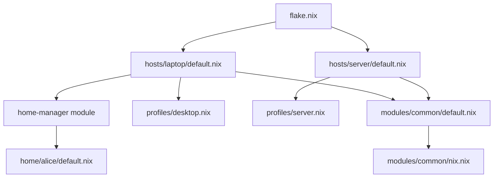

# Lab 6：多主機 Flakes 配置管理

**對應章節：** 第 17–20 章（Flakes 基礎、多主機管理、Home Manager 整合、大型配置架構）

**預估時間：** 90–120 分鐘

**難度：** ★★★☆☆（中級）

---

## 目標

完成本 Lab 後，你將能夠：

1. 將現有的 `configuration.nix` 遷移到 Flakes（宣告式套件鎖定系統）架構
2. 用單一 `flake.nix` 管理 `laptop` 和 `server` 兩台主機的配置
3. 整合 Home Manager（NixOS Module 模式）管理 `alice` 的使用者環境
4. 執行 `sudo nixos-rebuild switch --flake .#laptop` 完成配置部署
5. 理解並實作第 20 章介紹的模組化目錄結構（hosts / modules / profiles / home）

---

## 前置要求

完成本 Lab 前，請確認你已具備下列知識與環境：

| 項目 | 說明 |
|---|---|
| 完成 Lab 1–5 | 或具備 NixOS 基本操作能力 |
| 理解 `imports` 機制 | 對應第 5 章 |
| 理解 NixOS Module System | 對應第 7 章 |
| 了解 Flakes 基本概念 | 對應第 17 章（outputs / inputs / lock file） |

---

## 建議環境

| 項目 | 建議規格 |
|---|---|
| 作業系統 | NixOS 25.05（安裝在實體機或 VM） |
| CPU | 2 核心以上 |
| 記憶體 | 4 GB 以上 |
| 磁碟空間 | 20 GB 以上空閒空間 |
| 網路連線 | 必須，用於下載 nixpkgs 與 home-manager |
| Git | 已安裝（NixOS 預設包含） |
| 使用者 | 以 `alice` 帳號操作，具備 `sudo` 權限 |

> **注意：** Step 6 的 server 配置建置不需要實體 server。你可以在 `laptop` 上執行 `--dry-run` 來驗證 server 的配置語法正確，不需要實際部署。

---

## 最終目標架構

完成本 Lab 後，你的配置 repository 將呈現以下結構：

```
my-nixos-config/
├── flake.nix                    # 整個配置的入口點
├── flake.lock                   # 依賴版本鎖定檔
├── hosts/
│   ├── laptop/
│   │   ├── default.nix          # laptop 主機配置
│   │   └── hardware.nix         # laptop 硬體配置
│   └── server/
│       └── default.nix          # server 主機配置（無硬體設定）
├── modules/
│   └── common/
│       ├── default.nix          # 引入所有 common 模組
│       └── nix.nix              # Nix 本身的設定（gc、cache 等）
├── profiles/
│   ├── desktop.nix              # 桌面環境設定（laptop 使用）
│   └── server.nix               # 伺服器基本設定（server 使用）
└── home/
    └── alice/
        └── default.nix          # alice 的 Home Manager 配置
```

以下是各層次之間的關係圖：



---

## Part 1：建立 Flakes 基礎

### Step 1：啟用 Flakes 功能

Flakes 在 NixOS 25.05 中仍屬於實驗性功能（experimental feature），需要手動啟用。

開啟你的 `/etc/nixos/configuration.nix`，加入以下設定：

```nix
# /etc/nixos/configuration.nix
{ config, pkgs, ... }:

{
  # ... 其他現有設定 ...

  # 啟用 Nix Flakes 與新版 nix 指令介面
  nix.settings.experimental-features = [ "nix-command" "flakes" ];
}
```

套用設定：

```bash
sudo nixos-rebuild switch
```

驗證 Flakes 已啟用：

```bash
# 確認 nix 版本（應顯示 2.x.x）
nix --version

# 確認 flake 子指令存在
nix flake --help
```

預期輸出範例：

```
nix (Nix) 2.24.x
```

若 `nix flake --help` 正常顯示說明文字，代表 Flakes 功能已成功啟用。

---

### Step 2：初始化 Git Repository 並建立 flake.nix

Flakes 強制要求配置必須在 Git repository 中。這個設計確保每個版本都可以被追蹤與重現。

**初始化 Git repository：**

```bash
cd /etc/nixos

# 初始化 git repo
sudo git init

# 將現有檔案加入追蹤
sudo git add .

# 第一次提交
sudo git commit -m "initial commit: existing configuration"
```

> **為什麼需要 git init？**
> Nix Flakes 使用 Git 來決定哪些檔案屬於這個 flake。只有被 `git add` 追蹤的檔案才會被 Nix 看見。如果你新增了一個 `.nix` 檔案但忘記 `git add`，Nix 會報錯找不到該檔案。

**建立最小版本的 flake.nix：**

在 `/etc/nixos/` 目錄下建立 `flake.nix`：

```nix
# /etc/nixos/flake.nix
{
  # description：描述這個 flake 的用途，純文字說明
  description = "My NixOS configuration";

  # inputs：這個 flake 依賴哪些外部資源
  # 類似 package.json 中的 dependencies
  inputs = {
    # nixpkgs：NixOS 套件庫，指定使用 25.05 穩定版
    # "github:NixOS/nixpkgs/nixos-25.05" 代表
    # GitHub 上 NixOS/nixpkgs 這個 repo 的 nixos-25.05 分支
    nixpkgs.url = "github:NixOS/nixpkgs/nixos-25.05";
  };

  # outputs：這個 flake 對外提供什麼
  # 函式接收所有 inputs 作為參數
  outputs = { self, nixpkgs, ... }:
  let
    # system：定義目標硬體架構
    # "x86_64-linux" 代表 64-bit x86 Linux（最常見）
    system = "x86_64-linux";
  in
  {
    # nixosConfigurations：定義可以部署的 NixOS 主機
    # 格式：nixosConfigurations.<主機名稱> = nixpkgs.lib.nixosSystem { ... }
    nixosConfigurations = {

      # "nixos" 是這台主機的名稱（可以改成任何名字）
      # 使用 --flake .#nixos 來指定部署這個配置
      nixos = nixpkgs.lib.nixosSystem {

        # system：主機的硬體架構，與上方 let 中定義的一致
        inherit system;

        # modules：組成這個 NixOS 系統的模組清單
        # 就像一個清單，告訴 Nix 要把哪些配置檔組合起來
        modules = [
          # 引入現有的 configuration.nix
          # ./configuration.nix 是相對於 flake.nix 的路徑
          ./configuration.nix
        ];
      };

    }; # 結束 nixosConfigurations
  }; # 結束 outputs
}
```

將新檔案加入 Git 追蹤（不加入就看不見）：

```bash
sudo git add flake.nix
```

**驗證 flake.nix 語法正確：**

```bash
# 檢查 flake 的語法與結構是否正確
nix flake check

# 顯示這個 flake 提供的所有 outputs
nix flake show
```

`nix flake show` 的預期輸出範例：

```
git+file:///etc/nixos
└───nixosConfigurations
    └───nixos: NixOS configuration
```

這表示 Nix 成功識別了你的 flake，並找到一個名為 `nixos` 的 NixOS 配置。

---

### Step 3：第一次用 Flakes 部署

確認語法無誤後，使用 Flakes 語法部署系統：

```bash
# 使用 --flake .#nixos 指定 flake 路徑（.）和主機名稱（nixos）
sudo nixos-rebuild switch --flake .#nixos
```

**命令說明：**

- `--flake .` 表示從當前目錄（`/etc/nixos`）的 `flake.nix` 讀取配置
- `#nixos` 表示使用 `nixosConfigurations.nixos` 這個主機定義
- 第一次執行時，Nix 會下載並建立 `flake.lock`（版本鎖定檔）

部署成功後，將 `flake.lock` 提交到 Git：

```bash
sudo git add flake.lock
sudo git commit -m "initial flake setup"
```

**驗證系統正常運作：**

```bash
# 確認系統世代資訊
nixos-rebuild list-generations

# 確認當前世代來自 flake（應該看到 flake 路徑）
nix-env --list-generations
```

> **`flake.lock` 是什麼？**
> `flake.lock` 記錄了每個 input（如 nixpkgs）在建置時的確切 Git commit hash。這確保了無論你何時、在哪台機器上執行 `nixos-rebuild`，都會得到完全相同的套件版本。這是 Flakes 實現「可重現建置」的核心機制。

---

## Part 2：建立模組化結構

### Step 4：重構成多主機目錄結構

現在把單一的 `configuration.nix` 重構成支援多主機的目錄結構。

**建立目錄結構：**

```bash
cd /etc/nixos

# 建立主機目錄
sudo mkdir -p hosts/laptop
sudo mkdir -p hosts/server
sudo mkdir -p modules/common
sudo mkdir -p profiles
sudo mkdir -p home/alice
```

**移動現有配置檔：**

```bash
# 將 configuration.nix 移動為 laptop 的配置
sudo mv configuration.nix hosts/laptop/default.nix

# 將硬體配置移動到 laptop 目錄下
sudo mv hardware-configuration.nix hosts/laptop/hardware.nix
```

**更新 hosts/laptop/default.nix 的 imports 路徑：**

因為檔案移動了，`hardware-configuration.nix` 的引入路徑需要更新。開啟 `hosts/laptop/default.nix`，找到 imports 區塊並修改：

```nix
# /etc/nixos/hosts/laptop/default.nix
{ config, pkgs, ... }:

{
  imports = [
    # 更新路徑：hardware-configuration.nix 現在在同一目錄下，改名為 hardware.nix
    ./hardware.nix
    # 之後會加入更多模組，例如：
    # ../../modules/common
    # ../../profiles/desktop.nix
  ];

  # ... 其餘現有設定保持不變 ...

  system.stateVersion = "25.05";
}
```

**更新 flake.nix 指向新的主機路徑，並改用 laptop 作為主機名稱：**

```nix
# /etc/nixos/flake.nix
{
  description = "My NixOS configuration";

  inputs = {
    nixpkgs.url = "github:NixOS/nixpkgs/nixos-25.05";
  };

  outputs = { self, nixpkgs, ... }:
  let
    system = "x86_64-linux";
  in
  {
    nixosConfigurations = {

      # 主機名稱改為 laptop（符合實際用途）
      laptop = nixpkgs.lib.nixosSystem {
        inherit system;
        modules = [
          # 指向 hosts/laptop/default.nix
          ./hosts/laptop/default.nix
        ];
      };

    };
  };
}
```

將所有異動加入 Git 追蹤：

```bash
sudo git add -A
```

**驗證 laptop 配置可以部署：**

```bash
sudo nixos-rebuild switch --flake .#laptop
```

若部署成功，提交這次重構：

```bash
sudo git commit -m "refactor: reorganize into hosts/ directory structure"
```

---

### Step 5：建立共用模組

共用模組（common modules）是多主機管理的核心。所有主機共享的設定，如 Nix 自身的配置、binary cache 設定、垃圾回收排程等，都放在這裡。

**建立 modules/common/nix.nix：**

```nix
# /etc/nixos/modules/common/nix.nix
{ config, pkgs, lib, ... }:

{
  # Nix 本身的行為設定
  nix = {

    # settings：對應 /etc/nix/nix.conf 中的設定
    settings = {
      # 啟用 Flakes 與新版 nix 指令（每台主機都需要）
      experimental-features = [ "nix-command" "flakes" ];

      # substituters：binary cache 伺服器清單
      # 當 Nix 需要建置套件時，先從這些伺服器下載預編譯版本
      # 可以大幅減少本地編譯時間
      substituters = [
        "https://cache.nixos.org"           # 官方 cache
        "https://nix-community.cachix.org"  # nix-community 社群 cache
      ];

      # trusted-public-keys：驗證 binary cache 的公鑰
      # 每個 cache 伺服器都有對應的簽名金鑰，確保套件未被篡改
      trusted-public-keys = [
        "cache.nixos.org-1:6NCHdD59X431o0gWypbMrAURkbJ16ZPMQFGspcDShjY="
        "nix-community.cachix.org-1:mB9FSh9qf2dde0enChH2NPhZCLkev/Tkg1KZp9Q8VZQ="
      ];

      # auto-optimise-store：自動最佳化 Nix store
      # 將相同內容的檔案建立 hardlink，節省磁碟空間
      auto-optimise-store = true;
    };

    # gc：垃圾回收（Garbage Collection）設定
    gc = {
      # automatic：啟用自動垃圾回收
      automatic = true;

      # dates：按照 systemd-timer 格式設定執行時間
      # "weekly" 表示每週執行一次
      dates = "weekly";

      # options：傳給 nix-collect-garbage 的參數
      # "--delete-older-than 30d" 刪除 30 天前的舊世代
      options = "--delete-older-than 30d";
    };

  };
}
```

**建立 modules/common/default.nix：**

```nix
# /etc/nixos/modules/common/default.nix
# 這個檔案作為 common 模組的入口點
# 引入所有 common 子模組，讓主機只需要 import 一個路徑
{ config, pkgs, ... }:

{
  imports = [
    # 引入 Nix 設定模組
    ./nix.nix
    # 未來可以繼續加入其他 common 模組，例如：
    # ./locale.nix    # 語言與時區設定
    # ./security.nix  # 安全性基本設定
    # ./ssh.nix       # SSH 基本設定
  ];
}
```

**在 laptop 的配置中引入 common 模組：**

更新 `hosts/laptop/default.nix` 的 imports：

```nix
# /etc/nixos/hosts/laptop/default.nix
{ config, pkgs, ... }:

{
  imports = [
    ./hardware.nix
    # 引入所有主機共用的基礎模組
    ../../modules/common
  ];

  # ... laptop 特有的設定 ...

  system.stateVersion = "25.05";
}
```

將新檔案加入 Git 並驗證：

```bash
sudo git add modules/
sudo nixos-rebuild switch --flake .#laptop
```

若成功，提交：

```bash
sudo git commit -m "add common modules: nix gc and binary cache settings"
```

---

### Step 6：建立伺服器模擬配置

現在加入第二台主機 `server` 的配置。

> **沒有實體 server 也能做這個練習！**
> 本 Step 的目標是學習如何在 `flake.nix` 中定義第二台主機。我們會使用 `--dry-run` 旗標驗證配置語法正確性，不需要真正部署到 server 硬體上。這在多主機管理中是標準做法：先在開發環境驗證配置，再部署到目標主機。

**建立 hosts/server/default.nix：**

伺服器配置的特點：沒有桌面環境、開啟 SSH、盡量精簡。

```nix
# /etc/nixos/hosts/server/default.nix
# 極簡伺服器配置
# 注意：這個檔案沒有 hardware.nix，因為我們沒有實體 server
# 實際部署時需要補上對應硬體的 hardware-configuration.nix
{ config, pkgs, lib, ... }:

{
  imports = [
    # 引入所有主機共用的基礎模組
    ../../modules/common
    # 引入伺服器 profile
    ../../profiles/server.nix
  ];

  # 主機名稱
  networking.hostName = "server";

  # 伺服器使用靜態 IP（實際數值依環境調整）
  # 這裡先用 DHCP 作為示範
  networking.useDHCP = true;

  # 伺服器通常使用 systemd-boot
  boot.loader.systemd-boot.enable = true;
  boot.loader.efi.canTouchEfiVariables = true;

  # 使用者設定：alice 也管理這台 server
  users.users.alice = {
    isNormalUser = true;
    extraGroups = [ "wheel" ];
    # 實際使用時請設定 SSH 公鑰
    # openssh.authorizedKeys.keys = [ "ssh-ed25519 AAAA..." ];
  };

  # 允許 wheel 群組使用 sudo
  security.sudo.wheelNeedsPassword = false;

  system.stateVersion = "25.05";
}
```

**建立 profiles/server.nix：**

```nix
# /etc/nixos/profiles/server.nix
# 伺服器角色的基本設定
# 所有「伺服器類型」的主機都可以引入這個 profile
{ config, pkgs, ... }:

{
  # 啟用 OpenSSH 服務
  services.openssh = {
    enable = true;
    settings = {
      # 禁止直接以 root 登入（安全最佳實踐）
      PermitRootLogin = "no";
      # 禁止密碼登入，只允許金鑰認證
      PasswordAuthentication = false;
    };
  };

  # 防火牆：只開放 SSH 連接埠
  networking.firewall = {
    enable = true;
    allowedTCPPorts = [ 22 ];
  };

  # 伺服器不需要桌面相關套件
  # 只安裝基本管理工具
  environment.systemPackages = with pkgs; [
    vim
    git
    htop
    curl
    wget
  ];
}
```

**建立 profiles/desktop.nix（給 laptop 使用）：**

```nix
# /etc/nixos/profiles/desktop.nix
# 桌面環境角色的基本設定
{ config, pkgs, ... }:

{
  # 啟用 GNOME 桌面環境（可依個人喜好替換）
  services.xserver = {
    enable = true;
    displayManager.gdm.enable = true;
    desktopManager.gnome.enable = true;
  };

  # 音效系統：PipeWire（現代 Linux 音效架構）
  services.pipewire = {
    enable = true;
    alsa.enable = true;
    pulse.enable = true;
  };

  # 桌面常用套件
  environment.systemPackages = with pkgs; [
    firefox
    gnome-terminal
    nautilus
  ];
}
```

**在 laptop 配置中也引入 desktop profile：**

更新 `hosts/laptop/default.nix`：

```nix
# /etc/nixos/hosts/laptop/default.nix
{ config, pkgs, ... }:

{
  imports = [
    ./hardware.nix
    ../../modules/common
    # 引入桌面環境設定
    ../../profiles/desktop.nix
  ];

  networking.hostName = "laptop";

  # ... 其他 laptop 特有設定 ...

  system.stateVersion = "25.05";
}
```

**更新 flake.nix 加入 server 主機：**

```nix
# /etc/nixos/flake.nix
{
  description = "My NixOS configuration";

  inputs = {
    nixpkgs.url = "github:NixOS/nixpkgs/nixos-25.05";
  };

  outputs = { self, nixpkgs, ... }:
  let
    system = "x86_64-linux";
  in
  {
    nixosConfigurations = {

      # laptop：桌面主機配置
      laptop = nixpkgs.lib.nixosSystem {
        inherit system;
        modules = [
          ./hosts/laptop/default.nix
        ];
      };

      # server：伺服器主機配置
      # 注意：server 的 hosts/server/default.nix 中沒有引入 hardware.nix
      # 因此只能用 --dry-run 驗證，無法直接部署
      server = nixpkgs.lib.nixosSystem {
        inherit system;
        modules = [
          ./hosts/server/default.nix
        ];
      };

    };
  };
}
```

將所有新增檔案加入 Git：

```bash
sudo git add profiles/ hosts/server/
sudo git add flake.nix
```

**驗證 server 配置（不需要實體機器）：**

```bash
# --dry-run 只計算需要什麼，不真正建置
# 這個指令在 laptop 上就可以執行，不需要 server 在線
nix build .#nixosConfigurations.server.config.system.build.toplevel --dry-run
```

預期輸出範例（會列出需要建置或下載的套件）：

```
these 12 derivations will be built:
  /nix/store/...-server-system-...drv
  ...
```

若出現這樣的輸出（而非錯誤），代表配置語法正確、可以建置。

提交：

```bash
sudo git commit -m "add server host and desktop/server profiles"
```

---

## Part 3：整合 Home Manager

### Step 7：在 flake.nix 加入 Home Manager

Home Manager（使用者環境管理器）讓你用宣告式方式管理個人套件與 dotfiles（設定檔）。我們使用 NixOS Module 模式，讓 Home Manager 直接嵌入 NixOS 系統配置中，一次 `nixos-rebuild` 同時更新系統和使用者環境。

**更新 flake.nix 加入 home-manager input：**

```nix
# /etc/nixos/flake.nix
{
  description = "My NixOS configuration";

  inputs = {
    # nixpkgs：NixOS 套件庫
    nixpkgs.url = "github:NixOS/nixpkgs/nixos-25.05";

    # home-manager：使用者環境管理器
    # release-25.05 分支與 nixpkgs 25.05 版本對應
    home-manager = {
      url = "github:nix-community/home-manager/release-25.05";

      # follows：讓 home-manager 使用與 nixpkgs 完全相同的版本
      # 避免系統套件與 home-manager 套件版本不一致的問題
      # 這是整合 home-manager 時的標準做法
      inputs.nixpkgs.follows = "nixpkgs";
    };
  };

  # outputs 函式的參數中加入 home-manager
  outputs = { self, nixpkgs, home-manager, ... }:
  let
    system = "x86_64-linux";
  in
  {
    nixosConfigurations = {

      # laptop：加入 home-manager 整合
      laptop = nixpkgs.lib.nixosSystem {
        inherit system;
        modules = [
          ./hosts/laptop/default.nix

          # 引入 home-manager 作為 NixOS 模組
          # 這是 NixOS Module 模式的關鍵一行
          home-manager.nixosModules.home-manager

          # home-manager 全域設定
          {
            home-manager = {
              # useGlobalPkgs：讓 home-manager 使用系統層級的 pkgs
              # 避免下載第二份 nixpkgs，節省時間與空間
              useGlobalPkgs = true;

              # useUserPackages：將 home-manager 安裝的套件放入使用者 profile
              # 讓套件在登入 shell 後就可以直接使用
              useUserPackages = true;

              # users：定義哪些使用者由 home-manager 管理
              users.alice = import ./home/alice/default.nix;
            };
          }
        ];
      };

      # server：暫時不整合 home-manager（伺服器通常不需要）
      server = nixpkgs.lib.nixosSystem {
        inherit system;
        modules = [
          ./hosts/server/default.nix
        ];
      };

    };
  };
}
```

將更新加入 Git：

```bash
sudo git add flake.nix
```

> **NixOS Module 模式 vs Standalone 模式**
>
> Home Manager 有兩種使用模式：
> - **NixOS Module 模式**（本 Lab 使用）：Home Manager 嵌入 NixOS 配置中，`sudo nixos-rebuild switch` 同時更新系統和使用者環境。適合單人或少數使用者的個人機器。
> - **Standalone 模式**：Home Manager 獨立運作，使用 `home-manager switch` 更新使用者環境。適合在非 NixOS 系統（如 macOS、Ubuntu）使用，或在 NixOS 上需要獨立控制更新時機的情境。

---

### Step 8：建立 alice 的 home.nix

**建立 home/alice/default.nix：**

```nix
# /etc/nixos/home/alice/default.nix
# alice 的使用者環境配置
# 這個檔案由 home-manager 模組讀取
{ config, pkgs, lib, ... }:

{
  # home.username 與 home.homeDirectory：宣告這是誰的 home 目錄
  # home-manager 需要這些資訊來確定安裝位置
  home.username = "alice";
  home.homeDirectory = "/home/alice";

  # home.packages：安裝給 alice 個人使用的套件
  # 這些套件只對 alice 可見，不影響其他使用者
  home.packages = with pkgs; [
    # ripgrep（rg）：比 grep 更快的搜尋工具
    ripgrep
    # fd：比 find 更友善的檔案搜尋工具
    fd
    # bat：帶語法高亮的 cat 替代品
    bat
    # eza：帶顏色與圖示的 ls 替代品（原 exa 的維護分支）
    eza
  ];

  # programs.git：Git 版本控制設定
  # home-manager 的 programs 模組讓你用宣告式方式管理程式設定
  programs.git = {
    enable = true;

    # userName 與 userEmail 對應 git config user.name / user.email
    userName = "Alice";
    userEmail = "alice@example.com";

    # extraConfig：其他 git 設定，對應 ~/.gitconfig 中的內容
    extraConfig = {
      init.defaultBranch = "main";
      pull.rebase = false;
      # 使用 bat 作為 git diff 的顯示工具
      core.pager = "bat --style=plain";
    };
  };

  # programs.zsh：Zsh shell 配置
  programs.zsh = {
    enable = true;

    # autosuggestion：根據歷史記錄自動補全指令
    autosuggestion.enable = true;

    # syntaxHighlighting：即時語法高亮（正確指令顯示綠色，錯誤顯示紅色）
    syntaxHighlighting.enable = true;

    # historySize：記憶最近幾條指令
    historySize = 10000;

    # shellAliases：命令別名
    # 用新工具替代舊工具
    shellAliases = {
      # 使用 eza 替代 ls，加入顏色和圖示
      ls  = "eza --icons";
      ll  = "eza -l --icons --git";
      la  = "eza -la --icons --git";
      # 使用 bat 替代 cat
      cat = "bat --style=plain";
    };
  };

  # programs.starship：跨 shell 的現代化 prompt 主題
  programs.starship = {
    enable = true;

    # settings：starship 的設定，對應 ~/.config/starship.toml
    settings = {
      # 在 prompt 前加入空行，讓輸出更易閱讀
      add_newline = true;

      # character：根據上一條指令是否成功顯示不同符號
      character = {
        success_symbol = "[❯](bold green)";
        error_symbol   = "[❯](bold red)";
      };

      # 顯示目前 Git 分支與狀態
      git_branch = {
        symbol = " ";
      };

      # 顯示 Nix shell 環境提示
      nix_shell = {
        symbol = " ";
        format = "[$symbol$state]($style) ";
      };
    };
  };

  # home.stateVersion：home-manager 的版本標記
  # 與 system.stateVersion 的作用類似，記錄初始安裝版本
  # 一旦設定後不要隨意更改
  home.stateVersion = "25.05";
}
```

將新檔案加入 Git：

```bash
sudo git add home/
```

**套用包含 Home Manager 的完整配置：**

```bash
sudo nixos-rebuild switch --flake .#laptop
```

第一次加入 Home Manager 時，Nix 需要下載 home-manager 本身及相依套件，可能需要幾分鐘。

**驗證 Home Manager 配置成功套用：**

```bash
# 確認 bat 已安裝（由 home.packages 安裝）
which bat
bat --version

# 確認 eza 已安裝
which eza
eza --version

# 確認 Git 配置由 home-manager 管理
git config --list | grep user
# 預期輸出：
# user.name=Alice
# user.email=alice@example.com

# 確認 starship 已安裝
starship --version

# 確認 Zsh 可以使用
zsh --version
```

提交最終成果：

```bash
sudo git add -A
sudo git commit -m "integrate home-manager: add alice's user environment"
```

---

## 驗證清單

完成本 Lab 後，請逐一確認以下項目：

| 編號 | 驗證項目 | 驗證指令 | 預期結果 |
|---|---|---|---|
| 1 | Flakes 功能已啟用 | `nix flake --help` | 顯示說明文字，不出現「experimental」錯誤 |
| 2 | flake.lock 存在且已 commit | `git log --oneline -- flake.lock` | 顯示至少一筆 commit 記錄 |
| 3 | `nix flake show` 顯示兩台主機 | `nix flake show` | 顯示 `laptop` 和 `server` 兩個 nixosConfigurations |
| 4 | laptop 配置可以建置並部署 | `sudo nixos-rebuild switch --flake .#laptop` | 部署成功，無錯誤訊息 |
| 5 | server 配置語法正確（dry-run） | `nix build .#nixosConfigurations.server.config.system.build.toplevel --dry-run` | 列出需要建置的項目，不出現語法錯誤 |
| 6 | common 模組被兩台主機引入 | 檢查兩個 `default.nix` 的 imports | 兩個檔案都有 `../../modules/common` |
| 7 | Home Manager 套件安裝成功 | `which bat && which eza && which fd` | 每個指令都回傳路徑 |
| 8 | Git 配置由 Home Manager 管理 | `git config --list \| grep user.email` | 回傳 `user.email=alice@example.com` |
| 9 | Zsh 配置由 Home Manager 管理 | `cat ~/.zshrc` | 存在 home-manager 產生的設定內容 |
| 10 | 世代記錄可查看 | `nixos-rebuild list-generations` | 顯示多個世代，最新世代包含 flake 路徑 |

---

## 常見問題

### Q1：`nix flake check` 報錯「not a git repository」

**錯誤訊息：**

```
error: '/etc/nixos' is not a Git repository
```

**原因：**

Flakes 要求所有檔案必須在 Git repository 中。如果你在 `/etc/nixos/` 下執行 `nix flake check` 但尚未執行 `git init`，就會出現這個錯誤。

**解決方法：**

```bash
cd /etc/nixos
sudo git init
sudo git add .
sudo git commit -m "initial commit"
```

另一個常見情況是新增了 `.nix` 檔案但忘記 `git add`：

```bash
# 確認哪些檔案尚未被 git 追蹤
sudo git status

# 將所有新增檔案加入追蹤
sudo git add .
```

---

### Q2：`nixos-rebuild switch --flake .#laptop` 說找不到 `laptop`

**錯誤訊息：**

```
error: flake 'git+file:///etc/nixos' does not provide attribute
'nixosConfigurations.laptop'
```

**原因：**

`flake.nix` 中的 `nixosConfigurations` 裡沒有名為 `laptop` 的主機定義，或是 `flake.nix` 的更新版本尚未被 `git add`。

**解決方法：**

1. 確認 `flake.nix` 中確實有 `laptop = nixpkgs.lib.nixosSystem { ... }` 這個區塊
2. 確認修改後的 `flake.nix` 已加入 Git 追蹤：

```bash
sudo git add flake.nix

# 使用 nix flake show 確認可見的主機清單
nix flake show
```

3. 確認主機名稱大小寫完全一致（`laptop` 不同於 `Laptop`）

---

### Q3：Home Manager 套用後，`which bat` 找不到指令

**錯誤訊息：**

```
which: no bat in (...)
```

**可能原因與解決方法：**

**原因一：** 你還在舊的 shell session 中，PATH 尚未更新。

```bash
# 重新登入或重新載入 shell 環境
exec $SHELL -l

# 或是重新開啟終端機後再試
which bat
```

**原因二：** `useUserPackages` 未設定為 `true`，套件被安裝到 home-manager 的隔離環境中。

確認 `flake.nix` 中的 home-manager 設定：

```nix
home-manager = {
  useGlobalPkgs = true;
  useUserPackages = true;  # 確認這行存在且為 true
  users.alice = import ./home/alice/default.nix;
};
```

**原因三：** `home.packages` 中的套件名稱拼錯，導致套件實際上沒有安裝成功。

```bash
# 查看 home-manager 管理的套件清單
home-manager packages
```

---

### Q4：`flake.lock` 應該加入 `.gitignore` 嗎？

**答：絕對不應該。`flake.lock` 必須提交到 Git。**

原因如下：

`flake.lock` 記錄了每個 input（nixpkgs、home-manager 等）在建置時確切的 Git commit hash。例如：

```json
{
  "nodes": {
    "nixpkgs": {
      "locked": {
        "lastModified": 1234567890,
        "narHash": "sha256-...",
        "owner": "NixOS",
        "repo": "nixpkgs",
        "rev": "abc123def456...",
        "type": "github"
      }
    }
  }
}
```

如果你把 `flake.lock` 加入 `.gitignore`：

- 每次 `nixos-rebuild` 都可能使用不同版本的 nixpkgs
- 不同機器、不同時間的建置結果會不同
- 無法重現過去某個特定版本的系統狀態
- 失去了 Flakes「可重現建置」的核心優勢

**正確做法：**

- 將 `flake.lock` 提交到 Git
- 只有在明確要升級依賴版本時，才執行 `nix flake update` 更新它
- 把 `flake.lock` 的更新視為一次有意識的決策，需要測試後才 commit

```bash
# 錯誤：永遠不要這樣做
echo "flake.lock" >> .gitignore

# 正確：主動管理 lock file
sudo git add flake.lock
sudo git commit -m "update nixpkgs to 2025-xx-xx snapshot"
```

---

### Q5：遷移到 Flakes 後，`nixpkgs.config.allowUnfree = true` 不生效？

**問題描述：**

在 Flakes 模式下，你可能會發現在 `configuration.nix` 中設定的 `nixpkgs.config.allowUnfree = true` 似乎沒有作用，安裝某些非自由軟體（如 `nvidia` 驅動、`vscode` 等）時仍然報錯。

**原因：**

在 Flakes 模式中，`nixpkgs` 的實例由 `flake.nix` 的 `inputs.nixpkgs` 決定，而不是由 `nixpkgs.config` 選項（後者是非 Flakes 時代的做法）。兩套機制的 `allowUnfree` 設定彼此獨立，可能造成設定不一致。

**正確的 Flakes 解法：**

將 `allowUnfree` 設定放進 NixOS 模組中（而非直接設在 `nixosSystem` 函式呼叫的頂層）。最乾淨的做法是加入 `modules/common/nix.nix` 或獨立的 `modules/common/nixpkgs.nix`：

```nix
# /etc/nixos/modules/common/nix.nix（加入以下內容）
{ config, pkgs, lib, ... }:

{
  # 允許安裝非自由軟體（unfree packages）
  # 例如：nvidia 驅動、vscode、steam 等
  # 在 Flakes 模式下，這個設定必須放在 NixOS 模組中才能正確生效
  nixpkgs.config.allowUnfree = true;

  nix = {
    # ... 其他 nix 設定 ...
  };
}
```

如果只想允許特定套件而非全部 unfree 套件，使用更精確的 `allowUnfreePredicate`：

```nix
# 只允許特定的 unfree 套件，其他仍然拒絕
nixpkgs.config.allowUnfreePredicate = pkg: builtins.elem (lib.getName pkg) [
  "nvidia-x11"
  "nvidia-settings"
  "vscode"
  "steam"
  "steam-original"
];
```

這樣既能安裝需要的非自由軟體，又避免了完全開放所有 unfree 套件的安全疑慮。

---

## 延伸練習

完成基本 Lab 後，可以繼續挑戰以下進階練習：

### 練習 1：為 alice 的 home.nix 加入 Neovim 配置（啟用 LSP 支援）

在 `home/alice/default.nix` 中加入 Neovim 配置，啟用語言伺服器協定（LSP，Language Server Protocol）支援：

- 使用 `programs.neovim` 模組
- 安裝 `nvim-lspconfig` 插件（透過 `programs.neovim.plugins`）
- 為至少一種語言（如 Python 或 Lua）配置 LSP server
- 設定 `programs.neovim.defaultEditor = true` 讓 Neovim 成為預設編輯器

起始範例：

```nix
programs.neovim = {
  enable = true;
  defaultEditor = true;
  viAlias = true;
  vimAlias = true;
  plugins = with pkgs.vimPlugins; [
    nvim-lspconfig
    nvim-treesitter
  ];
  extraLuaConfig = ''
    -- 在這裡加入 Lua 設定
    require('lspconfig').pyright.setup{}
  '';
};
```

---

### 練習 2：建立第三台主機 workstation

建立 `hosts/workstation/default.nix`，要求：

- 與 `laptop` 共用 `profiles/desktop.nix`（相同的桌面環境）
- 有自己的 `hardware.nix`（可以複製 laptop 的硬體配置再修改）
- 加入工作站特有的設定，例如：更大的 swap、額外的磁碟掛載點
- 在 `flake.nix` 中加入 `workstation` 的 `nixosConfigurations` 定義

驗證：

```bash
nix build .#nixosConfigurations.workstation.config.system.build.toplevel --dry-run
```

思考：`laptop` 和 `workstation` 有哪些設定可以抽取到共用的 `profiles/desktop.nix`？有哪些必須各自獨立放在各自的 `hosts/` 目錄下？

---

### 練習 3：加入 nix-formatter，設定 `nix fmt`

Flakes 支援在 `outputs` 中定義 `formatter`，讓 `nix fmt` 自動格式化 Nix 程式碼：

1. 在 `flake.nix` 的 `outputs` 中加入：

```nix
# 在 outputs 的 let 區塊或直接在 outputs 中加入
formatter.x86_64-linux = nixpkgs.legacyPackages.x86_64-linux.nixfmt-rfc-style;
```

2. 執行格式化：

```bash
nix fmt
```

3. 觀察格式化前後的差異（可用 `git diff` 查看）

進階版：支援多種系統架構（`x86_64-linux`、`aarch64-linux`），練習使用 `lib.genAttrs` 產生跨平台的 formatter 定義。

---

### 練習 4：為 server 加入自動遠端部署

使用 `nixos-rebuild` 的 `--target-host` 選項，從 `laptop` 直接部署配置到 `server`（需要實際網路可達的 server）：

1. 確認 server 的 `hosts/server/default.nix` 中已加入 alice 的 SSH 公鑰：

```nix
users.users.alice = {
  openssh.authorizedKeys.keys = [
    "ssh-ed25519 AAAA...你的公鑰... alice@laptop"
  ];
};
```

2. 在 laptop 上執行遠端部署：

```bash
# 從 laptop 建置並部署到 server
sudo nixos-rebuild switch \
  --flake .#server \
  --target-host alice@192.168.1.100 \
  --build-host localhost \
  --use-remote-sudo
```

**參數說明：**

- `--target-host`：配置要部署到哪台機器
- `--build-host localhost`：在 laptop 本機執行建置（而非在 server 上建置）
- `--use-remote-sudo`：在目標主機上使用 sudo 安裝配置

思考：`--build-host localhost` 與 `--build-host alice@server` 有什麼差異？當 server 運算資源不足時，哪種方式更合適？

---

## 小結

恭喜你完成了 Lab 6！

在這個 Lab 中，你完成了以下重要的轉變：

**從零散的 configuration.nix 到結構化的 Flakes repository**

- 你的配置現在有明確的版本控制，`flake.lock` 鎖定所有依賴版本
- 任何人複製這個 repository 並執行 `nixos-rebuild switch --flake .#laptop`，都能得到完全相同的系統
- 新增主機只需要在 `hosts/` 下建立對應目錄，再在 `flake.nix` 中加入一行

**從單機配置到多主機管理**

- `laptop` 和 `server` 共用 `modules/common` 中的基礎設定
- 各自透過 `profiles/` 加入角色特定的配置
- 未來新增第三台、第四台主機時，重複使用的設定越來越多、需要個別撰寫的越來越少

**從系統配置到使用者環境的統一管理**

- Home Manager 讓 `alice` 的個人工具、Shell 配置、Git 設定都納入宣告式管理
- 換了一台新機器？只需要執行一次 `nixos-rebuild switch --flake .#laptop`，個人環境自動重現

---

**預告：Lab 7 — 除錯與系統維護**

完成基礎架構建立後，下一個 Lab 將專注於「壞掉的時候怎麼辦」：

- 如何使用 `nixos-rebuild` 的 `--rollback` 功能回到上一個世代
- 如何閱讀 `journalctl` 與 Nix build log 找出問題根源
- 如何用 `nix why-depends` 分析套件依賴關係
- 如何清理舊世代並回收磁碟空間
- 常見的 Nix 建置錯誤與解決方法

對應章節：第 26–28 章（除錯與維護）。

---

## 自動驗證

本目錄附有完整的 Flakes 多主機架構標準答案與驗證腳本。

### 標準答案：`solutions/`

```
solutions/
├── flake.nix                       # laptop + server + home-manager 整合
├── hosts/
│   ├── laptop/{default,hardware}.nix
│   └── server/default.nix
├── modules/common/{default,nix}.nix
├── profiles/{desktop,server}.nix
└── home/alice/default.nix
```

> `hosts/laptop/hardware.nix` 是範本佔位，實際使用時請替換為 `nixos-generate-config` 在你的機器上產生的內容。

對照差異（在你的 flake 根目錄執行）：

```bash
diff -r /etc/nixos /path/to/NixOS_Book/labs/lab-06-deployment/solutions \
  --exclude='flake.lock' --exclude='hardware-configuration.nix' --exclude='.git'
```

### 驗證腳本：`verify.sh`

```bash
cd /path/to/NixOS_Book/labs/lab-06-deployment
bash verify.sh                          # 預設檢查 /etc/nixos
bash verify.sh /path/to/your/flake/root  # 或指定 flake 根目錄
```

腳本會檢查：

- Flakes 子指令可用
- 目錄已 `git init`，`flake.nix` 與 `flake.lock` 都被 git 追蹤
- `hosts/`、`modules/common/`、`profiles/`、`home/alice/` 目錄結構完整
- `nix flake show` 列出 `laptop` 與 `server` 兩個 nixosConfigurations
- `server` 配置可用 `--dry-run` 通過建構檢查
- 當前主機為 `laptop` 時，額外檢查 Home Manager 套件（bat / eza / fd）與 git 設定
