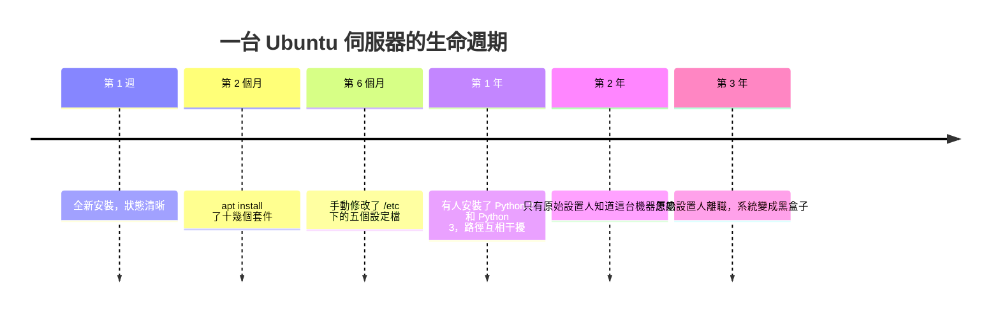
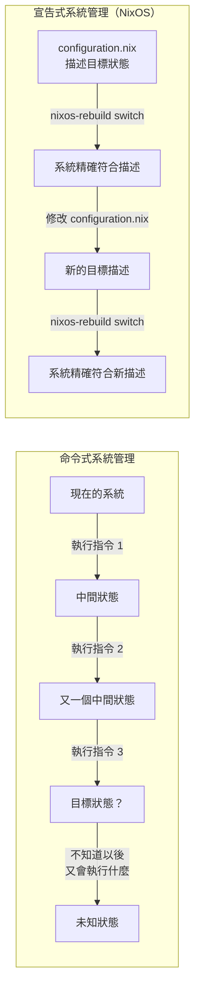
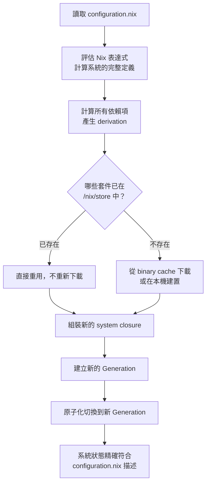
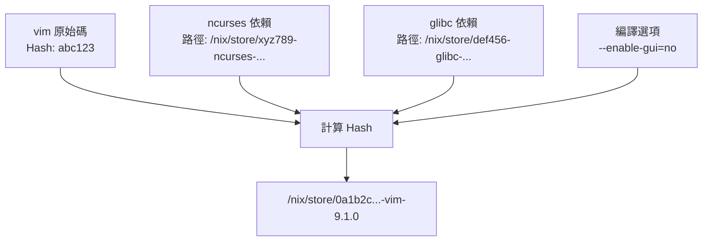
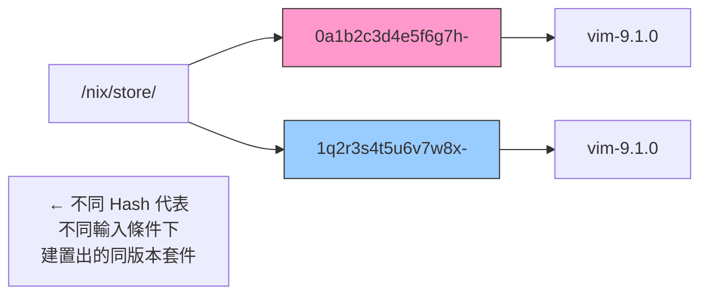
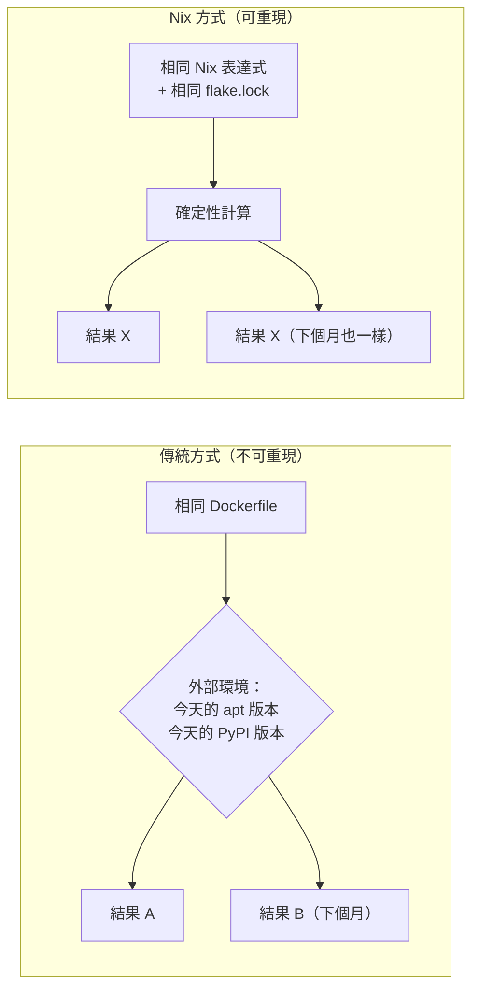
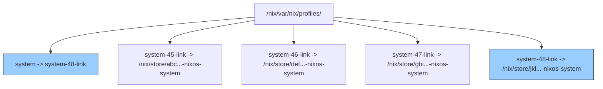
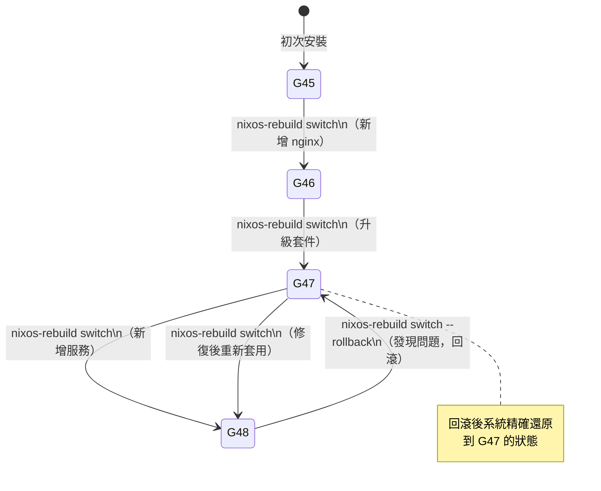
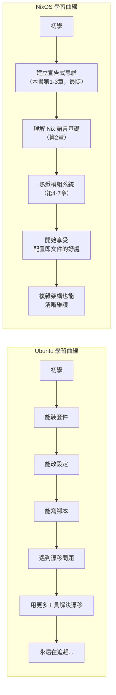

# 第1章：NixOS 的設計哲學

## 本章學習目標

完成本章後，你將能夠：

1. 用自己的話解釋「宣告式配置（Declarative Configuration）」與「命令式配置」的差異
2. 說明不可變基礎設施（Immutable Infrastructure）為何讓系統更可靠
3. 理解世代（Generation）機制與 Rollback 的運作方式
4. 對比 NixOS 與 Ubuntu／Arch Linux 的核心設計差異
5. 理解可重現建置（Reproducible Build）在實際工程場景中的價值

## 前置知識

- 基本 Linux 終端操作（能下指令即可）
- 曾使用過任何 Linux 發行版（非必要，但有助理解對比）

---

## 1.1 傳統 Linux 的問題

### 一台正常運作的伺服器，是怎麼壞掉的？

很多時候，答案不是「某天突然崩潰」。

而是：**慢慢漂移，直到沒有人說得清楚現在的狀態是什麼。**

在多數 Linux 發行版中，管理員通常這樣工作：

```bash
# 安裝 Nginx
sudo apt install nginx

# 修改設定檔
sudo vim /etc/nginx/nginx.conf

# 重啟服務
sudo systemctl restart nginx

# 一週後，再裝另一個套件
sudo apt install certbot

# 幾個月後，手動修改了某個 systemd unit...
sudo vim /etc/systemd/system/myapp.service
```

每一行指令本身都合理。

問題在於：**這些修改從未被完整記錄在任何一個地方。**

### 時間軸：系統如何逐漸失控



### 什麼是配置漂移（Configuration Drift）？

配置漂移（Configuration Drift）是指：

**系統的實際狀態，與任何已知文件或記憶之間的差距，隨時間不斷擴大的現象。**

它的症狀包括：

- 不知道當初為什麼安裝了某個套件
- 同一份部署腳本，在不同機器跑出不同結果
- 「我的電腦沒問題，但你的伺服器壞了」
- 不敢升級，因為不知道升級會打破什麼
- 「這台機器千萬不能重啟，一重啟不知道能不能起來」

這不是個別工程師的失誤。

這是**命令式系統管理（Imperative System Management）的結構性缺陷**。

### 命令式的本質問題

命令式管理的邏輯是：**描述你要執行什麼動作。**

```bash
# 命令式：我要「做什麼」
sudo apt install nginx
sudo systemctl enable nginx
sudo ufw allow 80/tcp
```

這種方式的根本問題是：

- 指令是有順序的，但系統歷史無法重播
- 同樣的指令，在不同時間點，可能產生不同結果（套件版本不同、相依套件已存在等）
- 沒有「描述目標狀態」的能力——只有「逐步到達某個狀態」的過程

NixOS 選擇了完全不同的路。

---

## 1.2 宣告式配置：描述「是什麼」而非「做什麼」

### 換一種思考方式

宣告式配置（Declarative Configuration）的核心思想是：

**不描述「要執行的步驟」，而是描述「系統應該長什麼樣子」。**

讓我們用一個對比來感受差異：



### 第一個 NixOS 配置範例

這是一個完整的 NixOS 最小配置範例。

它描述了一台機器的「目標狀態」——不是「如何建立」，而是「應該是什麼」：

```nix
# /etc/nixos/configuration.nix
# 每個 NixOS 模組都必須以這個函式簽名開頭
# config 和 pkgs 是 NixOS 注入的參數；... 表示接受其他未列出的參數
{ config, pkgs, ... }:

{
  imports = [
    ./hardware-configuration.nix
  ];

  # 主機名稱
  networking.hostName = "myserver";

  # 時區
  time.timeZone = "Asia/Taipei";

  # 啟用 Nginx 服務
  # 宣告「Nginx 應該存在且啟動」，而不是「執行 apt install nginx」
  services.nginx.enable = true;

  # 建立使用者 alice
  # 宣告「alice 這個使用者應該存在」，而不是「執行 useradd」
  users.users.alice = {
    isNormalUser = true;
    extraGroups = [ "wheel" ];  # wheel 群組代表可以使用 sudo
  };

  # 安裝系統套件
  environment.systemPackages = with pkgs; [
    vim
    git
    curl
  ];

  # stateVersion 標記這個配置最初建立時的 NixOS 版本
  # 不要隨意更改這個值——它用於處理有狀態資料的格式遷移
  system.stateVersion = "25.05";
}
```

這個檔案描述了一個完整的系統狀態。

**任何人閱讀這個檔案，都能立刻知道這台機器應該長什麼樣子。**

### `sudo nixos-rebuild switch` 做了什麼？

當你執行這個指令時，NixOS 會：



整個過程是**原子化（atomic）**的：

要麼完全切換到新狀態，要麼完全保持舊狀態。

不存在「切換到一半」的中間狀態。

---

## 1.3 不可變基礎設施：/nix/store 的設計邏輯

### 先看一個現象

在 NixOS 系統中，執行以下指令：

```bash
ls /nix/store | head -10
```

你會看到類似這樣的輸出：

```
0a1b2c3d4e5f6g7h8i9j0k1l2m3n4o5p-vim-9.1.0
1q2r3s4t5u6v7w8x9y0z1a2b3c4d5e6f-nginx-1.26.2
2g3h4i5j6k7l8m9n0o1p2q3r4s5t6u7v-git-2.50.0
3w4x5y6z7a8b9c0d1e2f3g4h5i6j7k8l-openssl-3.3.2
4m5n6o7p8q9r0s1t2u3v4w5x6y7z8a9b-bash-5.2.37
```

每個套件路徑前面都有一串看似隨機的 Hash 值。

這不是隨機的。這是 NixOS 不可變基礎設施（Immutable Infrastructure）的核心機制。

### 為什麼套件路徑含 Hash？

這個 Hash 是根據**該套件的完整輸入**計算出來的，包括：

- 原始碼（或二進位檔案）的 Hash
- 所有編譯時依賴項的路徑（每個依賴也有自己的 Hash）
- 編譯器版本
- 所有編譯選項和環境變數



這代表：**只要任何一個輸入發生變化，最終路徑就完全不同。**

### /nix/store 路徑結構說明



**重點：** `/nix/store` 中的所有路徑都是**唯讀的（read-only）**。

套件一旦建置完成，就永遠不會被修改。

新版本會建立新的路徑，而不是覆蓋舊的。

### 不可變的三大優勢

**優勢一：多個版本可以同時存在**

```bash
# 這在 NixOS 是完全正常的
ls /nix/store | grep vim
# /nix/store/0a1b2c...-vim-9.0.2
# /nix/store/9z8y7x...-vim-9.1.0
```

不同使用者、不同專案，可以同時使用不同版本，互不干擾。

**優勢二：移除套件不留殘餘**

傳統套件管理器在移除套件時，常常無法完全清除所有殘留的設定檔和依賴項。

Nix 的設計讓移除變得乾淨：不再被引用的路徑，可以由 `nix-collect-garbage` 安全清除。

**優勢三：隔離副作用**

每個套件只能依賴在其 Hash 計算中明確列出的其他套件。

不存在「全域安裝」造成的隱性依賴問題。

---

## 1.4 可重現建置：相同輸入，永遠得到相同輸出

### 一個常見的工程問題

許多工程師都遇過這樣的狀況：

> 「上個月同一份 Dockerfile，今天 build 出來的 image 執行起來結果不一樣。」

原因可能是：

- `apt-get install` 安裝到了新版套件
- 依賴的基礎 image 被更新
- Python 套件抓到了新版本

這種不確定性在生產環境中是非常危險的。

### Nix 的解法：純函式計算（Pure Evaluation）

可重現建置（Reproducible Build）的核心邏輯是：

**把系統建置過程視為一個數學函式。**

```
f(輸入) = 輸出

相同的輸入 → 永遠相同的輸出
不同的輸入 → 必然不同的輸出（且路徑不同，可以區分）
```

Nix 稱這個特性為**純函式計算（Pure Evaluation）**。

在建置過程中：

- 沒有網路存取（除非明確宣告，且需要提供 Hash 驗證）
- 沒有對外部環境變數的隱性依賴
- 沒有時間戳記的影響



### 具體範例：確定版本的配置

以下配置明確指定了每個依賴的版本，確保可重現性：

```nix
# flake.nix 中的 inputs 區塊
# 每個依賴都鎖定在特定的 Git commit
{
  inputs = {
    # 鎖定到 NixOS 25.05 這個穩定分支
    nixpkgs.url = "github:NixOS/nixpkgs/nixos-25.05";

    # home-manager 也鎖定到對應版本
    home-manager = {
      url = "github:nix-community/home-manager/release-25.05";
      inputs.nixpkgs.follows = "nixpkgs";
    };
  };
  # ... 其餘省略
}
```

所有版本資訊會被記錄在 `flake.lock` 檔案中。

**只要 `flake.lock` 相同，任何人、任何時間、任何機器建置的結果都會相同。**

這份鎖定檔案就是可重現性的保證。

---

## 1.5 Generation 與 Rollback

### 每次建置都留下足跡

每次執行 `sudo nixos-rebuild switch`，NixOS 不會覆蓋舊的系統設定。

它會建立一個新的世代（Generation）。

你可以用以下指令查看目前的世代列表：

```bash
# 列出所有系統世代
sudo nix-env --list-generations --profile /nix/var/nix/profiles/system
```

輸出類似：

```
  45   2025-10-01 09:12:33
  46   2025-10-15 14:23:44
  47   2026-01-20 08:05:12
  48   2026-04-03 11:30:58   (current)
```

每一行代表一個世代，以及它被建立的時間。

### Generation 在檔案系統中的結構



`system` 符號連結（symlink）指向目前啟用的世代。

切換世代就是更新這個符號連結，因此是原子化的。

### Rollback：撤銷任何變更

假設你升級了某個服務，發現新版本有問題。

你有兩種 Rollback 方式：

**方式一：指令回滾**

```bash
# 回滾到上一個世代
sudo nixos-rebuild switch --rollback
```

**方式二：開機選單選擇世代**

重開機時，GRUB 或 systemd-boot 開機選單會列出所有可用世代：

```
NixOS - Default (Generation 48)
NixOS - Generation 47 (2026-04-03)
NixOS - Generation 46 (2026-01-20)
NixOS - Generation 45 (2025-10-15)
```

選擇任一世代即可開機進入該狀態。

### Generation 切換示意圖



### Rollback 不代表「無限儲存空間」

世代保留在 `/nix/store` 中，會佔用磁碟空間。

當你確認舊的世代不再需要時，可以清理：

```bash
# 刪除 30 天前的所有世代
sudo nix-collect-garbage --delete-older-than 30d

# 清理完成後，執行 nixos-rebuild boot 確保開機選單更新
sudo nixos-rebuild boot
```

---

## 1.6 與傳統 Linux 發行版的比較

### 設計哲學對比表

| 比較項目 | Ubuntu / Debian | Arch Linux | NixOS |
|---|---|---|---|
| **配置方式** | 命令式（逐步執行指令） | 命令式（手動編輯設定檔） | 宣告式（描述目標狀態） |
| **套件安裝** | `apt install`，修改全域狀態 | `pacman -S`，修改全域狀態 | 寫入 `configuration.nix`，整體重建 |
| **設定檔管理** | 散落在 `/etc` 各處，需手動追蹤 | 散落在 `/etc` 各處，需手動追蹤 | 集中在 `configuration.nix` 及 imports |
| **版本追蹤** | 需另外使用 Git、Ansible 等工具 | 需另外使用工具 | 內建於配置文件本身 |
| **系統回滾** | 困難，需手動備份 | 困難（Btrfs 快照除外） | 原生支援，開機選單即可選擇 |
| **重現系統** | 困難，依賴腳本正確性和時間點 | 困難 | 原生支援，相同 `configuration.nix` = 相同系統 |
| **依賴隔離** | 全域安裝，版本可能衝突 | 全域安裝，版本可能衝突 | 路徑隔離，多版本共存 |
| **學習曲線** | 平緩，沿用傳統習慣 | 中等，需深入理解 Linux | 較陡，需建立新思維模型 |
| **社群與文件** | 龐大，資源豐富 | 豐富，ArchWiki 出名 | 成長中，官方文件完整 |

### NixOS 不是「更難的 Linux」

初次接觸 NixOS 的人，常常有這樣的誤解：

> 「這太複雜了，只有高手才用得了。」

這個誤解來自於**用舊的思維模型去理解一套新的設計哲學**。

以下是更精確的描述：

- Ubuntu 的學習曲線是**平緩但無止盡**的。你隨時都在學習新的指令、新的設定位置、新的 workaround。
- NixOS 的學習曲線是**前陡後平**的。前三章最難：你需要接受宣告式思維、理解 Nix 表達式。一旦建立正確思維模型，後續的複雜配置反而比傳統方式更直覺。



### 什麼情況下適合選擇 NixOS？

NixOS 特別適合以下場景：

- 你需要管理多台機器，並確保配置一致
- 你的工作環境需要高度重現性（如開發、研究）
- 你想要系統配置能被版本控制（Git）
- 你重視系統穩定性，需要隨時可以 Rollback
- 你計劃長期維護同一套環境

對於以下場景，NixOS 可能需要更多前期投資：

- 你只是想快速測試某個服務（但 NixOS 也能做，只是需要先學習）
- 你的團隊成員完全沒有接觸過函數式程式設計的概念

---

## 本章小結

本章建立了理解 NixOS 最重要的思維基礎：

1. **配置漂移是傳統系統管理的結構性缺陷。** 命令式操作的本質，使得系統狀態隨時間變得不可預測。

2. **宣告式配置把問題的框架從「做什麼」改為「是什麼」。** `configuration.nix` 就是系統的完整定義，任何人都能讀懂現在的機器應該長什麼樣。

3. **不可變基礎設施讓系統組件之間不會互相污染。** `/nix/store` 中每個路徑都含有 Hash，確保同一套件的不同版本可以安全共存。

4. **可重現建置讓「換一台機器也能得到一樣的系統」成為可能。** 相同的 `configuration.nix` 加上相同的 `flake.lock`，無論何時何地，都得到相同的系統。

5. **Generation 機制讓所有變更都可以無風險撤銷。** 任何 `nixos-rebuild switch`，都可以用 `--rollback` 完整還原。

### 下一章預告

理解了 NixOS 的設計哲學之後，你需要掌握一個工具：**Nix 語言**。

第 2 章將介紹 Nix 表達式語法——它是理解 `configuration.nix` 背後邏輯的鑰匙。

你會學到 Attribute Set、List、Function、`let/in` 等概念，並在 Nix REPL（互動式求值環境）中直接練習。

不需要有函數式程式設計的背景；我們從零開始建立這套思維。
