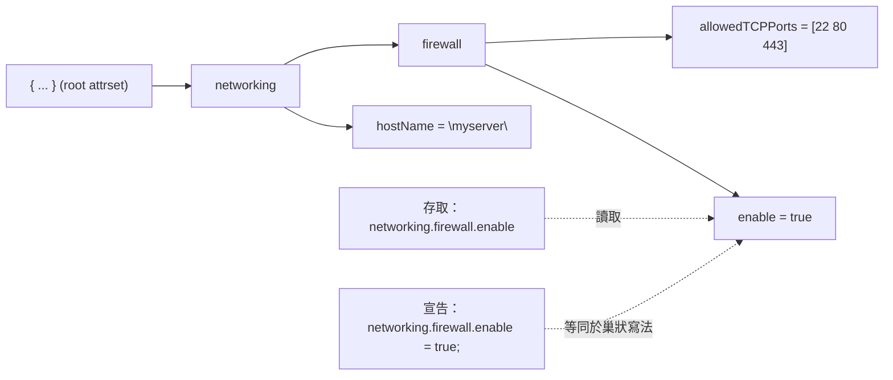
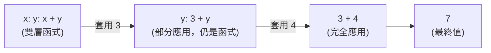
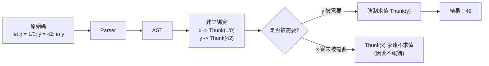

# 第2章：Nix 語言基礎

## 本章學習目標

完成本章後，你將能夠：

1. 說明為什麼 NixOS 需要學習一門專屬語言
2. 識別並使用 Nix 的基本型別
3. 建立與操作屬性集（Attribute Set）
4. 撰寫接受參數的 Nix 函式
5. 使用 `let/in`、`import`、`inherit`、`with` 等常用語法
6. 在 `nix repl` 中即時測試任何 Nix 表達式

## 前置知識

- 完成第1章
- 基本程式設計概念（變數、函式）有幫助但非必要

---

## 2.1 為什麼一定要學 Nix 語言

打開 `/etc/nixos/configuration.nix`，你看到的不是 YAML，不是 JSON，也不是 TOML。

你看到的是：

```nix
{ config, pkgs, ... }:

{
  networking.hostName = "nixos";

  environment.systemPackages = with pkgs; [
    git
    vim
  ];

  system.stateVersion = "25.05";
}
```

這是 **Nix 語言**（Nix Expression Language）。

它是一種專為描述套件與系統配置設計的函數式語言。

---

### NixOS 配置 = Nix 程式

很多初學者遇到第一個障礙：

「我只想改個設定，為什麼要學一門程式語言？」

原因很直接：

NixOS 的整個系統——套件選擇、服務啟用、使用者定義——都是透過 Nix 語言**求值（evaluate）**之後產生的。

這意味著：

- 沒有「設定檔案格式解析器」這個中間層
- 配置本身就是程式，可以用變數、函式、條件判斷
- 錯誤訊息是語言層級的錯誤，而非格式錯誤

理解 Nix 語言 = 理解 NixOS 的運作方式。

---

### 本章的學習目標

你不需要成為 Nix 程式設計師。

本章目標只有一個：

**讀懂 `configuration.nix` 的大部分內容。**

我們會依序介紹：

- 基本資料型別
- 最重要的資料結構（屬性集）
- 函式語法
- 幾個常用關鍵字

學完之後，`configuration.nix` 裡的每一行對你來說都不再是謎。

---

## 2.2 基本型別

Nix 語言有以下幾種基本型別：

| 型別 | 說明 | 範例 |
|------|------|------|
| String | 字串 | `"hello world"` |
| Integer | 整數 | `42` |
| Float | 浮點數 | `3.14` |
| Boolean | 布林值 | `true` / `false` |
| Path | 路徑 | `./config.nix` |
| Null | 空值 | `null` |

用 `nix repl` 觀察這些型別的行為：

```nix
"hello world"     # 字串：用雙引號包圍
42                # 整數：直接寫數字
3.14              # 浮點數
true              # 布林值（小寫）
./config.nix      # 路徑：注意不加引號
null              # 空值
```

---

### Path 型別特別說明

初學者最容易混淆的是 Path 型別。

`./config.nix` 和 `"./config.nix"` 看起來很像，但意義完全不同：

- `./config.nix`：這是一個 **Path 型別**，Nix 會將它解析成絕對路徑，並追蹤這個檔案
- `"./config.nix"`：這只是一個**字串**，Nix 不會對它做任何路徑解析

在 `import` 和 `imports = [ ... ]` 裡，必須用 Path 型別：

```nix
# 正確：Path 型別
imports = [
  ./hardware-configuration.nix
  ./services.nix
];

# 錯誤：字串型別，Nix 會報錯
imports = [
  "./hardware-configuration.nix"  # 這是字串，不是 Path
];
```

---

## 2.3 Attribute Set：Nix 最核心的資料結構

屬性集（Attribute Set）是 Nix 語言最重要的資料結構。

幾乎 NixOS 的所有配置都是屬性集。

---

### 基本語法

屬性集用大括號 `{ }` 包圍，每個鍵值對以分號 `;` 結尾：

```nix
{
  name = "alice";
  age  = 30;
  isAdmin = true;
}
```

對熟悉其他語言的讀者來說：

- 類似 JSON 的 object
- 類似 Python 的 dict
- 類似 JavaScript 的 object

但有一個關鍵差異：**屬性集裡的值是惰性求值的**（稍後第 2.12 節會說明）。

---

### 存取屬性

用點號 `.` 存取屬性集的值：

```nix
let
  person = { name = "alice"; age = 30; };
in
person.name     # 結果："alice"
```

---

### 巢狀屬性集

屬性集可以無限巢狀：

```nix
{
  networking = {
    hostName = "myserver";
    firewall = {
      enable = true;
      allowedTCPPorts = [ 22 80 443 ];
    };
  };
}
```

巢狀屬性集有一個簡寫語法（dot notation）：

```nix
{
  networking.hostName = "myserver";
  networking.firewall.enable = true;
}
```

這兩種寫法完全等價。

你在 `configuration.nix` 裡看到的 `services.openssh.enable = true;` 就是這種寫法。

下圖以樹狀結構呈現巢狀屬性集的內部佈局，以及 `.` 存取路徑與「點記法宣告」如何對應到同一棵樹：



可以看出：無論用巢狀大括號還是點記法宣告，結果都是同一棵屬性樹；`.` 存取就是沿著這棵樹往下走。

---

### 合併運算符 `//`

兩個屬性集可以用 `//` 合併。右側的值會覆蓋左側的同名屬性：

```nix
let
  defaults = { color = "blue"; size = 10; };
  overrides = { color = "red"; };
in
defaults // overrides
# 結果：{ color = "red"; size = 10; }
```

---

### 測試屬性是否存在：`?` 運算符

```nix
let
  cfg = { enable = true; };
in
cfg ? enable      # 結果：true
cfg ? port        # 結果：false
```

---

### 預設值：`or` 運算符

存取不存在的屬性時，可以用 `or` 提供預設值：

```nix
let
  cfg = { enable = true; };
in
cfg.port or 8080   # 結果：8080（因為 cfg.port 不存在）
```

---

### 這就是 configuration.nix 的骨架

看一眼典型的 `configuration.nix`：

```nix
{ config, pkgs, ... }:

{
  networking.hostName = "nixos";
  networking.firewall.enable = true;

  services.openssh.enable = true;

  users.users.alice = {
    isNormalUser = true;
    extraGroups = [ "wheel" ];
  };

  system.stateVersion = "25.05";
}
```

現在你能看出：

- 整個檔案的主體是一個大的屬性集 `{ ... }`
- `networking`、`services`、`users` 都是巢狀屬性集的鍵
- `users.users.alice` 是三層巢狀

這些都是屬性集。

---

## 2.4 List

List（列表）是 Nix 的另一個基本資料結構。

---

### 基本語法

```nix
[ 1 2 3 ]

[ "git" "vim" "curl" ]

[ true false true ]
```

注意：**元素之間用空格分隔，不用逗號**。

這是初學者最常犯的錯誤之一。

---

### 串接運算符 `++`

兩個 List 可以用 `++` 串接：

```nix
[ 1 2 ] ++ [ 3 4 ]
# 結果：[ 1 2 3 4 ]
```

---

### List 在 configuration.nix 中的使用

你會在 `configuration.nix` 裡大量看到 List：

```nix
{ config, pkgs, ... }:

{
  # 安裝套件：List of derivations
  environment.systemPackages = with pkgs; [
    git
    vim
    curl
    htop
  ];

  # 開放防火牆埠號：List of integers
  networking.firewall.allowedTCPPorts = [ 22 80 443 ];

  # 使用者群組：List of strings
  users.users.alice = {
    isNormalUser = true;
    extraGroups = [ "wheel" "networkmanager" "docker" ];
  };

  system.stateVersion = "25.05";
}
```

---

## 2.5 Function：Nix 是函數式語言

Nix 是一門函數式語言。

在 Nix 中，**函式是第一等公民**（first-class citizen）——函式可以作為值傳遞、作為參數接收、作為回傳值使用。

---

### 單一參數函式

Nix 函式的語法是 `參數: 回傳值`：

```nix
x: x + 1
```

呼叫函式時，不用括號，直接在函式後面接參數：

```nix
(x: x + 1) 5
# 結果：6
```

這和大多數語言的 `f(x)` 語法不同。

Nix 的函式呼叫是 `f x`（空格分隔）。

---

### 多個參數：Currying

Nix 原生只有單參數函式。

多個參數可以透過 **currying**（柯里化）實現：

```nix
x: y: x + y
```

呼叫：

```nix
(x: y: x + y) 3 4
# 結果：7
```

下圖呈現 `x: y: x + y` 在 Nix 中真實的求值過程——它其實是「函式回傳函式」，每次傳入一個參數就消耗一層：



這就是 **currying**：多參數函式被拆成一連串單參數函式，因此 `f 3` 是合法的（得到一個新函式），`f 3 4` 才得到最終結果。

---

### 屬性集參數（最常見的寫法）

更常見的做法是接受一個屬性集作為參數：

```nix
{ name, age }: "我是 ${name}，今年 ${toString age} 歲"
```

呼叫：

```nix
({ name, age }: "我是 ${name}，今年 ${toString age} 歲") { name = "alice"; age = 30; }
# 結果："我是 alice，今年 30 歲"
```

---

### 帶預設值的參數

屬性集參數可以為某些鍵設定預設值：

```nix
{ name, age ? 18 }: "我是 ${name}，今年 ${toString age} 歲"
```

呼叫時可以省略有預設值的參數：

```nix
({ name, age ? 18 }: "我是 ${name}，今年 ${toString age} 歲") { name = "bob"; }
# 結果："我是 bob，今年 18 歲"
```

---

### 收集其餘參數：`...` 與 `@`

如果函式不想列出所有可能的屬性，可以用 `...` 忽略其餘參數：

```nix
{ name, ... }: "Hello ${name}"
```

如果需要在函式體內使用整個屬性集，可以用 `@` 綁定：

```nix
{ name, ... }@args: "Hello ${name}, 你傳入了 ${toString (builtins.length (builtins.attrNames args))} 個參數"
```

---

### configuration.nix 的函式簽名

現在你能理解 `configuration.nix` 的開頭了：

```nix
{ config, pkgs, ... }:
```

這是一個**函式定義**，接受一個屬性集作為參數，其中：

- `config`：目前系統的完整配置（用於讀取其他模組的設定）
- `pkgs`：nixpkgs 套件集合（用於安裝套件）
- `...`：忽略其他可能傳入的屬性（如 `lib`、`modulesPath` 等）

整個 `configuration.nix` 就是一個**函式**，接受這些參數，回傳一個屬性集描述系統配置。

NixOS 會呼叫這個函式，傳入正確的 `config` 和 `pkgs`，然後用回傳的屬性集建構系統。

---

## 2.6 let/in：定義局部變數

`let/in` 是在 Nix 表達式中定義局部變數的語法。

---

### 基本語法

```nix
let
  變數名稱 = 值;
in
使用變數的表達式
```

範例：

```nix
let
  name = "alice";
  greeting = "Hello, ${name}!";
in
greeting
# 結果："Hello, alice!"
```

---

### 在配置中使用 let/in

`let/in` 在大型配置中非常有用，可以避免重複：

```nix
{ config, pkgs, ... }:

let
  myUser = "alice";
  myEditor = pkgs.neovim;
  commonPackages = with pkgs; [ git curl wget ];
in
{
  users.users.${myUser} = {
    isNormalUser = true;
    extraGroups = [ "wheel" ];
  };

  environment.systemPackages = commonPackages ++ [
    myEditor
    pkgs.firefox
  ];

  system.stateVersion = "25.05";
}
```

`let` 區塊中定義的變數只在對應的 `in` 表達式中有效，不會污染外部範圍。

---

### 多行 let 定義

`let` 可以定義多個變數，變數之間可以互相參照（但不能循環參照）：

```nix
let
  base = 10;
  doubled = base * 2;
  message = "doubled 是 ${toString doubled}";
in
message
# 結果："doubled 是 20"
```

---

## 2.7 import：載入其他檔案

`import` 讓你載入另一個 `.nix` 檔案，並取得其求值結果。

---

### 基本用法

假設有一個 `greet.nix`：

```nix
name: "Hello, ${name}!"
```

在另一個檔案中：

```nix
let
  greet = import ./greet.nix;
in
greet "alice"
# 結果："Hello, alice!"
```

---

### 傳遞參數

如果被載入的檔案是一個接受屬性集的函式，可以直接傳遞：

```nix
import ./module.nix { inherit pkgs; }
```

這等同於：

```nix
(import ./module.nix) { pkgs = pkgs; }
```

---

### 這是 NixOS imports 機制的基礎

`configuration.nix` 裡的：

```nix
imports = [
  ./hardware-configuration.nix
  ./services.nix
];
```

底層使用的就是 `import`。

NixOS 會自動將這些模組載入，並將結果合併成最終的系統配置。

---

## 2.8 inherit：簡化屬性複製

`inherit` 是一個語法糖，用來簡化「把某個變數名稱作為屬性名稱複製進屬性集」的操作。

---

### 基本用法

沒有 `inherit` 的寫法：

```nix
let
  name = "alice";
  age  = 30;
in
{
  name = name;   # 重複寫了兩次 name
  age  = age;    # 重複寫了兩次 age
}
```

用 `inherit` 簡化：

```nix
let
  name = "alice";
  age  = 30;
in
{
  inherit name age;   # 等同於 name = name; age = age;
}
```

---

### 從另一個屬性集繼承

`inherit (set) attr;` 的形式可以從某個屬性集中取出特定屬性：

```nix
let
  person = { name = "alice"; age = 30; email = "alice@example.com"; };
in
{
  inherit (person) name age;   # 等同於 name = person.name; age = person.age;
}
# 結果：{ name = "alice"; age = 30; }
```

---

### 常見使用情境

在 NixOS 配置中，`inherit` 最常出現在傳遞 `pkgs` 給子模組時：

```nix
{ pkgs, ... }:

{
  imports = [
    (import ./my-module.nix { inherit pkgs; })
  ];

  system.stateVersion = "25.05";
}
```

---

## 2.9 with：展開 attribute set

`with` 讓你在後續表達式中直接使用屬性集的屬性，不需要每次都寫前綴。

---

### 基本語法

```nix
with 屬性集; 表達式
```

範例：

```nix
with { a = 1; b = 2; c = 3; };
a + b + c
# 結果：6
```

---

### 最常見的使用：with pkgs

你在 `configuration.nix` 最常看到的是：

```nix
{ config, pkgs, ... }:

{
  environment.systemPackages = with pkgs; [
    git
    vim
    curl
    htop
    tree
    ripgrep
  ];

  system.stateVersion = "25.05";
}
```

`with pkgs; [ git vim curl ]` 等同於：

```nix
[ pkgs.git pkgs.vim pkgs.curl ]
```

省去了每個套件前面的 `pkgs.` 前綴。

---

### 注意事項

`with` 會引入作用域，可能造成名稱遮蔽（name shadowing）。

如果作用域中已有同名變數，`with` 引入的屬性**不會**覆蓋它：

```nix
let
  git = "my-custom-git";
in
with pkgs;
git   # 結果："my-custom-git"（let 定義的 git，而非 pkgs.git）
```

在大型配置中，建議在小範圍內使用 `with`，避免意外的名稱遮蔽。

---

## 2.10 字串插值

Nix 支援在字串中插入表達式的值。

---

### 基本語法

用 `${ }` 插入變數或表達式：

```nix
let
  name = "alice";
  version = 25;
in
"Hello, ${name}! NixOS version is ${toString version}.05"
# 結果："Hello, alice! NixOS version is 25.05"
```

注意：插入的值必須是字串，如果是整數需要用 `toString` 轉換。

---

### 多行字串

Nix 支援用兩個單引號 `''...''` 定義多行字串：

```nix
''
  #!/bin/bash
  echo "Hello from NixOS"
  echo "Version: 25.05"
''
```

多行字串會自動去除每行的公共前導空白（leading whitespace），所以縮排不會影響實際內容。

---

### 在配置中的使用

字串插值常用於動態生成配置值：

```nix
{ config, pkgs, ... }:

let
  hostName = "myserver";
  domain   = "example.com";
in
{
  networking.hostName = hostName;

  services.nginx = {
    enable = true;
    virtualHosts."${hostName}.${domain}" = {
      root = "/var/www/${hostName}";
    };
  };

  system.stateVersion = "25.05";
}
```

---

## 2.11 if/then/else

Nix 的條件表達式語法如下：

```nix
if 條件 then 真值 else 假值
```

---

### 基本範例

```nix
let
  isProduction = true;
in
if isProduction then "prod-server" else "dev-server"
# 結果："prod-server"
```

---

### 在配置中使用

`if/then/else` 常用於根據某個旗標決定配置值：

```nix
{ config, pkgs, ... }:

let
  enableGUI = true;
in
{
  environment.systemPackages = with pkgs; [
    git
    vim
  ] ++ (if enableGUI then [ firefox thunderbird ] else []);

  services.xserver.enable = if enableGUI then true else false;

  system.stateVersion = "25.05";
}
```

注意：Nix 的 `if/then/else` 是**表達式**，不是語句，所以**一定要有 `else` 分支**。

---

## 2.12 惰性求值（Lazy Evaluation）

Nix 採用**惰性求值**（Lazy Evaluation）策略：

表達式的值只在**真正需要**時才會被計算。

---

### 什麼是惰性求值

在大多數語言中，賦值時就會立即計算：

```python
# Python（急切求值）
x = 1 / 0   # 立即拋出 ZeroDivisionError
```

在 Nix 中：

```nix
# Nix（惰性求值）
let
  x = 1 / 0;   # 不會立即報錯
  y = 42;
in
y   # 結果：42（因為我們只用到 y，x 從未被求值）
```

下圖描述 Nix 從原始碼到實際值的整體流程，重點在於中間的 **Thunk**（懸置運算）——綁定發生時並不會立刻計算，只有被使用時才會強制求值：



關鍵在於：`x` 的值只是被「包」成 Thunk 放著，沒被任何最終結果用到就不會被打開——這正是 NixOS 模組系統能放上百個未啟用服務卻不卡頓的原因。

---

### 對 NixOS 配置的影響

惰性求值讓 NixOS 可以在同一份配置中定義互相排斥的選項，而不會因為「不啟用的部分包含錯誤」而出問題：

```nix
{ config, pkgs, ... }:

{
  # 只有 services.postgresql.enable = true 時，
  # 這些複雜的 PostgreSQL 套件才會被真正求值
  services.postgresql = {
    enable = false;   # 關閉時，下面的設定完全不會被求值
    package = pkgs.postgresql_16;
    settings = {
      max_connections = 200;
      shared_buffers  = "256MB";
    };
  };

  system.stateVersion = "25.05";
}
```

這就是為什麼你可以安全地在一份 `configuration.nix` 裡定義很多服務的配置，而不擔心效能或錯誤——未啟用的部分根本不會被求值。

---

### 模組系統的運作基礎

NixOS 的模組系統大量依賴惰性求值。

所有模組的 `options` 定義是預先載入的，但 `config` 的實際值只在需要時才求值。

這讓整個系統能夠：

1. 載入數百個模組定義
2. 只求值真正被使用的部分
3. 保持高效的評估速度

---

## 2.13 Derivation 概念初探

在 Nix 的世界裡，所有可被「建置」的東西都是**建構描述**（Derivation）。

---

### 什麼是 Derivation

把 Derivation 想成一份**建置食譜**：

```text
Derivation = 食譜

食譜包含：
  - 原料（build inputs）
  - 建置步驟（build script）
  - 產出位置（output path in /nix/store）
```

當 Nix 建置一個 Derivation，結果會存放在 `/nix/store` 下的唯一路徑中：

```text
/nix/store/abc123xyz-git-2.47.1/
```

路徑前面的 hash（`abc123xyz`）是根據**所有輸入的完整資訊**計算的。

任何輸入改變——原始碼版本、依賴套件、編譯器版本——hash 就會改變，產生全新的路徑。

這是 NixOS 可重現性的根基。

---

### pkgs.git 就是一個 Derivation

你在 `configuration.nix` 裡寫的：

```nix
environment.systemPackages = [ pkgs.git ];
```

`pkgs.git` 就是一個 Derivation，描述如何從原始碼建置 Git。

當你執行 `nixos-rebuild switch` 時：

1. Nix 評估配置，找到所有需要的 Derivation
2. 檢查 `/nix/store` 中是否已有這些 Derivation 的建置結果
3. 如果沒有，從 binary cache 下載或在本機建置
4. 建立 system closure（所有所需 Derivation 的集合）

你不需要深入了解 Derivation 的內部運作。

現階段只需要記住一件事：

**套件 = Derivation = 一份有唯一身分的建置食譜**

---

## 2.14 nix repl：互動式測試環境

`nix repl` 是學習 Nix 語言最好的工具。

它讓你即時輸入 Nix 表達式，立刻看到結果。

---

### 啟動 nix repl

```bash
$ nix repl
```

你會看到提示符：

```
Welcome to Nix 2.24.x. Type :? for help.

nix-repl>
```

---

### 基本操作示範

在 repl 中測試各種 Nix 表達式：

```
nix-repl> 1 + 1
2

nix-repl> "hello" + " " + "world"
"hello world"

nix-repl> { a = 1; b = 2; }
{ a = 1; b = 2; }

nix-repl> { a = 1; b = 2; }.a
1

nix-repl> [ 1 2 3 ] ++ [ 4 5 ]
[ 1 2 3 4 5 ]

nix-repl> let x = 10; in x * x
100

nix-repl> (x: x + 1) 41
42
```

---

### 載入 nixpkgs

使用 `:l` 指令載入 nixpkgs，可以直接測試套件相關操作：

```
nix-repl> :l <nixpkgs>
Added 20000 variables.

nix-repl> pkgs.git.version
"2.47.1"

nix-repl> pkgs.git.pname
"git"

nix-repl> builtins.typeOf pkgs.git
"set"
```

---

### 常用 repl 指令

| 指令 | 說明 |
|------|------|
| `:l <nixpkgs>` | 載入 nixpkgs 套件集 |
| `:l ./file.nix` | 載入本地 nix 檔案 |
| `:t 表達式` | 顯示表達式的型別 |
| `:q` | 離開 repl |
| Tab | 自動補全屬性名稱 |

---

### Tab 補全

在 repl 中輸入 `pkgs.` 後按 Tab，會顯示所有可用的套件：

```
nix-repl> pkgs.git<Tab>
pkgs.git              pkgs.git-absorb        pkgs.git-agecrypt
pkgs.git-annex        pkgs.git-branchless    pkgs.git-bug
...
```

這在探索 nixpkgs 裡有哪些套件時非常有用。

---

### 使用 repl 驗證配置邏輯

在修改 `configuration.nix` 之前，可以先在 repl 中測試邏輯：

```
nix-repl> :l <nixpkgs>

nix-repl> let enableGUI = true; in if enableGUI then "開啟桌面" else "僅終端機"
"開啟桌面"

nix-repl> with lib; concatStringsSep ", " [ "git" "vim" "curl" ]
"git, vim, curl"
```

repl 讓你在不重建整個系統的情況下，快速確認 Nix 表達式的行為。

---

## 本章小結

本章涵蓋了 Nix 語言的核心語法。

以下是最重要的幾個概念：

---

### 最關鍵的知識點

**1. 屬性集是一切的基礎**

`configuration.nix` 的主體就是一個大屬性集。
所有系統配置——服務、使用者、套件——都是屬性集中的鍵值對。

**2. configuration.nix 是一個函式**

開頭的 `{ config, pkgs, ... }:` 是函式簽名。
NixOS 呼叫這個函式，傳入 `config` 和 `pkgs`，取得描述系統的屬性集。

**3. with pkgs; [ ... ] 是套件列表的標準寫法**

`with` 展開屬性集，讓你省略 `pkgs.` 前綴。

**4. let/in 避免重複**

當配置中有重複的值，用 `let` 定義一次，到處引用。

**5. 惰性求值讓配置安全**

未啟用的服務配置不會被求值，所以可以安全地在同一份配置中定義很多服務。

---

### 現在你能讀懂什麼

學完本章，你應該能讀懂這樣的配置：

```nix
{ config, pkgs, ... }:

let
  myUser = "alice";
in
{
  networking.hostName = "my-nixos";

  users.users.${myUser} = {
    isNormalUser = true;
    extraGroups  = [ "wheel" "networkmanager" ];
  };

  environment.systemPackages = with pkgs; [
    git
    vim
    firefox
    (if config.services.postgresql.enable then pgadmin4 else dbeaver-bin)
  ];

  services.openssh = {
    enable      = true;
    settings.PermitRootLogin = "no";
  };

  system.stateVersion = "25.05";
}
```

每一行對你來說都不再陌生。

---

### 下一章預告

第3章將深入 `configuration.nix` 的整體結構：

- 各個頂層區塊（`networking`、`services`、`users` 等）的用途
- NixOS 模組系統的運作原理
- 如何拆分配置到多個檔案

有了 Nix 語言基礎，你將能夠真正理解模組系統的設計邏輯。
