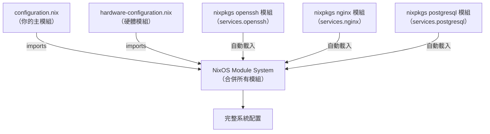
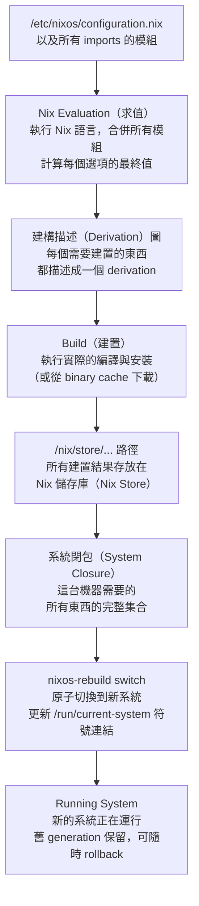
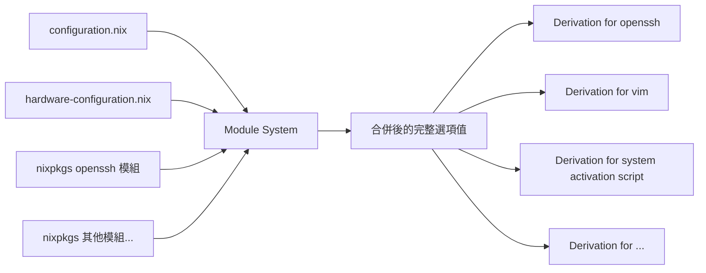
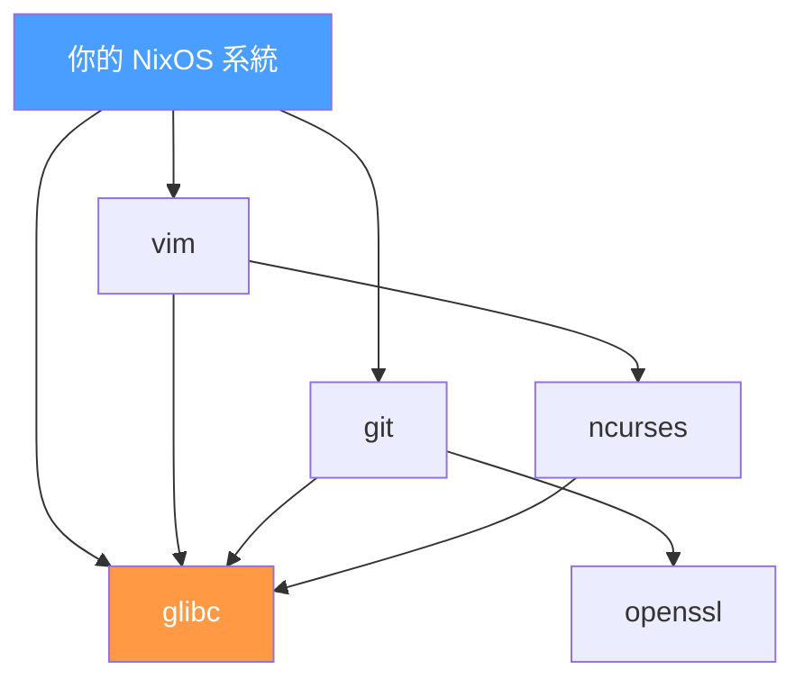
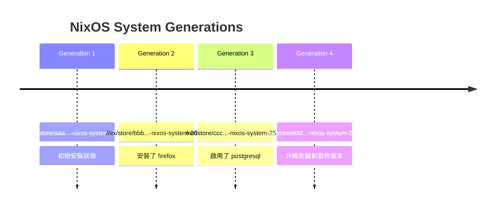

# 第3章：NixOS 配置系統概覽

## 本章學習目標

完成本章後，你將能夠：

1. 說明 `/etc/nixos/` 目錄中每個檔案的用途
2. 理解 `configuration.nix` 是如何被求值（evaluate）的
3. 說明什麼是系統閉包（System Closure），以及它與 /nix/store 的關係
4. 理解選項（Option）樹的命名空間結構
5. 執行 `nixos-rebuild switch` 並在腦中追蹤整個評估流程

## 前置知識

- 完成第1章：NixOS 設計哲學
- 完成第2章：Nix 語言基礎

---

## 3.1 `/etc/nixos/` 目錄結構

安裝完 NixOS 後，第一個值得認識的地方是：

```
/etc/nixos/
```

這是整個 NixOS 系統配置的起點。

預設的目錄結構非常簡單：

```
/etc/nixos/
├── configuration.nix
└── hardware-configuration.nix
```

只有兩個檔案。

但這兩個檔案，定義了你整台機器的所有行為。

### 兩個檔案的角色

| 檔案 | 角色 | 誰來修改 |
|---|---|---|
| `configuration.nix` | 系統定義入口，你的主配置 | **你** |
| `hardware-configuration.nix` | 硬體描述，自動生成 | **NixOS 自動產生，通常不需要手動修改** |

這個分工非常清楚。

你負責「你想要什麼樣的系統」，NixOS 負責「如何配合你的硬體」。

### 之後會怎麼演進？

隨著你的配置越來越複雜，你會把 `configuration.nix` 拆分成許多模組（Module）：

```
/etc/nixos/
├── configuration.nix        ← 主入口，只負責 imports
├── hardware-configuration.nix
├── networking.nix           ← 網路配置
├── services.nix             ← 服務配置
├── users.nix                ← 使用者定義
└── packages.nix             ← 套件安裝
```

但這是之後的事。

現在先掌握最基本的兩個檔案。

---

## 3.2 `configuration.nix` 的角色

`configuration.nix` 是 NixOS 的靈魂。

你可以把它想成：

```
main() of your operating system
```

它是「系統定義的入口點」。所有關於你這台機器的一切，都從這裡開始。

### 最小可用的 `configuration.nix`

以下是一個完整、可實際運作的 `configuration.nix` 範例。

這個配置定義了一台有基本功能的 NixOS 機器：

```nix
{ config, pkgs, ... }:

{
  imports = [
    ./hardware-configuration.nix
  ];

  networking.hostName = "nixos";
  time.timeZone = "Asia/Taipei";

  users.users.alice = {
    isNormalUser = true;
    extraGroups = [ "wheel" ];
  };

  environment.systemPackages = with pkgs; [
    vim
    git
  ];

  system.stateVersion = "25.05";
}
```

### 逐行解說

**第一行：函式簽名**

```nix
{ config, pkgs, ... }:
```

`configuration.nix` 本身是一個 Nix 函式。

- `config`：整個系統配置求值後的結果（可用來讀取其他模組的設定）
- `pkgs`：nixpkgs 套件集合，用來取得各種軟體
- `...`：允許接收其他未列出的參數（例如未來會學到的 `lib`、`specialArgs`）

**`imports` 區塊**

```nix
imports = [
  ./hardware-configuration.nix
];
```

告訴 NixOS「把這些其他檔案也一起載入」。

`hardware-configuration.nix` 描述了你的硬碟、CPU、核心模組等硬體資訊。

**`networking.hostName`**

```nix
networking.hostName = "nixos";
```

設定機器的主機名稱。

這是你第一個接觸到 NixOS 選項（Option）系統的地方。

`networking.hostName` 是一個字串型別的選項，預設值為 `"nixos"`。

**`time.timeZone`**

```nix
time.timeZone = "Asia/Taipei";
```

設定系統時區。

台灣使用者填 `"Asia/Taipei"`。

**`users.users.alice`**

```nix
users.users.alice = {
  isNormalUser = true;
  extraGroups = [ "wheel" ];
};
```

宣告一個名為 `alice` 的一般使用者。

- `isNormalUser = true`：建立一般使用者帳號（有家目錄、可以登入）
- `extraGroups = [ "wheel" ]`：加入 `wheel` 群組，代表可以使用 `sudo`

**`environment.systemPackages`**

```nix
environment.systemPackages = with pkgs; [
  vim
  git
];
```

指定要全系統安裝的套件清單。

`with pkgs;` 是 Nix 語法糖，讓你不需要每次都寫 `pkgs.vim`、`pkgs.git`。

**`system.stateVersion`**

```nix
system.stateVersion = "25.05";
```

記錄這個系統是在哪個 NixOS 版本下初始化的。

這個值影響某些有狀態服務（例如資料庫）的預設行為。

**重要**：`stateVersion` 不是「鎖定你的 NixOS 版本」，而是「記錄初始化時的版本」。你升級 NixOS 時通常不需要也不應該更動這個值。

### 這個檔案就是你的整個系統定義

再強調一次：

```
這個檔案，就是你的整個系統。
```

只要有了這個檔案（加上 `hardware-configuration.nix`），你就能在任何一台電腦上重現完全相同的 NixOS 系統。

這是 NixOS 最根本的能力。

---

## 3.3 `hardware-configuration.nix`：自動生成的硬體描述

`hardware-configuration.nix` 是 NixOS 安裝程式自動生成的檔案。

你通常不需要手動修改它。

但你需要知道它在做什麼。

### 如何生成？

NixOS 提供了指令 `nixos-generate-config`，它會：

1. 掃描你的硬體環境
2. 偵測磁碟分割區、檔案系統
3. 偵測需要的核心模組
4. 自動生成 `hardware-configuration.nix`

安裝時 Installer 會自動執行這個步驟。

之後如果更換硬碟或進行大幅度硬體變更，可以再次執行：

```bash
sudo nixos-generate-config
```

### 典型的 `hardware-configuration.nix`

以下是一個常見的 `hardware-configuration.nix` 範例：

```nix
{ config, lib, pkgs, modulesPath, ... }:

{
  imports = [
    (modulesPath + "/installer/scan/not-detected.nix")
  ];

  boot.initrd.availableKernelModules = [
    "xhci_pci"
    "ahci"
    "nvme"
    "usb_storage"
    "sd_mod"
  ];
  boot.initrd.kernelModules = [ ];
  boot.kernelModules = [ "kvm-intel" ];
  boot.extraModulePackages = [ ];

  fileSystems."/" = {
    device = "/dev/disk/by-uuid/xxxxxxxx-xxxx-xxxx-xxxx-xxxxxxxxxxxx";
    fsType = "ext4";
  };

  fileSystems."/boot" = {
    device = "/dev/disk/by-uuid/XXXX-XXXX";
    fsType = "vfat";
    options = [ "fmask=0022" "dmask=0022" ];
  };

  swapDevices = [ ];

  nixpkgs.hostPlatform = lib.mkDefault "x86_64-linux";
  hardware.cpu.intel.updateMicrocode =
    lib.mkDefault config.hardware.enableRedistributableFirmware;
}
```

### 各區塊說明

**`boot.initrd.availableKernelModules`**

列出開機初始化階段（initrd）需要載入的核心模組（Kernel Module）。

這些模組讓系統在開機時能夠存取儲存裝置。

**`fileSystems`**

描述磁碟掛載點。

NixOS 不依賴 `/etc/fstab`，而是在這裡用宣告式方式定義所有掛載點。

`device` 使用 UUID 而非 `/dev/sdaX` 這類路徑，確保即使磁碟順序改變也能正確掛載。

**`swapDevices`**

定義 swap 分割區或 swap 檔案。如果安裝時沒有設定 swap，這裡會是空列表。

**`nixpkgs.hostPlatform`**

告訴 nixpkgs 這台機器的架構（例如 `x86_64-linux`）。

### `imports` 如何引入它？

在 `configuration.nix` 中有這行：

```nix
imports = [
  ./hardware-configuration.nix
];
```

NixOS 的模組（Module）系統會把這兩個檔案的內容合併（merge）起來，形成一個完整的系統配置。

這個合併機制正是下一節要介紹的核心概念。

---

## 3.4 NixOS Module System 初探

NixOS 不是一個巨大的單一配置檔。

它是由成千上萬個「模組（Module）」組成的系統。

### 什麼是模組？

一個模組就是一個 Nix 函式，它可以：

1. **宣告（declare）選項**：「我提供一個叫 `services.openssh.enable` 的開關」
2. **實作（implement）配置**：「如果 `services.openssh.enable = true`，那就安裝並啟動 OpenSSH」

這兩件事是分開的。

宣告者不一定是實作者。

### 你的 `configuration.nix` 也是一個模組

從技術角度來說，`configuration.nix` 本身也是一個模組。

只是它主要的工作是「設定選項的值」，而不是「宣告新選項」。

### nixpkgs 裡有什麼模組？

nixpkgs（NixOS 的套件庫和模組庫）包含了數千個現成的模組。

幾乎每個 `services.xxx` 都是一個獨立的模組：

- `services.openssh`：由 `nixos/modules/services/networking/openssh.nix` 提供
- `services.nginx`：由 `nixos/modules/services/web-servers/nginx/default.nix` 提供
- `services.postgresql`：由 `nixos/modules/services/databases/postgresql.nix` 提供

你只需要設定選項，背後的邏輯都已經寫好了。

### 模組之間的關係



NixOS 模組系統會把所有模組的 `options` 宣告和 `config` 實作合併在一起，計算出最終的系統配置。

### 模組的結構長什麼樣？

一個完整的模組結構如下（作為預覽，第7章會深入介紹）：

```nix
{ config, pkgs, lib, ... }:

{
  # 宣告這個模組提供的選項
  options = {
    services.myapp.enable = lib.mkEnableOption "My Application";
    services.myapp.port = lib.mkOption {
      type = lib.types.port;
      default = 8080;
      description = "The port myapp listens on.";
    };
  };

  # 當選項被啟用時，實作實際的配置
  config = lib.mkIf config.services.myapp.enable {
    systemd.services.myapp = {
      description = "My Application";
      wantedBy = [ "multi-user.target" ];
      serviceConfig = {
        ExecStart = "${pkgs.myapp}/bin/myapp --port ${toString config.services.myapp.port}";
      };
    };
  };
}
```

現在不需要完全理解這段程式碼。

重點是：**每個模組都遵循「宣告選項、實作配置」的分離架構**。

---

## 3.5 Option Tree：系統配置的命名空間

NixOS 有一個巨大的「選項（Option）命名空間」。

你在 `configuration.nix` 裡寫的每一行設定，都是在設定這個命名空間中的某個選項。

### 命名空間的樹狀結構

選項按照功能分類，形成一棵樹：

```
services.
    openssh.
        enable              # 型別：bool，預設：false
        ports               # 型別：listOf int，預設：[ 22 ]
        settings.
            PermitRootLogin # 型別：string，預設："prohibit-password"
    nginx.
        enable              # 型別：bool，預設：false
        virtualHosts        # 型別：attrsOf submodule
    postgresql.
        enable              # 型別：bool，預設：false
        package             # 型別：package

networking.
    hostName                # 型別：string，預設："nixos"
    firewall.
        enable              # 型別：bool，預設：true
        allowedTCPPorts     # 型別：listOf int，預設：[ ]
        allowedUDPPorts     # 型別：listOf int，預設：[ ]
    interfaces.             # 型別：attrsOf submodule
        eth0.
            ipv4.addresses  # 型別：listOf submodule

users.
    users.                  # 型別：attrsOf submodule
        alice.
            isNormalUser    # 型別：bool
            extraGroups     # 型別：listOf string
            shell           # 型別：package
            hashedPassword  # 型別：nullOr string

boot.
    loader.
        grub.enable         # 型別：bool
        systemd-boot.enable # 型別：bool
    kernelPackages          # 型別：package
    kernelParams            # 型別：listOf string

environment.
    systemPackages          # 型別：listOf package
    variables               # 型別：attrsOf (either string (listOf string))

hardware.
    opengl.enable           # 型別：bool
    bluetooth.enable        # 型別：bool
```

這棵樹非常大。nixpkgs 目前有超過一萬個選項。

### 每個選項都有完整的型別系統

每個選項都有：

- **型別（type）**：這個選項接受什麼值
- **說明（description）**：這個選項是做什麼的
- **預設值（default）**：不設定時的預設行為
- **範例（example）**：如何使用的參考

### 如何查詢選項？

**方法一：NixOS 官方搜尋**

前往 [search.nixos.org/options](https://search.nixos.org/options)，搜尋你想設定的功能。

這是最直覺的方式。

**方法二：man page**

```bash
man configuration.nix
```

可以在終端機直接搜尋所有可用選項。

**方法三：nix repl**

```bash
nix repl '<nixpkgs/nixos>'
```

進入 REPL 後可以直接探索選項：

```
nix-repl> :t options.services.openssh.enable
```

### 選項的型別種類

NixOS 選項系統支援豐富的型別：

| 型別 | 說明 | 範例值 |
|---|---|---|
| `bool` | 布林值 | `true` / `false` |
| `int` | 整數 | `8080` |
| `string` | 字串 | `"hello"` |
| `path` | 路徑 | `/etc/myapp/config.conf` |
| `package` | Nix 套件 | `pkgs.nginx` |
| `listOf int` | 整數列表 | `[ 80 443 ]` |
| `attrsOf string` | 字串鍵值對 | `{ FOO = "bar"; }` |
| `nullOr string` | 字串或 null | `"value"` / `null` |
| `submodule` | 巢狀模組 | 複雜的結構體 |

了解型別非常重要。

當你設錯型別時（例如把整數填成字串），NixOS 在求值（evaluate）時就會報錯，讓你立刻發現問題。

---

## 3.6 Evaluation 流程：從配置到系統

這是本章最重要的一節。

理解這個流程，就理解了 NixOS 的本質。

### 整體流程概覽



### 逐步說明每個階段

#### 階段一：讀取配置

當你執行 `sudo nixos-rebuild switch` 時，NixOS 首先讀取：

```
/etc/nixos/configuration.nix
```

以及它透過 `imports` 引入的所有其他模組。

#### 階段二：Nix Evaluation（求值）

這是最關鍵的步驟。

Nix 是一種函式式語言，「求值」（Evaluation）的意思是：執行這些 Nix 表達式，計算出最終的配置。

這個過程包括：

- 合併所有模組的選項宣告
- 解析所有 `mkIf`、`mkMerge`、`mkDefault` 等條件邏輯
- 計算每個選項的最終值
- 檢查型別是否正確
- 生成每個需要建置的軟體的「建構描述（Derivation）」

**Derivation** 就像是「食譜」——它精確描述了如何從原始材料建置出某個軟體。



#### 階段三：Build（建置）

有了建構描述後，Nix 開始實際建置。

對於每個 derivation，Nix 會先檢查：

```
/nix/store 裡已經有這個東西了嗎？
```

如果有（hash 相同），就直接使用，不重新建置。

如果沒有，就從 binary cache（二進位快取）下載，或者在本地從原始碼編譯。

**這就是為什麼 NixOS 的更新通常很快**——大部分套件都已經在 cache.nixos.org 上預先建置好了。

#### 階段四：Nix 儲存庫（Nix Store）

所有建置結果都存放在 Nix 儲存庫（Nix Store）中：

```
/nix/store/
```

每個路徑都帶有 hash：

```
/nix/store/xxxxxxxxxxxxxxxxxxxxxxxxxxxxxxxx-openssh-9.7p1/
/nix/store/yyyyyyyyyyyyyyyyyyyyyyyyyyyyyyyy-vim-9.1/
/nix/store/zzzzzzzzzzzzzzzzzzzzzzzzzzzzzzzz-nixos-system-nixos-25.05/
```

這個 hash 是根據「所有輸入」計算出來的。

只要任何輸入改變（配置、依賴版本、編譯選項），hash 就會不同，產生一個全新的路徑。

舊的路徑不會被覆蓋，而是永遠保留在 `/nix/store`（直到你執行垃圾回收）。

#### 階段五：原子切換

建置完成後，`nixos-rebuild switch` 執行原子切換：

```bash
# 更新系統符號連結（這個操作是原子的）
/run/current-system -> /nix/store/zzz...-nixos-system-nixos-25.05/
```

以及更新 bootloader 的 generation 清單。

「原子」的意義非常重要：

```
要麼全部成功，要麼完全不動。
```

如果建置過程中發生錯誤，系統不會停留在「半切換」的狀態。

你的機器永遠是在一個完整的、可用的 generation 上。

### `nixos-rebuild` 的幾種模式

| 指令 | 作用 |
|---|---|
| `nixos-rebuild switch` | 建置並立刻切換到新系統（服務立即重啟） |
| `nixos-rebuild boot` | 建置但只在下次開機後切換（現在不重啟服務） |
| `nixos-rebuild test` | 建置並切換，但不更新 bootloader（不影響開機選項） |
| `nixos-rebuild dry-run` | 只顯示會做什麼，不真正執行 |

### 驗證流程的小實驗

你可以用以下指令觀察 Evaluation 的結果：

```bash
# 查看當前系統指向哪個 store path
readlink -f /run/current-system

# 查看系統包含哪些元件
ls /run/current-system/
```

輸出會類似：

```
/nix/store/xxxxxxxxxxxxxxxxxxxxxxxxxxxxxxxx-nixos-system-nixos-25.05
bin  etc  firmware  init  init-interface-version  initrd  kernel  kernel-modules  nixos-version  sw  system  systemd
```

這個路徑下的所有內容，就是你當前運行的完整系統。

---

## 3.7 System Closure：你的整個系統在 /nix/store 中

「閉包（Closure）」是數學和程式設計中的一個概念。

在 NixOS 的語境中，系統閉包（System Closure）的意思是：

```
系統需要的所有東西的完整集合，包括所有依賴的依賴的依賴。
```

### 為什麼叫「閉包」？

因為這個集合是「封閉的（closed）」——所有的依賴都在裡面，沒有任何東西依賴外部。

舉例：



`vim` 依賴 `ncurses` 和 `glibc`。

`git` 依賴 `openssl` 和 `glibc`。

`glibc` 是整個 closure 的底層基礎。

整個 closure 包含了從頂端到底部的所有節點。

把 closure 放進 `/nix/store`，你就有了一個完整的、可獨立運行的系統。

### 查看系統 Closure 的大小

```bash
# 查看當前系統的磁碟佔用
du -sh /run/current-system

# 更詳細：查看 closure 的組成
nix path-info -rS /run/current-system | sort -k2 -n | tail -20
```

典型的桌面系統 closure 大小：

- 最小化系統：約 2-4 GB
- 含桌面環境：約 10-20 GB

### 每個 Generation 是一個完整的 Closure

NixOS 的每次 `nixos-rebuild switch` 都會建立一個新的「世代（Generation）」。

每個世代都是一個完整的 closure，存放在 `/nix/store`。



### 查看現有的 Generations

```bash
# 列出所有 generation
sudo nix-env --list-generations --profile /nix/var/nix/profiles/system

# 或者更簡潔的方式
sudo nixos-rebuild list-generations
```

輸出類似：

```
   1   2025-11-01 10:23:45   (current)
   2   2025-11-15 14:55:12
   3   2025-12-01 09:30:00
```

### Rollback 為什麼完全可靠？

這就是關鍵：

```
舊的 generation 依然完整地存放在 /nix/store 中。
```

當你 rollback 時，NixOS 只是把 `/run/current-system` 這個符號連結改回指向舊的路徑。

沒有任何「還原」操作，沒有任何「備份」機制。

舊系統一直都在，從未消失過。

```bash
# 回到上一個 generation
sudo nixos-rebuild switch --rollback

# 或者在開機時從 GRUB/systemd-boot 選擇舊的 generation
```

### 什麼時候 /nix/store 的空間會被釋放？

舊的 store paths 不會自動刪除。

你需要執行「垃圾回收（Garbage Collection）」來清理不再被任何 generation 引用的 store paths：

```bash
# 刪除超過 30 天的舊 generations，然後執行垃圾回收
sudo nix-collect-garbage --delete-older-than 30d

# 或只清理完全不被引用的 paths
sudo nix-collect-garbage
```

這個機制讓你可以決定要保留多少歷史，用磁碟空間換取 rollback 安全性。

---

## 本章小結

本章介紹了 NixOS 配置系統的完整全貌。以下是最重要的五個要點：

1. **`/etc/nixos/` 是一切的起點**：`configuration.nix` 是你的系統定義入口，`hardware-configuration.nix` 是自動生成的硬體描述。兩者合作，完整描述你的機器。

2. **NixOS 是由模組（Module）組成的系統**：每個 `services.xxx`、`networking.xxx` 背後都是一個獨立的模組。你的 `configuration.nix` 本身也是模組之一。nixpkgs 提供了數千個現成模組，你只需要設定選項（Option）的值。

3. **選項（Option）命名空間是一棵巨大的樹**：`services.openssh.enable`、`networking.hostName`、`users.users.alice` 都是這棵樹上的節點。每個選項都有型別和預設值。`search.nixos.org/options` 是查詢的好工具。

4. **Evaluation 流程是 NixOS 的核心**：配置 → 求值 → 建構描述（Derivation）→ 建置 → Nix 儲存庫（Nix Store）→ 系統閉包（System Closure）→ 原子切換。理解這個流程，NixOS 的所有行為都變得可預測。

5. **系統閉包（System Closure）讓 rollback 完全可靠**：每個 generation 都是一個完整的 closure，永遠存放在 `/nix/store` 中，直到你主動執行垃圾回收。這是 NixOS 最強大的保障。

---

現在你已經掌握了 NixOS 配置系統的整體架構。

接下來，**第二篇**將深入每個部分：

- 第4章：`configuration.nix` 的基本結構與每個區塊的細節
- 第5章：`imports` 機制與模組化配置設計
- 第6章：Option 系統與 `mkOption` 的使用方式
- 第7章：NixOS Module System 的完整工作原理

每一章都有可操作的 Lab，讓你在實際環境中練習本章學到的概念。
