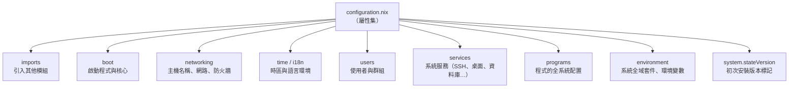
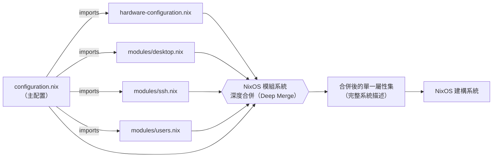
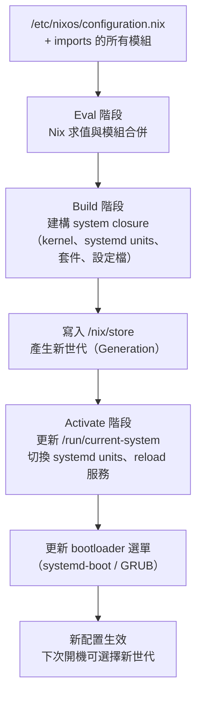

# 第4章：configuration.nix 基本結構

## 本章學習目標

完成本章後，你將能夠：

1. 理解 `configuration.nix` 的本質：一個 Nix 函式
2. 解讀函式簽名 `{ config, pkgs, ... }:` 中每個參數的用途
3. 正確設定 `boot`、`networking`、`time`、`i18n`、`users`、`services`、`environment`、`programs` 等頂層區塊
4. 理解 `system.stateVersion` 的真實意義，並避免常見的誤解
5. 建立一份完整、可立即建構的基礎 `configuration.nix`

---

## 前置知識

- 完成第 1 至 3 章的內容
- 知道如何在終端機（Terminal）中編輯文字檔案
- 了解基本的 Linux 目錄結構（`/etc`、`/home` 等）

---

## 4.1 整體架構：一個函式，一個屬性集

### configuration.nix 的本質

很多 NixOS 新手一開始看到 `configuration.nix`，會以為它是一個「設定檔」，就像 INI 或 YAML 那種格式。

它不是。

**`configuration.nix` 是一個 Nix 函式。**

這個函式接受環境參數作為輸入，回傳一個描述整個系統的屬性集（Attribute Set）作為輸出。

這個觀念非常重要。請先把這個流程記在腦子裡：

```
函式輸入（環境參數）
       ↓
  Nix 語言求值
       ↓
  屬性集（系統描述）
       ↓
  NixOS 建構系統
       ↓
  實際的作業系統
```

### 最精簡的 configuration.nix

下面是一個把結構骨架完整呈現的精簡範例：

```nix
{ config, pkgs, ... }:   # ← 這是函式參數（輸入）

{                         # ← 這是屬性集（輸出，大括號開始）
  imports = [ ... ];
  boot    = { ... };
  networking = { ... };
  users   = { ... };
  environment = { ... };
  system.stateVersion = "25.05";
}                         # ← 屬性集結束
```

整個檔案就是：**「一個函式，回傳一個屬性集」**。

這個屬性集的每個鍵值（Key-Value Pair）就是一條系統配置的描述。

NixOS 建構系統讀取這份屬性集後，會知道要安裝哪些套件、啟動哪些服務、建立哪些使用者帳號，然後建構出完整的作業系統。

下圖整理了 `configuration.nix` 屬性集中各頂層區塊的職責分工。這張圖可以當作你日後撰寫配置時的「心智地圖」：知道每個區塊大致負責哪一塊系統行為。



---

## 4.2 函式簽名：`{ config, pkgs, ... }:` 詳解

### 逐項解析

函式簽名長這樣：

```nix
{ config, pkgs, ... }:
```

這是 Nix 語言的「具名參數模式」（Named Argument Pattern）。大括號內是你宣告要使用的參數名稱。後面那個冒號代表函式定義結束，接著是函式本體（也就是輸出的屬性集）。

以下逐一說明每個參數：

**`config`**

`config` 是求值完成後的整個系統配置，可以把它想成「當前這份 configuration.nix 以及所有 imports 模組合併後的最終結果」。

它是唯讀的（Read-Only），用途是讀取其他模組的設定值。

例如，你可以用 `config.networking.hostName` 取得主機名稱，用 `config.services.openssh.enable` 判斷 SSH 服務是否啟用。

這個參數的用法通常出現在條件判斷中：

```nix
{ config, pkgs, ... }:

{
  # 假設你想根據 SSH 是否啟用來決定要不要開防火牆 port
  networking.firewall.allowedTCPPorts =
    if config.services.openssh.enable
    then [ 22 ]
    else [];
}
```

**`pkgs`**

`pkgs` 是 nixpkgs 套件集合（Package Set）。

你可以把它想成一個巨大的屬性集，裡面每一個屬性都是一個可安裝的套件。

例如：
- `pkgs.git`：Git 版本控制工具
- `pkgs.vim`：Vim 編輯器
- `pkgs.curl`：curl 網路工具
- `pkgs.firefox`：Firefox 瀏覽器

`pkgs` 是你在 `environment.systemPackages` 或 `users.users.<name>.shell` 等地方指定套件時，最常使用的參數。

**`lib`**

`lib` 是 NixOS 工具函式庫（Library），提供一系列輔助函式，讓你的配置更簡潔、更有彈性。

常見的工具函式包括：
- `lib.mkIf`：條件設定，當條件為 true 才套用這段配置
- `lib.mkDefault`：設定預設值，允許其他模組覆蓋
- `lib.mkForce`：強制覆蓋其他模組的設定值
- `lib.optionals`：依條件回傳列表或空列表

進階使用才會大量用到 `lib`。初學階段你不一定需要把 `lib` 加進函式簽名。

**`modulesPath`**

`modulesPath` 是 NixOS 模組目錄的路徑（一個字串）。

這是進階用法，通常用在 imports 區塊中引入 NixOS 官方模組。一般配置不需要使用這個參數。

**`...`**

三個點（`...`）代表「接受但忽略其他未宣告的參數」。

NixOS 模組系統在呼叫你的函式時，可能會傳入許多參數（例如 `config`、`pkgs`、`lib`、`modulesPath` 等）。如果你的函式簽名沒有宣告某個參數，Nix 會報錯說「多餘的參數」。

加上 `...` 之後，Nix 就不會因為多餘的參數而報錯。

### 為什麼大多數配置只用 `config`、`pkgs` 和 `...`

日常配置中，你最常用到的是 `pkgs`（安裝套件）和 `...`（避免報錯）。

`config` 則在你需要「讀取其他設定值來做判斷」時才使用。

`lib` 在需要條件設定或工具函式時使用。

`modulesPath` 幾乎只在架設 NixOS 測試或特殊部署時才會用到。

因此，一個標準的函式簽名長這樣：

```nix
{ config, pkgs, ... }:
```

這已經涵蓋絕大多數配置場景的需求。

---

## 4.3 imports 區塊

### imports 是什麼

`imports` 是一個路徑（Path）型別的列表。

它告訴 NixOS：「在求值這份配置時，也一起引入這些檔案。」

被引入的每個檔案本身也必須是一個 NixOS 模組（同樣是一個 Nix 函式，回傳屬性集）。

### 最常見的 imports 用法

安裝 NixOS 後，`/etc/nixos/` 目錄下通常有兩個檔案：

- `configuration.nix`：主配置（你的系統描述）
- `hardware-configuration.nix`：由 NixOS 自動偵測硬體產生，描述磁碟分區、檔案系統、核心模組等

主配置預設會引入硬體配置：

```nix
{ config, pkgs, ... }:

{
  imports = [
    ./hardware-configuration.nix
  ];

  # ... 其他配置
}
```

路徑 `./hardware-configuration.nix` 使用的是相對路徑，相對於目前這個檔案所在的目錄。

### 引入自訂模組

隨著你的配置越來越複雜，你可以把特定部分拆分成獨立的模組檔案，再用 imports 引入：

```nix
imports = [
  ./hardware-configuration.nix
  ./modules/desktop.nix    # 桌面環境配置
  ./modules/ssh.nix        # SSH 配置
  ./modules/users.nix      # 使用者管理
];
```

這種拆分方式會在第 6 章詳細說明。

### 合併規則：深度合併，而非覆蓋

這是 NixOS 模組系統最重要的特性之一。

當多個模組都設定了同一個屬性路徑，NixOS 不是用後者覆蓋前者，而是進行深度合併（Deep Merge）。

列表型別的屬性（例如 `environment.systemPackages`、`networking.firewall.allowedTCPPorts`）會被合併成一個大列表。

布林值、字串等純量型別（Scalar）的屬性，如果多個模組都設定了，會在求值時根據優先順序決定最終值（這時候 `lib.mkDefault` 和 `lib.mkForce` 就派上用場了）。

下圖示意了 `imports` 的載入與合併流程：主配置與被引入的多個模組各自回傳屬性集，最後由模組系統深度合併成單一份系統描述，再交給 NixOS 建構系統。



---

## 4.4 boot 區塊：啟動程式配置

### 啟動程式（Bootloader）是什麼

啟動程式（Bootloader）是電腦開機後第一個執行的程式。它負責載入作業系統核心（Kernel）。

NixOS 支援兩種主要的 bootloader：`systemd-boot` 和 GRUB（Grand Unified Bootloader）。

### systemd-boot：現代 EFI 系統的推薦選擇

如果你的電腦支援 UEFI（大多數 2012 年後的電腦都支援），推薦使用 `systemd-boot`：

```nix
{ config, pkgs, ... }:

{
  # systemd-boot：適用於 UEFI 系統
  boot.loader.systemd-boot.enable = true;
  boot.loader.efi.canTouchEfiVariables = true;
}
```

`canTouchEfiVariables = true` 的意思是允許 NixOS 修改 EFI 啟動變數（Boot Variables），這樣 bootloader 才能正確寫入 EFI 分區。

`systemd-boot` 的優點：
- 設定簡單，幾乎不需要額外配置
- 是 NixOS 安裝程式的預設選項（EFI 模式）
- 原生支援 NixOS 世代（Generation）切換選單

### GRUB：相容 BIOS 與 EFI 的通用選擇

如果你的系統使用傳統 BIOS，或者你需要使用 GRUB 特有的功能（例如加密磁碟解鎖、多重開機進階控制），使用 GRUB：

```nix
{ config, pkgs, ... }:

{
  # GRUB：適用於 BIOS 系統
  boot.loader.grub.enable = true;
  boot.loader.grub.device = "/dev/sda";  # 安裝到整個磁碟的 MBR
}
```

如果你的系統是 EFI 但仍想使用 GRUB：

```nix
{ config, pkgs, ... }:

{
  # GRUB：EFI 模式
  boot.loader.grub.enable = true;
  boot.loader.grub.device = "nodev";       # EFI 模式不寫入 MBR
  boot.loader.grub.efiSupport = true;
  boot.loader.efi.canTouchEfiVariables = true;
}
```

### 如何選擇

- 新安裝的 UEFI 系統：使用 `systemd-boot`
- 舊型 BIOS 系統：使用 GRUB，`device` 設為磁碟路徑（如 `/dev/sda`）
- 虛擬機器（VirtualBox、VMware）：通常使用 GRUB，因為虛擬機器 BIOS 比較常見

---

## 4.5 networking 區塊：網路設定

### 設定主機名稱

主機名稱（Hostname）是這台電腦在網路上的識別名稱。

```nix
{ config, pkgs, ... }:

{
  # 設定主機名稱
  networking.hostName = "nixos";
}
```

套用配置（執行 `sudo nixos-rebuild switch`）後，執行 `hostname` 指令會回傳 `nixos`。

主機名稱也會顯示在終端機的命令提示符（Command Prompt）上，例如 `alice@nixos:~$`。

### 啟用 NetworkManager

NetworkManager 是現代 Linux 桌面系統最常用的網路管理工具，負責管理有線、無線、VPN 等各種網路連線：

```nix
{ config, pkgs, ... }:

{
  networking.hostName = "nixos";

  # 啟用 NetworkManager：適合桌面環境使用
  networking.networkmanager.enable = true;
}
```

啟用 NetworkManager 後，一般使用者如果想要管理網路連線，需要把自己加入 `networkmanager` 群組（將在 4.7 節說明）。

### 防火牆設定

NixOS 預設啟用防火牆（Firewall）。防火牆會封鎖所有未明確允許的入站連線。

```nix
{ config, pkgs, ... }:

{
  networking.hostName = "nixos";
  networking.networkmanager.enable = true;

  # 防火牆配置
  networking.firewall.enable = true;
  networking.firewall.allowedTCPPorts = [ 22 80 443 ];
  # 22：SSH
  # 80：HTTP
  # 443：HTTPS
}
```

`allowedTCPPorts` 接受一個整數列表，每個整數是一個允許通過的 TCP 連接埠（Port）號碼。

如果你需要開放 UDP 連接埠（例如 WireGuard VPN），使用 `allowedUDPPorts`：

```nix
networking.firewall.allowedUDPPorts = [ 51820 ];  # WireGuard 預設 port
```

---

## 4.6 time 與 i18n 區塊：時區與語言

### 設定時區

時區（Timezone）影響系統時鐘的顯示方式，以及排程工作（Cron Job）的執行時間：

```nix
{ config, pkgs, ... }:

{
  # 設定時區為台北時間（UTC+8）
  time.timeZone = "Asia/Taipei";
}
```

常見的時區字串：
- `"Asia/Taipei"`：台灣
- `"Asia/Tokyo"`：日本
- `"Asia/Shanghai"`：中國大陸
- `"America/New_York"`：美國東部
- `"Europe/London"`：英國

完整的時區列表可以在系統上執行 `timedatectl list-timezones` 查詢。

### 設定語言環境

語言環境（Locale）設定影響系統的語言顯示、日期格式、數字格式等：

```nix
{ config, pkgs, ... }:

{
  time.timeZone = "Asia/Taipei";

  # 預設語言環境：使用英文介面（系統訊息較易閱讀）
  i18n.defaultLocale = "en_US.UTF-8";

  # 支援的語言環境：同時支援英文和繁體中文
  i18n.supportedLocales = [
    "en_US.UTF-8/UTF-8"
    "zh_TW.UTF-8/UTF-8"
  ];
}
```

`defaultLocale` 設為 `"en_US.UTF-8"` 是一個常見選擇，原因是英文的錯誤訊息在網路上更容易搜尋到解決方案。

如果你想要完整的繁體中文介面，可以設定：

```nix
i18n.defaultLocale = "zh_TW.UTF-8";
```

注意：`supportedLocales` 中需要包含你在 `defaultLocale` 設定的語言環境，否則 NixOS 會顯示警告。

---

## 4.7 users 區塊：使用者管理

### 為什麼使用者管理在 NixOS 很重要

在傳統 Linux 系統上，你使用 `useradd`、`passwd`、`usermod` 等指令手動管理使用者。這些變更直接寫入 `/etc/passwd` 和 `/etc/shadow`。

在 NixOS 中，使用者配置放在 `configuration.nix` 裡，由 NixOS 統一管理。

這表示你的使用者設定是宣告式的、可版本控制的、可重現的。

### users.users.alice 的各個欄位

下面是一個完整的使用者配置範例，使用者名稱為 `alice`：

```nix
{ config, pkgs, ... }:

{
  users.users.alice = {
    isNormalUser = true;
    description = "Alice Chen";
    extraGroups = [ "wheel" "networkmanager" "docker" ];
    shell = pkgs.zsh;
    openssh.authorizedKeys.keys = [
      "ssh-ed25519 AAAA... alice@laptop"
    ];
  };
}
```

逐項說明：

**`isNormalUser = true`**

設為 `true` 時，這個使用者是一般使用者（Normal User），具備以下特性：
- 自動建立家目錄（`/home/alice`）
- 可以登入系統
- UID 從 1000 開始編號

設為 `false`（或不設定此項）時，這個使用者是系統使用者（System User），通常用於背景服務（例如資料庫服務帳號）。系統使用者沒有家目錄，無法互動式登入。

**`description`**

這是使用者的全名（Full Name）或描述，顯示在登入畫面和 GECOS 欄位中。

```nix
description = "Alice Chen";
```

**`extraGroups`**

這個欄位指定使用者所屬的附加群組（Supplementary Groups）。常見的群組及其含義：

- `"wheel"`：允許使用 `sudo` 執行管理員指令。NixOS 預設把 `wheel` 群組設定為可以使用 `sudo`，這是讓普通使用者取得管理員權限的標準做法
- `"networkmanager"`：允許使用者透過 NetworkManager 管理網路連線（包括連接 Wi-Fi）
- `"docker"`：允許使用者執行 Docker 指令，而不需要每次都加 `sudo`
- `"audio"`：允許存取音效裝置（某些桌面環境需要）
- `"video"`：允許存取顯示卡裝置

```nix
extraGroups = [ "wheel" "networkmanager" "docker" ];
```

**`shell`**

指定這個使用者的預設互動式 Shell（Shell）。

```nix
shell = pkgs.zsh;    # 使用 Zsh
# 或
shell = pkgs.bash;   # 使用 Bash（系統預設）
# 或
shell = pkgs.fish;   # 使用 Fish Shell
```

注意：如果你把 `shell` 設為 `pkgs.zsh`，還需要在 `programs` 區塊中啟用 zsh（詳見 4.10 節），否則 NixOS 會顯示警告。

**`openssh.authorizedKeys.keys`**

這個欄位設定允許透過 SSH 金鑰（SSH Key）登入這個帳號的公鑰（Public Key）列表：

```nix
openssh.authorizedKeys.keys = [
  "ssh-ed25519 AAAA... alice@laptop"
];
```

這等同於把公鑰寫入 `/home/alice/.ssh/authorized_keys`，但由 NixOS 管理。

### mutableUsers：使用者是否可手動修改

`users.mutableUsers` 控制 NixOS 是否允許在配置之外手動修改使用者（例如用 `passwd` 更改密碼）。

預設值是 `true`（可手動修改）：

```nix
users.mutableUsers = true;  # 預設值，允許 passwd 等指令修改使用者
```

設為 `false` 時，NixOS 完全接管使用者管理。任何不在 `configuration.nix` 中的使用者，在下次 `nixos-rebuild switch` 後都會被刪除：

```nix
users.mutableUsers = false;  # 完全由 NixOS 管理，不允許手動修改
```

大多數初學者保持預設的 `true` 即可。這樣你還可以用 `passwd` 設定登入密碼。

設定密碼的標準做法：完成 `nixos-rebuild switch` 後，執行：

```bash
sudo passwd alice
```

---

## 4.8 services 區塊：服務管理

### services 區塊的核心概念

`services` 區塊是 NixOS 最能體現宣告式（Declarative）威力的地方。

在傳統 Linux 系統上啟用一個服務，你需要：
1. 安裝套件
2. 修改設定檔
3. 啟用 systemd unit
4. 啟動服務
5. 設定開機自動啟動

在 NixOS 中，通常只需要一行：

```nix
services.openssh.enable = true;
```

NixOS 自動處理安裝、配置、建立 systemd unit、設定開機自動啟動。

### SSH 服務：openssh

SSH（Secure Shell）是遠端連線的標準協定。以下是推薦的 SSH 配置：

```nix
{ config, pkgs, ... }:

{
  services.openssh = {
    enable = true;
    settings.PasswordAuthentication = false;  # 關閉密碼登入，強制使用金鑰
    settings.PermitRootLogin = "no";          # 禁止 root 直接 SSH 登入
  };
}
```

`PasswordAuthentication = false` 表示關閉密碼登入，要求使用 SSH 金鑰認證（Key-Based Authentication）。這是提高 SSH 安全性的重要設定。

關閉密碼登入前，請確認你已經：
1. 在 `users.users.alice.openssh.authorizedKeys.keys` 中設定了你的公鑰
2. 或是保有其他登入方式（例如實體主機的本地終端機）

### 桌面環境：Xserver 與顯示管理器

如果你要安裝桌面環境，需要啟用 X 伺服器（X Server）或 Wayland，並設定顯示管理器（Display Manager）和桌面管理器（Desktop Manager）：

```nix
{ config, pkgs, ... }:

{
  # 啟用 X 伺服器（X.Org）
  services.xserver.enable = true;

  # 顯示管理器：SDDM（KDE 的登入畫面）
  services.displayManager.sddm.enable = true;

  # 桌面管理器：KDE Plasma 6
  services.desktopManager.plasma6.enable = true;
}
```

這三行配置的關係是：

- `services.xserver.enable = true`：啟動圖形顯示伺服器
- `services.displayManager.sddm.enable = true`：啟動登入畫面（讓使用者輸入帳號密碼）
- `services.desktopManager.plasma6.enable = true`：啟動 KDE Plasma 6 桌面環境

其他常見的桌面環境組合：

```nix
# GNOME 桌面
services.xserver.desktopManager.gnome.enable = true;
services.displayManager.gdm.enable = true;

# XFCE 桌面（輕量級）
services.xserver.desktopManager.xfce.enable = true;
```

---

## 4.9 environment 區塊：套件安裝

### systemPackages：系統全域套件

`environment.systemPackages` 是安裝系統全域套件（System-Wide Packages）的地方。安裝在這裡的套件，系統上所有使用者都可以使用：

```nix
{ config, pkgs, ... }:

{
  environment.systemPackages = with pkgs; [
    vim
    git
    curl
    wget
    htop
  ];
}
```

### `with pkgs;` 的作用

`with pkgs;` 是一個語法糖（Syntactic Sugar）。

沒有 `with pkgs;` 時，你必須這樣寫：

```nix
environment.systemPackages = [
  pkgs.vim
  pkgs.git
  pkgs.curl
  pkgs.wget
  pkgs.htop
];
```

使用 `with pkgs;` 後，可以省略每個套件名稱前的 `pkgs.`，讓列表更簡潔。

`with <屬性集>;` 的作用是：在後面的表達式（Expression）中，把指定屬性集的所有屬性帶入當前作用域（Scope）。

### systemPackages vs 使用者專屬套件

`environment.systemPackages` 安裝的套件對全系統有效。

如果你只想讓特定使用者擁有某些套件，有兩種方式：

**方式一：`users.users.<name>.packages`（直接在使用者設定中列出）**

```nix
users.users.alice = {
  isNormalUser = true;
  packages = with pkgs; [
    firefox
    thunderbird
  ];
};
```

**方式二：Home Manager（更完整的使用者環境管理）**

Home Manager 是一個獨立的 NixOS 模組，可以宣告式管理使用者家目錄下的所有配置。我們會在第 8 章詳細介紹。

### 常用的系統套件建議

這裡列出幾個幾乎所有系統都適合安裝的基本套件：

```nix
{ config, pkgs, ... }:

{
  environment.systemPackages = with pkgs; [
    # 基本工具
    vim          # 文字編輯器
    git          # 版本控制
    curl         # HTTP 客戶端
    wget         # 檔案下載
    htop         # 系統監控
    tree         # 目錄樹狀顯示
    unzip        # 解壓縮
    
    # 網路工具
    nmap         # 網路掃描
    tcpdump      # 封包分析（進階用途）
  ];
}
```

---

## 4.10 programs 區塊：程式全局配置

### programs 和 environment.systemPackages 的差異

`environment.systemPackages` 只負責「安裝套件」。

`programs.<name>` 不只安裝套件，還可以做全系統層級的程式配置。

兩者的差異用一個例子說明：

```nix
# 只安裝 zsh，但不做任何系統層級配置
environment.systemPackages = with pkgs; [ zsh ];

# 安裝 zsh，同時把 zsh 加入 /etc/shells，讓 NixOS 知道 zsh 是合法的 shell
programs.zsh.enable = true;
```

如果你在 `users.users.alice.shell = pkgs.zsh` 設定了 Zsh 為使用者的 shell，**必須**同時設定 `programs.zsh.enable = true`，否則系統不會把 `/run/current-system/sw/bin/zsh` 加入 `/etc/shells`，導致登入時無法切換到 Zsh。

### 常用的 programs 配置

```nix
{ config, pkgs, ... }:

{
  # 啟用 Zsh（讓使用者可以設定 shell = pkgs.zsh）
  programs.zsh.enable = true;

  # 啟用 Git 的全系統基本配置
  programs.git.enable = true;

  # 設定 Vim 為系統預設編輯器（影響 EDITOR 環境變數）
  programs.vim.defaultEditor = true;
}
```

設定 `programs.vim.defaultEditor = true` 後，系統的 `EDITOR` 環境變數會指向 Vim。這影響到許多依賴 `EDITOR` 環境變數的工具，例如 `git commit`（開啟編輯器撰寫 commit 訊息）、`crontab -e`（編輯排程工作）等。

### 更多 programs 範例

```nix
{ config, pkgs, ... }:

{
  # 啟用 Fish Shell
  programs.fish.enable = true;

  # 啟用 GnuPG（GPG 金鑰管理）
  programs.gnupg.agent = {
    enable = true;
    enableSSHSupport = true;  # 讓 GPG agent 接管 SSH 金鑰
  };

  # 啟用 Mosh（行動 SSH，比 SSH 更適合不穩定網路）
  programs.mosh.enable = true;
}
```

---

## 4.11 system.stateVersion 的意義與警告

### 這是 NixOS 初學者最常誤解的設定

`system.stateVersion` 是 `configuration.nix` 中最容易被誤解的設定。

先說清楚它**不是**什麼：

- 它**不是**你目前使用的 NixOS 版本
- 它**不是**一個限制，說你只能使用某個版本的套件
- 它**不是**需要隨著 NixOS 升級而更改的值

### 它實際上是什麼

`system.stateVersion` 記錄的是**這台機器第一次安裝時使用的 NixOS 版本**。

```nix
system.stateVersion = "25.05";
```

這個值的作用是：當某些有狀態服務（Stateful Services）在不同 NixOS 版本之間的預設配置發生了不相容的變更時，NixOS 會參考 `stateVersion` 來決定要套用哪個版本的預設值。

換句話說，它保護已存在的狀態資料（例如資料庫的磁碟格式），讓升級 NixOS 版本時不會因為預設值的改變而破壞現有資料。

### 具體的例子

假設你在 NixOS 25.05 時安裝了 PostgreSQL 資料庫，資料庫檔案以 25.05 的預設格式儲存在磁碟上。

後來你把 NixOS 升級到 25.11。新版本的 PostgreSQL 可能使用了不同的資料目錄結構或預設配置。

如果 `stateVersion` 保持在 `"25.05"`，NixOS 知道這台機器的資料是 25.05 格式建立的，會用相容的方式處理，不會破壞現有資料。

### 更新 NixOS 版本時的正確做法

當你把 NixOS 從 25.05 升級到 25.11 時：

1. 更新 `nix.channel`（或 Flake 輸入）指向新版本
2. 執行 `sudo nixos-rebuild switch`
3. **不需要更改 `system.stateVersion`**

正確：

```nix
# NixOS 已升級到 25.11，但 stateVersion 仍然是 25.05
# 這是正確的，因為這台機器最初是在 25.05 安裝的
system.stateVersion = "25.05";
```

錯誤（不要這樣做）：

```nix
# 錯誤：把 stateVersion 改成 25.11 可能破壞已存在的有狀態服務
system.stateVersion = "25.11";  # ← 除非你知道你在做什麼，否則不要改
```

### 什麼情況下需要更改 stateVersion

只有在你確定自己了解以下兩點，且閱讀過 Release Notes 的情況下，才考慮更改：

1. 你知道所有受影響的有狀態服務，並且已經完成資料遷移
2. 你想要採用新版本的預設配置

一般情況下，`stateVersion` 設定後就不再更改。

### 全新安裝時的 stateVersion

當你全新安裝 NixOS 時，安裝程式會自動在 `configuration.nix` 中寫入當前版本的 `stateVersion`。你不需要手動設定。

---

## 4.12 完整範例：一份可運作的 configuration.nix

以下是一份整合本章所有知識點的完整 `configuration.nix`。

這份配置適用於：
- 一台名為 `nixos` 的電腦
- 主要使用者為 `alice`
- UEFI 系統（使用 systemd-boot）
- 安裝 KDE Plasma 6 桌面環境
- 啟用 SSH 服務（關閉密碼登入）

```nix
{ config, pkgs, ... }:

{
  imports = [
    ./hardware-configuration.nix
  ];

  # ── Bootloader ─────────────────────────────────────────────────────────────
  # 使用 systemd-boot（適用於 UEFI 系統）
  boot.loader.systemd-boot.enable = true;
  boot.loader.efi.canTouchEfiVariables = true;

  # ── Network ────────────────────────────────────────────────────────────────
  networking.hostName = "nixos";
  networking.networkmanager.enable = true;

  # 防火牆：只開放 SSH port
  networking.firewall.enable = true;
  networking.firewall.allowedTCPPorts = [ 22 ];

  # ── Timezone & Locale ──────────────────────────────────────────────────────
  time.timeZone = "Asia/Taipei";
  i18n.defaultLocale = "en_US.UTF-8";
  i18n.supportedLocales = [
    "en_US.UTF-8/UTF-8"
    "zh_TW.UTF-8/UTF-8"
  ];

  # ── Desktop Environment ────────────────────────────────────────────────────
  services.xserver.enable = true;
  services.displayManager.sddm.enable = true;
  services.desktopManager.plasma6.enable = true;

  # ── SSH ────────────────────────────────────────────────────────────────────
  services.openssh = {
    enable = true;
    settings.PasswordAuthentication = false;
    settings.PermitRootLogin = "no";
  };

  # ── Users ──────────────────────────────────────────────────────────────────
  users.users.alice = {
    isNormalUser = true;
    description = "Alice";
    extraGroups = [ "wheel" "networkmanager" ];
    shell = pkgs.zsh;
    openssh.authorizedKeys.keys = [
      # 替換成你自己的 SSH 公鑰（cat ~/.ssh/id_ed25519.pub）
      # "ssh-ed25519 AAAA... alice@laptop"
    ];
  };

  # ── Programs ───────────────────────────────────────────────────────────────
  # 啟用 Zsh（讓 alice 可以用 zsh 作為 shell）
  programs.zsh.enable = true;

  # 設定 Vim 為預設編輯器
  programs.vim.defaultEditor = true;

  # ── System Packages ────────────────────────────────────────────────────────
  environment.systemPackages = with pkgs; [
    vim
    git
    curl
    htop
    tree
  ];

  # ── State Version ──────────────────────────────────────────────────────────
  # 這台機器第一次安裝時的 NixOS 版本
  # 升級 NixOS 時請勿更改此值
  system.stateVersion = "25.05";
}
```

### 初次套用這份配置的步驟

1. 把這份內容存為 `/etc/nixos/configuration.nix`（確保 `hardware-configuration.nix` 也存在）
2. 執行 `sudo nixos-rebuild switch`
3. 等待建構完成（第一次可能需要幾分鐘，視網路速度而定）
4. 建構成功後，設定 alice 的登入密碼：
   ```bash
   sudo passwd alice
   ```
5. 重新開機，確認一切正常：
   ```bash
   sudo reboot
   ```

### 如何確認配置已正確套用

套用配置後，可以用以下指令驗證：

```bash
# 確認主機名稱
hostname
# 輸出：nixos

# 確認使用者已建立
id alice
# 輸出：uid=1000(alice) gid=1000(alice) groups=1000(alice),27(wheel),997(networkmanager)

# 確認 SSH 服務正在運行
systemctl status sshd
# 應顯示 active (running)

# 確認已安裝的系統套件
which git
# 輸出：/run/current-system/sw/bin/git
```

為了把整章的流程串起來，下圖呈現 `sudo nixos-rebuild switch` 從讀取 `configuration.nix` 到啟用新世代的主要階段。理解這個流程能幫助你日後在除錯（例如建構失敗、服務沒啟動）時知道問題出現在哪個環節。



---

## 本章小結

本章介紹了 `configuration.nix` 的完整結構。以下是各節的核心要點：

**4.1 整體架構**
`configuration.nix` 是一個 Nix 函式，輸入環境參數，輸出描述系統的屬性集。

**4.2 函式簽名**
`{ config, pkgs, ... }:` 中，`config` 用於讀取其他模組的設定值，`pkgs` 用於指定套件，`...` 用於接受並忽略其他參數。

**4.3 imports**
`imports` 是路徑列表，用於引入其他模組檔案。多個模組的同名屬性會深度合併，而非覆蓋。

**4.4 boot**
`systemd-boot` 適用於現代 UEFI 系統，GRUB 適用於 BIOS 系統或需要更多控制的場景。

**4.5 networking**
`networking.hostName` 設定主機名稱，`networkmanager.enable` 啟用網路管理，`firewall.allowedTCPPorts` 開放指定連接埠。

**4.6 time 與 i18n**
`time.timeZone` 設定時區，`i18n.defaultLocale` 設定系統預設語言。

**4.7 users**
`users.users.<name>` 宣告式管理使用者，`isNormalUser` 建立一般使用者，`extraGroups` 設定群組，`wheel` 群組取得 sudo 權限。

**4.8 services**
`services.<name>.enable = true` 一行啟用服務，NixOS 自動處理安裝、配置和 systemd unit。

**4.9 environment**
`environment.systemPackages` 安裝系統全域套件，`with pkgs;` 簡化列表寫法。

**4.10 programs**
`programs.<name>` 不只安裝套件，還做系統層級配置。如果使用者設定了 Zsh 為 shell，必須同時設定 `programs.zsh.enable = true`。

**4.11 system.stateVersion**
記錄這台機器**第一次安裝時**的 NixOS 版本，用於保護有狀態服務的資料相容性。升級 NixOS 版本時**不要更改**這個值。

**4.12 完整範例**
提供了一份可立即使用的完整 `configuration.nix`，整合了所有區塊的配置。

---

**下一章**

第 5 章將介紹 `hardware-configuration.nix`：這個由 NixOS 自動生成的硬體配置檔案包含哪些內容、什麼時候需要手動修改、以及如何在更換硬體後重新生成它。
