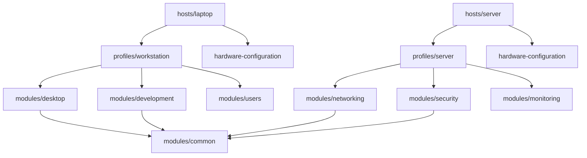
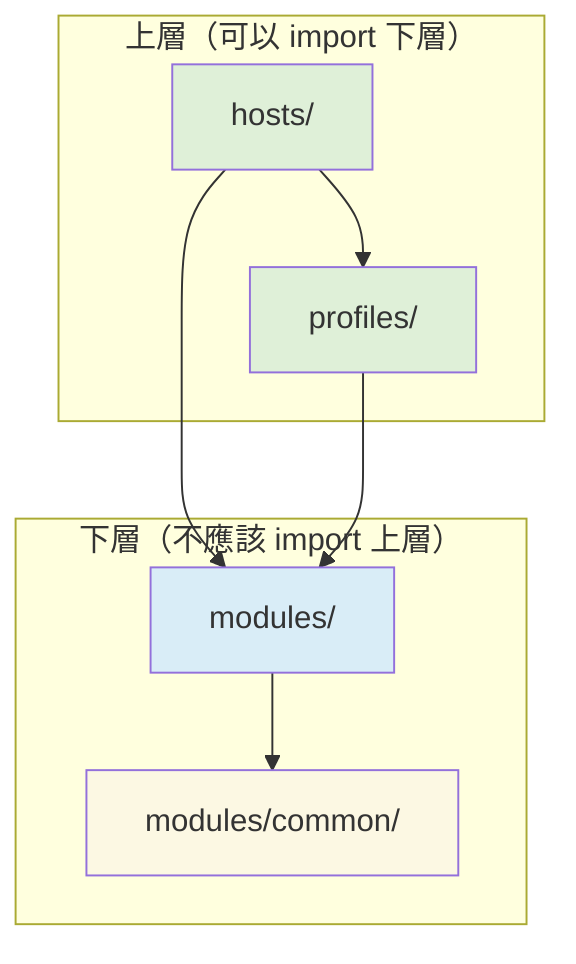

# 第5章：imports 機制與模組化設計

## 本章學習目標

完成本章後，你將能夠：

1. 清楚分辨 `import`（Nix 語言關鍵字）與 `imports`（模組系統屬性）的差異
2. 理解 NixOS 模組系統如何合併多個模組的配置
3. 將單一龐大的 `configuration.nix` 拆分為多個功能模組
4. 規劃適合自己系統規模的目錄結構
5. 設計可在多台主機間共用的模組
6. 辨識並避免循環依賴（circular imports）

---

## 前置知識

- 已完成第 4 章，理解 `configuration.nix` 的基本結構
- 知道什麼是 Nix 屬性集（attribute set）
- 對 `/etc/nixos/` 目錄有基本認識

---

## 5.1 `import` 與 `imports` 的差異

初學者最常在這裡感到困惑。

這兩個東西雖然名字相似，卻是完全不同層次的概念。

### `import`：Nix 語言的關鍵字

`import` 是 Nix 語言本身的一個內建函式。

它的作用很單純：**載入一個 `.nix` 檔案，並回傳它的求值結果。**

```nix
# import 的基本用法
# 假設 ./lib.nix 定義了一個屬性集
let
  mylib = import ./lib.nix;
in
mylib.someFunction "hello"
```

如果被載入的檔案是一個函式，`import` 只是把那個函式帶進來，不會自動呼叫它：

```nix
# ./helper.nix 的內容是一個函式
# args: { name }
# args: { name, ... }: "Hello, ${name}!"

let
  # 這裡拿到的是函式本身，還沒有呼叫
  greet = import ./helper.nix;
in
# 呼叫這個函式，傳入參數
greet { name = "alice"; }
```

`import` 可以用在任何 Nix 檔案中，不限於 NixOS 配置。

### `imports`：NixOS 模組系統的特殊屬性

`imports` 是 NixOS 模組系統（Module System）專屬的屬性名稱。

它的作用是：**告訴 NixOS 模組系統，還有哪些模組需要一起合併進來。**

```nix
# configuration.nix
{ config, pkgs, ... }:
{
  imports = [
    ./hardware-configuration.nix
    ./modules/networking.nix
    ./modules/users.nix
  ];

  # 這裡是這個模組自己的配置
  networking.hostName = "nixos";
  system.stateVersion = "25.05";
}
```

`imports` 接受的是一個**列表（list）**，列表中的每個元素必須是一個合法的 NixOS 模組路徑。

### 兩者的本質差異整理

| 比較項目 | `import` | `imports` |
|----------|----------|-----------|
| 屬於哪個層次 | Nix 語言本身 | NixOS 模組系統 |
| 用途 | 載入任意 `.nix` 檔案 | 合併 NixOS 模組 |
| 回傳值 | 被載入檔案的求值結果 | 無（是配置屬性） |
| 使用位置 | 任何 `.nix` 檔案 | 模組的頂層屬性集 |
| 是否自動合併配置 | 否 | 是 |

> **重點提示：** 你在 `imports = [ ... ]` 裡放的每個路徑，NixOS 都會把它當作一個**完整的模組**處理，而不只是「載入一段 Nix 程式碼」。這兩件事的區別，在後面幾節會越來越清楚。

---

## 5.2 `imports` 的合併規則

這是 NixOS 模組系統最重要、也最容易讓新手驚喜的地方。

### 不是覆蓋，是深度合併（Deep Merge）

當你在 `imports` 中列出多個模組時，NixOS 並不會讓後面的模組「蓋掉」前面的。

它會把所有模組的配置**深度合併（deep merge）**成一份最終的系統配置。

看看這個例子。假設有兩個模組：

```nix
# modules/ssh.nix
{ config, pkgs, ... }:
{
  # 開啟 SSH 服務
  services.openssh.enable = true;
  # 開放防火牆的 22 埠
  networking.firewall.allowedTCPPorts = [ 22 ];
}
```

```nix
# modules/webserver.nix
{ config, pkgs, ... }:
{
  # 開啟 Nginx 網頁伺服器
  services.nginx.enable = true;
  # 開放防火牆的 80 和 443 埠
  networking.firewall.allowedTCPPorts = [ 80 443 ];
}
```

當這兩個模組都被加入 `imports` 後，最終的合併結果是：

```nix
# NixOS 合併後的實際效果（你不需要自己寫這個）
{
  services.openssh.enable = true;
  services.nginx.enable = true;
  # 列表自動合併，三個埠都在！
  networking.firewall.allowedTCPPorts = [ 22 80 443 ];
}
```

注意 `networking.firewall.allowedTCPPorts`。

兩個模組各自定義了這個列表，NixOS 沒有讓 `[ 80 443 ]` 蓋掉 `[ 22 ]`，而是把它們**串接合併**了。

### 不同類型的合併行為

NixOS 模組系統對不同類型的值有不同的合併策略：

**布林值（Bool）— 衝突時報錯：**

```nix
# 如果兩個模組都設定相同的 Bool 選項為不同的值，NixOS 會報錯
# 模組 A
{ services.openssh.enable = true; }

# 模組 B
{ services.openssh.enable = false; }

# 結果：衝突錯誤！
# 你必須明確用 lib.mkForce 或在一個地方統一決定
```

**列表（List）— 自動合併串接：**

```nix
# 如上面 allowedTCPPorts 的例子，列表會自動串接
# 模組 A 定義 [ 22 ]，模組 B 定義 [ 80 443 ]
# 結果是 [ 22 80 443 ]
```

**屬性集（Attribute Set）— 遞迴合併：**

```nix
# 模組 A
{ services.openssh = { enable = true; ports = [ 22 ]; }; }

# 模組 B
{ services.openssh.passwordAuthentication = false; }

# 合併結果
# services.openssh 的兩個子屬性都保留
{
  services.openssh = {
    enable = true;
    ports = [ 22 ];
    passwordAuthentication = false;
  };
}
```

### 合併規則的實際意義

這個合併機制讓你可以放心地**把配置分散到不同模組**，不用擔心某個模組會破壞另一個。

每個模組只需要負責自己的部分，NixOS 會把所有模組的內容正確地拼湊在一起。

---

## 5.3 第一次拆分：從一個檔案到多個

現在來實際動手，把一個龐大的 `configuration.nix` 拆分成多個小模組。

### Before：單一大檔案的煩惱

這是一個典型的「什麼都塞進來」的 `configuration.nix`：

```nix
# /etc/nixos/configuration.nix（拆分前）
{ config, pkgs, ... }:
{
  imports = [ ./hardware-configuration.nix ];

  # 開機設定
  boot.loader.systemd-boot.enable = true;
  boot.loader.efi.canTouchEfiVariables = true;

  # 網路設定
  networking.hostName = "nixos";
  networking.networkmanager.enable = true;

  # 桌面環境
  services.xserver.enable = true;
  services.displayManager.sddm.enable = true;
  services.desktopManager.plasma6.enable = true;

  # 系統服務
  services.openssh.enable = true;
  services.printing.enable = true;

  # 音效
  sound.enable = true;
  hardware.pulseaudio.enable = false;
  services.pipewire = {
    enable = true;
    alsa.enable = true;
    pulse.enable = true;
  };

  # 使用者帳號
  users.users.alice = {
    isNormalUser = true;
    extraGroups = [ "wheel" "networkmanager" "docker" ];
    shell = pkgs.zsh;
  };
  programs.zsh.enable = true;

  # 系統套件
  environment.systemPackages = with pkgs; [
    vim
    git
    curl
    htop
    tree
    firefox
    vscode
  ];

  system.stateVersion = "25.05";
}
```

這個檔案目前還能管理，但隨著配置增加，它會越來越難閱讀和維護。

現在來把它拆開。

### After：拆分後的樣子

拆分後的目錄結構：

```
/etc/nixos/
├── configuration.nix          ← 只剩骨架
├── hardware-configuration.nix ← 不動（nixos-generate-config 產生的）
└── modules/
    ├── boot.nix               ← 開機設定
    ├── desktop.nix            ← 桌面環境與音效
    ├── networking.nix         ← 網路設定
    ├── packages.nix           ← 系統套件
    ├── services.nix           ← 系統服務
    └── users.nix              ← 使用者帳號
```

### 拆分後的各個檔案

**`configuration.nix`（主入口，只剩骨架）：**

這個檔案現在只做一件事：把各個模組串起來，加上主機名稱和版本號。

```nix
# /etc/nixos/configuration.nix（拆分後）
{ config, pkgs, ... }:
{
  imports = [
    ./hardware-configuration.nix
    ./modules/boot.nix
    ./modules/networking.nix
    ./modules/desktop.nix
    ./modules/services.nix
    ./modules/users.nix
    ./modules/packages.nix
  ];

  # 主機特定的設定放在這裡
  networking.hostName = "nixos";
  time.timeZone = "Asia/Taipei";
  i18n.defaultLocale = "zh_TW.UTF-8";

  # 版本號永遠放在主入口
  system.stateVersion = "25.05";
}
```

**`modules/boot.nix`（開機設定）：**

```nix
# /etc/nixos/modules/boot.nix
{ config, pkgs, ... }:
{
  # 使用 systemd-boot 作為開機載入器（適用於 UEFI 系統）
  boot.loader.systemd-boot.enable = true;
  boot.loader.efi.canTouchEfiVariables = true;
}
```

**`modules/networking.nix`（網路設定）：**

```nix
# /etc/nixos/modules/networking.nix
{ config, pkgs, ... }:
{
  # 使用 NetworkManager 管理網路連線
  networking.networkmanager.enable = true;

  # 開放 SSH 連線的防火牆埠
  networking.firewall.allowedTCPPorts = [ 22 ];
}
```

**`modules/desktop.nix`（桌面環境）：**

```nix
# /etc/nixos/modules/desktop.nix
{ config, pkgs, ... }:
{
  # 啟用 X.org 顯示伺服器
  services.xserver.enable = true;

  # 使用 SDDM 作為登入管理器（display manager）
  services.displayManager.sddm.enable = true;

  # 使用 KDE Plasma 6 桌面環境
  services.desktopManager.plasma6.enable = true;

  # 啟用列印服務
  services.printing.enable = true;

  # 音效：停用 PulseAudio，改用 PipeWire（更現代的音效系統）
  hardware.pulseaudio.enable = false;
  services.pipewire = {
    enable = true;
    alsa.enable = true;    # 相容 ALSA 應用程式
    pulse.enable = true;   # 相容 PulseAudio 應用程式
  };
}
```

**`modules/services.nix`（系統服務）：**

```nix
# /etc/nixos/modules/services.nix
{ config, pkgs, ... }:
{
  # 開啟 SSH 遠端登入服務
  services.openssh = {
    enable = true;
    settings = {
      # 禁止直接以 root 身份登入
      PermitRootLogin = "no";
      # 禁止密碼登入，只允許金鑰（key-based）登入
      PasswordAuthentication = false;
    };
  };
}
```

**`modules/users.nix`（使用者帳號）：**

```nix
# /etc/nixos/modules/users.nix
{ config, pkgs, ... }:
{
  # 定義一般使用者 alice
  users.users.alice = {
    isNormalUser = true;
    # wheel：允許使用 sudo；networkmanager：可管理網路連線；docker：可使用 Docker
    extraGroups = [ "wheel" "networkmanager" "docker" ];
    # 使用 zsh 作為預設 shell
    shell = pkgs.zsh;
  };

  # 啟用 zsh（如果設定 shell = pkgs.zsh，這個選項必須開啟）
  programs.zsh.enable = true;
}
```

**`modules/packages.nix`（系統套件）：**

```nix
# /etc/nixos/modules/packages.nix
{ config, pkgs, ... }:
{
  # 安裝到全系統的套件
  environment.systemPackages = with pkgs; [
    # 終端機工具
    vim
    git
    curl
    htop
    tree

    # 圖形介面應用程式
    firefox
    vscode
  ];
}
```

### 拆分後的好處

- 每個檔案的職責清楚，一眼就能找到要改的地方
- 想在另一台機器上套用桌面環境？直接 import `desktop.nix` 就好
- 可以獨立對某個模組進行版本控制和測試
- 新人接手時，容易理解每個檔案的用途

---

## 5.4 推薦的目錄結構

根據系統的規模和複雜度，目錄結構可以分三個層次演進。

### Level 1：剛開始拆分（適合單台機器）

```
/etc/nixos/
├── configuration.nix          ← 主入口
├── hardware-configuration.nix ← 硬體配置（自動產生）
├── desktop.nix                ← 桌面環境
├── packages.nix               ← 套件清單
├── services.nix               ← 服務設定
└── users.nix                  ← 使用者設定
```

這是最簡單的起點。所有模組都放在同一層目錄，結構扁平，適合剛開始學習模組化的初學者。

### Level 2：主題分類（適合配置越來越多時）

```
/etc/nixos/
├── configuration.nix
├── hardware-configuration.nix
├── modules/                   ← 功能模組放這裡
│   ├── desktop.nix
│   ├── development.nix
│   ├── networking.nix
│   └── users.nix
└── packages/                  ← 套件依用途分類
    ├── base.nix               ← 基本工具
    └── gui.nix                ← 圖形介面套件
```

把模組放進 `modules/` 子目錄，讓根目錄保持乾淨。套件清單也依用途（基礎工具 vs 圖形介面）分開。

### Level 3：多主機支援（適合管理多台機器）

```
nixos-config/                  ← 通常放在家目錄，用 git 版本控制
├── flake.nix                  ← Flakes 入口（第 8 章詳細說明）
├── hosts/                     ← 每台主機的特定配置
│   ├── laptop/
│   │   ├── configuration.nix
│   │   └── hardware-configuration.nix
│   └── server/
│       ├── configuration.nix
│       └── hardware-configuration.nix
├── modules/                   ← 可跨主機共用的模組
│   ├── common/                ← 每台機器都會用的基礎配置
│   │   ├── locale.nix
│   │   └── security.nix
│   ├── desktop/               ← 桌面相關模組
│   │   ├── plasma.nix
│   │   └── audio.nix
│   └── server/                ← 伺服器相關模組
│       ├── nginx.nix
│       └── monitoring.nix
└── profiles/                  ← 角色配置（把多個模組組合在一起）
    ├── workstation.nix        ← 工作站角色
    └── server.nix             ← 伺服器角色
```

Level 3 是典型的「NixOS 配置倉庫（config repo）」結構，適合用 Git 管理，並配合 Flakes 使用。

### 選哪個？

不必一開始就追求 Level 3。

從 Level 1 開始，當某個目錄開始變得混亂，再往 Level 2 演進。當你需要管理第二台機器時，再考慮 Level 3。

---

## 5.5 各模組的職責劃分

好的模組設計，核心原則只有一條：**每個模組只做一件事。**

以下是常見的模組職責分法，以 Level 2 結構為例：

### `configuration.nix`（主入口）

主入口模組只做三件事：

1. 列出所有要 import 的模組
2. 寫入這台主機特有的設定（主機名稱、時區）
3. 設定 `system.stateVersion`

```nix
# /etc/nixos/configuration.nix
{ config, pkgs, ... }:
{
  imports = [
    ./hardware-configuration.nix
    ./modules/boot.nix
    ./modules/networking.nix
    ./modules/desktop.nix
    ./modules/services.nix
    ./modules/users.nix
    ./modules/packages.nix
  ];

  # 主機特有設定
  networking.hostName = "alice-desktop";
  time.timeZone = "Asia/Taipei";
  i18n.defaultLocale = "zh_TW.UTF-8";

  # 系統版本（升級後才修改，不要隨意改動）
  system.stateVersion = "25.05";
}
```

### `modules/desktop.nix`（桌面環境模組）

把所有跟「桌面體驗」有關的設定放在這裡：顯示伺服器、登入管理器、桌面環境、音效系統。

```nix
# /etc/nixos/modules/desktop.nix
{ config, pkgs, ... }:
{
  # X.org 顯示伺服器（X Display Server）
  services.xserver.enable = true;

  # SDDM 登入管理器（Simple Desktop Display Manager）
  services.displayManager.sddm.enable = true;

  # KDE Plasma 6 桌面環境
  services.desktopManager.plasma6.enable = true;

  # 啟用列印服務（CUPS）
  services.printing.enable = true;

  # PipeWire 音效系統（取代較舊的 PulseAudio）
  hardware.pulseaudio.enable = false;
  security.rtkit.enable = true;
  services.pipewire = {
    enable = true;
    alsa.enable = true;
    alsa.support32Bit = true;
    pulse.enable = true;
  };
}
```

### `modules/users.nix`（使用者模組）

管理使用者帳號、群組、預設 shell。

```nix
# /etc/nixos/modules/users.nix
{ config, pkgs, ... }:
{
  users.users.alice = {
    isNormalUser = true;
    description = "Alice";
    extraGroups = [ "wheel" "networkmanager" "docker" "video" "audio" ];
    shell = pkgs.zsh;
    # 如果要設定 SSH 公鑰，加在這裡：
    # openssh.authorizedKeys.keys = [ "ssh-ed25519 AAAA..." ];
  };

  # 要使用 zsh 作為 shell，必須在系統層面啟用
  programs.zsh.enable = true;
}
```

### `modules/packages.nix`（套件模組）

只管套件，不管服務設定。

```nix
# /etc/nixos/modules/packages.nix
{ config, pkgs, ... }:
{
  environment.systemPackages = with pkgs; [
    # 基本終端機工具
    vim
    git
    curl
    wget
    htop
    tree
    unzip

    # 開發工具
    gnumake
    gcc

    # 圖形介面應用程式
    firefox
    vscode
    thunderbird
  ];

  # 啟用 dconf（部分 GNOME/GTK 程式需要）
  programs.dconf.enable = true;
}
```

### 職責劃分的邊界原則

- **服務（service）設定歸服務模組**：`services.nginx`、`services.postgresql` 等
- **套件（package）安裝歸套件模組**：`environment.systemPackages` 裡的清單
- **使用者（user）設定歸使用者模組**：`users.users.*`
- **硬體（hardware）設定歸硬體模組**：`hardware.*`、驅動程式相關

當你拿不定主意某個設定要放哪裡時，想想：「如果我要在另一台機器上套用這個模組，這個設定放在這裡合理嗎？」

---

## 5.6 共用模組設計

當你開始管理第二台、第三台機器，「共用模組」的概念就變得重要。

### 共用模組的核心原則

共用模組應該是「**功能性的**」，不是「**主機特定的**」。

好的共用模組的特徵：
- 不寫死主機名稱（`networking.hostName` 不應該出現在共用模組裡）
- 不寫死使用者名稱（`users.users.alice` 最好放在主機特定的模組中，或透過選項傳入）
- 描述的是「這台機器是什麼角色」，而不是「這台機器是哪一台」

### 範例：設計一個基礎安全模組

這個模組在每一台機器上都適用，不管是桌機還是伺服器：

```nix
# /etc/nixos/modules/common/security.nix
{ config, pkgs, ... }:
{
  # 啟用防火牆
  networking.firewall.enable = true;

  # 定期自動更新系統（可選）
  # system.autoUpgrade.enable = true;

  # 允許 sudo（wheel 群組的使用者可以使用 sudo）
  security.sudo.wheelNeedsPassword = true;

  # 基本安全工具
  environment.systemPackages = with pkgs; [
    fail2ban
  ];
}
```

### 範例：設計一個多台機器共用的開發環境模組

```nix
# /etc/nixos/modules/development.nix
{ config, pkgs, ... }:
{
  # 啟用 Docker 容器化工具
  virtualisation.docker = {
    enable = true;
    autoPrune.enable = true;
  };

  # 開發用套件（適合放在共用模組，因為每台開發機都需要）
  environment.systemPackages = with pkgs; [
    git
    gnumake
    gcc
    nodejs
    python3
  ];

  # 啟用 direnv（自動載入專案的 shell 環境）
  programs.direnv.enable = true;
}
```

### 避免在共用模組中寫死特定值

```nix
# 不好的寫法：把使用者名稱寫死在共用模組中
# modules/users.nix（共用版 — 不推薦這樣寫）
{ config, pkgs, ... }:
{
  users.users.alice = {   # ← alice 是寫死的，bob 的機器怎麼辦？
    isNormalUser = true;
    extraGroups = [ "wheel" ];
  };
}
```

更好的做法是把使用者設定放在主機特定的模組中，或者使用第 7 章會介紹的「選項（options）+ 配置（config）」分離模式。

---

## 5.7 主機角色分離（desktop vs server）

當你有多台機器，它們可能扮演不同的角色：桌上型工作站、筆記型電腦、家用伺服器。

使用「**profiles（角色配置）**」層來管理這個問題。

### 角色配置的概念

```
modules/     ← 原子化的功能模組（最小單位）
profiles/    ← 把多個模組組合成一個「角色」
hosts/       ← 主機特定配置，選擇要套用哪個角色
```

模組關係如下：



### `profiles/workstation.nix`（工作站角色）

```nix
# /etc/nixos/profiles/workstation.nix
{ config, pkgs, ... }:
{
  # 工作站需要桌面環境、開發工具、和使用者帳號
  imports = [
    ../modules/common/security.nix
    ../modules/desktop.nix
    ../modules/development.nix
  ];

  # 工作站常用的套件
  environment.systemPackages = with pkgs; [
    firefox
    vscode
    slack
    zoom-us
  ];
}
```

### `profiles/server.nix`（伺服器角色）

```nix
# /etc/nixos/profiles/server.nix
{ config, pkgs, ... }:
{
  # 伺服器不需要桌面，只需要網路、安全、和監控
  imports = [
    ../modules/common/security.nix
    ../modules/networking.nix
    ../modules/monitoring.nix
  ];

  # 伺服器上通常不安裝圖形介面套件
  environment.systemPackages = with pkgs; [
    vim
    git
    htop
    tmux
  ];
}
```

### `hosts/laptop/configuration.nix`（筆記型電腦主機）

```nix
# /etc/nixos/hosts/laptop/configuration.nix
{ config, pkgs, ... }:
{
  imports = [
    # 硬體配置（這台機器特有）
    ./hardware-configuration.nix
    # 套用工作站角色（包含了桌面環境、開發工具等）
    ../../profiles/workstation.nix
    # 使用者設定也可以放在主機層級
    ../../modules/users.nix
  ];

  # 這台機器特有的設定
  networking.hostName = "alice-laptop";
  time.timeZone = "Asia/Taipei";
  i18n.defaultLocale = "zh_TW.UTF-8";

  # 筆電特有：開啟省電模式
  services.tlp.enable = true;

  system.stateVersion = "25.05";
}
```

### `hosts/server/configuration.nix`（家用伺服器主機）

```nix
# /etc/nixos/hosts/server/configuration.nix
{ config, pkgs, ... }:
{
  imports = [
    # 硬體配置（這台機器特有）
    ./hardware-configuration.nix
    # 套用伺服器角色
    ../../profiles/server.nix
  ];

  # 這台機器特有的設定
  networking.hostName = "alice-server";
  time.timeZone = "Asia/Taipei";

  # 伺服器特有：開啟 Nginx
  services.nginx.enable = true;

  system.stateVersion = "25.05";
}
```

### 角色分離的實際效益

- 新增一台機器：建立新的 `hosts/` 目錄，選擇合適的 profile，加上主機特定設定，完成
- 修改所有桌面機的桌面環境：只需修改 `modules/desktop.nix`，所有套用 workstation 角色的機器都會更新
- 桌面機和伺服器的公共安全設定變了：只需修改 `modules/common/security.nix`

---

## 5.8 避免循環依賴

### 什麼是循環依賴

循環依賴（circular imports）是指：A 模組 import 了 B 模組，B 模組又 import 了 A 模組。

```nix
# modules/a.nix — 問題示範
{ config, pkgs, ... }:
{
  imports = [ ./b.nix ];  # A import B
  # ...
}
```

```nix
# modules/b.nix — 問題示範
{ config, pkgs, ... }:
{
  imports = [ ./a.nix ];  # B import A → 無限循環！
  # ...
}
```

NixOS 在求值時會偵測到這個問題，並拋出錯誤。但更好的做法是從結構設計上預防它發生。

### 避免策略一：提取公共部分到第三個模組

如果 A 和 B 都需要某個共用的設定，把那個設定移到 `common.nix`：

```nix
# modules/common.nix — 共用的基礎設定
{ config, pkgs, ... }:
{
  # A 和 B 都需要的設定放這裡
  networking.firewall.enable = true;
  environment.systemPackages = with pkgs; [ vim git ];
}
```

```nix
# modules/a.nix — 不再 import b.nix
{ config, pkgs, ... }:
{
  imports = [ ./common.nix ];  # 只 import common
  # A 自己特有的設定
  services.openssh.enable = true;
}
```

```nix
# modules/b.nix — 不再 import a.nix
{ config, pkgs, ... }:
{
  imports = [ ./common.nix ];  # 只 import common
  # B 自己特有的設定
  services.nginx.enable = true;
}
```

### 避免策略二：遵守單向依賴原則

建立清楚的層次關係，讓依賴只往一個方向流動：



**規則：**
- `hosts/` 可以 import `profiles/` 和 `modules/`
- `profiles/` 可以 import `modules/`
- `modules/` 只能 import `modules/common/`
- `modules/` 不應該 import `profiles/` 或 `hosts/`（禁止往上 import）

### 避免策略三：使用 `options` 傳遞參數（進階）

有時候循環依賴的根本原因是「兩個模組需要互相知道對方的狀態」。

這種情況的正確解法是第 7 章介紹的 `options` + `config` 分離模式。

簡單說，就是不透過 `import` 傳遞資訊，而是透過「定義選項」和「讀取選項」的方式讓模組之間溝通。

### 偵測循環依賴

如果你懷疑自己的配置有循環依賴，可以嘗試執行：

```bash
# 嘗試建置配置，如果有循環依賴會報錯
nixos-rebuild dry-run

# 或者只檢查語法
nix-instantiate /etc/nixos/configuration.nix
```

NixOS 的錯誤訊息在遇到循環依賴時通常相當清楚，會告訴你是哪兩個（或幾個）模組互相依賴。

---

## 本章小結

本章介紹了 NixOS 模組化設計的核心概念與實作方法。

**關鍵觀念回顧：**

- `import` 是 Nix 語言的函式，用於載入任何 `.nix` 檔案；`imports` 是 NixOS 模組系統的屬性，用於合併多個模組
- NixOS 模組系統使用深度合併（deep merge），列表會串接，屬性集會遞迴合併
- 把 `configuration.nix` 拆分為多個模組是 NixOS 配置管理的基本技巧
- 目錄結構可依需求從扁平（Level 1）逐步演進到多主機支援（Level 3）
- 用 profiles 分離主機角色，讓多台機器的管理更有條理
- 循環依賴靠「提取公共模組」和「單向依賴原則」來避免

**下一步：**

第 6 章將深入 NixOS 選項系統（Option System）。你將學習 NixOS 的配置選項是如何被定義、驗證、和求值的，這是理解 NixOS 模組系統背後運作邏輯的關鍵。

---

> **Lab 練習：拆分你的 configuration.nix**
>
> 1. 把你目前的 `/etc/nixos/configuration.nix` 複製一份備份
> 2. 建立 `/etc/nixos/modules/` 目錄
> 3. 依照 5.3 節的範例，把你的配置拆分成至少 3 個模組
> 4. 執行 `sudo nixos-rebuild switch` 確認拆分後系統正常運作
> 5. 嘗試把某個模組從 `imports` 中移除，觀察 `nixos-rebuild` 的錯誤訊息
