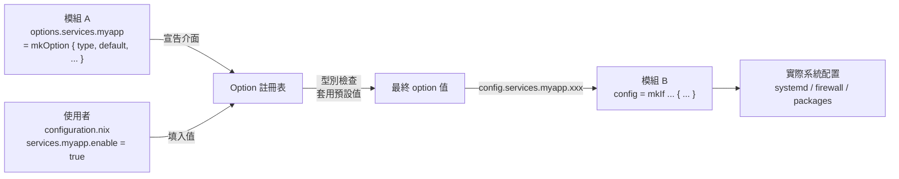
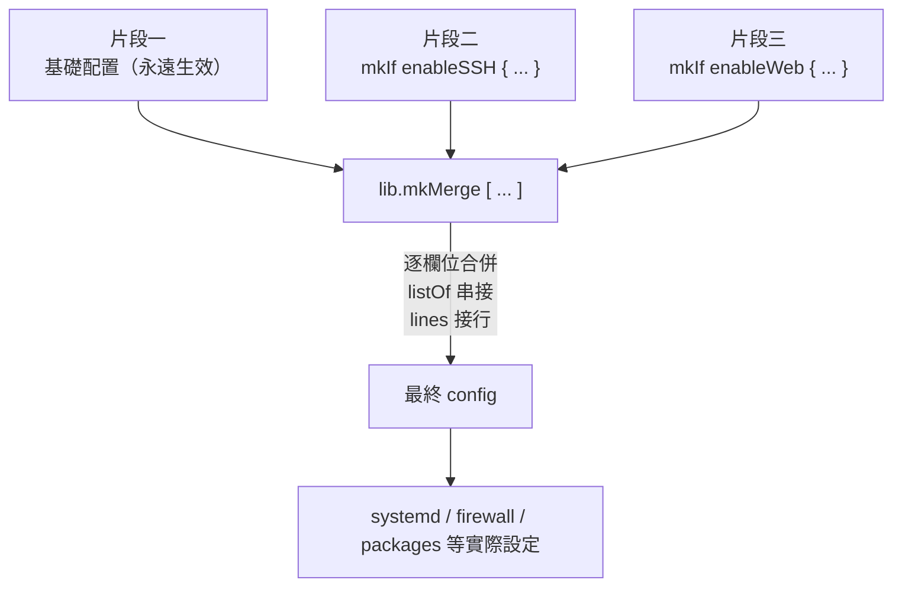
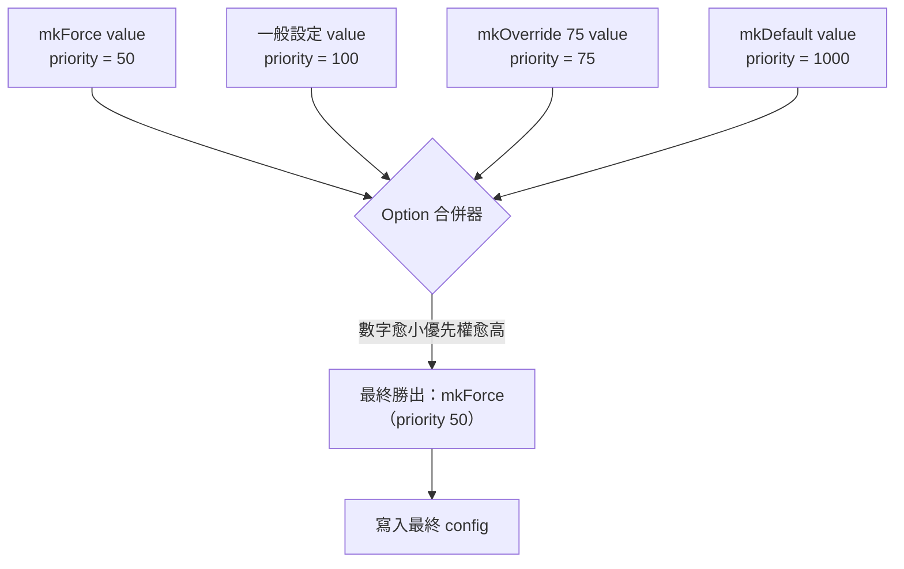

# 第6章：Option 系統與 mkOption

## 本章學習目標

完成本章後，你將能夠：

1. 說明 NixOS option 的定義結構（type、default、description）
2. 使用 `mkEnableOption` 建立 enable/disable 開關
3. 正確使用 `mkIf` 進行條件配置
4. 使用 `mkMerge` 合併多個配置片段
5. 理解 option priority 機制與 `mkForce` 的用途
6. 透過多種管道查閱 option 說明文件

---

## 前置知識

- 完成第 5 章（NixOS 模組系統基礎）
- 能夠讀懂基本的 Nix 屬性集語法
- 知道 `configuration.nix` 的基本結構

---

## 章節內容概覽

- 6.1 Option 是什麼：NixOS 的配置介面
- 6.2 Option 的定義結構：type、default、example、description
- 6.3 NixOS 的 Type System（listOf、attrsOf、submodule 等）
- 6.4 `mkEnableOption`：標準化的啟用開關
- 6.5 `mkIf`：條件配置
- 6.6 `mkMerge`：合併多個配置
- 6.7 Priority 機制：`mkDefault`、`mkForce`、`mkOverride`
- 6.8 查閱 option 文件的方法

---

## 6.1 Option 是什麼：NixOS 的配置介面

### 從你熟悉的地方出發

你在 `configuration.nix` 裡寫過這樣的設定：

```nix
{ config, pkgs, lib, ... }:
{
  services.openssh.enable = true;
  networking.firewall.allowedTCPPorts = [ 22 80 ];
  system.stateVersion = "25.05";
}
```

這幾行設定對你來說可能已經很自然了。

但你有沒有想過：為什麼 `services.openssh.enable` 只能填 `true` 或 `false`？
為什麼 `networking.firewall.allowedTCPPorts` 要填一個列表？
如果你填錯型別，NixOS 是怎麼報錯的？

答案都藏在 **Option 系統**（option system）裡。

### 什麼是 Option

**你在 `configuration.nix` 裡寫的每一個屬性，都是一個 option。**

Option 是 NixOS 模組系統提供的**介面**（interface）。

每個 option 都有三個關鍵特性：

1. **型別**（type）：規定你能填入什麼值，填錯會在建構時報錯
2. **預設值**（default value）：如果你沒設定，系統會自動套用預設值
3. **說明文件**（description）：記錄這個 option 的用途，顯示在 `man configuration.nix` 和 `search.nixos.org` 上

### Option 與模組的關係

NixOS 的每個功能，都以模組（module）的形式存在。

每個模組分成兩個部分：

- `options`：宣告這個模組提供哪些可設定的介面
- `config`：根據使用者設定的值，產生實際的系統配置

你在 `configuration.nix` 裡寫的設定，就是在填寫某個模組宣告的 `options`。

這個分離設計讓 NixOS 具備一個重要特性：**所有配置都是有結構的，不是自由格式的文字**。

下圖展示 option 從「宣告」到「實際生效」的完整資料流，幫助你建立 option 系統的整體心智模型：



左半邊是「宣告」階段，右半邊是「消費」階段，中間的 option 註冊表負責驗證與合併。

---

## 6.2 Option 的定義結構

### 看一個完整的 Option 定義

假設我們正在撰寫一個叫做 `myapp` 的自訂服務模組。

以下是它的 option 定義部分：

```nix
{ lib, ... }:
{
  options.services.myapp = {

    enable = lib.mkEnableOption "My Application";

    port = lib.mkOption {
      type = lib.types.port;
      default = 8080;
      example = 9000;
      description = "The TCP port that myapp listens on.";
    };

    dataDir = lib.mkOption {
      type = lib.types.path;
      default = "/var/lib/myapp";
      description = "The directory where myapp stores its data.";
    };

    extraConfig = lib.mkOption {
      type = lib.types.lines;
      default = "";
      description = "Extra configuration lines to append to myapp.conf.";
    };

  };
}
```

這個定義宣告了四個 option：`enable`、`port`、`dataDir`、`extraConfig`。

### 逐一拆解各欄位

**`type`（型別）**

型別是最重要的欄位。它告訴 NixOS：這個 option 只接受什麼樣的值。

如果你填入錯誤型別的值，建構時會立即報錯，不會等到執行時才崩潰。

例如，`port` 的型別是 `lib.types.port`，代表 1 到 65535 之間的整數。
如果你填 `"8080"`（字串），建構就會失敗。

**`default`（預設值）**

使用者沒有設定這個 option 時，系統自動套用的值。

例如，`port` 的預設值是 `8080`。
如果你在 `configuration.nix` 沒有設定 `services.myapp.port`，服務就會在 8080 埠啟動。

**`example`（範例值）**

這個欄位**不影響實際行為**。

它只是顯示在說明文件中，讓使用者知道可以填什麼樣的值。

例如 `port` 的 example 是 `9000`，這只是文件範例，不會影響預設值。

**`description`（說明文字）**

說明這個 option 的用途。

這段文字會出現在：
- `man configuration.nix`
- `search.nixos.org/options`
- `nixos-option` 指令的輸出

良好的說明文字讓其他人（和未來的自己）能快速理解這個 option 的作用。

### Option 定義是「宣告」，不是「設定」

特別注意：上面的程式碼是在**宣告** option 的存在與結構，不是在設定值。

宣告（declaration）發生在模組的 `options` 區塊裡。
設定（configuration）發生在使用者的 `configuration.nix` 或模組的 `config` 區塊裡。

這個分離是 NixOS 模組系統的根基。

---

## 6.3 NixOS Type System

### 為什麼 Type System 很重要

在傳統 Linux 配置檔案裡，你可能把密碼設定寫錯格式，等到服務啟動才發現。

NixOS 的 type system 讓這類問題在**建構階段**就被抓出來，不會進入執行環境。

這是「宣告式」和「靜態驗證」思維的具體體現。

### 常用型別一覽

以下是 NixOS 模組開發中最常見的型別：

| 型別 | 說明 | 範例值 |
|---|---|---|
| `lib.types.bool` | 布林值 | `true` / `false` |
| `lib.types.int` | 整數 | `8080` |
| `lib.types.port` | 連接埠（1-65535） | `443` |
| `lib.types.str` | 字串 | `"hello"` |
| `lib.types.path` | 路徑 | `/var/lib/myapp` |
| `lib.types.lines` | 多行字串（自動換行合併） | `"line1\nline2"` |
| `lib.types.attrs` | 屬性集 | `{ key = "value"; }` |
| `lib.types.listOf lib.types.str` | 字串列表 | `[ "a" "b" ]` |
| `lib.types.attrsOf lib.types.int` | 字串鍵-整數值的屬性集 | `{ a = 1; }` |
| `lib.types.nullOr lib.types.str` | 字串或 null | `"text"` / `null` |
| `lib.types.enum [ "a" "b" ]` | 固定選項 | `"a"` |
| `lib.types.package` | Nix 套件 | `pkgs.nginx` |
| `lib.types.submodule { options = ...; }` | 巢狀模組 | `{ enable = true; port = 80; }` |

### 常用型別詳解

**`lib.types.str` 與 `lib.types.lines`**

兩者都是字串，但行為不同。

`str` 在多個模組都設定時會衝突報錯。
`lines` 在多個模組都設定時會自動用換行符號合併內容。

這讓多個模組可以各自貢獻一段設定文字，最終合併成完整的設定檔。

以下是 `lines` 型別的典型用法：

```nix
{ lib, ... }:
{
  options.services.myapp.extraConfig = lib.mkOption {
    type = lib.types.lines;
    default = "";
    description = "Extra configuration lines appended to myapp.conf.";
  };
}
```

使用者可以在自己的模組中多次設定這個 option：

```nix
{ config, pkgs, lib, ... }:
{
  services.myapp.extraConfig = ''
    log_level = debug
    max_connections = 100
  '';
}
```

另一個模組也可以設定：

```nix
{ config, pkgs, lib, ... }:
{
  services.myapp.extraConfig = ''
    timeout = 30
  '';
}
```

最終合併結果會是兩段文字接在一起，以換行分隔。

**`lib.types.nullOr`**

用於「可選」的 option：值可以是某種型別，也可以是 `null`（代表未設定）。

```nix
{ lib, ... }:
{
  options.services.myapp.adminEmail = lib.mkOption {
    type = lib.types.nullOr lib.types.str;
    default = null;
    description = "Admin email address. null means no notification.";
  };
}
```

在 `config` 區塊可以根據是否為 `null` 做不同處理：

```nix
{ config, lib, ... }:
{
  config = lib.mkIf (config.services.myapp.adminEmail != null) {
    # 只有設定了 adminEmail 才啟用通知
  };
}
```

**`lib.types.enum`**

用於只允許固定幾個選項的 option。

```nix
{ lib, ... }:
{
  options.services.myapp.logLevel = lib.mkOption {
    type = lib.types.enum [ "debug" "info" "warn" "error" ];
    default = "info";
    description = "Log level for myapp.";
  };
}
```

填入不在列表裡的值，建構就會報錯。這比用 `str` 更安全。

**`lib.types.submodule`：巢狀模組型別**

`submodule` 讓一個 option 本身可以有子 options，形成巢狀結構。

這就是 `services.nginx.virtualHosts` 的實作方式。

先看 `virtualHosts` 的使用方式：

```nix
{ config, pkgs, lib, ... }:
{
  services.nginx.virtualHosts."example.com" = {
    enableSSL = true;
    forceSSL = true;
    locations."/" = {
      proxyPass = "http://127.0.0.1:8080";
    };
  };

  system.stateVersion = "25.05";
}
```

每一個虛擬主機（virtual host）都是一個 submodule 的實例，有自己的一組 options。

以下是一個簡化的 submodule 定義範例：

```nix
{ lib, ... }:
{
  options.services.myapp.backends = lib.mkOption {
    type = lib.types.attrsOf (lib.types.submodule {
      options = {
        host = lib.mkOption {
          type = lib.types.str;
          description = "Backend hostname.";
        };
        port = lib.mkOption {
          type = lib.types.port;
          default = 8080;
          description = "Backend port.";
        };
        weight = lib.mkOption {
          type = lib.types.int;
          default = 1;
          description = "Load balancing weight.";
        };
      };
    });
    default = {};
    description = "Map of backend server configurations.";
  };
}
```

使用者設定這個 option 的方式：

```nix
{ config, pkgs, lib, ... }:
{
  services.myapp.backends = {
    server-a = {
      host = "10.0.0.1";
      port = 8080;
      weight = 2;
    };
    server-b = {
      host = "10.0.0.2";
      # port 和 weight 使用預設值
    };
  };

  system.stateVersion = "25.05";
}
```

`submodule` 是 NixOS 大型配置結構的基礎，理解它之後，很多複雜的 option 結構都會豁然開朗。

---

## 6.4 mkEnableOption：標準化的啟用開關

### 最常見的 Option 模式

幾乎所有 NixOS 服務都有一個 `enable` option：

```nix
services.openssh.enable = true;
services.nginx.enable = true;
services.postgresql.enable = true;
```

這個模式如此普遍，NixOS 提供了 `lib.mkEnableOption` 來簡化定義。

### mkEnableOption 的用法

```nix
{ lib, ... }:
{
  options.services.myapp.enable = lib.mkEnableOption "My Application";
}
```

這一行等價於手動寫出：

```nix
{ lib, ... }:
{
  options.services.myapp.enable = lib.mkOption {
    type = lib.types.bool;
    default = false;
    description = lib.mdDoc "Whether to enable My Application.";
  };
}
```

`mkEnableOption` 幫你做了三件事：

1. 型別固定為 `lib.types.bool`
2. 預設值固定為 `false`（預設不啟用）
3. 自動產生標準化的說明文字（"Whether to enable ..."）

### 為什麼預設值是 false

預設不啟用是 NixOS 的設計哲學之一：**最小化預設安裝**。

你沒有明確要求的功能，就不會出現在你的系統上。

這和傳統 Linux 發行版不同，在那些系統上，安裝一個套件可能會自動啟動一個背景服務，即使你不需要它。

### 辨識 enable option

在閱讀模組程式碼時，看到 `lib.mkEnableOption` 就能立刻知道：

- 這是一個布林開關
- 預設是關閉的
- 使用者需要明確設定 `true` 才會啟用

這種一致性讓 NixOS 的配置介面非常可預測。

---

## 6.5 mkIf：條件配置

### 問題：如何讓配置「因為 option 而生效」

你已經知道如何宣告 option。
但宣告之後，這些設定值要怎麼變成實際的系統配置？

這就是 `lib.mkIf` 的用途。

`mkIf` 讓你寫出：「如果某個 option 是 true，就套用這段配置。」

### 一個完整的模組範例

以下是一個完整的 `myapp` 模組，包含 options 宣告和 config 實作：

```nix
{ config, pkgs, lib, ... }:
{
  # 宣告 options（介面）
  options.services.myapp = {

    enable = lib.mkEnableOption "My Application";

    port = lib.mkOption {
      type = lib.types.port;
      default = 8080;
      description = "Port for myapp.";
    };

  };

  # 實作 config（根據 options 的值產生配置）
  config = lib.mkIf config.services.myapp.enable {

    # 建立 systemd 服務
    systemd.services.myapp = {
      description = "My Application";
      wantedBy = [ "multi-user.target" ];
      serviceConfig = {
        ExecStart = "${pkgs.myapp}/bin/myapp --port ${toString config.services.myapp.port}";
        Restart = "on-failure";
      };
    };

    # 開放防火牆
    networking.firewall.allowedTCPPorts = [ config.services.myapp.port ];

    # 把執行檔加入系統環境
    environment.systemPackages = [ pkgs.myapp ];

  };
}
```

### 逐行解析

**`config = lib.mkIf config.services.myapp.enable { ... };`**

這一行的意思是：
「只有當 `config.services.myapp.enable` 為 `true` 時，大括號裡的設定才會實際套用。」

`config.services.myapp.enable` 讀取的是這個模組自己宣告的 option 值。
使用者在 `configuration.nix` 設定 `services.myapp.enable = true;` 時，這個值就會是 `true`。

**`${toString config.services.myapp.port}`**

`toString` 把整數轉換成字串，讓它能嵌入指令字串中。

`config.services.myapp.port` 讀取使用者設定的 port 值（預設是 8080）。

**整個模式**

```
使用者設定 option →  mkIf 讀取 option 值 → 決定是否套用 config 區塊
```

這是 NixOS 模組系統最核心的運作模式。

### mkIf 與一般 if 的差異

你可能會想：這樣寫不也可以嗎？

```nix
# 不建議這樣寫
{ config, pkgs, lib, ... }:
{
  systemd.services.myapp =
    if config.services.myapp.enable
    then {
      description = "My Application";
      # ...
    }
    else {};
}
```

技術上這可以運作，但 `lib.mkIf` 的優點是：

1. **延遲求值**（lazy evaluation）：`mkIf` 在模組系統的合併階段才求值，一般 `if` 則在求值時立刻執行。在某些循環依賴的情境下，`mkIf` 能避免無限遞迴。

2. **語意清晰**：`config = lib.mkIf condition { ... }` 一眼就能看出「整個 config 區塊都是條件性的」。

3. **慣例**：NixOS 上游模組都使用 `mkIf`，遵循慣例讓你的程式碼更容易被其他 NixOS 開發者讀懂。

### 條件中使用邏輯運算

`mkIf` 的條件可以使用任何 Nix 布林運算：

```nix
{ config, lib, ... }:
{
  # 同時啟用兩個服務才套用
  config = lib.mkIf (config.services.openssh.enable && config.services.fail2ban.enable) {
    services.fail2ban.jails.sshd = {
      enabled = true;
    };
  };
}
```

---

## 6.6 mkMerge：合併多個配置片段

### 問題：一個模組裡有多個條件

當你的模組需要根據多個不同的條件套用不同的配置時，把所有東西塞進一個 `mkIf` 會讓程式碼很難讀。

`lib.mkMerge` 讓你把多個配置片段寫成一個列表，NixOS 會把它們合併成一個完整的配置。

### mkMerge 的基本用法

```nix
{ config, pkgs, lib, ... }:
{
  config = lib.mkMerge [

    # 片段一：基礎配置（永遠生效）
    {
      environment.systemPackages = [ pkgs.curl ];
    }

    # 片段二：條件配置，只有啟用 openssh 時才生效
    (lib.mkIf config.services.openssh.enable {
      networking.firewall.allowedTCPPorts = [ 22 ];
    })

    # 片段三：條件配置，只有啟用 nginx 時才生效
    (lib.mkIf config.services.nginx.enable {
      networking.firewall.allowedTCPPorts = [ 80 443 ];
    })

  ];
}
```

`lib.mkMerge` 接受一個列表，每個元素都是一個配置屬性集。

NixOS 會把列表裡所有的配置智慧地合併在一起。

### 合併的規則

對於 `lib.types.listOf` 型別的 option（例如 `networking.firewall.allowedTCPPorts`），多個模組設定的值會被**串接**，不會互相覆蓋。

所以上面的例子，如果同時啟用了 openssh 和 nginx，`allowedTCPPorts` 的結果就是 `[ 22 80 443 ]`。

### 使用時機

`mkMerge` 適合用在以下情境：

**情境一：同一個模組裡有多個獨立的條件**

與其把所有條件寫成巢狀 `mkIf`，不如用 `mkMerge` 並排列出。

**情境二：基礎配置混合條件配置**

如上面的例子，把「永遠生效的部分」和「條件生效的部分」清楚地分開。

**情境三：模組很大，需要分段撰寫**

可以把每個功能區塊寫成一個片段，最後用 `mkMerge` 組合。

### 一個更完整的範例

以下是一個同時管理 SSH 和 Web 服務的模組，使用 `mkMerge` 組織結構：

```nix
{ config, pkgs, lib, ... }:
{
  options = {
    mySystem.enableSSH = lib.mkEnableOption "SSH access";
    mySystem.enableWeb = lib.mkEnableOption "Web server";
  };

  config = lib.mkMerge [

    # 所有系統都有的基礎套件
    {
      environment.systemPackages = with pkgs; [
        htop
        curl
        git
      ];
    }

    # SSH 相關配置
    (lib.mkIf config.mySystem.enableSSH {
      services.openssh = {
        enable = true;
        settings = {
          PasswordAuthentication = false;
          PermitRootLogin = "no";
        };
      };
      networking.firewall.allowedTCPPorts = [ 22 ];
    })

    # Web 相關配置
    (lib.mkIf config.mySystem.enableWeb {
      services.nginx.enable = true;
      networking.firewall.allowedTCPPorts = [ 80 443 ];
    })

  ];
}
```

使用者只需要設定：

```nix
{ config, pkgs, lib, ... }:
{
  mySystem.enableSSH = true;
  mySystem.enableWeb = true;
  system.stateVersion = "25.05";
}
```

NixOS 就會根據這兩個 option 的值，組合出完整的系統配置。

下圖呈現 `mkMerge` 如何把多個配置片段（含條件片段）合併為單一最終配置：



每個 `mkIf` 片段都會先依條件決定是否「啟用」，再由 `mkMerge` 把所有啟用片段以 NixOS 的型別感知方式合併。

---

## 6.7 mkDefault、mkForce 與 Priority 機制

### 問題：多個模組設定同一個 option 時怎麼辦

NixOS 的模組系統允許多個模組同時設定同一個 option 的值。

例如：你有一個「基礎配置」模組和一個「安全強化」模組，兩者都設定了 `services.openssh.settings.PasswordAuthentication`。

NixOS 需要一個規則來決定哪個值最終生效。

這個規則就是**優先權**（priority）機制。

### 優先權數字的規則

優先權用數字表示。數字愈小，優先權愈高，最終勝出。

| 函式 | 優先權數字 | 說明 |
|---|---|---|
| `lib.mkDefault` | 1000 | 低優先，容易被其他設定覆蓋 |
| 一般設定（不加任何函式） | 100 | 預設優先權 |
| `lib.mkForce` | 50 | 高優先，強制覆蓋其他設定 |

記憶方式：「數字小 → 優先高 → 最終勝出」

### mkDefault：我的設定是建議值，可以被覆蓋

`mkDefault` 用於模組提供的**預設建議值**，允許使用者或其他模組覆蓋。

以下是一個基礎配置模組的範例：

```nix
# base.nix：基礎配置，設定合理的預設值
{ lib, ... }:
{
  services.openssh.settings.PasswordAuthentication = lib.mkDefault true;
}
```

這裡用 `mkDefault` 是因為：「我認為大多數使用者需要密碼登入，但如果有其他模組或使用者想關閉，我不反對。」

### mkForce：我的設定不容覆蓋

`mkForce` 用於**必須強制執行**的設定，不允許其他模組或使用者覆蓋。

以下是一個安全強化模組的範例：

```nix
# security.nix：安全強化模組，強制關閉密碼登入
{ lib, ... }:
{
  services.openssh.settings.PasswordAuthentication = lib.mkForce false;
}
```

這裡用 `mkForce` 是因為：「這個安全策略要求必須使用金鑰登入，任何試圖開啟密碼登入的設定都必須被否決。」

### 優先權衝突的實際場景

假設你的配置同時匯入了 `base.nix`、`security.nix`，使用者也在 `configuration.nix` 裡設定了值：

```nix
# configuration.nix
{ config, pkgs, lib, ... }:
{
  imports = [
    ./base.nix     # mkDefault true  (優先權 1000)
    ./security.nix # mkForce false   (優先權 50)
  ];

  # 使用者自己的設定（優先權 100）
  services.openssh.settings.PasswordAuthentication = true;

  system.stateVersion = "25.05";
}
```

最終結果：**`PasswordAuthentication` 是 `false`**。

原因：`mkForce`（優先權 50）的數字最小，所以它勝出。
即使使用者明確寫了 `true`，也被 `mkForce false` 否決。

### 衝突時的錯誤訊息

如果兩個模組以相同優先權設定衝突的值，NixOS 會報錯：

```
error: The option `services.openssh.settings.PasswordAuthentication' has conflicting definition values:
  - In `base.nix': true
  - In `configuration.nix': false
```

這個錯誤提示你必須明確使用 `mkForce` 或 `mkDefault` 來解決衝突。

### mkOverride：手動指定優先權數字

如果你需要更精細的控制，可以用 `lib.mkOverride` 直接指定優先權數字：

```nix
{ lib, ... }:
{
  # 優先權 75，介於 mkDefault 和 mkForce 之間
  services.openssh.settings.PasswordAuthentication = lib.mkOverride 75 false;
}
```

實際使用中，`mkDefault` 和 `mkForce` 已經能處理大多數情況。
`mkOverride` 留給需要更精細控制的特殊場景。

### 什麼時候需要 mkDefault 和 mkForce

**使用 `mkDefault` 的時機：**
- 你在寫一個「通用基礎模組」，提供合理的預設值，但允許使用者依據需求覆蓋

**使用 `mkForce` 的時機：**
- 你在寫一個「安全策略模組」或「合規性模組」，某些設定必須強制執行
- 你遇到了衝突錯誤，而你確定自己的設定應該優先

**不需要任何函式的時機：**
- 大多數一般配置，直接設定值即可

下圖以視覺化方式說明各種優先權的相對位置，以及多個來源同時設定時誰會勝出：



記憶口訣：「priority 數字小 → 優先權高 → 最終勝出」。`mkForce` 在數線最左、`mkDefault` 在最右。

---

## 6.8 查閱 Option 文件的方法

### 四種查詢方式

NixOS 提供了多種方式查閱 option 的說明和當前值。

每種方式各有適合的使用場景。

### 方式一：線上搜尋（最快速）

**`search.nixos.org/options`**

這是最便捷的查詢入口，支援模糊搜尋。

在搜尋框輸入關鍵字（例如 `openssh password`），就能找到相關的 option，以及它的型別、預設值、說明、和定義所在的原始碼位置。

適合在還不知道確切 option 名稱時使用。

### 方式二：本機 man page（離線可用）

```bash
man configuration.nix
```

這個 man page 包含當前安裝的 NixOS 所有 option 說明。

在 man page 裡搜尋特定 option：

```bash
# 進入 man page 後，按 / 然後輸入關鍵字
# 例如搜尋 openssh
/openssh
```

適合在沒有網路的環境中使用，或想要查閱目前安裝版本的精確說明。

### 方式三：nixos-option 指令（查詢當前值）

```bash
# 查看某個 option 的當前值和說明
nixos-option services.openssh.enable
```

輸出範例：

```
Value:
  true

Default:
  false

Description:
  Whether to enable the OpenSSH secure shell daemon.

Declared by:
  /nix/store/.../nixos/modules/services/networking/ssh/sshd.nix
```

`nixos-option` 能顯示：
- **Value**：這個 option 在當前系統的實際值
- **Default**：option 的預設值
- **Description**：說明文字
- **Declared by**：定義這個 option 的模組原始碼路徑

這個工具特別適合除錯，確認某個設定是否真的被套用。

### 方式四：nix repl 互動查詢（開發者模式）

```bash
nix repl
```

進入 repl 後，載入 NixOS 選項：

```
nix-repl> :l <nixpkgs/nixos>
```

然後就可以互動式地查詢：

```
nix-repl> options.services.openssh.enable.description
"Whether to enable the OpenSSH secure shell daemon."

nix-repl> options.services.openssh.enable.default
false

nix-repl> options.services.openssh.enable.type.name
"bool"
```

這個方式適合在撰寫模組時，快速確認 option 的型別和結構。

### 查詢技巧：從錯誤訊息找到 option 定義

當你遇到建構錯誤，錯誤訊息通常會包含類似這樣的路徑：

```
In `/nix/store/...-source/nixos/modules/services/networking/ssh/sshd.nix':
```

你可以到這個路徑下找到 option 的定義原始碼，直接閱讀 `mkOption` 的定義，了解這個 option 的完整結構和設計意圖。

---

## 本章小結

### 核心概念回顧

本章介紹了 NixOS Option 系統的完整架構。

**Option 是介面**

你在 `configuration.nix` 寫的每一行設定，都是在填寫某個模組宣告的 option。
Option 有型別、預設值、說明文件，讓配置有結構、可驗證、可查閱。

**Type System 保障正確性**

NixOS 在建構階段就驗證型別，而不是等到執行時才報錯。
理解常用型別（特別是 `lines`、`nullOr`、`submodule`）能讓你更靈活地設計配置介面。

**mkEnableOption 建立開關**

`lib.mkEnableOption` 是標準化的服務開關定義方式。
預設 `false` 體現了「最小化預設安裝」的設計哲學。

**mkIf 連結 options 與 config**

`lib.mkIf` 是 NixOS 模組系統的核心模式：
「宣告 option → 使用者設定值 → mkIf 根據值決定是否套用 config」

**mkMerge 組織多個條件**

`lib.mkMerge` 讓你把多個獨立的配置片段清楚地並排列出，
比巢狀 `mkIf` 更易讀、更好維護。

**Priority 機制解決衝突**

`mkDefault`（優先權低）用於可被覆蓋的預設值。
`mkForce`（優先權高）用於不可覆蓋的強制設定。
一般設定介於兩者之間。

### 這些知識的用途

目前你已經能讀懂大多數 NixOS 模組的結構，理解模組為什麼這樣設計，
也能在遇到問題時知道該查閱什麼。

下一章將進入 Flakes 現代結構，學習如何把這些模組組織成一個可複現、可版本控制的完整系統配置。

### 本章涉及的函式速查

| 函式 | 用途 |
|---|---|
| `lib.mkOption { ... }` | 定義一個 option，指定型別、預設值、說明等 |
| `lib.mkEnableOption "Name"` | 定義標準的 enable/disable 開關 |
| `lib.mkIf condition { ... }` | 條件性地套用配置 |
| `lib.mkMerge [ ... ]` | 合併多個配置片段 |
| `lib.mkDefault value` | 設定低優先權的值（可被覆蓋） |
| `lib.mkForce value` | 設定高優先權的值（強制覆蓋） |
| `lib.mkOverride n value` | 手動指定優先權數字 |

---

> **下一章預告**
>
> 第 7 章將介紹 **Flakes 現代結構**：如何用 `flake.nix` 取代傳統的 channel 管理，
> 讓你的 NixOS 配置真正實現版本鎖定與完全可複現。
