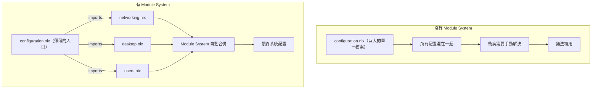
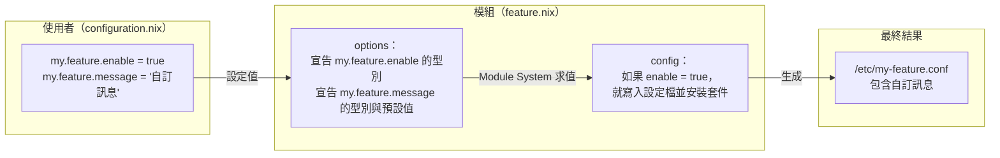
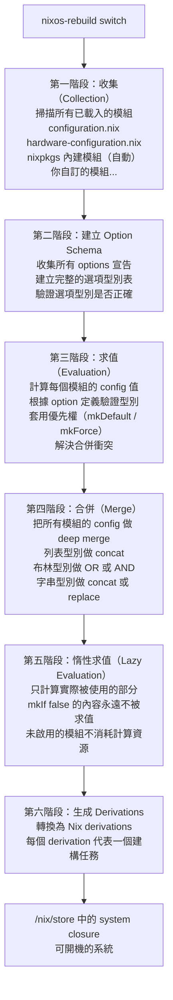
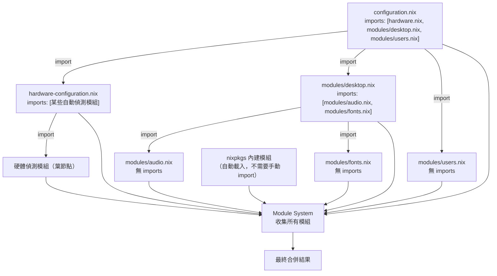
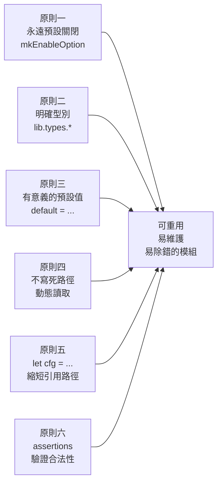

# 第7章：NixOS Module System

## 本章學習目標

完成本章後，你將能夠：

1. 說明 NixOS Module System 的設計目標與核心價值
2. 識別 Module 的兩種基本結構形式
3. 理解 `options` 與 `config` 分離的根本原因
4. 描述 Module 的完整評估流程（收集、求值、合併）
5. 正確使用 `config`、`pkgs`、`lib`、`modulesPath` 等模組參數
6. 透過 `specialArgs` 傳遞自訂參數給所有模組
7. 追蹤 `imports` 的遞迴展開機制
8. 從零撰寫一個帶有 `options` 宣告的可重用模組
9. 套用 Reusable Module 設計原則

---

## 前置知識

- 完成第 6 章（理解 configuration.nix 的基本結構）
- 熟悉 Nix 語言基礎：attribute set、`let ... in`、函式語法
- 了解 `nixos-rebuild switch` 的作用

---

## 7.1 Module System 的設計目標

### 問題從哪裡來？

你在第 2 章學到，NixOS 的配置放在 `configuration.nix`。

但隨著系統變複雜，一個問題出現了：

如果把所有配置塞進同一個檔案，會發生什麼事？

- 檔案變得龐大，難以維護
- 無法複用同一段配置到另一台機器
- 想要「開關某個功能」必須手動刪除或新增程式碼
- 不同來源的配置（自己寫的、nixpkgs 提供的）容易產生衝突

這些問題，正是 Module System（模組系統）想要解決的。

### Module System 的四個核心目標

**目標一：讓配置可以組合（Composable）**

你可以把系統拆成多個小模組，各自負責一件事。

```text
configuration.nix
    ↓ imports
networking.nix   + desktop.nix   + users.nix   + ...
```

每個模組只負責自己的部分，彼此不直接依賴。

**目標二：讓不同來源的模組可以互相合作**

nixpkgs 裡有幾千個內建模組。

你寫的模組、社群的模組、第三方的模組，全都可以一起使用。

Module System 負責把所有模組的配置**合併**成一個最終結果，不會互相覆蓋或衝突。

**目標三：讓功能可以開關（Enable / Disable）**

你不需要刪除程式碼來關閉某個功能。

只需要設定：

```nix
my.feature.enable = false;
```

功能就不會被啟用，也不會被計算。

**目標四：讓配置可以被覆蓋（Override）**

不同模組可以對同一個選項設定不同的值。

Module System 透過優先權機制（`mkDefault`、`mkForce` 等）決定最終使用哪個值，不需要你手動解決衝突。

### 沒有 Module System vs 有 Module System



有了 Module System，你的 `configuration.nix` 可以變得非常精簡，只做一件事：**宣告要載入哪些模組**。

---

## 7.2 一個完整的 Module 長什麼樣

NixOS Module 有兩種基本形式。

### 結構一：直接返回屬性集（最常見）

這是最簡單的模組形式，沒有 `options` 宣告，直接提供配置值。

你每天看到的 `configuration.nix` 就是這種形式：

```nix
# 這是最簡單的 module 形式
# 函式接收模組參數，直接返回配置屬性集
{ config, pkgs, ... }:
{
  # 直接設定 NixOS 選項，沒有宣告新的 options
  services.openssh.enable = true;

  environment.systemPackages = [ pkgs.git ];
}
```

這種寫法適合用途單純的模組：只設定配置，不提供新的選項介面。

### 結構二：有 `options` 宣告的完整 Module

當你想讓別人透過自訂選項控制這個模組的行為時，就需要宣告 `options`：

```nix
# 完整的模組結構：有 options 宣告也有 config 實作
{ config, pkgs, lib, ... }:
{
  # 第一部分：宣告這個模組提供哪些選項（介面）
  options = {
    my.feature.enable = lib.mkEnableOption "My Feature";

    my.feature.message = lib.mkOption {
      type = lib.types.str;
      default = "Hello from My Feature";
      description = "The message to display.";
    };
  };

  # 第二部分：根據選項值實作配置（實作）
  # lib.mkIf 代表：只有在 enable = true 時才啟用這段配置
  config = lib.mkIf config.my.feature.enable {
    environment.etc."my-feature.conf".text = config.my.feature.message;

    environment.systemPackages = [ pkgs.hello ];
  };
}
```

注意這個結構的兩個頂層屬性：

| 屬性 | 角色 | 說明 |
|------|------|------|
| `options` | 介面（Interface） | 宣告這個模組提供哪些可設定的選項 |
| `config` | 實作（Implementation） | 根據選項值，決定實際的系統配置 |

這種分離是 Module System 最重要的設計。下一節會詳細說明原因。

### 兩種結構的關係

結構一其實是結構二的簡化版。

當你的模組沒有 `options` 宣告時，直接返回的屬性集會被 Module System 視為 `config` 部分。

也就是說：

```nix
{ config, pkgs, ... }:
{
  services.openssh.enable = true;
}
```

等同於：

```nix
{ config, pkgs, ... }:
{
  config = {
    services.openssh.enable = true;
  };
}
```

---

## 7.3 options 與 config 的分離

這是本章最重要的核心概念。

### 為什麼要分離？

想像你正在使用一個別人寫的模組 `feature.nix`。

你需要知道兩件事：

1. **我可以設定什麼？**（介面）
2. **設定後系統會做什麼？**（實作）

`options` 回答第一個問題。

`config` 回答第二個問題。

作為使用者，你只需要關心 `options`（介面），不需要了解 `config` 的內部實作細節。

### 求值流程圖



### 分離帶來的三個好處

**好處一：介面穩定，實作可以改變**

模組的 `options`（介面）一旦確定，使用者的配置不需要修改。

模組作者可以隨時改進 `config`（實作），使用者感受不到差異。

**好處二：多模組共存，互不干擾**

模組 A 宣告 `my.moduleA.enable`，模組 B 宣告 `my.moduleB.enable`。

兩者的 `options` 命名空間不同，不會互相衝突。

**好處三：條件啟用（Conditional Activation）**

透過 `lib.mkIf config.my.feature.enable { ... }`，只有在使用者明確設定 `enable = true` 時，才會有任何系統配置被啟動。

未啟用的模組，其 `config` 區塊完全不會被計算。

### 一個容易混淆的地方

初學者常常困惑：

> 「`config` 到底是我設定的值，還是模組提供的？」

答案是：**兩者都是，但角色不同**。

- 作為**使用者**，你在 `configuration.nix` 裡「設定」選項值（不需要寫 `config =`，直接寫）
- 作為**模組作者**，你在模組裡用 `config =` 宣告「根據選項值要做什麼」
- 在任何模組的函式參數中，`config` 代表「整個系統求值後的完整配置」，用來讀取其他模組的設定值

---

## 7.4 Module 評估流程詳解

當你執行 `nixos-rebuild switch` 時，NixOS 的 Module System 會經歷四個階段。

### 完整流程圖



### 各階段說明

**第一階段：收集（Collection）**

Module System 把所有模組收集起來，形成一個大列表。

來源包括：
- 你的 `configuration.nix`
- `hardware-configuration.nix`
- nixpkgs 的內建模組（幾千個，自動載入）
- 你用 `imports` 載入的自訂模組

**第二階段：建立 Option Schema**

掃描所有模組的 `options` 區塊，建立完整的選項型別表（schema）。

這個階段會確定：
- 每個選項的型別（`str`、`bool`、`listOf`...）
- 每個選項的預設值
- 每個選項的說明文字

**第三階段：求值（Evaluation）**

根據使用者設定的值，加上預設值，計算每個選項的最終值。

這個階段會：
- 驗證你設定的值是否符合型別（設錯型別會在這裡報錯）
- 套用優先權（`mkDefault` < 一般設定 < `mkForce`）

**第四階段：合併（Merge）**

把所有模組的 `config` 合併成一個大屬性集。

不同型別有不同的合併策略：

| 型別 | 合併方式 |
|------|---------|
| `bool` | 視情況 OR 或 AND |
| `list` | 串接（concat） |
| `str` | 只能有一個值（衝突報錯）|
| `attrsOf` | 遞迴合併（recursive merge）|

**第五階段：惰性求值（Lazy Evaluation）**

Nix 是惰性求值語言。

`lib.mkIf false { ... }` 內的內容不會被計算。

這意味著：你可以載入幾百個模組，但只有 `enable = true` 的功能才會真正被評估，不會浪費時間。

**第六階段：生成 Derivations**

把最終的配置轉換為 Nix derivations（衍生物，建構任務）。

每個套件、每個服務配置、每個啟動腳本，都對應一個 derivation。

這些 derivation 會被建構並放到 `/nix/store`，最終組成可開機的系統。

### 一個常見的誤解

> 「NixOS 每次 rebuild 都會重新建構所有東西，很慢？」

不對。

因為 `/nix/store` 的路徑是由輸入的 hash 決定的。

只要輸入（配置、程式碼）沒變，hash 就沒變，就不需要重新建構。

只有真正變動的部分才會重新建構。

---

## 7.5 Module 參數：config、options、pkgs、lib、modulesPath

每個模組都是一個函式，函式的參數由 Module System 注入。

這些參數是固定可用的，不需要你手動傳入。

### `config`：讀取整個系統的求值結果

`config` 是求值後的**完整系統配置**。

用途：讀取其他模組設定的值。

```nix
{ config, pkgs, lib, ... }:
{
  # 讀取另一個模組設定的主機名稱
  # 這個值是由 networking.hostName 選項決定的
  environment.etc."hostname-info".text = config.networking.hostName;

  # 根據 SSH 是否啟用來決定要不要安裝某個工具
  environment.systemPackages = lib.optionals config.services.openssh.enable [
    pkgs.openssh
  ];
}
```

注意：`config` 裡讀到的是**求值後的最終值**，不是你在某個模組裡設定的中間值。

### `options`：選項的元數據

`options` 包含所有已宣告選項的**元數據（metadata）**，例如型別定義、說明文字等。

一般情況下你很少需要直接使用 `options`。

進階用途：在某些情況下，你可能需要檢查某個選項是否已被宣告：

```nix
{ options, ... }:
{
  # 進階用法：只有在某個選項被宣告時才做某件事
  # 一般初學者不需要使用這個參數
}
```

### `pkgs`：套件集合

`pkgs` 是 nixpkgs 的套件集合，包含幾萬個套件。

```nix
{ config, pkgs, ... }:
{
  environment.systemPackages = with pkgs; [
    git        # 版本控制
    curl       # HTTP 工具
    ripgrep    # 快速搜尋
    fd         # 快速 find
  ];
}
```

`with pkgs;` 語法讓你不需要每次都寫 `pkgs.`。

### `lib`：NixOS 工具函式庫

`lib` 是 nixpkgs 提供的工具函式庫，包含大量實用函式。

常用的 `lib` 函式：

```nix
{ config, pkgs, lib, ... }:
{
  # lib.mkIf：條件配置，只有條件為 true 才啟用
  config = lib.mkIf config.my.feature.enable {
    environment.systemPackages = [ pkgs.hello ];
  };
}
```

重要的 `lib` 子模組：

| 子模組 | 用途 |
|--------|------|
| `lib.mkIf` | 條件啟用配置 |
| `lib.mkEnableOption` | 快速宣告 enable 選項 |
| `lib.mkOption` | 宣告完整選項 |
| `lib.mkDefault` | 設定低優先權預設值 |
| `lib.mkForce` | 強制覆蓋其他設定 |
| `lib.types.*` | 選項型別定義 |
| `lib.optionals` | 條件列表 |
| `lib.concatMap` | 列表展開與串接 |

### `modulesPath`：nixpkgs 模組目錄路徑

`modulesPath` 是 nixpkgs 的 `nixos/modules` 目錄的絕對路徑。

```nix
{ modulesPath, ... }:
{
  # 進階用法：直接引用 nixpkgs 內建模組的路徑
  imports = [
    (modulesPath + "/profiles/minimal.nix")
  ];
}
```

一般初學者不需要直接使用 `modulesPath`。

在撰寫 NixOS ISO 映像檔、自訂安裝器等進階場景才會用到。

### 參數總覽

```nix
# 模組函式的完整參數列表
{ config    # 求值後的完整系統配置（用來讀取）
, options   # 所有選項的元數據（進階使用）
, pkgs      # nixpkgs 套件集合
, lib       # NixOS 工具函式庫
, modulesPath  # nixpkgs 模組目錄路徑（進階使用）
, ...       # 省略號：允許接收額外參數（specialArgs）
}:
{
  # 你的模組內容
}
```

`...`（省略號）是必要的。

它告訴 Nix：「除了我明確列出的參數，其他額外參數也可以傳進來」。

如果你拿掉 `...`，Module System 傳入額外參數時就會報錯。

---

## 7.6 specialArgs：傳遞自訂參數

有時候你想傳入的不是套件或配置，而是你自己定義的資料。

例如：主機名稱、使用者名稱、特定的環境設定。

`specialArgs` 就是為這個需求設計的。

### 在 flake.nix 中設定 specialArgs

```nix
# flake.nix
{
  description = "My NixOS Configuration";

  inputs = {
    nixpkgs.url = "github:NixOS/nixpkgs/nixos-25.05";
  };

  outputs = { self, nixpkgs }: {
    nixosConfigurations.myhost = nixpkgs.lib.nixosSystem {
      system = "x86_64-linux";

      # specialArgs 裡的值會成為所有模組可接收的額外參數
      # 這些值在所有模組中都可以透過函式參數取得
      specialArgs = {
        myUserName = "alice";
        hostName = "alice-laptop";
        isLaptop = true;
      };

      modules = [
        ./configuration.nix
      ];
    };
  };
}
```

### 在模組中接收並使用 specialArgs

在任何被 `modules` 列表包含的模組中，都可以從函式參數接收 `specialArgs` 的值：

```nix
# configuration.nix
# 注意：myUserName、hostName、isLaptop 都來自 specialArgs
{ config, pkgs, lib, myUserName, hostName, isLaptop, ... }:
{
  # 使用 specialArgs 傳入的主機名稱
  networking.hostName = hostName;

  # 根據是否為筆電決定要不要啟用電源管理
  services.tlp.enable = isLaptop;

  # 使用 specialArgs 傳入的使用者名稱
  users.users.${myUserName} = {
    isNormalUser = true;
    extraGroups = [ "wheel" "networkmanager" ];
  };

  system.stateVersion = "25.05";
}
```

### specialArgs 的常見使用場景

**場景一：主機特化配置**

用同一份 `configuration.nix` 模板管理多台主機，透過 `specialArgs` 傳入各主機的差異：

```nix
# flake.nix 中的多主機配置
outputs = { self, nixpkgs }: {
  nixosConfigurations = {
    laptop = nixpkgs.lib.nixosSystem {
      system = "x86_64-linux";
      specialArgs = { hostName = "alice-laptop"; isLaptop = true; };
      modules = [ ./configuration.nix ];
    };

    desktop = nixpkgs.lib.nixosSystem {
      system = "x86_64-linux";
      specialArgs = { hostName = "alice-desktop"; isLaptop = false; };
      modules = [ ./configuration.nix ];
    };
  };
};
```

**場景二：傳入自訂模組庫**

```nix
specialArgs = {
  # 傳入自己定義的函式庫給所有模組使用
  myLib = import ./lib { inherit lib; };
};
```

### specialArgs 和 `_module.args` 的差異

除了 `specialArgs`，還有另一種傳遞自訂參數的方式：`_module.args`。

| 方式 | 特點 |
|------|------|
| `specialArgs` | 在 `nixosSystem` 呼叫時設定，在所有模組中都可用，包含最早的 imports 階段 |
| `_module.args` | 在模組內設定，但有循環依賴的風險，進階使用才需要了解 |

初學者只需要記住：使用 `specialArgs` 來傳遞自訂參數。

---

## 7.7 imports chain 的完整機制

### imports 如何運作

每個模組都可以有一個 `imports` 列表，列出要載入的其他模組路徑。

```nix
# configuration.nix
{ config, pkgs, ... }:
{
  imports = [
    ./hardware-configuration.nix
    ./modules/desktop.nix
    ./modules/users.nix
  ];

  system.stateVersion = "25.05";
}
```

Module System 會遞迴展開所有 `imports`。

被 import 的模組，還可以繼續 import 其他模組。

### imports 遞迴展開流程



### 重要細節：imports 是集合，不是順序

Module System **不保證** imports 的求值順序。

這是初學者常見的誤解：

> 「我在 A.nix 的 imports 裡先列 B.nix，再列 C.nix，所以 B 的設定會比 C 早套用？」

**不對**。

所有模組的 `options` 和 `config` 都會被收集起來，再統一合併。

順序不影響最終結果。

如果你需要表達「B 的設定應該比 C 的優先」，使用 `lib.mkDefault` 或 `lib.mkForce`，而不是調整 imports 順序。

### nixpkgs 內建模組是自動載入的

你不需要手動 import nixpkgs 的內建模組。

例如，你可以直接設定 `services.openssh.enable = true`，不需要先 import SSH 模組，因為 nixpkgs 已經自動載入了。

需要手動 import 的，只有：

- 你自己寫的模組
- 第三方的模組（如 Home Manager、agenix）

### 循環 imports 會報錯

如果 A import B，B 又 import A，Nix 會報告循環依賴錯誤。

設計模組時，要確保 imports 形成一個有向無環圖（DAG）。

---

## 7.8 撰寫第一個帶 options 的完整 Module

現在把所有概念整合起來，撰寫一個實用的模組。

### 目標

建立一個「開發工具模組」（`modules/development.nix`）。

使用者只需要在 `configuration.nix` 裡設定：

```nix
my.development.enable = true;
my.development.languages = [ "python" "rust" ];
my.development.editor = "neovim";
```

系統就會自動安裝對應的語言工具鏈和編輯器。

### Step 1：建立目錄結構

```text
/etc/nixos/
├── configuration.nix
├── hardware-configuration.nix
└── modules/
    └── development.nix    ← 我們要建立這個檔案
```

### Step 2：定義 options（介面）

先思考這個模組要提供哪些選項：

- `enable`：整個模組的開關
- `languages`：要安裝哪些程式語言的工具鏈
- `editor`：要安裝哪個編輯器

```nix
# modules/development.nix（第一部分：options 宣告）
{ config, pkgs, lib, ... }:
{
  # 宣告這個模組提供的選項
  options.my.development = {
    # mkEnableOption 是快捷寫法，等同於宣告一個 type = bool、default = false 的選項
    enable = lib.mkEnableOption "development tools";

    # mkOption 宣告完整選項：包含型別、預設值、說明
    languages = lib.mkOption {
      # listOf (enum [...]) 代表：一個列表，每個元素只能是列舉值之一
      type = lib.types.listOf (lib.types.enum [ "python" "rust" "go" "nodejs" ]);
      default = [ "python" ];
      description = "Programming languages to set up.";
    };

    editor = lib.mkOption {
      type = lib.types.enum [ "vim" "neovim" "vscode" "emacs" ];
      default = "neovim";
      description = "The default code editor to install.";
    };
  };
```

型別宣告的作用：如果使用者設定 `my.development.editor = "atom"`（不在列舉值中），Module System 會在 rebuild 時立刻報錯，告訴你設定的值不合法。

### Step 3：實作 config（根據選項決定配置）

```nix
  # 接續上面的模組（config 實作部分）
  # lib.mkIf：只有 enable = true 時才啟用以下配置
  config = lib.mkIf config.my.development.enable (
    # let ... in 定義局部變數，讓程式碼更乾淨
    let
      # cfg 是慣用縮寫，代表這個模組的配置值
      cfg = config.my.development;

      # 定義每種語言對應的套件列表
      languagePackages = {
        python = with pkgs; [ python3 python3Packages.pip ];
        rust   = with pkgs; [ rustup cargo ];
        go     = [ pkgs.go ];
        nodejs = with pkgs; [ nodejs nodePackages.npm ];
      };

      # 根據使用者選擇的語言，展開並串接所有套件列表
      # lib.concatMap f list：對每個元素套用 f 後，把結果串接起來
      selectedPackages = lib.concatMap (lang: languagePackages.${lang}) cfg.languages;

      # 定義每種編輯器對應的套件
      editorPackages = {
        vim    = [ pkgs.vim ];
        neovim = [ pkgs.neovim ];
        vscode = [ pkgs.vscode ];
        emacs  = [ pkgs.emacs ];
      };
    in
    {
      # 安裝：選擇的語言套件 + 選擇的編輯器 + 通用開發工具
      environment.systemPackages =
        selectedPackages
        ++ editorPackages.${cfg.editor}
        ++ (with pkgs; [ git curl ripgrep fd ]);

      # 額外啟用 git 的 NixOS 模組（提供更完整的 git 整合）
      programs.git.enable = true;
    }
  );
}
```

### Step 4：在 configuration.nix 中使用這個模組

```nix
# /etc/nixos/configuration.nix
{ config, pkgs, ... }:
{
  imports = [
    ./hardware-configuration.nix
    ./modules/development.nix  # 載入我們的開發工具模組
  ];

  # 啟用開發工具，選擇 Python 和 Rust，使用 neovim
  my.development.enable = true;
  my.development.languages = [ "python" "rust" ];
  my.development.editor = "neovim";

  system.stateVersion = "25.05";
}
```

### Step 5：驗證與建構

```bash
# 先做 dry-run，看看會安裝什麼，不實際切換
sudo nixos-rebuild dry-run --flake .#myhost

# 確認無誤後，實際建構並切換
sudo nixos-rebuild switch --flake .#myhost
```

建構完成後，驗證安裝結果：

```bash
# 確認 Python 已安裝
python3 --version

# 確認 Rust 工具鏈
cargo --version

# 確認編輯器
nvim --version

# 確認通用工具
rg --version   # ripgrep
fd --version   # fd
```

### 關閉功能非常簡單

如果某一天你不需要開發工具了：

```nix
my.development.enable = false;
```

然後 `nixos-rebuild switch`，所有相關套件都會從系統移除。

不需要手動追蹤安裝了什麼，不需要一個一個刪除。

---

## 7.9 Reusable Module 設計原則

撰寫可重用模組是 NixOS 工程實踐的核心技能。

以下是幾個重要的設計原則。

### 原則一：永遠預設關閉

使用 `lib.mkEnableOption` 宣告的選項預設值是 `false`。

這樣設計的好處是：

**載入模組不等於啟用模組**。

你可以在所有機器的共用模組列表中載入這個模組，但只在需要的機器上設定 `enable = true`。

```nix
# 好的設計：預設關閉
options.my.feature.enable = lib.mkEnableOption "My Feature";
# 等同於：
# options.my.feature.enable = lib.mkOption {
#   type = lib.types.bool;
#   default = false;
#   description = "Whether to enable My Feature.";
# };
```

### 原則二：每個選項都要有明確型別

型別宣告是模組的「合約」，讓使用者知道可以設定什麼，也讓 Module System 在設定錯誤時立刻報錯。

```nix
# 好的設計：有明確型別
options.my.feature.port = lib.mkOption {
  type = lib.types.port;  # port 型別：1-65535 的整數
  default = 8080;
  description = "The port to listen on.";
};

# 避免這樣寫：型別太寬鬆，任何值都能通過
options.my.feature.port = lib.mkOption {
  type = lib.types.anything;  # 避免使用
};
```

常用的 `lib.types` 一覽：

| 型別 | 說明 |
|------|------|
| `lib.types.bool` | 布林值 |
| `lib.types.str` | 字串 |
| `lib.types.int` | 整數 |
| `lib.types.port` | 通訊埠（1-65535） |
| `lib.types.path` | 檔案路徑 |
| `lib.types.package` | Nix 套件 |
| `lib.types.listOf X` | 元素型別為 X 的列表 |
| `lib.types.attrsOf X` | 值型別為 X 的屬性集 |
| `lib.types.enum [...]` | 限制為特定值的枚舉 |
| `lib.types.nullOr X` | X 或 null |

### 原則三：提供有意義的預設值

好的預設值讓使用者不設定任何東西也能運作。

```nix
options.my.webserver.port = lib.mkOption {
  type = lib.types.port;
  default = 8080;         # 合理的預設值
  description = "HTTP 服務的監聽埠。";
};
```

### 原則四：不要寫死路徑，動態讀取

共用模組不應該假設特定使用者或路徑存在：

```nix
# 不好的設計：寫死路徑
config = {
  environment.etc."app.conf".text = "user=/home/alice";
};

# 好的設計：動態讀取
config = lib.mkIf cfg.enable {
  # 假設使用者名稱是由選項決定的
  environment.etc."app.conf".text = "user=${cfg.userName}";
};
```

或者動態讀取已存在的 NixOS 配置：

```nix
# 讀取系統中第一個管理員使用者的 home 目錄
# 這只是示意，實際做法視你的模組設計而定
environment.etc."app.conf".text =
  "home=${config.users.users.${cfg.userName}.home}";
```

### 原則五：使用 `let cfg = ...` 縮短路徑

當你需要多次引用 `config.my.feature` 時，用 `let` 定義縮寫：

```nix
config = lib.mkIf config.my.feature.enable (
  let
    cfg = config.my.feature;  # 慣用縮寫
  in
  {
    # 現在用 cfg.xxx 代替 config.my.feature.xxx
    networking.hostName = cfg.hostName;
    services.myApp.port = cfg.port;
  }
);
```

這樣程式碼更簡潔，也更容易閱讀。

### 原則六：用 assertions 驗證配置合法性

`assertions` 讓你在 rebuild 時檢查配置是否符合邏輯限制。

設定不合法時，NixOS 會在 rebuild 時顯示清楚的錯誤訊息，而不是讓服務在執行時才崩潰：

```nix
# 在 config 區塊內加入 assertions
config = lib.mkIf cfg.enable {
  # assertions 是一個列表，每個元素有 assertion（條件）和 message（錯誤訊息）
  assertions = [
    {
      # 條件：埠號必須大於 1024（非特權埠）
      assertion = cfg.port > 1024;
      message = "my.feature.port 必須大於 1024（非特權埠）。目前設定值：${toString cfg.port}";
    }
    {
      # 條件：如果啟用了 TLS，就必須提供憑證路徑
      assertion = cfg.tls.enable -> cfg.tls.certFile != "";
      message = "啟用 TLS 時，必須設定 my.feature.tls.certFile。";
    }
  ];

  # 其他配置...
};
```

`assertions` 是第 23 章（進階 Module 設計）的核心主題，這裡先認識它的用法。

### 設計原則總結



---

## 本章小結

本章深入探討了 NixOS Module System 的完整機制。

### 核心概念回顧

**Module System 解決了什麼問題：**
- 配置可以被拆分成多個模組，各司其職
- 不同來源的模組可以無衝突地合併
- 功能可以用 `enable = true/false` 開關
- 配置值可以透過優先權機制覆蓋

**Module 的兩種形式：**
- 直接返回屬性集（你的 `configuration.nix` 就是這種）
- 有 `options` 和 `config` 區塊的完整模組

**`options` 與 `config` 分離的意義：**
- `options` 定義介面（使用者可以設定什麼）
- `config` 定義實作（設定後系統會做什麼）
- 使用者只需要關心 `options`

**Module 評估的六個階段：**
收集 → 建立 Schema → 求值 → 合併 → 惰性求值 → 生成 Derivations

**常用模組參數：**
- `config`：讀取整個系統的求值結果
- `pkgs`：套件集合
- `lib`：工具函式庫（`mkIf`、`mkOption`、`types.*`...）
- `modulesPath`：nixpkgs 模組目錄（進階）

**`specialArgs`：**
在 `nixosSystem` 中設定，讓所有模組可以接收自訂參數。

**`imports` 機制：**
遞迴展開，順序不影響最終結果，nixpkgs 內建模組自動載入。

### 學習成果確認

完成本章後，你應該能夠：

- [ ] 解釋為什麼 `options` 和 `config` 要分開
- [ ] 追蹤一次 `nixos-rebuild switch` 的完整求值流程
- [ ] 使用 `lib.mkIf`、`lib.mkEnableOption`、`lib.mkOption` 撰寫模組
- [ ] 透過 `specialArgs` 傳遞自訂參數
- [ ] 獨立撰寫並使用一個帶有 `options` 宣告的自訂模組

### 下一章預告

第 8 章將進入 **Flakes 現代配置結構**。

你將學到：
- `flake.nix` 的完整結構（`inputs`、`outputs`）
- 如何把 `configuration.nix` 遷移到 flakes
- `flake.lock` 的作用與版本固定機制
- 用 flakes 管理多台主機

Flakes 是現代 NixOS 配置的標準，也是第三篇（多主機管理）的基礎。

---

> **Lab 7：撰寫你的第一個自訂模組**
>
> 目標：根據本章學到的知識，為你的 NixOS 系統建立一個「個人工具模組」。
>
> 要求：
> 1. 建立 `modules/my-tools.nix`，宣告至少兩個 `options`（包含一個 `enable`）
> 2. 在 `config` 中使用 `lib.mkIf` 條件啟用
> 3. 在 `configuration.nix` 中透過 `imports` 載入並設定
> 4. 執行 `nixos-rebuild switch` 驗證結果
>
> 參考範例：本章 7.8 節的開發工具模組。
