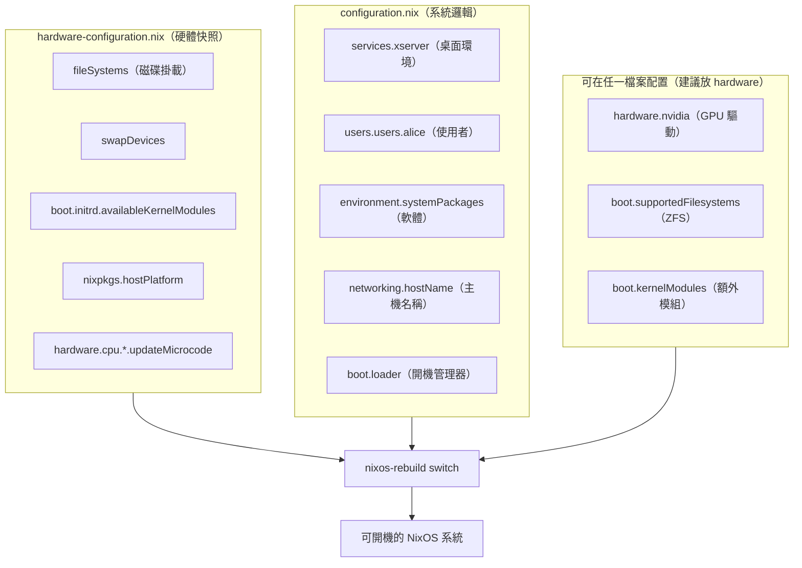
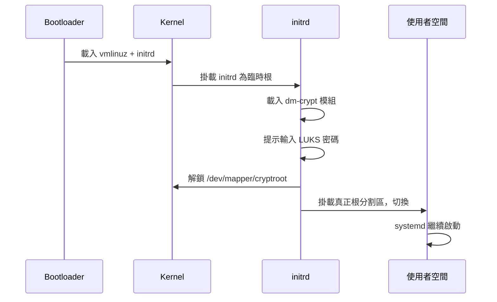
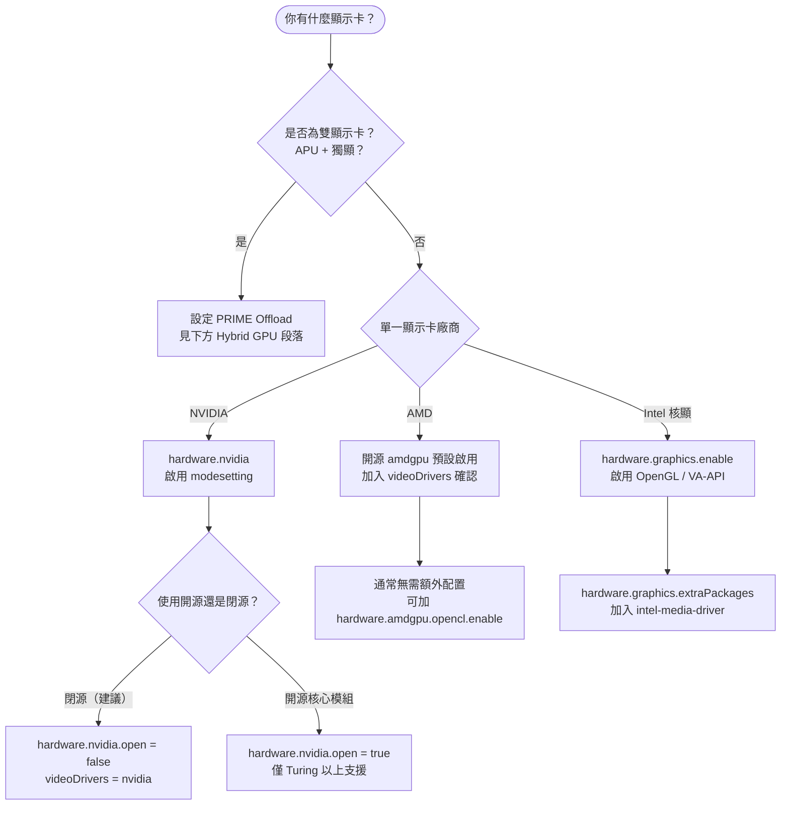

# 第8章：硬體配置文件

---

## 本章學習目標

完成本章後，你將能夠：

1. 理解 `hardware-configuration.nix` 是如何自動生成的，以及哪些部分可以安全修改
2. 正確配置 `fileSystems` 掛載點，包括多分割區、Btrfs 子卷與 UUID/label 選擇
3. 管理 Kernel Modules：載入、禁用、安裝第三方模組
4. 依照顯示卡廠商（NVIDIA / AMD / Intel）設定對應驅動，理解背後原因
5. 啟用 ZFS 或 Btrfs 進階檔案系統支援，並配置自動化維護

---

## 前置知識

本章建立在以下基礎之上：

- **第4章**：`configuration.nix` 基本結構，了解 `imports`、`boot`、`fileSystems` 等頂層 option
- **第5章**：`imports` 機制，明白 `hardware-configuration.nix` 是如何被 `configuration.nix` 載入的
- **第6章**：option 系統，了解 `mkDefault`、`mkForce` 等合併優先度概念
- **第7章**：NixOS Module System，理解 `config` 與 `options` 分工

如果你對上述章節的概念還不熟悉，建議先回頭複習，再繼續本章。

---

## 8.1 hardware-configuration.nix 的由來與結構

### 為什麼會有這個檔案？

安裝 NixOS 時，第一步是分割磁碟、掛載分割區，然後執行：

```bash
nixos-generate-config --root /mnt
```

這個指令會自動偵測你的硬體環境，產生兩個檔案：

```
/mnt/etc/nixos/
├── configuration.nix       ← 主配置，你負責維護
└── hardware-configuration.nix  ← 硬體快照，系統自動產生
```

`hardware-configuration.nix` 的設計哲學是：

**「把會因機器而異的硬體細節，從通用的系統邏輯中分離出來。」**

這樣做的好處是：同一份 `configuration.nix` 可以在不同機器上重用，只需更換 `hardware-configuration.nix`。

### 一份典型的 hardware-configuration.nix

以下是在一台有 NVMe 硬碟、EFI 開機的機器上自動生成的範例：

```nix
# 警告：以下區塊為 nixos-generate-config 自動生成
# 請勿手動修改分割區 UUID 或 fileSystems 結構，應使用 nixos-generate-config 重新生成
# 可安全修改：boot.initrd.availableKernelModules、hardware.enableAllFirmware 等選項

{ config, lib, pkgs, modulesPath, ... }:

{
  imports = [
    (modulesPath + "/installer/scan/not-detected.nix")
  ];

  # initrd 階段需要這些模組才能讀取 NVMe 與 SATA 磁碟
  boot.initrd.availableKernelModules = [
    "xhci_pci"   # USB 3.x 控制器
    "ahci"       # SATA 控制器
    "nvme"       # NVMe SSD
    "usb_storage" # USB 儲存裝置
    "sd_mod"     # SCSI 磁碟
    "sr_mod"     # 光碟機
  ];

  # 開機後才載入的模組（非 initrd 階段）
  boot.initrd.kernelModules = [];

  # 一般開機後的額外模組（如顯示卡驅動之外的特殊硬體）
  boot.kernelModules = [ "kvm-intel" ];

  # 第三方 DKMS 模組（預設為空，需手動填寫）
  boot.extraModulePackages = [];

  # 分割區掛載點（UUID 為安裝時自動偵測）
  fileSystems."/" = {
    device = "/dev/disk/by-uuid/a1b2c3d4-e5f6-7890-abcd-ef1234567890";
    fsType = "ext4";
  };

  fileSystems."/boot" = {
    device = "/dev/disk/by-uuid/ABCD-1234";
    fsType = "vfat";
    options = [ "fmask=0077" "dmask=0077" ];
  };

  swapDevices = [
    { device = "/dev/disk/by-uuid/bbbbbbbb-cccc-dddd-eeee-ffffffffffff"; }
  ];

  # 網路配置：讓 NetworkManager 決定介面名稱
  networking.useDHCP = lib.mkDefault true;

  # CPU 平台（影響 Nix 如何選擇最佳化套件）
  nixpkgs.hostPlatform = lib.mkDefault "x86_64-linux";

  # CPU 微碼更新（Intel / AMD 二選一）
  hardware.cpu.intel.updateMicrocode = lib.mkDefault config.hardware.enableRedistributableFirmware;
}
```

### 哪些部分「不應該」手動亂改？

自動生成的 UUID 和 fsType 是根據你的實際分割區決定的。如果你手動修改了錯誤的 UUID，開機時系統將無法找到根分割區，導致 kernel panic。

以下原則請牢記：

| 類型 | 建議做法 |
|---|---|
| `fileSystems` 的 UUID | 不要手動修改，重新執行 `nixos-generate-config` |
| `boot.initrd.availableKernelModules` | 可以新增，不要隨意刪除 |
| `hardware.cpu.*.updateMicrocode` | 可以保留或改為 `true` |
| `nixpkgs.hostPlatform` | 不要修改，除非你在交叉編譯 |
| GPU 驅動、ZFS、Btrfs 選項 | 可以在此檔案或 `configuration.nix` 中新增 |

### 職責分離：兩個檔案的分工

理解這張圖，就理解了 NixOS 硬體配置的核心設計：



---

## 8.2 nixos-generate-config 的作用

### 基本用法

`nixos-generate-config` 是 NixOS 提供的硬體偵測工具。

安裝時的標準用法：

```bash
# 偵測 /mnt 下的硬體與掛載點，生成兩個配置檔
nixos-generate-config --root /mnt
```

執行後會自動：

1. 掃描 `/proc` 與 `/sys` 取得 CPU、磁碟、網路介面資訊
2. 讀取 `/mnt/etc/fstab`（如果存在）決定掛載點
3. 偵測 EFI 或 BIOS 開機模式
4. 生成對應的 `hardware-configuration.nix`

### 重新生成：保留 fileSystems

有時你只想更新 initrd 模組或 CPU 微碼設定，但不想破壞已手動調整的 `fileSystems`。這時使用：

```bash
# 重新生成，但跳過 fileSystems 區塊（保留已有的掛載設定）
sudo nixos-generate-config --no-filesystems
```

這個旗標在以下情境特別有用：

- 你更換了顯示卡，需要更新 GPU 相關的模組偵測
- 你在 Btrfs 子卷上有複雜的自訂掛載，不想被覆蓋
- 你從 BIOS 升級到 UEFI，需要重新偵測開機模式

### 常見需要手動調整的部分

即使自動生成，以下幾個部分通常還是需要人工介入：

**1. Btrfs 子卷選項缺失**

自動偵測只能看到 `/` 掛在哪個 UUID，但無法自動加入 `subvol=@` 等子卷選項。需要手動在 `fileSystems` 的 `options` 中補上：

```nix
options = [ "subvol=@" "compress=zstd" "noatime" ];
```

**2. LUKS 加密磁碟**

加密磁碟的解鎖設定（`boot.initrd.luks.devices`）需要手動填寫 mapper 名稱與金鑰路徑，工具無法自動配置。

**3. ZFS 的 hostId**

ZFS 要求每台機器有唯一的 `networking.hostId`，這個值工具不會自動填入，必須手動產生（詳見 8.8 節）。

**4. 第三方模組（DKMS）**

如 VirtualBox Guest Additions、特定 Wi-Fi 驅動（如 RTL8852AE），需要在 `boot.extraModulePackages` 中手動指定。

---

## 8.3 fileSystems：掛載點配置

### 基本結構

`fileSystems` 是一個 attribute set，key 是掛載點路徑，value 是掛載設定：

```nix
{ config, lib, pkgs, ... }:

{
  # 根分割區：ext4 格式，使用 UUID 識別
  fileSystems."/" = {
    device = "/dev/disk/by-uuid/a1b2c3d4-e5f6-7890-abcd-ef1234567890";
    fsType = "ext4";
    options = [ "defaults" "noatime" ];
  };
}
```

每個掛載點有以下主要欄位：

| 欄位 | 說明 | 範例 |
|---|---|---|
| `device` | 裝置路徑（UUID、label、或 `/dev/sda1`） | `"/dev/disk/by-uuid/..."` |
| `fsType` | 檔案系統類型 | `"ext4"`、`"btrfs"`、`"vfat"` |
| `options` | mount 選項（對應 fstab 第四欄） | `[ "noatime" "compress=zstd" ]` |
| `neededForBoot` | 是否需要在 initrd 階段就掛載 | `true` / `false` |
| `autoResize` | 開機時自動調整分割區大小（ext4 用） | `true` / `false` |

### ext4 完整範例

以下是一台標準桌面機的 ext4 配置，包含根分割區、EFI 分割區、家目錄分割區：

```nix
{ config, lib, pkgs, ... }:

{
  # 根分割區：ext4，啟用 noatime 減少磁碟寫入
  fileSystems."/" = {
    device = "/dev/disk/by-uuid/a1b2c3d4-e5f6-7890-abcd-ef1234567890";
    fsType = "ext4";
    options = [
      "defaults"
      "noatime"     # 不更新 access time，對 SSD 友好
      "nodiratime"  # 不更新目錄 access time
    ];
  };

  # EFI System Partition：vfat 格式，UEFI 開機必需
  fileSystems."/boot" = {
    device = "/dev/disk/by-uuid/ABCD-1234";
    fsType = "vfat";
    options = [
      "fmask=0077"  # 檔案權限 700（只有 root 可讀寫）
      "dmask=0077"  # 目錄權限 700
    ];
  };

  # 家目錄獨立分割區：方便未來重灌時保留資料
  fileSystems."/home" = {
    device = "/dev/disk/by-uuid/11223344-5566-7788-99aa-bbccddeeff00";
    fsType = "ext4";
    options = [ "defaults" "noatime" ];
  };
}
```

為什麼要把 `/home` 分開？

- 重裝系統時，只需格式化根分割區，家目錄資料完整保留
- 不同使用者的資料與系統套件的 I/O 負載分離
- 可以對 `/home` 設定不同的 inode 比例（大量小檔案的場合）

### Btrfs 完整範例

Btrfs 的子卷（subvolume）讓你在同一個分割區內實現類似多分割區的隔離：

```nix
{ config, lib, pkgs, ... }:

{
  # 根子卷 @：掛載為 /
  fileSystems."/" = {
    device = "/dev/disk/by-uuid/a1b2c3d4-e5f6-7890-abcd-ef1234567890";
    fsType = "btrfs";
    options = [
      "subvol=@"        # 指定子卷名稱
      "compress=zstd"   # 啟用 zstd 壓縮，節省空間
      "noatime"         # 不更新 access time
      "ssd"             # 針對 SSD 最佳化（自動偵測通常可省略）
      "space_cache=v2"  # 啟用 v2 空間快取，效能較佳
    ];
  };

  # 家目錄子卷 @home：掛載為 /home
  fileSystems."/home" = {
    device = "/dev/disk/by-uuid/a1b2c3d4-e5f6-7890-abcd-ef1234567890";
    fsType = "btrfs";
    options = [
      "subvol=@home"
      "compress=zstd"
      "noatime"
    ];
  };

  # Nix store 子卷 @nix：獨立管理，方便快照與清理
  fileSystems."/nix" = {
    device = "/dev/disk/by-uuid/a1b2c3d4-e5f6-7890-abcd-ef1234567890";
    fsType = "btrfs";
    options = [
      "subvol=@nix"
      "compress=zstd"
      "noatime"
    ];
    neededForBoot = true;  # /nix/store 在開機早期就需要
  };

  # EFI 分割區（Btrfs 配置中通常是獨立的 vfat 分割區）
  fileSystems."/boot" = {
    device = "/dev/disk/by-uuid/ABCD-1234";
    fsType = "vfat";
    options = [ "fmask=0077" "dmask=0077" ];
  };
}
```

### UUID vs Label：如何選擇？

NixOS 預設使用 UUID 識別磁碟。UUID 的優點是唯一性強，不會因為磁碟順序改變而出問題。

但某些情境下 label 更方便：

```nix
# 使用 UUID（推薦：唯一、不會衝突）
device = "/dev/disk/by-uuid/a1b2c3d4-e5f6-7890-abcd-ef1234567890";

# 使用 label（適合：可移植的 USB 開機碟、容易記憶的實驗環境）
device = "/dev/disk/by-label/NIXOS_ROOT";

# 直接指定裝置（不推薦：磁碟順序改變後會出錯）
device = "/dev/sda1";
```

| 方式 | 優點 | 缺點 |
|---|---|---|
| UUID | 唯一、穩定 | 不易閱讀 |
| label | 可讀性高、可移植 | 需手動設定 label，可能衝突 |
| 裝置路徑 | 直觀 | 新增磁碟後順序可能改變，導致開機失敗 |

設定 label 的指令：

```bash
# ext4
sudo e2label /dev/sda1 NIXOS_ROOT

# btrfs
sudo btrfs filesystem label /dev/sda1 NIXOS_ROOT

# vfat（EFI 分割區）
sudo fatlabel /dev/sda1 EFI
```

---

## 8.4 swapDevices：Swap 配置

### 使用 Swap 分割區

最常見的 swap 配置，直接指向一個分割區：

```nix
{ config, lib, pkgs, ... }:

{
  # 使用 UUID 指定 swap 分割區（比裝置路徑更穩定）
  swapDevices = [
    {
      device = "/dev/disk/by-uuid/bbbbbbbb-cccc-dddd-eeee-ffffffffffff";
    }
  ];
}
```

多個 swap 分割區也可以：

```nix
swapDevices = [
  { device = "/dev/disk/by-uuid/bbbb-0001"; }
  { device = "/dev/disk/by-uuid/bbbb-0002"; }
];
```

### 使用 Swapfile

如果你不想獨立一個分割區做 swap，可以用 swapfile。這在 Btrfs 上需要特別注意——Btrfs 的 swapfile 有限制（不支援在啟用壓縮的子卷上建立）。

**ext4 上的 swapfile**：

```nix
{ config, lib, pkgs, ... }:

{
  # 在根分割區建立 8GB swapfile
  swapDevices = [
    {
      device = "/swapfile";
      size = 8 * 1024;  # 單位：MB，8GB = 8 * 1024 MB
    }
  ];
}
```

NixOS 會自動建立這個 swapfile（如果它不存在）。你不需要手動執行 `mkswap`。

**Btrfs 上的 swapfile**（需要特殊子卷）：

```nix
{ config, lib, pkgs, ... }:

{
  swapDevices = [
    {
      device = "/swap/swapfile";
      # 確保 /swap 掛載的子卷沒有啟用 compress 選項
      size = 8 * 1024;
    }
  ];

  # /swap 子卷必須是獨立掛載且未壓縮的
  fileSystems."/swap" = {
    device = "/dev/disk/by-uuid/a1b2c3d4-e5f6-7890-abcd-ef1234567890";
    fsType = "btrfs";
    options = [
      "subvol=@swap"
      "noatime"
      # 注意：不加 compress=zstd，Btrfs swapfile 不支援壓縮子卷
    ];
  };
}
```

### zramSwap：記憶體壓縮 Swap

`zramSwap`（Zero RAM Swap）是把部分 RAM 用壓縮方式當作 swap 使用的技術。

好處：

- 不佔用磁碟空間
- 讀寫速度遠快於磁碟 swap
- 對記憶體容量有限的機器（如 8GB RAM 的筆電）效益明顯

壞處：

- 佔用 CPU 資源進行壓縮/解壓縮
- 無法取代磁碟 swap 應對極端記憶體不足的情況

配置方式：

```nix
{ config, lib, pkgs, ... }:

{
  # 啟用 zramSwap，適合 RAM 8GB 以下或低磁碟 I/O 的機器
  zramSwap = {
    enable = true;

    # 使用實體 RAM 的 50% 作為壓縮 swap 空間
    # 預設值即為 50%，通常不需要修改
    memoryPercent = 50;

    # 壓縮演算法：zstd 壓縮比好；lz4 速度快
    algorithm = "zstd";
  };
}
```

---

## 8.5 boot.initrd：initrd 設定

### initrd 是什麼？

`initrd`（Initial RAM Disk）是 Linux 開機流程中的臨時根檔案系統。

開機流程如下：

```
UEFI/BIOS
    ↓
Bootloader（GRUB / systemd-boot）
    ↓
Linux Kernel 載入
    ↓
initrd 掛載（臨時根環境）
    ↓
偵測並掛載真正的根分割區
    ↓
切換到真正的根分割區
    ↓
systemd 啟動（正常使用者空間）
```

在 initrd 階段，你還沒有正常的 Linux 環境。因此，**所有在 initrd 階段就需要的驅動，必須事先編譯進 initrd 映像**。

### availableKernelModules：initrd 階段的必要模組

這些模組會在 initrd 中預先載入，讓 kernel 能夠讀取根分割區所在的硬體：

```nix
{ config, lib, pkgs, ... }:

{
  boot.initrd.availableKernelModules = [
    # === 儲存控制器 ===
    "xhci_pci"    # Intel USB 3.x 控制器（很多現代主機板需要）
    "ahci"        # SATA 控制器（大多數 SATA SSD/HDD）
    "nvme"        # NVMe SSD（M.2 固態硬碟幾乎都需要）
    "usb_storage" # USB 隨身碟
    "sd_mod"      # SCSI/SATA 磁碟通用介面
    "sr_mod"      # 光碟機

    # === 特殊情況 ===
    "virtio_blk"  # 在 KVM/QEMU 虛擬機中使用 virtio 磁碟
    "virtio_pci"  # KVM/QEMU virtio PCI 介面
  ];
}
```

為什麼 AHCI 和 NVMe 需要在 initrd 中？

因為這些驅動是核心與磁碟溝通的橋樑。如果沒有這些驅動，kernel 無法讀取存放根分割區的磁碟，開機就會卡在 `"Waiting for root device"` 或直接 kernel panic。

### kernelModules：開機後才載入的模組

有些模組只在使用者空間啟動後才需要，可以不放進 initrd，節省 initrd 大小：

```nix
{ config, lib, pkgs, ... }:

{
  # 這些模組在 initrd 結束、systemd 接管後才載入
  boot.initrd.kernelModules = [
    "dm-snapshot"  # LVM snapshot 支援（不是所有情境都需要）
  ];

  # 一般開機後的模組（不屬於 initrd）
  boot.kernelModules = [
    "kvm-intel"   # Intel CPU 的 KVM 虛擬化支援
    # "kvm-amd"   # AMD CPU 改用此選項
    "v4l2loopback" # 虛擬攝影機（OBS / 視訊會議用途）
  ];
}
```

### luks.devices：LUKS 加密磁碟解鎖

LUKS（Linux Unified Key Setup）是 Linux 的標準磁碟加密格式。如果你的根分割區是加密的，需要在 initrd 階段先解鎖：

```nix
{ config, lib, pkgs, ... }:

{
  boot.initrd.luks.devices = {
    # "cryptroot" 是解鎖後的 mapper 名稱（可自訂）
    "cryptroot" = {
      # 加密分割區的 UUID（格式化加密分割區後由 cryptsetup 顯示）
      device = "/dev/disk/by-uuid/cccccccc-dddd-eeee-ffff-000000000000";

      # 是否允許 TPM 自動解鎖（進階功能，預設停用）
      # allowDiscards = true;  # SSD 的 TRIM 支援（加密磁碟上慎用）
    };
  };

  # 解鎖後，真正的根分割區在 /dev/mapper/cryptroot
  fileSystems."/" = {
    device = "/dev/mapper/cryptroot";
    fsType = "ext4";
  };
}
```

LUKS 解鎖流程：



---

## 8.6 Kernel Modules 管理

### boot.kernelModules：後期載入的模組

有些功能的驅動不需要在 initrd 中，可以留到 systemd 啟動後再載入：

```nix
{ config, lib, pkgs, ... }:

{
  boot.kernelModules = [
    "kvm-intel"     # Intel CPU 虛擬化（讓你能跑 KVM 虛擬機）
    "tcp_bbr"       # Google BBR 網路擁塞控制算法
    "v4l2loopback"  # 虛擬視訊裝置（直播、視訊會議用）
  ];
}
```

### boot.blacklistedKernelModules：禁用模組

有時某個模組會干擾硬體正常運作，需要明確禁用：

```nix
{ config, lib, pkgs, ... }:

{
  boot.blacklistedKernelModules = [
    # 範例 1：某些筆電的 NVIDIA 獨立顯示卡驅動與 Nouveau 衝突
    "nouveau"

    # 範例 2：某些 Wi-Fi 晶片的舊版驅動與新驅動衝突
    "rtw88_8822ce"

    # 範例 3：某些主機板的 PC Speaker 讓人抓狂
    "pcspkr"
    "snd_pcsp"
  ];
}
```

為什麼需要禁用 Nouveau？

如果你要安裝 NVIDIA 官方閉源驅動（`hardware.nvidia.package`），而開源的 `nouveau` 驅動同時被載入，兩者會搶佔 GPU 資源，導致畫面撕裂、系統不穩定。禁用 `nouveau` 讓官方驅動完全掌控。

NixOS 的 `hardware.nvidia` 模組會自動處理這個問題，通常不需要手動禁用。但如果你發現異常，可以明確加入上面的設定。

### boot.extraModulePackages：第三方模組（DKMS）

某些驅動不在 Linux 主線核心中，需要額外安裝。這類驅動通常透過 DKMS（Dynamic Kernel Module Support）機制，在安裝時針對你的 kernel 版本重新編譯：

```nix
{ config, lib, pkgs, ... }:

{
  # 讓核心版本與額外模組保持一致
  boot.kernelPackages = pkgs.linuxPackages;

  boot.extraModulePackages = with config.boot.kernelPackages; [
    # RTL8852AE Wi-Fi 驅動（部分筆電需要）
    rtl8852ae

    # VirtualBox Host 模組（如果你在這台機器上跑 VirtualBox）
    # virtualbox
  ];
}
```

重要：`boot.extraModulePackages` 中的套件必須來自 `config.boot.kernelPackages`，而不是直接從 `pkgs` 取用，否則版本不匹配會導致模組無法載入。

### hardware.enableAllFirmware

有些硬體需要廠商提供的 firmware（韌體）二進位檔，這些檔案有各自的授權條款：

```nix
{ config, lib, pkgs, ... }:

{
  # 啟用所有可重新分發的 firmware（不需要特別授權同意）
  hardware.enableRedistributableFirmware = true;

  # 啟用所有 firmware，包括受限授權的（如 NVIDIA、某些 Wi-Fi 晶片）
  # 注意：啟用後系統會下載非開源的 firmware 二進位檔
  hardware.enableAllFirmware = true;

  # 如果你需要使用包含非自由軟體的 nixpkgs，需要允許 unfree
  nixpkgs.config.allowUnfree = true;
}
```

實際上，`hardware.enableAllFirmware` 最常見的用途是修復 Wi-Fi 或 Bluetooth 不能用的問題。很多無線網卡（如 Intel Wi-Fi 6 AX200）需要特定的 firmware 才能正常工作。

---

## 8.7 GPU 驅動配置

顯示卡驅動的選擇是 NixOS 硬體配置中最複雜的部分之一。以下依廠商說明配置方式與原因。

### 三種 GPU 方案決策流程



### NVIDIA：閉源驅動配置

NVIDIA 的官方閉源驅動提供最完整的功能支援，特別是 CUDA 運算與最新 RTX 功能。

以下是一台使用 NVIDIA 顯示卡的桌面機配置：

```nix
{ config, lib, pkgs, ... }:

{
  # 允許安裝非自由軟體（NVIDIA 驅動是閉源的）
  nixpkgs.config.allowUnfree = true;

  # 宣告使用 NVIDIA 驅動
  services.xserver.videoDrivers = [ "nvidia" ];

  hardware.nvidia = {
    # modesetting：讓 NVIDIA 驅動掌控 KMS（Kernel Mode Setting）
    # 這是 Wayland 正常運作的必要條件
    # 即使你只用 X11，也建議啟用，避免 tearing 問題
    modesetting.enable = true;

    # power.management：筆電專用，控制 dGPU 電源狀態
    # 桌機不需要，設定後筆電可以在不用 GPU 時關閉它
    power.management.enable = false;
    power.management.finegrained = false;

    # open：使用 NVIDIA 提供的開源核心模組（Turing 架構以上）
    # true = 使用開源核心模組（beta 品質，較新功能）
    # false = 使用傳統閉源核心模組（較穩定，推薦一般使用者）
    open = false;

    # nvidia-settings：圖形化設定工具，桌面環境用戶建議啟用
    nvidiaSettings = true;

    # package：選擇驅動版本
    # pkgs.linuxPackages.nvidiaPackages.stable  → 穩定版（推薦）
    # pkgs.linuxPackages.nvidiaPackages.beta    → Beta 版
    # pkgs.linuxPackages.nvidiaPackages.legacy_470 → GTX 9xx 系列用
    package = config.boot.kernelPackages.nvidiaPackages.stable;
  };

  # 啟用 OpenGL（Vulkan 與 OpenGL 應用的基礎）
  hardware.graphics = {
    enable = true;
    enable32Bit = true;  # 32-bit 應用支援（Steam、Wine 必需）
  };
}
```

為什麼要啟用 `modesetting.enable`？

傳統 NVIDIA 驅動用自己的方式控制顯示器，繞過 Linux 的 KMS 機制。這導致 Wayland 無法正常與 NVIDIA 協作。啟用 `modesetting.enable = true` 後，NVIDIA 驅動改為遵循 KMS 標準，讓 GNOME、KDE 等桌面環境的 Wayland 模式能正常運作。

### AMD：開源驅動配置

AMD 的顯示卡驅動（`amdgpu`）已完全整合進 Linux kernel 主線，NixOS 預設就會啟用。通常不需要特別配置，但以下選項可以強化支援：

```nix
{ config, lib, pkgs, ... }:

{
  # 明確宣告使用 amdgpu 驅動（通常可省略，因為 NixOS 預設啟用）
  services.xserver.videoDrivers = [ "amdgpu" ];

  hardware.graphics = {
    enable = true;
    enable32Bit = true;  # Steam / Wine 需要

    # 額外的 Vulkan / OpenCL 支援套件
    extraPackages = with pkgs; [
      # ROCm OpenCL（用於 GPU 運算，如機器學習）
      rocmPackages.clr.icd

      # AMDVLK：AMD 官方 Vulkan 實作（可與 radv 並存）
      amdvlk
    ];

    extraPackages32 = with pkgs; [
      driversi686Linux.amdvlk
    ];
  };

  # AMD GPU 特定選項（NixOS 25.05）
  hardware.amdgpu = {
    # 開啟 amdgpu kernel 模組的 DC（Display Core）功能
    # 新版 kernel 預設啟用，舊硬體可能需要手動開啟
    initrd.enable = true;

    # 開啟 OpenCL 支援
    opencl.enable = true;
  };
}
```

AMD 驅動的優勢在於完全開源：驅動程式的 bug 修復、功能添加都在公開社群中進行，更新頻繁且穩定性逐年提升。對於 Radeon RX 5000 系列（RDNA）以後的顯示卡，`amdgpu` 是首選方案。

### Intel：核顯配置

Intel 的核顯（UHD / Iris Xe）透過 `i915` 驅動支援，這也是 Linux kernel 主線的一部分。

NixOS 25.05 引入了 `hardware.graphics` 這個統一的 API，取代了舊的 `hardware.opengl`：

```nix
{ config, lib, pkgs, ... }:

{
  # NixOS 25.05 的統一 GPU 圖形支援 API
  hardware.graphics = {
    # 啟用 OpenGL（絕大多數桌面應用需要）
    enable = true;

    # 啟用 32-bit OpenGL 支援（Steam、Wine、舊版遊戲需要）
    enable32Bit = true;

    # Intel 特定的媒體加速套件
    extraPackages = with pkgs; [
      # intel-media-driver（iHD）：第八代以後 Intel 核顯的 VA-API 驅動
      # VA-API 讓影片播放、影片編碼能使用 GPU 硬體加速
      intel-media-driver

      # 舊版核顯（第六、七代）改用：
      # libvdpau-va-gl
      # intel-vaapi-driver

      # Intel Compute Runtime：OpenCL 支援（AI 推論等用途）
      intel-compute-runtime
    ];
  };

  # 指定使用 VA-API 後端（讓應用知道要用哪個驅動）
  environment.sessionVariables = {
    LIBVA_DRIVER_NAME = "iHD";  # 第八代以後
    # LIBVA_DRIVER_NAME = "i965";  # 第六、七代改用此值
  };
}
```

### Hybrid GPU（PRIME Offload）：雙顯示卡配置

現代筆電通常同時有 Intel/AMD 核顯（省電，平時使用）和 NVIDIA 獨顯（高效能，需要時啟動）。這種設計稱為 Hybrid GPU 或 Optimus（NVIDIA 術語）。

PRIME Offload 讓你能選擇哪些應用用獨顯執行：

```nix
{ config, lib, pkgs, ... }:

{
  nixpkgs.config.allowUnfree = true;

  # 同時啟用兩個驅動
  services.xserver.videoDrivers = [ "nvidia" ];

  hardware.nvidia = {
    modesetting.enable = true;
    open = false;
    nvidiaSettings = true;
    package = config.boot.kernelPackages.nvidiaPackages.stable;

    # PRIME 配置
    prime = {
      # Offload 模式：預設用核顯，指定應用才用獨顯
      # 與 sync 模式二選一（不能同時啟用）
      offload = {
        enable = true;
        enableOffloadCmd = true;  # 提供 nvidia-offload 指令
      };

      # 核顯的 PCI bus ID（用 lspci | grep VGA 查詢）
      # 格式：PCI:bus:device:function
      intelBusId = "PCI:0:2:0";

      # NVIDIA 獨顯的 PCI bus ID
      nvidiaBusId = "PCI:1:0:0";
    };
  };

  hardware.graphics = {
    enable = true;
    enable32Bit = true;
  };
}
```

啟用後，用獨顯執行特定應用的方式：

```bash
# 使用 nvidia-offload 指令（需要 enableOffloadCmd = true）
nvidia-offload glxinfo | grep "OpenGL renderer"
nvidia-offload steam

# 或透過環境變數手動指定
__NV_PRIME_RENDER_OFFLOAD=1 __VK_LAYER_NV_optimus=NVIDIA_only __GLX_VENDOR_LIBRARY_NAME=nvidia glxgears
```

查詢 PCI Bus ID 的方法：

```bash
# 列出所有顯示相關裝置
lspci | grep -E "VGA|3D|Display"

# 範例輸出：
# 00:02.0 VGA compatible controller: Intel Corporation Iris Xe Graphics
# 01:00.0 3D controller: NVIDIA Corporation GA107M [GeForce RTX 3050 Mobile]

# 轉換格式：00:02.0 → PCI:0:2:0
# 轉換格式：01:00.0 → PCI:1:0:0
```

---

## 8.8 ZFS 支援

### ZFS 是什麼，為何在 NixOS 上有特殊地位？

ZFS（Z File System）是由 Sun Microsystems 開發的進階檔案系統，具有：

- 內建 RAID（RAIDZ）
- 即時快照（snapshot）
- 自動資料完整性驗證（checksumming）
- 壓縮與去重（deduplication）
- ARC 智慧快取

由於授權問題，ZFS 無法直接合併進 Linux kernel，但 OpenZFS 專案以核心模組的方式提供支援。NixOS 對 ZFS 有良好的整合。

### 基本啟用配置

```nix
{ config, lib, pkgs, ... }:

{
  # 啟用 ZFS 支援（讓 NixOS 載入 ZFS 核心模組）
  boot.supportedFilesystems = [ "zfs" ];

  # ZFS 要求每台機器有唯一的 hostId
  # 這是 ZFS 防止「同一個 Pool 被多台機器同時掛載」的安全機制
  # 產生方式：head -c4 /dev/urandom | od -A none -t x4 | tr -d ' \n'
  # 範例輸出：a1b2c3d4
  networking.hostId = "a1b2c3d4";
}
```

為什麼 `networking.hostId` 是必要的？

ZFS Pool 在匯入時會記錄掛載它的 host ID。如果另一台機器嘗試匯入同一個 Pool，ZFS 會發現 host ID 不符而拒絕，防止資料損壞（兩台機器同時寫入同一個 Pool 是危險的）。

在 NixOS 上如果沒有設定 `hostId`，ZFS 模組在 `nixos-rebuild switch` 時會顯示警告，並且在某些情況下拒絕啟動。

產生 `hostId` 的指令：

```bash
# 方法一：使用 /dev/urandom
head -c4 /dev/urandom | od -A none -t x4 | tr -d ' \n'

# 方法二：使用 head（某些版本輸出格式不同）
head -c 8 /etc/machine-id

# 典型輸出（8個十六進位字元）：a1b2c3d4
```

### ZFS Pool 自動掛載

如果你有一個已建立的 ZFS Pool，讓它在開機時自動匯入：

```nix
{ config, lib, pkgs, ... }:

{
  boot.supportedFilesystems = [ "zfs" ];
  networking.hostId = "a1b2c3d4";  # 替換為你自己產生的值

  # 開機時自動匯入的額外 ZFS Pool 名稱
  # 根 Pool（如果 / 在 ZFS 上）會自動處理，不需要加這裡
  boot.zfs.extraPools = [ "data" "backup" ];

  # 啟用 ZFS 定期 scrub（資料完整性檢查，建議每月執行一次）
  services.zfs.autoScrub = {
    enable = true;
    interval = "monthly";
  };

  # 啟用 ZFS 自動快照（使用 sanoid 工具）
  services.zfs.autoSnapshot = {
    enable = true;
    frequent = 4;   # 每15分鐘一次，保留 4 個
    hourly = 24;    # 每小時一次，保留 24 個
    daily = 7;      # 每天一次，保留 7 個
    weekly = 4;     # 每週一次，保留 4 個
    monthly = 12;   # 每月一次，保留 12 個
  };
}
```

### ZFS ARC 記憶體限制

ZFS 的 ARC（Adaptive Replacement Cache）是 ZFS 的讀取快取，預設會使用大量 RAM。在記憶體有限的機器上，這可能讓系統變得緩慢：

```nix
{ config, lib, pkgs, ... }:

{
  boot.supportedFilesystems = [ "zfs" ];
  networking.hostId = "a1b2c3d4";

  # 限制 ZFS ARC 最大使用記憶體量
  # 以下設定將 ARC 限制在 4GB（適合 16GB RAM 的系統）
  boot.kernelParams = [
    "zfs.zfs_arc_max=4294967296"  # 4GB = 4 * 1024 * 1024 * 1024
  ];

  # 或者使用 extraModprobeConfig 設定
  # boot.extraModprobeConfig = ''
  #   options zfs zfs_arc_max=4294967296
  # '';
}
```

ARC 大小選擇建議：

| 系統 RAM | 建議 ARC 上限 |
|---|---|
| 8 GB | 2 GB |
| 16 GB | 4–6 GB |
| 32 GB | 8–12 GB |
| 64 GB | 16–24 GB |

如果機器是純資料庫伺服器或 NAS，可以給 ARC 更多記憶體；如果是一般桌面使用，保守設定讓其他應用有足夠空間。

### 以 ZFS 為根分割區的完整配置

如果整個系統（包括 `/`）都在 ZFS 上，配置如下：

```nix
{ config, lib, pkgs, ... }:

{
  boot.supportedFilesystems = [ "zfs" ];
  networking.hostId = "a1b2c3d4";

  # ZFS 根分割區不使用 fileSystems 語法，而是透過 pool 匯入
  # 根 dataset 的掛載點在 ZFS 屬性中設定（zfs set mountpoint=/ pool/root）
  # boot loader 指定根 ZFS dataset：
  boot.loader.grub = {
    enable = true;
    zfsSupport = true;        # 讓 GRUB 能從 ZFS Pool 開機
    efiSupport = true;
    device = "nodev";         # EFI 模式下設定為 nodev
    efiInstallAsRemovable = true;
  };

  # EFI 分割區仍需要普通的 vfat 掛載
  fileSystems."/boot" = {
    device = "/dev/disk/by-uuid/ABCD-1234";
    fsType = "vfat";
    options = [ "fmask=0077" "dmask=0077" ];
  };
}
```

---

## 8.9 Btrfs 支援

### Btrfs 的核心特性

Btrfs（B-tree File System）是 Linux 的現代化寫入時複製（Copy-on-Write，CoW）檔案系統，提供：

- 子卷（subvolume）：同一個分割區內的獨立命名空間，可個別快照
- 快照（snapshot）：近乎即時的唯讀或可寫快照
- 透明壓縮：zstd、lzo、zlib 壓縮選項
- 線上碎片整理（online defragmentation）
- RAID 0 / 1 / 10（軟體 RAID，不建議生產環境用 RAID 5/6）

對於 NixOS 桌面使用者，Btrfs 的子卷架構特別有用：可以對 `/` 和 `/home` 分別快照，在 `nixos-rebuild` 之前自動建立系統快照，讓 rollback 更完善。

### 子卷命名慣例

社群常用的子卷命名方式：

| 子卷名稱 | 掛載點 | 說明 |
|---|---|---|
| `@` | `/` | 根檔案系統 |
| `@home` | `/home` | 使用者家目錄 |
| `@nix` | `/nix` | Nix Store（可選） |
| `@log` | `/var/log` | 系統日誌（排除在快照外） |
| `@snapshots` | `/.snapshots` | Snapper 快照存放位置 |
| `@swap` | `/swap` | Swap 子卷（不啟用壓縮） |

### 完整 Btrfs 子卷配置範例

安裝時，需要先手動建立子卷：

```bash
# 掛載 Btrfs 分割區到臨時目錄
mount /dev/sda1 /mnt

# 建立子卷
btrfs subvolume create /mnt/@
btrfs subvolume create /mnt/@home
btrfs subvolume create /mnt/@nix
btrfs subvolume create /mnt/@log
btrfs subvolume create /mnt/@snapshots

# 卸載，準備用子卷方式重新掛載
umount /mnt
```

然後在 NixOS 配置中：

```nix
{ config, lib, pkgs, ... }:

{
  # 根子卷
  fileSystems."/" = {
    device = "/dev/disk/by-uuid/a1b2c3d4-e5f6-7890-abcd-ef1234567890";
    fsType = "btrfs";
    options = [
      "subvol=@"
      "compress=zstd:3"  # zstd 壓縮等級 3（平衡壓縮比與速度）
      "noatime"
      "space_cache=v2"
      "discard=async"    # SSD 的非同步 TRIM（比同步 TRIM 效能更好）
    ];
  };

  # 家目錄子卷
  fileSystems."/home" = {
    device = "/dev/disk/by-uuid/a1b2c3d4-e5f6-7890-abcd-ef1234567890";
    fsType = "btrfs";
    options = [
      "subvol=@home"
      "compress=zstd:3"
      "noatime"
      "space_cache=v2"
      "discard=async"
    ];
  };

  # Nix Store 子卷（獨立子卷方便快照管理）
  fileSystems."/nix" = {
    device = "/dev/disk/by-uuid/a1b2c3d4-e5f6-7890-abcd-ef1234567890";
    fsType = "btrfs";
    options = [
      "subvol=@nix"
      "compress=zstd:3"
      "noatime"
      "space_cache=v2"
      "discard=async"
    ];
    neededForBoot = true;  # Nix Store 在早期開機就需要
  };

  # 系統日誌子卷（通常不想把日誌包含在系統快照中）
  fileSystems."/var/log" = {
    device = "/dev/disk/by-uuid/a1b2c3d4-e5f6-7890-abcd-ef1234567890";
    fsType = "btrfs";
    options = [
      "subvol=@log"
      "compress=zstd:3"
      "noatime"
      "space_cache=v2"
    ];
    neededForBoot = true;  # systemd journal 在早期就需要寫入日誌
  };

  # 快照存放子卷（Snapper 用）
  fileSystems."/.snapshots" = {
    device = "/dev/disk/by-uuid/a1b2c3d4-e5f6-7890-abcd-ef1234567890";
    fsType = "btrfs";
    options = [
      "subvol=@snapshots"
      "noatime"
      "space_cache=v2"
    ];
  };

  # EFI 分割區（獨立的 vfat 分割區）
  fileSystems."/boot" = {
    device = "/dev/disk/by-uuid/ABCD-1234";
    fsType = "vfat";
    options = [ "fmask=0077" "dmask=0077" ];
  };

  # Swap（獨立子卷，不壓縮）
  fileSystems."/swap" = {
    device = "/dev/disk/by-uuid/a1b2c3d4-e5f6-7890-abcd-ef1234567890";
    fsType = "btrfs";
    options = [
      "subvol=@swap"
      "noatime"
      # 注意：不加 compress，Btrfs swapfile 必須在未壓縮的子卷上
    ];
  };

  swapDevices = [
    {
      device = "/swap/swapfile";
      size = 8 * 1024;  # 8 GB
    }
  ];
}
```

### services.btrfs.autoScrub：自動健康檢查

Btrfs 的 scrub（清洗）操作會逐一讀取所有資料塊，對照 checksum 驗證資料完整性。如果發現不符，且有 RAID 備援，可以自動修復。

即使沒有 RAID，定期 scrub 也能提早發現硬體問題（如磁碟壞道）：

```nix
{ config, lib, pkgs, ... }:

{
  # 定期自動 scrub，保持資料完整性
  services.btrfs.autoScrub = {
    enable = true;

    # 每月執行一次（格式遵循 systemd.time 規範）
    interval = "monthly";

    # 要 scrub 的掛載點（預設為所有 Btrfs 掛載點）
    fileSystems = [ "/" "/home" "/nix" ];
  };
}
```

scrub 期間對效能的影響：

- 讀取密集：scrub 會大量讀取磁碟，期間其他 I/O 較慢
- 通常在深夜或週末執行，影響最小
- `btrfs scrub status /` 可查詢最近一次 scrub 結果

### Snapper：Btrfs 快照管理

`snapper` 是與 Btrfs 整合的快照管理工具，可以在 `nixos-rebuild` 前後自動建立快照：

```nix
{ config, lib, pkgs, ... }:

{
  services.snapper = {
    # 為根分割區設定快照策略
    configs = {
      root = {
        SUBVOLUME = "/";
        ALLOW_USERS = [ "alice" ];  # 允許 alice 查看和還原快照

        # 快照保留策略
        TIMELINE_CREATE = true;
        TIMELINE_CLEANUP = true;
        TIMELINE_LIMIT_HOURLY = "10";
        TIMELINE_LIMIT_DAILY = "10";
        TIMELINE_LIMIT_WEEKLY = "0";
        TIMELINE_LIMIT_MONTHLY = "10";
        TIMELINE_LIMIT_YEARLY = "10";
      };

      home = {
        SUBVOLUME = "/home";
        ALLOW_USERS = [ "alice" ];
        TIMELINE_CREATE = true;
        TIMELINE_CLEANUP = true;
        TIMELINE_LIMIT_HOURLY = "10";
        TIMELINE_LIMIT_DAILY = "10";
        TIMELINE_LIMIT_WEEKLY = "4";
        TIMELINE_LIMIT_MONTHLY = "6";
        TIMELINE_LIMIT_YEARLY = "2";
      };
    };
  };
}
```

Snapper 常用指令：

```bash
# 列出所有快照
snapper -c root list

# 手動建立快照
snapper -c root create --description "before nixos-rebuild"

# 比較快照差異
snapper -c root diff 1..2

# 還原到某個快照（在 initramfs 或 Live CD 環境執行）
snapper -c root undochange 2..0
```

---

## 本章小結

本章涵蓋了 NixOS 硬體配置的完整體系，從自動生成的 `hardware-configuration.nix` 到手動調整各類硬體選項。

### 重點回顧

| 主題 | 核心概念 | 常見錯誤 |
|---|---|---|
| `hardware-configuration.nix` | 自動生成、職責分離 | 手動修改 UUID 導致開機失敗 |
| `nixos-generate-config` | `--no-filesystems` 保留掛載設定 | 忘記在修改後重新 rebuild |
| `fileSystems` | UUID 優於裝置路徑 | Btrfs 忘記加 `subvol=` 選項 |
| `swapDevices` | 分割區、swapfile、zramSwap | Btrfs 壓縮子卷上建 swapfile |
| `boot.initrd` | initrd 需要磁碟控制器驅動 | 少寫 `nvme` 導致 kernel panic |
| Kernel Modules | 載入、禁用、第三方模組版本一致 | `extraModulePackages` 版本不符 |
| NVIDIA | `modesetting.enable` 是 Wayland 必要條件 | 忘記 `allowUnfree` |
| AMD | 開源驅動預設啟用，幾乎不需要特別配置 | OpenCL 需要額外的 `extraPackages` |
| Intel | `hardware.graphics` + `intel-media-driver` | 核顯世代不同，VA-API 驅動不同 |
| ZFS | 必須設定 `networking.hostId` | 忘記 hostId 導致 Pool 無法匯入 |
| Btrfs | 子卷要在安裝時建立，選項要明確指定 | Swap 子卷不能啟用壓縮 |

### 與下一章的連結

本章專注於「磁碟與硬體層」的配置。第9章將往上一層，深入探討開機管理器（GRUB / systemd-boot）與 Kernel 參數的進階配置，包括：

- 如何選擇 GRUB 還是 systemd-boot
- `boot.kernelParams` 的常用參數（`quiet`、`splash`、效能調優）
- Secure Boot 配置
- 自訂 kernel（hardened、zen、清理版）

硬體配置打好基礎後，你才能在第9章安心地調整開機行為，不必擔心底層磁碟讀取出問題。

---

> **補充資源**
>
> - [NixOS Wiki：ZFS](https://nixos.wiki/wiki/ZFS)
> - [NixOS Wiki：Btrfs](https://nixos.wiki/wiki/Btrfs)
> - [NixOS Wiki：NVIDIA](https://nixos.wiki/wiki/Nvidia)
> - [NixOS Options 搜尋](https://search.nixos.org/options)：搜尋 `hardware.nvidia`、`fileSystems`、`boot.initrd` 等 option
> - [OpenZFS 文件](https://openzfs.github.io/openzfs-docs/)：ZFS 進階管理
