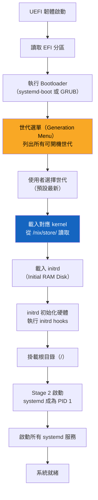
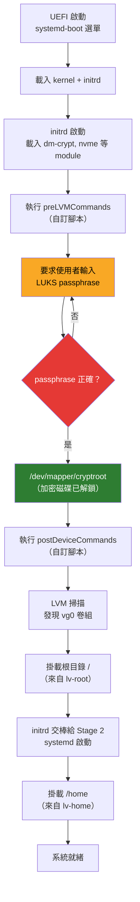

# 第9章：Boot 與 Kernel 配置

---

## 本章學習目標

完成本章後，你將能夠：

1. 說明 NixOS 開機流程的每個階段，並知道「世代選單（Generation Menu）」出現在哪裡
2. 根據硬體環境選擇 systemd-boot 或 GRUB，並完成基本配置
3. 正確設定 EFI 分區掛載點與相關選項
4. 切換 kernel 版本（LTS、Latest、Hardened、Zen），理解各版本的適用場景
5. 傳遞自訂 kernel parameters，並知道哪些參數用於排錯

---

## 前置知識

- 完成第8章（硬體配置文件）
- 對 Linux 開機流程有基本認識（BIOS/UEFI、bootloader 的概念）
- 了解 NixOS 的宣告式配置方式（第2至第4章）

---

## 9.1 NixOS 的開機流程

### 傳統 Linux vs NixOS 開機流程

在傳統 Linux（如 Ubuntu、Arch）中，開機流程大致是：

1. UEFI/BIOS 啟動
2. Bootloader（GRUB）讀取 `/boot/grub/grub.cfg`
3. 載入 kernel image（`vmlinuz`）與 initrd
4. kernel 初始化硬體，initrd 掛載根目錄
5. systemd 啟動（PID 1），載入所有服務

每次系統更新，`/boot` 目錄下的 kernel 會被直接覆蓋。

舊版 kernel 一旦被新版替換，就無法輕易回退。

NixOS 的做法完全不同。

NixOS 把 kernel、initrd 都放在 `/nix/store/` 之中。

每一次 `nixos-rebuild switch`，都會在 `/nix/store/` 建立一組新的 kernel 檔案，而不是覆蓋舊的。

Bootloader 則被設定成「每一個世代（Generation）都有一個開機項目」。

---

### 開機流程圖

下圖展示 NixOS 的完整開機流程：



重點說明：

- **世代選單**出現在第4步（D），由 bootloader 呈現。
- 每個世代對應一組獨立的 kernel 與 initrd 路徑。
- 使用者可以在選單選擇舊世代，這就是 NixOS rollback 的底層機制。

---

### 世代與 `/nix/store` 中的 kernel 路徑

當你執行 `nixos-rebuild switch` 之後，NixOS 會在 `/nix/store/` 建立類似以下路徑的 kernel：

```bash
# 查看目前系統的 kernel 路徑
ls -la /run/current-system/kernel
```

輸出範例：

```text
/run/current-system/kernel -> /nix/store/7kxfn4a3p1blhrf9rjy5m2pzcb3g7x8v-linux-6.12.25/bzImage
```

每一組世代的 bootloader 項目，都指向不同 hash 的 `/nix/store/` 路徑。

這代表即使你開機選了舊世代，舊的 kernel 檔案還在 `/nix/store/` 中，不會被刪除。

若要查看目前有幾個世代：

```bash
sudo nix-env --list-generations --profile /nix/var/nix/profiles/system
```

---

## 9.2 systemd-boot 配置

### 為什麼推薦 systemd-boot？

systemd-boot（前身為 gummiboot）是 NixOS 在 UEFI 環境下的首選 bootloader。

原因如下：

- 設計精簡，功能專一，安全性較高
- 直接讀取 EFI 分區的設定檔，不需要額外 chainload
- 與 NixOS 的世代系統整合良好，自動為每個世代建立開機項目
- 設定語法比 GRUB 簡單許多

只有在以下情況才考慮改用 GRUB：

- 你的主機板只支援 BIOS/Legacy 模式（無 UEFI）
- 你需要從 USB 或網路開機，且 systemd-boot 無法滿足
- 你需要開機時解密 LUKS，而 GRUB 的 LUKS2 支援更完整

---

### 最小可用配置

以下是啟用 systemd-boot 的最基本設定：

```nix
{ config, pkgs, ... }:

{
  imports = [
    ./hardware-configuration.nix
  ];

  # 啟用 systemd-boot（UEFI 環境必選）
  boot.loader.systemd-boot.enable = true;

  # 允許 NixOS 修改 EFI 開機變數
  boot.loader.efi.canTouchEfiVariables = true;

  networking.hostName = "nixos";

  users.users.alice = {
    isNormalUser = true;
    extraGroups = [ "wheel" ];
  };

  system.stateVersion = "25.05";
}
```

這個配置做了兩件事：

1. `boot.loader.systemd-boot.enable = true`：告訴 NixOS 使用 systemd-boot 作為 bootloader。
2. `boot.loader.efi.canTouchEfiVariables = true`：允許 NixOS 在安裝時向 UEFI 韌體寫入開機項目。

---

### 限制保留的世代數量

每次 `nixos-rebuild switch` 都會新增一個世代到 bootloader 選單。

如果不加限制，選單會越來越長，EFI 分區也會逐漸被填滿。

使用 `configurationLimit` 可以限制 bootloader 中最多保留幾個世代選項：

```nix
{ config, pkgs, ... }:

{
  boot.loader.systemd-boot = {
    enable = true;

    # 最多保留 10 個世代在開機選單中
    # 超過此數量的舊世代項目會從 /boot 移除
    # （但 /nix/store/ 中的檔案仍需 garbage collection 才會刪除）
    configurationLimit = 10;

    # Console 顯示模式：
    # "auto" = 自動偵測最佳解析度（預設）
    # "max"  = 使用最高解析度
    # "keep" = 保持 UEFI 韌體目前的解析度
    # "2"    = 指定特定 console 模式編號
    consoleMode = "auto";
  };

  boot.loader.efi.canTouchEfiVariables = true;

  system.stateVersion = "25.05";
}
```

說明：

- `configurationLimit = 10` 表示 bootloader 選單最多同時顯示 10 個世代。
- 舊的世代項目被移出 `/boot` 後，並不等於被刪除——`/nix/store/` 中的 kernel 檔案仍在。
- 要真正釋放磁碟空間，需要執行 `sudo nix-collect-garbage -d`。

---

### `/boot/loader/` 目錄結構說明

安裝 systemd-boot 後，EFI 分區（預設掛載於 `/boot`）的結構如下：

```text
/boot/
├── EFI/
│   ├── BOOT/
│   │   └── BOOTX64.EFI          # UEFI 開機檔案
│   └── systemd/
│       └── systemd-bootx64.efi  # systemd-boot 本體
├── loader/
│   ├── loader.conf              # bootloader 全域設定（逾時秒數等）
│   └── entries/                 # 每個世代一個 .conf 檔案
│       ├── nixos-generation-42.conf
│       ├── nixos-generation-41.conf
│       └── nixos-generation-40.conf
└── nixos/
    ├── kernel-xxxxx.efi         # 各世代 kernel（由 /nix/store 複製）
    └── initrd-xxxxx             # 各世代 initrd
```

每個 `.conf` 檔案的內容範例：

```text
title NixOS Generation 42 (2026-05-18)
linux /nixos/kernel-7kxfn4a3p1blhrf9rjy5m2pzcb3g7x8v.efi
initrd /nixos/initrd-aaabbccdd.efi
options init=/nix/store/.../init root=/dev/sda1 quiet
```

---

## 9.3 GRUB 配置

### GRUB 適用場景

GRUB（GRand Unified Bootloader）是 Linux 世界使用最廣泛的 bootloader。

NixOS 支援兩種 GRUB 模式：

| 模式 | 說明 |
|---|---|
| BIOS/Legacy 模式 | 主機板不支援 UEFI，或你選擇不啟用 UEFI 開機時使用 |
| UEFI 模式（efiSupport） | UEFI 環境下使用 GRUB，通常出現在雙系統或特殊需求場景 |

如果你的機器支援 UEFI，優先考慮 systemd-boot，它更簡單。

如果你需要安裝在老舊機器（只有 BIOS），就必須使用 GRUB。

---

### BIOS/Legacy 模式配置

以下配置適用於沒有 UEFI 的機器，或使用 MBR 磁碟分割的環境：

```nix
{ config, pkgs, ... }:

{
  imports = [
    ./hardware-configuration.nix
  ];

  # 啟用 GRUB
  boot.loader.grub = {
    enable = true;

    # 指定 GRUB 安裝目標磁碟（BIOS 模式需要指定 device）
    # 注意：這裡填整顆磁碟，不是分區（如 /dev/sda，不是 /dev/sda1）
    device = "/dev/sda";

    # BIOS 模式不需要 EFI 支援
    efiSupport = false;
  };

  networking.hostName = "nixos";

  users.users.alice = {
    isNormalUser = true;
    extraGroups = [ "wheel" ];
  };

  system.stateVersion = "25.05";
}
```

---

### UEFI 模式配置（GRUB + EFI）

若你需要在 UEFI 環境使用 GRUB（例如與 Windows 雙開機），配置如下：

```nix
{ config, pkgs, ... }:

{
  imports = [
    ./hardware-configuration.nix
  ];

  boot.loader.grub = {
    enable = true;

    # UEFI 模式下，device 設定為 "nodev"
    device = "nodev";

    # 啟用 EFI 支援
    efiSupport = true;
  };

  # 允許 NixOS 操作 EFI 變數
  boot.loader.efi.canTouchEfiVariables = true;

  system.stateVersion = "25.05";
}
```

---

### 自訂 GRUB 主題

GRUB 支援圖形主題，讓開機選單更美觀。

安裝主題的方式：

```nix
{ config, pkgs, ... }:

{
  boot.loader.grub = {
    enable = true;
    device = "nodev";
    efiSupport = true;

    # 設定 GRUB 主題路徑
    # 這裡使用 nixpkgs 提供的 fallout 主題作為示範
    theme = pkgs.nixos-grub2-theme;

    # 自訂開機選單的背景圖片（可選）
    # splashImage = ./wallpaper.png;
  };

  boot.loader.efi.canTouchEfiVariables = true;

  system.stateVersion = "25.05";
}
```

---

### 對比表：systemd-boot vs GRUB

| 比較項目 | systemd-boot | GRUB |
|---|---|---|
| 支援 UEFI | 是（僅 UEFI） | 是 |
| 支援 BIOS/Legacy | 否 | 是 |
| 設定複雜度 | 低 | 中到高 |
| 圖形主題支援 | 有限 | 豐富 |
| NixOS 整合程度 | 非常好 | 好 |
| 雙系統偵測 | 手動設定 | 自動 `os-prober` |
| 推薦使用場景 | 現代 UEFI 單系統 | 老機器、雙系統 |

**選擇建議**：

- 全新安裝、UEFI 機器、只跑 NixOS → 選 **systemd-boot**
- 老機器（BIOS Only）→ 選 **GRUB（BIOS 模式）**
- UEFI 機器、需要雙系統（NixOS + Windows）→ 選 **GRUB（UEFI 模式）**

---

## 9.4 EFI 設定

### `canTouchEfiVariables`：是否修改 EFI 韌體變數

這個選項決定 NixOS 安裝/更新時，是否可以向 UEFI 韌體寫入開機項目（Boot Entry）：

```nix
{ config, pkgs, ... }:

{
  # 允許 NixOS 讀寫 EFI 韌體開機變數
  # 大多數情況下設為 true
  boot.loader.efi.canTouchEfiVariables = true;

  system.stateVersion = "25.05";
}
```

**何時設為 `false`？**

以下情況需要設為 `false`：

- 你的機器在寫入 EFI 變數時會出現韌體錯誤（某些舊款 UEFI 實作有 bug）
- 在容器（Container）或虛擬機中安裝，無法存取真實 EFI 韌體
- 某些嵌入式或工控設備的 UEFI 不允許寫入

設為 `false` 時，你需要手動使用 `efibootmgr` 建立開機項目，或依賴 EFI 分區的預設路徑（`EFI/BOOT/BOOTX64.EFI`）。

---

### `efiSysMountPoint`：自訂 EFI 分區掛載點

NixOS 預設假設 EFI 分區掛載於 `/boot`。

如果你的磁碟分割方案使用不同的掛載點（例如 `/boot/efi`），需要明確指定：

```nix
{ config, pkgs, ... }:

{
  boot.loader.systemd-boot.enable = true;

  boot.loader.efi = {
    canTouchEfiVariables = true;

    # 如果 EFI 分區掛載在 /boot/efi 而非 /boot
    # 就需要設定此選項
    efiSysMountPoint = "/boot/efi";
  };

  system.stateVersion = "25.05";
}
```

同時，`hardware-configuration.nix` 中的 `fileSystems` 也需要對應：

```nix
{ ... }:

{
  fileSystems."/boot/efi" = {
    device = "/dev/sda1";
    fsType = "vfat";
    options = [ "fmask=0022" "dmask=0022" ];
  };
}
```

---

### EFI 分區大小建議

EFI 分區（EFI System Partition，簡稱 ESP）的大小需要足夠放置多個 NixOS 世代的 kernel 與 initrd：

| 情境 | 建議大小 |
|---|---|
| 僅 NixOS，保留 5 個世代 | 256MB |
| NixOS，保留 10 至 15 個世代 | **512MB（推薦）** |
| NixOS + Windows 雙系統 | **512MB 至 1GB** |

每個 NixOS 世代的 kernel + initrd 約佔 30 至 80MB（依 kernel 設定而不同）。

分割磁碟時預留 512MB 給 EFI 分區是安全且常見的做法。

---

## 9.5 `kernelPackages`：選擇 kernel 版本

### NixOS 為什麼可以輕鬆切換 kernel？

在傳統 Linux 中，切換 kernel 版本是繁瑣的操作。

NixOS 的做法是：

kernel 本身也是一個 Nix package，與普通套件一樣可以用 `nixos-rebuild` 切換。

切換時，NixOS 會把新 kernel 放入 `/nix/store/`，同時保留舊 kernel。

開機後確認新 kernel 正常，才可選擇清理舊版。

---

### 各 kernel 版本說明

```nix
{ config, pkgs, ... }:

{
  # 預設（不設定此選項）使用 NixOS 25.05 的 LTS kernel
  # 例如 linux 6.6.x（依 NixOS 版本而異）
  # boot.kernelPackages = pkgs.linuxPackages;

  # 使用最新 stable kernel（可能是最新的 6.x.y）
  # 適合：需要最新硬體支援、驅動較新的機器
  # 風險：版本更新較快，偶爾有相容性問題
  boot.kernelPackages = pkgs.linuxPackages_latest;

  system.stateVersion = "25.05";
}
```

以下列出常用的 kernel 套件選項：

| 選項 | 說明 | 適用場景 |
|---|---|---|
| `pkgs.linuxPackages` | NixOS 官方 LTS kernel（預設） | 一般伺服器、穩定優先 |
| `pkgs.linuxPackages_latest` | 最新 stable kernel | 新硬體支援、桌面使用者 |
| `pkgs.linuxPackages_hardened` | 安全強化版 kernel | 高安全需求伺服器 |
| `pkgs.linuxPackages_zen` | Zen 效能優化 kernel | 桌面、遊戲、低延遲需求 |
| `pkgs.linuxPackages_lqx` | Liquorix kernel（類 Zen） | 多媒體工作站 |
| `pkgs.linuxPackages_rt` | Realtime kernel | 音頻製作、即時系統 |

---

### 遊戲/桌面優化：Zen Kernel

Zen kernel 針對桌面使用情境優化了 scheduler 與 latency（延遲）設定：

```nix
{ config, pkgs, ... }:

{
  # Zen kernel：更低的 input lag，適合遊戲與桌面使用
  boot.kernelPackages = pkgs.linuxPackages_zen;

  networking.hostName = "nixos";

  users.users.alice = {
    isNormalUser = true;
    extraGroups = [ "wheel" "gamemode" ];
  };

  system.stateVersion = "25.05";
}
```

---

### 安全強化版：Hardened Kernel

Hardened kernel 啟用了許多額外的安全防護，代價是部分效能降低：

```nix
{ config, pkgs, ... }:

{
  # Hardened kernel：強化安全設定，關閉部分 debugging 功能
  # 某些程式可能因此無法執行（如 ptrace 相關）
  boot.kernelPackages = pkgs.linuxPackages_hardened;

  system.stateVersion = "25.05";
}
```

Hardened kernel 的主要限制：

- `ptrace` 預設關閉，部分開發工具（如 strace、gdb）需要額外設定
- 效能略低於標準 kernel
- 某些 kernel modules 可能無法載入

---

### kernel 版本與硬體驅動的相容性風險

切換 kernel 版本時需要注意：

- **NVIDIA 閉源驅動**：對 kernel 版本非常敏感。
  使用 `pkgs.linuxPackages_latest` 可能導致 NVIDIA 驅動無法編譯。
  建議先確認 NixOS 中對應的 NVIDIA 驅動套件是否支援目標 kernel 版本。

- **VirtualBox kernel module**：同樣需要與 kernel 版本匹配。

- **DKMS 模組**：若使用需要動態編譯的 kernel module，切換 kernel 後需要等待重新編譯。

安全的切換流程：

```bash
# 1. 先用 --dry-run 確認不會報錯
sudo nixos-rebuild dry-run

# 2. 使用 boot 模式（重開機後才生效，不影響目前運行的系統）
sudo nixos-rebuild boot

# 3. 重開機，在世代選單選擇新世代
reboot

# 4. 確認 kernel 版本正確
uname -r
```

---

## 9.6 `kernelParams`：傳遞開機參數

### 什麼是 kernel parameters？

Kernel parameters（也稱為 kernel command line arguments）是在開機時傳遞給 kernel 的選項。

它們可以控制：

- 螢幕輸出行為
- 硬體相容模式
- 電源管理
- 安全功能開關

NixOS 透過 `boot.kernelParams` 以宣告式方式管理這些參數。

---

### 基本配置範例

以下是常見的 kernel parameters 配置：

```nix
{ config, pkgs, ... }:

{
  # kernelParams 接受一個字串 List
  # 每個字串都是一個開機參數
  boot.kernelParams = [
    # 減少開機訊息，適合桌面使用者
    "quiet"

    # 顯示開機動畫（需要 plymouth 服務配合）
    "splash"
  ];

  system.stateVersion = "25.05";
}
```

---

### 常用 kernel parameters 說明

以下列出最常見的 kernel parameters，說明何時使用：

**顯示與輸出相關**

| 參數 | 說明 | 使用時機 |
|---|---|---|
| `quiet` | 抑制大多數開機訊息 | 桌面系統，讓開機畫面更乾淨 |
| `splash` | 顯示啟動動畫（需搭配 plymouth） | 桌面系統 |
| `loglevel=3` | 只顯示 error 等級以上的 kernel 訊息 | 與 `quiet` 配合使用 |
| `nomodeset` | 停用 kernel 的 Mode Setting（KMS） | 顯示卡驅動問題時的緊急救援參數 |

**硬體相容性相關**

| 參數 | 說明 | 使用時機 |
|---|---|---|
| `nomodeset` | 停用 GPU KMS，用 VESA 模式開機 | GPU 驅動崩潰、無法進入桌面時 |
| `pci=nomsi` | 停用 PCIe 的 MSI 中斷模式 | 某些主機板 PCIe 問題，裝置掛載失敗時 |
| `iommu=off` | 停用 IOMMU | 虛擬化環境中某些裝置直通問題 |
| `amd_iommu=off` | 停用 AMD IOMMU | AMD 平台的 IOMMU 相關問題 |
| `intel_iommu=on` | 啟用 Intel IOMMU | 需要 VT-d 支援（PCIe passthrough）時 |

**電源管理相關**

| 參數 | 說明 | 使用時機 |
|---|---|---|
| `acpi=off` | 完全停用 ACPI | 舊款機器 ACPI 實作有 bug 時 |
| `acpi=force` | 強制啟用 ACPI | 某些 ACPI 沒有被自動啟用的情況 |
| `noapic` | 停用 APIC 中斷控制器 | 老舊機器中斷相關問題 |

---

### 實際排錯範例：無法進入桌面

當你安裝完 NixOS 後，開機黑屏或 GPU 相關錯誤，可以這樣處理：

```nix
{ config, pkgs, ... }:

{
  boot.kernelParams = [
    # 停用 KMS，讓 GPU 以 VESA 模式運作
    # 可先確認系統能開機，再逐步排查 GPU 驅動問題
    "nomodeset"
  ];

  system.stateVersion = "25.05";
}
```

加入 `nomodeset` 後：

1. 系統以純文字模式開機（解析度較低）
2. 確認系統本身沒問題
3. 再逐步排查 GPU 驅動（NVIDIA、AMD 開源/閉源）的配置問題

---

### `boot.initrd.kernelModules` vs `boot.kernelModules`

NixOS 有兩個地方可以指定要載入的 kernel module，用途不同：

```nix
{ config, pkgs, ... }:

{
  boot.initrd.kernelModules = [
    # 這裡放「開機早期就需要的 module」
    # 例如：存取根目錄所在的磁碟控制器、加密磁碟的 module
    # initrd 是在根目錄掛載「之前」執行的
    "nvme"     # NVMe SSD 控制器（若根目錄在 NVMe 上）
    "xfs"      # 若根目錄使用 XFS 格式
  ];

  boot.kernelModules = [
    # 這裡放「系統啟動後才需要的 module」
    # 例如：特定硬體功能、網路介面卡
    "kvm-intel"  # Intel 虛擬化（KVM）支援
    "v4l2loopback" # 虛擬攝影機模組（OBS 等工具使用）
  ];

  system.stateVersion = "25.05";
}
```

差異總結：

| 選項 | 載入時機 | 用途 |
|---|---|---|
| `boot.initrd.kernelModules` | initrd 階段（根目錄掛載前） | 存取根目錄所需的磁碟、檔案系統模組 |
| `boot.kernelModules` | Stage 2 啟動後 | 一般硬體驅動、功能性模組 |
| `boot.extraModulePackages` | Stage 2 啟動後 | 不在 kernel 內建清單的外部模組 |

---

## 9.7 initrd hooks

### 什麼是 initrd？

initrd（Initial RAM Disk，初始記憶體磁碟）是 kernel 在掛載真正的根目錄之前，先載入記憶體執行的一個暫時性迷你 Linux 環境。

initrd 負責：

- 載入必要的 kernel modules
- 初始化磁碟控制器
- 若根目錄是加密磁碟（LUKS），執行解鎖流程
- 掛載根目錄

NixOS 提供幾個 hook 讓你在 initrd 的不同階段插入自訂腳本。

---

### 常用 initrd hooks

**`boot.initrd.postDeviceCommands`**

在硬體設備被 udev 識別之後執行。

常見用途：

- 清空 `/tmp` 中的暫存資料（on-tmpfs 方案之外的替代）
- 自訂 LUKS 解鎖前的準備工作

```nix
{ config, pkgs, ... }:

{
  boot.initrd.postDeviceCommands = ''
    # 這段 shell script 在 initrd 中執行
    # 設備識別完成後、根目錄掛載前

    # 範例：清空 /tmp 中的殘留檔案（若 /tmp 掛載在獨立分區）
    # 注意：這裡的路徑是相對於 initrd 中的暫時根目錄
    echo "postDeviceCommands: 設備初始化完成"
  '';

  system.stateVersion = "25.05";
}
```

**`boot.initrd.preLVMCommands`**

在 LVM（邏輯磁碟區管理員）啟動之前執行。

常見用途：

- 在 LVM scan 之前解鎖 LUKS 加密磁碟
- 設定特殊的 device mapper 路徑

```nix
{ config, pkgs, ... }:

{
  boot.initrd.preLVMCommands = ''
    # 在 LVM 開始掃描磁碟之前執行
    # 適合手動解鎖 LUKS，讓 LVM 能看到解鎖後的 device
    echo "preLVMCommands: LVM 掃描前執行"
  '';

  system.stateVersion = "25.05";
}
```

---

### 完整範例：LUKS 加密磁碟 + LVM 配置

這是一個完整的加密磁碟開機流程，展示 initrd hooks 在實際情境中的角色：

```nix
{ config, pkgs, ... }:

{
  imports = [
    ./hardware-configuration.nix
  ];

  boot.loader.systemd-boot.enable = true;
  boot.loader.efi.canTouchEfiVariables = true;

  # 告訴 initrd 需要在早期階段支援 LUKS 解密
  boot.initrd.availableKernelModules = [
    "xhci_pci"    # USB 3.0 控制器（若 key file 放在 USB）
    "nvme"        # NVMe 磁碟
    "dm-crypt"    # Device Mapper 加密支援
  ];

  # 設定 LUKS 加密裝置
  # NixOS 會在 initrd 中自動要求輸入 passphrase
  boot.initrd.luks.devices."cryptroot" = {
    # 加密分區的設備路徑（UUID 更可靠，建議使用）
    device = "/dev/disk/by-uuid/xxxxxxxx-xxxx-xxxx-xxxx-xxxxxxxxxxxx";

    # 解鎖後的設備名稱（出現於 /dev/mapper/cryptroot）
    # LVM 將在此設備上運作
    preLVM = true;
  };

  # LVM 卷組（Volume Group）名稱為 vg0
  # 其中包含：
  #   lv-root  → 掛載於 /
  #   lv-home  → 掛載於 /home
  # （這部分通常由 hardware-configuration.nix 自動設定）

  networking.hostName = "nixos";

  users.users.alice = {
    isNormalUser = true;
    extraGroups = [ "wheel" ];
  };

  system.stateVersion = "25.05";
}
```

---

### LUKS + LVM 開機流程圖



重點說明：

- `preLVM = true` 的 LUKS 設備會在 LVM 掃描前解鎖。
- 正確的解鎖順序：解鎖 LUKS → LVM 掃描 → 掛載根目錄。
- 若 passphrase 輸入錯誤，initrd 會重新要求輸入（而非進入緊急模式）。

---

## 9.8 Secure Boot（進階）

### 什麼是 Secure Boot？

Secure Boot（安全開機）是 UEFI 規範中的一項功能。

它的目的是：

在開機時驗證每一個執行的程式（bootloader、kernel）都有受信任的數位簽章（Digital Signature）。

若某個程式沒有合法簽章，Secure Boot 會拒絕執行，防止 bootkit（開機期惡意程式）攻擊。

---

### 為什麼 NixOS 需要特殊處理？

標準的 Secure Boot 只信任主機板內建的幾個 CA（Certificate Authority）憑證。

這些憑證通常簽署了 Microsoft、Ubuntu、Fedora 等發行版的 bootloader。

NixOS 的特殊性在於：

- NixOS 的 kernel 路徑是動態的（`/nix/store/xxxxx-linux-xxx/bzImage`）
- 每次更新 kernel 都會產生新路徑，需要重新簽署
- NixOS 不像 Ubuntu 一樣有被主機板預設信任的簽署金鑰

因此，直接在 NixOS 啟用 Secure Boot 需要額外的工具。

---

### Lanzaboote：NixOS 的 Secure Boot 解決方案

`lanzaboote` 是社群開發的 NixOS Secure Boot 方案。

它的運作方式：

1. 使用者產生自己的 Secure Boot 金鑰（Platform Key、Key Exchange Key、Database Key）
2. 將自己的金鑰登錄到 UEFI 韌體（替換或加入 Custom Mode）
3. `lanzaboote` 在每次 `nixos-rebuild` 後，自動用自訂金鑰簽署 kernel 與 initrd
4. 開機時 Secure Boot 驗證簽章，確認 kernel 是被你自己的金鑰簽署的

---

### 基本啟用步驟（概要）

以下是啟用 lanzaboote 的大致流程，僅作為入口指引：

**第一步：加入 lanzaboote flake input**

```nix
# flake.nix
{
  inputs = {
    nixpkgs.url = "github:NixOS/nixpkgs/nixos-25.05";

    lanzaboote = {
      url = "github:nix-community/lanzaboote/v0.4.1";
      inputs.nixpkgs.follows = "nixpkgs";
    };
  };

  outputs = { self, nixpkgs, lanzaboote }: {
    nixosConfigurations.nixos = nixpkgs.lib.nixosSystem {
      system = "x86_64-linux";
      modules = [
        lanzaboote.nixosModules.lanzaboote
        ./configuration.nix
      ];
    };
  };
}
```

**第二步：在 configuration.nix 中啟用 lanzaboote**

```nix
{ config, pkgs, ... }:

{
  # 注意：啟用 lanzaboote 時，必須停用 systemd-boot
  # lanzaboote 會取代 systemd-boot 的角色
  boot.loader.systemd-boot.enable = false;

  boot.lanzaboote = {
    enable = true;

    # 你的 PKI bundle 路徑（由 sbctl 工具產生）
    pkiBundle = "/etc/secureboot";
  };

  # sbctl 是管理 Secure Boot 金鑰的工具
  environment.systemPackages = with pkgs; [
    sbctl
  ];

  system.stateVersion = "25.05";
}
```

**第三步：產生金鑰並登錄到韌體（shell 操作）**

```bash
# 產生你自己的 Secure Boot 金鑰
sudo sbctl create-keys

# 確認目前 Secure Boot 狀態
sudo sbctl status

# 將你的金鑰登錄到 UEFI 韌體（Setup Mode 下才能執行）
sudo sbctl enroll-keys --microsoft

# 重新建構系統，lanzaboote 會自動簽署 kernel
sudo nixos-rebuild switch --flake .#nixos

# 確認所有開機檔案都已簽署
sudo sbctl verify
```

---

### 注意事項

啟用 Secure Boot 之前，請確認：

- 你的機器支援 UEFI Secure Boot 且可進入 Setup Mode
- 了解如果金鑰管理出錯，可能導致系統無法開機（需要進 UEFI 介面手動清除金鑰）
- 建議先在虛擬機（如 QEMU with OVMF）中測試流程
- 這是進階功能，初學者建議先跳過，等熟悉 NixOS 基本操作後再嘗試

更多詳細的操作指引，請參考：

- [lanzaboote 官方文件](https://github.com/nix-community/lanzaboote/blob/main/docs/QUICK_START.md)
- [NixOS Wiki: Secure Boot](https://wiki.nixos.org/wiki/Secure_Boot)

---

## 本章小結

本章涵蓋了 NixOS 開機系統的完整架構，從流程到配置細節：

### 重點回顧

**開機流程（9.1）**

- NixOS 的 kernel 與 initrd 都存放於 `/nix/store/`，不會被覆蓋。
- 世代選單（Generation Menu）出現在 bootloader 階段，讓使用者選擇要開機進哪個世代。
- 這是 NixOS 安全 rollback 的底層機制。

**systemd-boot vs GRUB（9.2、9.3）**

- UEFI 機器優先選 systemd-boot：設定簡單、整合良好。
- BIOS/Legacy 機器必須使用 GRUB。
- 需要雙系統（NixOS + Windows）可選 GRUB UEFI 模式。

**EFI 設定（9.4）**

- `canTouchEfiVariables = true` 適用大多數 UEFI 機器。
- EFI 分區建議 512MB 以上。
- 若 EFI 分區不在 `/boot`，需設定 `efiSysMountPoint`。

**kernel 版本（9.5）**

- 預設 LTS kernel 最穩定。
- `linuxPackages_latest` 適合新硬體。
- `linuxPackages_zen` 適合桌面/遊戲。
- `linuxPackages_hardened` 適合高安全性伺服器。
- 切換前用 `nixos-rebuild boot` 先測試，不影響目前系統。

**kernel parameters（9.6）**

- `quiet splash`：桌面系統乾淨開機畫面。
- `nomodeset`：GPU 問題時的緊急救援。
- `pci=nomsi`：PCIe 中斷相關問題。
- `boot.initrd.kernelModules` 在根目錄掛載前載入。
- `boot.kernelModules` 在系統啟動後載入。

**initrd hooks（9.7）**

- `preLVMCommands`：LVM 掃描前執行，常用於 LUKS 解鎖流程。
- `postDeviceCommands`：設備識別後執行，常用於 `/tmp` 清理。

**Secure Boot（9.8）**

- NixOS 需要使用 lanzaboote 才能支援 Secure Boot。
- 這是進階功能，需要額外的金鑰管理工作。
- 初學者可先略過，熟悉基礎後再嘗試。

---

### 本章配置速查

以下是本章最常用配置的精簡版速查：

```nix
{ config, pkgs, ... }:

{
  # Bootloader（UEFI 環境選 systemd-boot）
  boot.loader.systemd-boot.enable = true;
  boot.loader.systemd-boot.configurationLimit = 10;
  boot.loader.efi.canTouchEfiVariables = true;

  # Kernel 版本（視需求選擇）
  # boot.kernelPackages = pkgs.linuxPackages;         # 預設 LTS
  # boot.kernelPackages = pkgs.linuxPackages_latest;  # 最新 stable
  # boot.kernelPackages = pkgs.linuxPackages_zen;     # 桌面優化

  # Kernel parameters
  boot.kernelParams = [
    "quiet"
    "splash"
    # "nomodeset"  # GPU 問題時取消此行的註解
  ];

  # 開機早期需要的 modules
  boot.initrd.kernelModules = [ "nvme" ];

  # 系統啟動後載入的 modules
  boot.kernelModules = [ "kvm-intel" ];

  system.stateVersion = "25.05";
}
```

---

### 練習題

1. 在你的 NixOS 系統上，查看目前有多少個世代：
   ```bash
   sudo nix-env --list-generations --profile /nix/var/nix/profiles/system
   ```

2. 將 `configurationLimit` 設為 5，執行 `nixos-rebuild switch`，觀察 `/boot/loader/entries/` 目錄的變化。

3. 嘗試切換到 `linuxPackages_latest`，使用 `nixos-rebuild boot` 模式，重開機後確認 `uname -r` 輸出。

4. （選做）如果你的機器有顯示卡問題，嘗試加入 `nomodeset` 參數，觀察開機行為的變化。

---

> **下一章預告**：第10章將進入網路配置，學習如何在 NixOS 中配置 NetworkManager、設定靜態 IP、管理防火牆規則，以及建立 WireGuard VPN 連線。
