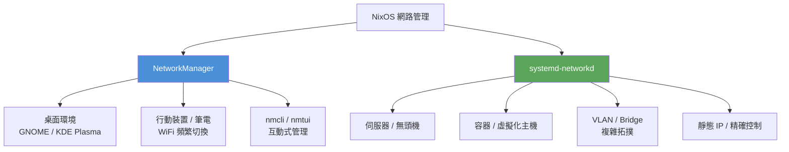
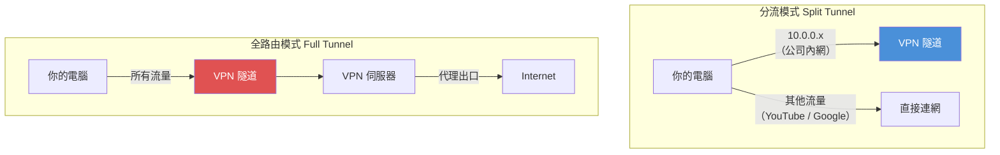
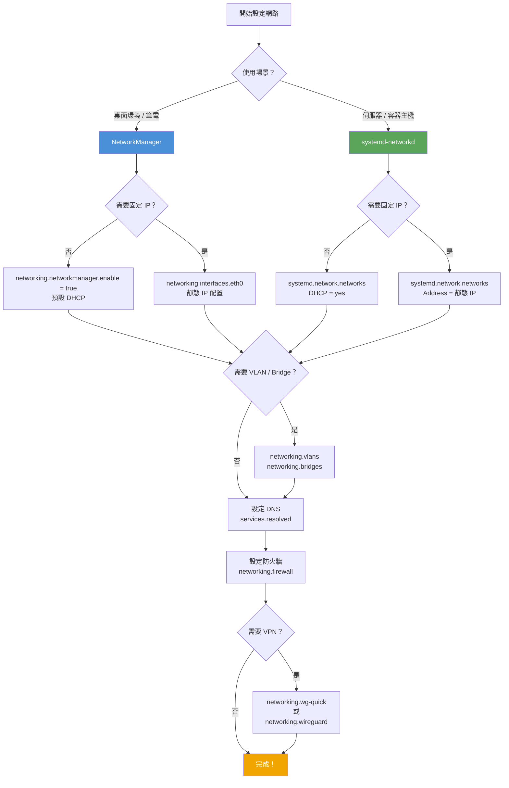

# 第10章：網路配置

## 本章學習目標

完成本章後，你將能夠：

1. 理解 NixOS 的網路管理架構，並根據使用場景選擇 NetworkManager 或 systemd-networkd
2. 使用宣告式配置為系統設定 DHCP、靜態 IP、IPv6 地址
3. 建立 VLAN（虛擬區域網路）與 Bridge（橋接）介面
4. 管理 DNS 解析策略，包括 Split DNS 基本應用
5. 配置 NixOS 防火牆規則，並建立 WireGuard VPN 連線

---

## 前置知識

- 完成第9章（Boot 與 Kernel 配置）
- 了解基本 Linux 網路概念：IP 地址、子網路遮罩、閘道、DNS
- 熟悉 `networking.*` 選項在 `configuration.nix` 中的位置（第4章）

---

## 10.1 NixOS 網路管理架構概覽

NixOS 提供兩套主要的網路管理路徑，各有適合的使用場景。

理解這兩套系統的差異，是配置網路前最重要的一步。

### 兩種路徑



### 選擇依據

| 情境 | 建議選擇 |
|---|---|
| GNOME / KDE 桌面環境 | NetworkManager |
| 筆電（需要 WiFi 快速切換） | NetworkManager |
| 伺服器（固定介面）| systemd-networkd |
| 容器主機（KVM / LXC）| systemd-networkd |
| VLAN / Bridge 複雜配置 | systemd-networkd |
| 嵌入式 / 最小化系統 | systemd-networkd |

### 重要原則

NixOS 不建議同時啟用兩套系統管理同一個介面。

衝突會導致介面狀態不穩定，或 DHCP 租約衝突。

選定一套後，請關閉另一套（或確保它們管理不同介面）。

---

## 10.2 NetworkManager 配置

NetworkManager（網路管理員）是桌面環境的標準選擇。

它支援 WiFi、乙太網路、VPN、熱點等，並提供 `nmcli` 指令介面。

### 基本啟用

以下是桌面環境最常用的最小配置：

```nix
{ config, pkgs, ... }:

{
  networking.hostName = "nixos";

  # 啟用 NetworkManager，取代預設的 dhcpcd
  networking.networkmanager.enable = true;

  # 確保 alice 可以管理網路連線
  users.users.alice = {
    isNormalUser = true;
    extraGroups = [
      "wheel"
      "networkmanager"    # 必須加入此群組，否則一般使用者無法控制網路
    ];
  };

  system.stateVersion = "25.05";
}
```

`networkmanager` 群組是關鍵。

沒有加入此群組的使用者，在圖形介面或 `nmcli` 中會看到「permission denied」錯誤。

### WiFi 後端選擇

NetworkManager 管理 WiFi 時，依賴一個底層後端（backend）來處理無線驅動程式。

NixOS 支援兩種後端：

| 後端 | 說明 | 適合情境 |
|---|---|---|
| `wpa_supplicant` | 傳統穩定，廣泛支援 | 一般桌面、相容性優先 |
| `iwd` | 現代輕量，連線速度快 | 新硬體、追求效能 |

切換到 `iwd` 後端：

```nix
{ config, pkgs, ... }:

{
  networking.networkmanager = {
    enable = true;

    # 改用 iwd 作為 WiFi 後端（比 wpa_supplicant 更輕量）
    wifi.backend = "iwd";
  };

  # iwd 後端需要額外啟用 iwd 服務
  networking.wireless.iwd = {
    enable = true;
    settings.General.EnableNetworkConfiguration = false;  # 讓 NetworkManager 主導
  };

  system.stateVersion = "25.05";
}
```

大多數情況下，保留預設的 `wpa_supplicant` 是最穩定的選擇。

### nmcli 常用指令速查

`nmcli`（Network Manager Command Line Interface）是控制 NetworkManager 的主要指令工具。

```bash
# 查看所有連線狀態
nmcli device status

# 查看可用 WiFi 熱點
nmcli device wifi list

# 連接 WiFi（互動式輸入密碼）
nmcli device wifi connect "SSID名稱" --ask

# 連接 WiFi（直接指定密碼）
nmcli device wifi connect "SSID名稱" password "你的密碼"

# 查看目前所有連線設定檔
nmcli connection show

# 啟用或停用某個連線
nmcli connection up "連線名稱"
nmcli connection down "連線名稱"

# 查看特定介面的詳細資訊
nmcli device show eth0
```

### 與 dhcpcd 的互斥關係

NixOS 預設會啟用 `dhcpcd`（DHCP 客戶端守護程式）來管理 DHCP 租約。

當你啟用 NetworkManager 後，NetworkManager 會接管 DHCP 工作。

此時 `dhcpcd` 應該停用，避免衝突：

```nix
{ config, pkgs, ... }:

{
  networking.networkmanager.enable = true;

  # 明確停用 dhcpcd（NetworkManager 啟用時通常自動處理，但明確宣告更清晰）
  networking.dhcpcd.enable = false;

  system.stateVersion = "25.05";
}
```

> **提示**：在 NixOS 中，`networking.networkmanager.enable = true` 已經會自動調整 dhcpcd 的行為。明確寫出 `networking.dhcpcd.enable = false` 主要是為了讓配置意圖更清晰。

---

## 10.3 systemd-networkd 配置

`systemd-networkd`（systemd 網路守護程式）是 systemd 內建的網路管理工具。

它特別適合伺服器、容器主機，以及需要精確控制網路介面的場景。

### 為何伺服器偏好 systemd-networkd？

- 不依賴 D-Bus，啟動更快
- 設定完全由檔案驅動，適合宣告式管理
- 支援 VLAN、Bond、Bridge 等進階拓撲
- 無需圖形介面

### 基本啟用

```nix
{ config, pkgs, ... }:

{
  networking.hostName = "nixos";

  # 啟用 systemd-networkd 作為網路管理員
  systemd.network.enable = true;

  # 整合 networkd 作為 NixOS 的主要網路後端
  networking.useNetworkd = true;

  # 停用預設的 dhcpcd，避免衝突
  networking.dhcpcd.enable = false;

  system.stateVersion = "25.05";
}
```

`networking.useNetworkd = true` 讓 NixOS 的高階網路選項（例如 `networking.interfaces`）也透過 systemd-networkd 實現，而非 dhcpcd。

### .network 檔案結構

systemd-networkd 使用 `.network` 格式的設定檔。

每個 `.network` 檔案分為兩個主要區段：

```
[Match]          ← 指定這份設定適用於哪個介面
    Name=eth0    ← 依名稱匹配

[Network]        ← 這個介面的網路設定
    DHCP=yes     ← 使用 DHCP
```

在 NixOS 中，透過 `systemd.network.networks` 宣告這些設定：

```nix
{ config, pkgs, ... }:

{
  systemd.network.enable = true;
  networking.useNetworkd = true;
  networking.dhcpcd.enable = false;

  # 定義 eth0 的網路設定
  systemd.network.networks."10-eth0" = {
    matchConfig = {
      Name = "eth0";      # 匹配名稱為 eth0 的介面
    };

    networkConfig = {
      DHCP = "yes";       # 使用 DHCP（適合桌面環境）
      IPv6AcceptRA = true; # 接受 IPv6 路由廣播
    };
  };

  system.stateVersion = "25.05";
}
```

檔案名稱前的數字（`10-eth0`）代表載入優先序。數字越小，優先序越高。

### DHCP 配置（桌面友好型）

DHCP 是最簡單的配置，適合不需要固定 IP 的一般電腦：

```nix
{ config, pkgs, ... }:

{
  systemd.network.enable = true;
  networking.useNetworkd = true;
  networking.dhcpcd.enable = false;

  systemd.network.networks."10-wired" = {
    matchConfig = {
      # 匹配所有有線介面（en* 是常見的有線介面前綴）
      Name = "en*";
      Type = "ether";     # 只匹配乙太網路類型
    };

    networkConfig = {
      DHCP = "ipv4";              # 只使用 IPv4 DHCP
      IPv6AcceptRA = true;         # 接受 IPv6 路由廣播
      LinkLocalAddressing = "ipv6"; # 保留 IPv6 Link-Local 地址
    };

    # DHCP 行為細節
    dhcpV4Config = {
      RouteMetric = 10;   # 此介面的路由優先序（數字越小越優先）
    };
  };

  system.stateVersion = "25.05";
}
```

### 靜態 IP 配置（伺服器型）

伺服器需要固定 IP，讓其他機器能夠穩定連線：

```nix
{ config, pkgs, ... }:

{
  systemd.network.enable = true;
  networking.useNetworkd = true;
  networking.dhcpcd.enable = false;

  systemd.network.networks."10-server-eth0" = {
    matchConfig = {
      Name = "eth0";
    };

    networkConfig = {
      # 不使用 DHCP，改用靜態地址
      DHCP = "no";
      Address = [
        "192.0.2.10/24"      # 靜態 IPv4 地址（RFC 5737 文件範例 IP）
        "2001:db8::10/64"    # 靜態 IPv6 地址（RFC 3849 文件範例 IP）
      ];
      Gateway = "192.0.2.1"; # 預設閘道
      DNS = [
        "192.0.2.1"          # 主 DNS（通常是閘道）
        "1.1.1.1"            # 次要 DNS（Cloudflare）
      ];
    };
  };

  system.stateVersion = "25.05";
}
```

> **提示**：本書所有 IP 範例使用 RFC 5737 定義的文件專用範圍（`192.0.2.0/24`、`198.51.100.0/24`、`203.0.113.0/24`）以及 `10.0.0.0/8` 私有網路範圍。實際部署時請替換為你的真實 IP。

---

## 10.4 靜態 IP 設定

靜態 IP（Static IP）讓機器每次啟動都使用相同的 IP 地址。

適合場景：

- 家庭伺服器（NAS、媒體伺服器）
- 需要 DNS A record 的機器
- 虛擬機器管理主機
- 工業控制設備

### NetworkManager 方式

如果你使用 NetworkManager，可以透過 `networking.interfaces` 設定靜態 IP：

```nix
{ config, pkgs, ... }:

{
  networking.hostName = "nixos";
  networking.networkmanager.enable = true;

  # 為 eth0 指定靜態 IPv4 地址
  networking.interfaces.eth0 = {
    ipv4.addresses = [
      {
        address = "192.0.2.10";   # 靜態 IP 地址
        prefixLength = 24;        # 子網路遮罩：/24 = 255.255.255.0
      }
    ];
  };

  # 設定預設閘道
  networking.defaultGateway = {
    address = "192.0.2.1";
    interface = "eth0";
  };

  # 設定 DNS 伺服器
  networking.nameservers = [
    "192.0.2.1"   # 主 DNS
    "8.8.8.8"     # 備用 DNS（Google）
  ];

  system.stateVersion = "25.05";
}
```

### systemd-networkd 方式

在 systemd-networkd 模式下，靜態 IP 的配置更為集中：

```nix
{ config, pkgs, ... }:

{
  systemd.network.enable = true;
  networking.useNetworkd = true;
  networking.dhcpcd.enable = false;

  systemd.network.networks."10-static" = {
    matchConfig = {
      Name = "eth0";
    };

    networkConfig = {
      DHCP = "no";
      Address = "192.0.2.10/24";
      Gateway = "192.0.2.1";
      DNS = [ "192.0.2.1" "8.8.8.8" ];
    };
  };

  system.stateVersion = "25.05";
}
```

### 完整範例：靜態 IP + 閘道 + DNS + IPv6

以下是一個兼顧 IPv4 靜態配置與 IPv6 的完整伺服器網路設定：

```nix
{ config, pkgs, ... }:

{
  networking.hostName = "nixos";

  systemd.network.enable = true;
  networking.useNetworkd = true;
  networking.dhcpcd.enable = false;

  systemd.network.networks."10-main" = {
    matchConfig = {
      Name = "eth0";
    };

    networkConfig = {
      DHCP = "no";

      # IPv4 靜態配置
      Address = [
        "192.0.2.10/24"       # IPv4 靜態地址
        "2001:db8::10/64"     # IPv6 靜態地址
      ];

      Gateway = "192.0.2.1";  # IPv4 預設閘道

      DNS = [
        "192.0.2.1"           # 本地 DNS（如路由器）
        "1.1.1.1"             # Cloudflare
        "2606:4700:4700::1111" # Cloudflare IPv6
      ];

      # 設定 IPv6 閘道（若你的網路環境有提供）
      IPv6AcceptRA = false;   # 靜態 IPv6 時關閉自動路由廣播
    };

    # 手動設定 IPv6 預設路由
    routes = [
      {
        routeConfig = {
          Gateway = "2001:db8::1";  # IPv6 閘道
          Destination = "::/0";     # 所有 IPv6 流量
        };
      }
    ];
  };

  system.stateVersion = "25.05";
}
```

---

## 10.5 VLAN 配置

VLAN（Virtual Local Area Network，虛擬區域網路）讓你在單一物理網路介面上模擬多個獨立的網路區段。

### 常見使用場景

- **家庭實驗室**：把管理網路與實驗網路分離
- **企業環境**：IoT 裝置放在獨立 VLAN，與辦公網路隔離
- **虛擬化主機**：VM 使用不同 VLAN 與外部網路通訊
- **多租戶環境**：讓不同用途的服務使用不同的廣播域

### 基本 VLAN 配置

NixOS 使用 `networking.vlans` 定義 VLAN 介面：

```nix
{ config, pkgs, ... }:

{
  networking.hostName = "nixos";

  # 定義 VLAN 介面
  networking.vlans = {
    # VLAN 10：管理網路
    vlan10 = {
      id = 10;              # VLAN ID（必須與交換機設定一致）
      interface = "eth0";   # 依附在哪個物理介面上
    };

    # VLAN 20：IoT 網路
    vlan20 = {
      id = 20;
      interface = "eth0";
    };
  };

  system.stateVersion = "25.05";
}
```

### 搭配靜態 IP 的完整 VLAN 範例

光是定義 VLAN 介面還不夠，還需要為每個 VLAN 設定 IP 地址：

```nix
{ config, pkgs, ... }:

{
  networking.hostName = "nixos";

  # 定義 VLAN 介面
  networking.vlans = {
    vlan10 = {
      id = 10;
      interface = "eth0";
    };
    vlan20 = {
      id = 20;
      interface = "eth0";
    };
  };

  # 為每個 VLAN 介面指定靜態 IP
  networking.interfaces = {
    # eth0 本身不設 IP（純 trunk port）
    eth0 = {
      useDHCP = false;
    };

    # VLAN 10：管理網路（192.0.2.0/24）
    vlan10 = {
      ipv4.addresses = [
        {
          address = "192.0.2.1";
          prefixLength = 24;
        }
      ];
    };

    # VLAN 20：IoT 網路（198.51.100.0/24）
    vlan20 = {
      ipv4.addresses = [
        {
          address = "198.51.100.1";
          prefixLength = 24;
        }
      ];
    };
  };

  system.stateVersion = "25.05";
}
```

### VLAN 配置注意事項

1. **VLAN ID 必須與交換機一致**：如果交換機的 VLAN 10 是管理網路，NixOS 這邊的 `id` 也要設 `10`。
2. **物理介面通常設為 trunk**：這代表物理介面本身不需要 IP，只有 VLAN 子介面有 IP。
3. **驗證配置**：使用 `ip link show` 確認 VLAN 介面已建立，`ip addr show vlan10` 確認 IP 已指派。

---

## 10.6 Bridge 配置

Bridge（橋接介面）把多個網路介面「橋接」在一起，讓它們共享同一個廣播域。

最常見的用途是讓虛擬機器（VM）的網路介面直接連到你的實體網路，使 VM 像是獨立的機器。

### 使用場景

- **KVM / QEMU 虛擬機器**：讓 VM 取得與主機同網段的 IP
- **容器網路**：讓容器介面橋接到實體網路
- **軟體交換機**：連接多台虛擬機器的虛擬網路

### 基本 Bridge 配置

```nix
{ config, pkgs, ... }:

{
  networking.hostName = "nixos";

  # 建立 br0 橋接介面，並將 eth0 加入橋接
  networking.bridges = {
    br0 = {
      interfaces = [ "eth0" ];  # 將 eth0 納入橋接
    };
  };

  # 橋接介面取得 IP（eth0 本身不需要 IP）
  networking.interfaces = {
    br0 = {
      useDHCP = true;    # br0 使用 DHCP 取得 IP
    };

    eth0 = {
      useDHCP = false;   # eth0 加入橋接後不應直接有 IP
    };
  };

  system.stateVersion = "25.05";
}
```

### 完整範例：br0 橋接 eth0（KVM 主機）

以下是一台 KVM 虛擬化主機的典型橋接配置：

```nix
{ config, pkgs, ... }:

{
  networking.hostName = "nixos";

  # 建立橋接介面
  networking.bridges = {
    br0 = {
      interfaces = [ "eth0" ];
    };
  };

  # br0 使用靜態 IP（伺服器建議使用靜態）
  networking.interfaces = {
    br0 = {
      ipv4.addresses = [
        {
          address = "192.0.2.20";
          prefixLength = 24;
        }
      ];
    };

    eth0 = {
      useDHCP = false;
    };
  };

  # 閘道與 DNS
  networking.defaultGateway = {
    address = "192.0.2.1";
    interface = "br0";   # 閘道要從橋接介面出去
  };

  networking.nameservers = [ "192.0.2.1" "1.1.1.1" ];

  # 啟用 KVM 需要的套件
  virtualisation.libvirtd.enable = true;

  # libvirt 需要使用橋接網路
  users.users.alice = {
    isNormalUser = true;
    extraGroups = [ "wheel" "libvirtd" ];
  };

  system.stateVersion = "25.05";
}
```

### Bridge 配置注意事項

1. **eth0 本身不應有 IP**：加入橋接後，eth0 只是橋接的「成員埠」，IP 由 br0 持有。
2. **KVM 的 VM 設定**：在 VM 配置中將網卡設為「Bridge」模式，選擇 `br0`。
3. **MAC 地址**：橋接介面通常繼承第一個成員介面的 MAC 地址。
4. **效能**：橋接模式的 VM 網路效能接近直接連實體網路，是 KVM 常用方案。

---

## 10.7 DNS 管理（systemd-resolved）

DNS（Domain Name System，域名系統）負責將人類可讀的域名（如 `example.com`）轉換成 IP 地址。

NixOS 推薦使用 `systemd-resolved`（systemd 解析守護程式）管理 DNS。

### 為何推薦 systemd-resolved？

- 支援 DNS over TLS（加密 DNS 查詢）
- 支援 mDNS（本地網路裝置探索）
- 支援 LLMNR（Link-Local Multicast Name Resolution）
- 內建 DNS 快取，加速解析
- 支援 Split DNS（不同網域走不同 DNS）

### 基本啟用

```nix
{ config, pkgs, ... }:

{
  networking.hostName = "nixos";

  # 啟用 systemd-resolved
  services.resolved = {
    enable = true;

    # 設定 fallback DNS（當介面沒有指定 DNS 時使用）
    fallbackDns = [
      "1.1.1.1"      # Cloudflare
      "8.8.8.8"      # Google
      "2606:4700:4700::1111"  # Cloudflare IPv6
    ];

    # 啟用 DNSSEC 驗證（建議開啟以增加安全性）
    dnssec = "allow-downgrade";

    # 啟用 DNS over TLS
    dnsovertls = "opportunistic";
  };

  system.stateVersion = "25.05";
}
```

### 自訂 DNS 伺服器

如果你有特定 DNS 伺服器需求（如使用 Pi-hole 擋廣告），可以設定：

```nix
{ config, pkgs, ... }:

{
  services.resolved.enable = true;

  # 設定全域 DNS 伺服器（所有介面預設使用）
  networking.nameservers = [
    "10.0.0.1"    # 本地 Pi-hole 或 AdGuard Home
    "1.1.1.1"     # 備用公共 DNS
  ];

  system.stateVersion = "25.05";
}
```

### 搜索域（Search Domains）

如果你的區域網路有自己的域名（如公司內部用 `corp.example.com`），可以設定搜索域：

```nix
{ config, pkgs, ... }:

{
  services.resolved.enable = true;

  networking.nameservers = [ "10.0.0.1" ];

  # 設定搜索域：輸入短名稱時自動補全完整域名
  # 例如：ssh server 會自動查詢 server.corp.example.com
  networking.search = [
    "corp.example.com"
    "internal.example.com"
  ];

  system.stateVersion = "25.05";
}
```

### Split DNS 基本概念

Split DNS（分流 DNS）是指：不同的域名查詢走不同的 DNS 伺服器。

常見應用場景：

- `*.corp.example.com` 的查詢走公司內部 DNS（10.0.0.1），不對外洩漏
- 其他域名走公共 DNS（1.1.1.1）

在 systemd-resolved 中，Split DNS 透過每個介面（或 VPN 連線）的 `Domains` 設定來實現：

```nix
{ config, pkgs, ... }:

{
  services.resolved = {
    enable = true;

    # 全域 fallback DNS
    fallbackDns = [ "1.1.1.1" ];
  };

  # WireGuard 或 VPN 介面的 Split DNS 通常在介面配置中設定
  # 例如 systemd-networkd：
  systemd.network.networks."20-vpn" = {
    matchConfig.Name = "wg0";

    networkConfig = {
      # 這個介面的 DNS 只處理特定域名
      DNS = "10.0.0.1";
      Domains = "~corp.example.com";  # ~ 前綴代表「這個 DNS 只處理這個域名」
    };
  };

  system.stateVersion = "25.05";
}
```

`~corp.example.com` 中的 `~` 前綴是 systemd-resolved 的 Split DNS 語法，告訴解析器：只把 `corp.example.com` 及其子域名送給這個 DNS 伺服器。

### /etc/resolv.conf 的角色

傳統 Linux 應用程式透過 `/etc/resolv.conf` 查詢 DNS 設定。

啟用 systemd-resolved 後，NixOS 會將 `/etc/resolv.conf` 設為一個符號連結（symbolic link），指向 systemd-resolved 的控制 socket：

```
/etc/resolv.conf -> /run/systemd/resolve/stub-resolv.conf
```

這個連結的 `stub-resolv.conf` 包含：
```
nameserver 127.0.0.53
```

所有 DNS 查詢都會送到本地的 `127.0.0.53` stub resolver，由 systemd-resolved 轉發給實際的 DNS 伺服器。

查看目前 DNS 狀態的指令：

```bash
# 查看解析器狀態（所有介面的 DNS 設定）
resolvectl status

# 測試解析特定域名
resolvectl query example.com

# 查看 DNS 統計資訊
resolvectl statistics
```

---

## 10.8 Firewall 配置

NixOS 預設啟用防火牆。

這與很多 Linux 發行版不同——安裝後立刻就有防火牆保護，不需要額外設定。

> **重要差異**：Ubuntu / Debian 預設不啟用防火牆（ufw 存在但未啟用）。NixOS 預設啟用，並且只放行 SSH 端口（如果你啟用了 OpenSSH）。這是 NixOS 安全設計哲學的體現。

NixOS 防火牆基於 `iptables`（預設）或 `nftables`，透過 `networking.firewall.*` 宣告式管理。

### 確認防火牆狀態

```nix
{ config, pkgs, ... }:

{
  # 預設值為 true，通常不需要明確寫出
  # 但明確宣告有助於讓配置意圖清晰
  networking.firewall.enable = true;

  system.stateVersion = "25.05";
}
```

### 開放 TCP / UDP 端口

```nix
{ config, pkgs, ... }:

{
  networking.firewall = {
    enable = true;

    # 允許特定 TCP 端口（例如 Web 服務）
    allowedTCPPorts = [
      22    # SSH（通常不需要手動加，OpenSSH 啟用後會自動開放）
      80    # HTTP
      443   # HTTPS
      8080  # 備用 HTTP
    ];

    # 允許特定 UDP 端口
    allowedUDPPorts = [
      53    # DNS（如果你在跑 DNS 伺服器）
      51820 # WireGuard
    ];
  };

  system.stateVersion = "25.05";
}
```

### 開放端口範圍

有些服務需要一段連續的端口（如 mosh、媒體串流）：

```nix
{ config, pkgs, ... }:

{
  networking.firewall = {
    enable = true;

    # 允許 TCP 端口範圍
    allowedTCPPortRanges = [
      {
        from = 8000;
        to = 8100;   # 允許 8000-8100（如本地開發服務）
      }
    ];

    # 允許 UDP 端口範圍
    allowedUDPPortRanges = [
      {
        from = 60000;
        to = 61000;  # mosh 使用的 UDP 端口範圍
      }
    ];
  };

  system.stateVersion = "25.05";
}
```

### 按介面設定防火牆

有時你需要對不同網路介面設定不同的規則。

例如：本地橋接介面（虛擬機器網路）完全信任，而對外介面嚴格管理：

```nix
{ config, pkgs, ... }:

{
  networking.firewall = {
    enable = true;

    # 全域規則（對所有介面生效）
    allowedTCPPorts = [ 22 80 443 ];

    # 僅對 br0 介面開放額外端口（虛擬機器內部網路）
    interfaces.br0 = {
      allowedTCPPorts = [
        3306   # MySQL（僅允許來自本地橋接網路）
        5432   # PostgreSQL
        6379   # Redis
      ];
    };

    # 對 eth0 介面（對外網路）的額外設定
    interfaces.eth0 = {
      allowedTCPPorts = [
        443    # HTTPS
      ];
    };
  };

  system.stateVersion = "25.05";
}
```

### 完全關閉防火牆

在某些場景下你可能需要完全關閉防火牆：

- 受信任的本地測試環境
- 另有外部防火牆（如 AWS Security Group、Proxmox 防火牆）
- 需要自己管理全部 iptables / nftables 規則

```nix
{ config, pkgs, ... }:

{
  # 完全停用 NixOS 內建防火牆
  networking.firewall.enable = false;

  # ⚠️  警告：確保你有其他安全措施，或這是受控的測試環境

  system.stateVersion = "25.05";
}
```

> **警告**：關閉防火牆前，請確認機器不暴露在不受信任的網路（如公網）。即使是開發機器，也建議保留最小防火牆規則。

### nftables 後端

NixOS 傳統上使用 `iptables` 規則。

現代 Linux 核心推薦使用 `nftables`（下一代封包過濾框架），語法更清晰，效能更佳：

```nix
{ config, pkgs, ... }:

{
  # 切換到 nftables 後端
  networking.nftables.enable = true;

  # networking.firewall.* 的宣告式規則仍然有效
  # NixOS 會自動將它們翻譯成 nftables 語法
  networking.firewall = {
    enable = true;
    allowedTCPPorts = [ 22 80 443 ];
  };

  system.stateVersion = "25.05";
}
```

啟用 nftables 後，可以用以下指令查看規則：

```bash
# 查看目前所有 nftables 規則
sudo nft list ruleset

# 查看 NixOS 生成的規則
sudo nft list table inet nixos-fw
```

---

## 10.9 WireGuard VPN

WireGuard（線衛）是現代、高效能的 VPN 協議。

與傳統 OpenVPN 相比：

| 特性 | WireGuard | OpenVPN |
|---|---|---|
| 設定複雜度 | 低（少量設定） | 高（大量設定） |
| 效能 | 優（核心層級） | 一般（用戶空間） |
| 稽核難度 | 低（4000 行程式碼）| 高（數十萬行） |
| 使用密碼學 | 現代（ChaCha20 等）| 多種（有些已過時） |
| NixOS 整合 | 原生支援 | 需要 package |

### WireGuard 拓撲說明

```mermaid
graph LR
    subgraph 你的機器 alice@nixos
        A[WireGuard Client<br/>wg0: 10.0.0.2/24]
    end

    subgraph 公共網路
        I[Internet]
    end

    subgraph VPN 伺服器
        S[WireGuard Server<br/>wg0: 10.0.0.1/24<br/>公網 IP: &lt;YOUR_SERVER_IP&gt;]
    end

    subgraph 目標資源
        R1[公司內網伺服器<br/>10.0.0.0/24]
        R2[公網資源]
    end

    A -- "UDP 51820<br/>加密隧道" --> I
    I --> S
    S --> R1
    S --> R2

    style A fill:#4a90d9,color:#fff
    style S fill:#5aa55a,color:#fff
```

### 流量分流 vs 全路由

WireGuard 的 `allowedIPs` 決定哪些流量走 VPN 隧道：

```
allowedIPs = "0.0.0.0/0"     # 全路由：所有流量走 VPN（翻牆 / 公司管控）
allowedIPs = "10.0.0.0/8"   # 分流：只有私有網路走 VPN（訪問內網）
```



### Client 配置：networking.wireguard.interfaces

`networking.wireguard.interfaces` 是 NixOS 原生的 WireGuard 配置方式：

```nix
{ config, pkgs, ... }:

{
  networking.hostName = "nixos";

  # 啟用 WireGuard 核心模組
  networking.wireguard.enable = true;

  networking.wireguard.interfaces = {
    # wg0 是 WireGuard 介面的名稱（可自訂）
    wg0 = {
      # 本機 WireGuard 介面的私鑰（Private Key）
      # ⚠️  不要直接把私鑰明文放在設定檔！
      # 建議使用 sops-nix 或 agenix 管理 secrets
      privateKeyFile = "/etc/wireguard/wg0-privatekey";

      # 本機在 VPN 隧道中的 IP 地址
      ips = [ "10.0.0.2/24" ];

      # 指定要透過 WireGuard 連接的 Peer（對端）
      peers = [
        {
          # VPN 伺服器的公鑰（Public Key）
          # 從伺服器執行 wg pubkey < privatekey 取得
          publicKey = "<SERVER_PUBLIC_KEY>";

          # 允許哪些 IP 範圍透過這個 Peer 路由
          # 分流模式：只有 10.0.0.0/24 走 VPN
          allowedIPs = [ "10.0.0.0/24" ];

          # VPN 伺服器的公網地址與 WireGuard 監聽端口
          endpoint = "<YOUR_SERVER_IP>:51820";

          # 心跳封包間隔（秒），保持 NAT 穿透連線
          # 防止防火牆關閉閒置的 UDP 連線
          persistentKeepalive = 25;
        }
      ];
    };
  };

  # 開放防火牆 WireGuard 端口（client 通常不需要，但如果需要接受連線則開放）
  networking.firewall.allowedUDPPorts = [ 51820 ];

  system.stateVersion = "25.05";
}
```

替換說明：

| 佔位符 | 說明 | 取得方式 |
|---|---|---|
| `<SERVER_PUBLIC_KEY>` | VPN 伺服器公鑰 | 在伺服器執行 `wg show wg0 public-key` |
| `<YOUR_SERVER_IP>` | VPN 伺服器公網 IP | 詢問 VPN 管理員，或查看伺服器外網 IP |

### 私鑰產生方式

```bash
# 在 NixOS 機器上產生 WireGuard 金鑰對
sudo mkdir -p /etc/wireguard
sudo chmod 700 /etc/wireguard

# 產生私鑰
wg genkey | sudo tee /etc/wireguard/wg0-privatekey | wg pubkey > /tmp/wg0-publickey

# 查看公鑰（需要提供給 VPN 伺服器管理員）
cat /tmp/wg0-publickey
sudo chmod 600 /etc/wireguard/wg0-privatekey
```

### wg-quick 替代方案

`networking.wg-quick.interfaces` 是更簡單的替代方案。

它直接使用 `wg-quick` 工具，設定更接近傳統 WireGuard 配置檔：

```nix
{ config, pkgs, ... }:

{
  networking.hostName = "nixos";

  # 使用 wg-quick 管理 WireGuard（比 networking.wireguard 更簡單）
  networking.wg-quick.interfaces = {
    wg0 = {
      # 本機私鑰檔案路徑
      privateKeyFile = "/etc/wireguard/wg0-privatekey";

      # VPN 隧道地址（本機在 VPN 中的 IP）
      address = [ "10.0.0.2/24" ];

      # 自訂 DNS（連上 VPN 後使用 VPN 伺服器的 DNS）
      dns = [ "10.0.0.1" ];

      # Peer 設定
      peers = [
        {
          publicKey = "<SERVER_PUBLIC_KEY>";

          # 全路由模式：所有流量走 VPN
          allowedIPs = [ "0.0.0.0/0" "::/0" ];

          endpoint = "<YOUR_SERVER_IP>:51820";
          persistentKeepalive = 25;
        }
      ];
    };
  };

  system.stateVersion = "25.05";
}
```

### networking.wireguard vs networking.wg-quick 比較

| 特性 | `networking.wireguard` | `networking.wg-quick` |
|---|---|---|
| 控制細膩度 | 高（逐項設定路由、金鑰交換）| 低（整包設定） |
| 設定複雜度 | 較高 | 較低 |
| 適合場景 | 進階路由控制、多 Peer 管理 | 快速連接單一 VPN 伺服器 |
| systemd 整合 | 完整（可依賴網路目標）| 部分 |

### 驗證 WireGuard 連線

```bash
# 查看 WireGuard 介面狀態
sudo wg show

# 確認 VPN 隧道 IP 已指派
ip addr show wg0

# 測試能否連到 VPN 伺服器內網
ping 10.0.0.1

# 查看路由表確認分流設定
ip route show table main
```

---

## 本章小結

本章涵蓋了 NixOS 網路配置的完整層次，從基礎網路管理到 VPN 建立。

### 核心觀念回顧

1. **選擇網路管理器**：桌面用 NetworkManager，伺服器用 systemd-networkd，兩者不可並用。
2. **宣告式靜態 IP**：透過 `networking.interfaces` 或 systemd-networkd 的 `.network` 設定。
3. **VLAN 與 Bridge**：NixOS 透過 `networking.vlans` 和 `networking.bridges` 宣告式建立虛擬介面。
4. **DNS 現代化**：使用 `services.resolved` 取代傳統 `/etc/resolv.conf` 直接管理，支援 Split DNS。
5. **防火牆預設開啟**：NixOS 與其他發行版的重要差異，宣告式管理端口規則。
6. **WireGuard VPN**：用 `networking.wireguard.interfaces` 或更簡單的 `networking.wg-quick.interfaces` 建立加密隧道。

### 配置決策樹



### 本章練習

1. 在你的 NixOS 虛擬機上切換到 systemd-networkd，並設定靜態 IP `192.0.2.100/24`。
2. 加入 `services.resolved.enable = true`，執行 `resolvectl status` 確認解析器狀態。
3. 使用 `networking.firewall.allowedTCPPorts` 開放 8080 端口，並用 `nmap localhost` 驗證。
4. （進階）產生 WireGuard 金鑰對，嘗試配置 `networking.wg-quick.interfaces`，即使沒有實際伺服器也先完成配置骨架。

### 下一章預告

第11章將深入探討**使用者與權限管理**：

- `users.users` 的完整設定選項
- sudo 規則的精細控制
- SSH 公鑰管理
- PAM（Pluggable Authentication Modules）配置
- secrets 管理最佳實踐

---

> **參考資源**
>
> - NixOS 官方選項文件：`man configuration.nix` 或 <https://search.nixos.org/options>
> - systemd-networkd 文件：`man systemd.network`
> - WireGuard 官方文件：<https://www.wireguard.com/>
> - NixOS Wiki — WireGuard：<https://wiki.nixos.org/wiki/WireGuard>
