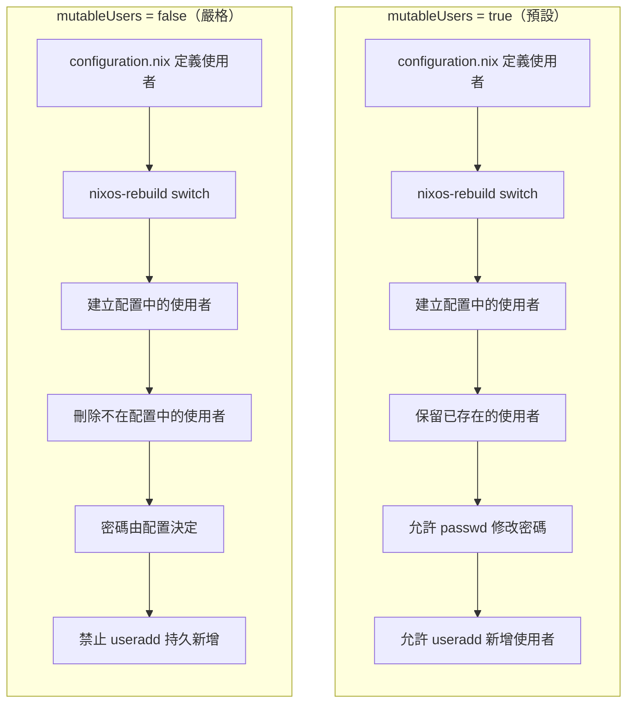
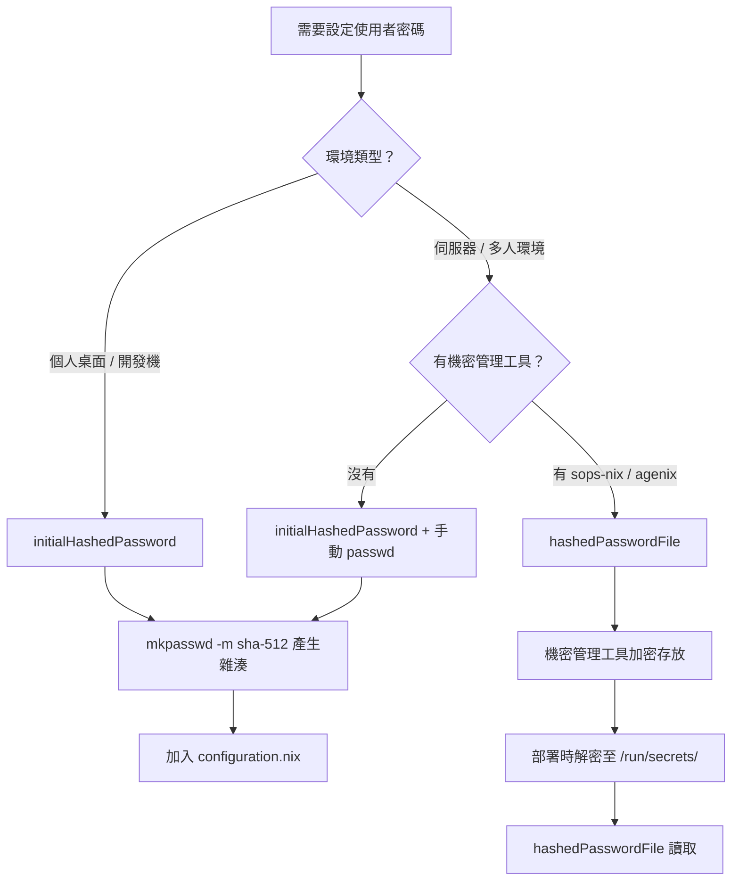
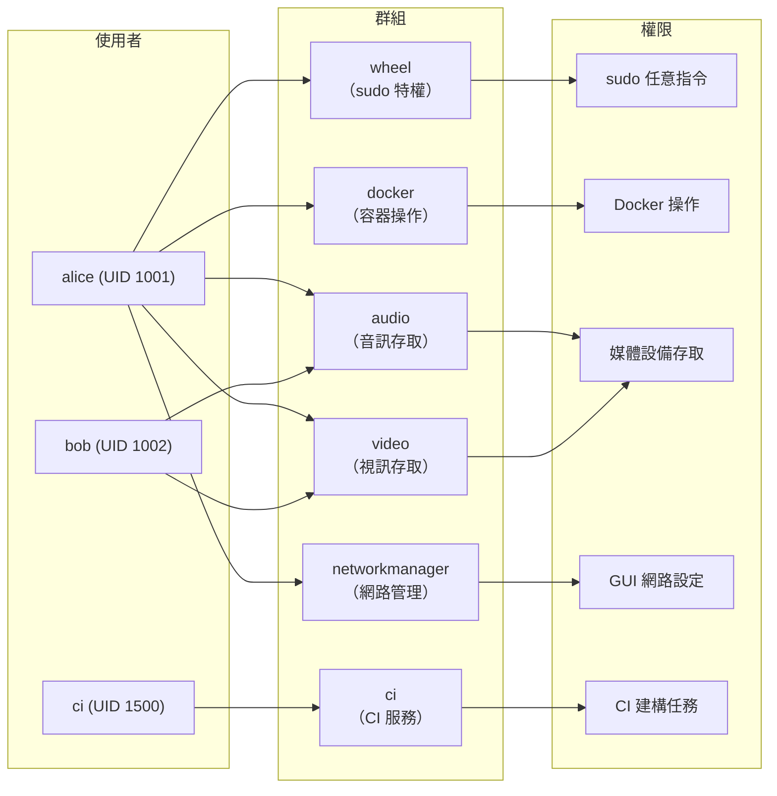

# 第11章：使用者與權限管理

## 本章學習目標

完成本章後，你將能夠：

1. 用宣告式配置（Declarative Configuration）方式定義使用者與群組
2. 理解 `mutableUsers` 對系統行為的影響，並選擇適合的模式
3. 配置精細的 `sudo` 規則，控制特權存取
4. 在 NixOS 配置中安全地部署 SSH 授權金鑰
5. 了解密碼與機密的安全管理原則，避免把敏感資料暴露在 Nix Store 中

---

## 前置知識

- 完成第10章（網路配置）
- 了解 Linux 基本權限概念（使用者、群組、UID/GID）
- 知道什麼是 SSH 公鑰／私鑰對

---

## 章節內容

- 11.1 `users.users`：使用者定義
- 11.2 `users.groups`：群組管理
- 11.3 `mutableUsers`：宣告式 vs 可修改
- 11.4 sudo 規則配置
- 11.5 SSH 授權金鑰部署
- 11.6 PAM 配置
- 11.7 密碼與機密管理
- 11.8 多使用者環境範例
- 11.9 LDAP / Active Directory 整合（進階）

---

## 為什麼使用者管理在 NixOS 中與眾不同？

在傳統 Linux 系統上，你會用這些指令建立使用者：

```bash
sudo useradd -m -s /bin/bash alice
sudo passwd alice
sudo usermod -aG wheel alice
```

這些指令直接修改 `/etc/passwd`、`/etc/shadow`、`/etc/group`。

問題在於：

- 這些修改沒有被記錄在任何版本控制中
- 換一台機器，你必須重複做一次
- 忘記執行哪一步，使用者設定就不一致

NixOS 的做法是：

把使用者定義寫進 `configuration.nix`，讓系統每次建構時自動同步。

這就是宣告式使用者管理的核心概念。

---

## 11.1 `users.users`：使用者定義

### 最基本的使用者

先看最簡單的例子——建立一個普通使用者 alice：

```nix
{ config, pkgs, ... }:

{
  users.users.alice = {
    isNormalUser = true;
  };

  system.stateVersion = "25.05";
}
```

`isNormalUser = true` 告訴 NixOS：

- 這是一般使用者（非系統帳號）
- 自動建立家目錄
- UID 從 1000 開始分配
- Shell 預設為 `/bin/sh`

這樣雖然可以建立使用者，但實際使用上還不夠完整。

### 完整的使用者定義

以下是一個包含所有常用欄位的完整 alice 使用者定義：

```nix
{ config, pkgs, ... }:

{
  users.users.alice = {
    # 使用者類型
    isNormalUser = true;

    # 固定 UID（重要：NFS 與容器環境必須一致）
    uid = 1001;

    # 家目錄位置
    home = "/home/alice";

    # 家目錄建立模式（八進位）
    homeMode = "750";

    # 是否自動建立家目錄（預設 true）
    createHome = true;

    # 預設登入 Shell
    shell = pkgs.bash;

    # 主要群組（Primary Group）
    group = "alice";

    # 附加群組（Secondary Groups）
    extraGroups = [
      "wheel"          # sudo 權限
      "docker"         # Docker 操作
      "audio"          # 音訊裝置
      "video"          # 視訊裝置
      "networkmanager" # 網路管理
    ];

    # 使用者描述（GECOS 欄位）
    description = "Alice Chen";

    # 雜湊密碼（從 mkpasswd 產生）
    initialHashedPassword = "$6$rounds=500000$xxx...";
  };

  system.stateVersion = "25.05";
}
```

每個欄位說明：

| 欄位 | 說明 | 預設值 |
|---|---|---|
| `isNormalUser` | 是否為一般使用者 | `false` |
| `uid` | 固定 UID | 自動分配 |
| `home` | 家目錄路徑 | `/home/<name>` |
| `homeMode` | 家目錄權限（八進位） | `"700"` |
| `createHome` | 是否自動建立家目錄 | `true` |
| `shell` | 登入 Shell | `/bin/sh` |
| `group` | 主要群組 | 與使用者名相同 |
| `extraGroups` | 附加群組清單 | `[]` |
| `description` | 使用者描述 | `""` |

### 固定 UID 的重要性

在單機桌面環境中，UID 自動分配通常沒問題。

但在這些情況下，固定 UID 非常重要：

**NFS 掛載**

NFS 用 UID/GID 判斷檔案所有者，而非使用者名稱。

如果 NFS Server 上 alice 的 UID 是 1001，但用戶端上 alice 的 UID 是 1002，就會出現權限錯誤。

**容器環境（Docker / Podman）**

容器內的 UID 需要與宿主機對應，才能正確存取掛載的 Volume。

**多台機器共用資料**

如果你有多台 NixOS 機器，且使用者需要共用檔案系統，必須確保所有機器上的 UID 一致。

固定 UID 的做法：

```nix
{ config, pkgs, ... }:

{
  users.users.alice = {
    isNormalUser = true;
    uid = 1001;   # 明確固定，不讓系統自動分配
  };

  system.stateVersion = "25.05";
}
```

### 密碼設定方式

NixOS 提供幾種設定密碼的方式，安全性各有不同。

**方式一：`initialHashedPassword`（初始雜湊密碼）**

這是最常用的初始密碼設定方式。

先用 `mkpasswd` 產生雜湊密碼：

```bash
mkpasswd -m sha-512
```

執行後，終端機會提示你輸入密碼，然後輸出一串雜湊字串：

```text
$6$rounds=500000$Dn.GxjDG5.d1FNvR$Xu1...（很長的字串）
```

把這串雜湊值填入配置：

```nix
{ config, pkgs, ... }:

{
  users.users.alice = {
    isNormalUser = true;
    initialHashedPassword = "$6$rounds=500000$Dn.GxjDG5.d1FNvR$Xu1...";
  };

  system.stateVersion = "25.05";
}
```

注意：`initialHashedPassword` 只在使用者**首次建立**時生效。

如果使用者已存在且 `mutableUsers = true`，後續的密碼修改（透過 `passwd`）不會被這個選項覆蓋。

**方式二：`hashedPassword`（強制雜湊密碼）**

與 `initialHashedPassword` 不同，`hashedPassword` 每次 `nixos-rebuild` 都會**強制套用**，覆蓋使用者手動更改的密碼。

```nix
{ config, pkgs, ... }:

{
  users.users.alice = {
    isNormalUser = true;
    hashedPassword = "$6$rounds=500000$...";
  };

  system.stateVersion = "25.05";
}
```

適合用在：

- 需要嚴格控制密碼的伺服器
- `mutableUsers = false` 的環境
- CI／CD 自動部署系統

**方式三：`hashedPasswordFile`（從外部檔案讀取）**

最安全的方式。雜湊密碼存在配置之外的檔案，不進入 Nix Store。

```nix
{ config, pkgs, ... }:

{
  users.users.alice = {
    isNormalUser = true;
    hashedPasswordFile = "/run/secrets/alice-password";
  };

  system.stateVersion = "25.05";
}
```

`/run/secrets/alice-password` 的內容就是一行雜湊字串。

這種方式需要搭配機密管理工具（如 `sops-nix` 或 `agenix`）使用。詳細說明見 11.7 節。

### Shell 設定

預設 Shell 是 `/bin/sh`，功能有限。

建議設定為 bash 或 zsh：

```nix
{ config, pkgs, ... }:

{
  users.users.alice = {
    isNormalUser = true;
    shell = pkgs.bash;   # 或 pkgs.zsh、pkgs.fish
  };

  # 如果使用 zsh，需要額外啟用
  programs.zsh.enable = true;

  system.stateVersion = "25.05";
}
```

重要提醒：如果你設定 `shell = pkgs.zsh`，必須同時設定 `programs.zsh.enable = true`，否則 zsh 不會出現在 `/etc/shells` 中，登入時可能出現錯誤。

---

## 11.2 `users.groups`：群組管理

### 建立使用者對應的群組

在 Linux 中，每個使用者必須有一個主要群組（Primary Group）。

當你設定 `users.users.alice.group = "alice"` 時，必須同時建立對應的群組：

```nix
{ config, pkgs, ... }:

{
  users.users.alice = {
    isNormalUser = true;
    group = "alice";
  };

  # 建立對應群組（空定義即可，GID 自動分配）
  users.groups.alice = {};

  system.stateVersion = "25.05";
}
```

`users.groups.alice = {}` 表示：建立名為 `alice` 的群組，使用預設設定。

### 自訂群組 GID

與 UID 相同，在 NFS 和共用環境中，需要固定 GID：

```nix
{ config, pkgs, ... }:

{
  users.groups.alice = {
    gid = 1001;   # 固定 GID
  };

  users.groups.developers = {
    gid = 2000;
    members = [ "alice" "bob" ];   # 直接在群組中定義成員
  };

  system.stateVersion = "25.05";
}
```

`members` 欄位是另一種方式，可以直接在群組定義中指定成員，而不是在每個使用者的 `extraGroups` 中指定。

### 系統群組 vs 一般群組

系統群組（System Group）用於系統服務，GID 通常在 1000 以下。

一般群組用於普通使用者。

區別方式：

```nix
{ config, pkgs, ... }:

{
  # 系統群組：isSystemGroup = true 由 NixOS 自動設定
  # 使用者群組：不需特別設定
  users.groups.myapp = {
    gid = 500;    # 小於 1000，慣例上視為系統群組
  };

  system.stateVersion = "25.05";
}
```

實際上，NixOS 在定義服務時（如 `services.nginx`），會自動建立對應的系統使用者和群組，你不需要手動建立。

### 常見系統群組說明

以下是 NixOS 中最常用的系統群組：

| 群組 | 用途 | 何時加入 |
|---|---|---|
| `wheel` | sudo 特權存取 | 需要管理員權限的使用者 |
| `docker` | 執行 Docker 指令 | 需要操作容器的使用者 |
| `audio` | 存取音訊裝置 | 桌面環境使用者 |
| `video` | 存取視訊／GPU 裝置 | 需要硬體加速的使用者 |
| `networkmanager` | 透過 GUI 管理網路 | 桌面環境使用者 |
| `input` | 存取輸入裝置（滑鼠、鍵盤） | 某些 Wayland compositor |
| `disk` | 直接存取磁碟裝置 | 謹慎使用，安全風險高 |
| `plugdev` | 存取 USB 裝置 | 需要操作 USB 設備的使用者 |
| `dialout` | 存取序列埠 | 嵌入式開發者 |
| `kvm` | 使用 KVM 虛擬化 | 需要執行虛擬機的使用者 |
| `libvirtd` | 管理 libvirt 虛擬機 | 虛擬化管理員 |

加入群組的方式：

```nix
{ config, pkgs, ... }:

{
  users.users.alice = {
    isNormalUser = true;
    extraGroups = [
      "wheel"
      "docker"
      "audio"
      "video"
      "networkmanager"
    ];
  };

  system.stateVersion = "25.05";
}
```

---

## 11.3 `mutableUsers`：宣告式 vs 可修改

這是 NixOS 使用者管理中最容易讓初學者困惑的概念。

### `mutableUsers = true`（預設行為）

預設情況下，`users.mutableUsers = true`。

這表示：

- NixOS 從 `configuration.nix` 建立配置中定義的使用者
- 但 `/etc/passwd` 和 `/etc/shadow` 可以被外部指令修改
- 使用者手動用 `passwd` 更改的密碼**會被保留**
- 用 `useradd` 手動新增的使用者**也會被保留**

這是一種「配置為基礎，允許額外變更」的模式。

適合：

- 桌面環境
- 開發工作站
- 需要讓使用者自行管理密碼的環境

### `mutableUsers = false`（嚴格宣告式）

當設定 `users.mutableUsers = false` 時：

- 系統**只承認** `configuration.nix` 中定義的使用者
- 每次 `nixos-rebuild switch`，系統會**刪除**不在配置中的使用者
- `passwd` 指令修改的密碼在下次重建後**會被覆蓋**

這是真正的宣告式使用者管理。

適合：

- 伺服器環境
- CI／CD 系統
- 需要嚴格稽核使用者的環境

```nix
{ config, pkgs, ... }:

{
  users.mutableUsers = false;   # 啟用嚴格宣告式模式

  users.users.alice = {
    isNormalUser = true;
    hashedPassword = "$6$rounds=500000$...";   # 必須在配置中提供密碼
  };

  system.stateVersion = "25.05";
}
```

注意：`mutableUsers = false` 時，必須在配置中明確提供每個使用者的密碼（`hashedPassword` 或 `hashedPasswordFile`），否則使用者將無法登入。

### 兩種模式的生命週期對比

以下是兩種模式在使用者生命週期上的差異：



### 危險：`mutableUsers = false` 時鎖死自己

這是一個真實存在的風險：

**情境**：你把 `mutableUsers = false` 後，忘記在配置中設定 root 密碼或 sudo 使用者的密碼。

**結果**：`nixos-rebuild switch` 後，所有使用者無法登入。

**預防措施**：

在啟用 `mutableUsers = false` 之前，務必確認：

1. root 使用者有密碼（或有辦法進入 rescue mode）
2. 至少一個有 `wheel` 群組的使用者有密碼
3. 配置中已設定 `hashedPassword` 或 `hashedPasswordFile`

安全的過渡範例：

```nix
{ config, pkgs, ... }:

{
  users.mutableUsers = false;

  # root 必須有密碼（或設定允許 SSH key 登入）
  users.users.root = {
    hashedPassword = "$6$rounds=500000$...";
  };

  users.users.alice = {
    isNormalUser = true;
    extraGroups = [ "wheel" ];
    hashedPassword = "$6$rounds=500000$...";
  };

  system.stateVersion = "25.05";
}
```

---

## 11.4 sudo 規則配置

sudo（Superuser Do）讓一般使用者能在特定條件下執行特權指令。

NixOS 提供多個層次的 sudo 配置。

### 基本：加入 wheel 群組

最簡單的 sudo 配置：把使用者加入 `wheel` 群組。

```nix
{ config, pkgs, ... }:

{
  users.users.alice = {
    isNormalUser = true;
    extraGroups = [ "wheel" ];   # 加入 wheel 群組即可 sudo
  };

  system.stateVersion = "25.05";
}
```

預設情況下，`wheel` 群組的成員執行 sudo 時**需要輸入密碼**。

### `wheelNeedsPassword`：是否需要密碼

```nix
{ config, pkgs, ... }:

{
  users.users.alice = {
    isNormalUser = true;
    extraGroups = [ "wheel" ];
  };

  # 設定 wheel 群組不需要密碼（便利但降低安全性）
  security.sudo.wheelNeedsPassword = false;

  system.stateVersion = "25.05";
}
```

`wheelNeedsPassword = false` 讓 wheel 群組的所有成員免密 sudo。

適合：

- 個人開發工作站
- 虛擬機測試環境

不建議用於：

- 多人共用的伺服器
- 生產環境

### `extraRules`：精細的 sudo 規則

如果需要更精細的控制，可以用 `security.sudo.extraRules`：

```nix
{ config, pkgs, ... }:

{
  users.users.alice = {
    isNormalUser = true;
  };

  security.sudo.extraRules = [
    {
      # alice 可以免密執行 systemctl
      users = [ "alice" ];
      commands = [
        {
          command = "${pkgs.systemd}/bin/systemctl";
          options = [ "NOPASSWD" ];
        }
      ];
    }
    {
      # developers 群組可以免密重啟 nginx
      groups = [ "developers" ];
      commands = [
        {
          command = "/run/current-system/sw/bin/systemctl restart nginx";
          options = [ "NOPASSWD" ];
        }
      ];
    }
  ];

  system.stateVersion = "25.05";
}
```

`extraRules` 的欄位說明：

| 欄位 | 說明 |
|---|---|
| `users` | 套用規則的使用者清單 |
| `groups` | 套用規則的群組清單 |
| `commands` | 允許的指令清單 |
| `command` | 指令完整路徑 |
| `options` | `NOPASSWD`、`PASSWD`、`NOEXEC` 等 |

### `extraConfig`：自由格式的 sudoers 規則

對於更複雜的情況，可以直接寫 sudoers 格式：

```nix
{ config, pkgs, ... }:

{
  security.sudo.extraConfig = ''
    # alice 可以以任何使用者身分執行任何指令，但需要密碼
    alice ALL=(ALL) ALL

    # alice 可以免密執行 apt-get（示範用，NixOS 無 apt）
    alice ALL=(root) NOPASSWD: /usr/bin/apt-get update
  '';

  system.stateVersion = "25.05";
}
```

注意：`extraConfig` 中的規則直接附加到 `/etc/sudoers` 末尾。語法錯誤可能導致 sudo 完全失效，請謹慎使用。

### 完整範例：alice 可免密 sudo 特定指令

以下是一個實際場景的完整配置：

alice 是開發者，需要：

- 重啟開發用的系統服務（需免密）
- 其他 sudo 操作仍需密碼

```nix
{ config, pkgs, ... }:

{
  users.users.alice = {
    isNormalUser = true;
    uid = 1001;
    group = "alice";
    extraGroups = [ "wheel" "docker" ];
    shell = pkgs.bash;
    description = "Alice Chen - Developer";
    initialHashedPassword = "$6$rounds=500000$...";
  };

  users.groups.alice = {};

  # wheel 群組預設需要密碼
  security.sudo.wheelNeedsPassword = true;

  # 額外規則：alice 可以免密重啟特定服務
  security.sudo.extraRules = [
    {
      users = [ "alice" ];
      commands = [
        {
          command = "${pkgs.systemd}/bin/systemctl restart myapp";
          options = [ "NOPASSWD" ];
        }
        {
          command = "${pkgs.systemd}/bin/systemctl restart nginx";
          options = [ "NOPASSWD" ];
        }
      ];
    }
  ];

  system.stateVersion = "25.05";
}
```

---

## 11.5 SSH 授權金鑰部署

NixOS 提供宣告式的 SSH 公鑰部署，讓你不需要手動複製金鑰到每台機器。

### 核心原則

在展示配置之前，先建立一個重要的安全觀念：

```text
公鑰（Public Key）→ 可以放進 configuration.nix
私鑰（Private Key）→ 絕對不能放進 configuration.nix
```

原因見 11.7 節的 Nix Store 可見性說明。

### 直接嵌入公鑰

最直接的方式：把公鑰字串寫進配置。

```nix
{ config, pkgs, ... }:

{
  users.users.alice = {
    isNormalUser = true;
    openssh.authorizedKeys.keys = [
      # 家用桌機的公鑰
      "ssh-ed25519 AAAAC3NzaC1lZDI1NTE5AAAAIGk5... alice@home-desktop"

      # 筆電的公鑰
      "ssh-ed25519 AAAAC3NzaC1lZDI1NTE5AAAAIPx7... alice@laptop"

      # 工作機的公鑰
      "ssh-rsa AAAAB3NzaC1yc2EAAAADAQABAAAB... alice@work"
    ];
  };

  services.openssh.enable = true;

  system.stateVersion = "25.05";
}
```

優點：

- 簡單直接
- 金鑰與配置一起納入版本控制

缺點：

- 如果有很多使用者，配置檔案會變得很長
- 修改金鑰需要修改配置並重建系統

### 從檔案讀取公鑰

如果公鑰存在獨立檔案，可以用 `keyFiles` 讀取：

```nix
{ config, pkgs, ... }:

{
  users.users.alice = {
    isNormalUser = true;
    openssh.authorizedKeys.keyFiles = [
      # 從 alice 的 authorized_keys 檔案讀取
      /etc/nixos/keys/alice_authorized_keys

      # 可以指定多個檔案
      /etc/nixos/keys/alice_work_keys
    ];
  };

  services.openssh.enable = true;

  system.stateVersion = "25.05";
}
```

`/etc/nixos/keys/alice_authorized_keys` 的格式與標準 `~/.ssh/authorized_keys` 相同：

```text
ssh-ed25519 AAAAC3NzaC1lZDI1NTE5AAAAIGk5... alice@home-desktop
ssh-ed25519 AAAAC3NzaC1lZDI1NTE5AAAAIPx7... alice@laptop
```

### 同時使用兩種方式

`keys` 和 `keyFiles` 可以同時使用：

```nix
{ config, pkgs, ... }:

{
  users.users.alice = {
    isNormalUser = true;
    openssh.authorizedKeys = {
      # 直接嵌入的公鑰
      keys = [
        "ssh-ed25519 AAAAC3NzaC1lZDI1NTE5AAAAIGk5... alice@home"
      ];
      # 從檔案讀取的公鑰
      keyFiles = [
        /etc/nixos/keys/alice_extra_keys
      ];
    };
  };

  system.stateVersion = "25.05";
}
```

### 多台機器共用金鑰的管理模式

當你管理多台 NixOS 機器時，可以建立一個共用模組：

```nix
# /etc/nixos/modules/users/alice.nix
{ config, pkgs, ... }:

{
  users.users.alice = {
    isNormalUser = true;
    uid = 1001;
    group = "alice";
    shell = pkgs.bash;
    extraGroups = [ "wheel" ];

    # 所有機器都使用同一組公鑰
    openssh.authorizedKeys.keys = [
      "ssh-ed25519 AAAAC3NzaC1lZDI1NTE5AAAAIGk5... alice@home-desktop"
      "ssh-ed25519 AAAAC3NzaC1lZDI1NTE5AAAAIPx7... alice@laptop"
    ];
  };

  users.groups.alice = {};
}
```

然後在各台機器的 `configuration.nix` 中引入：

```nix
{ config, pkgs, ... }:

{
  imports = [
    ./hardware-configuration.nix
    ./modules/users/alice.nix   # 所有機器共用同一個使用者定義
  ];

  networking.hostName = "nixos-server-01";

  system.stateVersion = "25.05";
}
```

這樣，alice 的 SSH 金鑰只需要在一個地方更新，所有機器 `nixos-rebuild switch` 後都會同步。

---

## 11.6 PAM 配置

PAM（Pluggable Authentication Modules，可插拔驗證模組）是 Linux 驗證架構的基礎。

NixOS 提供宣告式的 PAM 配置介面。

### `security.pam.services`：服務層級的 PAM 配置

每個 PAM 服務（如 `login`、`sshd`、`sudo`）都有獨立的配置：

```nix
{ config, pkgs, ... }:

{
  # 啟用 login 服務的 PAM 設定範例
  security.pam.services.login = {
    # 啟用帳號過期檢查
    showMotd = true;

    # 限制登入失敗次數（需要 pam_faillock 模組）
    failDelay = {
      enable = true;
      delay = 3000000;   # 3 秒（微秒）
    };
  };

  system.stateVersion = "25.05";
}
```

### `security.pam.loginLimits`：資源限制（ulimit）

`loginLimits` 對應傳統 `/etc/security/limits.conf`，用於設定使用者的資源上限：

```nix
{ config, pkgs, ... }:

{
  security.pam.loginLimits = [
    # alice 的最大開放檔案數（open files）
    {
      domain = "alice";
      type = "soft";
      item = "nofile";
      value = "65536";
    }
    {
      domain = "alice";
      type = "hard";
      item = "nofile";
      value = "1048576";
    }

    # developers 群組的最大行程數
    {
      domain = "@developers";
      type = "soft";
      item = "nproc";
      value = "4096";
    }

    # 所有使用者的 core dump 上限（0 = 停用）
    {
      domain = "*";
      type = "hard";
      item = "core";
      value = "0";
    }
  ];

  system.stateVersion = "25.05";
}
```

`loginLimits` 欄位說明：

| 欄位 | 說明 | 範例 |
|---|---|---|
| `domain` | 使用者名稱、`@群組名`、或 `*` | `"alice"`、`"@wheel"` |
| `type` | `soft`（軟限制，可提高）或 `hard`（硬上限） | `"soft"` |
| `item` | 資源類型 | `"nofile"`、`"nproc"`、`"core"` |
| `value` | 限制值 | `"65536"` |

常用的 `item` 值：

| item | 說明 |
|---|---|
| `nofile` | 最大開放檔案數 |
| `nproc` | 最大行程數 |
| `core` | Core dump 大小（bytes，0 = 停用） |
| `stack` | Stack 大小（KB） |
| `memlock` | 可鎖定記憶體大小（KB） |

### 常見 PAM 調整場景

**YubiKey 雙因子驗證**

```nix
{ config, pkgs, ... }:

{
  # 啟用 U2F 驗證（YubiKey 等 FIDO2 裝置）
  security.pam.u2f = {
    enable = true;
    cue = true;   # 提示使用者觸碰 YubiKey
  };

  # 對 sudo 啟用 U2F
  security.pam.services.sudo.u2fAuth = true;

  system.stateVersion = "25.05";
}
```

**容器環境：停用某些 PAM 模組**

在容器環境中，某些 PAM 模組（如 `pam_loginuid`）可能造成問題：

```nix
{ config, pkgs, ... }:

{
  security.pam.services.login.setLoginUid = false;

  system.stateVersion = "25.05";
}
```

**`security.pam.enableSudoTouchIdAuth`：macOS Touch ID for sudo**

這是一個有趣的選項——它移植了 macOS 上用 Touch ID 解鎖 sudo 的功能。

在 NixOS on Apple Silicon（或使用支援的生物辨識硬體）上：

```nix
{ config, pkgs, ... }:

{
  security.pam.enableSudoTouchIdAuth = true;

  system.stateVersion = "25.05";
}
```

---

## 11.7 密碼與機密管理

這是 NixOS 初學者最常犯錯的地方，必須清楚理解。

### Nix Store 是公開的

Nix Store（`/nix/store`）中的所有檔案都是**世界可讀的**（world-readable）。

這表示：

- 系統上的任何使用者都能讀取 `/nix/store` 中的任何檔案
- 你的 `configuration.nix` 最終會被編譯成 Nix Store 中的某個路徑
- **任何放進 `configuration.nix` 的字串，都可能被其他使用者讀取**

因此：

```nix
# 錯誤！明文密碼絕對不能放在配置中
users.users.alice = {
  password = "my-secret-password";   # 任何人都能讀到這個
};
```

就算你用環境變數或「不明顯的方式」，只要字串最終進入 Nix Store，就是不安全的。

### 為什麼雜湊密碼相對安全？

`hashedPassword` 雖然也會進入 Nix Store，但：

- 雜湊本身沒有辦法反推出原始密碼（在強雜湊演算法下）
- 存入 Nix Store 的是 `$6$...` 這樣的雜湊字串，不是明文

然而，把雜湊密碼放進 Nix Store 仍然有風險：

- 暴力破解工具可能離線破解弱密碼
- 不同機器的密碼雜湊被公開在版本庫中

**最佳實踐**：用 `hashedPasswordFile` 搭配機密管理工具。

### `hashedPasswordFile`：密碼不進 Nix Store

```nix
{ config, pkgs, ... }:

{
  users.users.alice = {
    isNormalUser = true;
    # 從系統執行時的路徑讀取，這個路徑不在 Nix Store 中
    hashedPasswordFile = "/run/secrets/alice-hashed-password";
  };

  system.stateVersion = "25.05";
}
```

`/run/secrets/` 是一個常見的慣例，由機密管理工具在系統啟動時動態建立，不是靜態檔案。

### 產生雜湊密碼

用 `mkpasswd` 工具產生 SHA-512 雜湊密碼：

```bash
# 互動式輸入（推薦，密碼不會出現在命令列歷史中）
mkpasswd -m sha-512

# 指定輪數（rounds 越高越安全，也越慢）
mkpasswd -m sha-512 -R 500000
```

執行後輸出類似：

```text
$6$rounds=500000$xxxxxxxxxxx$yyyyyyyyyyyyyyyyyyyyyyyyyyyyyyyyyyyyyyyyyyyyyyyyyyyyyyyy
```

把這串雜湊值存入 `/run/secrets/alice-hashed-password`（由機密管理工具管理）。

### `age` / `sops-nix` 概念介紹

當你需要在配置中使用機密（密碼、API 金鑰、TLS 憑證），NixOS 社群常用兩種工具：

**agenix（使用 age 加密）**

- 機密以 age 加密格式儲存在 Git 倉庫中
- 系統啟動時，agenix 用機器的 SSH 私鑰解密，放到 `/run/secrets/`
- 設定相對簡單

**sops-nix（使用 SOPS 加密）**

- 機密以 SOPS 格式儲存（支援 age、GPG、AWS KMS 等多種後端）
- 適合需要多種加密後端的企業環境
- 設定稍複雜但功能更強大

這兩種工具的詳細配置將在第六篇（Flakes 與現代架構）中介紹。

### 臨時密碼設置方式

在初始部署或緊急情況下，可以先設定一個臨時方案：

1. 在配置中設定 `initialHashedPassword`（只在首次建立使用者時生效）
2. 執行 `nixos-rebuild switch`
3. 使用者登入後，手動更改密碼：

```bash
# 以 root 身分為 alice 設定新密碼
sudo passwd alice

# 或讓 alice 自行更改
passwd
```

如果使用 `mutableUsers = true`，手動更改的密碼會保留，直到下次 `nixos-rebuild` 時被 `hashedPassword` 覆蓋（如果有設定的話）。

### 完整的密碼安全決策流程



---

## 11.8 多使用者環境範例

### 場景一：家庭伺服器

一台 NixOS 家庭伺服器，有：

- `alice`：管理員，有完整 sudo 權限
- `bob`：家庭成員，只能使用一般服務

```nix
{ config, pkgs, ... }:

{
  users.mutableUsers = false;

  # 管理員 alice
  users.users.alice = {
    isNormalUser = true;
    uid = 1001;
    group = "alice";
    shell = pkgs.bash;
    description = "Alice - Admin";
    extraGroups = [ "wheel" "docker" "networkmanager" ];
    hashedPassword = "$6$rounds=500000$alice-hash...";
    openssh.authorizedKeys.keys = [
      "ssh-ed25519 AAAAC3NzaC1lZDI1NTE5AAAAIGk5... alice@laptop"
    ];
  };

  users.groups.alice = {};

  # 一般使用者 bob
  users.users.bob = {
    isNormalUser = true;
    uid = 1002;
    group = "bob";
    shell = pkgs.bash;
    description = "Bob - Family Member";
    extraGroups = [ "audio" "video" ];
    hashedPassword = "$6$rounds=500000$bob-hash...";
  };

  users.groups.bob = {};

  # wheel 群組需要密碼
  security.sudo.wheelNeedsPassword = true;

  system.stateVersion = "25.05";
}
```

### 場景二：開發工作站

一台 NixOS 開發工作站，有：

- `alice`：主要開發者，使用桌面環境
- `ci`：CI Runner 服務帳號，無登入 Shell

```nix
{ config, pkgs, ... }:

{
  # 開發工作站允許可修改使用者
  users.mutableUsers = true;

  # 主要開發者
  users.users.alice = {
    isNormalUser = true;
    uid = 1001;
    group = "alice";
    shell = pkgs.zsh;
    description = "Alice Chen - Developer";
    extraGroups = [
      "wheel"
      "docker"
      "kvm"
      "libvirtd"
      "audio"
      "video"
      "networkmanager"
      "input"
    ];
    initialHashedPassword = "$6$rounds=500000$alice-hash...";
    openssh.authorizedKeys.keys = [
      "ssh-ed25519 AAAAC3NzaC1lZDI1NTE5AAAAIGk5... alice@home"
    ];
  };

  users.groups.alice = {};

  # CI Runner 服務帳號（無 Shell，不能登入）
  users.users.ci = {
    isNormalUser = false;   # 系統帳號
    uid = 1500;
    group = "ci";
    shell = pkgs.shadow + "/bin/nologin";   # 禁止登入
    description = "CI Runner Service Account";
    home = "/var/lib/ci-runner";
    createHome = true;
  };

  users.groups.ci = {
    gid = 1500;
  };

  # 開發者工作站：免密 sudo
  security.sudo.wheelNeedsPassword = false;

  # zsh 需要明確啟用
  programs.zsh.enable = true;

  system.stateVersion = "25.05";
}
```

### 使用者、群組、權限關係圖

以下是上面兩個場景的關係全貌：



---

## 11.9 LDAP / Active Directory 整合（進階）

對於企業環境，使用者通常由集中式目錄服務管理，如 LDAP 或 Active Directory（AD）。

NixOS 支援透過 SSSD 或傳統 pam_ldap 整合這些服務。

> 這是企業進階主題。本節提供概念與配置入口，完整的企業目錄整合將在第八篇詳細說明。

### 使用 SSSD 整合 LDAP / Active Directory

SSSD（System Security Services Daemon）是現代 Linux 整合目錄服務的標準方式：

```nix
{ config, pkgs, ... }:

{
  # 啟用 SSSD
  services.sssd = {
    enable = true;
    config = ''
      [sssd]
      services = nss, pam
      domains = example.com

      [domain/example.com]
      id_provider = ldap
      auth_provider = ldap
      ldap_uri = ldap://ldap.example.com
      ldap_search_base = dc=example,dc=com
      ldap_tls_reqcert = demand
    '';
  };

  # 讓 PAM 使用 SSSD 驗證
  security.pam.makeHomeDir.enable = true;

  system.stateVersion = "25.05";
}
```

對於 Active Directory 整合，通常搭配 Kerberos：

```nix
{ config, pkgs, ... }:

{
  services.sssd = {
    enable = true;
    config = ''
      [sssd]
      services = nss, pam
      domains = CORP.EXAMPLE.COM

      [domain/CORP.EXAMPLE.COM]
      id_provider = ad
      auth_provider = ad
      access_provider = ad
      ad_domain = corp.example.com
      ad_server = dc01.corp.example.com
      krb5_realm = CORP.EXAMPLE.COM
    '';
  };

  # Kerberos 配置
  krb5 = {
    enable = true;
    realms = {
      "CORP.EXAMPLE.COM" = {
        kdc = "dc01.corp.example.com";
        admin_server = "dc01.corp.example.com";
      };
    };
    libdefaults.default_realm = "CORP.EXAMPLE.COM";
  };

  system.stateVersion = "25.05";
}
```

### 使用傳統 `users.ldap` 整合

NixOS 也提供傳統的 LDAP 整合選項：

```nix
{ config, pkgs, ... }:

{
  users.ldap = {
    enable = true;
    server = "ldap://ldap.example.com";
    base = "dc=example,dc=com";
    useTLS = true;

    # LDAP 查詢快取（提升效能）
    daemon = {
      enable = true;
    };
  };

  system.stateVersion = "25.05";
}
```

### 選擇建議

| 場景 | 建議方案 |
|---|---|
| 現代 Active Directory 環境 | SSSD + ad provider |
| 標準 LDAP 目錄 | SSSD + ldap provider |
| 簡單 LDAP 整合 | `users.ldap` |
| FreeIPA 環境 | SSSD + ipa provider |

---

## 本章小結

本章涵蓋了 NixOS 使用者與權限管理的完整體系。

### 核心觀念回顧

**使用者定義（11.1）**

`users.users.<name>` 是宣告式使用者管理的核心。

重要欄位：`uid`、`isNormalUser`、`shell`、`group`、`extraGroups`。

固定 UID 在 NFS 和容器環境中至關重要。

**群組管理（11.2）**

`users.groups.<name>` 建立群組，可固定 GID。

常見系統群組：`wheel`（sudo）、`docker`、`audio`、`video`、`networkmanager`。

**mutableUsers（11.3）**

`mutableUsers = true`（預設）：允許系統外的使用者變更存在。

`mutableUsers = false`（嚴格）：只有配置中的使用者存在，適合伺服器環境。

啟用 `false` 模式前，務必確認 sudo 使用者有密碼，避免鎖死自己。

**sudo 規則（11.4）**

`wheel` 群組是最簡單的 sudo 方式。

`security.sudo.extraRules` 提供精細的指令級別控制。

**SSH 金鑰（11.5）**

公鑰可以放進配置，私鑰絕不能放進配置。

共用模組可以讓多台機器同步同一組公鑰。

**密碼安全（11.7）**

Nix Store 世界可讀，明文密碼絕對不能放進配置。

`hashedPasswordFile` + 機密管理工具是最安全的方案。

`mkpasswd -m sha-512` 用於產生雜湊密碼。

### 本章練習

**練習 1**：建立一個使用者 alice，固定 UID 為 1001，加入 `wheel` 和 `docker` 群組，Shell 設為 bash。

**練習 2**：為 alice 設定 SSH 公鑰，並確認能從另一台機器 SSH 登入。

**練習 3**：把 `mutableUsers` 設為 `false`，確認配置中所有使用者都有 `hashedPassword`，執行 `nixos-rebuild switch` 並驗證登入仍然正常。

**練習 4**：用 `security.sudo.extraRules` 讓 alice 可以免密重啟 nginx 服務，但其他 sudo 操作仍需密碼。

### 下一章預告

第12章將深入探討 NixOS 的套件環境管理：

- `environment.systemPackages`：系統層套件安裝
- `programs.<name>`：程式整合配置
- Overlay 機制：客製化或覆蓋套件
- `nix-env` vs 宣告式安裝的差異
- Home Manager 的套件管理（使用者層）
