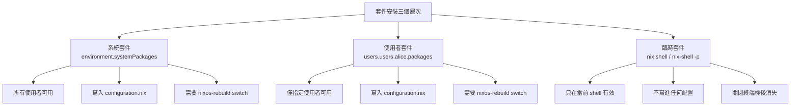
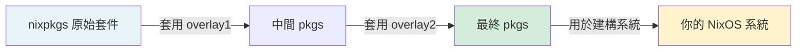
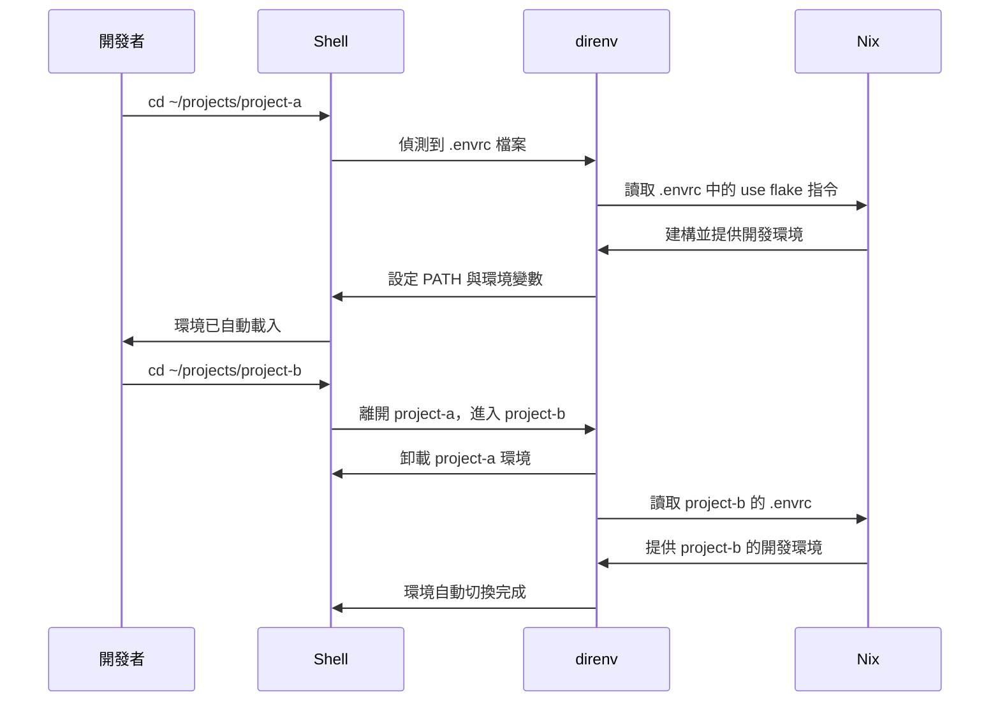

# 第12章：套件與環境管理

NixOS 的套件管理與傳統 Linux 發行版截然不同。

你不再執行 `apt install` 或 `pacman -S`。

而是把「需要哪些套件」寫進配置檔，讓 NixOS 幫你確保系統狀態。

這一章將帶你完整掌握：如何在系統層與使用者層安裝套件、如何處理 unfree 軟體、如何透過 Overlay（覆蓋層）微調套件行為，以及如何打造整潔的 shell 開發環境。

---

## 本章學習目標

完成本章後，你將能夠：

1. 分辨系統套件、使用者套件、臨時套件三個層次，並選擇正確的安裝方式
2. 使用 `nixpkgs.config` 允許 unfree、broken 或特定不安全套件
3. 撰寫基礎 Overlay，對 nixpkgs 套件進行版本覆蓋或屬性修改
4. 正確配置中文字型與開發字型（Nerd Fonts）
5. 整合 direnv 與 nix-direnv，實現「進入目錄自動載入開發環境」的現代工作流程

---

## 前置知識

- 完成第11章（使用者與權限管理）
- 了解 `configuration.nix` 的基本結構（第4章）
- 熟悉 `with pkgs;` 語法（第3章 Nix 語言基礎）

---

## 12.1 套件安裝的三個層次

初學者最常遇到的疑問是：

> 「我要安裝一個工具，到底該寫在哪裡？」

NixOS 有三個不同的套件安裝層次，各自有不同的用途與生命週期。

### 三層架構總覽



### 層次一：系統套件（`environment.systemPackages`）

系統套件是最常見的安裝方式。

安裝後，系統上所有使用者都能使用這些工具。

適合放在這裡的套件：

- 全體使用者都需要的基礎工具（`git`、`vim`、`curl`、`htop`）
- 系統管理工具（`lsof`、`strace`、`nmap`）
- 基礎開發環境（`gcc`、`gnumake`）

基本寫法：

```nix
{ config, pkgs, ... }:

{
  environment.systemPackages = with pkgs; [
    git
    vim
    curl
    htop
    tree
    wget
  ];

  system.stateVersion = "25.05";
}
```

`with pkgs;` 讓你在列表中直接寫套件名稱，不必每行都加 `pkgs.` 前綴。

套用方式：

```bash
sudo nixos-rebuild switch
```

### 層次二：使用者套件（`users.users.alice.packages`）

NixOS 25.05 之後，可以直接在使用者定義中指定該使用者專屬的套件。

這些套件只有 `alice` 能使用，其他使用者看不到。

適合放在這裡的套件：

- 個人偏好的編輯器或工具（`neovim`、`emacs`）
- 語言執行環境（`python3`、`nodejs`）
- 桌面個人化工具（`obs-studio`、`discord`）

```nix
{ config, pkgs, ... }:

{
  users.users.alice = {
    isNormalUser = true;
    extraGroups = [ "wheel" "networkmanager" ];

    # 使用者專屬套件（NixOS 25.05+）
    packages = with pkgs; [
      neovim
      python3
      nodejs_22
      ripgrep
      fd
      bat
      eza
    ];
  };

  system.stateVersion = "25.05";
}
```

> 注意：`users.users.<name>.packages` 是 NixOS 25.05 引入的功能。
> 在更早的版本中，使用者層套件需透過 Home Manager 管理。

### 層次三：臨時套件（`nix shell` / `nix-shell -p`）

有時候你只是想「試用」一個工具，不打算長期保留。

這時使用臨時套件最合適。

**方法一：`nix shell`（Flakes 指令，推薦）**

```bash
# 進入一個帶有 jq 和 httpie 的臨時 shell
nix shell nixpkgs#jq nixpkgs#httpie

# 使用完畢，直接 exit 離開
exit
```

**方法二：`nix-shell -p`（傳統指令）**

```bash
# 快速試用 python3
nix-shell -p python3

# 試用特定工具
nix-shell -p ffmpeg --run "ffmpeg -version"
```

臨時套件的特性：

- 不修改任何配置檔
- 關閉 shell 後套件消失（但仍在 `/nix/store` 快取中）
- 適合「先試試看」的場景
- 非常適合執行一次性的指令

### 三個層次的比較

| 層次 | 適用情境 | 寫入配置 | 生命週期 |
|---|---|---|---|
| `environment.systemPackages` | 全體使用者需要 | 是 | 永久（直到移除） |
| `users.users.alice.packages` | 個人偏好工具 | 是 | 永久（直到移除） |
| `nix shell` / `nix-shell -p` | 臨時試用 | 否 | 僅當前 shell |

---

## 12.2 environment.systemPackages 最佳實踐

### 基本寫法：`with pkgs;` 語法

最常見的寫法使用 `with pkgs;` 來簡化套件名稱：

```nix
{ config, pkgs, ... }:

{
  environment.systemPackages = with pkgs; [
    # 版本控制
    git
    git-lfs

    # 文字編輯
    vim
    nano

    # 網路工具
    curl
    wget
    nmap

    # 系統監控
    htop
    iotop
    lsof

    # 壓縮工具
    unzip
    p7zip
  ];

  system.stateVersion = "25.05";
}
```

如果需要混合使用 `with pkgs;` 與明確前綴（例如取得特定版本變體 `pkgs.python312`），在列表中直接寫 `pkgs.python312` 即可，`with pkgs;` 不影響使用完整路徑。

### 哪些套件適合放系統層？

**適合放系統層（`environment.systemPackages`）：**

- 系統管理工具（所有使用者都可能需要）：`git`、`vim`、`curl`、`wget`、`htop`
- 診斷與除錯工具：`strace`、`lsof`、`nmap`、`tcpdump`
- 共用開發工具：`gcc`、`gnumake`、`cmake`
- 安全工具：`gnupg`、`openssh`

**適合放使用者層（`users.users.alice.packages`）：**

- 個人偏好的編輯器：`neovim`、`emacs`、`helix`
- 個人語言工具鏈：`python3`、`nodejs`、`rustup`
- 桌面應用程式：`firefox`、`thunderbird`、`spotify`
- 個人生產力工具：`obsidian`、`notion-app`

### `pkgs.writeShellScriptBin`：建立自訂指令

有時候你需要一個簡單的包裝腳本。

`pkgs.writeShellScriptBin` 可以讓你直接在配置檔中建立可執行的 shell 腳本，並將它安裝進系統：

```nix
{ config, pkgs, ... }:

{
  environment.systemPackages = with pkgs; [
    git
    vim

    # 建立一個自訂的 nixos-update 指令
    (pkgs.writeShellScriptBin "nixos-update" ''
      #!/usr/bin/env bash
      set -e
      echo "正在更新 NixOS..."
      sudo nixos-rebuild switch --upgrade
      echo "更新完成！"
      nix-collect-garbage --delete-older-than 30d
    '')

    # 建立一個查詢系統世代的指令
    (pkgs.writeShellScriptBin "list-generations" ''
      #!/usr/bin/env bash
      sudo nix-env --list-generations --profile /nix/var/nix/profiles/system
    '')
  ];

  system.stateVersion = "25.05";
}
```

套用後，所有使用者都可以直接執行 `nixos-update` 與 `list-generations`。

這是建立系統維護腳本的好方法，而且腳本本身也受到 Nix 的版本管理控制。

---

## 12.3 nixpkgs.config：套件配置

有些套件有特殊限制，預設情況下 Nix 不會安裝它們。

`nixpkgs.config` 讓你控制這些行為。

### 允許非自由軟體（`allowUnfree`）

部分套件因為授權問題（商業軟體、專利軟體），Nix 預設不安裝它們。

例如：`vscode`、`steam`、`nvidia-x11`。

要允許所有 unfree 套件：

```nix
{ config, pkgs, ... }:

{
  # 允許所有 unfree 套件（最簡單但最寬鬆的設定）
  nixpkgs.config.allowUnfree = true;

  environment.systemPackages = with pkgs; [
    vscode      # unfree
    steam       # unfree
  ];

  system.stateVersion = "25.05";
}
```

> 注意：在使用 Flakes 時，`allowUnfree` 的設置方式不同。
> 你需要在 `flake.nix` 的 `nixpkgs` 輸入中傳遞 `config`，
> 或透過 `nixpkgs.config` option 傳遞。
> 第17章（Flakes 基礎）與第19章（Home Manager 整合）會詳細說明這個差異。

### 禁用損壞套件（`allowBroken`）

`allowBroken = false` 是預設值，通常不需要修改。

如果某個套件標記為 broken，強制啟用可能導致建構失敗：

```nix
{ config, pkgs, ... }:

{
  # 預設 false，保留預設值即可
  # nixpkgs.config.allowBroken = false;

  system.stateVersion = "25.05";
}
```

### 允許特定不安全版本（`permittedInsecurePackages`）

某些套件版本因為已知安全漏洞，被標記為 insecure。

如果你確實需要使用這些版本（例如舊版開發工具的相容性需求），可以明確允許：

```nix
{ config, pkgs, ... }:

{
  nixpkgs.config.permittedInsecurePackages = [
    # 明確允許特定版本（格式：套件名稱-版本號）
    "python-2.7.18.8"
    "openssl-1.1.1w"
  ];

  system.stateVersion = "25.05";
}
```

只允許明確列出的版本，這比 `allowBroken = true` 更精確、更安全。

### 更精細的 `allowUnfreePredicate`：只允許特定 unfree 套件

`allowUnfree = true` 會允許所有 unfree 套件，這有時過於寬鬆。

使用 `allowUnfreePredicate` 可以精細控制允許哪些 unfree 套件：

```nix
{ config, pkgs, lib, ... }:

{
  nixpkgs.config.allowUnfreePredicate = pkg: builtins.elem (lib.getName pkg) [
    # 只允許這些特定的 unfree 套件
    "steam"
    "steam-original"
    "steam-run"
    "vscode"
    "nvidia-x11"
    "nvidia-settings"
    "nvidia-persistenced"
    "cudatoolkit"
  ];

  system.stateVersion = "25.05";
}
```

`lib.getName pkg` 會取得套件的基本名稱（去掉版本號），然後用 `builtins.elem` 檢查是否在允許清單中。

### 完整範例：允許 Steam、VSCode、NVIDIA 驅動

以下是一個常見的桌面工作站配置，允許了幾個常用的 unfree 套件：

```nix
{ config, pkgs, lib, ... }:

{
  nixpkgs.config = {
    # 使用 predicate 精確控制，而不是全部開放
    allowUnfreePredicate = pkg: builtins.elem (lib.getName pkg) [
      "steam"
      "steam-original"
      "steam-run"
      "vscode"
      "nvidia-x11"
      "nvidia-settings"
      "nvidia-persistenced"
    ];
  };

  # NVIDIA 驅動
  services.xserver.videoDrivers = [ "nvidia" ];

  hardware.nvidia = {
    modesetting.enable = true;
    open = false;
    nvidiaSettings = true;
  };

  environment.systemPackages = with pkgs; [
    vscode   # unfree，已在 predicate 中允許
    steam    # unfree，已在 predicate 中允許
  ];

  system.stateVersion = "25.05";
}
```

---

## 12.4 Overlay 基礎：修改套件行為

### 什麼是 Overlay（覆蓋層）？

nixpkgs 是一個龐大的套件集合，包含數萬個套件。

有時你需要：

- 使用比 nixpkgs 更新的套件版本
- 為現有套件新增功能或 patch
- 將自己建立的套件加入 `pkgs` 命名空間

Overlay（覆蓋層）就是解決這些需求的機制。

它讓你在 nixpkgs 之上「疊加」自訂的套件定義，而不需要修改 nixpkgs 本身。

### Overlay 的求值鏈



每個 overlay 都接收兩個參數：

- `final`：已套用所有 overlay 後的最終 `pkgs`（用於依賴其他套件）
- `prev`：套用這個 overlay 之前的 `pkgs`（用於覆蓋原始定義）

### 基本語法

```nix
{ config, pkgs, ... }:

{
  nixpkgs.overlays = [
    # 第一個 overlay：函式接受 (final: prev:) 兩個參數
    (final: prev: {
      # 在這裡定義你要覆蓋或新增的套件
    })
  ];

  system.stateVersion = "25.05";
}
```

### 範例一：覆蓋套件版本

假設你需要使用比 nixpkgs 更新的 `hello` 版本（以 `hello` 作為示範）：

```nix
{ config, pkgs, ... }:

{
  nixpkgs.overlays = [
    (final: prev: {
      # 覆蓋 hello 套件，修改版本來源
      hello = prev.hello.overrideAttrs (oldAttrs: {
        version = "2.12.1";
        src = prev.fetchurl {
          url = "mirror://gnu/hello/hello-2.12.1.tar.gz";
          sha256 = "sha256-jZkUKv2SV28wsM18tCqNxoCZmLxdYH2Idh9RLibH2yA=";
        };
      });
    })
  ];

  environment.systemPackages = with pkgs; [
    hello  # 這裡使用的是 overlay 覆蓋後的版本
  ];

  system.stateVersion = "25.05";
}
```

### 範例二：新增自訂套件到 pkgs 命名空間

有時你需要打包一個 nixpkgs 中沒有的工具：

```nix
{ config, pkgs, ... }:

{
  nixpkgs.overlays = [
    (final: prev: {
      # 新增一個自訂套件到 pkgs 命名空間
      my-custom-tool = prev.stdenv.mkDerivation {
        pname = "my-custom-tool";
        version = "1.0.0";

        src = prev.fetchurl {
          url = "https://example.com/my-tool-1.0.0.tar.gz";
          sha256 = "sha256-AAAAAAAAAAAAAAAAAAAAAAAAAAAAAAAAAAAAAAAAAAA=";
        };

        buildInputs = [ prev.openssl prev.zlib ];

        installPhase = ''
          mkdir -p $out/bin
          cp my-tool $out/bin/
        '';
      };
    })
  ];

  environment.systemPackages = with pkgs; [
    my-custom-tool  # 透過 overlay 加入的自訂套件
  ];

  system.stateVersion = "25.05";
}
```

### 重要提示

Overlay 是進階主題。

這一節只是給你概念入門：了解 Overlay 的存在與基本語法。

第21章（Overlay 與 Package Override）會深入介紹：

- `self` 與 `super` 的詳細語義
- 如何為套件套用 patch
- 如何建立本地 package repository
- Overlay 的組合與模組化

---

## 12.5 Package Override 技巧

### `.override`：修改 buildInputs 與編譯選項

`.override` 讓你修改套件的「輸入參數」，例如替換依賴套件或改變 feature flags。

每個套件的 `callPackage` 呼叫都有一組參數，`.override` 讓你覆蓋其中某些參數：

```nix
{ config, pkgs, ... }:

{
  environment.systemPackages = with pkgs; [
    # 建立一個啟用特定功能的 neovim 變體
    (neovim.override {
      viAlias = true;   # 讓 vi 指向 neovim
      vimAlias = true;  # 讓 vim 指向 neovim
    })
  ];

  system.stateVersion = "25.05";
}
```

### `.overrideAttrs`：修改 derivation 屬性

`.overrideAttrs` 更強大，可以直接修改 derivation 的任何屬性，例如版本、編譯 flags、安裝步驟：

```nix
{ config, pkgs, ... }:

let
  # 建立一個修改過的 Firefox，加入自訂編譯 flags
  myFirefox = pkgs.firefox.overrideAttrs (oldAttrs: {
    # 修改套件名稱，方便識別
    pname = "firefox-custom";

    # 在原有 configure flags 之後附加
    configureFlags = (oldAttrs.configureFlags or []) ++ [
      "--disable-telemetry"
    ];
  });
in
{
  environment.systemPackages = [
    myFirefox
  ];

  system.stateVersion = "25.05";
}
```

### 範例：為 neovim 加入特定 plugin

```nix
{ config, pkgs, ... }:

let
  # 使用 neovim 的 wrapper 機制加入 plugins
  myNeovim = pkgs.neovim.override {
    viAlias = true;
    vimAlias = true;
    configure = {
      packages.myPlugins = with pkgs.vimPlugins; {
        start = [
          telescope-nvim     # 模糊搜尋
          nvim-treesitter    # 語法高亮
          lualine-nvim       # 狀態列
          tokyonight-nvim    # 色彩主題
        ];
      };
    };
  };
in
{
  environment.systemPackages = [
    myNeovim
  ];

  system.stateVersion = "25.05";
}
```

### override vs overlay：如何選擇？

這兩者都能修改套件，但適用場景不同：

| 方式 | 適用場景 | 作用範圍 |
|---|---|---|
| `.override` / `.overrideAttrs` | 單一使用點的客製化 | 只影響那一個變數/套件 |
| Overlay | 全域替換，讓所有地方都用新版本 | 影響整個 `pkgs` 命名空間 |

**選擇原則：**

- 如果你只是在一個地方用到這個修改版本 → 用 `.override`
- 如果你希望整個系統（包括其他套件的依賴）都使用修改後的版本 → 用 Overlay

例如，若你要讓 `neovim` 帶有特定 plugins，只有你自己在用這個設定，就用 `.override`。

但如果你要全系統使用一個較新版本的 `openssl`（包括讓其他依賴 `openssl` 的套件也使用新版本），就需要 Overlay。

---

## 12.6 字型管理

字型在 NixOS 中也是宣告式管理的。

### 基本安裝：`fonts.packages`

```nix
{ config, pkgs, ... }:

{
  fonts.packages = with pkgs; [
    # 基礎字型
    noto-fonts
    liberation_ttf

    # CJK 字型（中日韓）
    noto-fonts-cjk-sans
    noto-fonts-cjk-serif

    # Emoji
    noto-fonts-emoji

    # 開發者等寬字型
    fira-code
    fira-code-symbols
    jetbrains-mono
  ];

  system.stateVersion = "25.05";
}
```

### 啟用字型目錄（`fonts.fontDir.enable`）

啟用這個選項後，NixOS 會建立一個統一的字型目錄：

```
/run/current-system/sw/share/X11/fonts
```

這讓某些不使用 fontconfig 而直接掃描字型目錄的程式也能找到字型：

```nix
{ config, pkgs, ... }:

{
  fonts = {
    # 建立 /run/current-system/sw/share/X11/fonts 目錄
    fontDir.enable = true;

    packages = with pkgs; [
      noto-fonts
      noto-fonts-cjk-sans
      noto-fonts-emoji
    ];
  };

  system.stateVersion = "25.05";
}
```

### 設定預設字型（`fonts.fontconfig.defaultFonts`）

設定系統預設的 serif、sans-serif、monospace 字型：

```nix
{ config, pkgs, ... }:

{
  fonts = {
    fontDir.enable = true;

    packages = with pkgs; [
      noto-fonts
      noto-fonts-cjk-sans
      noto-fonts-cjk-serif
      noto-fonts-emoji
      jetbrains-mono
    ];

    fontconfig = {
      # 設定各字型類別的預設值
      defaultFonts = {
        # 襯線字型（正文）
        serif = [
          "Noto Serif"
          "Noto Serif CJK TC"  # 繁體中文優先
        ];

        # 無襯線字型（UI、標題）
        sansSerif = [
          "Noto Sans"
          "Noto Sans CJK TC"   # 繁體中文優先
        ];

        # 等寬字型（程式碼、終端機）
        monospace = [
          "JetBrains Mono"
        ];

        # Emoji
        emoji = [
          "Noto Color Emoji"
        ];
      };
    };
  };

  system.stateVersion = "25.05";
}
```

### CJK 字型推薦配置

中文使用者通常需要特別配置 CJK 字型，以確保中文顯示正確。

以下是針對台灣繁體中文使用者的推薦設定：

```nix
{ config, pkgs, ... }:

{
  fonts = {
    fontDir.enable = true;

    packages = with pkgs; [
      # Noto CJK（Google 開源，覆蓋完整 Unicode）
      noto-fonts-cjk-sans     # 無襯線 CJK
      noto-fonts-cjk-serif    # 襯線 CJK
      noto-fonts-emoji        # 彩色 Emoji

      # 思源黑體（Adobe 開源，品質優秀）
      source-han-sans         # 思源黑體（無襯線）
      source-han-serif        # 思源宋體（襯線）

      # 基礎英文字型
      noto-fonts
    ];

    fontconfig = {
      defaultFonts = {
        sansSerif = [
          "Noto Sans"
          "Noto Sans CJK TC"
        ];
        serif = [
          "Noto Serif"
          "Noto Serif CJK TC"
        ];
        monospace = [
          "JetBrains Mono"
          "Noto Sans Mono CJK TC"
        ];
        emoji = [
          "Noto Color Emoji"
        ];
      };
    };
  };

  system.stateVersion = "25.05";
}
```

### 開發者必備：Nerd Fonts

Nerd Fonts 是為開發者設計的字型，包含大量圖標（icon），常用於終端機美化工具（如 Starship、Oh My Posh、Powerlevel10k）。

```nix
{ config, pkgs, ... }:

{
  fonts = {
    fontDir.enable = true;

    packages = with pkgs; [
      # Nerd Fonts 系列（在 nixpkgs 中以 nerdfonts 集合提供）
      (nerdfonts.override {
        fonts = [
          "JetBrainsMono"   # JetBrains Mono Nerd Font
          "FiraCode"        # Fira Code Nerd Font
          "Hack"            # Hack Nerd Font
          "Iosevka"         # Iosevka Nerd Font
        ];
      })

      # 中文字型
      noto-fonts-cjk-sans
      noto-fonts-emoji
    ];
  };

  system.stateVersion = "25.05";
}
```

> 提示：從 NixOS 24.11 開始，部分 Nerd Fonts 套件也可以直接以個別套件安裝，
> 例如 `pkgs.nerd-fonts.jetbrains-mono`。
> 建議查閱當前 nixpkgs 文件確認最新的套件名稱。

---

## 12.7 Shell 環境配置

### 系統層必須啟用 Shell

在 NixOS 中，如果你要將某個 shell 設為使用者的登入 shell，有一個重要的依賴關係：

**你必須在系統層啟用該 shell，才能在使用者設定中使用它。**

這是因為 NixOS 需要知道這個 shell 的存在，才能將它加入 `/etc/shells`（系統允許的登入 shell 清單）。

### 啟用 Zsh

```nix
{ config, pkgs, ... }:

{
  # 第一步：在系統層啟用 zsh
  # 這會自動將 zsh 加入 /etc/shells
  programs.zsh.enable = true;

  users.users.alice = {
    isNormalUser = true;
    extraGroups = [ "wheel" ];

    # 第二步：將 alice 的登入 shell 設為 zsh
    # 必須在 programs.zsh.enable = true 之後才能這樣設定
    shell = pkgs.zsh;
  };

  system.stateVersion = "25.05";
}
```

如果你只設定 `shell = pkgs.zsh;` 而不啟用 `programs.zsh.enable = true`，登入時會遇到錯誤，因為 zsh 不在 `/etc/shells` 中。

### 啟用 Fish

Fish 是一個使用者友善的 shell，特別適合新手。

```nix
{ config, pkgs, ... }:

{
  # 在系統層啟用 fish
  programs.fish.enable = true;

  users.users.alice = {
    isNormalUser = true;
    extraGroups = [ "wheel" ];

    # 設定 fish 為登入 shell
    shell = pkgs.fish;
  };

  system.stateVersion = "25.05";
}
```

### 自訂 Bash 初始化（`programs.bash.interactiveShellInit`）

如果你想在所有使用者的 bash 啟動時執行某些指令：

```nix
{ config, pkgs, ... }:

{
  programs.bash = {
    # 每次開啟互動式 bash 時執行
    interactiveShellInit = ''
      # 顯示歡迎訊息
      echo "Welcome to NixOS $(nixos-version)"

      # 設定 history 格式
      HISTTIMEFORMAT="%Y-%m-%d %H:%M:%S "
      HISTSIZE=10000
    '';
  };

  system.stateVersion = "25.05";
}
```

### 全域別名（`environment.shellAliases`）

設定對所有 shell 和所有使用者都有效的別名：

```nix
{ config, pkgs, ... }:

{
  environment.shellAliases = {
    # NixOS 常用別名
    rebuild = "sudo nixos-rebuild switch";
    update   = "sudo nixos-rebuild switch --upgrade";
    rollback = "sudo nixos-rebuild switch --rollback";

    # 系統管理
    ll   = "ls -alh";
    la   = "ls -A";
    ".." = "cd ..";

    # 讓 grep 預設使用顏色
    grep = "grep --color=auto";
  };

  system.stateVersion = "25.05";
}
```

### 全域環境變數

NixOS 提供兩種設定全域環境變數的方式，各有適用場景：

**`environment.variables`：系統層環境變數**

在所有情境下都有效，包括系統服務：

```nix
{ config, pkgs, ... }:

{
  environment.variables = {
    # 設定編輯器
    EDITOR = "vim";
    VISUAL = "vim";

    # 自訂 PATH 外的路徑
    GOPATH = "/home/alice/go";
  };

  system.stateVersion = "25.05";
}
```

**`environment.sessionVariables`：登入 session 變數**

只在使用者登入 session 中有效（比 `environment.variables` 更適合桌面環境變數）：

```nix
{ config, pkgs, ... }:

{
  environment.sessionVariables = {
    # Wayland 相關設定（需要在 GUI session 中才有意義）
    NIXOS_OZONE_WL = "1";     # Electron 應用程式使用 Wayland
    MOZ_ENABLE_WAYLAND = "1"; # Firefox 使用 Wayland

    # XDG 目錄設定
    XDG_CACHE_HOME  = "$HOME/.cache";
    XDG_CONFIG_HOME = "$HOME/.config";
    XDG_DATA_HOME   = "$HOME/.local/share";
  };

  system.stateVersion = "25.05";
}
```

**`environment.variables` vs `environment.sessionVariables` 的選擇：**

| 選項 | 有效範圍 | 適用場景 |
|---|---|---|
| `environment.variables` | 系統全域，含服務 | 編輯器、語言工具路徑 |
| `environment.sessionVariables` | 登入 session | GUI 相關、桌面環境設定 |

### 完整 Shell 環境配置範例

以下是一個整合了 zsh、別名、環境變數的完整配置：

```nix
{ config, pkgs, ... }:

{
  # 啟用 zsh（必須在系統層啟用）
  programs.zsh = {
    enable = true;

    # 啟用 oh-my-zsh 支援（可選）
    # ohMyZsh.enable = true;

    # 自訂 zsh 初始化腳本
    interactiveShellInit = ''
      # 初始化 starship 提示符（如果已安裝）
      if command -v starship &>/dev/null; then
        eval "$(starship init zsh)"
      fi
    '';
  };

  # 全域別名（對所有 shell 有效）
  environment.shellAliases = {
    rebuild  = "sudo nixos-rebuild switch";
    ll       = "ls -alh --color=auto";
    la       = "ls -A --color=auto";
    grep     = "grep --color=auto";
  };

  # 全域環境變數
  environment.variables = {
    EDITOR = "vim";
    VISUAL = "vim";
  };

  # 登入 session 變數
  environment.sessionVariables = {
    NIXOS_OZONE_WL = "1";
  };

  users.users.alice = {
    isNormalUser = true;
    extraGroups  = [ "wheel" "networkmanager" ];
    shell        = pkgs.zsh;  # 必須在 programs.zsh.enable = true 後才有效
  };

  environment.systemPackages = with pkgs; [
    starship  # 終端機提示符工具
    eza       # 現代化的 ls 替代品
    bat       # 現代化的 cat 替代品
    ripgrep   # 現代化的 grep 替代品
    fd        # 現代化的 find 替代品
  ];

  system.stateVersion = "25.05";
}
```

---

## 12.8 direnv 與 nix-direnv 整合

### 為什麼需要 direnv？

在開發多個專案時，每個專案可能需要不同的工具版本：

- 專案 A 需要 Python 3.10
- 專案 B 需要 Python 3.12
- 專案 C 需要 Node.js 18

傳統做法是手動切換版本管理工具（`pyenv`、`nvm`），不但麻煩，而且容易忘記。

direnv（目錄環境管理）解決這個問題：

**當你進入某個目錄，direnv 自動載入該目錄的環境；離開時，自動卸載。**

### 工作流程圖



### 啟用 direnv 與 nix-direnv

在 NixOS 中，透過 `programs.direnv` 啟用：

```nix
{ config, pkgs, ... }:

{
  programs.direnv = {
    # 啟用 direnv
    enable = true;

    # 啟用 nix-direnv（加速 nix develop 載入，強烈建議）
    nix-direnv.enable = true;
  };

  # 確保 git 已安裝（大多數 .envrc 都在 git 專案中）
  environment.systemPackages = with pkgs; [
    git
  ];

  users.users.alice = {
    isNormalUser = true;
    extraGroups  = [ "wheel" ];
  };

  system.stateVersion = "25.05";
}
```

套用後，alice 下次登入時，direnv 的 hook 會自動加入 shell 初始化腳本。

### `.envrc` 範例

在每個專案根目錄建立一個 `.envrc` 檔案，告訴 direnv 如何載入環境：

**方法一：使用 Flake 的 devShell（推薦）**

```bash
# ~/projects/my-project/.envrc
use flake
```

這會自動使用 `flake.nix` 中定義的 `devShells.default`。

**方法二：使用傳統 shell.nix**

```bash
# ~/projects/legacy-project/.envrc
use nix
```

**方法三：直接指定 flake 的特定 devShell**

```bash
# ~/projects/multi-shell-project/.envrc
use flake .#devShells.x86_64-linux.backend
```

### 授權 `.envrc`

第一次進入有 `.envrc` 的目錄時，direnv 會提示你確認：

```bash
$ cd ~/projects/my-project
direnv: error /home/alice/projects/my-project/.envrc is blocked.
Run `direnv allow` to approve its content.

$ direnv allow
direnv: loading ~/projects/my-project/.envrc
direnv: using flake
# ... 建構開發環境 ...
direnv: export +DEVSHELL_DIR +IN_NIX_SHELL +NIX_BUILD_CORES ...
```

之後進入同一目錄時，不再需要確認（除非 `.envrc` 有修改）。

### 為何 nix-direnv 比純 direnv 快？

這個問題的答案在於快取機制。

**純 direnv 的問題：**

每次進入目錄，direnv 會呼叫 `nix develop`，這會觸發一次 Nix evaluation（求值）。

即使套件完全沒有變化，每次都要重新求值，速度很慢（可能要幾秒甚至幾十秒）。

**nix-direnv 的解法：**

nix-direnv 會快取 Nix evaluation 的結果。

它把 devShell 的「產出路徑」（store path）記錄下來，下次進入目錄時直接使用快取結果，跳過 Nix evaluation，速度幾乎是即時的。

同時，nix-direnv 也會確保快取中的 devShell 不會被 `nix-collect-garbage` 回收，防止垃圾回收後需要重新建構。

**效能對比：**

| 場景 | 純 direnv | nix-direnv |
|---|---|---|
| 首次進入目錄 | 慢（需建構） | 慢（需建構，相同） |
| 再次進入（無變化） | 慢（重新求值） | 快（使用快取） |
| 套件有更新 | 慢（重新建構） | 慢（需重新建構，相同） |
| GC 後是否需要重建 | 是 | 否（nix-direnv 保護快取） |

### 搭配 flake.nix 的完整範例

以下是一個包含 `flake.nix` 與 `.envrc` 的完整開發環境設定範例：

**`flake.nix`（專案根目錄）：**

```nix
{
  description = "My Python Project";

  inputs = {
    nixpkgs.url = "github:NixOS/nixpkgs/nixos-25.05";
    flake-utils.url = "github:numtide/flake-utils";
  };

  outputs = { self, nixpkgs, flake-utils }:
    flake-utils.lib.eachDefaultSystem (system:
      let
        pkgs = nixpkgs.legacyPackages.${system};
      in
      {
        devShells.default = pkgs.mkShell {
          buildInputs = with pkgs; [
            python312
            python312Packages.pip
            python312Packages.virtualenv
            ruff         # Python linter
            black        # Python formatter
            poetry       # 依賴管理
          ];

          shellHook = ''
            echo "Python 開發環境已載入"
            echo "Python 版本：$(python --version)"
          '';
        };
      }
    );
}
```

**`.envrc`（同一目錄）：**

```bash
use flake
```

**日常工作流程：**

```bash
# 進入專案目錄，環境自動載入
$ cd ~/projects/my-python-project
direnv: loading ~/projects/my-python-project/.envrc
direnv: using flake
Python 開發環境已載入
Python 版本：Python 3.12.x

# 直接使用 python，不需要手動 nix develop
$ python --version
Python 3.12.x

$ ruff check .
# ...

# 離開目錄，環境自動卸載
$ cd ~
direnv: unloading
```

---

## 本章小結

本章涵蓋了 NixOS 套件與環境管理的核心知識。

### 重點回顧

| 主題 | 關鍵概念 |
|---|---|
| 套件安裝三層次 | 系統層、使用者層、臨時套件，選對層次避免污染 |
| `environment.systemPackages` | 全體使用者的基礎工具，用 `with pkgs;` 語法 |
| `nixpkgs.config` | 控制 unfree、broken、insecure 套件的允許規則 |
| Overlay 概念 | 在 nixpkgs 之上疊加修改，`(final: prev: {...})` |
| `.override` / `.overrideAttrs` | 單點修改套件行為，不影響全域 |
| 字型管理 | `fonts.packages` + `fonts.fontconfig.defaultFonts` |
| Shell 配置依賴 | `programs.zsh.enable = true` 必須先啟用，才能設為登入 shell |
| direnv + nix-direnv | 進入目錄自動載入開發環境，nix-direnv 提供快取加速 |

### 常見錯誤提醒

**錯誤一：忘記啟用 shell 但設定了 login shell**

```nix
# 錯誤！缺少 programs.zsh.enable = true
users.users.alice.shell = pkgs.zsh;  # 會導致登入失敗
```

```nix
# 正確做法
programs.zsh.enable = true;
users.users.alice.shell = pkgs.zsh;
```

**錯誤二：Overlay 中混淆 `final` 與 `prev`**

```nix
# 錯誤！覆蓋套件時應使用 prev，不是 final（避免無限遞迴）
nixpkgs.overlays = [
  (final: prev: {
    hello = final.hello.overrideAttrs (old: { ... });  # 無限遞迴！
  })
];
```

```nix
# 正確做法：覆蓋時用 prev
nixpkgs.overlays = [
  (final: prev: {
    hello = prev.hello.overrideAttrs (old: { ... });  # 正確
  })
];
```

**錯誤三：在 Flakes 模式下 `allowUnfree` 設定無效**

在 Flakes 模式下，`nixpkgs.config.allowUnfree = true` 需要特殊處理，第17章會詳細說明。

### 本章練習

1. 將你常用的 5 個開發工具加入 `environment.systemPackages`
2. 在 `users.users.alice.packages` 中安裝個人偏好的文字編輯器
3. 啟用 `allowUnfreePredicate`，只允許 `vscode`
4. 安裝 CJK 字型並設定繁體中文為預設 sans-serif 字型
5. 啟用 `programs.zsh.enable = true` 並將 zsh 設為登入 shell
6. 啟用 `programs.direnv.nix-direnv.enable = true`，並在一個測試目錄建立 `.envrc`

### 下一章預告

第13章將進入服務配置架構。

你將學習如何在 NixOS 中定義與管理 systemd 服務，以及如何使用 NixOS 提供的高層次服務模組（OpenSSH、Docker、PostgreSQL 等）。

這是把 NixOS 當作伺服器使用的關鍵章節。
