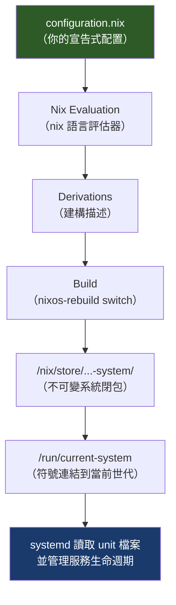
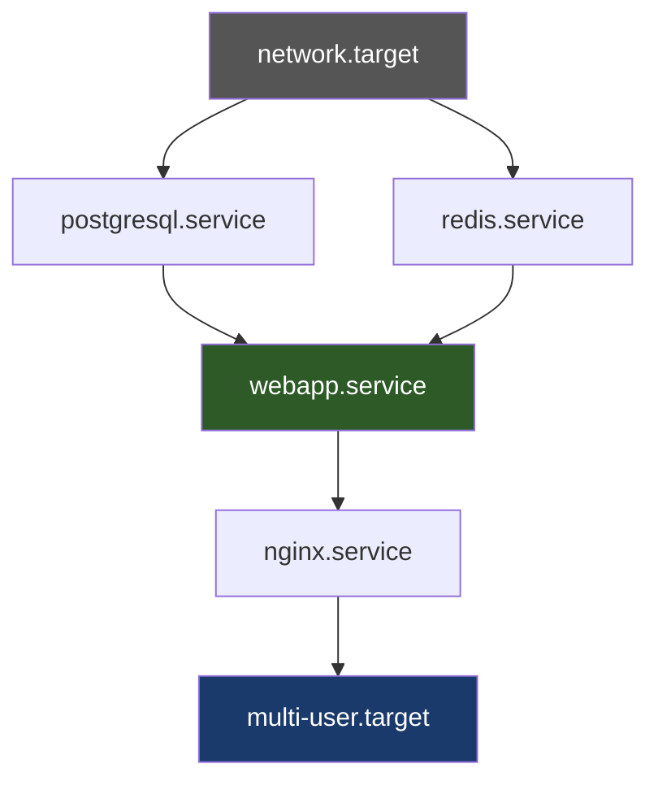

# 第13章：systemd 與服務管理

---

## 本章學習目標

完成本章後，你將能夠：

1. 理解 NixOS 如何透過 Nix 評估（Nix Evaluation）產生 systemd unit 檔案，以及為何這些檔案不可手動修改
2. 使用 `systemd.services` 定義安全、具備重啟策略的自訂服務
3. 使用 `systemd.timers` 取代傳統 cron，享有完整日誌與依賴管理
4. 透過 `systemd.services.<name>` 以宣告式方式覆蓋上游服務的預設值
5. 熟練使用 `journalctl` 過濾、追蹤、分析服務日誌

---

## 前置知識

在開始本章之前，請確認：

- 已完成第三篇（第8–12章），了解 NixOS 模組系統的基本運作方式
- 知道如何執行 `sudo nixos-rebuild switch` 套用配置變更
- 對 Linux 服務有基本認識（知道「服務（service）」是什麼），但不需要熟悉 systemd 細節

---

## 13.1 NixOS 中 systemd 的角色

### systemd 是 NixOS 的 PID 1

在 NixOS 啟動後，第一個執行的程式是 `systemd`。

它負責：

- 管理所有系統服務（service）的啟動、停止、重啟
- 建立服務之間的依賴關係
- 提供排程任務（timer）機制
- 接收並儲存所有服務的日誌（透過 journald）

從使用者的角度來看，你可以用熟悉的指令查看服務狀態：

```bash
# 查看所有服務狀態
systemctl status

# 查看特定服務
systemctl status nginx.service
```

### NixOS 的特色：unit 檔案由 Nix 生成，儲存在 /nix/store/

傳統 Linux 系統中，systemd unit 檔案（如 `/etc/systemd/system/nginx.service`）由套件安裝程式手動放置，也可以由管理員直接修改。

NixOS 完全不同。

在 NixOS 中，所有 systemd unit 檔案都由 Nix 評估過程自動產生，儲存在不可變的 `/nix/store/` 目錄。

例如：

```bash
# 查看 nginx service 實際指向哪裡
systemctl cat nginx.service
```

你會看到類似這樣的輸出：

```
# /nix/store/abc123xyz-system-units/nginx.service
[Unit]
Description=Nginx Web Server
After=network.target

[Service]
Type=forking
ExecStart=/nix/store/def456-nginx-1.26/bin/nginx -c /nix/store/ghi789-nginx-config/nginx.conf
...
```

路徑中的雜湊（hash）值代表這個 unit 是由特定的 Nix 評估結果產生的。

**重要原則：不要手動修改 `/nix/store/` 中的任何檔案。**

原因有兩個：

1. `/nix/store/` 是唯讀的，手動修改會立刻失敗
2. 下次 `nixos-rebuild switch` 後，所有 unit 都會重新生成，手動修改也會消失

正確的做法是：修改 `configuration.nix`，讓 Nix 重新產生 unit 檔案。

### NixOS 如何生成 systemd unit

下圖說明了從 `configuration.nix` 到實際運行的 systemd service 的完整流程：



這個流程的含意是：

- 你只需要關心 `configuration.nix`
- Nix 負責確保 unit 檔案內容正確
- systemd 負責依照 unit 檔案執行服務

---

## 13.2 `systemd.services`：定義自訂服務

### 最小服務定義

讓我們從一個最簡單的範例開始。

以下是一個會每五秒印出 "Hello from NixOS" 的服務：

```nix
{ config, pkgs, lib, ... }:

{
  systemd.services.hello-world = {
    description = "Hello World Service";
    wantedBy = [ "multi-user.target" ];

    serviceConfig = {
      ExecStart = "${pkgs.bash}/bin/bash -c 'while true; do echo Hello from NixOS; sleep 5; done'";
      Restart = "always";
    };
  };

  system.stateVersion = "25.05";
}
```

這個配置說明：

- `description`：服務的人類可讀說明
- `wantedBy = [ "multi-user.target" ]`：系統進入多使用者模式時自動啟動此服務
- `serviceConfig.ExecStart`：服務啟動時執行的指令
- `serviceConfig.Restart = "always"`：服務結束後立刻重啟

套用配置後，可以驗證：

```bash
sudo nixos-rebuild switch

# 檢查服務狀態
systemctl status hello-world.service

# 查看日誌
journalctl -u hello-world.service -f
```

### 使用 `pkgs.writeShellScript` 建立腳本（推薦做法）

直接在 `ExecStart` 中寫 shell 指令雖然可行，但對於較長的腳本，推薦使用 `pkgs.writeShellScript` 建立一個放在 `/nix/store/` 的腳本檔案。

好處是：腳本有固定路徑、可以在 `nix/store` 中被驗證，且指令列不會太長難以閱讀。

```nix
{ config, pkgs, lib, ... }:

let
  helloScript = pkgs.writeShellScript "hello-world-script" ''
    #!/usr/bin/env bash
    set -euo pipefail

    echo "Service started at $(date)"
    while true; do
      echo "Hello from NixOS - $(date)"
      sleep 5
    done
  '';
in
{
  systemd.services.hello-world = {
    description = "Hello World Service（以 pkgs.writeShellScript 建立）";
    wantedBy = [ "multi-user.target" ];
    after = [ "network.target" ];

    serviceConfig = {
      ExecStart = helloScript;
      Restart = "on-failure";
      RestartSec = "3s";
    };
  };

  system.stateVersion = "25.05";
}
```

`pkgs.writeShellScript` 會把腳本放進 `/nix/store/`，確保它的內容和 unit 檔案一起被 Nix 追蹤。

### 完整服務定義結構

一個生產環境中完整的服務定義包含以下欄位：

```nix
{ config, pkgs, lib, ... }:

let
  myAppScript = pkgs.writeShellScript "my-app-start" ''
    #!/usr/bin/env bash
    set -euo pipefail
    echo "Starting my-app..."
    exec ${pkgs.python3}/bin/python3 -m http.server 8080
  '';
in
{
  systemd.services.my-app = {
    # 服務說明（出現在 systemctl status 輸出中）
    description = "My Application - Python HTTP Server";

    # 加入文件連結（選填）
    documentation = [ "https://docs.python.org/3/library/http.server.html" ];

    # 依賴關係與啟動順序
    wantedBy = [ "multi-user.target" ];
    after = [ "network.target" ];
    wants = [ "network.target" ];

    serviceConfig = {
      # 執行身份（不以 root 執行）
      User = "alice";
      Group = "users";

      # 工作目錄
      WorkingDirectory = "/home/alice/app";

      # 執行指令
      ExecStart = myAppScript;

      # 重啟策略
      Restart = "on-failure";
      RestartSec = "5s";

      # 環境變數
      Environment = [
        "PORT=8080"
        "LOG_LEVEL=info"
      ];
    };
  };

  system.stateVersion = "25.05";
}
```

### Type 類型說明

`serviceConfig.Type` 告訴 systemd 如何判斷服務是否啟動完成：

| Type | 說明 | 適用場景 |
|---|---|---|
| `simple` | 預設值；ExecStart 啟動後即視為已啟動 | 前景程式、常駐程式 |
| `forking` | 父程式 fork 後退出，子程式繼續執行 | 傳統 UNIX daemon |
| `oneshot` | 指令執行完畢後服務視為完成（狀態變為 inactive） | 初始化任務、資料庫遷移 |
| `notify` | 服務主動送出 sd_notify 訊號才算啟動完成 | 進階服務（如 nginx、postgresql） |
| `dbus` | 服務在 D-Bus 上取得名稱後才算啟動完成 | D-Bus 服務 |

實際範例：使用 `oneshot` 做一次性初始化任務：

```nix
{ config, pkgs, lib, ... }:

{
  systemd.services.init-app-db = {
    description = "初始化應用程式資料庫";
    wantedBy = [ "multi-user.target" ];
    after = [ "postgresql.service" ];
    requires = [ "postgresql.service" ];

    serviceConfig = {
      Type = "oneshot";
      RemainAfterExit = true;  # 完成後保持 active 狀態，避免重複執行
      User = "postgres";
      ExecStart = "${pkgs.postgresql}/bin/psql -c 'CREATE DATABASE IF NOT EXISTS myapp'";
    };
  };

  system.stateVersion = "25.05";
}
```

### Restart 策略說明

| 策略 | 說明 |
|---|---|
| `no` | 不自動重啟（預設值） |
| `always` | 無論何種原因結束都重啟 |
| `on-failure` | 只在非正常退出（exit code ≠ 0）時重啟 |
| `on-abnormal` | 在 signal 終止、timeout、watchdog 觸發時重啟 |
| `on-success` | 只在正常結束時重啟（少用） |

生產環境建議使用 `on-failure` 搭配合理的 `RestartSec`，避免服務瘋狂重啟耗盡資源。

### 完整範例：執行 Python HTTP 伺服器的自訂服務

以下是一個實際可運行的範例，包含合理的安全設定：

```nix
{ config, pkgs, lib, ... }:

let
  # 使用 pkgs.writeShellScript 建立啟動腳本，放入 /nix/store/
  pythonHttpServer = pkgs.writeShellScript "python-http-server" ''
    #!/usr/bin/env bash
    set -euo pipefail

    SERVE_DIR="''${SERVE_DIR:-/var/lib/http-server}"
    PORT="''${PORT:-8080}"

    echo "[$(date)] Starting Python HTTP server on port $PORT"
    echo "[$(date)] Serving directory: $SERVE_DIR"

    exec ${pkgs.python3}/bin/python3 -m http.server "$PORT" --directory "$SERVE_DIR"
  '';
in
{
  # 確保服務需要的目錄存在
  systemd.services.python-http = {
    description = "Python 靜態檔案 HTTP 伺服器";
    documentation = [ "https://docs.python.org/3/library/http.server.html" ];
    wantedBy = [ "multi-user.target" ];
    after = [ "network.target" ];

    serviceConfig = {
      # 以非 root 使用者執行，提高安全性
      User = "alice";
      Group = "users";

      # 讓 systemd 自動建立並管理 /var/lib/http-server 目錄
      StateDirectory = "http-server";
      StateDirectoryMode = "0755";

      # 執行指令
      ExecStart = pythonHttpServer;

      # 環境變數（可在腳本中讀取）
      Environment = [
        "PORT=8080"
        "SERVE_DIR=/var/lib/http-server"
      ];

      # 重啟策略：只在失敗時重啟，等待 5 秒
      Restart = "on-failure";
      RestartSec = "5s";
      # 最多重啟 3 次，超過後停止嘗試
      StartLimitIntervalSec = "60s";
      StartLimitBurst = 3;
    };
  };

  system.stateVersion = "25.05";
}
```

套用後驗證：

```bash
sudo nixos-rebuild switch

# 確認服務正在執行
systemctl status python-http.service

# 測試 HTTP 回應
curl http://localhost:8080/

# 即時查看日誌
journalctl -u python-http.service -f
```

---

## 13.3 Service Unit 的關鍵欄位

這一節深入說明 `serviceConfig` 中最常用的欄位，以及它們為什麼重要。

### `serviceConfig.User` 與 `serviceConfig.Group`：以非 root 身份執行

**不要以 root 執行服務。**

這是基本的安全原則。若服務被攻擊者利用，以 root 執行的服務可以對整個系統造成破壞；非 root 服務的損害範圍受到限制。

```nix
serviceConfig = {
  User = "alice";
  Group = "users";
};
```

若需要為服務建立專屬的系統使用者（推薦做法），可以在配置中加入：

```nix
{ config, pkgs, lib, ... }:

{
  # 建立專屬系統使用者，不允許登入，沒有家目錄
  users.users.myapp = {
    isSystemUser = true;
    group = "myapp";
    description = "My Application service user";
  };

  users.groups.myapp = {};

  systemd.services.myapp = {
    description = "My Application";
    wantedBy = [ "multi-user.target" ];

    serviceConfig = {
      User = "myapp";
      Group = "myapp";
      ExecStart = "${pkgs.bash}/bin/bash -c 'echo running as $(whoami)'";
    };
  };

  system.stateVersion = "25.05";
}
```

### `serviceConfig.WorkingDirectory`：工作目錄

設定服務程式的工作目錄（current working directory）。

若程式使用相對路徑讀取檔案，這個設定就很重要。

```nix
serviceConfig = {
  User = "alice";
  WorkingDirectory = "/home/alice/app";
  ExecStart = "${pkgs.python3}/bin/python3 server.py";
};
```

若使用 `StateDirectory` 管理資料目錄，可以設定：

```nix
serviceConfig = {
  StateDirectory = "myapp";
  WorkingDirectory = "/var/lib/myapp";
};
```

### `ExecStart`、`ExecStartPre`、`ExecStartPost`

這三個欄位控制服務啟動前後的動作順序：

| 欄位 | 說明 |
|---|---|
| `ExecStartPre` | 在 ExecStart 之前執行；常用於前置檢查或初始化 |
| `ExecStart` | 服務的主要執行指令（必填） |
| `ExecStartPost` | 在 ExecStart 之後執行；常用於啟動後驗證 |

實際範例：

```nix
{ config, pkgs, lib, ... }:

let
  checkConfig = pkgs.writeShellScript "check-config" ''
    #!/usr/bin/env bash
    if [ ! -f /var/lib/myapp/config.toml ]; then
      echo "ERROR: config.toml not found, creating default..."
      cp ${./default-config.toml} /var/lib/myapp/config.toml
    fi
    echo "Config check passed."
  '';
in
{
  systemd.services.myapp = {
    description = "My Application with pre/post hooks";
    wantedBy = [ "multi-user.target" ];

    serviceConfig = {
      User = "alice";
      StateDirectory = "myapp";

      # 啟動前：確認設定檔存在
      ExecStartPre = checkConfig;

      # 主要程式
      ExecStart = "${pkgs.bash}/bin/bash -c 'echo app started'";

      # 啟動後：印出確認訊息
      ExecStartPost = "${pkgs.bash}/bin/bash -c 'echo app is ready'";

      Restart = "on-failure";
    };
  };

  system.stateVersion = "25.05";
}
```

注意：若 `ExecStartPre` 執行失敗（非零退出碼），`ExecStart` 不會執行，服務會進入 failed 狀態。

### `serviceConfig.Environment` 與 `EnvironmentFile`

有兩種方式傳遞環境變數給服務：

**方法一：直接在配置中列出（適合非敏感值）**

```nix
serviceConfig = {
  Environment = [
    "LOG_LEVEL=info"
    "PORT=8080"
    "MAX_CONNECTIONS=100"
  ];
};
```

**方法二：從檔案讀取（適合敏感值，如密碼、API key）**

```nix
serviceConfig = {
  # 這個檔案不由 Nix 管理，需要在部署時手動或透過 secrets 工具放置
  EnvironmentFile = "/run/secrets/myapp-env";
};
```

`EnvironmentFile` 指向的檔案格式為每行一個 `KEY=VALUE`。

搭配 sops-nix 或 agenix（詳見第22章）可以安全地管理這些機密檔案。

### `serviceConfig.RuntimeDirectory` 與 `StateDirectory`

這兩個選項讓 systemd 自動建立和管理服務需要的目錄，不需要手動 `mkdir`：

| 選項 | 目錄位置 | 生命週期 |
|---|---|---|
| `RuntimeDirectory` | `/run/<name>/` | 服務停止後刪除 |
| `StateDirectory` | `/var/lib/<name>/` | 服務停止後保留（持久資料） |
| `CacheDirectory` | `/var/cache/<name>/` | 可清除的快取 |
| `LogsDirectory` | `/var/log/<name>/` | 日誌目錄 |

實際範例：

```nix
serviceConfig = {
  User = "myapp";
  Group = "myapp";

  # 建立 /run/myapp/ 供執行時暫存（如 PID 檔案、Unix socket）
  RuntimeDirectory = "myapp";
  RuntimeDirectoryMode = "0750";

  # 建立 /var/lib/myapp/ 供持久資料（資料庫檔案、上傳的內容）
  StateDirectory = "myapp";
  StateDirectoryMode = "0750";

  ExecStart = "${pkgs.bash}/bin/bash -c 'echo dirs ready'";
};
```

這樣做的好處：目錄的擁有者和權限由 systemd 管理，確保與 `User`/`Group` 設定一致，不需要額外的 `activation.scripts`。

### 安全加固選項（Security Hardening）

以下是最重要的安全加固選項，以及每個選項的具體保護效果：

| 選項 | 說明 | 保護效果 |
|---|---|---|
| `PrivateTmp = true` | 給服務獨立的 `/tmp` 命名空間 | 防止服務讀取其他服務在 /tmp 留下的敏感資料 |
| `ProtectSystem = "strict"` | 將 `/usr`、`/boot`、`/etc` 掛載為唯讀 | 服務無法修改系統檔案 |
| `ProtectHome = true` | 禁止存取 `/home`、`/root`、`/run/user` | 服務無法讀取使用者家目錄 |
| `NoNewPrivileges = true` | 禁止提升權限（如 setuid） | 防止服務透過 setuid 二進位提權 |
| `PrivateNetwork = true` | 給服務獨立的網路命名空間 | 完全隔離網路（謹慎使用，會斷網） |
| `RestrictAddressFamilies` | 限制可使用的 socket 位址族 | 減少網路攻擊面 |
| `SystemCallFilter` | 限制可用的 system call | 降低 kernel exploit 風險 |
| `CapabilityBoundingSet` | 限制服務可保留的 Linux capability | 最小權限原則 |

### 完整範例：一個生產級安全的 Web 服務定義

下面是一個綜合了安全加固選項的完整範例，適合作為生產環境服務的模板：

```nix
{ config, pkgs, lib, ... }:

let
  webappScript = pkgs.writeShellScript "webapp-start" ''
    #!/usr/bin/env bash
    set -euo pipefail

    echo "[$(date)] webapp starting on port $PORT"
    exec ${pkgs.python3}/bin/python3 -m http.server "$PORT" \
      --directory /var/lib/webapp/public
  '';
in
{
  # 建立專屬系統使用者，限制最小權限
  users.users.webapp = {
    isSystemUser = true;
    group = "webapp";
    description = "Web Application Service User";
  };

  users.groups.webapp = {};

  systemd.services.webapp = {
    description = "Production Web Application";
    documentation = [ "https://example.com/docs" ];
    wantedBy = [ "multi-user.target" ];
    after = [ "network.target" "postgresql.service" ];
    wants = [ "network.target" ];

    serviceConfig = {
      # --- 執行身份 ---
      User = "webapp";
      Group = "webapp";
      WorkingDirectory = "/var/lib/webapp";

      # --- 執行指令 ---
      ExecStart = webappScript;

      # --- 環境變數 ---
      Environment = [
        "PORT=8080"
        "NODE_ENV=production"
      ];
      # 敏感設定從 secrets 檔案讀取
      EnvironmentFile = lib.mkIf (builtins.pathExists /run/secrets/webapp-env)
        "/run/secrets/webapp-env";

      # --- 資料目錄（由 systemd 自動建立並設定正確權限）---
      StateDirectory = "webapp";
      StateDirectoryMode = "0750";
      RuntimeDirectory = "webapp";
      RuntimeDirectoryMode = "0750";

      # --- 重啟策略 ---
      Restart = "on-failure";
      RestartSec = "5s";
      StartLimitIntervalSec = "120s";
      StartLimitBurst = 5;

      # --- 安全加固（Security Hardening）---

      # /tmp 隔離：防止讀取其他服務的暫存資料
      PrivateTmp = true;

      # 讓 /usr、/boot、/etc 唯讀：服務無法修改系統檔案
      ProtectSystem = "strict";

      # 禁止存取使用者家目錄
      ProtectHome = true;

      # 禁止透過 setuid 等方式提權
      NoNewPrivileges = true;

      # 禁止建立 device 節點
      PrivateDevices = true;

      # 保護 kernel 設定不被服務修改
      ProtectKernelTunables = true;
      ProtectKernelModules = true;
      ProtectControlGroups = true;

      # 限制可寫入的路徑（只允許寫入自己的資料目錄）
      ReadWritePaths = [ "/var/lib/webapp" "/run/webapp" ];

      # 移除所有不需要的 Linux Capability
      CapabilityBoundingSet = "";

      # 限制 system call（使用 @system-service 白名單）
      SystemCallFilter = "@system-service";
      SystemCallErrorNumber = "EPERM";
    };
  };

  system.stateVersion = "25.05";
}
```

這個範例示範了幾個原則：

1. 專屬系統使用者，不允許登入
2. 資料目錄由 systemd 管理，不需要 `activation.scripts`
3. 敏感設定透過 `EnvironmentFile` 隔離
4. 多層安全加固，每個選項各有明確目的
5. 合理的重啟策略，設定上限防止無限重啟

---

## 13.4 `systemd.timers`：排程任務

### 為什麼用 timer 取代 cron？

傳統 cron 有幾個缺點：

- 日誌分散，不易追蹤執行結果
- 沒有依賴管理（無法等待某個服務啟動後才執行）
- 不保證任務在下次觸發時是否已完成（可能重疊執行）
- 錯過觸發時間後（例如機器關機）不會補執行

systemd timer 的優勢：

- 完整日誌整合（`journalctl -u mytask.service`）
- 支援依賴關係（`requires`、`after`）
- 保證任一時刻只有一個實例在執行（因為對應一個 .service）
- 可設定 `Persistent = true` 在機器開機後補執行錯過的任務

### OnCalendar 語法：日曆觸發

`OnCalendar` 是最常用的觸發方式，格式類似 cron 但更易讀：

| 語法 | 說明 |
|---|---|
| `daily` | 每天午夜 00:00 |
| `hourly` | 每小時整點 |
| `weekly` | 每週一 00:00 |
| `monthly` | 每月 1 日 00:00 |
| `*-*-* 02:00:00` | 每天凌晨 2 點 |
| `Mon *-*-* 08:00:00` | 每週一早上 8 點 |
| `*-*-1,15 00:00:00` | 每月 1 日與 15 日午夜 |
| `Sat,Sun *-*-* 10:00:00` | 週末早上 10 點 |
| `*:0/15` | 每 15 分鐘 |
| `2026-05-18 14:00:00` | 指定特定時間（一次性） |

用指令驗證 OnCalendar 語法是否正確：

```bash
systemd-analyze calendar "Mon *-*-* 08:00:00"
```

輸出會顯示下一次觸發時間，方便確認語法正確。

### OnBootSec 與 OnActiveSec：相對時間觸發

有時不需要在特定時間觸發，而是在啟動後一段時間後觸發：

| 選項 | 說明 |
|---|---|
| `OnBootSec = "5min"` | 系統開機後 5 分鐘 |
| `OnActiveSec = "1h"` | timer 啟動後每 1 小時 |
| `OnUnitActiveSec = "1d"` | 對應的 service 上次執行後 1 天 |

兩者可以組合使用：

```nix
timerConfig = {
  OnBootSec = "10min";    # 開機後 10 分鐘第一次執行
  OnUnitActiveSec = "1h"; # 之後每 1 小時執行一次
};
```

### Timer + Service 組合設計

一個 systemd timer 永遠對應一個同名的 service。

timer 負責「何時啟動」，service 負責「執行什麼」。

```nix
{ config, pkgs, lib, ... }:

{
  # 1. 定義執行任務的 service
  systemd.services.my-backup = {
    description = "每日資料庫備份任務";

    serviceConfig = {
      Type = "oneshot";  # 執行一次就結束，不需要常駐
      User = "alice";
      ExecStart = "${pkgs.bash}/bin/bash -c 'echo Backup done at $(date)'";
    };
  };

  # 2. 定義觸發時間的 timer（名稱必須與 service 相同）
  systemd.timers.my-backup = {
    description = "每日備份排程 Timer";
    wantedBy = [ "timers.target" ];  # 注意：timer 使用 timers.target

    timerConfig = {
      OnCalendar = "daily";
      Persistent = true;  # 若機器在觸發時間關機，開機後補執行
    };
  };

  system.stateVersion = "25.05";
}
```

驗證 timer 狀態：

```bash
# 查看所有 timer
systemctl list-timers

# 查看特定 timer
systemctl status my-backup.timer

# 手動立刻觸發（測試用）
sudo systemctl start my-backup.service
```

### 完整範例：每天凌晨 3 點自動備份資料庫

這個範例展示一個實際的 PostgreSQL 備份任務：

```nix
{ config, pkgs, lib, ... }:

let
  backupScript = pkgs.writeShellScript "postgres-backup" ''
    #!/usr/bin/env bash
    set -euo pipefail

    BACKUP_DIR="/var/lib/backups/postgres"
    DATE=$(date +%Y-%m-%d_%H-%M-%S)
    BACKUP_FILE="$BACKUP_DIR/backup_$DATE.sql.gz"

    # 確保備份目錄存在
    mkdir -p "$BACKUP_DIR"

    echo "[$(date)] 開始備份 PostgreSQL..."

    # 備份所有資料庫
    ${pkgs.postgresql}/bin/pg_dumpall \
      --username=postgres \
      | ${pkgs.gzip}/bin/gzip > "$BACKUP_FILE"

    echo "[$(date)] 備份完成：$BACKUP_FILE"
    echo "[$(date)] 備份檔案大小：$(du -sh $BACKUP_FILE | cut -f1)"

    # 清除 30 天前的備份
    find "$BACKUP_DIR" -name "backup_*.sql.gz" -mtime +30 -delete
    echo "[$(date)] 已清除 30 天前的舊備份"
  '';
in
{
  # 備份 service：類型為 oneshot，執行完就結束
  systemd.services.postgres-backup = {
    description = "PostgreSQL 自動備份";
    requires = [ "postgresql.service" ];
    after = [ "postgresql.service" ];

    serviceConfig = {
      Type = "oneshot";
      User = "postgres";  # 以 postgres 使用者身份執行，有存取資料庫的權限

      # 讓 systemd 建立備份目錄
      StateDirectory = "backups/postgres";
      StateDirectoryMode = "0700";  # 只有 postgres 使用者可讀

      ExecStart = backupScript;

      # 備份任務的安全加固
      PrivateTmp = true;
      ProtectSystem = "strict";
      ReadWritePaths = [ "/var/lib/backups" ];
      NoNewPrivileges = true;
    };
  };

  # 備份 timer：每天凌晨 3 點觸發
  systemd.timers.postgres-backup = {
    description = "PostgreSQL 每日備份排程";
    wantedBy = [ "timers.target" ];

    timerConfig = {
      # 每天凌晨 3 點執行
      OnCalendar = "*-*-* 03:00:00";

      # 為了避免所有機器同時備份（在多機器環境中），
      # 加入最多 10 分鐘的隨機延遲
      RandomizedDelaySec = "10min";

      # 若機器在凌晨 3 點時關機，開機後補執行
      Persistent = true;
    };
  };

  system.stateVersion = "25.05";
}
```

---

## 13.5 Targets 與依賴關係

### NixOS 常見 Target

在 systemd 中，目標（Target）是一個服務群組的概念，用來代表系統達到某個狀態。

| Target | 說明 |
|---|---|
| `sysinit.target` | 最早期初始化（掛載 /proc、/sys 等） |
| `basic.target` | 基本系統就緒（socket、timer 等） |
| `network.target` | 網路配置開始（不保證連線可用） |
| `network-online.target` | 網路真正可用（等待連線就緒） |
| `multi-user.target` | 多使用者命令列環境就緒（類似 runlevel 3） |
| `graphical.target` | 圖形介面就緒（類似 runlevel 5） |
| `timers.target` | 所有 timer 啟動的目標 |
| `sleep.target` | 系統進入睡眠 |
| `shutdown.target` | 系統關機 |

### `wantedBy` vs `requiredBy`：軟依賴 vs 硬依賴

這兩個選項控制「誰需要這個服務」：

| 選項 | 說明 |
|---|---|
| `wantedBy = [ "multi-user.target" ]` | 軟依賴；若此服務啟動失敗，target 仍繼續啟動 |
| `requiredBy = [ "multi-user.target" ]` | 硬依賴；若此服務啟動失敗，target 也停止 |

大多數情況下使用 `wantedBy`。只有在「沒有這個服務，系統就無法正常運作」的情況下才用 `requiredBy`。

### `after` vs `before`：啟動順序

這兩個選項控制「啟動的順序」（但不代表依賴關係）：

```nix
{
  # 我要在 postgresql.service 啟動「之後」才啟動
  after = [ "postgresql.service" "redis.service" ];

  # 我要在 cleanup.service 啟動「之前」先啟動
  before = [ "cleanup.service" ];
}
```

注意：`after` 只控制順序，不代表依賴。若要同時建立依賴關係，需要搭配 `wants` 或 `requires`。

### `wants` vs `requires`：服務間依賴

| 選項 | 說明 |
|---|---|
| `wants = [ "postgresql.service" ]` | 軟依賴；嘗試啟動 postgresql，若失敗此服務仍繼續 |
| `requires = [ "postgresql.service" ]` | 硬依賴；若 postgresql 無法啟動，此服務也停止 |

**常見組合：**

```nix
# 標準的「等待並依賴另一個服務」寫法
after = [ "postgresql.service" ];
requires = [ "postgresql.service" ];
```

這個組合表示：「等 postgresql 啟動後再啟動我，而且 postgresql 若死掉，我也停止。」

### Mermaid 圖：一個 Web 應用服務的依賴鏈



對應的 NixOS 配置片段：

```nix
{ config, pkgs, lib, ... }:

{
  # PostgreSQL 資料庫（由 NixOS 模組管理）
  services.postgresql = {
    enable = true;
    package = pkgs.postgresql_16;
  };

  # Redis 快取（由 NixOS 模組管理）
  services.redis.servers.main = {
    enable = true;
    port = 6379;
  };

  # 自訂 Web 應用程式
  systemd.services.webapp = {
    description = "Web Application";
    wantedBy = [ "multi-user.target" ];

    # 等待資料庫和快取啟動後才啟動
    after = [
      "postgresql.service"
      "redis-main.service"
      "network.target"
    ];

    # 硬依賴：資料庫或快取死掉，webapp 也停止
    requires = [
      "postgresql.service"
      "redis-main.service"
    ];

    serviceConfig = {
      User = "webapp";
      ExecStart = "${pkgs.bash}/bin/bash -c 'echo webapp running'";
      Restart = "on-failure";
    };
  };

  # Nginx 反向代理（等 webapp 啟動後才啟動）
  services.nginx = {
    enable = true;
    recommendedProxySettings = true;
    virtualHosts."example.nixos" = {
      locations."/" = {
        proxyPass = "http://127.0.0.1:8080";
      };
    };
  };

  # 讓 nginx 等待 webapp 啟動
  systemd.services.nginx = {
    after = [ "webapp.service" ];
    wants = [ "webapp.service" ];
  };

  system.stateVersion = "25.05";
}
```

---

## 13.6 Socket Activation

### Socket Activation 的概念

傳統服務啟動方式：服務在開機時就啟動，一直佔用記憶體等待連線。

Socket Activation 的方式：

1. systemd 先建立並監聽 socket（TCP port 或 Unix socket）
2. 實際服務程式不啟動，不佔用記憶體
3. 當有連線進來時，systemd 才真正啟動服務程式
4. 服務程式從 systemd 接過 socket 繼續處理連線

這帶來幾個好處：

- **加快開機速度**：服務不需要在開機時就全部啟動
- **隨需啟動（on-demand）**：長時間沒有使用的服務可以自動停止
- **零停機重啟**：重啟服務時，systemd 繼續持有 socket，不會拒絕新連線

### `systemd.sockets` 定義

在 NixOS 中，`systemd.sockets` 用來定義 socket unit：

```nix
{ config, pkgs, lib, ... }:

{
  # Socket unit：定義要監聽的位址
  systemd.sockets.myapp = {
    description = "My App Unix Socket";
    wantedBy = [ "sockets.target" ];  # socket 使用 sockets.target

    socketConfig = {
      # 監聽 Unix domain socket
      ListenStream = "/run/myapp/myapp.sock";

      # socket 檔案的權限
      SocketMode = "0660";
      SocketUser = "myapp";
      SocketGroup = "myapp";
    };
  };

  # Service unit：由 socket activation 觸發
  systemd.services.myapp = {
    description = "My App Service（由 socket activation 觸發）";

    # 不設定 wantedBy，讓 socket unit 來觸發
    # 但需要宣告對 socket 的依賴
    requires = [ "myapp.socket" ];
    after = [ "myapp.socket" ];

    serviceConfig = {
      Type = "simple";
      User = "myapp";
      Group = "myapp";
      ExecStart = "${pkgs.bash}/bin/bash -c 'echo Socket activated!'";
    };
  };

  # 建立服務專屬使用者
  users.users.myapp = {
    isSystemUser = true;
    group = "myapp";
  };

  users.groups.myapp = {};

  system.stateVersion = "25.05";
}
```

### 完整範例：一個 Unix socket 觸發的服務

以下是一個使用 Unix socket 的 Python WSGI 服務範例：

```nix
{ config, pkgs, lib, ... }:

let
  # 一個接受 Unix socket 的簡單 Python HTTP 服務
  # 在實際環境中，這會是 gunicorn、uwsgi 等 WSGI 伺服器
  wsgiServer = pkgs.writeShellScript "wsgi-server" ''
    #!/usr/bin/env bash
    set -euo pipefail

    SOCKET_FD=3  # systemd 傳遞 socket fd 的預設位置

    echo "[$(date)] WSGI server started via socket activation"
    echo "[$(date)] Listening on socket passed by systemd (fd=$SOCKET_FD)"

    # 在實際應用中，gunicorn 會直接接受 systemd 傳遞的 socket
    # exec ${pkgs.python3Packages.gunicorn}/bin/gunicorn \
    #   --bind unix:/run/wsgi/app.sock \
    #   myapp.wsgi:application
    exec ${pkgs.bash}/bin/bash -c 'echo socket ready'
  '';
in
{
  # 1. 建立系統使用者
  users.users.wsgi = {
    isSystemUser = true;
    group = "wsgi";
    description = "WSGI Application User";
  };

  users.groups.wsgi = {};

  # 2. Socket unit：監聽 Unix socket
  systemd.sockets.wsgi-app = {
    description = "WSGI Application Unix Socket";
    wantedBy = [ "sockets.target" ];

    socketConfig = {
      # 監聽 Unix socket（nginx 可以直接連接）
      ListenStream = "/run/wsgi-app/app.sock";
      SocketMode = "0660";
      SocketUser = "wsgi";

      # 讓 nginx 使用者可以連接此 socket
      SocketGroup = "nginx";
    };
  };

  # 3. Service unit：由 socket activation 觸發
  systemd.services.wsgi-app = {
    description = "WSGI Application Service";
    after = [ "wsgi-app.socket" "network.target" ];
    requires = [ "wsgi-app.socket" ];

    serviceConfig = {
      Type = "simple";
      User = "wsgi";
      Group = "wsgi";

      RuntimeDirectory = "wsgi-app";
      RuntimeDirectoryMode = "0750";

      ExecStart = wsgiServer;

      # 安全加固
      PrivateTmp = true;
      ProtectSystem = "strict";
      ProtectHome = true;
      NoNewPrivileges = true;
      ReadWritePaths = [ "/run/wsgi-app" ];

      Restart = "on-failure";
      RestartSec = "3s";
    };
  };

  # 4. Nginx 透過 Unix socket 代理到 WSGI 服務
  services.nginx = {
    enable = true;
    virtualHosts."app.example.com" = {
      locations."/" = {
        proxyPass = "http://unix:/run/wsgi-app/app.sock";
      };
    };
  };

  system.stateVersion = "25.05";
}
```

---

## 13.7 Service Override（覆蓋上游設定）

### 為什麼需要 override？

NixOS 提供了許多現成的服務模組，例如 `services.nginx.enable = true` 就能啟動一個配置好的 nginx。

但有時候，上游模組的預設設定不符合需求：

- nginx 預設沒有記憶體限制，想加上 `MemoryMax`
- 想為 openssh 追加環境變數
- 想讓某個服務在你的自訂服務啟動「之後」才啟動

在傳統 Linux 中，管理員會用 `systemctl edit` 建立 drop-in 覆蓋檔案。

**在 NixOS 中，不應該使用 `systemctl edit`。**

原因：`systemctl edit` 的修改儲存在 `/etc/systemd/system/` 中，不受 Nix 管理，下次 `nixos-rebuild switch` 後可能失效或產生衝突。

**NixOS 的正確做法：在 `configuration.nix` 中宣告 override。**

### 使用 `systemd.services.<name>` 直接 override

只要在 `systemd.services.<name>` 中設定欄位，NixOS 模組系統會自動合併到上游模組產生的 unit 設定中：

```nix
{ config, pkgs, lib, ... }:

{
  # 啟用上游 nginx 模組
  services.nginx.enable = true;

  # 使用 systemd.services.nginx 覆蓋 nginx 的 unit 設定
  systemd.services.nginx = {
    serviceConfig = {
      # 追加記憶體限制：nginx 最多使用 512MB
      MemoryMax = "512M";

      # 追加 CPU 使用限制
      CPUQuota = "50%";
    };
  };

  system.stateVersion = "25.05";
}
```

NixOS 模組系統會將你寫的 `systemd.services.nginx` 與上游模組的設定合併（merge），不會覆蓋掉上游已有的設定，只會追加或覆蓋你明確指定的欄位。

### 追加環境變數

```nix
{ config, pkgs, lib, ... }:

{
  services.nginx.enable = true;

  # 為 nginx 追加環境變數
  systemd.services.nginx = {
    environment = {
      # 這些環境變數會傳入 nginx 程式
      MY_CUSTOM_VAR = "hello";
      TZ = "Asia/Taipei";
    };
  };

  system.stateVersion = "25.05";
}
```

### 追加依賴關係

```nix
{ config, pkgs, lib, ... }:

{
  services.nginx.enable = true;

  # 讓 nginx 等待自訂服務啟動後才啟動
  systemd.services.nginx = {
    after = [ "webapp.service" ];
    wants = [ "webapp.service" ];
  };

  system.stateVersion = "25.05";
}
```

注意：`after` 和 `wants` 都是列表型別，NixOS 模組系統會將你的列表與上游列表合併，不會覆蓋。

### 完整範例：為 nginx 追加記憶體限制和環境變數

以下範例展示如何在不修改 `services.nginx` 本身設定的前提下，透過 `systemd.services.nginx` 追加資源限制：

```nix
{ config, pkgs, lib, ... }:

{
  services.nginx = {
    enable = true;
    recommendedGzipSettings = true;
    recommendedOptimisation = true;

    virtualHosts."alice.nixos" = {
      root = "/var/www/alice";
      locations."/" = {
        index = "index.html";
      };
    };
  };

  # 透過 systemd.services.nginx 追加 unit 設定
  # 這些設定會與上游模組產生的設定合併
  systemd.services.nginx = {
    serviceConfig = {
      # 記憶體限制：超過 256MB 時 OOM killer 會終止此服務
      MemoryMax = "256M";

      # 記憶體軟限制：超過時開始積極回收記憶體
      MemoryHigh = "200M";

      # CPU 限制：最多使用 80% 的單核心時間
      CPUQuota = "80%";

      # 重啟策略（覆蓋上游預設值）
      Restart = lib.mkForce "on-failure";
      RestartSec = "3s";
    };

    # 追加環境變數（不影響上游已設定的環境變數）
    environment = {
      TZ = "Asia/Taipei";
    };

    # 追加日誌標籤，方便在 journald 中過濾
    serviceConfig.SyslogIdentifier = "nginx-custom";
  };

  # 確認設定是否正確套用
  # 套用後可執行：systemctl cat nginx.service
  # 查看合併後的完整 unit 設定

  system.stateVersion = "25.05";
}
```

套用後驗證：

```bash
sudo nixos-rebuild switch

# 查看合併後的 nginx unit 設定（應包含 MemoryMax 等新增的欄位）
systemctl cat nginx.service

# 確認記憶體限制是否生效
systemctl show nginx.service | grep Memory
```

### 注意：`lib.mkForce` 的用途

若要真正覆蓋（而非追加）上游設定的某個欄位，使用 `lib.mkForce`：

```nix
serviceConfig = {
  # 強制覆蓋上游的 Restart 設定
  Restart = lib.mkForce "always";
};
```

沒有 `lib.mkForce` 時，若上游模組和你的設定都設定了同一個純量（scalar）欄位，NixOS 會報錯（option conflict）。加上 `lib.mkForce` 表示「我明確知道要覆蓋，優先採用我的值。」

---

## 13.8 journalctl 使用方式

### 基本查看

`journalctl` 是查看 systemd journal（日誌）的主要工具。

以下是最常用的基本指令：

```bash
# 查看特定服務的所有日誌
journalctl -u nginx.service

# 查看最新的 100 行
journalctl -u nginx.service -n 100

# 從最新的日誌開始顯示（預設從最舊開始）
journalctl -u nginx.service -r
```

### 即時追蹤日誌

```bash
# 即時追蹤 nginx 日誌（類似 tail -f）
journalctl -u nginx.service -f

# 同時追蹤多個服務
journalctl -u nginx.service -u webapp.service -f
```

### 按時間過濾

```bash
# 最近 2 小時的日誌
journalctl -u nginx.service --since "2 hours ago"

# 指定時間區間
journalctl -u nginx.service --since "2026-05-18 09:00" --until "2026-05-18 12:00"

# 今天的日誌
journalctl -u nginx.service --since today

# 昨天的日誌
journalctl -u nginx.service --since yesterday --until today
```

### 按優先級過濾（錯誤篩選）

systemd 日誌有八個優先級，對應 syslog 標準：

| 優先級代號 | 數字 | 說明 |
|---|---|---|
| `emerg` | 0 | 系統不可用 |
| `alert` | 1 | 需要立即處理 |
| `crit` | 2 | 嚴重錯誤 |
| `err` | 3 | 錯誤 |
| `warning` | 4 | 警告 |
| `notice` | 5 | 正常但重要的訊息 |
| `info` | 6 | 一般資訊 |
| `debug` | 7 | 除錯訊息 |

```bash
# 只顯示 err 及以上的訊息（emerg、alert、crit、err）
journalctl -u nginx.service -p err

# 只顯示 warning 及以上
journalctl -u nginx.service -p warning

# 只顯示 debug 及以上（等同顯示全部）
journalctl -p debug

# 查看整個系統最近的錯誤
journalctl -p err --since "1 hour ago"
```

### 結構化日誌輸出

```bash
# 以 JSON 格式輸出（每行一個 JSON 物件）
journalctl -u nginx.service -o json

# 以易讀的 JSON 格式輸出（適合人工閱讀）
journalctl -u nginx.service -o json-pretty

# 簡短格式（預設）
journalctl -u nginx.service -o short

# 顯示完整訊息（不截斷長行）
journalctl -u nginx.service -o cat
```

JSON 格式的輸出可以搭配 `jq` 進行進一步分析：

```bash
# 只取出訊息欄位
journalctl -u nginx.service -o json | jq -r '.MESSAGE'

# 過濾特定欄位
journalctl -u nginx.service -o json \
  | jq -r 'select(.__REALTIME_TIMESTAMP != null) | [.__REALTIME_TIMESTAMP, .MESSAGE] | @tsv'
```

### journald 配置：`services.journald.extraConfig`

透過 `services.journald.extraConfig`，可以調整 journald 的行為：

```nix
{ config, pkgs, lib, ... }:

{
  services.journald.extraConfig = ''
    # 限制日誌最大佔用磁碟空間（預設為磁碟容量的 10%）
    SystemMaxUse=1G

    # 限制單一 journal 檔案大小
    SystemMaxFileSize=100M

    # 保留日誌的最長時間（預設為 1 個月）
    MaxRetentionSec=3month

    # 壓縮日誌（節省空間）
    Compress=yes

    # 限制 journal 的 rate limiting（防止日誌爆炸）
    RateLimitIntervalSec=30s
    RateLimitBurst=10000

    # 轉送日誌到 syslog（若有安裝 syslog daemon）
    # ForwardToSyslog=yes
  '';

  system.stateVersion = "25.05";
}
```

常見的調整情境：

| 情境 | 建議設定 |
|---|---|
| 磁碟空間有限的小型 VPS | `SystemMaxUse=200M` |
| 高流量伺服器，日誌量大 | 加大 `RateLimitBurst` |
| 需要長期保留稽核日誌 | `MaxRetentionSec=1year` |
| 生產環境，想要轉發到集中日誌系統 | `ForwardToSyslog=yes` |

查看 journald 目前的磁碟使用量：

```bash
journalctl --disk-usage
```

清除舊日誌：

```bash
# 清除 2 週前的日誌
sudo journalctl --vacuum-time=2weeks

# 保留最新的 500MB 日誌
sudo journalctl --vacuum-size=500M
```

---

## 本章小結

本章涵蓋了 NixOS 中 systemd 服務管理的完整基礎。讓我們回顧幾個核心要點：

### 重要原則回顧

1. **不手動修改 `/nix/store/`** 和 **不使用 `systemctl edit`**

   NixOS 中所有的 systemd 設定都應該寫在 `configuration.nix`。手動修改會在下次 `nixos-rebuild switch` 後消失或產生衝突。

2. **以非 root 身份執行服務**

   使用 `serviceConfig.User` 搭配 `users.users.<name>.isSystemUser = true` 建立最小權限的服務帳號。

3. **資料目錄讓 systemd 管理**

   使用 `StateDirectory`、`RuntimeDirectory` 而非手動 `mkdir`，讓目錄的建立和權限設定自動化。

4. **timer 取代 cron**

   `systemd.timers` 提供更好的日誌、依賴管理和補執行機制。

5. **分層安全加固**

   從 `PrivateTmp`、`ProtectSystem`、`NoNewPrivileges` 開始，逐步加強服務的隔離。

### 本章涉及的主要選項

| 選項 | 說明 |
|---|---|
| `systemd.services.<name>` | 定義或 override systemd service unit |
| `systemd.timers.<name>` | 定義 systemd timer unit |
| `systemd.sockets.<name>` | 定義 socket activation 的 socket unit |
| `services.journald.extraConfig` | 調整 journald 設定 |

### 練習題

1. 建立一個每分鐘將系統負載（load average）寫入 `/var/log/sysload.log` 的 timer + service 組合。
2. 修改 `services.sshd` 的 systemd unit，加入 `MemoryMax = "128M"` 的限制。
3. 為你在 13.2 建立的 `python-http` 服務加入完整的安全加固選項，並確認 `systemctl status` 顯示 active。
4. 使用 `journalctl` 找出系統最近 24 小時內出現過 `err` 等級以上的所有服務，並整理成清單。

### 下一章預覽

第14章將介紹 NixOS 常見服務模組，包括 OpenSSH、Docker、PostgreSQL、Nginx 等。

這些服務的底層都是本章學到的 systemd 機制，但 NixOS 透過高階模組提供了更方便的宣告式介面。學完本章後，你將能夠理解這些模組在 systemd 層面上做了什麼，以及如何用本章技術進行客製化。
