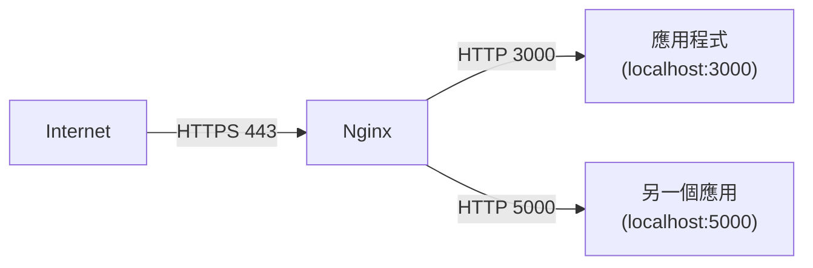
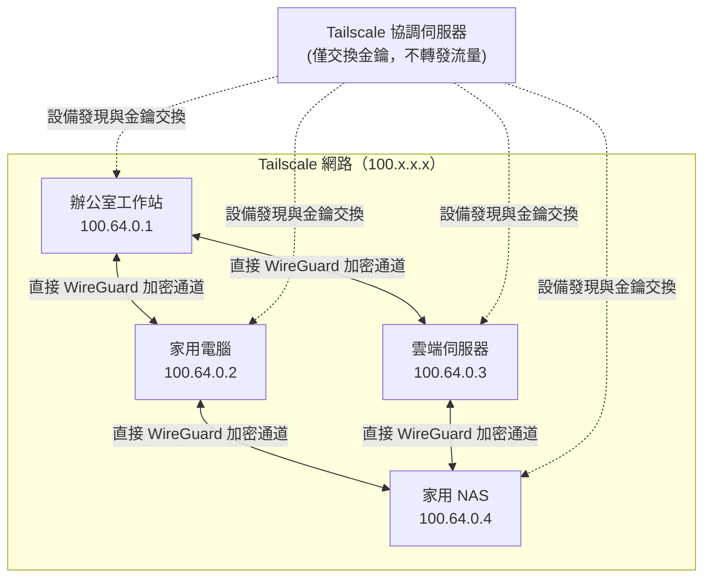
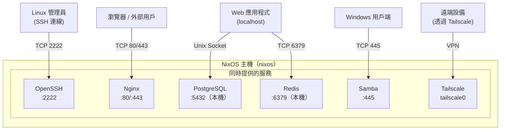

# 第14章：常見服務模組

---

## 本章學習目標

完成本章後，你將能夠：

1. 啟用 OpenSSH 並套用嚴格的安全配置，禁用密碼登入與 root 遠端存取
2. 以 Docker 或 Podman 建立容器化環境，理解兩者的安全差異並選用適當方案
3. 用 NixOS 宣告式 API（`ensureDatabases`、`ensureUsers`）配置 PostgreSQL，取代傳統手動建立資料庫的作法
4. 設定 Nginx 作為靜態網站伺服器與反向代理，並整合 Let's Encrypt 自動申請 HTTPS 憑證
5. 部署 Redis、Tailscale、Samba 等常用基礎服務，並驗證每個服務確實正常運作

---

## 前置知識

在進入本章之前，請確認你已具備以下基礎：

- 完成第13章，理解 NixOS 如何透過 `systemd` 管理服務生命週期
- 能夠執行 `sudo nixos-rebuild switch` 並讀懂 build 錯誤訊息
- 了解基本的 Nix 語法：attribute set、list、字串插值
- 知道如何使用 `systemctl status <service>` 查看服務狀態
- 具備基本的 Linux 網路概念：TCP 連接埠（port）、防火牆（firewall）、localhost

---

## 本章服務總覽

本章涵蓋 8 種最常見的 NixOS 服務模組：

| 服務 | 用途 | NixOS 選項前綴 |
|---|---|---|
| OpenSSH | 安全遠端登入 | `services.openssh` |
| Docker | 容器化環境（傳統 root 模式） | `virtualisation.docker` |
| Podman | 容器化環境（rootless 設計） | `virtualisation.podman` |
| PostgreSQL | 關聯式資料庫 | `services.postgresql` |
| Nginx | Web 伺服器與反向代理 | `services.nginx` |
| Redis | 記憶體快取資料庫 | `services.redis` |
| Tailscale | 零配置 VPN 網格 | `services.tailscale` |
| Samba | Windows 網路共享（SMB）| `services.samba` |

每個服務都遵循相同的學習節奏：

1. 最小啟用配置
2. 安全強化選項
3. 完整實用範例
4. 驗證服務正常運作

---

## 14.1 OpenSSH：安全遠端存取

### 為什麼需要 OpenSSH？

SSH（Secure Shell）是管理遠端 Linux 伺服器的標準協定。

在傳統 Linux 中，你需要：

```bash
sudo apt install openssh-server
sudo vim /etc/ssh/sshd_config
sudo systemctl restart ssh
```

而且每次改設定都要記得重啟服務，改完還要手動確認設定有沒有寫錯。

在 NixOS 中，SSH 配置是宣告式的：

改一次 `configuration.nix`，執行 `nixos-rebuild switch`，設定就生效了。沒有「我忘了改某個地方」的問題。

---

### 最小啟用：一行開啟 SSH

以下是最簡單的啟用方式：

```nix
{ config, pkgs, lib, ... }:

{
  services.openssh.enable = true;

  system.stateVersion = "25.05";
}
```

這一行做了什麼？

- 安裝 `openssh` 套件
- 建立 `/etc/ssh/sshd_config`（由 NixOS 模組生成）
- 啟用並啟動 `sshd.service` systemd 服務
- 預設監聽 TCP 連接埠 22

但這只是「能用」，還不是「安全的」。

---

### 安全強化配置

預設的 SSH 配置允許密碼登入，這對暴露在公網的伺服器是危險的。

以下是針對初學者最重要的三個安全設定：

1. **禁用密碼登入**：強制使用 SSH 公鑰（public key）認證
2. **禁止 root 登入**：即使攻擊者猜到密碼，也無法直接取得 root 權限
3. **限制允許的使用者**：只有明確列出的使用者才能透過 SSH 登入

```nix
{ config, pkgs, lib, ... }:

{
  services.openssh = {
    enable = true;

    # 監聽在非標準連接埠，可減少自動化掃描攻擊的干擾
    # 注意：這是「安全透過隱匿」，不能取代其他安全措施
    ports = [ 2222 ];

    settings = {
      # NixOS 25.05 新語法：使用 settings 區塊集中管理 sshd_config 選項

      # 禁止 root 使用者透過 SSH 登入
      PermitRootLogin = "no";

      # 禁用密碼認證，強制使用公鑰
      PasswordAuthentication = false;

      # 禁用鍵盤互動認證（包含 PAM 密碼提示）
      KbdInteractiveAuthentication = false;
    };

    # 只允許 alice 使用者透過 SSH 登入
    # 這個選項對應 sshd_config 的 AllowUsers
    allowedUsers = [ "alice" ];
  };

  # 開放防火牆，允許外部連線到我們指定的 SSH 連接埠
  networking.firewall.allowedTCPPorts = [ 2222 ];

  # alice 必須有 SSH 公鑰才能登入
  users.users.alice = {
    isNormalUser = true;
    extraGroups = [ "wheel" ];
    # 將你的 SSH 公鑰貼在這裡
    openssh.authorizedKeys.keys = [
      "ssh-ed25519 AAAA...你的公鑰內容... alice@workstation"
    ];
  };

  system.stateVersion = "25.05";
}
```

> **重要提醒**：在關閉密碼登入（`PasswordAuthentication = false`）之前，請先確認你的公鑰已正確設定，否則你可能會把自己鎖在門外。

---

### NixOS 25.05 的語法改變

在較舊版本的 NixOS 中，SSH 設定是這樣寫的：

```nix
# 舊語法（NixOS 24.05 之前）
services.openssh.passwordAuthentication = false;
services.openssh.permitRootLogin = "no";
```

從 NixOS 25.05 開始，統一改用 `settings` 區塊，選項名稱和 `sshd_config` 保持一致：

```nix
# 新語法（NixOS 25.05）
services.openssh.settings = {
  PasswordAuthentication = false;
  PermitRootLogin = "no";
};
```

如果你在網路上看到舊語法，不要混用，否則可能出現 `option ... has been renamed` 的警告甚至錯誤。

---

### 驗證 SSH 服務正常運作

套用配置後，執行以下指令確認服務狀態：

```bash
# 確認 sshd 服務正在運行
systemctl status sshd

# 確認服務監聽在正確的連接埠
ss -tlnp | grep sshd

# 從同一台機器測試 SSH 連線
ssh -p 2222 alice@localhost

# 查看 SSH 連線的詳細日誌
journalctl -u sshd -f
```

成功連線後，你應該會看到類似以下的輸出：

```
● sshd.service - SSH Daemon
     Loaded: loaded (/etc/systemd/system/sshd.service)
     Active: active (running)
```

---

## 14.2 Docker：容器化環境

### Docker 在 NixOS 中的工作原理

Docker（容器化平台）讓你可以將應用程式及其依賴打包成可攜式映像（image）。

在 NixOS 上啟用 Docker 非常簡單，但有一個**重要的安全概念**必須先理解，再動手配置。

---

### 最小啟用

```nix
{ config, pkgs, lib, ... }:

{
  virtualisation.docker.enable = true;

  system.stateVersion = "25.05";
}
```

套用後，Docker daemon（背景服務程序）就會啟動。

---

### 安全警告：docker 群組等同 root 權限

這是初學者最容易忽略的陷阱。

如果你把使用者加入 `docker` 群組：

```nix
users.users.alice = {
  isNormalUser = true;
  extraGroups = [ "wheel" "docker" ];  # 危險！
};
```

表面上 alice 不需要 `sudo` 就能執行 `docker` 指令。

但實際上，**docker 群組的成員可以透過掛載（mount）主機目錄來取得完整的 root 存取權**：

```bash
# alice 可以執行這個指令，把整個主機根目錄掛進容器
docker run -v /:/host --rm -it ubuntu chroot /host
# 這樣就取得了主機的 root shell！
```

因此，官方建議：

- **不信任的使用者不應加入 docker 群組**
- **伺服器環境應考慮使用 rootless 模式**

---

### Rootless 模式：更安全的選擇

Rootless Docker（無 root 守護程序模式）讓 Docker daemon 在一般使用者的權限下運行，不需要 root。

```nix
{ config, pkgs, lib, ... }:

{
  # 關閉傳統 root docker，改用 rootless 模式
  virtualisation.docker.rootless = {
    enable = true;

    # 讓 alice 的 rootless docker 隨登入自動啟動
    setSocketVariable = true;
  };

  users.users.alice = {
    isNormalUser = true;
    extraGroups = [ "wheel" ];
    # 注意：rootless 模式不需要加入 docker 群組
  };

  # 安裝 docker CLI 供命令列使用
  environment.systemPackages = with pkgs; [
    docker
    docker-compose
  ];

  system.stateVersion = "25.05";
}
```

> **何時用傳統模式，何時用 rootless？**
> - **個人開發機**：rootless 模式，安全且方便
> - **單一管理員的伺服器**：加入 docker 群組（知道風險）
> - **多人共用的伺服器**：強烈建議 rootless，或改用 Podman

---

### Docker Compose 整合

Docker Compose（多容器編排工具）讓你用一個 YAML 檔管理多個相互關聯的容器。

在 NixOS 中，直接把 `docker-compose` 加入系統套件：

```nix
{ config, pkgs, lib, ... }:

{
  virtualisation.docker.enable = true;

  environment.systemPackages = with pkgs; [
    docker-compose
  ];

  users.users.alice = {
    isNormalUser = true;
    extraGroups = [ "wheel" "docker" ];
  };

  system.stateVersion = "25.05";
}
```

---

### 宣告式容器管理：oci-containers

NixOS 提供了比 `docker-compose` 更宣告式的方式：`virtualisation.oci-containers`。

這個選項讓你直接在 `configuration.nix` 中定義要跑哪些容器，NixOS 會自動建立對應的 systemd 服務。

以下範例展示如何宣告式部署一個 Nginx 容器：

```nix
{ config, pkgs, lib, ... }:

{
  virtualisation.docker.enable = true;

  # 宣告式容器管理：不需要 docker-compose
  virtualisation.oci-containers = {
    # 使用 Docker 作為容器後端
    backend = "docker";

    containers = {
      # 定義一個名為 "webserver" 的容器
      webserver = {
        image = "nginx:1.27-alpine";

        # 將主機的 8080 連接埠映射到容器的 80 連接埠
        ports = [ "8080:80" ];

        # 將主機目錄掛載到容器內
        volumes = [
          "/var/www/html:/usr/share/nginx/html:ro"
        ];

        # 容器環境變數
        environment = {
          NGINX_HOST = "localhost";
        };

        # 容器退出後自動重啟
        autoStart = true;
      };
    };
  };

  # 允許外部連線到 8080 連接埠
  networking.firewall.allowedTCPPorts = [ 8080 ];

  system.stateVersion = "25.05";
}
```

套用配置後，NixOS 會自動建立並啟動 `docker-webserver.service`。

驗證方式：

```bash
# 查看容器狀態
docker ps

# 查看對應的 systemd 服務
systemctl status docker-webserver

# 測試 HTTP 回應
curl http://localhost:8080
```

---

## 14.3 Podman：rootless 容器

### 為什麼 Podman 比 Docker 更安全？

Podman（無守護程序容器工具）和 Docker 的最大差異在於架構設計：

| 特性 | Docker | Podman |
|---|---|---|
| 架構 | 需要 root daemon（dockerd）| 無 daemon，直接 fork/exec |
| 預設執行身份 | root | 目前使用者（rootless） |
| 安全性 | 需要額外設定 | 設計上即為安全 |
| Docker CLI 相容性 | 是（本身） | 是（透過 alias 或相容模式）|
| systemd 整合 | 有限 | 原生支援 |

簡單說：

Podman 的每個容器以一般使用者的身份執行，就算容器被攻破，攻擊者也只取得有限的使用者權限，不是 root。

---

### 啟用 Podman

```nix
{ config, pkgs, lib, ... }:

{
  virtualisation.podman = {
    enable = true;

    # 讓 podman 指令同時作為 docker 的替代品
    # 啟用後，執行 docker 指令會自動轉到 podman
    dockerCompat = true;

    # 啟用 podman 的網路支援（需要 DNS）
    defaultNetwork.settings.dns_enabled = true;
  };

  users.users.alice = {
    isNormalUser = true;
    extraGroups = [ "wheel" ];
    # Podman 不需要特殊群組
  };

  system.stateVersion = "25.05";
}
```

---

### 使用 oci-containers 搭配 Podman

`virtualisation.oci-containers` 支援 Podman 作為後端，只需更改 `backend` 設定。

以下範例宣告式部署一個 Redis 容器：

```nix
{ config, pkgs, lib, ... }:

{
  virtualisation.podman = {
    enable = true;
    dockerCompat = true;
    defaultNetwork.settings.dns_enabled = true;
  };

  virtualisation.oci-containers = {
    # 切換後端為 podman
    backend = "podman";

    containers = {
      # 部署 Redis 快取服務
      redis-cache = {
        image = "redis:7.4-alpine";

        # 只綁定在 localhost，不對外暴露
        ports = [ "127.0.0.1:6379:6379" ];

        # 持久化 Redis 資料到主機目錄
        volumes = [
          "/var/lib/redis-oci:/data"
        ];

        # 啟用 Redis 持久化並設定密碼
        cmd = [
          "redis-server"
          "--requirepass" "changeme_use_a_real_password"
          "--save" "60" "1"
        ];

        autoStart = true;
      };
    };
  };

  system.stateVersion = "25.05";
}
```

驗證 Podman 容器：

```bash
# 查看正在執行的容器（podman 指令或 docker 別名都可以）
podman ps

# 查看 systemd 服務狀態
systemctl status podman-redis-cache

# 測試 Redis 連線（需要安裝 redis 套件）
redis-cli -a changeme_use_a_real_password ping
# 預期輸出：PONG
```

---

### 選擇 Docker 還是 Podman？

```
是否在多人共用的系統？
│
├─ 是 → 使用 Podman（rootless 更安全）
│
└─ 否 → 只有你一個管理員？
         │
         ├─ 是 → Docker 或 Podman 都可以
         │
         └─ 需要和現有 Docker Compose 工作流整合？
                  │
                  ├─ 是 → Docker（相容性更好）
                  │
                  └─ 否 → Podman（更現代、更安全）
```

---

## 14.4 PostgreSQL：資料庫配置

### NixOS 的宣告式資料庫管理

在傳統 Linux 系統上配置 PostgreSQL 通常需要：

```bash
sudo -u postgres psql
CREATE DATABASE myapp;
CREATE USER myapp WITH PASSWORD 'secret';
GRANT ALL PRIVILEGES ON DATABASE myapp TO myapp;
```

這些步驟是「命令式」的：你告訴系統「現在執行這些指令」。

NixOS 提供了宣告式的替代方案：`ensureDatabases` 和 `ensureUsers`。

你只需要**描述資料庫和使用者應該存在**，NixOS 在每次系統啟動時會自動確保狀態正確。

---

### 啟用 PostgreSQL

以下是啟用 PostgreSQL 的最小配置：

```nix
{ config, pkgs, lib, ... }:

{
  services.postgresql = {
    enable = true;

    # 明確指定 PostgreSQL 版本
    # 不指定的話，NixOS 會使用預設版本，但升級時可能會需要手動遷移資料
    package = pkgs.postgresql_16;
  };

  system.stateVersion = "25.05";
}
```

---

### 完整配置：宣告式建立資料庫與使用者

以下範例展示如何用 NixOS 的宣告式 API 建立 `myapp` 資料庫和對應的使用者：

```nix
{ config, pkgs, lib, ... }:

{
  services.postgresql = {
    enable = true;
    package = pkgs.postgresql_16;

    # NixOS 特有的宣告式 API：
    # 確保這些資料庫在系統啟動時存在，如果不存在就自動建立
    ensureDatabases = [
      "myapp"
      "myapp_test"  # 開發用的測試資料庫
    ];

    # 確保這些使用者存在
    ensureUsers = [
      {
        name = "myapp";
        # 確保 myapp 使用者對 myapp 資料庫有完整存取權限
        ensureDBOwnership = true;
      }
      {
        name = "alice";
        # alice 使用者可以建立資料庫（方便開發用途）
        ensureClauses.createdb = true;
      }
    ];

    # 認證規則（對應 pg_hba.conf 的設定）
    # 允許本地 Unix socket 連線使用 peer 認證（以系統使用者身份登入）
    # 允許本地 TCP 連線使用 md5 密碼認證
    authentication = pkgs.lib.mkOverride 10 ''
      # TYPE  DATABASE        USER            ADDRESS                 METHOD
      local   all             all                                     peer
      host    all             all             127.0.0.1/32            md5
      host    all             all             ::1/128                 md5
    '';

    # 初始化腳本：只在資料庫第一次建立時執行
    # 適合插入初始測試資料或建立 schema
    initialScript = pkgs.writeText "postgresql-init.sql" ''
      -- 設定 myapp 使用者的密碼
      -- 注意：在生產環境應使用 secrets 管理工具（如 agenix 或 sops-nix）
      ALTER USER myapp WITH PASSWORD 'dev_password_change_in_production';
    '';
  };

  system.stateVersion = "25.05";
}
```

> **為什麼 `ensureDatabases` 比手動 `createdb` 更好？**
>
> `ensureDatabases` 是**冪等（idempotent）**的：不管執行幾次，結果都一樣。
> 資料庫已存在時它不會重新建立，也不會覆蓋現有資料。
> 這符合 NixOS 的宣告式哲學：描述「應該是什麼狀態」，而不是「執行什麼步驟」。

---

### 驗證 PostgreSQL 服務

```bash
# 確認 PostgreSQL 服務正在運行
systemctl status postgresql

# 以 postgres 超級使用者身份連線
sudo -u postgres psql

# 查看所有資料庫
\l

# 查看所有使用者
\du

# 以 myapp 使用者連線到 myapp 資料庫
psql -U myapp -d myapp -h 127.0.0.1

# 查看 PostgreSQL 日誌
journalctl -u postgresql -f
```

---

### 使用者密碼管理的注意事項

`ensureUsers` 選項可以確保使用者存在，但**無法透過宣告式設定密碼**。

密碼設定有以下幾種做法：

| 做法 | 適用場景 | 安全性 |
|---|---|---|
| `initialScript` | 開發/測試環境 | 低（密碼明文在 Nix store）|
| `agenix` + `initialScript` | 生產環境 | 高（secrets 加密管理）|
| 手動 `ALTER USER` | 臨時調整 | 中（不在 Git 追蹤中）|

生產環境的密碼管理請參考第22章（Secrets 管理）。

---

## 14.5 Nginx：Web 服務與反向代理

### Nginx 在 NixOS 的角色

Nginx（高效能 Web 伺服器與反向代理）在 NixOS 中最常見的兩種用途：

1. **靜態網站服務**：直接提供 HTML、CSS、JS 等靜態檔案
2. **反向代理（Reverse Proxy）**：接收外部請求，轉發給背後的應用程式（如 Node.js、Django、Rails）

反向代理的架構如下：



---

### 最小啟用

```nix
{ config, pkgs, lib, ... }:

{
  services.nginx.enable = true;

  networking.firewall.allowedTCPPorts = [ 80 ];

  system.stateVersion = "25.05";
}
```

---

### 靜態網站服務

`services.nginx.virtualHosts` 讓你為每個網域定義獨立的虛擬主機（virtual host）：

```nix
{ config, pkgs, lib, ... }:

{
  services.nginx = {
    enable = true;

    # 全域 Nginx 設定
    recommendedGzipSettings = true;
    recommendedOptimisation = true;
    recommendedProxySettings = true;
    recommendedTlsSettings = true;

    virtualHosts = {
      # 定義 "example.com" 的虛擬主機
      "example.com" = {
        # 提供靜態檔案的根目錄
        root = "/var/www/example.com";

        # 設定 location 規則
        locations = {
          "/" = {
            # 嘗試找到對應的靜態檔案
            tryFiles = "$uri $uri/ =404";
          };
        };
      };
    };
  };

  networking.firewall.allowedTCPPorts = [ 80 ];

  system.stateVersion = "25.05";
}
```

---

### 反向代理配置

假設你有一個 Node.js 應用程式跑在 `localhost:3000`，以下配置讓 Nginx 代理到這個應用程式：

```nix
{ config, pkgs, lib, ... }:

{
  services.nginx = {
    enable = true;

    recommendedGzipSettings = true;
    recommendedOptimisation = true;
    recommendedProxySettings = true;
    recommendedTlsSettings = true;

    virtualHosts = {
      "app.example.com" = {
        locations = {
          # 所有請求都代理到本地的 3000 連接埠
          "/" = {
            proxyPass = "http://127.0.0.1:3000";

            # WebSocket 支援（現代 Web 應用常常需要）
            proxyWebsockets = true;

            # 傳遞原始請求的 Host、IP 資訊給後端應用
            extraConfig = ''
              proxy_set_header Host $host;
              proxy_set_header X-Real-IP $remote_addr;
              proxy_set_header X-Forwarded-For $proxy_add_x_forwarded_for;
              proxy_set_header X-Forwarded-Proto $scheme;
            '';
          };

          # 靜態資源直接由 Nginx 提供，不走代理
          "/static/" = {
            root = "/var/www/app/public";
          };
        };
      };
    };
  };

  networking.firewall.allowedTCPPorts = [ 80 ];

  system.stateVersion = "25.05";
}
```

---

### HTTPS：整合 Let's Encrypt 自動憑證

Let's Encrypt 提供免費的 SSL/TLS 憑證（數位憑證，用於加密 HTTPS 連線）。

NixOS 透過 `security.acme` 模組整合 Let's Encrypt 的 ACME（自動憑證管理環境）協定。

> **重要前提**：ACME 驗證需要：
> 1. 一個真實的網域名稱（domain name），且 DNS 指向你的伺服器
> 2. **開放 TCP 80 和 443 連接埠**給外部存取
> 3. 伺服器能夠對外連線到 Let's Encrypt 的服務

在本機或 VM 環境中，這些條件通常不成立，因此 HTTPS 設定只適用於有公網 IP 的伺服器。

```nix
{ config, pkgs, lib, ... }:

{
  # 接受 Let's Encrypt 的服務條款（必須設定）
  security.acme = {
    acceptTerms = true;
    defaults.email = "alice@example.com";
  };

  services.nginx = {
    enable = true;

    recommendedGzipSettings = true;
    recommendedOptimisation = true;
    recommendedProxySettings = true;
    recommendedTlsSettings = true;

    virtualHosts = {
      "app.example.com" = {
        # 啟用 Let's Encrypt 自動憑證申請
        # NixOS 會自動建立 acme-app.example.com.service 處理憑證更新
        enableACME = true;

        # 強制將 HTTP 請求重導向 HTTPS
        forceSSL = true;

        locations = {
          "/" = {
            proxyPass = "http://127.0.0.1:3000";
            proxyWebsockets = true;
          };
        };
      };
    };
  };

  # HTTPS 需要同時開放 80（ACME 驗證）和 443（HTTPS 流量）
  networking.firewall.allowedTCPPorts = [ 80 443 ];

  system.stateVersion = "25.05";
}
```

`enableACME = true` 做了什麼？

- 自動建立 `acme-app.example.com.service` systemd 服務
- 定期執行憑證更新（通常每 60 天）
- 憑證儲存在 `/var/lib/acme/app.example.com/`
- Nginx 自動讀取更新後的憑證，不需要手動重啟

---

### 驗證 Nginx 服務

```bash
# 確認 Nginx 正在運行
systemctl status nginx

# 測試 Nginx 配置語法是否正確
sudo nginx -t

# 測試 HTTP 連線
curl -I http://app.example.com

# 測試 HTTPS 連線
curl -I https://app.example.com

# 查看 Nginx 存取日誌
journalctl -u nginx --since "1 hour ago"
```

---

## 14.6 Redis：快取服務

### 為什麼 Web 應用需要 Redis？

Redis（遠端字典服務，Remote Dictionary Server）是一個記憶體資料庫，常用於：

- **Session 快取**：儲存使用者登入狀態
- **API 回應快取**：減少資料庫查詢次數
- **訊息佇列（Message Queue）**：應用程式之間傳遞訊息
- **速率限制（Rate Limiting）**：防止 API 被過度呼叫

---

### NixOS 的多實例 Redis 語法

NixOS 25.05 支援在同一台主機上執行多個 Redis 實例（instance），語法使用具名屬性集：

```nix
services.redis.servers."<實例名稱>" = { ... };
```

這和傳統 Linux 的「一台主機只有一個 Redis」不同，是 NixOS 模組設計的一個特色。

---

### 完整配置：為 Web 應用建立本地 Redis 快取

```nix
{ config, pkgs, lib, ... }:

{
  services.redis.servers = {
    # 預設的快取實例
    "default" = {
      enable = true;

      # 只綁定在 localhost，絕對不要對外暴露 Redis
      bind = "127.0.0.1";

      # 監聽的連接埠（預設 6379）
      port = 6379;

      # 設定密碼保護（建議在生產環境一定要設定）
      requirePass = "your_redis_password_here";

      # 最大記憶體用量：超過後開始淘汰舊的 key
      maxmemory = "256mb";

      # 淘汰策略：優先淘汰最久沒有使用的 key
      # allkeys-lru 適合純快取場景
      settings.maxmemory-policy = "allkeys-lru";
    };

    # 給 Session 用的獨立實例（使用不同連接埠）
    "sessions" = {
      enable = true;
      bind = "127.0.0.1";
      port = 6380;
      requirePass = "session_redis_password";
      maxmemory = "128mb";

      # Session 資料需要持久化：每60秒且至少1個key變動時存檔
      save = [
        { seconds = 60; changes = 1; }
        { seconds = 300; changes = 10; }
      ];
    };
  };

  # Redis 綁定在 127.0.0.1，所以不需要開放防火牆
  # 如果需要從其他主機連線，才需要修改 bind 和防火牆規則

  system.stateVersion = "25.05";
}
```

> **安全守則**：Redis 本身的認證機制（`requirePass`）相對薄弱。
> 最重要的防護是**絕對不要把 Redis 連接埠暴露在公網**。
> 始終將 `bind` 設定為 `127.0.0.1` 或私有網路 IP。

---

### 持久化配置說明

Redis 預設是純記憶體資料庫，重啟後資料會消失。

若需要持久化，有兩種方式：

| 方式 | 特性 | 適用場景 |
|---|---|---|
| RDB（`save`）| 定期快照，重啟後可恢復 | 可接受少量資料遺失的快取 |
| AOF（Append-Only File）| 記錄每個寫入操作，最高可靠性 | Session 等重要資料 |

```nix
# 啟用 AOF 持久化
services.redis.servers."sessions".settings = {
  appendonly = "yes";
  appendfsync = "everysec";  # 每秒同步一次
};
```

---

### 驗證 Redis 服務

```bash
# 確認 Redis 服務狀態
systemctl status redis-default
systemctl status redis-sessions

# 測試 Redis 連線（需要安裝 redis 套件）
redis-cli -h 127.0.0.1 -p 6379 -a your_redis_password_here ping
# 預期輸出：PONG

# 設定和讀取一個測試 key
redis-cli -h 127.0.0.1 -p 6379 -a your_redis_password_here SET test "hello"
redis-cli -h 127.0.0.1 -p 6379 -a your_redis_password_here GET test
# 預期輸出：hello

# 查看 Redis 日誌
journalctl -u redis-default -f
```

---

## 14.7 Tailscale：零配置 VPN

### Tailscale 解決什麼問題？

傳統 VPN（虛擬私人網路）的設定複雜：需要靜態 IP、憑證管理、防火牆打洞（hole punching）。

Tailscale 是基於 WireGuard（高效能 VPN 協定）的零配置 VPN 服務。

它的核心概念是：

- 每台設備加入同一個 Tailscale 網路後，自動取得一個私有 IP（`100.x.x.x`）
- 設備之間直接建立點對點（P2P）加密連線
- 不需要中心伺服器轉發流量（可能的話）
- 穿越 NAT（網路位址轉換）和防火牆

以下是 Tailscale 網格網路（Mesh Network）的架構示意：



---

### 啟用 Tailscale

```nix
{ config, pkgs, lib, ... }:

{
  services.tailscale = {
    enable = true;

    # 允許 Tailscale 在開機時自動啟動並保持連線
    # 預設值已是 true，但明確寫出來更清楚
    openFirewall = true;
  };

  # 安裝 tailscale CLI 工具（服務啟用時通常已包含，但明確列出更好）
  environment.systemPackages = with pkgs; [
    tailscale
  ];

  system.stateVersion = "25.05";
}
```

套用配置後，服務會啟動但**尚未認證**。

你需要手動執行認證步驟：

```bash
# 啟動並連結到你的 Tailscale 帳號
sudo tailscale up

# 執行後會顯示一個 URL，在瀏覽器開啟並登入你的 Tailscale 帳號
# 完成後這台設備就加入了你的 Tailscale 網路

# 確認連線狀態
tailscale status

# 查看這台設備的 Tailscale IP
tailscale ip
```

---

### 進階配置：子網路路由

若你想讓 Tailscale 設備存取本機網路中的其他裝置（例如讓遠端工作的同事連回辦公室的印表機），需要啟用子網路路由（subnet routing）：

```nix
{ config, pkgs, lib, ... }:

{
  services.tailscale = {
    enable = true;
    openFirewall = true;

    # 啟用子網路路由功能
    # "client" - 只作為用戶端連線到 VPN
    # "server" - 允許其他設備透過此機器路由流量
    # "both"   - 同時作為用戶端和路由伺服器
    useRoutingFeatures = "both";

    # 自動認證（適用於無頭伺服器，使用 auth key）
    # authKeyFile 指向儲存 Tailscale auth key 的檔案（透過 secrets 管理）
    # authKeyFile = "/run/secrets/tailscale-auth-key";
  };

  # 允許 IP 封包轉發（子網路路由必需）
  boot.kernel.sysctl = {
    "net.ipv4.ip_forward" = 1;
    "net.ipv6.conf.all.forwarding" = 1;
  };

  system.stateVersion = "25.05";
}
```

啟用子網路路由後，需要在 Tailscale 管理後台（admin.tailscale.com）批准這台設備的路由廣播。

---

### 防火牆配置

Tailscale 的 `openFirewall = true` 會自動開放必要的 UDP 連接埠。

如果你需要讓 Tailscale 的流量通過自訂防火牆規則：

```nix
networking.firewall = {
  # Tailscale 使用 UDP 41641 進行點對點連線
  allowedUDPPorts = [ 41641 ];

  # 允許來自 Tailscale 網路介面的所有流量
  trustedInterfaces = [ "tailscale0" ];
};
```

---

### 驗證 Tailscale 連線

```bash
# 查看服務狀態
systemctl status tailscaled

# 查看連線狀態（列出所有在線設備）
tailscale status

# 測試和另一台設備的連線（假設對方的 Tailscale IP 是 100.64.0.2）
ping 100.64.0.2

# 查看詳細連線資訊
tailscale ping 100.64.0.2

# 查看日誌
journalctl -u tailscaled -f
```

---

## 14.8 Samba：Windows 網路共享

### 為什麼需要 Samba？

Samba 是 SMB/CIFS（Server Message Block / Common Internet File System）協定的 Linux 實作。

在異質網路環境（NixOS 主機 + Windows/macOS 用戶端）中，Samba 讓你：

- 在 Windows 檔案總管中直接存取 NixOS 上的資料夾
- 建立家庭 NAS（Network Attached Storage，網路附接儲存裝置）
- 共享印表機

以下 Mermaid 圖展示一台 NixOS 主機同時提供多個服務的架構：



---

### 啟用 Samba 並配置共享

以下是一個家庭 NAS 的典型 Samba 配置：

```nix
{ config, pkgs, lib, ... }:

{
  services.samba = {
    enable = true;

    # 自動開放 Samba 所需的防火牆連接埠
    # Samba 需要 TCP 139, 445 和 UDP 137, 138
    openFirewall = true;

    # Samba 全域設定
    settings = {
      global = {
        # 工作群組名稱（和 Windows 網路的工作群組一致）
        "workgroup" = "WORKGROUP";

        # 伺服器描述
        "server string" = "NixOS Home NAS";

        # 安全性模式：user 模式需要 Samba 帳號認證
        "security" = "user";

        # 只允許區域網路存取（替換成你的實際網段）
        "hosts allow" = "192.168.1.0/24 127.0.0.1";
        "hosts deny" = "0.0.0.0/0";

        # 禁用 NetBIOS（較舊的協定，現代網路不需要）
        "disable netbios" = "yes";

        # SMB 最低版本（SMB2 是現代標準，不建議開啟 SMB1）
        "server min protocol" = "SMB2";
      };

      # 定義一個「媒體」共享資料夾
      "media" = {
        path = "/data/media";
        comment = "家庭媒體庫";

        # 只有認證使用者可以存取（不允許匿名）
        "guest ok" = "no";

        # 允許讀寫
        writable = "yes";

        # 只有這些使用者可以存取
        "valid users" = "alice";

        # 建立的檔案和目錄使用的預設權限
        "create mask" = "0664";
        "directory mask" = "0775";
      };

      # 定義一個唯讀的「公開」共享（例如給訪客讀取）
      "public" = {
        path = "/data/public";
        comment = "公開資料夾（唯讀）";
        "guest ok" = "yes";
        writable = "no";
        "create mask" = "0644";
        "directory mask" = "0755";
      };
    };
  };

  # 確保共享目錄存在
  systemd.tmpfiles.rules = [
    "d /data/media 0775 alice users -"
    "d /data/public 0755 alice users -"
  ];

  users.users.alice = {
    isNormalUser = true;
    extraGroups = [ "wheel" "users" ];
  };

  system.stateVersion = "25.05";
}
```

---

### 設定 Samba 使用者密碼

Samba 使用獨立的密碼資料庫，和 Linux 系統密碼分開管理。

套用配置後，需要手動設定 Samba 密碼：

```bash
# 為 alice 設定 Samba 存取密碼
# 這個密碼和 Linux 系統密碼是獨立的
sudo smbpasswd -a alice

# 查看已設定 Samba 密碼的使用者列表
sudo pdbedit -L

# 測試 Samba 配置語法
testparm
```

> **注意**：`smbpasswd -a` 設定的密碼不在 NixOS 配置追蹤範圍內。
> 每次重新建立系統時，需要重新執行 `smbpasswd -a`。
> 若需要自動化，可搭配 secrets 管理工具，詳見第22章。

---

### 在 Windows 上連線到 Samba

在 Windows 檔案總管的位址列輸入：

```
\\192.168.1.100\media
```

（將 `192.168.1.100` 替換成你的 NixOS 主機 IP）

或從命令提示字元掛載網路磁碟：

```cmd
net use Z: \\192.168.1.100\media /user:alice
```

---

### Samba 防火牆連接埠說明

Samba 需要多個連接埠，`openFirewall = true` 會自動處理這些：

| 連接埠 | 協定 | 用途 |
|---|---|---|
| 137 | UDP | NetBIOS 名稱服務（舊版，可停用）|
| 138 | UDP | NetBIOS 資料報服務（舊版，可停用）|
| 139 | TCP | NetBIOS Session（舊版 SMB）|
| 445 | TCP | SMB over TCP（現代 SMB 使用這個）|

若你禁用了 NetBIOS（`disable netbios = yes`），則只需要 TCP 445。

---

### 驗證 Samba 服務

```bash
# 確認 Samba 服務狀態
systemctl status smbd
systemctl status nmbd

# 測試配置語法
testparm -s

# 在 Linux 上測試連線（需要安裝 samba 套件）
smbclient -L localhost -U alice

# 掛載 Samba 共享（需要 cifs-utils）
sudo mount -t cifs //localhost/media /mnt/test -o username=alice

# 查看 Samba 日誌
journalctl -u smbd -f
```

---

## 本章小結

本章介紹了 NixOS 中 8 種最常用的服務模組。

以下是各服務的核心要點整理：

| 服務 | 最重要的配置 | 初學者常見錯誤 |
|---|---|---|
| OpenSSH | `settings.PasswordAuthentication = false` | 關閉密碼登入前沒有設好公鑰，把自己鎖在門外 |
| Docker | 使用 `rootless` 或了解 docker 群組的風險 | 直接把使用者加入 docker 群組而不知道安全風險 |
| Podman | `dockerCompat = true` 讓遷移更平滑 | 忘記啟用 `defaultNetwork.settings.dns_enabled` 導致容器 DNS 失效 |
| PostgreSQL | `ensureDatabases` + `ensureUsers` 取代手動建立 | 把密碼明文寫在 Nix store（用 secrets 工具管理）|
| Nginx | `recommendedProxySettings = true` 搭配 `proxyPass` | 忘記同時開放 80 和 443，導致 ACME 驗證失敗 |
| Redis | `bind = "127.0.0.1"` 防止對外暴露 | 把 Redis 綁定在 `0.0.0.0` 讓任何人都能連 |
| Tailscale | `openFirewall = true` 後還需要手動 `tailscale up` | 以為配置完就自動連上，但還需要手動認證 |
| Samba | `openFirewall = true` 加上設定 `smbpasswd` | 忘記執行 `smbpasswd -a` 導致無法認證 |

### NixOS 宣告式服務的三個優勢

1. **可重現**：相同的 `configuration.nix` 在任何機器上都會產生相同的服務配置
2. **可審計**：所有服務的配置都在 Git 歷史中，任何時間點的系統狀態都可以追蹤
3. **安全預設值**：NixOS 模組通常提供比手動安裝更安全的預設設定

### 下一步

- 如果你需要在生產環境中安全儲存服務密碼，請前往**第22章：Secrets 管理**
- 如果你想了解如何把這些服務配置拆分成可重用的模組，請前往**第23章：自訂 NixOS Module 開發**
- 如果你想把整個服務配置部署到遠端伺服器，請前往**第24章：建置與部署流程**

### 練習題

1. 在你的 NixOS VM 上啟用 OpenSSH，禁用密碼登入，並從另一台機器成功以公鑰登入
2. 使用 `virtualisation.oci-containers` 部署一個 Nginx 容器，並透過瀏覽器確認它可以提供靜態頁面
3. 建立一個 PostgreSQL 資料庫 `myapp`，使用 `ensureDatabases` 和 `ensureUsers` 宣告式配置，並用 `psql` 驗證資料庫已成功建立
4. 配置 Nginx 反向代理，將 `http://localhost` 的請求轉發到你在練習2中跑的 Nginx 容器

---

> **本章完整配置範例**：
> 所有本章的配置範例都可以在 `examples/chapter-14/` 目錄中找到，
> 包含可以直接套用的完整 `configuration.nix` 範例。
