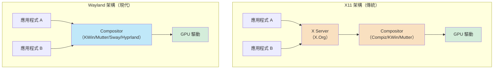
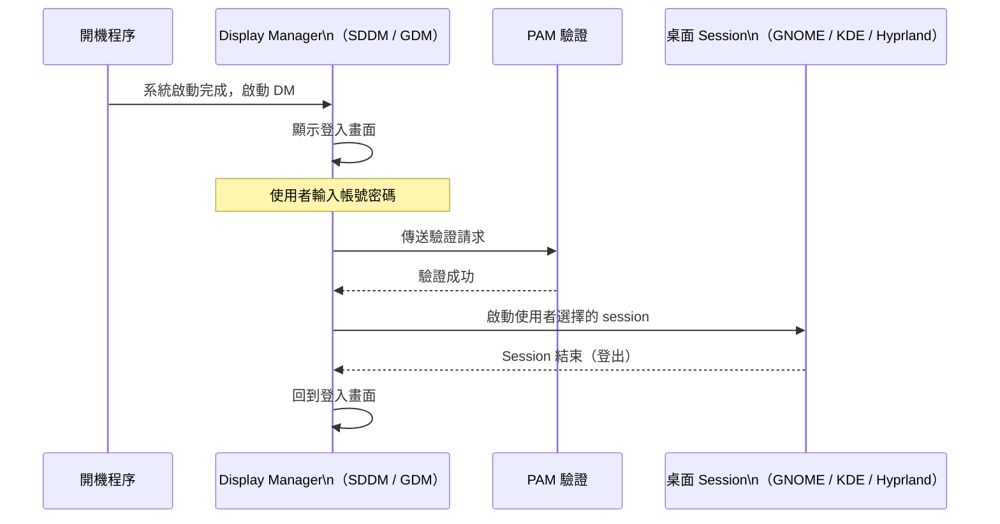
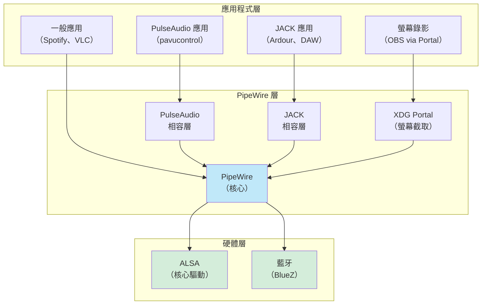
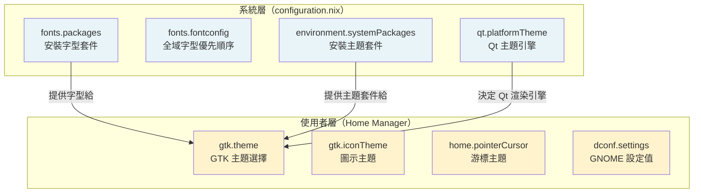
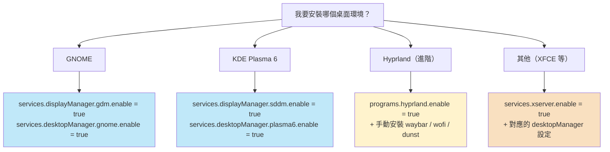

# 第15章：桌面環境配置

NixOS 不只是伺服器作業系統。

越來越多人選擇將它作為主力桌面系統。

原因很簡單：你可以把整個桌面環境的設定（顯示伺服器、桌面管理器、輸入法、音效、字型）全部納入 `configuration.nix`，然後在任何一台新機器上一行指令重現完整環境。

這一章將帶你完整掌握 NixOS 桌面配置的核心架構。

---

## 本章學習目標

完成本章後，你將能夠：

1. 理解 X11 與 Wayland 的架構差異，並根據硬體選擇正確的顯示伺服器
2. 配置 GNOME（含 GDM、Wayland、擴充套件）與 KDE Plasma 6（含 SDDM）完整桌面環境
3. 啟用 Hyprland 動態平鋪式 Wayland compositor，並安裝基本配套工具
4. 配置 fcitx5 輸入法框架，支援注音與倉頡輸入
5. 正確設定 PipeWire 音效系統，並避免與 PulseAudio 衝突的常見陷阱

---

## 前置知識

- 完成第12章（套件與環境管理）：了解 `fonts.packages`、`environment.systemPackages`
- 完成第14章（常見服務模組）：熟悉服務啟用的基本模式
- 了解 `configuration.nix` 的基本結構（第4章）

---

## 15.1 X11 vs Wayland：NixOS 的選擇

在設定桌面環境之前，你必須先理解一個基礎問題：

> 顯示伺服器（Display Server）到底是什麼？

### 顯示伺服器的角色

顯示伺服器是應用程式與螢幕硬體之間的中介層。

它負責：

- 將應用程式的視窗渲染到螢幕上
- 接收鍵盤、滑鼠等輸入事件，並分發給對應的視窗
- 管理視窗的位置、大小、堆疊順序
- 與 GPU 驅動溝通，執行硬體加速

目前有兩套主流的顯示伺服器協定：**X11**（又稱 X Window System）與 **Wayland**。

### X11 與 Wayland 的根本差異

**X11** 誕生於 1987 年，是一個網路透明的顯示協定。

它的設計假設：顯示伺服器與應用程式可能跑在不同的機器上（透過網路連接）。

這個設計帶來了強大的遠端顯示能力，但也帶來了巨大的歷史包袱。

**Wayland** 誕生於 2008 年，是對 X11 問題的重新設計。

它的核心理念：直接讓 compositor（合成器）接管所有工作，去掉中間層。



X11 的問題：

- 應用程式可以直接讀取其他視窗的內容（安全漏洞）
- 中間層過多，每個視窗都要多一次 XServer 的中轉
- 螢幕撕裂（screen tearing）問題難以根本解決
- 高 DPI 與多螢幕支援先天不足

Wayland 的改進：

- 應用程式只能存取自己的視窗（更高安全性）
- Compositor 直接渲染，不再有中間層
- 原生支援 VSync，解決撕裂問題
- 更好的 HiDPI 與混合 DPI 多螢幕支援

### 目前桌面生態現況（NixOS 25.05）

**重要：NixOS 25.05 的預設顯示伺服器是 Wayland。**

| 桌面環境 | Wayland 支援 | X11 支援 | 預設協定 |
|---|---|---|---|
| GNOME 46+ | 完整 | 透過 XWayland | Wayland |
| KDE Plasma 6 | 完整 | 仍可選 | Wayland |
| Hyprland | 僅 Wayland | 不支援 | Wayland |
| Sway | 僅 Wayland | 不支援 | Wayland |
| i3 | 不支援 | 原生 | X11 |
| XFCE | 實驗性 | 原生 | X11 |

### NixOS 如何同時支援兩者

在 NixOS 中，有兩套配置路徑：

**傳統路徑（X11 為主，仍可運作）：**

```nix
# 啟用 X Server（X11）
services.xserver.enable = true;
```

**現代路徑（Wayland 優先，NixOS 25.05 推薦）：**

```nix
# 直接透過 displayManager 管理（無需 xserver）
services.displayManager.gdm.enable = true;
```

> 注意：`services.xserver.enable = true` 在 NixOS 25.05 中仍然有效，
> 但它已被視為 legacy（舊式）方式。
>
> 對於 GNOME 與 KDE Plasma 6，推薦的現代方式是透過
> `services.displayManager.*` 來管理 Display Manager，
> 不再需要明確啟用 `services.xserver`。
>
> 然而，啟用 `services.xserver.enable = true` 仍然有其用途：
> 它會自動啟用 **XWayland**，讓舊式 X11 應用程式（例如 Wine、某些遊戲）
> 能在 Wayland 環境下運作。

### 選擇建議

根據你的使用情境選擇：

| 情境 | 建議選擇 |
|---|---|
| 現代桌面電腦（Intel / AMD GPU） | Wayland（GNOME 或 KDE Plasma 6） |
| NVIDIA GPU（較新驅動） | Wayland（需要額外驅動配置） |
| NVIDIA GPU（舊驅動，proprietary） | X11（較穩定） |
| 舊硬體或不常用 GPU | X11（相容性更好） |
| 追求高度客製化平鋪式視窗 | Hyprland（僅 Wayland） |
| 舊式應用程式相容性需求 | X11 或 Wayland + XWayland |

對於大多數 NixOS 新使用者，建議從 **GNOME on Wayland** 或 **KDE Plasma 6 on Wayland** 開始。

---

## 15.2 GNOME 桌面配置

GNOME 是 NixOS 官方安裝器預設提供的桌面環境。

它設計簡潔，與 Wayland 整合深入，是初學者最好的起點。

### 最小 GNOME 配置

以下是啟用 GNOME 的最小配置。

注意：這裡使用現代 API（不依賴 `services.xserver.enable`）：

```nix
{ config, pkgs, lib, ... }:

{
  # 啟用 GDM（GNOME Display Manager）作為登入畫面
  # NixOS 25.05 推薦方式：直接設定 displayManager
  services.displayManager.gdm.enable = true;

  # 啟用 GNOME 桌面管理員
  services.desktopManager.gnome.enable = true;

  # 啟用 NetworkManager（GNOME 控制台需要它）
  networking.networkmanager.enable = true;

  # 允許使用者加入 networkmanager 群組
  users.users.alice = {
    isNormalUser = true;
    extraGroups = [ "wheel" "networkmanager" ];
  };

  system.stateVersion = "25.05";
}
```

套用這個配置後，重開機就會看到 GNOME 登入畫面。

### 關於 `services.xserver.enable` 在 NixOS 25.05 的狀態

許多網路上的教學仍然寫著：

```nix
services.xserver.enable = true;
services.xserver.displayManager.gdm.enable = true;
services.xserver.desktopManager.gnome.enable = true;
```

這是**舊式（legacy）寫法**，在 NixOS 24.11 之前常見。

在 NixOS 25.05 中：

- `services.xserver.displayManager.*` 已被移至 `services.displayManager.*`
- `services.xserver.desktopManager.*` 已被移至 `services.desktopManager.*`
- `services.xserver.enable = true` 仍然有效，但現在主要用於明確啟用 XWayland 相容層

**結論：在 NixOS 25.05 中，GNOME 配置應使用新路徑。**

如果你需要 XWayland 支援（為了舊式 X11 應用程式），可以額外加上：

```nix
# 啟用 XWayland（讓 X11 應用程式在 Wayland 下運作）
programs.xwayland.enable = true;
```

### 啟用 GDM Wayland

GDM 預設在支援的硬體上使用 Wayland。

你可以明確確認這個設定：

```nix
{ config, pkgs, lib, ... }:

{
  services.displayManager.gdm = {
    enable = true;

    # 明確啟用 Wayland（通常預設已啟用，這裡是明確指定）
    wayland = true;
  };

  services.desktopManager.gnome.enable = true;

  system.stateVersion = "25.05";
}
```

### 排除預設的 GNOME 應用（精簡安裝）

GNOME 預設安裝了大量應用程式（聯絡人、照片、地圖、音樂等）。

如果你不需要這些，可以排除它們：

```nix
{ config, pkgs, lib, ... }:

{
  services.displayManager.gdm.enable = true;
  services.desktopManager.gnome.enable = true;

  # 排除所有預設 GNOME 核心工具（桌面仍然可以運作）
  services.gnome.core-utilities.enable = false;

  # 明確保留你需要的 GNOME 核心工具
  environment.systemPackages = with pkgs; [
    gnome-terminal        # 終端機（需要明確安裝）
    gnome-text-editor     # 文字編輯器
    nautilus              # 檔案管理員
    epiphany              # GNOME 瀏覽器（可替換為 Firefox）
  ];

  system.stateVersion = "25.05";
}
```

這樣可以大幅減少安裝的套件數量，適合精簡工作站配置。

### 安裝 GNOME 擴充套件（`gnomeExtensions`）

GNOME 的擴充套件（Extensions）可以大幅改善使用體驗。

在 NixOS 中，透過 nixpkgs 的 `gnomeExtensions` 命名空間安裝：

```nix
{ config, pkgs, lib, ... }:

{
  services.displayManager.gdm.enable = true;
  services.desktopManager.gnome.enable = true;

  environment.systemPackages = with pkgs; [
    # GNOME 擴充套件
    gnomeExtensions.dash-to-dock          # 將 Dash 固定在螢幕邊緣
    gnomeExtensions.appindicator-support  # 系統匣圖示支援
    gnomeExtensions.blur-my-shell         # 模糊背景效果
    gnomeExtensions.space-bar             # 工作區顯示在頂部欄
    gnomeExtensions.caffeine              # 防止螢幕進入休眠
  ];

  system.stateVersion = "25.05";
}
```

安裝後，還需要透過 GNOME Tweaks 或「擴充套件」應用程式手動啟用這些擴充套件。

> 提示：若要讓擴充套件在重裝系統後自動啟用，
> 可透過 Home Manager 的 `dconf.settings` 管理 GNOME 設定值。
> 第19章（Home Manager 整合）會詳細介紹這個方法。

### `programs.dconf.enable`：GNOME 設定儲存

GNOME 使用 **dconf**（鍵值儲存系統）來保存所有設定值。

在 NixOS 中需要明確啟用：

```nix
{ config, pkgs, lib, ... }:

{
  # dconf 是 GNOME 設定系統的基礎
  # 如果沒有啟用，GNOME 的許多設定（如深色模式、字型大小）將無法保存
  programs.dconf.enable = true;

  services.displayManager.gdm.enable = true;
  services.desktopManager.gnome.enable = true;

  system.stateVersion = "25.05";
}
```

在 NixOS 25.05 中，啟用 GNOME 時 `programs.dconf.enable` 通常會自動設為 `true`，但明確寫出是個好習慣。

### 完整範例：精簡 GNOME 工作站配置

以下是一個適合日常使用的精簡 GNOME 工作站完整配置：

```nix
{ config, pkgs, lib, ... }:

{
  # ── 顯示管理 ──────────────────────────────────────────────────────────
  services.displayManager.gdm = {
    enable  = true;
    wayland = true;   # 明確使用 Wayland
  };

  services.desktopManager.gnome.enable = true;

  # 精簡安裝：排除大量預設應用
  services.gnome.core-utilities.enable = false;

  # ── 系統基礎 ──────────────────────────────────────────────────────────
  programs.dconf.enable = true;

  # XWayland 相容層（讓舊式 X11 應用程式也能運作）
  programs.xwayland.enable = true;

  # 網路管理
  networking.networkmanager.enable = true;

  # ── 套件 ──────────────────────────────────────────────────────────────
  environment.systemPackages = with pkgs; [
    # GNOME 核心工具（手動保留）
    gnome-terminal
    gnome-text-editor
    nautilus
    gnome-system-monitor

    # 擴充套件
    gnomeExtensions.dash-to-dock
    gnomeExtensions.appindicator-support
    gnomeExtensions.caffeine

    # 日常應用
    firefox
    libreoffice
    vlc
  ];

  # ── 使用者 ──────────────────────────────────────────────────────────
  users.users.alice = {
    isNormalUser = true;
    extraGroups  = [ "wheel" "networkmanager" "audio" "video" ];
  };

  # ── Wayland 最佳化環境變數 ──────────────────────────────────────────
  environment.sessionVariables = {
    # Electron 應用程式（VS Code、Discord 等）使用 Wayland
    NIXOS_OZONE_WL = "1";
    # Firefox 使用 Wayland（通常已自動偵測）
    MOZ_ENABLE_WAYLAND = "1";
  };

  system.stateVersion = "25.05";
}
```

---

## 15.3 KDE Plasma 6 配置

KDE Plasma 6 是另一個主流桌面環境，以高度客製化能力著稱。

相比 GNOME 的「簡潔固執」，KDE 給使用者更多控制權。

### KDE Plasma 6 的 Wayland 支援狀態

KDE Plasma 6（2024 年 2 月發布）帶來了重大改進：

- Wayland 成為預設 session
- KWin（KDE 的視窗管理器）對 Wayland 的支援大幅成熟
- 解決了 Plasma 5 在 Wayland 下的許多已知問題

在 NixOS 25.05 中，KDE Plasma 6 的 Wayland session 對大多數使用者已足夠穩定。

### 基本 KDE Plasma 6 配置

```nix
{ config, pkgs, lib, ... }:

{
  # SDDM：KDE 標準的 Display Manager
  services.displayManager.sddm.enable = true;

  # 啟用 KDE Plasma 6
  services.desktopManager.plasma6.enable = true;

  # NetworkManager（KDE 網路管理員需要它）
  networking.networkmanager.enable = true;

  users.users.alice = {
    isNormalUser = true;
    extraGroups  = [ "wheel" "networkmanager" "audio" "video" ];
  };

  system.stateVersion = "25.05";
}
```

### 明確使用 Wayland Session

KDE Plasma 6 在 NixOS 25.05 預設會偏好 Wayland，但你可以明確指定：

```nix
{ config, pkgs, lib, ... }:

{
  services.displayManager.sddm = {
    enable = true;

    # 使用 Wayland 渲染 SDDM 本身（需要 sddm-kcm 支援）
    wayland.enable = true;
  };

  services.desktopManager.plasma6.enable = true;

  system.stateVersion = "25.05";
}
```

### 排除不需要的 KDE 應用

KDE 也預設安裝大量應用。

使用 `environment.plasma6.excludePackages` 排除不需要的部分：

```nix
{ config, pkgs, lib, ... }:

{
  services.displayManager.sddm.enable    = true;
  services.desktopManager.plasma6.enable = true;

  # 排除特定 KDE 應用
  environment.plasma6.excludePackages = with pkgs.kdePackages; [
    plasma-browser-integration  # 如果不需要瀏覽器整合
    oxygen                      # 舊式主題
    elisa                       # 音樂播放器（若改用其他）
    kmail                       # 郵件客戶端（若改用其他）
    kontact                     # 個人資訊管理器
    korganizer                  # 行事曆
    dragon                      # 視訊播放器（若改用其他）
  ];

  system.stateVersion = "25.05";
}
```

### SDDM 主題配置

SDDM 支援自訂主題。

```nix
{ config, pkgs, lib, ... }:

{
  services.displayManager.sddm = {
    enable = true;

    # 設定 SDDM 主題（需要先安裝對應的主題套件）
    theme = "breeze";  # KDE 預設主題

    # 設定 SDDM 使用的 DPI（高解析度螢幕需要調整）
    # settings.Wayland.EnableHiDPI = true;
  };

  services.desktopManager.plasma6.enable = true;

  # 安裝 SDDM 主題套件
  environment.systemPackages = with pkgs; [
    # breeze-gtk 提供 GTK 應用程式的 Breeze 主題
    kdePackages.breeze
    kdePackages.breeze-gtk
  ];

  system.stateVersion = "25.05";
}
```

### 完整範例：KDE Plasma 6 桌面配置

```nix
{ config, pkgs, lib, ... }:

{
  # ── 顯示管理 ──────────────────────────────────────────────────────────
  services.displayManager.sddm = {
    enable         = true;
    wayland.enable = true;
  };

  services.desktopManager.plasma6.enable = true;

  # 排除較少使用的 KDE 應用
  environment.plasma6.excludePackages = with pkgs.kdePackages; [
    kmail
    kontact
    korganizer
    oxygen
  ];

  # ── 系統基礎 ──────────────────────────────────────────────────────────
  networking.networkmanager.enable = true;

  # XWayland（舊式 X11 應用相容）
  programs.xwayland.enable = true;

  # ── 套件 ──────────────────────────────────────────────────────────────
  environment.systemPackages = with pkgs; [
    # 瀏覽器
    firefox

    # 辦公室
    libreoffice-qt6-fresh  # 使用 Qt6 的 LibreOffice（與 KDE 整合更好）

    # 媒體
    vlc

    # 開發工具
    git
    vscode
  ];

  # ── 允許 unfree 套件（如果需要 VSCode） ──────────────────────────────
  nixpkgs.config.allowUnfreePredicate = pkg: builtins.elem (lib.getName pkg) [
    "vscode"
  ];

  # ── 使用者 ──────────────────────────────────────────────────────────
  users.users.alice = {
    isNormalUser = true;
    extraGroups  = [ "wheel" "networkmanager" "audio" "video" ];
  };

  # ── Wayland 環境變數 ──────────────────────────────────────────────────
  environment.sessionVariables = {
    NIXOS_OZONE_WL = "1";
    MOZ_ENABLE_WAYLAND = "1";
  };

  system.stateVersion = "25.05";
}
```

---

## 15.4 Hyprland（Wayland compositor，進階）

Hyprland 是近年來在 Linux 社群中快速竄起的 Wayland compositor。

它不是完整的桌面環境，而是一個**動態平鋪式視窗管理器（Dynamic Tiling Window Manager）**。

### Hyprland 是什麼？

在理解 Hyprland 之前，先了解術語：

- **Compositor**（合成器）：負責把所有視窗組合成最終畫面的程式
- **Tiling WM**（平鋪式視窗管理器）：自動將視窗鋪排到螢幕上，不重疊
- **Dynamic Tiling**（動態平鋪）：視窗佈局可以隨時調整，而不是固定到特定佈局

Hyprland 的特點：

- 流暢的動畫效果（這是它與 Sway 的主要差異）
- 高度客製化的配置語言（`hyprland.conf`）
- 活躍的社群，外觀美觀（在 r/unixporn 上大量出現）
- **僅支援 Wayland**，沒有 X11 fallback

### 適合誰使用？

Hyprland 適合：

- 追求高效率鍵盤驅動操作的使用者
- 喜歡打造獨特桌面美觀的進階使用者
- 不介意手動設定每個細節的人（沒有預設的「開始功能表」或系統匣）

**不適合：**

- 希望「開箱即用」的初學者
- 依賴特定 X11 應用程式的使用者
- 不想花時間調校配置的使用者

### 在 NixOS 啟用 Hyprland

```nix
{ config, pkgs, lib, ... }:

{
  # 啟用 Hyprland（Wayland compositor）
  programs.hyprland.enable = true;

  # Hyprland 需要 XWayland 來運行 X11 應用程式
  programs.hyprland.xwayland.enable = true;

  # 通常搭配一個簡單的 Display Manager（或直接 TTY 啟動）
  # 這裡用 GDM 作為登入畫面，也可以用 SDDM
  services.displayManager.gdm = {
    enable  = true;
    wayland = true;
  };

  # Hyprland 不包含任何 Display Manager，登入後才進入
  # 你也可以直接從 TTY 執行：exec Hyprland

  users.users.alice = {
    isNormalUser = true;
    extraGroups  = [ "wheel" "video" "input" "audio" ];
  };

  system.stateVersion = "25.05";
}
```

### Hyprland 的配套工具

Hyprland 只是一個 compositor，你需要自己選配工具組成完整的使用環境。

以下是常見的工具組合：

| 功能 | 推薦工具 | 說明 |
|---|---|---|
| 狀態列 | `waybar` | 高度可客製化的 Wayland 狀態列 |
| 應用程式啟動器 | `wofi` | GTK 的 Wofi，或 `rofi-wayland` |
| 通知系統 | `dunst` | 輕量通知守護程式 |
| 桌布 | `swww` | 支援動態桌布切換，Wayland 原生 |
| 螢幕截圖 | `grim` + `slurp` | Wayland 截圖工具 |
| 剪貼板管理 | `wl-clipboard` | Wayland 剪貼板工具 |
| 音量控制 | `pavucontrol` | PipeWire / PulseAudio 音量面板 |
| 亮度調整 | `brightnessctl` | 亮度控制工具 |

安裝這些工具：

```nix
{ config, pkgs, lib, ... }:

{
  programs.hyprland = {
    enable         = true;
    xwayland.enable = true;
  };

  services.displayManager.gdm = {
    enable  = true;
    wayland = true;
  };

  # Hyprland 配套工具
  environment.systemPackages = with pkgs; [
    # 狀態列
    waybar

    # 應用程式啟動器
    wofi

    # 通知
    dunst
    libnotify     # 讓應用程式能傳送通知（notify-send 指令）

    # 桌布
    swww

    # 截圖
    grim
    slurp
    swappy        # 截圖後的簡單編輯工具

    # 剪貼板
    wl-clipboard

    # 媒體控制
    playerctl

    # 亮度（筆記型電腦）
    brightnessctl

    # 終端機模擬器（Hyprland 沒有預設終端機）
    kitty         # 現代 GPU 加速終端機，Hyprland 預設配置使用它
  ];

  users.users.alice = {
    isNormalUser = true;
    extraGroups  = [ "wheel" "video" "input" "audio" ];
  };

  system.stateVersion = "25.05";
}
```

### hyprland.conf：基本配置

Hyprland 的配置檔案存放在使用者的 `~/.config/hypr/hyprland.conf`。

這個檔案可以透過 Home Manager 宣告式管理（推薦），或直接手動建立。

以下是一個最小可用的 `hyprland.conf` 片段，展示基本結構：

```
# 監視器設定（Monitor）
monitor=,preferred,auto,1

# 應用程式啟動
exec-once = waybar &
exec-once = dunst &
exec-once = swww init

# 按鍵設定
$mod = SUPER

bind = $mod, Return, exec, kitty
bind = $mod, Q, killactive
bind = $mod, D, exec, wofi --show drun
bind = $mod SHIFT, Q, exit

# 視窗焦點移動
bind = $mod, left,  movefocus, l
bind = $mod, right, movefocus, r
bind = $mod, up,    movefocus, u
bind = $mod, down,  movefocus, d

# 外觀
general {
    gaps_in  = 5
    gaps_out = 10
    border_size = 2
}

decoration {
    rounding = 8
}

animations {
    enabled = true
}
```

> 提示：要在 NixOS 中宣告式管理 `hyprland.conf`，
> 推薦使用 Home Manager 的 `wayland.windowManager.hyprland` 模組。
> 這會在第19章（Home Manager 整合）詳細介紹。

---

## 15.5 Display Manager：SDDM 與 GDM

### Display Manager 的角色

**Display Manager（顯示管理員）** 是開機後第一個出現的圖形介面。

它的工作：

- 顯示使用者登入畫面
- 驗證使用者密碼
- 啟動使用者選擇的桌面 session（Wayland / X11 / GNOME / KDE 等）
- 管理系統層的 PAM 驗證流程



### GDM（GNOME Display Manager）

GDM 是 GNOME 的標準登入管理員。

特點：

- 深度整合 GNOME 技術堆疊
- 原生支援 Wayland session
- 支援無障礙功能（Accessibility）
- 介面設計與 GNOME 一致

```nix
{ config, pkgs, lib, ... }:

{
  services.displayManager.gdm = {
    enable = true;

    # 啟用 Wayland 支援（預設已啟用）
    wayland = true;

    # 自動登入（適合開發 VM，不適合有安全需求的環境）
    # autoLogin.enable = true;
    # autoLogin.user   = "alice";
  };

  services.desktopManager.gnome.enable = true;

  system.stateVersion = "25.05";
}
```

### SDDM（Simple Desktop Display Manager）

SDDM 是 KDE 的標準登入管理員，但也可以搭配其他桌面環境使用。

特點：

- 比 GDM 更輕量
- 支援 QML 主題（高度客製化）
- 不依賴 GNOME 的技術堆疊
- 在 KDE Plasma 以外也可以使用（例如搭配 Hyprland）

```nix
{ config, pkgs, lib, ... }:

{
  services.displayManager.sddm = {
    enable = true;

    # 啟用 Wayland 後端
    wayland.enable = true;

    # 主題設定
    theme = "breeze";

    # 自動登入（測試 / VM 環境用）
    # settings.Autologin = {
    #   User    = "alice";
    #   Session = "plasma.desktop";
    # };
  };

  services.desktopManager.plasma6.enable = true;

  system.stateVersion = "25.05";
}
```

### 自動登入（autoLogin）

在虛擬機或個人桌面環境中，自動登入可以省去每次輸入密碼的麻煩。

**GDM 自動登入：**

```nix
{ config, pkgs, lib, ... }:

{
  services.displayManager.gdm.enable = true;
  services.desktopManager.gnome.enable = true;

  # 啟用自動登入
  services.displayManager.autoLogin = {
    enable = true;
    user   = "alice";   # 指定自動登入的使用者
  };

  users.users.alice = {
    isNormalUser = true;
    extraGroups  = [ "wheel" "networkmanager" ];
    # 注意：自動登入時不需要設定密碼，但仍建議設定，以防需要手動登入
  };

  system.stateVersion = "25.05";
}
```

> 警告：自動登入會降低系統安全性。
> 只在個人使用且無安全顧慮的環境中使用（例如個人 VM、家庭網路的開發機）。

### GDM vs SDDM 選擇建議

| 比較項目 | GDM | SDDM |
|---|---|---|
| 適合搭配 | GNOME | KDE Plasma、Hyprland、其他 |
| 依賴程度 | 依賴 GNOME 元件 | 較為獨立 |
| Wayland 支援 | 原生、深度整合 | 支援，透過 `wayland.enable` |
| 主題自訂 | 有限 | 高度自訂（QML） |
| 無障礙功能 | 支援 | 有限 |
| 記憶體用量 | 略高 | 較低 |
| 推薦情境 | GNOME 使用者 | KDE、Hyprland、輕量化 |

---

## 15.6 輸入法配置（fcitx5）

對於台灣使用者，輸入法配置是不可缺少的一環。

### 為什麼需要輸入法框架？

英文可以直接在鍵盤上輸入。

但中文、日文、韓文這類語言有成千上萬個字，無法每個字都對應一個按鍵。

輸入法框架（Input Method Framework，IMF）解決這個問題：

- 攔截鍵盤輸入
- 將按鍵序列轉換成候選字（例如ㄓㄨˋ音 → 注音）
- 讓使用者選擇正確的字
- 將最終的文字送往應用程式

目前 Linux 上主流的輸入法框架有三個：

| 框架 | 說明 | NixOS 支援 |
|---|---|---|
| **fcitx5** | 現代化，Wayland 原生支援，推薦 | 完整 |
| **IBus** | GNOME 整合深，但 Wayland 支援較差 | 完整 |
| **scim** | 較舊，基本不再維護 | 有限 |

對於台灣使用者，**fcitx5** 是最佳選擇。

### NixOS 25.05 的新輸入法 API

NixOS 25.05 引入了新的輸入法配置 API：

```nix
# 新 API（NixOS 25.05+）
i18n.inputMethod.enable = true;
i18n.inputMethod.type   = "fcitx5";
```

舊 API（在 25.05 之前）為：

```nix
# 舊 API（已廢棄）
# i18n.inputMethod.enabled = "fcitx5";  # 注意：是 enabled 不是 enable
```

> 注意：如果你看到的教學使用 `i18n.inputMethod.enabled`（舊 API），
> 請改用 NixOS 25.05 的 `i18n.inputMethod.enable` + `i18n.inputMethod.type`。

### 安裝 fcitx5 與中文輸入法模組

以台灣使用者常用的注音與倉頡為例：

```nix
{ config, pkgs, lib, ... }:

{
  # ── 輸入法框架 ──────────────────────────────────────────────────────
  i18n.inputMethod = {
    # 啟用輸入法（NixOS 25.05 新 API）
    enable = true;

    # 選擇 fcitx5 作為輸入法框架
    type = "fcitx5";

    # 安裝 fcitx5 附加元件
    fcitx5.addons = with pkgs; [
      fcitx5-chewing       # 新酷音（注音輸入，台灣最主流）
      fcitx5-table-extra   # 包含倉頡、行列等表格輸入法
      fcitx5-gtk           # GTK 整合（必裝，讓 GTK 應用程式支援 fcitx5）
    ];
  };

  # ── 系統語系 ──────────────────────────────────────────────────────
  i18n.defaultLocale         = "zh_TW.UTF-8";
  i18n.supportedLocales      = [ "zh_TW.UTF-8/UTF-8" "en_US.UTF-8/UTF-8" ];

  # ── 時區 ──────────────────────────────────────────────────────────
  time.timeZone = "Asia/Taipei";

  system.stateVersion = "25.05";
}
```

### 環境變數配置

fcitx5 需要幾個環境變數才能讓 GTK 與 Qt 應用程式正確找到輸入法：

```nix
{ config, pkgs, lib, ... }:

{
  i18n.inputMethod = {
    enable = true;
    type   = "fcitx5";
    fcitx5.addons = with pkgs; [
      fcitx5-chewing
      fcitx5-table-extra
      fcitx5-gtk
    ];
  };

  # 在 X11 環境下需要這些環境變數
  # Wayland 環境下，fcitx5 通常可以自動偵測，但設定這些仍是好習慣
  environment.sessionVariables = {
    GTK_IM_MODULE  = "fcitx";
    QT_IM_MODULE   = "fcitx";
    XMODIFIERS     = "@im=fcitx";
    SDL_IM_MODULE  = "fcitx";
    GLFW_IM_MODULE = "ibus";    # 某些 Electron 應用程式使用
  };

  system.stateVersion = "25.05";
}
```

### Wayland 下的輸入法注意事項

在純 Wayland 環境（沒有 XWayland）下，fcitx5 的行為有一些差異：

1. **GTK4 應用程式**：使用 Wayland 的 text-input 協定，不需要 `GTK_IM_MODULE`
2. **GTK3 應用程式**：仍需要 `GTK_IM_MODULE=fcitx`
3. **Qt 應用程式**：需要 `QT_IM_MODULE=fcitx`
4. **Electron 應用程式**（VS Code、Discord）：輸入法支援較差，需要特別設定

對於大多數日常應用程式（瀏覽器、辦公室套件），fcitx5 在 Wayland 下運作良好。

### 完整範例：fcitx5 + 注音輸入

以下是台灣使用者的完整輸入法配置範例：

```nix
{ config, pkgs, lib, ... }:

{
  # ── 輸入法 ──────────────────────────────────────────────────────────
  i18n.inputMethod = {
    enable = true;
    type   = "fcitx5";

    fcitx5.addons = with pkgs; [
      # 注音輸入（台灣最常用）
      fcitx5-chewing

      # 倉頡、行列、嘸蝦米等表格輸入法
      fcitx5-table-extra

      # GTK 整合（必裝）
      fcitx5-gtk

      # 佈景主題（可選，讓 fcitx5 候選字視窗更好看）
      fcitx5-nord
    ];

    # 啟用 fcitx5 設定介面
    # fcitx5.settings.addons = { ... };  # 可透過 Home Manager 宣告式管理
  };

  # ── 語系設定 ──────────────────────────────────────────────────────
  i18n.defaultLocale    = "zh_TW.UTF-8";
  i18n.supportedLocales = [
    "zh_TW.UTF-8/UTF-8"
    "en_US.UTF-8/UTF-8"
  ];

  time.timeZone = "Asia/Taipei";

  # ── 輸入法環境變數 ──────────────────────────────────────────────
  environment.sessionVariables = {
    GTK_IM_MODULE = "fcitx";
    QT_IM_MODULE  = "fcitx";
    XMODIFIERS    = "@im=fcitx";
  };

  # ── 字型（中文輸入需要中文字型） ────────────────────────────────────
  fonts.packages = with pkgs; [
    noto-fonts-cjk-sans
    noto-fonts-cjk-serif
    noto-fonts-emoji
  ];

  system.stateVersion = "25.05";
}
```

套用後，使用 `Super + 空格` 或 `Ctrl + 空格` 切換輸入法（預設按鍵取決於 fcitx5 設定）。

---

## 15.7 PipeWire 音效系統

### 為什麼從 PulseAudio 遷移到 PipeWire？

Linux 音效系統的歷史複雜：

- **ALSA**（Advanced Linux Sound Architecture）：核心層音效驅動，最底層
- **PulseAudio**：使用者空間的音效伺服器，2004 年開始流行，解決多應用程式同時使用音效的問題
- **JACK**（Jack Audio Connection Kit）：專業音樂製作用，低延遲，但配置複雜
- **PipeWire**：2021 年起逐漸成熟，目標是**同時取代 PulseAudio 與 JACK**

PipeWire 的優勢：

- 提供 PulseAudio 相容層（舊應用程式不需修改）
- 提供 JACK 相容層（DAW、音樂製作軟體可直接使用）
- 低延遲，適合 Wayland 的影片截取（screencasting）
- Wayland 下的螢幕錄影依賴 PipeWire（透過 XDG portals）
- 藍牙音訊整合更好

**NixOS 25.05 預設使用 PipeWire。**

### PipeWire 架構圖



### 基本 PipeWire 配置

**重要警告：不能同時啟用 PipeWire 與 PulseAudio。**

這是初學者最常遇到的陷阱。

```nix
{ config, pkgs, lib, ... }:

{
  # ────────────────────────────────────────────────────────────────────
  # 重要！必須停用 PulseAudio，否則 PipeWire 無法正常運作
  # 兩者同時啟用會互相衝突，導致音效完全無聲
  # ────────────────────────────────────────────────────────────────────
  hardware.pulseaudio.enable = false;

  # 啟用即時排程支援（讓音效有更低的延遲）
  # rtkit（RealtimeKit）讓音效程序取得即時優先級，減少雜音與卡頓
  security.rtkit.enable = true;

  # 啟用 PipeWire
  services.pipewire = {
    enable = true;

    # PulseAudio 相容層（讓舊式應用程式繼續運作）
    pulse.enable = true;

    # ALSA 相容層（讓直接使用 ALSA 的應用程式也能透過 PipeWire）
    alsa.enable        = true;
    alsa.support32Bit  = true;  # 32 位元應用程式支援（Steam、Wine）

    # JACK 相容層（音樂製作需要）
    jack.enable = true;
  };

  system.stateVersion = "25.05";
}
```

### 為什麼一定要停用 PulseAudio？

這個問題非常重要，值得多解釋一次。

PulseAudio 與 PipeWire 都是使用者空間的音效伺服器。

它們都需要「獨佔」音效硬體資源。

如果兩者同時運行：

- 只有其中一個能成功連接到 ALSA 硬體
- 另一個會持續報錯並嘗試重啟
- 結果是隨機的音效中斷、完全無聲、或兩個系統互搶資源

正確做法是明確停用 PulseAudio：

```nix
# 錯誤配置（會造成音效問題）
# hardware.pulseaudio.enable = true;   # 千萬不要這樣
# services.pipewire.enable  = true;    # 兩者同時啟用

# 正確配置
hardware.pulseaudio.enable = false;  # 明確停用 PulseAudio
services.pipewire.enable   = true;   # 只啟用 PipeWire
```

### 藍牙音訊配置

要讓藍牙耳機與 PipeWire 一起工作：

```nix
{ config, pkgs, lib, ... }:

{
  hardware.pulseaudio.enable = false;
  security.rtkit.enable      = true;

  services.pipewire = {
    enable       = true;
    pulse.enable = true;
    alsa.enable  = true;
  };

  # 啟用藍牙
  hardware.bluetooth = {
    enable      = true;
    powerOnBoot = true;  # 開機自動啟動藍牙

    # 啟用較新的 A2DP 設定（提升音質）
    settings.Policy.AutoEnable = "true";
  };

  # 藍牙管理服務
  services.blueman.enable = true;

  # PipeWire 的藍牙支援（透過 wireplumber）
  # 在 NixOS 25.05 中，wireplumber 是 PipeWire 的預設 session manager
  # 藍牙音訊支援已內建，不需要額外配置

  system.stateVersion = "25.05";
}
```

### 完整範例：完整 PipeWire 配置

```nix
{ config, pkgs, lib, ... }:

{
  # ────────────────────────────────────────────────────────────────────
  # 音效系統：PipeWire
  # 注意：必須確保 hardware.pulseaudio.enable = false（預設值）
  # ────────────────────────────────────────────────────────────────────
  hardware.pulseaudio.enable = false;  # 明確停用，避免誤啟

  # 即時排程支援
  security.rtkit.enable = true;

  services.pipewire = {
    enable = true;

    # 相容層
    pulse.enable       = true;  # PulseAudio 相容
    alsa.enable        = true;  # ALSA 相容
    alsa.support32Bit  = true;  # 32 位元支援（Steam、Wine）
    jack.enable        = true;  # JACK 相容（音樂製作）
  };

  # 藍牙
  hardware.bluetooth = {
    enable      = true;
    powerOnBoot = true;
  };
  services.blueman.enable = true;

  # 音效控制工具
  environment.systemPackages = with pkgs; [
    pavucontrol       # PulseAudio Volume Control（與 PipeWire 相容）
    helvum            # PipeWire 原生 patchbay（視覺化音訊路由）
    qpwgraph          # 另一個 PipeWire patchbay 工具
  ];

  users.users.alice = {
    isNormalUser = true;
    extraGroups  = [ "wheel" "audio" "video" ];
  };

  system.stateVersion = "25.05";
}
```

### 驗證 PipeWire 是否正常運作

套用配置後，透過以下指令確認：

```bash
# 確認 PipeWire 服務正在運行
systemctl --user status pipewire

# 確認 PulseAudio 相容層在運行
systemctl --user status pipewire-pulse

# 列出音訊裝置
pactl info           # 透過 PulseAudio 相容層查詢
wpctl status         # 透過 WirePlumber 查詢（原生 PipeWire 工具）

# 播放測試音效
paplay /run/current-system/sw/share/sounds/freedesktop/stereo/audio-test-signal.oga
```

---

## 15.8 字型與主題配置

### 字型安裝（桌面環境的特殊需求）

第12章已介紹基礎字型安裝。

桌面環境有一些額外的字型需求需要特別注意。

### 桌面環境推薦字型組合

```nix
{ config, pkgs, lib, ... }:

{
  fonts = {
    fontDir.enable = true;

    packages = with pkgs; [
      # 基礎英文字型
      noto-fonts
      liberation_ttf

      # CJK 字型（中日韓）
      noto-fonts-cjk-sans    # 無襯線（UI 介面推薦）
      noto-fonts-cjk-serif   # 襯線（文件閱讀推薦）

      # 思源字體（Adobe 開源，比 Noto CJK 更精緻）
      source-han-sans         # 思源黑體
      source-han-serif        # 思源宋體

      # Emoji
      noto-fonts-emoji
      twemoji-color-font      # Twitter Emoji（彩色，相容性好）

      # 終端機等寬字型
      jetbrains-mono
      (nerdfonts.override { fonts = [ "JetBrainsMono" "FiraCode" ]; })
    ];

    fontconfig = {
      defaultFonts = {
        # 繁體中文優先（TC = Traditional Chinese）
        sansSerif = [ "Noto Sans" "Noto Sans CJK TC" ];
        serif     = [ "Noto Serif" "Noto Serif CJK TC" ];
        monospace = [ "JetBrains Mono" "Noto Sans Mono CJK TC" ];
        emoji     = [ "Noto Color Emoji" ];
      };

      # 啟用抗鋸齒與 hinting（改善文字渲染品質）
      antialias  = true;
      hinting = {
        enable = true;
        style  = "slight";  # 輕微 hinting，適合大多數螢幕
      };
    };
  };

  system.stateVersion = "25.05";
}
```

### 思源黑體 vs Noto CJK：如何選擇？

這兩套字型都是開源 CJK 字型，品質都很高：

| 比較 | 思源黑體（Source Han Sans） | Noto Sans CJK |
|---|---|---|
| 開發商 | Adobe + Google | Google |
| 字形設計 | 較傳統、適合印刷 | 較現代、螢幕閱讀優化 |
| 字重 | 7 種（ExtraLight 到 Heavy） | 較少 |
| 套件大小 | 較大 | 較小 |
| NixOS 套件名稱 | `source-han-sans` | `noto-fonts-cjk-sans` |

建議：

- 日常 UI 使用 → Noto Sans CJK TC
- 文件輸出、正式印刷 → 思源黑體

### 系統層 GTK 主題

GTK（GIMP Toolkit）是 GNOME、XFCE 等桌面環境的 UI 框架。

在系統層設定 GTK 主題：

```nix
{ config, pkgs, lib, ... }:

{
  # 全系統 GTK 主題（影響所有使用者）
  # 注意：通常建議用 Home Manager 管理使用者層的主題，而非系統層
  # 這裡僅作為系統層配置的示範

  environment.systemPackages = with pkgs; [
    # 安裝 GTK 主題套件
    adw-gtk3        # GNOME Adwaita 主題（GTK3 版本）
    nordic          # Nordic 深色主題
    catppuccin-gtk  # Catppuccin 主題（近年流行）

    # GTK 主題配置工具
    gnome-tweaks    # GNOME 使用者可用它設定主題
    lxappearance    # 非 GNOME 環境下設定 GTK 主題的工具
  ];

  system.stateVersion = "25.05";
}
```

### Qt 主題：讓 Qt 應用程式融入桌面

Qt 是 KDE 使用的 UI 框架，但 Qt 應用程式在 GNOME 環境中常看起來格格不入。

使用 `qt` 設定讓 Qt 應用程式跟隨系統主題：

```nix
{ config, pkgs, lib, ... }:

{
  # 在 GNOME 環境下，讓 Qt 應用程式使用 GNOME 風格
  qt = {
    enable      = true;
    platformTheme = "gnome";  # 或 "kde"（在 KDE 環境下）
    style.name  = "adwaita-dark";  # 使用 Adwaita Dark 主題
  };

  # 安裝 Qt 主題引擎（Qt 應用程式需要它來渲染非原生主題）
  environment.systemPackages = with pkgs; [
    adwaita-qt   # Qt 版本的 Adwaita 主題
    adwaita-qt6  # Qt6 版本
  ];

  system.stateVersion = "25.05";
}
```

在 KDE 環境下，Qt 主題由 KDE 自身管理，通常不需要額外設定。

### 系統層 vs Home Manager 配置的分工

主題與外觀配置有一個重要的設計選擇：

**什麼應該放在系統層（`configuration.nix`）？**

- 字型套件安裝（`fonts.packages`）
- 全域字型預設值（`fonts.fontconfig.defaultFonts`）
- Qt 平台主題引擎（`qt.platformTheme`）
- 游標主題套件安裝

**什麼應該放在 Home Manager？**

- 使用者的 GTK 主題選擇（`gtk.theme`）
- 使用者的游標主題（`home.pointerCursor`）
- 使用者的 GTK 字型大小設定
- GNOME 特定的 dconf 設定值



這種分工的好處：

- 系統層控制「哪些資源可以使用」（套件、引擎）
- 使用者層控制「個人偏好的外觀設定」

Home Manager 的詳細使用方式將在第19章介紹。

### 游標主題

游標主題影響滑鼠指標的外觀。

在系統層安裝游標套件，並設定系統預設：

```nix
{ config, pkgs, lib, ... }:

{
  environment.systemPackages = with pkgs; [
    # 安裝游標主題套件
    bibata-cursors          # Bibata（乾淨的圓形游標，廣受歡迎）
    vimix-cursors           # Vimix 游標
    phinger-cursors         # phinger 游標
  ];

  # 設定系統層預設游標（Wayland 環境需要）
  environment.variables = {
    XCURSOR_THEME = "Bibata-Modern-Classic";
    XCURSOR_SIZE  = "24";
  };

  system.stateVersion = "25.05";
}
```

---

## Lab 15：配置一個完整的 NixOS 桌面工作站

### 目標

完成本 Lab 後，你將建立一個完整的 NixOS 桌面工作站配置，包含：

- GNOME 桌面環境（Wayland）
- 中文輸入法（fcitx5 + 注音）
- PipeWire 音效
- 字型與基礎主題

### 建議環境

| 項目 | 需求 |
|---|---|
| 硬體或 VM | 4GB RAM 以上，20GB 磁碟 |
| GPU | Intel / AMD（開箱即用）或 NVIDIA（需額外驅動配置） |
| NixOS 版本 | 25.05 |
| 建議安裝方式 | NixOS Minimal ISO（手動配置） |

### Step 1：建立基礎桌面配置

編輯 `/etc/nixos/desktop.nix`：

```nix
{ config, pkgs, lib, ... }:

{
  # ── 桌面環境 ──────────────────────────────────────────────────────
  services.displayManager.gdm = {
    enable  = true;
    wayland = true;
  };

  services.desktopManager.gnome.enable = true;

  # 精簡安裝
  services.gnome.core-utilities.enable = false;

  programs.dconf.enable  = true;
  programs.xwayland.enable = true;

  # ── 網路 ──────────────────────────────────────────────────────────
  networking.networkmanager.enable = true;

  # ── 必要套件 ──────────────────────────────────────────────────────
  environment.systemPackages = with pkgs; [
    gnome-terminal
    nautilus
    gnome-system-monitor
    firefox
    gnomeExtensions.dash-to-dock
  ];

  # ── Wayland 環境變數 ──────────────────────────────────────────────
  environment.sessionVariables = {
    NIXOS_OZONE_WL  = "1";
    MOZ_ENABLE_WAYLAND = "1";
  };
}
```

### Step 2：加入音效配置

編輯 `/etc/nixos/audio.nix`：

```nix
{ config, pkgs, lib, ... }:

{
  # PipeWire 音效系統
  hardware.pulseaudio.enable = false;   # 必須停用
  security.rtkit.enable      = true;

  services.pipewire = {
    enable       = true;
    pulse.enable = true;
    alsa.enable  = true;
    alsa.support32Bit = true;
  };

  hardware.bluetooth = {
    enable      = true;
    powerOnBoot = true;
  };
  services.blueman.enable = true;

  environment.systemPackages = with pkgs; [
    pavucontrol
  ];
}
```

### Step 3：加入輸入法配置

編輯 `/etc/nixos/i18n.nix`：

```nix
{ config, pkgs, lib, ... }:

{
  # 輸入法
  i18n.inputMethod = {
    enable = true;
    type   = "fcitx5";
    fcitx5.addons = with pkgs; [
      fcitx5-chewing
      fcitx5-table-extra
      fcitx5-gtk
    ];
  };

  # 語系
  i18n.defaultLocale    = "zh_TW.UTF-8";
  i18n.supportedLocales = [ "zh_TW.UTF-8/UTF-8" "en_US.UTF-8/UTF-8" ];
  time.timeZone         = "Asia/Taipei";

  # 環境變數
  environment.sessionVariables = {
    GTK_IM_MODULE = "fcitx";
    QT_IM_MODULE  = "fcitx";
    XMODIFIERS    = "@im=fcitx";
  };
}
```

### Step 4：加入字型配置

編輯 `/etc/nixos/fonts.nix`：

```nix
{ config, pkgs, lib, ... }:

{
  fonts = {
    fontDir.enable = true;

    packages = with pkgs; [
      noto-fonts
      noto-fonts-cjk-sans
      noto-fonts-cjk-serif
      noto-fonts-emoji
      source-han-sans
      jetbrains-mono
    ];

    fontconfig = {
      defaultFonts = {
        sansSerif = [ "Noto Sans" "Noto Sans CJK TC" ];
        serif     = [ "Noto Serif" "Noto Serif CJK TC" ];
        monospace = [ "JetBrains Mono" ];
        emoji     = [ "Noto Color Emoji" ];
      };
    };
  };
}
```

### Step 5：整合到 `configuration.nix`

```nix
{ config, pkgs, lib, ... }:

{
  imports = [
    ./hardware-configuration.nix
    ./desktop.nix
    ./audio.nix
    ./i18n.nix
    ./fonts.nix
  ];

  # ── 基本系統設定 ──────────────────────────────────────────────────
  networking.hostName = "nixos";

  # ── Bootloader ──────────────────────────────────────────────────
  boot.loader.systemd-boot.enable = true;
  boot.loader.efi.canTouchEfiVariables = true;

  # ── 使用者 ──────────────────────────────────────────────────────
  users.users.alice = {
    isNormalUser = true;
    extraGroups  = [ "wheel" "networkmanager" "audio" "video" ];
    initialPassword = "changeme";  # 請在登入後立即修改密碼
  };

  system.stateVersion = "25.05";
}
```

### Step 6：套用並重啟

```bash
# 套用配置
sudo nixos-rebuild switch

# 或者先測試（不寫入開機選單）
sudo nixos-rebuild test
```

### 驗證

完成後，驗證以下項目：

| 項目 | 驗證方式 |
|---|---|
| GNOME 桌面啟動 | 開機後看到 GDM 登入畫面 |
| Wayland session | 登入後執行 `echo $WAYLAND_DISPLAY`，應有輸出 |
| 音效正常 | 執行 `pactl info`，確認 server name 包含 PipeWire |
| PulseAudio 已停用 | 執行 `systemctl --user status pulseaudio`，應顯示 inactive |
| 輸入法可用 | 打開 Firefox，嘗試注音輸入（`Ctrl + 空格` 切換） |
| 中文顯示正常 | 打開終端機，輸入中文字，確認字型正確渲染 |

---

## 本章小結

本章涵蓋了 NixOS 桌面配置的完整技術棧。

### 重點回顧

| 主題 | 關鍵概念 |
|---|---|
| X11 vs Wayland | NixOS 25.05 預設 Wayland；現代硬體選 Wayland，舊硬體或特殊驅動選 X11 |
| GNOME 配置 | 使用 `services.displayManager.gdm` + `services.desktopManager.gnome`；舊式 `services.xserver` 路徑已是 legacy |
| KDE Plasma 6 | 使用 `services.displayManager.sddm` + `services.desktopManager.plasma6` |
| Hyprland | 進階使用者的動態平鋪 Wayland compositor，需要手動配齊配套工具 |
| Display Manager | GDM 適合 GNOME；SDDM 適合 KDE 與其他 WM |
| 自動登入 | `services.displayManager.autoLogin`，僅限無安全需求環境 |
| fcitx5 輸入法 | NixOS 25.05 新 API：`i18n.inputMethod.enable` + `i18n.inputMethod.type = "fcitx5"` |
| PipeWire | 必須明確 `hardware.pulseaudio.enable = false`；搭配 `security.rtkit.enable = true` |
| 字型配置 | `fonts.packages` 安裝；`fonts.fontconfig.defaultFonts` 設優先順序 |
| 主題分工 | 字型套件安裝在系統層；使用者主題偏好在 Home Manager |

### 常見錯誤提醒

**錯誤一：PulseAudio 與 PipeWire 同時啟用**

```nix
# 錯誤！會導致音效完全無聲或不穩定
hardware.pulseaudio.enable = true;
services.pipewire.enable   = true;
```

```nix
# 正確：明確停用 PulseAudio
hardware.pulseaudio.enable = false;
services.pipewire.enable   = true;
services.pipewire.pulse.enable = true;
```

**錯誤二：仍在 25.05 中使用舊式桌面配置路徑**

```nix
# 舊式路徑（仍可運作，但已是 legacy）
services.xserver.displayManager.gdm.enable = true;
services.xserver.desktopManager.gnome.enable = true;
```

```nix
# 正確：使用 25.05 的新路徑
services.displayManager.gdm.enable     = true;
services.desktopManager.gnome.enable   = true;
```

**錯誤三：輸入法使用舊 API**

```nix
# 舊 API（25.05 之前）
i18n.inputMethod.enabled = "fcitx5";  # 這個選項名稱已更改
```

```nix
# 正確：使用 25.05 的新 API
i18n.inputMethod.enable = true;
i18n.inputMethod.type   = "fcitx5";
```

**錯誤四：fcitx5 套件安裝但環境變數未設定**

```nix
# 只安裝 fcitx5，但忘記設定環境變數
# GTK 應用程式無法找到輸入法
i18n.inputMethod.enable = true;
i18n.inputMethod.type   = "fcitx5";
# 缺少：GTK_IM_MODULE、QT_IM_MODULE、XMODIFIERS
```

```nix
# 正確：設定環境變數
environment.sessionVariables = {
  GTK_IM_MODULE = "fcitx";
  QT_IM_MODULE  = "fcitx";
  XMODIFIERS    = "@im=fcitx";
};
```

### 各桌面環境配置路徑速查



### 本章練習

1. 安裝 GNOME 或 KDE Plasma 6，確認 Wayland session 正常運作（`echo $WAYLAND_DISPLAY` 有輸出）
2. 啟用 `services.gnome.core-utilities.enable = false`，手動保留 5 個你需要的 GNOME 應用
3. 配置 PipeWire，確認 `pactl info` 顯示 PipeWire 而不是 PulseAudio
4. 安裝 fcitx5 + 注音，並在 Firefox 中成功輸入中文
5. 安裝繁體中文字型，並設定 `fonts.fontconfig.defaultFonts.sansSerif` 為 Noto Sans CJK TC
6. （進階）安裝 Hyprland，啟動後成功打開 Kitty 終端機與 Wofi 啟動器

### 下一章預告

第16章將進入開發環境管理。

你將學習如何用 `devShell` 和 Flakes 建立可重現的語言開發環境——Python、Rust、Go、Node.js——並整合 direnv 實現「進入目錄自動載入環境」的現代工作流程。

這是把 NixOS 作為開發工作站的核心技能。
