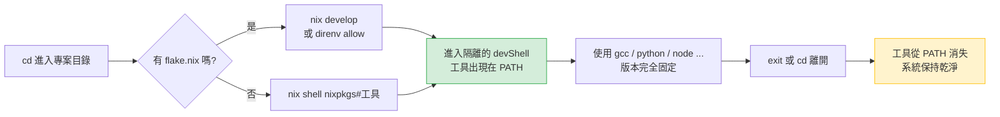
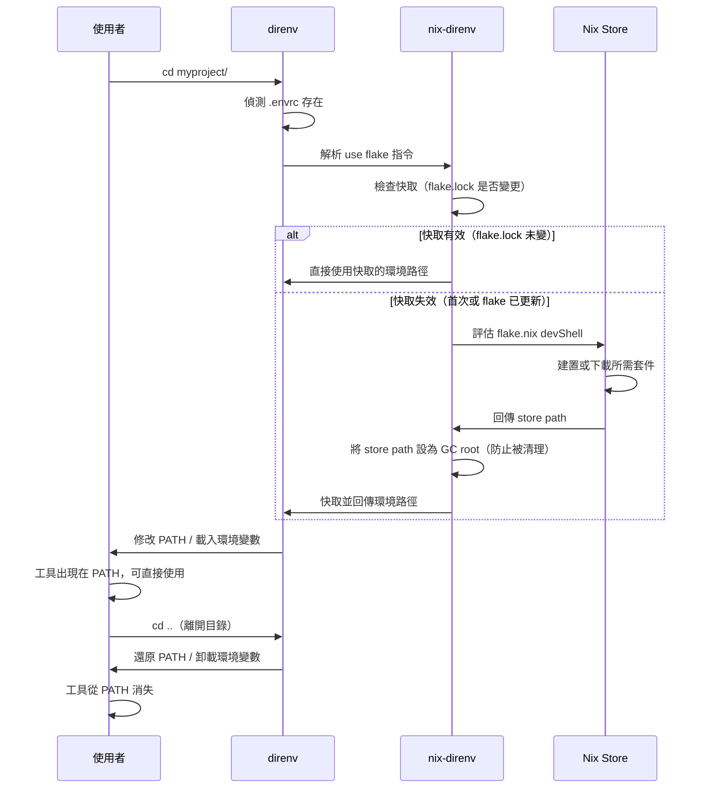
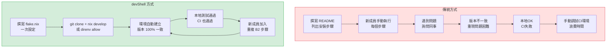

# 第16章：開發環境管理

---

## 本章學習目標

完成本章後，你將能夠：

1. 解釋為什麼 devShell 比全域安裝或 Docker 更適合管理開發工具鏈
2. 使用 `nix develop` 與 `nix shell` 進入和使用隔離的開發環境
3. 撰寫 `flake.nix` 中的 `devShells` 輸出，定義 Python、Rust、Go、Node.js 各語言環境
4. 整合 `direnv` 與 `nix-direnv`，實現進入目錄時自動載入、離開時自動卸載
5. 理解 `flake.lock` 如何保障環境的可重現性，並應用於 CI/CD 流程

---

## 前置知識

- 已完成第15章（桌面環境配置）
- 熟悉 `flake.nix` 的基本結構（`inputs`、`outputs`）
- 理解 Nix Store 的隔離概念（第4章）
- 第12章中已在系統層啟用 `direnv` 與 `nix-direnv`，本章直接使用

> **提示**：若你對 Flakes 的 `outputs` 結構仍不熟悉，建議先快速瀏覽第17章的前半部，再回頭閱讀本章的 16.3 至 16.9 節。本章範例均為可獨立運作的完整 `flake.nix`，即使不完全理解 Flakes 也能直接複製使用。

---

## 16.1 為什麼需要 devShell

### 傳統開發環境的三個大問題

在傳統 Linux 工作流程中，安裝開發工具通常有兩種方式：

**方式一：全域安裝（Global Install）**

```bash
sudo apt install python3 python3-pip nodejs npm rustup
pip install flask requests black
npm install -g typescript ts-node
```

**方式二：語言內部虛擬環境**

```bash
python3 -m venv .venv
source .venv/bin/activate
pip install -r requirements.txt
```

這兩種方式都有根本性的問題：

**問題 1：全域安裝污染系統**

- 安裝 A 專案的 `requests 2.28` 後，B 專案需要 `requests 2.31`
- 升級 Node.js 版本可能破壞已有專案
- `pip install --user` 的套件散落在家目錄，難以追蹤

**問題 2：版本衝突無法共存**

- 你的 Python 專案需要 Python 3.10，但另一個專案需要 Python 3.12
- `nvm`、`pyenv`、`rbenv` 等工具各自為政，設定繁瑣
- 工具版本在不同機器上容易不一致

**問題 3：「在我電腦上可以跑」**

這是軟體開發中最令人頭痛的場景：

```text
開發者 A：「我這邊測試過了，沒問題。」
開發者 B：「我 clone 下來跑不起來，缺少 libssl 1.1。」
CI 伺服器：「Build failed: gcc version mismatch」
```

根本原因是：**沒有人記錄環境的精確狀態**。

---

### devShell 的解法

NixOS 的 devShell（開發 Shell 環境）用一句話解決了上述所有問題：

> 每個專案攜帶自己完整的工具鏈描述，進入時自動建立，離開後不留痕跡。

下圖是 devShell 的完整工作流程：



工具不安裝到系統，只存在於 `/nix/store` 中，由 Nix 管理生命週期。

---

### devShell vs 其他方案的比較

| 方案 | 隔離性 | 可重現性 | 跨語言 | 系統整合 | 額外資源 |
|---|---|---|---|---|---|
| 全域安裝 | 無 | 低 | 是 | 好 | 無 |
| virtualenv (Python) | 部分 | 中 | 否（僅 Python） | 一般 | 無 |
| Docker | 高 | 高 | 是 | 差（需 bind mount） | 高（映像大小） |
| devShell (Nix) | 高 | 極高 | 是 | 好 | 低（共用 Nix Store） |
| systemPackages | 系統全局 | 高 | 是 | 極好 | 無 |

**`systemPackages` vs devShell 的關鍵差異：**

- `systemPackages`：安裝到系統的所有使用者都可使用，適合日常工具（`git`、`vim`、`curl`）
- devShell：只在特定專案目錄內存在，適合語言編譯器、特定版本的 CLI 工具、專案相依的 linter

一個原則是：

> 如果每個專案需要的版本可能不同，用 devShell。如果是全系統通用工具，用 systemPackages。

---

## 16.2 `nix develop`：進入開發環境

### 基本使用方式

在含有 `flake.nix` 的專案目錄中，執行：

```bash
nix develop
```

Nix 會讀取 `flake.nix` 中的 `devShells.${system}.default`，建立環境並啟動一個新的 shell（預設是 `bash`）。

進入後可以確認工具已在 PATH 中：

```bash
which python3
# /nix/store/abc123.../bin/python3

python3 --version
# Python 3.12.7

exit
# 離開後，python3 的路徑消失（若系統原本沒有安裝）
```

---

### 指定不同的 Shell

如果你習慣使用 `zsh` 或 `fish`：

```bash
# 進入 devShell 但使用 zsh 作為互動式 shell
nix develop --command zsh

# 直接執行指令後退出（適合腳本呼叫）
nix develop --command bash -c "python3 --version && pytest"
```

`--command` 後面的所有參數都傳給新 shell，devShell 的環境變數和 PATH 仍然有效。

---

### 多個 devShell

一個 `flake.nix` 可以定義多個具名的 devShell：

```bash
# 進入預設（default）devShell
nix develop

# 進入名為 backend 的 devShell
nix develop .#backend

# 進入名為 frontend 的 devShell
nix develop .#frontend

# 進入遠端 flake 的 devShell（臨時試用）
nix develop github:someuser/someproject
```

`.#backend` 中的 `.` 表示「目前目錄的 flake」，`#backend` 指定 outputs 中的 key。

---

### 臨時使用套件：`nix shell`

不需要定義 devShell，也可以臨時呼叫工具：

```bash
# 臨時使用 ripgrep 和 fd，不安裝到系統
nix shell nixpkgs#ripgrep nixpkgs#fd

# 直接執行並退出
nix shell nixpkgs#cowsay --command cowsay "Hello NixOS"

# 指定特定版本（透過 flake ref）
nix shell nixpkgs/nixos-24.11#nodejs_20
```

`nix shell` 不需要 `flake.nix`，直接從 nixpkgs 拉取套件。適合一次性工作或快速測試。

---

### `nix run`：執行而不安裝

如果只想執行一個程式，不需要進入互動式 shell：

```bash
# 直接執行 hello 程式
nix run nixpkgs#hello

# 執行特定版本的工具
nix run nixpkgs#nodejs_22 -- --version

# 執行 flake 定義的 app
nix run .#myapp
```

`nix run` 非常適合 CI/CD 腳本中一次性執行工具，或在不污染環境的情況下試用程式。

---

## 16.3 `pkgs.mkShell`：定義開發環境

### 基本 mkShell 結構

`pkgs.mkShell` 是 Nixpkgs 提供的輔助函式，用來定義開發環境。它的完整參數如下：

在解釋參數之前，先看一個最基本的範例，建立一個有 Python 和 Git 的開發環境：

```nix
# 這是 flake.nix 中 devShell 定義的核心部分
# 完整 flake.nix 結構見下方
pkgs.mkShell {
  # 執行期與建置期依賴（對於直譯語言，兩者相同）
  packages = [
    pkgs.python3
    pkgs.git
  ];

  # 進入 shell 時自動執行的腳本
  shellHook = ''
    echo "Python $(python3 --version) ready"
  '';
}
```

---

### `buildInputs` 與 `nativeBuildInputs` 的差異

這是初學者最常搞混的部分。簡單區分：

| 參數 | 用途 | 典型例子 |
|---|---|---|
| `buildInputs` | 執行期依賴：程式執行時需要連結的函式庫 | `openssl`、`sqlite`、`zlib` |
| `nativeBuildInputs` | 建置期依賴：編譯時需要的工具，執行時不需要 | `gcc`、`cmake`、`pkg-config` |
| `packages` | 新的統一 API，同時加入兩者（開發環境中推薦使用） | `python3`、`nodejs`、`rustc` |

對於開發環境而言，`packages` 是最簡單的選擇。`buildInputs` 和 `nativeBuildInputs` 在撰寫 Nix derivation（打包套件）時更重要，在 mkShell 中區分的必要性較低。

```nix
pkgs.mkShell {
  # 開發環境推薦：直接用 packages
  packages = with pkgs; [
    gcc
    cmake
    openssl
    pkg-config
  ];

  # 若需要明確區分（例如交叉編譯場景）：
  # nativeBuildInputs = [ pkgs.gcc pkgs.cmake pkgs.pkg-config ];
  # buildInputs = [ pkgs.openssl pkgs.zlib ];
}
```

---

### `shellHook`：自動執行初始化腳本

`shellHook` 是一段 bash 腳本，在進入 devShell 時自動執行。常見用途：

```nix
pkgs.mkShell {
  packages = [ pkgs.python3 pkgs.postgresql ];

  shellHook = ''
    # 設定環境變數
    export DATABASE_URL="postgresql://localhost/myapp_dev"
    export DEBUG=1

    # 顯示歡迎訊息
    echo "================================================"
    echo " myapp 開發環境已就緒"
    echo " Python: $(python3 --version)"
    echo " 資料庫: $DATABASE_URL"
    echo "================================================"

    # 自動建立 Python venv（若不存在）
    if [ ! -d .venv ]; then
      python3 -m venv .venv
      echo "已建立 .venv"
    fi

    # 啟用 venv
    source .venv/bin/activate
    echo "已啟用 .venv，pip 套件從此處讀取"
  '';
}
```

---

### 完整的通用 flake.nix devShell 範例

這是一個完整可直接使用的 `flake.nix`，示範了所有核心概念。可作為新專案的起點：

```nix
# flake.nix — 通用開發環境模板
{
  description = "通用開發環境";

  inputs = {
    # 固定使用 nixos-25.05 穩定分支
    nixpkgs.url = "github:NixOS/nixpkgs/nixos-25.05";

    # flake-utils 簡化多平台（x86_64-linux、aarch64-linux、x86_64-darwin）的處理
    flake-utils.url = "github:numtide/flake-utils";
  };

  outputs = { self, nixpkgs, flake-utils }:
    # eachDefaultSystem 自動為所有常見平台產生輸出
    flake-utils.lib.eachDefaultSystem (system:
      let
        pkgs = nixpkgs.legacyPackages.${system};
      in
      {
        # 預設 devShell（執行 `nix develop` 時進入）
        devShells.default = pkgs.mkShell {
          packages = with pkgs; [
            # 版本控制
            git
            git-lfs

            # 文字處理
            ripgrep
            fd
            jq

            # 通用建置工具
            gnumake
            pkg-config
          ];

          shellHook = ''
            echo "開發環境版本："
            echo "  Git    : $(git --version)"
            echo "  Make   : $(make --version | head -1)"
            echo ""
            echo "提示：執行 'make help' 查看可用指令"
          '';
        };
      }
    );
}
```

使用方式：

```bash
# 初始化（僅首次需要）
git init
git add flake.nix

# 進入開發環境
nix develop

# 查看 lock 檔（自動產生，需提交到版本控制）
cat flake.lock
```

---

## 16.4 Python 開發環境

### `python3.withPackages`：整合 Python 與其套件

Nix 提供了一種特殊的方式來建立「帶有特定套件的 Python 解譯器」，稱為 `withPackages`。

`python3.withPackages` 的好處是：所有套件都固定在 Nix Store 中，**不依賴** `pip install` 的結果，環境完全可重現。

```nix
# 在 devShell 的 packages 中使用 withPackages
packages = [
  # 這個 python3 已包含 flask 和 requests
  (pkgs.python3.withPackages (ps: with ps; [
    flask
    requests
    black
    pytest
    mypy
  ]))
];
```

`ps` 是 `pkgs.python3Packages` 的縮寫，包含了 nixpkgs 中所有可用的 Python 套件。

---

### `pkgs.python3Packages` 的常用套件

以下是常用 Python 套件在 nixpkgs 中的對應名稱：

| pip 套件名稱 | nixpkgs 名稱 | 說明 |
|---|---|---|
| `flask` | `python3Packages.flask` | Web 框架 |
| `requests` | `python3Packages.requests` | HTTP 客戶端 |
| `black` | `python3Packages.black` | 程式碼格式化 |
| `pytest` | `python3Packages.pytest` | 測試框架 |
| `mypy` | `python3Packages.mypy` | 型別檢查 |
| `numpy` | `python3Packages.numpy` | 數值計算 |
| `pandas` | `python3Packages.pandas` | 資料分析 |
| `fastapi` | `python3Packages.fastapi` | 非同步 Web 框架 |
| `sqlalchemy` | `python3Packages.sqlalchemy` | ORM |

若找不到某個套件，可以搜尋：

```bash
nix search nixpkgs python3Packages.套件名稱
```

---

### 與 venv 整合：同時使用 Nix 和 pip

在實際開發中，有些套件可能不在 nixpkgs 中，或者你的團隊習慣用 `requirements.txt`。這時可以在 `shellHook` 中自動建立並啟用 venv：

```nix
shellHook = ''
  # 建立 venv（若不存在）
  if [ ! -d .venv ]; then
    python3 -m venv .venv
    .venv/bin/pip install -r requirements.txt
  fi
  source .venv/bin/activate
  echo "venv 已啟用，Python: $(python3 --version)"
'';
```

這樣 Nix 提供基礎工具（Python 解譯器、系統函式庫），venv 管理專案的 Python 套件。

---

### poetry2nix 概念簡介

若你的專案使用 `pyproject.toml` + Poetry 管理套件，`poetry2nix` 可以將 `poetry.lock` 轉換為完整的 Nix derivation，達到真正的可重現性（不依賴 pip 或 venv）。

```nix
# 進階用法：使用 poetry2nix（需要額外的 input）
inputs.poetry2nix.url = "github:nix-community/poetry2nix";
```

本書第六篇進階章節會深入介紹 `poetry2nix`。本章以 `withPackages` + `venv` 為主。

---

### 完整範例：Flask 開發環境

以下是一個可以直接複製使用的完整 Flask 開發環境：

```nix
# flake.nix — Flask 開發環境
{
  description = "Flask 後端開發環境";

  inputs = {
    nixpkgs.url = "github:NixOS/nixpkgs/nixos-25.05";
    flake-utils.url = "github:numtide/flake-utils";
  };

  outputs = { self, nixpkgs, flake-utils }:
    flake-utils.lib.eachDefaultSystem (system:
      let
        pkgs = nixpkgs.legacyPackages.${system};

        # 定義帶有套件的 Python 解譯器
        pythonEnv = pkgs.python3.withPackages (ps: with ps; [
          flask          # Web 框架
          requests       # HTTP 客戶端
          black          # 程式碼格式化
          pytest         # 測試框架
          pytest-cov     # 測試覆蓋率
          mypy           # 靜態型別檢查
          python-dotenv  # 讀取 .env 檔案
          sqlalchemy     # 資料庫 ORM
          alembic        # 資料庫遷移
        ]);
      in
      {
        devShells.default = pkgs.mkShell {
          packages = [
            pythonEnv

            # 系統工具
            pkgs.git
            pkgs.postgresql_16  # psql 客戶端工具
            pkgs.redis           # redis-cli
          ];

          # 設定開發用環境變數
          env = {
            FLASK_ENV = "development";
            FLASK_DEBUG = "1";
          };

          shellHook = ''
            echo "========================================="
            echo " Flask 開發環境"
            echo " Python : $(python3 --version)"
            echo " Flask  : $(python3 -c 'import flask; print(flask.__version__)')"
            echo "========================================="
            echo ""
            echo "常用指令："
            echo "  flask run          啟動開發伺服器"
            echo "  pytest             執行測試"
            echo "  black .            格式化程式碼"
            echo "  mypy app/          型別檢查"
          '';
        };
      }
    );
}
```

進入環境後即可開始開發：

```bash
nix develop
flask run --host=0.0.0.0 --port=5000
```

---

## 16.5 Rust 開發環境

### Nixpkgs 提供的 Rust 工具鏈

Rust 工具鏈有兩種主要來源：

**方式一：`pkgs.rustup`（官方版本管理器）**

```nix
packages = [ pkgs.rustup ];
# 進入後需手動執行 rustup toolchain install stable
```

優點：與官方工作流程一致。缺點：每次建立環境都需要下載工具鏈，且使用 `~/.rustup` 存放，破壞了 Nix 的完全隔離性。

**方式二：`pkgs.cargo`、`pkgs.rustc` 等（Nixpkgs 內建）**

```nix
packages = with pkgs; [
  rustc    # Rust 編譯器
  cargo    # 套件管理器與建置工具
  clippy   # Linter（rust-clippy）
  rustfmt  # 程式碼格式化
];
```

優點：完全由 Nix 管理，可重現。缺點：版本固定在 nixpkgs 的 Rust 版本（通常是最新 stable）。

**方式三：`fenix`（建議的進階方案）**

`fenix` 是 nix-community 維護的 Rust 工具鏈套件，可以精確指定 Rust 版本（stable、beta、nightly 或特定日期）。本章以 Nixpkgs 內建為主，第六篇進階章節會介紹 fenix。

---

### `RUST_SRC_PATH`：讓 rust-analyzer 正確運作

`rust-analyzer`（Rust 語言伺服器）需要知道標準庫的原始碼位置，才能提供完整的程式碼補全和跳轉功能。

```nix
shellHook = ''
  # 告訴 rust-analyzer 標準庫原始碼在哪裡
  export RUST_SRC_PATH="${pkgs.rustPlatform.rustLibSrc}"
  echo "RUST_SRC_PATH 已設定"
'';
```

沒有設定這個變數，rust-analyzer 可能無法跳轉到標準庫函式的定義，或顯示警告訊息。

---

### 完整範例：含 rust-analyzer 的 Rust 開發環境

```nix
# flake.nix — Rust 開發環境
{
  description = "Rust 開發環境（含 rust-analyzer）";

  inputs = {
    nixpkgs.url = "github:NixOS/nixpkgs/nixos-25.05";
    flake-utils.url = "github:numtide/flake-utils";
  };

  outputs = { self, nixpkgs, flake-utils }:
    flake-utils.lib.eachDefaultSystem (system:
      let
        pkgs = nixpkgs.legacyPackages.${system};
      in
      {
        devShells.default = pkgs.mkShell {
          packages = with pkgs; [
            # Rust 核心工具鏈
            rustc          # 編譯器
            cargo          # 套件管理器與建置系統
            clippy         # 進階 Linter（cargo clippy）
            rustfmt        # 格式化（cargo fmt）
            rust-analyzer  # Language Server Protocol (LSP) 伺服器

            # 除錯工具（二選一）
            lldb           # LLVM Debugger（推薦用於 Rust）
            # gdb           # GNU Debugger（較舊，可選）

            # 常用系統函式庫（若你的專案需要）
            openssl
            pkg-config
            libiconv

            # 建置工具
            gcc            # 連結器（rustc 預設使用 gcc 作為 linker）
          ];

          # 環境變數
          shellHook = ''
            # rust-analyzer 需要此路徑才能解析標準庫
            export RUST_SRC_PATH="${pkgs.rustPlatform.rustLibSrc}"

            # openssl 函式庫路徑（某些 crate 需要）
            export PKG_CONFIG_PATH="${pkgs.openssl.dev}/lib/pkgconfig"

            # 啟用 Rust backtrace（除錯用）
            export RUST_BACKTRACE=1

            echo "====================================="
            echo " Rust 開發環境"
            echo " rustc  : $(rustc --version)"
            echo " cargo  : $(cargo --version)"
            echo " clippy : $(cargo clippy --version)"
            echo "====================================="
            echo ""
            echo "常用指令："
            echo "  cargo build      編譯"
            echo "  cargo test       執行測試"
            echo "  cargo clippy     Linter 檢查"
            echo "  cargo fmt        格式化程式碼"
            echo "  cargo run        編譯並執行"
          '';
        };
      }
    );
}
```

這個環境包含了日常 Rust 開發所需的一切，包含 LSP 整合所需的 `RUST_SRC_PATH`，進入環境後你的編輯器（VS Code、Neovim 等）會自動從環境中找到 `rust-analyzer`。

---

## 16.6 Go 開發環境

### `pkgs.go` 與 Go Modules

現代 Go 開發（Go 1.11 以後）使用 **Go Modules**（`go.mod`）管理依賴，不再依賴 `GOPATH` 的目錄結構。

傳統的 `GOPATH` 工作流程要求：

```bash
# 舊的 GOPATH 方式（不推薦）
mkdir -p ~/go/src/github.com/myuser/myproject
cd ~/go/src/github.com/myuser/myproject
```

現代 Go Modules 方式：

```bash
# 在任何目錄建立專案
mkdir myproject && cd myproject
go mod init github.com/alice/myproject
# GOPATH 僅用於快取，不影響專案位置
```

因此，在 devShell 中設定 `GOPATH` 主要是為了快取位置，不影響開發流程。

---

### Go 開發工具鏈

| 工具 | nixpkgs 名稱 | 說明 |
|---|---|---|
| Go 編譯器 | `pkgs.go` | 包含 `go build`、`go test`、`go mod` 等 |
| Language Server | `pkgs.gopls` | Go 的 LSP 伺服器，提供程式碼補全 |
| 除錯器 | `pkgs.delve` | Go 專用除錯器（`dlv` 指令） |
| 靜態分析 | `pkgs.golangci-lint` | 整合多個 linter 的工具 |
| 格式化 | 內建 `gofmt` | 已包含在 `pkgs.go` 中 |

---

### 完整範例：Go Web 服務開發環境

```nix
# flake.nix — Go Web 服務開發環境
{
  description = "Go 後端開發環境";

  inputs = {
    nixpkgs.url = "github:NixOS/nixpkgs/nixos-25.05";
    flake-utils.url = "github:numtide/flake-utils";
  };

  outputs = { self, nixpkgs, flake-utils }:
    flake-utils.lib.eachDefaultSystem (system:
      let
        pkgs = nixpkgs.legacyPackages.${system};
      in
      {
        devShells.default = pkgs.mkShell {
          packages = with pkgs; [
            # Go 核心工具鏈（包含 go build/test/mod/fmt 等）
            go

            # 開發工具
            gopls           # Language Server（LSP）
            delve           # 除錯器（dlv 指令）
            golangci-lint   # 整合 Linter

            # 常用輔助工具
            git
            gnumake
            curl
            jq

            # 若需要 CGo（呼叫 C 函式庫）
            gcc
            pkg-config
          ];

          shellHook = ''
            # Go module 快取位置（可選，預設在 ~/go）
            export GOPATH="$HOME/go"
            export PATH="$GOPATH/bin:$PATH"

            # 停用 CGo（若不需要呼叫 C，純 Go 更安全且可移植）
            # export CGO_ENABLED=0

            echo "====================================="
            echo " Go 開發環境"
            echo " go    : $(go version)"
            echo " gopls : $(gopls version 2>/dev/null | head -1 || echo '已安裝')"
            echo " dlv   : $(dlv version | head -1)"
            echo "====================================="
            echo ""
            echo "常用指令："
            echo "  go mod tidy      整理依賴"
            echo "  go build ./...   編譯"
            echo "  go test ./...    執行測試"
            echo "  go run main.go   執行"
            echo "  dlv debug        啟動除錯器"
          '';
        };
      }
    );
}
```

---

## 16.7 Node.js 開發環境

### 選擇 Node.js 版本

Nixpkgs 提供多個 Node.js 版本並行：

```nix
pkgs.nodejs_20   # Node.js 20 LTS（Iron）
pkgs.nodejs_22   # Node.js 22 LTS（Jod）— 目前推薦
pkgs.nodejs_23   # Node.js 23（Current）
```

對於新專案，建議使用 `nodejs_22`（LTS 版本，長期支援至 2027 年）。

---

### 套件管理器選擇

| 工具 | nixpkgs 名稱 | 說明 |
|---|---|---|
| npm | 內建於 `nodejs_22` | 預設隨 Node.js 附帶 |
| pnpm | `pkgs.nodePackages.pnpm` 或 `pkgs.pnpm` | 效能更好，磁碟共用 |
| yarn | `pkgs.yarn` | Facebook 開發的替代品 |
| bun | `pkgs.bun` | 新世代 JS Runtime + 套件管理器 |

```nix
# 推薦組合：Node.js 22 + pnpm
packages = with pkgs; [
  nodejs_22
  nodePackages.pnpm
];
```

---

### `NODE_PATH` 與 nvm 整合

**`NODE_PATH` 的用途：**

```nix
shellHook = ''
  # 設定 node_modules/.bin 路徑（讓專案本機安裝的工具可直接呼叫）
  export PATH="$PWD/node_modules/.bin:$PATH"
'';
```

**與 `.nvmrc` 整合（透過 direnv）：**

若你的團隊中有人使用 `nvm`，可以在 `.envrc` 中同時支援兩種方式：

```bash
# .envrc — 同時支援 nvm 和 nix develop
if command -v nvm &> /dev/null; then
  nvm use
else
  use flake
fi
```

但在 NixOS 的 devShell 工作流程中，`nix develop` 是更佳選擇，因為版本由 `flake.lock` 精確鎖定，不依賴使用者是否安裝了正確版本的 nvm。

---

### 完整範例：Next.js 開發環境

```nix
# flake.nix — Next.js 前端開發環境
{
  description = "Next.js 前端開發環境";

  inputs = {
    nixpkgs.url = "github:NixOS/nixpkgs/nixos-25.05";
    flake-utils.url = "github:numtide/flake-utils";
  };

  outputs = { self, nixpkgs, flake-utils }:
    flake-utils.lib.eachDefaultSystem (system:
      let
        pkgs = nixpkgs.legacyPackages.${system};
      in
      {
        devShells.default = pkgs.mkShell {
          packages = with pkgs; [
            # Node.js 22 LTS（包含 npm）
            nodejs_22

            # 套件管理器（推薦 pnpm，效能更佳）
            nodePackages.pnpm

            # TypeScript 相關工具
            nodePackages.typescript
            nodePackages.typescript-language-server  # LSP for VS Code / Neovim

            # 程式碼品質工具
            # eslint 和 prettier 通常安裝在 node_modules，不需要全域安裝

            # 開發輔助
            git
            curl
            jq
          ];

          shellHook = ''
            # 將 node_modules/.bin 加入 PATH
            # 讓 next、eslint 等本機指令可直接呼叫
            export PATH="$PWD/node_modules/.bin:$PATH"

            # pnpm 全域 bin 路徑（若有全域安裝工具）
            export PNPM_HOME="$HOME/.local/share/pnpm"
            export PATH="$PNPM_HOME:$PATH"

            echo "======================================="
            echo " Next.js 開發環境"
            echo " Node   : $(node --version)"
            echo " npm    : $(npm --version)"
            echo " pnpm   : $(pnpm --version)"
            echo " tsc    : $(tsc --version)"
            echo "======================================="
            echo ""
            echo "初次設定："
            echo "  pnpm install     安裝依賴"
            echo ""
            echo "開發指令："
            echo "  pnpm dev         啟動開發伺服器"
            echo "  pnpm build       產生生產版本"
            echo "  pnpm lint        ESLint 檢查"
            echo "  pnpm test        執行測試"
          '';
        };
      }
    );
}
```

---

### 多個 devShell：前後端分離

一個 `flake.nix` 也可以同時定義多個環境：

```nix
# flake.nix — 全端開發（前端 + 後端各一個 devShell）
outputs = { self, nixpkgs, flake-utils }:
  flake-utils.lib.eachDefaultSystem (system:
    let
      pkgs = nixpkgs.legacyPackages.${system};
    in
    {
      devShells = {
        # 預設環境（nix develop）：包含前後端全部工具
        default = pkgs.mkShell {
          packages = with pkgs; [ nodejs_22 nodePackages.pnpm go gopls ];
        };

        # 前端專用（nix develop .#frontend）
        frontend = pkgs.mkShell {
          packages = with pkgs; [ nodejs_22 nodePackages.pnpm ];
          shellHook = ''echo "前端開發環境（Node.js $(node --version)）"'';
        };

        # 後端專用（nix develop .#backend）
        backend = pkgs.mkShell {
          packages = with pkgs; [ go gopls delve golangci-lint ];
          shellHook = ''echo "後端開發環境（$(go version)）"'';
        };
      };
    }
  );
```

---

## 16.8 direnv 與自動環境切換

### 回顧：系統層的 direnv 設定

在第12章，我們已在 `configuration.nix` 中啟用了 `direnv` 和 `nix-direnv`：

```nix
# /etc/nixos/configuration.nix（第12章已設定）
{ config, pkgs, lib, ... }:
{
  # 啟用 direnv 整合（會修改 shell 的 PS1 並安裝 hook）
  programs.direnv.enable = true;

  # nix-direnv：提供 use flake 指令，並加入快取機制
  programs.direnv.nix-direnv.enable = true;
}
```

這個設定讓 `direnv` 和 `nix-direnv` 的所有功能在系統上可用。本節專注在專案端的設定。

---

### `.envrc` 的 `use flake` 指令

在有 `flake.nix` 的專案目錄中，建立 `.envrc` 檔案：

```bash
# .envrc
use flake
```

這一行指令告訴 direnv：「使用此目錄的 `flake.nix` 來建立開發環境」。

第一次需要授權：

```bash
cd /path/to/myproject
# direnv 偵測到 .envrc 但尚未授權
# direnv: error .envrc is blocked. Run `direnv allow` to approve its content.

direnv allow
# direnv: loading .envrc
# direnv: using flake
# 開發環境載入完成
```

之後每次 `cd` 進入目錄，環境自動載入；`cd` 離開後自動卸載。

---

### `use flake` vs `use nix`（重要區分）

| 指令 | 對應 API | 說明 |
|---|---|---|
| `use flake` | flake.nix devShells | **現代方式**，支援 flake，有快取 |
| `use nix` | shell.nix | **舊方式**，不支援 flake，每次重新評估 |

> 永遠使用 `use flake`，而不是 `use nix`。

`use nix` 是 nix-direnv 2.x 之前的舊 API，不支援 `flake.nix`。如果你在網路上看到 `.envrc` 中使用 `use nix`，那是過時的範例。

進階用法：指定具名的 devShell：

```bash
# .envrc — 指定使用 backend devShell
use flake .#backend

# .envrc — 使用遠端 flake（不推薦，版本難以控制）
# use flake github:someuser/someproject
```

---

### `nix-direnv` 的快取機制

`nix-direnv` 最重要的功能是**快取**，避免每次進入目錄時都重新評估 flake，大幅縮短環境載入時間。

沒有 nix-direnv（純 direnv + nix）：

```text
cd myproject
→ 評估 flake.nix（可能需要 5–30 秒）
→ 建立環境符號連結
→ 載入環境（每次 cd 都重複）
```

有 nix-direnv：

```text
cd myproject（第一次）
→ 評估 flake.nix（5–30 秒，僅一次）
→ 將結果快取為 GC root（防止被垃圾回收）

cd myproject（之後每次）
→ 讀取快取（< 1 秒）
→ 載入環境
```

快取在 `flake.lock` 沒有變更時持續有效。當你執行 `nix flake update` 更新依賴後，下次進入目錄時會自動重新評估並更新快取。

---

### 多語言專案：前後端各自的 devShell

以下是一個全端專案的目錄結構範例，前後端各自管理自己的開發環境：

```text
myapp/
├── flake.nix          # 頂層 flake（選填）
├── .envrc             # 頂層：use flake（載入全端環境）
│
├── frontend/
│   ├── flake.nix      # 前端 flake
│   ├── .envrc         # use flake（載入 Next.js 環境）
│   └── src/
│
└── backend/
    ├── flake.nix      # 後端 flake
    ├── .envrc         # use flake（載入 Go 環境）
    └── cmd/
```

每個子目錄都有自己的 `flake.nix` 和 `.envrc`，`cd` 進入哪個目錄就自動載入哪個環境。

direnv 支援**巢狀**：離開 `backend/` 回到 `myapp/` 時，自動切換回頂層環境。

---

### direnv + nix-direnv + devShell 的互動流程

以下 Mermaid 圖展示完整的自動環境切換流程：



整個過程完全自動，使用者只需要 `cd` 進出目錄。

---

### 實際操作示範

以 alice 使用者為例，完整的設定流程：

```bash
# 1. 建立新專案
mkdir -p ~/projects/myflaskapp
cd ~/projects/myflaskapp

# 2. 建立 flake.nix（複製 16.4 的 Flask 範例）
# ... 建立 flake.nix ...

# 3. 建立 .envrc
echo "use flake" > .envrc

# 4. 授權 direnv
direnv allow
# direnv: loading ~/projects/myflaskapp/.envrc
# direnv: using flake
# =========================================
#  Flask 開發環境
#  Python : Python 3.12.7
#  Flask  : 3.0.3
# =========================================

# 5. 確認環境已載入
which python3
# /nix/store/xxx-python3-3.12.7-env/bin/python3

# 6. 離開目錄，環境自動卸載
cd ~
which python3
# /run/current-system/sw/bin/python3（系統版本）
# 或 "python3 not found"（若系統未安裝）
```

---

## 16.9 可重現開發環境的價值

### CI/CD 使用同一個 flake.nix

devShell 最深遠的影響，是讓**開發環境 = CI 環境**成為現實。

傳統 CI/CD 的痛點：

```text
本地開發：macOS + pyenv + Python 3.12.3
CI 環境：Ubuntu 22.04 + apt + Python 3.10.12（版本不同！）
→ 測試通過，部署失敗
→ CI 通過，本地重現困難
```

使用 flake.nix 的方式：

```yaml
# .github/workflows/ci.yml
name: CI

on: [push, pull_request]

jobs:
  test:
    runs-on: ubuntu-latest
    steps:
      - uses: actions/checkout@v4

      # 安裝 Nix（含 flake 支援）
      - uses: cachix/install-nix-action@v27
        with:
          nix_path: nixpkgs=channel:nixos-25.05

      # 使用與本地完全相同的 devShell 執行測試
      - name: Run tests
        run: nix develop --command bash -c "pytest tests/"
```

`nix develop --command` 進入的環境與本地 `nix develop` 完全相同，因為兩者都讀取同一個 `flake.lock`，工具版本 bit-for-bit 一致。

---

### 新成員入職：`git clone` + `nix develop` = 完整環境

這是 devShell 帶來的最大實際效益：

**傳統入職流程（以 Python 後端為例）：**

```text
Day 1 上午：
  - 閱讀 README，安裝 pyenv
  - 安裝 Python 3.12（下載時間 10 分鐘）
  - 建立 venv，pip install -r requirements.txt
  - 發現 requirements.txt 缺少某個依賴
  - 找資深同事詢問

Day 1 下午：
  - 安裝 PostgreSQL（版本要看 README 才知道）
  - 設定 .env 檔案
  - 執行 migrate，發現 database driver 版本衝突
  - ...

預計完整可開發狀態：1–2 天
```

**NixOS devShell 入職流程：**

```bash
git clone git@github.com:mycompany/myapp.git
cd myapp
direnv allow   # 或：nix develop
# 完成

# 整個過程：5–15 分鐘（主要是下載時間）
# 環境版本與其他人 100% 一致
```

---

### `flake.lock`：精確鎖定所有依賴版本

`flake.lock` 是 Nix Flakes 的依賴版本鎖定檔，與 `package-lock.json`（npm）或 `Cargo.lock`（Rust）的概念相同：

```json
// flake.lock（自動產生，不應手動修改）
{
  "nodes": {
    "nixpkgs": {
      "locked": {
        "lastModified": 1747500000,
        "narHash": "sha256-xxxxxxxxxxxxxxxxxxxxxxxxxxxxxxxxxxxxxxxxxxxxxxxxxxxxxxxxxxxxxxxx",
        "owner": "NixOS",
        "repo": "nixpkgs",
        "rev": "a3a3a3a3a3a3a3a3a3a3a3a3a3a3a3a3a3a3a3a3",
        "type": "github"
      }
    }
  }
}
```

`rev` 欄位是 nixpkgs GitHub 的特定 commit hash，決定了每個套件的精確版本。

**關鍵操作：**

```bash
# 更新所有依賴到最新版本
nix flake update

# 只更新特定 input
nix flake update nixpkgs

# 查看更新了哪些東西
nix flake update 2>&1 | grep "Updated"

# 注意：更新後需要重新測試，確認沒有破壞性變更
```

`flake.lock` **必須提交到版本控制**（git add flake.lock），這樣所有人拿到同一份 lock 檔，就能得到完全相同的環境。

---

### 分享環境給不使用 NixOS 的同事

devShell 不限於 NixOS，Nix 是跨平台工具，可在以下環境使用：

| 環境 | 安裝方式 |
|---|---|
| **NixOS** | 原生支援，無需額外設定 |
| **Linux（任何發行版）** | 安裝 Nix 套件管理器：`sh <(curl -L https://nixos.org/nix/install)` |
| **macOS（nix-darwin）** | 安裝 Nix 後，同樣可以 `nix develop` |
| **Windows（WSL2）** | 在 WSL2 Ubuntu 中安裝 Nix，完全相容 |

意味著：

- 你在 NixOS 寫的 `flake.nix`，macOS 的同事可以直接使用
- CI 使用 GitHub Actions（Ubuntu），也能用同一份 flake
- 不同作業系統的差異被 Nix 抽象化，工具版本保持一致

只有 `nixosConfigurations`（系統層配置）是 NixOS 專用的，`devShells` 是跨平台的。

---

### 對比傳統方式的 onboarding 時間

下圖用 Mermaid 對比兩種開發環境管理方式的完整生命週期：



---

### devShell 的「wow factor」

在你完整體驗過 devShell 工作流程後，你可能會注意到一件事：

你**不再需要**：

- `pyenv`、`nvm`、`rbenv`、`rustup`（語言版本管理器）
- Docker Compose 只是為了提供一致的工具版本
- 一份「必讀的新人設定文件」
- 「在我電腦上沒這個問題」的困境
- CI 環境和本地環境不一致的除錯地獄

你**得到**的是：

- 專案目錄 = 完整的環境定義
- `git clone` 就是完整的 onboarding
- 開發、CI、同事電腦 — 同一個環境，三個地方
- 換電腦、重灌系統 — 一條指令還原所有開發環境

這種能力，是 Flakes 系統真正威力的第一個預告。

在接下來的第五篇，我們會深入了解 Flakes 的完整架構：不只是 devShell，還包括如何用 Flakes 管理整個 NixOS 系統配置、多主機部署，以及與 Home Manager 的整合。你在本章建立的 `flake.nix` 知識，將直接成為第17章的基礎。

---

## 本章小結

本章涵蓋了以下核心概念：

**16.1 為什麼需要 devShell**
- 全域安裝污染系統、版本衝突、環境不可重現是傳統方式的根本問題
- devShell 提供每個專案隔離的工具鏈，進入時出現，離開後消失

**16.2 `nix develop` 的使用方式**
- `nix develop` 進入預設 devShell
- `nix develop .#name` 指定具名 devShell
- `nix shell nixpkgs#tool` 臨時使用套件
- `nix run` 執行而不安裝

**16.3 `pkgs.mkShell` 的定義方式**
- `packages` 是現代推薦 API，同時涵蓋建置和執行期依賴
- `shellHook` 負責初始化環境變數和歡迎訊息
- `flake-utils.lib.eachDefaultSystem` 讓 flake 跨平台可用

**16.4–16.7 各語言環境**
- Python：`python3.withPackages` 建立帶套件的解譯器，搭配 shellHook 啟用 venv
- Rust：需設定 `RUST_SRC_PATH` 讓 rust-analyzer 正常運作
- Go：Go Modules 讓 GOPATH 不再是開發位置的限制
- Node.js：`nodejs_22` + `pnpm`，PATH 加入 `node_modules/.bin`

**16.8 direnv 自動切換**
- `.envrc` 中使用 `use flake`（不是 `use nix`）
- `nix-direnv` 提供快取，避免每次 cd 都重新評估 flake
- 進入目錄自動載入，離開自動卸載，完全透明

**16.9 可重現環境的價值**
- `flake.lock` 必須提交到版本控制
- 開發環境 = CI 環境，消除環境差異帶來的問題
- devShell 在 Linux、macOS、WSL2 均可使用
- onboarding 從幾天縮短到幾分鐘

---

### 本章練習

1. 在你的一個現有 Python 專案中建立 `flake.nix`，使用 `python3.withPackages` 替換 `requirements.txt` 中的前五個套件。
2. 建立一個同時包含 `default`、`frontend`、`backend` 三個 devShell 的 `flake.nix`，並用 `nix develop .#backend` 分別進入測試。
3. 在一個有 `flake.nix` 的專案中建立 `.envrc`（`use flake`），執行 `direnv allow`，然後來回 `cd` 幾次，觀察環境自動切換的行為。
4. 查看自動產生的 `flake.lock`，找到 nixpkgs 的 commit hash，在 GitHub 上確認這個 commit 對應到 `nixos-25.05` 分支的哪個時間點。
5. 嘗試在 `.github/workflows/ci.yml` 中加入 `nix develop --command bash -c "pytest"` 步驟，讓 CI 使用與本地相同的 Python 環境執行測試。

---

**下一章**：第17章將深入 Flakes 的完整架構，包括 `flake.nix` 的所有 outputs 類型（`nixosConfigurations`、`packages`、`apps`、`checks`），以及如何用 Flakes 管理整個 NixOS 系統。你在本章中對 `inputs`、`outputs`、`devShells` 的認識，將成為理解 Flakes 全貌的重要基礎。
