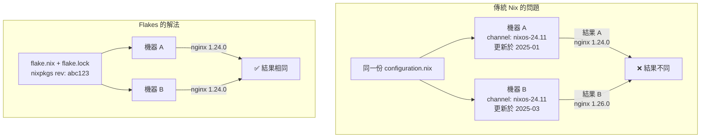
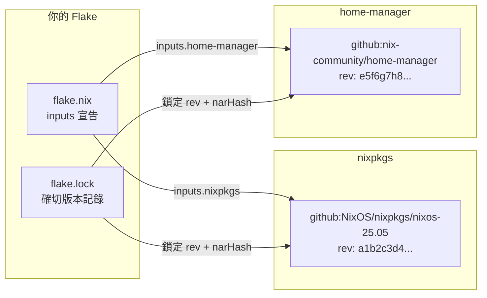
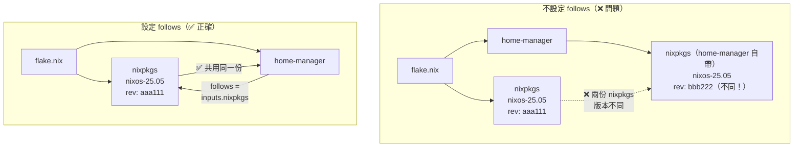
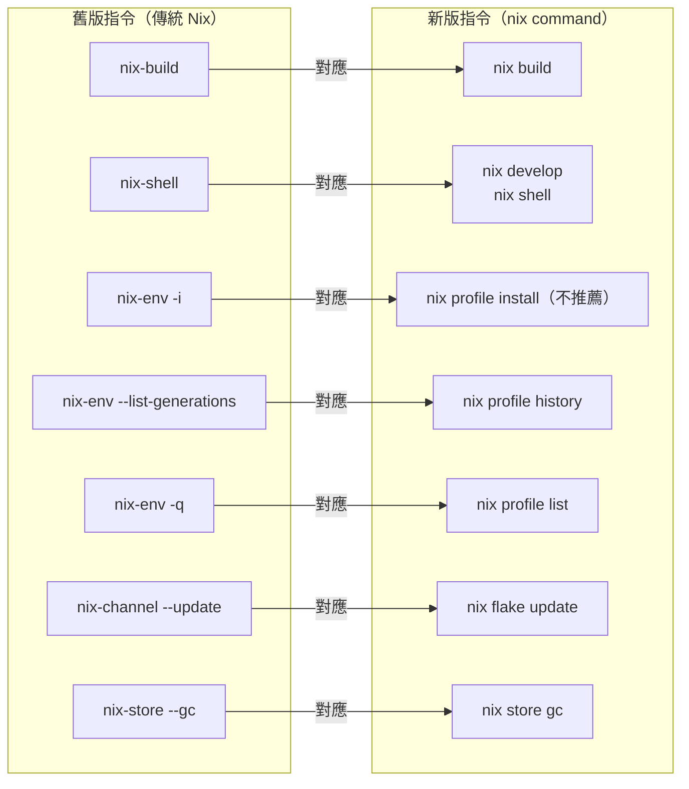

# 第17章：Flakes 基礎

Flake（可重現 Nix 套件）是 NixOS 現代化配置的核心機制。

它解決了傳統 Nix 最根本的缺陷：**不可重現性**。

如果你曾經遇過「明明配置一樣，但兩台機器結果不同」的困境，Flakes 就是為此而生的解決方案。

本章從問題出發，帶你理解 Flakes 的設計動機、核心結構與日常使用方式。

---

## 本章學習目標

完成本章後，你將能夠：

1. 說明 Flakes 解決了傳統 Nix 的哪三個核心問題
2. 讀懂並獨立撰寫完整的 `flake.nix`，包含 `inputs`、`outputs` 與各種輸出類型
3. 理解 `flake.lock` 的結構，以及為何它必須提交到 Git
4. 使用 `nix flake update`、`nix flake metadata` 管理依賴版本
5. 掌握新版 `nix` 指令（`nix build`、`nix develop`、`nix run`）並對應到舊版指令

---

## 前置知識

在開始本章之前，請確認你已經：

- 完成第一篇，理解 NixOS 的宣告式思維模型
- 完成第二篇，熟悉 Module System 基礎（第4–7章）
- 理解 Nix 語言的 attribute set、function、`let / in` 語法（第2章）
- 知道 `nixos-rebuild switch` 的基本用法（第3章）

---

## 17.1 傳統 Nix 的問題

在進入 Flakes 之前，先理解它為什麼存在。

傳統 Nix 有三個根本問題，長期困擾著使用者。

### 問題一：全域 nixpkgs channel 導致不可重現

傳統 NixOS 使用 channel（頻道）管理 nixpkgs 版本。

```bash
# 傳統做法：手動設定 channel
sudo nix-channel --add https://nixos.org/channels/nixos-24.11 nixos
sudo nix-channel --update
```

這個做法有一個致命缺陷：

**每台機器的 channel 版本各自獨立。**

機器 A 可能在一月更新了 channel，機器 B 可能在三月才更新。
兩台機器使用「同一份」`configuration.nix`，卻安裝了不同版本的套件。

結果：配置文件相同，但系統行為不同。這正是「不可重現」的根源。

### 問題二：沒有標準的入口點

傳統 Nix 生態中，不同用途使用不同慣例檔名：

| 檔名 | 用途 |
|---|---|
| `default.nix` | 預設建置入口 |
| `shell.nix` | 開發環境 |
| `release.nix` | CI/CD 建置 |
| `nixos/configuration.nix` | 系統配置 |

沒有統一規範。

當你拿到一個陌生的 Nix 專案，你不知道從哪裡開始看。
每個專案有自己的慣例，學習成本高，協作困難。

### 問題三：評估依賴「目前時間」等不純粹行為

Nix 語言本身允許一些「不純粹」的操作：

```nix
# 傳統 Nix 允許讀取環境變數
let
  homeDir = builtins.getEnv "HOME";  # 依賴執行環境
  currentTime = builtins.currentTime; # 依賴系統時鐘
in
  # 這樣的結果在不同環境會不同
```

這些操作讓建置結果與執行時的環境狀態綁定，破壞了可重現性。

### Flakes 如何解決這三個問題



Flakes 的解法對應三個問題：

1. **鎖定版本**：`flake.lock` 記錄每個依賴的確切 commit hash，不依賴 channel
2. **統一入口**：`flake.nix` 是唯一的標準入口點，所有輸出都在這裡宣告
3. **強制純粹性**：Flake 評估時禁止讀取環境變數與系統時鐘等不純粹操作

---

## 17.2 Flake 的核心概念

### 什麼是 Flake

Flake 的定義很簡單：

> 一個包含 `flake.nix` 的 Git repository，就是一個 Flake。

這個 `flake.nix` 宣告了兩件事：
- **依賴什麼**（`inputs`）：這個 Flake 需要哪些外部 Flake
- **提供什麼**（`outputs`）：這個 Flake 對外輸出哪些東西

Flake 之間透過 `inputs` 互相依賴，形成一個依賴樹。

### 純粹性（Purity）

Flake 採用**嚴格的純粹性模型**：

- Flake 只能依賴其他 Flake，不能讀取系統環境變數
- Nix 在評估 Flake 時，會設定一個隔離的沙箱環境
- 所有外部資源都必須透過 `inputs` 明確宣告，並在 `flake.lock` 中鎖定

這讓 Flake 的評估結果完全由輸入決定，不受執行環境影響。

### flake.lock：可重現性的關鍵

每次 Nix 解析 `flake.nix` 的 `inputs` 後，會生成或更新 `flake.lock`。

`flake.lock` 記錄了每個 input 的：
- 確切的 Git commit hash（`rev`）
- 內容的完整性校驗碼（`narHash`）
- 來源 URL

只要 `flake.lock` 不變，無論何時、在哪台機器執行，結果都完全相同。

**這就是 Flakes 可重現性的核心保證。**

### Flake URL 格式

Flake 可以來自不同來源，使用不同 URL 格式：

| 格式 | 範例 | 說明 |
|---|---|---|
| `github:owner/repo` | `github:NixOS/nixpkgs` | GitHub 預設分支 |
| `github:owner/repo/ref` | `github:NixOS/nixpkgs/nixos-25.05` | 指定分支或 tag |
| `gitlab:owner/repo` | `gitlab:user/myproject` | GitLab |
| `path:.` | `path:.` | 本地目錄（當前目錄） |
| `path:/home/alice/myflake` | `path:/home/alice/myflake` | 本地絕對路徑 |
| `git+https://...` | `git+https://example.com/repo` | 任意 Git URL |



---

## 17.3 flake.nix 的完整結構

`flake.nix` 是一個 Nix attribute set，包含四個頂層屬性。

### 最小可用的 flake.nix

先看最簡單的例子，理解骨架結構：

以下是一個只提供 NixOS 系統配置的最小 `flake.nix`：

```nix
# flake.nix — 最小版本
# 這是整個 Flake 的唯一入口點
{
  # description：這個 Flake 的文字說明（顯示在 nix flake show 中）
  description = "Alice 的 NixOS 系統配置";

  # inputs：這個 Flake 依賴哪些外部 Flake
  # 所有外部依賴都必須在這裡明確宣告
  inputs = {
    # nixpkgs：NixOS 套件集，指定使用 25.05 穩定版
    nixpkgs.url = "github:NixOS/nixpkgs/nixos-25.05";
  };

  # outputs：這個 Flake 對外提供什麼
  # outputs 是一個函式，接收 inputs 作為參數，回傳 attribute set
  outputs = { self, nixpkgs, ... }: {

    # nixosConfigurations：NixOS 系統配置，以主機名稱為 key
    nixosConfigurations = {

      # "nixos" 是主機名稱（hostname）
      nixos = nixpkgs.lib.nixosSystem {
        # system：目標架構
        system = "x86_64-linux";

        # modules：組成這個系統的所有模組清單
        modules = [
          ./configuration.nix  # 你的系統配置
        ];
      };
    };
  };
}
```

這段程式碼包含三個核心要素：
- `description`：描述這個 Flake 是什麼
- `inputs.nixpkgs`：宣告依賴 NixOS 25.05 套件集
- `outputs.nixosConfigurations.nixos`：定義主機 `nixos` 的系統配置

### 帶詳細註解的完整 flake.nix

下面是一個完整的 `flake.nix` 範例，同時提供多種輸出類型。

這個範例展示了實際工程配置中常見的完整結構：

```nix
# flake.nix — 完整版（含多種輸出）
{
  # ─────────────────────────────────────────────
  # description
  # 顯示在 `nix flake show` 與 `nix flake metadata` 的說明文字
  # ─────────────────────────────────────────────
  description = "Alice 的 NixOS 系統與開發環境完整配置";

  # ─────────────────────────────────────────────
  # nixConfig
  # 設定這個 Flake 使用的 Nix 行為（如 binary cache）
  # 使用者需要在 nix.conf 中信任這個設定才會生效
  # ─────────────────────────────────────────────
  nixConfig = {
    # 使用官方 binary cache，加速套件下載（不需要本地重新編譯）
    extra-substituters = [
      "https://nix-community.cachix.org"
    ];
    extra-trusted-public-keys = [
      "nix-community.cachix.org-1:mB9FSh9qf2dCimDSUo8Zy7bkq5CX+/rkCWyvRCUSBLk="
    ];
  };

  # ─────────────────────────────────────────────
  # inputs
  # 宣告這個 Flake 的所有外部依賴
  # 每個 input 在 flake.lock 中都有對應的鎖定記錄
  # ─────────────────────────────────────────────
  inputs = {
    # nixpkgs：NixOS 核心套件集
    # 使用 nixos-25.05 穩定分支（而非 unstable）
    nixpkgs.url = "github:NixOS/nixpkgs/nixos-25.05";

    # home-manager：管理使用者家目錄配置的工具
    # 版本對應 NixOS 25.05
    home-manager = {
      url = "github:nix-community/home-manager/release-25.05";

      # follows：讓 home-manager 使用與我們相同的 nixpkgs
      # 避免同時載入兩個版本的 nixpkgs，減少重複下載與版本衝突
      # （這是初學者最常忽略的重要設定！詳見 17.4 節）
      inputs.nixpkgs.follows = "nixpkgs";
    };

    # flake-utils：提供輔助函式，簡化多平台（multi-system）支援
    flake-utils.url = "github:numtide/flake-utils";
  };

  # ─────────────────────────────────────────────
  # outputs
  # 這個 Flake 對外提供的所有輸出
  # outputs 是一個函式：接收 inputs 的 attribute set，回傳輸出 attribute set
  # ─────────────────────────────────────────────
  outputs = { self, nixpkgs, home-manager, flake-utils, ... }:

    # flake-utils.lib.eachDefaultSystem 自動為常見平台生成輸出
    # 常見平台：x86_64-linux, aarch64-linux, x86_64-darwin, aarch64-darwin
    flake-utils.lib.eachDefaultSystem (system:
      let
        # pkgs：這個平台的套件集
        # 從 nixpkgs 取出符合當前 system 的套件
        pkgs = nixpkgs.legacyPackages.${system};
      in
      {
        # ── packages：這個 Flake 提供的可建置套件 ──────────────
        # 使用 `nix build .#myTool` 建置
        packages = {
          # 範例：一個簡單的 shell script 套件
          myTool = pkgs.writeShellScriptBin "my-tool" ''
            echo "Hello from Alice's tool!"
            echo "System: ${system}"
          '';

          # default 是 `nix build .` 的預設目標
          default = self.packages.${system}.myTool;
        };

        # ── devShells：開發環境 ─────────────────────────────────
        # 使用 `nix develop` 或 `nix develop .#myShell` 進入
        devShells = {
          # default 是 `nix develop` 的預設環境
          default = pkgs.mkShell {
            # 進入開發環境後可用的套件清單
            buildInputs = with pkgs; [
              git
              curl
              jq
              python3
            ];

            # 進入開發環境時執行的 shell 初始化腳本
            shellHook = ''
              echo "開發環境已就緒！"
              echo "可用工具：git, curl, jq, python3"
            '';
          };
        };

        # ── checks：自動化測試 ──────────────────────────────────
        # 使用 `nix flake check` 執行
        checks = {
          # 範例：測試 myTool 能否正常執行
          myToolCheck = pkgs.runCommand "my-tool-check" {} ''
            ${self.packages.${system}.myTool}/bin/my-tool
            touch $out
          '';
        };
      }
    ) // {
      # ── nixosConfigurations：NixOS 系統配置 ─────────────────
      # 注意：系統配置不使用 eachDefaultSystem，因為每台主機有固定架構
      # 使用 `nixos-rebuild switch --flake .#nixos` 套用
      nixosConfigurations = {

        # "nixos" 對應主機名稱（/etc/hostname 的值）
        nixos = nixpkgs.lib.nixosSystem {
          system = "x86_64-linux";

          # specialArgs：傳遞額外參數給所有模組
          # 讓模組可以存取 inputs（如 home-manager 的模組）
          specialArgs = { inherit self nixpkgs home-manager; };

          modules = [
            # 硬體配置（由 nixos-generate-config 自動產生）
            ./hosts/nixos/hardware-configuration.nix

            # 主要系統配置
            ./hosts/nixos/configuration.nix

            # 引入 home-manager 的 NixOS 模組
            home-manager.nixosModules.home-manager

            # home-manager 設定
            {
              home-manager.useGlobalPkgs = true;
              home-manager.useUserPackages = true;
              home-manager.users.alice = import ./home/alice.nix;
            }
          ];
        };
      };

      # ── overlays：套件覆蓋層 ────────────────────────────────
      # 用於覆蓋或新增 nixpkgs 中的套件
      # 其他 Flake 可以透過 inputs.myFlake.overlays.default 使用
      overlays = {
        default = final: prev: {
          # 範例：提供一個自訂版本的套件
          myCustomPkg = prev.hello.overrideAttrs (old: {
            version = "custom";
          });
        };
      };
    };
}
```

這個完整範例涵蓋了以下輸出類型：
- `packages`：可建置的套件
- `devShells`：開發環境
- `checks`：自動化測試
- `nixosConfigurations`：NixOS 系統配置
- `overlays`：套件覆蓋層

每種輸出類型的詳細說明見 17.5 節。

---

## 17.4 inputs：依賴管理

`inputs` 是 `flake.nix` 中宣告外部依賴的區塊。

每個 input 都是一個其他 Flake，會被 Nix 下載並鎖定在 `flake.lock` 中。

### 基本 input 寫法

最簡單的 input 只需要一行 URL：

```nix
inputs = {
  # 最簡寫法：直接指定 URL
  nixpkgs.url = "github:NixOS/nixpkgs/nixos-25.05";
};
```

等價的展開寫法如下，兩者效果相同：

```nix
inputs = {
  # 展開寫法：明確宣告 type 與其他屬性
  nixpkgs = {
    url = "github:NixOS/nixpkgs/nixos-25.05";
    # flake = true;  # 預設就是 true，表示這個 input 是一個 Flake
  };
};
```

### follows：避免 nixpkgs 版本分叉（重要！）

這是初學者**最常遇到的問題**，也是最容易忽略的設定。

問題的根源如下：

當你同時依賴 `nixpkgs` 和 `home-manager` 時，`home-manager` 自己也有一個 `nixpkgs` 依賴。

如果不做任何設定，Nix 會同時載入**兩個版本的 nixpkgs**：
- 你宣告的 `nixpkgs`（nixos-25.05）
- `home-manager` 自己依賴的 `nixpkgs`（可能是不同版本）

這會造成：
- **重複下載**：兩份 nixpkgs 都要下載，浪費時間與磁碟空間
- **版本不一致**：系統套件與 home-manager 套件可能來自不同 nixpkgs 版本
- **奇怪的衝突**：偶爾出現難以理解的 type mismatch 錯誤

`follows` 的作用是**告訴 Nix：讓 home-manager 的 nixpkgs 依賴，跟著我們自己的 nixpkgs**。

```nix
inputs = {
  # 我們自己的 nixpkgs（主要版本）
  nixpkgs.url = "github:NixOS/nixpkgs/nixos-25.05";

  home-manager = {
    url = "github:nix-community/home-manager/release-25.05";

    # ★ 關鍵設定：讓 home-manager 使用與我們相同的 nixpkgs
    # 語法：inputs.<input-name>.inputs.<其內部依賴名稱>.follows = "<我們的input名稱>"
    inputs.nixpkgs.follows = "nixpkgs";
  };
};
```

設定 `follows` 後，Nix 只載入一份 nixpkgs，版本統一，不會有衝突。

這個設定非常重要，幾乎所有使用 home-manager 的 Flake 都應該加上它。

以下圖示展示 `follows` 的效果：



### 常用 input 清單

以下是 NixOS 社群中最常見的 Flake input：

| Input 名稱 | URL | 用途 |
|---|---|---|
| `nixpkgs` | `github:NixOS/nixpkgs/nixos-25.05` | NixOS 核心套件集 |
| `nixpkgs-unstable` | `github:NixOS/nixpkgs/nixos-unstable` | 最新套件（非穩定版） |
| `home-manager` | `github:nix-community/home-manager/release-25.05` | 使用者環境管理 |
| `flake-utils` | `github:numtide/flake-utils` | 多平台輔助函式 |
| `agenix` | `github:ryantm/agenix` | 機密管理（加密 secrets） |
| `disko` | `github:nix-community/disko` | 宣告式磁碟分割 |
| `nixos-hardware` | `github:NixOS/nixos-hardware` | 硬體特定配置模組 |
| `flake-parts` | `github:hercules-ci/flake-parts` | 進階模組化 Flake 框架 |

### 更新 input 版本

新增或更新 input 使用以下指令：

```bash
# 更新所有 input 到最新 commit（謹慎使用！）
nix flake update

# 只更新指定 input（推薦做法）
nix flake update nixpkgs

# 更新後查看變化
nix flake metadata
```

更新後，`flake.lock` 會被修改，記錄新的 commit hash。

更新流程的安全做法見 17.6 節。

---

## 17.5 outputs：提供的輸出

`outputs` 是一個 Nix 函式，定義了這個 Flake 對外提供的所有內容。

### outputs 的基本形式

```nix
# outputs 的函式簽名
outputs = { self, nixpkgs, ... }:
  # 回傳一個 attribute set，包含所有輸出
  {
    # 各種輸出類型...
  };
```

函式的參數就是 `inputs` 中宣告的各個 Flake，以及一個特殊的 `self`（指向這個 Flake 自己）。

### 常見 output 類型

| 輸出類型 | 路徑格式 | 說明 | 使用指令 |
|---|---|---|---|
| packages | `packages.<system>.<name>` | 可建置的套件 | `nix build .#name` |
| devShells | `devShells.<system>.<name>` | 開發環境 | `nix develop .#name` |
| nixosConfigurations | `nixosConfigurations.<hostname>` | NixOS 系統 | `nixos-rebuild switch --flake .#hostname` |
| homeConfigurations | `homeConfigurations.<name>` | Home Manager 配置 | `home-manager switch --flake .#name` |
| checks | `checks.<system>.<name>` | 自動化測試 | `nix flake check` |
| overlays | `overlays.<name>` | 套件覆蓋層 | 其他 Flake 透過 inputs 使用 |
| nixosModules | `nixosModules.<name>` | NixOS 模組 | 其他 Flake 透過 inputs 使用 |
| templates | `templates.<name>` | 專案模板 | `nix flake init -t .#name` |

注意 `packages`、`devShells`、`checks` 都有 `<system>` 維度，代表這些輸出是平台相關的。

`nixosConfigurations` 沒有 `<system>` 維度，因為每台主機有自己固定的架構。

### flake-utils.lib.eachDefaultSystem：簡化多平台支援

手動為每個平台定義輸出非常繁瑣：

```nix
# ❌ 手動為每個平台重複定義（繁瑣且容易出錯）
outputs = { self, nixpkgs, ... }: {
  packages.x86_64-linux.myTool = ...;
  packages.aarch64-linux.myTool = ...;
  packages.x86_64-darwin.myTool = ...;
  packages.aarch64-darwin.myTool = ...;

  devShells.x86_64-linux.default = ...;
  devShells.aarch64-linux.default = ...;
  # ... 重複四次
};
```

`flake-utils` 提供 `eachDefaultSystem` 函式，自動展開為所有常見平台：

```nix
# ✅ 使用 eachDefaultSystem 自動展開（簡潔且不易出錯）
outputs = { self, nixpkgs, flake-utils, ... }:
  flake-utils.lib.eachDefaultSystem (system:
    let
      pkgs = nixpkgs.legacyPackages.${system};
    in
    {
      # 只需寫一次，eachDefaultSystem 會自動為每個平台產生
      packages.myTool = pkgs.writeShellScriptBin "my-tool" ''
        echo "Hello!"
      '';

      devShells.default = pkgs.mkShell {
        buildInputs = [ pkgs.git pkgs.curl ];
      };
    }
  );
```

`eachDefaultSystem` 預設支援的平台：
- `x86_64-linux`（最常見的 Linux）
- `aarch64-linux`（ARM Linux，如 Raspberry Pi）
- `x86_64-darwin`（Intel Mac）
- `aarch64-darwin`（Apple Silicon Mac）

### 完整範例：同時提供多種輸出的 flake.nix

以下是一個完整的實用範例，適合作為個人系統配置的起點：

這個範例模擬使用者 alice 管理主機 nixos 的完整配置結構：

```nix
# flake.nix — alice 的完整個人系統配置
{
  description = "alice 的 NixOS 系統配置與開發環境";

  inputs = {
    nixpkgs.url = "github:NixOS/nixpkgs/nixos-25.05";

    home-manager = {
      url = "github:nix-community/home-manager/release-25.05";
      inputs.nixpkgs.follows = "nixpkgs";
    };

    flake-utils.url = "github:numtide/flake-utils";
  };

  outputs = { self, nixpkgs, home-manager, flake-utils, ... }:
    # 平台相關的輸出（packages, devShells）
    flake-utils.lib.eachDefaultSystem (system:
      let
        pkgs = nixpkgs.legacyPackages.${system};
      in
      {
        # 提供一個開發工具套件
        packages.dev-tools = pkgs.buildEnv {
          name = "alice-dev-tools";
          paths = with pkgs; [ git curl jq ripgrep fd ];
        };

        packages.default = self.packages.${system}.dev-tools;

        # 預設開發環境
        devShells.default = pkgs.mkShell {
          buildInputs = with pkgs; [
            git
            nixpkgs-fmt   # Nix 程式碼格式化工具
            statix         # Nix 靜態分析工具
          ];
          shellHook = ''
            echo "NixOS 配置開發環境已就緒"
            echo "使用 'nixos-rebuild switch --flake .#nixos' 套用系統配置"
          '';
        };
      }
    )
    # 平台無關的輸出（系統配置、模組等）
    // {
      # NixOS 系統配置
      nixosConfigurations.nixos = nixpkgs.lib.nixosSystem {
        system = "x86_64-linux";
        specialArgs = { inherit self home-manager; };
        modules = [
          ./hosts/nixos/hardware-configuration.nix
          ./hosts/nixos/configuration.nix
          home-manager.nixosModules.home-manager
          {
            home-manager.useGlobalPkgs = true;
            home-manager.useUserPackages = true;
            home-manager.users.alice = import ./home/alice.nix;
          }
        ];
      };
    };
}
```

---

## 17.6 flake.lock：鎖定依賴版本

`flake.lock` 是 Flakes 可重現性的技術基石。理解它的結構與管理方式，是負責任地使用 Flakes 的必要知識。

### lock file 的結構

`flake.lock` 是一個 JSON 文件，由 Nix 自動生成，不需要手動編輯。

以下是一個 `flake.lock` 的典型結構（已精簡）：

```json
{
  "nodes": {
    "nixpkgs": {
      "locked": {
        "lastModified": 1716000000,
        "narHash": "sha256-abc123...（內容校驗碼）",
        "owner": "NixOS",
        "repo": "nixpkgs",
        "rev": "a1b2c3d4e5f6...",
        "type": "github"
      },
      "original": {
        "owner": "NixOS",
        "ref": "nixos-25.05",
        "repo": "nixpkgs",
        "type": "github"
      }
    },
    "home-manager": {
      "inputs": {
        "nixpkgs": [
          "nixpkgs"
        ]
      },
      "locked": {
        "lastModified": 1716100000,
        "narHash": "sha256-def456...",
        "owner": "nix-community",
        "repo": "home-manager",
        "rev": "e5f6g7h8...",
        "type": "github"
      },
      "original": {
        "owner": "nix-community",
        "ref": "release-25.05",
        "repo": "home-manager",
        "type": "github"
      }
    },
    "root": {
      "inputs": {
        "home-manager": "home-manager",
        "nixpkgs": "nixpkgs"
      }
    }
  },
  "root": "root",
  "version": 7
}
```

每個 input 在 lock file 中有兩個部分：
- `original`：`flake.nix` 中宣告的原始 URL（可能包含分支名稱）
- `locked`：解析後的精確版本，包含 `rev`（commit hash）和 `narHash`（完整性校驗）

注意 `home-manager` 的 `inputs.nixpkgs` 值是 `["nixpkgs"]`（陣列路徑），
這表示它的 nixpkgs 依賴「跟著」根節點的 `nixpkgs`，即 `follows` 設定生效了。

### 更新依賴版本

```bash
# 更新所有 input 到各分支的最新 commit
# 謹慎使用：可能引入破壞性變更
nix flake update

# 只更新指定 input（推薦：一次只更新一個）
nix flake update nixpkgs

# 更新後查看哪些 input 有變化
git diff flake.lock
```

### 查看依賴資訊

```bash
# 查看這個 Flake 的所有 input 及其當前版本
nix flake metadata

# 查看這個 Flake 提供的所有輸出
nix flake show

# 查看特定 input 的詳細資訊
nix flake metadata --json | jq '.locks.nodes.nixpkgs.locked'
```

`nix flake metadata` 的輸出範例：

```
Resolved URL:  git+file:///home/alice/nixos-config
Locked URL:    git+file:///home/alice/nixos-config?rev=abc123
Description:   alice 的 NixOS 系統配置
Path:          /nix/store/xyz.../source
Revision:      abc123
Last modified: 2025-05-18 10:00:00
Inputs:
├───home-manager: github:nix-community/home-manager/release-25.05
│   └───nixpkgs follows input 'nixpkgs'
└───nixpkgs: github:NixOS/nixpkgs/nixos-25.05
```

### flake.lock 必須提交到 Git

這是一個非常重要的規範，許多初學者會忽略。

`flake.lock` **必須提交到 Git repository**，原因如下：

1. **團隊協作的一致性**：所有協作者使用相同的依賴版本，不會因為「你的 lock file 和我的不同」而產生問題
2. **CI/CD 的重現性**：CI 機器使用 repo 中的 lock file，確保建置結果與本地相同
3. **可追溯的版本歷史**：透過 `git log flake.lock`，可以知道何時更新了哪個依賴
4. **意外更新的保護**：若 lock file 不在 Git 中，`nix flake update` 的結果只存在本地，下次 clone 後會重新解析，可能得到不同版本

```bash
# 正確的工作流程：更新依賴後，提交 lock file
nix flake update nixpkgs
git diff flake.lock          # 確認變更內容
git add flake.lock
git commit -m "chore: update nixpkgs to 2025-05-18"
```

### 安全更新流程

在生產環境或重要系統上，推薦以下謹慎的更新流程：

```bash
# 步驟一：先更新 lock file
nix flake update nixpkgs

# 步驟二：dry-run 模式，查看哪些套件會變化（不實際安裝）
nixos-rebuild build --flake .#nixos

# 步驟三：確認建置成功後，再套用到系統
sudo nixos-rebuild switch --flake .#nixos

# 步驟四：確認系統運作正常後，提交 lock file
git add flake.lock
git commit -m "chore: update nixpkgs to $(date +%Y-%m-%d)"
```

如果更新後系統出現問題，可以用 rollback 回到上一個世代：

```bash
# 回到上一個世代
sudo nixos-rebuild switch --rollback

# 或者回到特定世代
sudo nix-env --list-generations --profile /nix/var/nix/profiles/system
sudo nix-env --switch-generation 42 --profile /nix/var/nix/profiles/system
```

---

## 17.7 nix command 新介面

Flakes 伴隨著一套全新的 `nix` 指令介面（即 `nix command`）。

新介面更一致、更直觀，取代了過去分散的 `nix-build`、`nix-shell`、`nix-env` 等指令。

### 新舊指令對比



詳細的新舊指令對照表：

| 舊版指令 | 新版指令 | 說明 |
|---|---|---|
| `nix-build .` | `nix build .` | 建置預設 package |
| `nix-build -A myPkg` | `nix build .#myPkg` | 建置指定 package |
| `nix-shell` | `nix develop` | 進入預設 devShell |
| `nix-shell -p git curl` | `nix shell nixpkgs#git nixpkgs#curl` | 臨時使用套件 |
| `nix-env -i firefox` | `nix profile install nixpkgs#firefox` | 安裝到個人 profile（不推薦） |
| `nix-env -e firefox` | `nix profile remove nixpkgs#firefox` | 從 profile 移除 |
| `nix-env --list-generations` | `nix profile history` | 查看安裝歷史 |
| `nix-channel --update` | `nix flake update` | 更新依賴 |
| `nix-store --gc` | `nix store gc` | 垃圾回收 |

### 常用新版指令詳解

**nix build：建置套件**

```bash
# 建置當前目錄 Flake 的預設 package（outputs.packages.<system>.default）
nix build .

# 建置指定 package
nix build .#myTool

# 建置結果會在當前目錄產生 result 符號連結
ls -la result/
# result -> /nix/store/xxx-my-tool/

# 建置後不產生 result 連結
nix build . --no-link

# 只檢查是否能建置成功（dry-run）
nix build . --dry-run
```

**nix develop：進入開發環境**

```bash
# 進入預設 devShell（outputs.devShells.<system>.default）
nix develop

# 進入指定 devShell
nix develop .#myShell

# 在 devShell 中執行單一指令後退出
nix develop --command bash -c "make build"

# 使用遠端 Flake 的 devShell
nix develop github:owner/repo
```

**nix shell：臨時使用套件（不修改系統）**

```bash
# 臨時進入包含 git 和 curl 的環境
nix shell nixpkgs#git nixpkgs#curl

# 這個環境只在當前 shell session 中有效
# 退出後套件消失，系統保持乾淨

# 使用本地 Flake 的套件
nix shell .#myTool
```

**nix run：直接執行套件中的程式**

```bash
# 執行 Flake 中的預設程式
nix run .

# 執行指定套件中的程式
nix run .#myApp

# 執行 nixpkgs 中的套件（不安裝，即用即走）
nix run nixpkgs#cowsay -- "Hello, Nix!"

# 執行 GitHub 上的 Flake（即用即走）
nix run github:owner/repo#myApp
```

**nix flake check：驗證 Flake**

```bash
# 驗證 flake.nix 語法正確，且所有 outputs 能正常評估
nix flake check

# 詳細輸出
nix flake check -v

# 只檢查，不建置
nix flake check --no-build
```

**nix flake show：查看所有輸出**

```bash
# 顯示這個 Flake 提供的所有輸出
nix flake show

# 輸出範例：
# git+file:///home/alice/nixos-config
# ├───devShells
# │   └───x86_64-linux
# │       └───default: development environment 'nix-shell'
# ├───nixosConfigurations
# │   └───nixos: NixOS configuration
# └───packages
#     └───x86_64-linux
#         ├───default: package 'alice-dev-tools'
#         └───dev-tools: package 'alice-dev-tools'
```

### 關於 nix profile（不推薦用於 NixOS）

`nix profile install` 等指令是新版指令中對應 `nix-env` 的功能，
但在 NixOS 環境下，**不推薦使用 `nix profile` 管理套件**。

原因如下：

- `nix profile` 的安裝是命令式的（imperative），不符合 NixOS 的宣告式精神
- 安裝的套件不在 `configuration.nix` 或 `flake.nix` 中記錄，難以追蹤
- 使用 `configuration.nix` 的 `environment.systemPackages` 或 Home Manager 管理套件才是正確做法

---

## 17.8 啟用 Flakes 實驗性功能

Flakes 目前在 Nix 中標記為「實驗性」（experimental）功能，需要明確啟用才能使用。

### 為何仍是「實驗性」

Flakes 的「實驗性」標籤令許多人困惑，因為業界的實際使用情況遠非「實驗」：

- NixOS 社群中，絕大多數現代配置都使用 Flakes
- `home-manager`、`disko`、`agenix` 等主流工具都以 Flakes 為主要使用方式
- nixpkgs 本身也支援 Flake 格式
- 大量生產環境、企業配置都在使用 Flakes

「實驗性」標籤保留的歷史原因在於：

1. Flakes 的 API（尤其是輸出格式）尚未被官方凍結，未來可能有不相容的更改
2. Nix 核心開發團隊希望在穩定化之前收集更多社群回饋
3. 官方文件希望避免讓使用者依賴可能變動的 API

**實際結論**：Flakes 已被業界廣泛使用，功能穩定可靠，初學者可以放心啟用使用。
標籤的變更只代表官方尚未正式承諾 API 穩定性，不代表功能不成熟。

### 在 NixOS 中永久啟用

在 `configuration.nix` 中加入以下設定，即可永久啟用：

```nix
# configuration.nix
{ config, pkgs, ... }:

{
  # ── Nix 版本與功能設定 ────────────────────────────────────
  nix = {
    # 使用最新穩定版 Nix（啟用 nix command 與 flakes 支援）
    package = pkgs.nix;

    settings = {
      # experimental-features：啟用實驗性功能
      # "nix-command"：啟用新版 nix 指令介面（nix build、nix develop 等）
      # "flakes"：啟用 Flakes 功能（flake.nix 支援）
      # 兩者通常一起啟用
      experimental-features = [ "nix-command" "flakes" ];

      # 可選：信任特定使用者，讓其可以使用 binary cache 等進階設定
      trusted-users = [ "root" "alice" ];
    };
  };

  # ── 其他系統設定 ──────────────────────────────────────────
  system.stateVersion = "25.05";
}
```

套用設定：

```bash
# 套用配置，重啟後 flakes 功能就永久可用
sudo nixos-rebuild switch
```

套用後，所有 `nix build`、`nix develop`、`nix flake` 等指令都可以直接使用，
不再需要額外的旗標。

### 如果尚未啟用，一次性使用 Flakes

在尚未永久啟用的環境中，可以使用 `--extra-experimental-features` 旗標臨時啟用：

```bash
# 一次性使用 flakes（不修改系統設定）
nix --extra-experimental-features "nix-command flakes" develop

# 或者設定為 shell alias（加入 ~/.bashrc 或 ~/.zshrc）
alias nix='nix --extra-experimental-features "nix-command flakes"'
```

這種做法適合在非 NixOS 系統（如 macOS 或其他 Linux 發行版）上安裝了 Nix 但尚未配置 Flakes 的情況。

### 在 nix.conf 中啟用（非 NixOS 系統）

如果你是在 macOS 或其他 Linux 上使用 Nix（非 NixOS），
可以編輯 `/etc/nix/nix.conf` 或使用者設定 `~/.config/nix/nix.conf`：

```
# /etc/nix/nix.conf 或 ~/.config/nix/nix.conf
experimental-features = nix-command flakes
```

修改後重啟 nix-daemon：

```bash
# macOS
sudo launchctl stop org.nixos.nix-daemon
sudo launchctl start org.nixos.nix-daemon

# Linux（systemd）
sudo systemctl restart nix-daemon
```

---

## 本章小結

本章從傳統 Nix 的三個核心問題出發，完整介紹了 Flakes 的設計動機與使用方式。

**核心概念回顧：**

| 概念 | 說明 |
|---|---|
| Flake | 包含 `flake.nix` 的 Git repository |
| 純粹性 | Flake 評估不依賴環境狀態，結果完全由輸入決定 |
| `flake.lock` | 鎖定所有依賴的確切版本，是可重現性的技術保證 |
| `inputs` | 宣告這個 Flake 依賴哪些外部 Flake |
| `outputs` | 宣告這個 Flake 提供的套件、系統配置、開發環境等 |
| `follows` | 讓多個依賴共用同一個 nixpkgs，避免版本分叉 |

**關鍵操作指令：**

```bash
# 查看 Flake 資訊
nix flake show          # 顯示所有輸出
nix flake metadata      # 顯示依賴版本資訊
nix flake check         # 驗證 Flake 語法

# 更新依賴
nix flake update nixpkgs  # 更新指定 input

# 建置與執行
nix build .             # 建置預設 package
nix develop .           # 進入預設開發環境
nix run .#myApp         # 執行程式
nix shell nixpkgs#git   # 臨時使用套件

# 套用 NixOS 系統配置（使用 Flake）
sudo nixos-rebuild switch --flake .#nixos
```

**需要牢記的兩個重點：**

1. `follows` 設定不能省略：使用 `home-manager` 時，一定要設定 `inputs.nixpkgs.follows = "nixpkgs"`，避免兩份 nixpkgs 版本衝突。

2. `flake.lock` 要提交到 Git：這是保證可重現性的關鍵步驟，不能只留在本地。

---

## 下一章預告

第18章：**Flakes 與 NixOS 系統配置**

下一章將深入探討如何用 Flakes 管理完整的 NixOS 系統配置：
- 使用 `nixos-rebuild switch --flake .#hostname` 取代傳統指令
- 多主機管理：在同一個 Flake 中定義多台機器的配置
- `specialArgs`：向所有模組傳遞共用參數
- 將現有的傳統配置遷移到 Flake 格式

---

> **練習題**
>
> 1. 建立一個最小的 `flake.nix`，只包含 `nixpkgs` input 和一個 `devShell`，裡面有 `git` 和 `curl`。用 `nix develop` 進入後，確認這兩個工具可用。
>
> 2. 在你的 `flake.nix` 中加入 `home-manager` input，並設定 `follows`。執行 `nix flake metadata`，確認 `home-manager` 的 nixpkgs 顯示為 `follows input 'nixpkgs'`。
>
> 3. 更新 `nixpkgs` 到最新版本（`nix flake update nixpkgs`），用 `git diff flake.lock` 查看 `rev` 的變化，然後提交 `flake.lock`。
