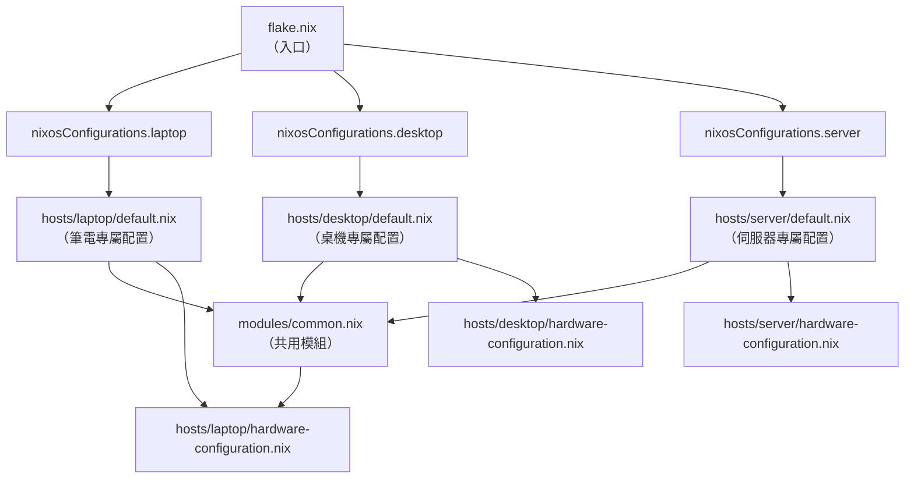
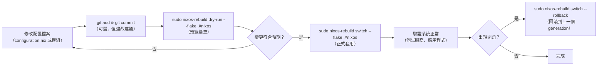
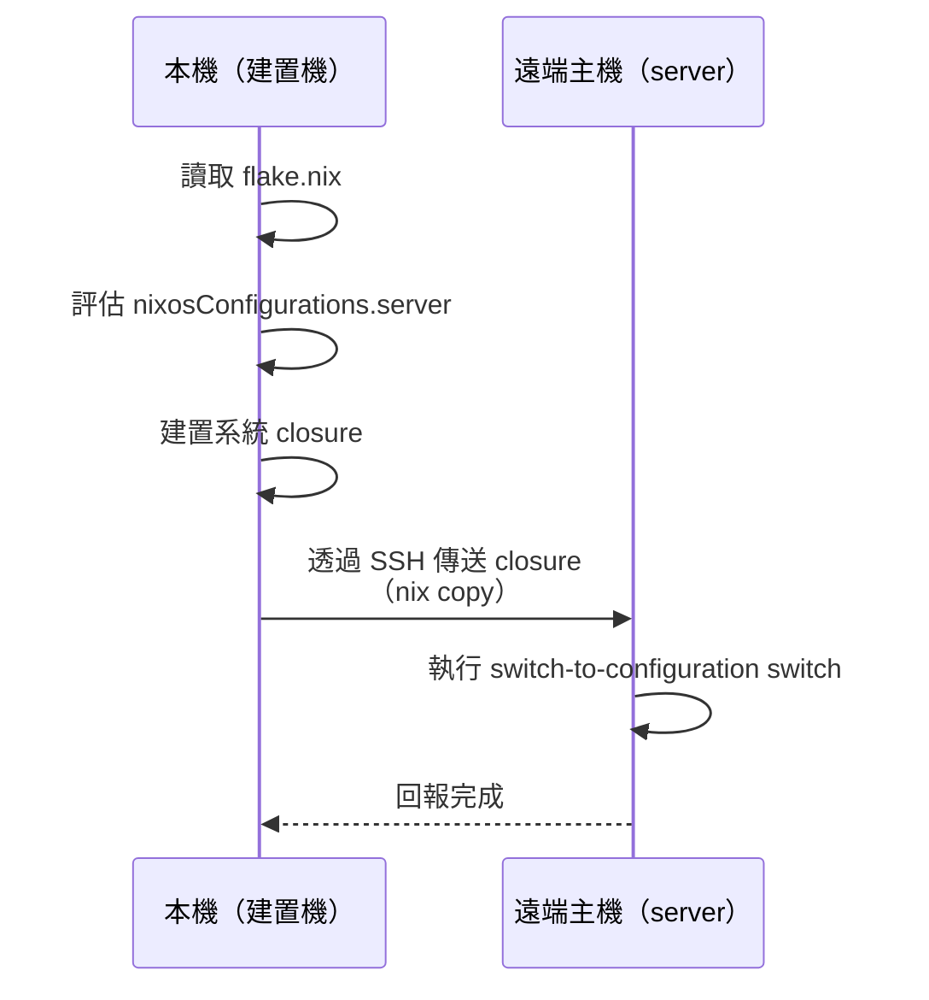

# 第18章：使用 Flakes 管理 NixOS

---

## 本章學習目標

完成本章後，你將能夠：

1. 將現有的 `configuration.nix` 遷移至 Flakes 架構，並理解哪些東西不變、哪些要調整
2. 使用 `nixosConfigurations` 定義並管理多台主機（laptop、desktop、server）
3. 正確執行 `sudo nixos-rebuild switch --flake .#主機名稱` 進行本機與遠端部署
4. 在多台主機間共用通用模組，實現角色分離的配置設計
5. 避免 Flakes 初學者最常踩到的坑，包括 `allowUnfree` 設定失效問題

---

## 前置知識

閱讀本章前，請確認你已完成：

- **第17章**：Flakes 基礎（`flake.nix` 結構、`inputs`、`outputs`、`flake.lock`）
- **第5章**：`imports` 機制與模組化設計
- **第7章**：NixOS Module System（`specialArgs`、`config`、`options`）

如果你對 `nixpkgs.lib.nixosSystem` 這個函式名稱感到陌生，請先回顧第17章再繼續。

---

## 18.1 從 configuration.nix 遷移到 Flakes

### 為什麼要遷移？

在第17章我們說明了 Flakes 帶來的好處：

- `flake.lock`：固定所有 input 版本，確保可重現
- 統一的 `outputs` 介面，方便多主機管理
- 不再依賴全域的 channel 狀態

但對已有 `configuration.nix` 的使用者來說，「遷移」這個詞可能讓人緊張。

**好消息是：你現有的 `configuration.nix` 幾乎不需要大幅修改。**

Flakes 遷移的核心動作，只是：

> 在 `/etc/nixos/` 加一個 `flake.nix`，告訴 Nix 你的 `configuration.nix` 在哪裡。

---

### 遷移前後結構對比

**遷移前（傳統 channel 方式）：**

```text
/etc/nixos/
├── configuration.nix        ← 系統配置主入口
└── hardware-configuration.nix
```

執行方式：

```bash
sudo nixos-rebuild switch
```

**遷移後（Flakes 方式）：**

```text
/etc/nixos/
├── flake.nix                ← 新增：Flakes 入口
├── flake.lock               ← 自動生成：版本鎖定檔
├── configuration.nix        ← 不變：系統配置主入口
└── hardware-configuration.nix  ← 不變：硬體配置
```

執行方式：

```bash
sudo nixos-rebuild switch --flake .#nixos
```

**哪些東西不變：**

- `configuration.nix` 的所有設定內容都不需要修改
- `hardware-configuration.nix` 完全不動
- `imports`、`services`、`users` 等區塊的語法完全相同

**哪些東西要改：**

- 需要新增 `flake.nix` 作為入口
- `nixos-rebuild` 指令加上 `--flake .#主機名稱`
- `nixpkgs.config.allowUnfree` 的設定方式不同（詳見 18.7）

---

### 遷移步驟詳解

#### Step 1：在 `/etc/nixos/` 建立 `flake.nix`

首先確認你在正確目錄：

```bash
cd /etc/nixos
ls
```

你應該看到 `configuration.nix` 和 `hardware-configuration.nix`。

接著建立 `flake.nix`：

```bash
sudo nano /etc/nixos/flake.nix
```

#### Step 2：在 `outputs.nixosConfigurations` 中定義主機

寫入以下完整的 `flake.nix` 內容（主機名稱為 `nixos`，與預設相同）：

```nix
# /etc/nixos/flake.nix
{
  # 描述這個 flake 的用途
  description = "Alice 的 NixOS 系統配置";

  inputs = {
    # 使用 nixos-25.05 穩定版分支
    nixpkgs.url = "github:NixOS/nixpkgs/nixos-25.05";
  };

  outputs = { self, nixpkgs, ... }: {

    # nixosConfigurations 是專門用來定義 NixOS 主機的 output 屬性
    # 格式：nixosConfigurations.<主機名稱> = nixpkgs.lib.nixosSystem { ... }
    nixosConfigurations = {

      # 主機名稱 "nixos"（與 networking.hostName 無關，只是這裡的索引鍵）
      nixos = nixpkgs.lib.nixosSystem {

        # 目標架構：x86_64 的 Linux 系統
        system = "x86_64-linux";

        # modules 清單：將你原本的 configuration.nix 列入即可
        # 這和 imports 的作用相同，只是在 flake.nix 層面宣告
        modules = [
          ./configuration.nix
        ];
      };

    };
  };
}
```

這個最小化的 `flake.nix` 做了一件事：

> 告訴 Nix，主機 `nixos` 的配置來自 `./configuration.nix`，並使用 nixos-25.05 版本的 nixpkgs。

#### Step 3：將 configuration.nix 視為 module

你的 `configuration.nix` **不需要任何修改**。

它本來就是一個 NixOS module，格式如下：

```nix
# /etc/nixos/configuration.nix
{ config, pkgs, ... }:

{
  imports = [
    ./hardware-configuration.nix
  ];

  networking.hostName = "nixos";
  time.timeZone = "Asia/Taipei";

  users.users.alice = {
    isNormalUser = true;
    extraGroups = [ "wheel" "networkmanager" ];
  };

  environment.systemPackages = with pkgs; [
    vim
    git
    curl
  ];

  services.openssh.enable = true;

  system.stateVersion = "25.05";
}
```

`flake.nix` 中的 `modules = [ ./configuration.nix ]` 和你原本在 `configuration.nix` 裡用 `imports` 載入其他檔案是同一個概念。

#### Step 4：執行 nixos-rebuild 切換到 Flakes 模式

現在執行：

```bash
sudo nixos-rebuild switch --flake .#nixos
```

指令說明：

- `switch`：建置並立即切換到新的系統配置
- `--flake .`：從當前目錄（`.`）的 `flake.nix` 讀取配置
- `#nixos`：選擇 `nixosConfigurations` 中名為 `nixos` 的主機

第一次執行時，Nix 會：

1. 讀取 `flake.nix` 並解析 `inputs`
2. 下載 nixpkgs 並建立 `flake.lock`
3. 評估 `nixosConfigurations.nixos`
4. 建置系統 closure
5. 切換到新的 generation

---

### 遷移後的驗證方式

確認系統成功使用 Flakes 模式：

```bash
# 查看當前 generation 資訊
nixos-rebuild list-generations

# 確認 flake.lock 已生成
ls /etc/nixos/flake.lock

# 查看 flake 的 inputs 版本
nix flake metadata /etc/nixos
```

如果上述指令正常執行，代表遷移成功。

---

## 18.2 nixosConfigurations：定義主機

### nixpkgs.lib.nixosSystem 函式結構

`nixpkgs.lib.nixosSystem` 是 Flakes 中用來定義 NixOS 主機的核心函式。

它接受一個 attribute set，主要欄位如下：

```nix
nixpkgs.lib.nixosSystem {
  # 必填：目標平台
  system = "x86_64-linux";

  # 必填：NixOS module 清單
  modules = [
    ./configuration.nix
    ./hardware-configuration.nix
    # 可以直接內嵌 module：
    ({ pkgs, ... }: {
      environment.systemPackages = [ pkgs.htop ];
    })
  ];

  # 選填：傳遞給所有 module 的額外參數
  specialArgs = {
    myCustomValue = "hello";
  };
}
```

---

### system：目標平台

`system` 指定這台主機的 CPU 架構與作業系統組合。

常見的值：

| 值 | 說明 |
|---|---|
| `"x86_64-linux"` | 一般 PC、伺服器（Intel/AMD 64 位元） |
| `"aarch64-linux"` | ARM 64 位元（Raspberry Pi、ARM 伺服器） |
| `"x86_64-darwin"` | macOS（用於 nix-darwin，非 NixOS） |

本章所有範例統一使用 `"x86_64-linux"`，ARM 配置詳見 18.8 節。

---

### modules：模組清單

`modules` 是一個 list，接受三種格式的元素：

**格式一：路徑（最常用）**

```nix
modules = [
  ./configuration.nix
  ./hardware-configuration.nix
  ./modules/common.nix
];
```

**格式二：內嵌的 lambda（匿名 module）**

```nix
modules = [
  ({ pkgs, config, ... }: {
    environment.systemPackages = [ pkgs.vim ];
  })
];
```

**格式三：attribute set（直接是 module 的內容）**

```nix
modules = [
  {
    networking.hostName = "nixos";
  }
];
```

這三種格式可以混用，`nixosSystem` 會把它們全部合併評估。

`modules` 和 `configuration.nix` 中的 `imports` 是等價的概念，只是 `modules` 在 `flake.nix` 層面宣告，`imports` 在 module 內部宣告。

---

### specialArgs：傳遞自訂參數

`specialArgs` 讓你把自訂的值傳遞給 `nixosConfigurations` 中的所有 module。

這在多主機管理時非常有用。例如，把「主機名稱」、「使用者清單」、「共用設定」當作參數傳入：

```nix
# flake.nix
nixosConfigurations.laptop = nixpkgs.lib.nixosSystem {
  system = "x86_64-linux";

  # 透過 specialArgs 傳入自訂參數
  specialArgs = {
    hostName = "laptop";
    myUsers = [ "alice" ];
  };

  modules = [
    ./hosts/laptop/default.nix
  ];
};
```

在 module 中接收：

```nix
# hosts/laptop/default.nix
# 透過函式參數接收 specialArgs 的值
{ config, pkgs, hostName, myUsers, ... }:

{
  networking.hostName = hostName;   # 使用傳入的 hostName

  # 使用 myUsers 動態建立使用者
  users.users.alice = {
    isNormalUser = true;
    extraGroups = [ "wheel" ];
  };

  system.stateVersion = "25.05";
}
```

---

### 完整範例：三台主機共用一個 flake.nix

以下範例展示如何在同一個 `flake.nix` 中定義 `laptop`、`desktop`、`server` 三台主機：

```nix
# /etc/nixos/flake.nix
{
  description = "Alice 的多主機 NixOS 配置";

  inputs = {
    nixpkgs.url = "github:NixOS/nixpkgs/nixos-25.05";
  };

  outputs = { self, nixpkgs, ... }:
  let
    # 定義通用的 nixosSystem 輔助函式，避免重複
    # system 預設為 x86_64-linux
    mkHost = { hostName, extraModules ? [] }:
      nixpkgs.lib.nixosSystem {
        system = "x86_64-linux";
        specialArgs = { inherit hostName; };
        modules = [
          ./modules/common.nix              # 所有主機共用
          ./hosts/${hostName}/default.nix   # 各主機專屬配置
        ] ++ extraModules;
      };
  in
  {
    nixosConfigurations = {

      # 筆電：桌面工作站
      laptop = mkHost { hostName = "laptop"; };

      # 桌機：效能工作站
      desktop = mkHost { hostName = "desktop"; };

      # 伺服器：無頭（headless）伺服器
      server = mkHost {
        hostName = "server";
        extraModules = [
          # 伺服器額外載入 server-specific 模組
          ./modules/server-hardening.nix
        ];
      };

    };
  };
}
```

這個 `flake.nix` 的結構已經相當完整，可以直接作為多主機專案的起點。

---

## 18.3 多主機管理

### 多主機的配置關係

下圖說明 monorepo 中，`flake.nix` 如何組織多台主機的配置：



每台主機有自己的「專屬配置」，但同時引入「共用模組」。這樣的設計讓配置保持 DRY（Don't Repeat Yourself）。

---

### 推薦的目錄結構

以下是本章使用的簡化目錄結構（第20章會進一步深入說明大型專案的完整架構）：

```text
/etc/nixos/
├── flake.nix               ← Flakes 入口，定義所有主機
├── flake.lock              ← 自動生成，版本鎖定
│
├── hosts/                  ← 各主機的專屬配置
│   ├── laptop/
│   │   ├── default.nix     ← 筆電主配置
│   │   └── hardware-configuration.nix
│   ├── desktop/
│   │   ├── default.nix     ← 桌機主配置
│   │   └── hardware-configuration.nix
│   └── server/
│       ├── default.nix     ← 伺服器主配置
│       └── hardware-configuration.nix
│
└── modules/                ← 跨主機共用模組
    └── common.nix          ← 所有主機共用的基礎設定
```

這個結構的設計邏輯：

- `hosts/`：每台主機「不一樣」的東西放這裡
- `modules/`：所有主機「一樣」的東西放這裡

---

### 角色分離概念

不同的主機有不同的「角色」，配置也應該有所不同：

| 主機 | 角色 | 特有配置 |
|---|---|---|
| `laptop` | 桌面工作站 | 桌面環境、音效、輸入法 |
| `desktop` | 效能工作站 | 桌面環境、GPU 驅動、虛擬化 |
| `server` | 無頭伺服器 | SSH 強化、服務、無桌面 |

共用配置則包含：

- 使用者 `alice` 的基本設定
- 時區、Locale
- SSH 基本設定
- 常用命令列工具

---

### 完整範例：laptop 與 server 的 flake.nix

以下是一個完整、可直接使用的 `flake.nix`，包含筆電（桌面）和伺服器（無頭）兩台主機：

```nix
# /etc/nixos/flake.nix
{
  description = "Alice 的 NixOS 多主機配置";

  inputs = {
    # 使用 nixos-25.05 穩定版
    nixpkgs.url = "github:NixOS/nixpkgs/nixos-25.05";
  };

  outputs = { self, nixpkgs, ... }: {

    nixosConfigurations = {

      # ─── 筆電：日常使用的桌面機器 ───────────────────────────
      laptop = nixpkgs.lib.nixosSystem {
        system = "x86_64-linux";

        specialArgs = {
          # 傳入自訂參數，模組可以接收使用
          flakeRoot = self;
        };

        modules = [
          # 1. 共用基礎配置（所有主機都載入）
          ./modules/common.nix

          # 2. 筆電專屬配置
          ./hosts/laptop/default.nix

          # 3. 硬體配置（由 nixos-generate-config 自動產生）
          ./hosts/laptop/hardware-configuration.nix
        ];
      };

      # ─── 伺服器：遠端部署的無頭主機 ────────────────────────
      server = nixpkgs.lib.nixosSystem {
        system = "x86_64-linux";

        modules = [
          # 1. 共用基礎配置
          ./modules/common.nix

          # 2. 伺服器專屬配置
          ./hosts/server/default.nix

          # 3. 硬體配置
          ./hosts/server/hardware-configuration.nix
        ];
      };

    };
  };
}
```

---

## 18.4 共用模組

### 為什麼需要共用模組？

假設你有三台主機，每台都需要：

- 使用者 `alice`（含 SSH 金鑰）
- 時區設定為 `Asia/Taipei`
- Locale 設定為 `zh_TW.UTF-8`
- 安裝 `vim`、`git`、`curl`

如果每台主機的配置都重複寫這些內容，維護起來非常麻煩。

共用模組（shared module）的解法：

> 把共同的配置抽到一個獨立的 module，讓所有主機的 `modules` 都引入它。

---

### common.nix：三台主機的共用基礎

```nix
# /etc/nixos/modules/common.nix
{ config, pkgs, ... }:

{
  # ── 基本系統設定 ──────────────────────────────────────────

  # 時區
  time.timeZone = "Asia/Taipei";

  # 語系
  i18n.defaultLocale = "zh_TW.UTF-8";
  i18n.extraLocaleSettings = {
    LC_ALL = "zh_TW.UTF-8";
  };

  # ── 使用者：alice ──────────────────────────────────────────
  users.users.alice = {
    isNormalUser = true;
    extraGroups = [
      "wheel"          # sudo 權限
      "networkmanager" # 網路管理
    ];
    # 設定 SSH 公鑰（替換為你自己的公鑰）
    openssh.authorizedKeys.keys = [
      "ssh-ed25519 AAAAC3NzaC1lZDI1NTE5AAAAI... alice@example.com"
    ];
    # 設定登入 shell
    shell = pkgs.zsh;
  };

  # ── 網路基礎設定 ──────────────────────────────────────────

  # 啟用 SSH
  services.openssh = {
    enable = true;
    settings = {
      # 禁止 root 透過密碼登入
      PermitRootLogin = "no";
      # 禁止密碼登入（只允許 SSH 金鑰）
      PasswordAuthentication = false;
    };
  };

  # 防火牆：開放 SSH port
  networking.firewall.allowedTCPPorts = [ 22 ];

  # ── 基本套件 ──────────────────────────────────────────────

  environment.systemPackages = with pkgs; [
    vim
    git
    curl
    wget
    htop
    tree
    ripgrep
  ];

  # ── Shell 設定 ────────────────────────────────────────────

  programs.zsh.enable = true;

  # ── 系統版本 ──────────────────────────────────────────────

  # 注意：stateVersion 應在每台主機的配置中分別設定
  # 這裡不設定，留給各主機的 default.nix
}
```

注意 `system.stateVersion` 不放在共用模組，原因是每台主機可能在不同時間點安裝，其 `stateVersion` 應反映該主機**初次安裝**時的 NixOS 版本。

---

### 各主機的專屬配置

**筆電（laptop）配置：**

```nix
# /etc/nixos/hosts/laptop/default.nix
{ config, pkgs, ... }:

{
  # 筆電主機名稱
  networking.hostName = "laptop";

  # 啟用 NetworkManager（筆電常用 WiFi，需要圖形化管理）
  networking.networkmanager.enable = true;

  # 桌面環境：KDE Plasma 6
  services.xserver.enable = true;
  services.displayManager.sddm.enable = true;
  services.desktopManager.plasma6.enable = true;

  # 音效系統
  services.pipewire = {
    enable = true;
    alsa.enable = true;
    pulse.enable = true;
  };

  # 輸入法
  i18n.inputMethod = {
    enable = true;
    type = "fcitx5";
    fcitx5.addons = with pkgs; [
      fcitx5-chewing
    ];
  };

  # 筆電特有套件
  environment.systemPackages = with pkgs; [
    firefox
    vscode
    libreoffice
  ];

  # 電源管理（筆電節能）
  services.tlp.enable = true;

  # 筆電初裝版本
  system.stateVersion = "25.05";
}
```

**伺服器（server）配置：**

```nix
# /etc/nixos/hosts/server/default.nix
{ config, pkgs, ... }:

{
  # 伺服器主機名稱
  networking.hostName = "server";

  # 伺服器使用靜態 IP
  networking.interfaces.eth0.ipv4.addresses = [{
    address = "192.0.2.10";
    prefixLength = 24;
  }];
  networking.defaultGateway = "192.0.2.1";
  networking.nameservers = [ "1.1.1.1" "8.8.8.8" ];

  # 伺服器服務：Nginx
  services.nginx = {
    enable = true;
    virtualHosts."example.com" = {
      root = "/var/www/example";
    };
  };

  # 開放 HTTP/HTTPS
  networking.firewall.allowedTCPPorts = [ 80 443 ];

  # 伺服器無需桌面環境
  # 不啟用 xserver、displayManager 等

  # 伺服器初裝版本
  system.stateVersion = "25.05";
}
```

**桌機（desktop）配置：**

```nix
# /etc/nixos/hosts/desktop/default.nix
{ config, pkgs, ... }:

{
  networking.hostName = "desktop";
  networking.networkmanager.enable = true;

  # 桌面環境（與筆電相同）
  services.xserver.enable = true;
  services.displayManager.sddm.enable = true;
  services.desktopManager.plasma6.enable = true;

  # 音效系統
  services.pipewire = {
    enable = true;
    alsa.enable = true;
    pulse.enable = true;
  };

  # NVIDIA GPU 驅動（桌機常見需求）
  services.xserver.videoDrivers = [ "nvidia" ];
  hardware.nvidia = {
    modesetting.enable = true;
    open = false;
  };

  # 開啟虛擬化支援
  virtualisation.libvirtd.enable = true;
  users.users.alice.extraGroups = [ "libvirtd" ];

  # 桌機初裝版本
  system.stateVersion = "25.05";
}
```

---

### specialArgs.myHosts：傳遞主機清單（進階用法）

如果你需要在模組中知道「這個 Flake 管理了哪些主機」，可以用 `specialArgs` 傳入：

```nix
# flake.nix（片段）
let
  # 定義主機清單，方便模組引用
  myHosts = {
    laptop  = { ip = "192.168.1.10"; role = "desktop"; };
    desktop = { ip = "192.168.1.11"; role = "desktop"; };
    server  = { ip = "192.0.2.10";   role = "server";  };
  };
in
{
  nixosConfigurations.laptop = nixpkgs.lib.nixosSystem {
    system = "x86_64-linux";

    # 把 myHosts 傳給所有模組
    specialArgs = { inherit myHosts; };

    modules = [
      ./modules/common.nix
      ./hosts/laptop/default.nix
      ./hosts/laptop/hardware-configuration.nix
    ];
  };
}
```

在模組中使用：

```nix
# modules/common.nix（片段）
{ myHosts, config, pkgs, ... }:

{
  # 例如：在 /etc/hosts 中自動加入所有管理的主機
  networking.hosts = {
    "${myHosts.server.ip}"  = [ "server" ];
    "${myHosts.desktop.ip}" = [ "desktop" ];
  };
}
```

這個技巧讓你的共用模組能夠「感知」整個基礎設施的拓撲結構。

---

## 18.5 nixos-rebuild 與 Flakes 整合

### 標準本機部署指令

使用 Flakes 後，所有的 `nixos-rebuild` 指令都需要加上 `--flake` 參數。

**切換（建議日常使用）：**

```bash
sudo nixos-rebuild switch --flake .#nixos
```

- `switch`：建置新系統並立即切換，同時更新 bootloader 選單
- `.`：從目前目錄的 `flake.nix` 讀取（也可以寫絕對路徑：`/etc/nixos`）
- `#nixos`：選擇 `nixosConfigurations.nixos`

**開機後生效（不立即切換）：**

```bash
sudo nixos-rebuild boot --flake .#nixos
```

重新開機後才使用新配置。適合需要測試「系統重開後是否正常」的情況。

**測試（不更新 bootloader）：**

```bash
sudo nixos-rebuild test --flake .#nixos
```

立即切換到新配置，但下次開機仍使用舊配置。適合臨時測試，不確定是否要保留變更時使用。

**預覽變更（不實際建置）：**

```bash
sudo nixos-rebuild dry-run --flake .#nixos
```

只顯示「哪些套件會被新增或移除」，不實際執行任何建置或切換。

完整預覽（包含系統 closure 差異）：

```bash
sudo nixos-rebuild dry-activate --flake .#nixos
```

---

### 從 GitHub 直接部署

如果你把配置存放在 GitHub，可以直接指向遠端 repository：

```bash
# 格式：github:使用者名稱/repository名稱#主機名稱
sudo nixos-rebuild switch --flake github:alice/nixos-config#laptop
```

這會：

1. 從 GitHub 下載 `alice/nixos-config` 這個 repository 的最新版本
2. 讀取其中的 `flake.nix`
3. 建置並切換到 `nixosConfigurations.laptop`

**使用特定分支或 commit：**

```bash
# 使用特定分支
sudo nixos-rebuild switch --flake github:alice/nixos-config/stable#laptop

# 使用特定 commit hash
sudo nixos-rebuild switch --flake github:alice/nixos-config/a1b2c3d4#laptop
```

---

### 本機完整部署工作流程

以下是日常使用 Flakes 管理 NixOS 的完整流程：



**有用的輔助指令：**

```bash
# 查看所有 generation
sudo nix-env --list-generations --profile /nix/var/nix/profiles/system

# 回滾到上一個 generation
sudo nixos-rebuild switch --rollback

# 指定回滾到特定 generation（generation 編號可從上面指令取得）
sudo /nix/var/nix/profiles/system-42-link/bin/switch-to-configuration switch
```

---

## 18.6 遠端部署（remote deploy）

### 概念說明

「遠端部署」是指：

> 在**本機**建置配置，然後把結果部署到**遠端**主機上。

這個工作流程的好處：

- 遠端主機（伺服器）不需要有強大的 CPU
- 建置過程在本機完成，遠端主機只接收最終結果
- 適合管理多台效能較弱的 VPS 或嵌入式裝置



---

### 使用 --target-host 遠端部署

NixOS 的 `nixos-rebuild` 內建支援遠端部署：

```bash
sudo nixos-rebuild switch \
  --flake .#server \
  --target-host alice@192.0.2.10
```

指令說明：

- `--flake .#server`：使用本機 `flake.nix` 中的 `server` 配置
- `--target-host alice@192.0.2.10`：SSH 連線到目標主機，並在那裡執行切換

**分離建置機與部署目標：**

```bash
sudo nixos-rebuild switch \
  --flake .#server \
  --build-host localhost \
  --target-host alice@192.0.2.10
```

- `--build-host localhost`：在本機建置（預設行為）
- `--target-host alice@192.0.2.10`：把建置結果推送並切換到遠端主機

---

### 前置條件：SSH 設定

遠端部署需要以下前置條件：

**條件一：SSH 金鑰免密登入**

在本機確認可以免密登入目標主機：

```bash
# 測試 SSH 連線（不應要求輸入密碼）
ssh alice@192.0.2.10 "echo SSH 連線成功"
```

如果還沒設定，在本機執行：

```bash
# 生成 SSH 金鑰（如果沒有）
ssh-keygen -t ed25519 -C "alice@laptop"

# 複製公鑰到目標主機
ssh-copy-id alice@192.0.2.10
```

在目標主機的 NixOS 配置中確認已設定：

```nix
# hosts/server/default.nix（片段）
users.users.alice.openssh.authorizedKeys.keys = [
  "ssh-ed25519 AAAAC3NzaC1lZDI1NTE5AAAAI... alice@laptop"
];
```

**條件二：目標主機有 sudo 權限（或 root SSH）**

`nixos-rebuild --target-host` 需要在目標主機上以 root 執行。有兩種方式：

方式 A：允許 alice 無密碼 sudo：

```nix
# hosts/server/default.nix（片段）
security.sudo.extraRules = [{
  users = [ "alice" ];
  commands = [{
    command = "ALL";
    options = [ "NOPASSWD" ];
  }];
}];
```

方式 B：SSH 直接以 root 連線（需在 `sshd_config` 允許）：

```bash
sudo nixos-rebuild switch \
  --flake .#server \
  --target-host root@192.0.2.10
```

**條件三：目標主機能夠連到 binary cache**

建置完成的套件需要從 cache.nixos.org 或本機傳送到目標主機。

確認目標主機能夠連到網際網路，或設定私有 binary cache。

---

### 進階工具預告

`nixos-rebuild --target-host` 已足夠應付單機或少量主機的遠端部署。

若要管理**數十台以上**的主機，建議使用專用工具：

| 工具 | 特色 | 詳細說明 |
|---|---|---|
| **deploy-rs** | Rust 實作，並行部署，支援 Flakes | 第24章 |
| **colmena** | 宣告式多主機部署，配置整合度高 | 第24章 |
| **NixOps** | 官方工具，支援雲端 provisioning | 第24章 |

第24章將深入說明這些工具的完整使用方式。

---

## 18.7 nixpkgs.config 在 Flakes 中的配置

### 這是 Flakes 初學者最常遇到的坑

> **警告**：如果你從非 Flakes 配置遷移過來，請務必閱讀本節。

在傳統（非 Flakes）的 `configuration.nix` 中，啟用 unfree 套件的方式是：

```nix
# 傳統方式（在 configuration.nix 中）
nixpkgs.config.allowUnfree = true;
```

這個方式在 Flakes 模式下**有時會失效**，導致你試圖安裝 `vscode`、`steam`、`nvidia` 驅動等 unfree 套件時出現錯誤：

```text
error: Package 'vscode-1.x.x' in /nix/store/.../vscode/default.nix:xx
       is not available, because the package is unfree.
```

即使你在 `configuration.nix` 加了 `nixpkgs.config.allowUnfree = true`，問題也可能依然存在。

---

### 問題根源

Flakes 的 `nixpkgs` input 是在 `flake.nix` 層級實體化的。

`nixpkgs.config` 這個 NixOS option 影響的是「透過 NixOS module system 取得的 pkgs」，但在某些情況下，Flakes 使用的 `pkgs` 實體是在 module system 評估之前就建立的。

---

### 正確的 Flakes 方式

**方式一：在 modules 中設定（推薦，最簡單）**

把 `allowUnfree` 設定放在任一 module 中，與傳統方式相同：

```nix
# configuration.nix 或任何 module
{ config, pkgs, ... }:

{
  # 在 module 內設定 nixpkgs.config，這個方式在 Flakes 中有效
  nixpkgs.config.allowUnfree = true;

  environment.systemPackages = with pkgs; [
    vscode   # unfree 套件
    steam    # unfree 套件
  ];

  system.stateVersion = "25.05";
}
```

這個方式適用於大多數情況，且最接近傳統用法。

**方式二：在 flake.nix 中透過內嵌 module 設定**

```nix
# flake.nix
{
  description = "Alice 的 NixOS 配置";

  inputs = {
    nixpkgs.url = "github:NixOS/nixpkgs/nixos-25.05";
  };

  outputs = { self, nixpkgs, ... }: {
    nixosConfigurations.nixos = nixpkgs.lib.nixosSystem {
      system = "x86_64-linux";

      modules = [
        # 在 modules list 中加入一個內嵌 module，專門設定 nixpkgs.config
        ({ pkgs, ... }: {
          nixpkgs.config.allowUnfree = true;
        })

        # 然後才是你的主配置
        ./configuration.nix
      ];
    };
  };
}
```

**方式三：透過 nixpkgs.overlays 搭配 nixpkgs.config（進階）**

對於需要細粒度控制的情況，可以在 `flake.nix` 中建立客製化的 `pkgs` 實體：

```nix
# flake.nix（進階用法）
{
  description = "Alice 的 NixOS 配置";

  inputs = {
    nixpkgs.url = "github:NixOS/nixpkgs/nixos-25.05";
  };

  outputs = { self, nixpkgs, ... }:
  let
    # 建立一個允許 unfree 的 pkgs 實體
    # 然後透過 nixpkgs.pkgs option 傳入 nixosSystem
    pkgsWithUnfree = import nixpkgs {
      system = "x86_64-linux";
      config = {
        allowUnfree = true;
      };
    };
  in
  {
    nixosConfigurations.nixos = nixpkgs.lib.nixosSystem {
      system = "x86_64-linux";

      modules = [
        # 透過 nixpkgs.pkgs 傳入預建的 pkgs 實體
        ({ ... }: {
          nixpkgs.pkgs = pkgsWithUnfree;
        })

        ./configuration.nix
      ];
    };
  };
}
```

> 注意：方式三中設定了 `nixpkgs.pkgs` 後，`nixpkgs.config` 和 `nixpkgs.overlays` 這兩個 option 就不能再單獨使用，因為 pkgs 已經預先實體化。

---

### allowUnfree 的細粒度控制

如果你只想允許特定套件，而不是全部 unfree，可以使用：

```nix
# configuration.nix
{ config, pkgs, ... }:

{
  nixpkgs.config = {
    # 只允許特定 unfree 套件
    allowUnfreePredicate = pkg: builtins.elem (pkgs.lib.getName pkg) [
      "vscode"
      "nvidia-x11"
      "nvidia-settings"
      "steam"
      "steam-original"
    ];
  };

  system.stateVersion = "25.05";
}
```

這樣可以精確控制哪些 unfree 套件被允許，比 `allowUnfree = true` 更安全。

---

### 快速診斷

遇到 unfree 錯誤時，依序確認：

1. 確認 `nixpkgs.config.allowUnfree = true` 有寫在某個 module 裡
2. 確認這個 module 有被 `modules` list 或 `imports` 載入
3. 如果還是出錯，改用方式二（在 `flake.nix` 的 `modules` 中用內嵌 module）
4. 執行 `sudo nixos-rebuild switch --flake .#nixos --show-trace` 查看詳細錯誤

---

## 18.8 Cross-platform 配置

### system 參數與平台識別

`nixpkgs.lib.nixosSystem` 的 `system` 參數決定了建置目標的平台。

目前 NixOS 支援的主要平台：

| `system` 值 | 硬體 | 使用場景 |
|---|---|---|
| `"x86_64-linux"` | Intel/AMD 64 位元 | 一般 PC、x86 伺服器 |
| `"aarch64-linux"` | ARM 64 位元 | Raspberry Pi 4/5、ARM 雲端伺服器 |
| `"i686-linux"` | Intel 32 位元 | 老舊硬體（較少見） |

`pkgs.system` 是在 module 中取得當前建置平台的方式：

```nix
# 在任意 module 中
{ config, pkgs, ... }:

{
  # pkgs.system 回傳字串，例如 "x86_64-linux"
  assertions = [{
    assertion = pkgs.system == "x86_64-linux";
    message = "這個配置只支援 x86_64-linux";
  }];
}
```

---

### ARM 伺服器配置範例（aarch64-linux）

以 Raspberry Pi 4 為例，配置一台 aarch64 的 NixOS 主機：

```nix
# flake.nix（加入 ARM 主機）
{
  description = "Alice 的多架構 NixOS 配置";

  inputs = {
    nixpkgs.url = "github:NixOS/nixpkgs/nixos-25.05";
  };

  outputs = { self, nixpkgs, ... }: {

    nixosConfigurations = {

      # 一般 x86_64 主機
      laptop = nixpkgs.lib.nixosSystem {
        system = "x86_64-linux";
        modules = [
          ./modules/common.nix
          ./hosts/laptop/default.nix
          ./hosts/laptop/hardware-configuration.nix
        ];
      };

      # Raspberry Pi 4（aarch64）
      rpi4 = nixpkgs.lib.nixosSystem {
        # 指定 ARM 64 位元架構
        system = "aarch64-linux";

        modules = [
          ./modules/common.nix

          # Raspberry Pi 專屬硬體支援
          ({ config, pkgs, ... }: {
            networking.hostName = "rpi4";

            # 啟用 Raspberry Pi 韌體
            hardware.raspberry-pi."4".apply-overlays-dtmerge.enable = true;
            hardware.deviceTree.enable = true;

            # 使用 U-Boot 開機
            boot.loader.grub.enable = false;
            boot.loader.generic-extlinux-compatible.enable = true;

            # SD 卡分割區（由 nixos-generate-config 產生）
            fileSystems."/" = {
              device = "/dev/disk/by-label/NIXOS_SD";
              fsType = "ext4";
            };

            system.stateVersion = "25.05";
          })
        ];
      };

    };
  };
}
```

---

### 在 x86 機器上為 ARM 建置（交叉編譯）

如果你的本機是 x86_64，要建置 aarch64 的配置，有兩種方式：

**方式一：QEMU 模擬（較慢，但不需要特殊設定）**

在本機的 NixOS 配置中啟用 binfmt 支援：

```nix
# configuration.nix（本機）
{
  # 啟用 QEMU 模擬，讓 x86 機器能夠執行 aarch64 的二進位
  boot.binfmt.emulatedSystems = [ "aarch64-linux" ];
}
```

啟用後，可以在 x86 機器上建置 aarch64 的系統：

```bash
# 建置 rpi4 配置（會使用 QEMU 模擬執行）
nixos-rebuild build --flake .#rpi4
```

**方式二：crossSystem（真正的交叉編譯，進階）**

```nix
# flake.nix（進階交叉編譯）
nixosConfigurations.rpi4-cross = nixpkgs.lib.nixosSystem {
  # 注意：不用 system，改用 pkgs
  pkgs = import nixpkgs {
    system = "x86_64-linux";   # 建置機架構
    crossSystem = {
      config = "aarch64-unknown-linux-gnu";  # 目標架構
    };
  };

  modules = [
    ./hosts/rpi4/default.nix
  ];
};
```

> 交叉編譯是進階主題，本書不深入展開。實務上，對 ARM 伺服器的日常管理通常使用 QEMU 模擬或直接在 ARM 機器上建置。

---

### 同一個 flake.nix 管理多架構

一個 `flake.nix` 可以同時管理 x86 和 ARM 主機，不需要分開維護：

```nix
# flake.nix
{
  description = "Alice 的多架構配置";

  inputs = {
    nixpkgs.url = "github:NixOS/nixpkgs/nixos-25.05";
  };

  outputs = { self, nixpkgs, ... }: {

    nixosConfigurations = {
      # x86_64 主機群
      laptop  = nixpkgs.lib.nixosSystem { system = "x86_64-linux"; modules = [ ./hosts/laptop/default.nix  ]; };
      desktop = nixpkgs.lib.nixosSystem { system = "x86_64-linux"; modules = [ ./hosts/desktop/default.nix ]; };
      server  = nixpkgs.lib.nixosSystem { system = "x86_64-linux"; modules = [ ./hosts/server/default.nix  ]; };

      # aarch64 主機群（ARM）
      rpi4    = nixpkgs.lib.nixosSystem { system = "aarch64-linux"; modules = [ ./hosts/rpi4/default.nix ]; };
    };
  };
}
```

切換到不同主機只需要改 `#` 後面的名稱：

```bash
# 部署 x86 主機
sudo nixos-rebuild switch --flake .#laptop

# 遠端部署 ARM 主機
sudo nixos-rebuild switch --flake .#rpi4 --target-host alice@rpi4.local
```

---

## Lab 18：從 configuration.nix 遷移到 Flakes

### 目標

完成本 Lab 後，你將：

- 把現有的 `configuration.nix` 包裝進 Flakes 架構
- 成功執行 `nixos-rebuild switch --flake .#nixos`
- 建立包含 `laptop` 和 `server` 的雙主機配置
- 理解共用模組的設計方式

### 建議環境

| 項目 | 需求 |
|---|---|
| 作業系統 | NixOS 25.05 |
| Nix 版本 | 2.18 或更新版本 |
| 已啟用功能 | `nix.settings.experimental-features = [ "nix-command" "flakes" ]` |
| 網路 | 可連到 github.com 和 cache.nixos.org |
| 推薦工具 | `git`（強烈建議用 Git 管理配置） |

### Step 1：確認 Flakes 功能已啟用

```bash
# 確認 nix 版本
nix --version

# 確認 flakes 功能可用（應顯示 flake.nix 相關輸出）
nix flake --help | head -5
```

如果出現錯誤，在 `configuration.nix` 中加入：

```nix
nix.settings.experimental-features = [ "nix-command" "flakes" ];
```

然後執行 `sudo nixos-rebuild switch`（不帶 `--flake`）套用。

### Step 2：建立最小化的 flake.nix

```bash
# 進入配置目錄
cd /etc/nixos

# 建立 flake.nix
sudo nano flake.nix
```

寫入以下內容：

```nix
{
  description = "我的 NixOS 配置";

  inputs = {
    nixpkgs.url = "github:NixOS/nixpkgs/nixos-25.05";
  };

  outputs = { self, nixpkgs, ... }: {
    nixosConfigurations.nixos = nixpkgs.lib.nixosSystem {
      system = "x86_64-linux";
      modules = [
        ./configuration.nix
      ];
    };
  };
}
```

### Step 3：執行第一次 Flakes 建置

```bash
sudo nixos-rebuild switch --flake /etc/nixos#nixos
```

第一次執行會下載並建立 `flake.lock`，需要一些時間。

完成後確認 `flake.lock` 已生成：

```bash
ls /etc/nixos/flake.lock
```

### Step 4：建立雙主機目錄結構

```bash
sudo mkdir -p /etc/nixos/hosts/laptop
sudo mkdir -p /etc/nixos/hosts/server
sudo mkdir -p /etc/nixos/modules
```

把現有的 `configuration.nix` 複製到 laptop：

```bash
sudo cp /etc/nixos/configuration.nix /etc/nixos/hosts/laptop/default.nix
sudo cp /etc/nixos/hardware-configuration.nix /etc/nixos/hosts/laptop/hardware-configuration.nix
```

### Step 5：建立共用模組

```bash
sudo nano /etc/nixos/modules/common.nix
```

把兩台主機共用的設定移入 `common.nix`（時區、使用者、基本套件等）。

### Step 6：更新 flake.nix 支援雙主機

```nix
{
  description = "我的 NixOS 多主機配置";

  inputs = {
    nixpkgs.url = "github:NixOS/nixpkgs/nixos-25.05";
  };

  outputs = { self, nixpkgs, ... }: {
    nixosConfigurations = {

      laptop = nixpkgs.lib.nixosSystem {
        system = "x86_64-linux";
        modules = [
          ./modules/common.nix
          ./hosts/laptop/default.nix
          ./hosts/laptop/hardware-configuration.nix
        ];
      };

      # server 主機（尚未有硬體，先用佔位配置）
      server = nixpkgs.lib.nixosSystem {
        system = "x86_64-linux";
        modules = [
          ./modules/common.nix
          ./hosts/server/default.nix
          # 注意：server 的 hardware-configuration.nix 需要在實際硬體上生成
        ];
      };

    };
  };
}
```

### Step 7：驗證

```bash
# 驗證 flake 結構正確（不實際建置）
nix flake show /etc/nixos

# 預覽 laptop 配置的變更
sudo nixos-rebuild dry-run --flake /etc/nixos#laptop

# 正式套用
sudo nixos-rebuild switch --flake /etc/nixos#laptop
```

驗證成功的預期輸出：

```text
building the system configuration...
activating the configuration...
setting up /etc...
reloading user units for alice...
```

---

## 本章小結

本章涵蓋了使用 Flakes 管理 NixOS 的完整工作流程。

**核心要點回顧：**

**18.1 遷移不可怕**

遷移到 Flakes 的門檻很低：只需新增 `flake.nix`，現有的 `configuration.nix` 幾乎不需要修改。

**18.2 nixosConfigurations 是核心**

`nixpkgs.lib.nixosSystem` 接受 `system`、`modules`、`specialArgs` 三個主要參數，讓你用一個函式呼叫完整定義一台主機。

**18.3 多主機管理靠目錄結構**

`hosts/`（主機專屬） + `modules/`（跨主機共用）的二層架構，是最直觀且易維護的多主機配置方式。

**18.4 共用模組消除重複**

把時區、使用者、SSH、基本套件等通用設定抽到 `common.nix`，讓每台主機的配置只專注於自己「不一樣」的地方。

**18.5 nixos-rebuild 的 Flakes 指令**

```bash
# 本機部署
sudo nixos-rebuild switch --flake .#主機名稱

# 遠端部署
sudo nixos-rebuild switch --flake .#主機名稱 --target-host alice@IP位址
```

**18.6 遠端部署需要 SSH 準備**

遠端部署前必須確認：SSH 金鑰免密登入、sudo 權限、目標主機網路可用。

**18.7 allowUnfree 是常見陷阱**

在 Flakes 模式下，`nixpkgs.config.allowUnfree = true` 應放在 module 內（`configuration.nix` 或任何透過 `modules` 載入的檔案），而不是依賴 channel 層的全域設定。

**18.8 多架構統一管理**

同一個 `flake.nix` 可以同時管理 x86_64 和 aarch64 主機，只需調整 `system` 參數。

---

**下一步：**

- **第19章**：Home Manager 整合——用 Flakes 管理使用者的個人環境（`.zshrc`、`git config`、應用程式設定等）
- **第20章**：大型配置專案架構——`hosts/`、`modules/`、`profiles/`、`lib/`、`overlays/` 的完整 monorepo 設計

---

**本章參考資源：**

- NixOS Wiki — Flakes：https://nixos.wiki/wiki/Flakes
- nixpkgs Manual — nixosSystem：https://nixos.org/manual/nixpkgs/stable/#sec-nixosSystem
- NixOS Manual — Remote Deployment：https://nixos.org/manual/nixos/stable/#sec-deployment
