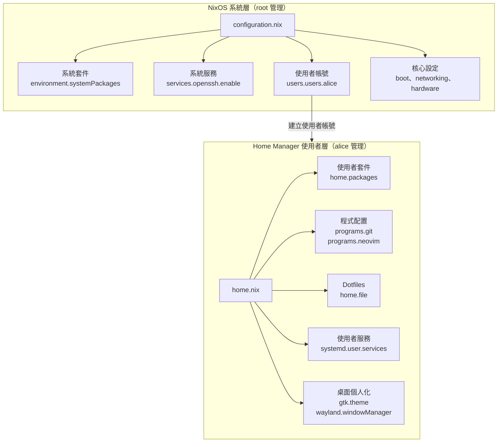
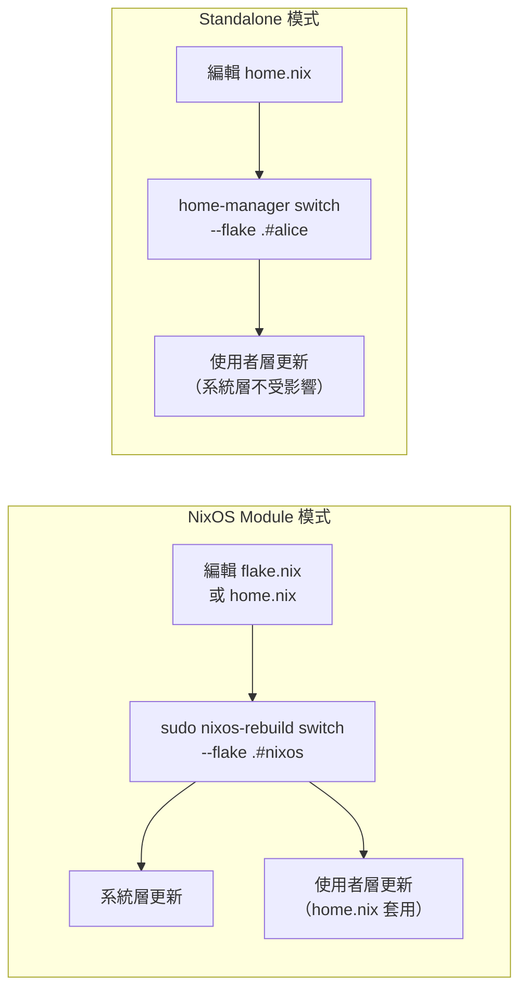
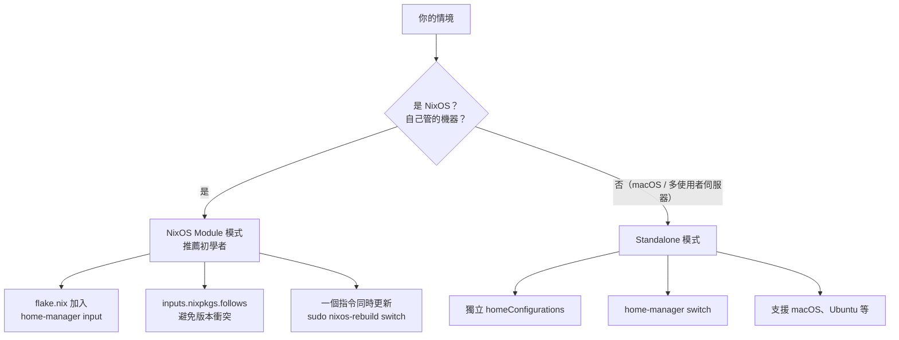
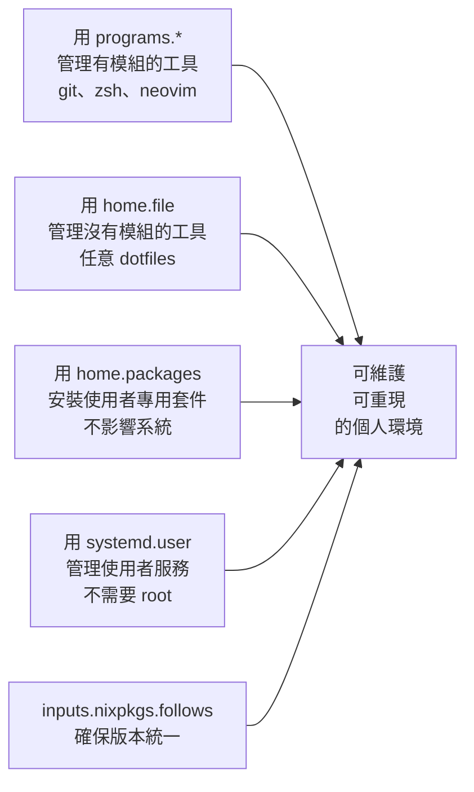

# 第19章：Home Manager 整合

## 本章學習目標

完成本章後，你將能夠：

1. 解釋 Home Manager 的定位，以及它與 NixOS 系統層配置的分工
2. 選擇適合你情境的使用模式（NixOS Module 模式 vs Standalone 模式）
3. 在 `flake.nix` 中正確整合 Home Manager，並避免 nixpkgs 版本衝突
4. 用 `home.nix` 宣告式管理 dotfiles（Git、Zsh、Neovim 等）
5. 設定使用者層級服務（user systemd services）與桌面個人化

---

## 前置知識

- 完成第17章（Flakes 基礎）與第18章（使用 Flakes 管理 NixOS）
- 了解 `nixosConfigurations` 的基本結構
- 熟悉 Nix 語言基礎：attribute set、`let ... in`、函式語法

---

## 19.1 Home Manager 是什麼？

### 系統層的邊界

你在第 4 章學到，NixOS 的配置從 `configuration.nix` 出發，管理整個系統。

但有一類設定，`configuration.nix` 無法（也不應該）管理：

- `~/.config/nvim/init.lua`（Neovim 個人設定）
- `~/.gitconfig`（Git 使用者身份）
- `~/.zshrc`（Zsh 個人別名與設定）
- `~/.config/alacritty/alacritty.toml`（終端機外觀）
- `~/.config/hypr/hyprland.conf`（視窗管理員個人配置）

這些設定屬於「使用者的個人環境」。

它們放在家目錄（home directory，`~/`）裡，每個使用者各自不同。

如果你用傳統方式管理這些檔案（手動複製、git stow、shell script），你會遇到熟悉的問題：

- 換電腦後環境難以重現
- 哪個設定來自哪裡追蹤困難
- 不同套件版本在不同機器上不一致
- dotfiles 倉庫與套件安裝步驟需要分開執行

**Home Manager（家目錄管理員）** 就是為了解決這個問題而生的工具。

它把 NixOS 的「宣告式、可重現」哲學，延伸到使用者層級的環境管理。

### Home Manager 能管理什麼？

Home Manager 能管理的範圍非常廣：

| 類別 | 範例 |
|------|------|
| **Dotfiles** | `.gitconfig`、`.zshrc`、`init.lua`、`.tmux.conf` |
| **使用者套件** | 只給自己用的工具，不影響其他使用者 |
| **Shell 配置** | Zsh、Bash、Fish 的別名、函式、補全 |
| **程式配置模組** | Git、Neovim、Starship、Alacritty 等的宣告式配置 |
| **使用者服務** | systemd user services（不需要 root） |
| **桌面個人化** | GTK/QT 主題、游標、Hyprland 配置 |
| **環境變數** | 使用者層級的 `HOME`、`PATH` 延伸 |

### NixOS 系統層 vs Home Manager 使用者層

兩者的分工原則非常清楚：



**簡單記憶規則：**

- 需要 root 權限才能設定的 → `configuration.nix`（系統層）
- 放在 `~/` 目錄下的個人設定 → `home.nix`（使用者層）

### 為什麼系統層不能管理 ~/.config/nvim？

你可能會問：「我能不能在 `configuration.nix` 裡直接管理 dotfiles？」

技術上，可以用 `environment.etc` 把檔案放到 `/etc/` 目錄。

但 `~/.config/nvim` 不是系統檔案，它屬於 `/home/alice/`。

如果系統強制寫入這些路徑，會帶來幾個問題：

1. 不同使用者各有自己的喜好，系統層不應干涉個人設定
2. alice 和 bob 可能需要不同的 Neovim 設定
3. 使用者應該能在不 rebuild 系統的情況下更新自己的環境

Home Manager 解決了這些問題：每個使用者有自己的 `home.nix`，獨立管理，互不干擾。

---

## 19.2 兩種使用模式

Home Manager 有兩種主要的使用模式。

**在深入細節之前，先給出明確建議：**

> 初學者、單人機器的使用者：**一律選擇 NixOS Module 模式**。

### 模式一：NixOS Module 模式（推薦）

Home Manager 以一個 NixOS 模組的形式載入到 `nixosConfigurations` 中。

執行一個指令，系統配置和使用者配置同時更新：

```bash
sudo nixos-rebuild switch --flake .#nixos
```

**適合的情境：**

- 自己管理的個人電腦（桌機或筆電）
- 機器上只有自己一個使用者（或幾個已知使用者）
- 希望系統和個人環境保持版本同步
- 剛開始學習 Home Manager 的初學者

**運作方式：**

```text
flake.nix
  └── nixosConfigurations.nixos
        ├── modules: [..., home-manager.nixosModules.home-manager]
        └── home-manager.users.alice = { ... };（指向 home.nix）
```

一次 `nixos-rebuild switch` 會：
1. 更新系統層配置（開機載入器、服務、系統套件）
2. 同時更新 alice 的使用者層配置（dotfiles、使用者套件）

### 模式二：Standalone 模式

Home Manager 獨立安裝，不依賴 NixOS 的 rebuild 流程。

使用獨立指令更新使用者配置：

```bash
home-manager switch --flake .#alice
```

**適合的情境：**

- 多使用者共用的伺服器（每個使用者自己管理自己的 Home Manager）
- 在非 NixOS 系統（Ubuntu、Arch、macOS）上使用 Nix
- macOS + nix-darwin 架構
- 使用者想要在不影響系統的情況下更新個人環境

### 對比表

| 比較項目 | NixOS Module 模式 | Standalone 模式 |
|----------|-------------------|-----------------|
| 更新指令 | `sudo nixos-rebuild switch` | `home-manager switch` |
| 需要 root | 是（nixos-rebuild） | 否 |
| 適合系統 | NixOS | NixOS、Ubuntu、macOS |
| 使用者數量 | 少（自己管理） | 多（各自管理） |
| 版本同步 | 系統與使用者環境同步 | 各自獨立版本 |
| 設定位置 | `flake.nix` 的 nixosConfigurations | 獨立的 homeConfigurations |
| 初學者推薦 | **是** | 否 |

### 兩種模式的配置更新流程



本章後續的 19.3 到 19.7 節，以 **NixOS Module 模式** 為主線說明。19.8 節再介紹 Standalone 模式的差異。

---

## 19.3 NixOS Module 模式安裝

### 在 flake.nix 中加入 home-manager

第一步：在 `inputs` 區塊加入 `home-manager`。

```nix
# flake.nix
{
  description = "alice 的 NixOS 系統配置";

  inputs = {
    # nixpkgs：固定使用 nixos-25.05 穩定版
    nixpkgs.url = "github:NixOS/nixpkgs/nixos-25.05";

    # home-manager：固定使用對應的 release-25.05 版本
    home-manager = {
      url = "github:nix-community/home-manager/release-25.05";

      # ⚠️ 重要：讓 home-manager 使用和 NixOS 相同的 nixpkgs
      # 沒有這行，home-manager 會使用它自己的 nixpkgs，
      # 造成同一個套件被建構兩次、版本不一致的問題
      inputs.nixpkgs.follows = "nixpkgs";
    };
  };

  outputs = { self, nixpkgs, home-manager, ... }:
  let
    system = "x86_64-linux";
    pkgs = nixpkgs.legacyPackages.${system};
  in
  {
    nixosConfigurations.nixos = nixpkgs.lib.nixosSystem {
      inherit system;

      modules = [
        # 系統主配置
        ./configuration.nix

        # 引入 Home Manager 的 NixOS 模組
        home-manager.nixosModules.home-manager

        {
          # 重要設定一：讓 Home Manager 使用系統的 pkgs
          # 確保使用者套件和系統套件來自同一個 nixpkgs 實例
          home-manager.useGlobalPkgs = true;

          # 重要設定二：讓使用者套件出現在系統的 PATH 中
          # 這樣 alice 安裝的套件才能直接在 shell 中使用
          home-manager.useUserPackages = true;

          # 定義 alice 的 Home Manager 配置
          # 這裡指向 home.nix 檔案
          home-manager.users.alice = import ./home.nix;
        }
      ];
    };
  };
}
```

### 關於 `inputs.nixpkgs.follows` 的重要說明

這一行是初學者最容易忽略、也最容易引發問題的設定：

```nix
inputs.nixpkgs.follows = "nixpkgs";
```

**不設定時會發生什麼？**

`flake.lock` 裡會出現兩個不同版本的 nixpkgs：

```
一個來自你的 flake（nixos-25.05）
一個來自 home-manager 自己的依賴（可能是不同的 commit）
```

後果：

- 同一個套件（例如 `git`）被建構兩次，版本略有差異
- `/nix/store` 佔用空間增加
- 遇到版本衝突問題時難以除錯

**設定 `follows` 之後：**

home-manager 會直接使用你的 `nixpkgs` 輸入，所有套件版本統一。

這是最佳實踐，必須加入。

### 目錄結構

設定完成後，你的配置目錄看起來像這樣：

```text
~/nixos-config/
├── flake.nix              ← 整合 home-manager 的 flake
├── flake.lock             ← 鎖定版本（自動生成）
├── configuration.nix      ← 系統層配置（第 4-7 章的內容）
└── home.nix               ← alice 的使用者層配置（本章重點）
```

### 套用配置

修改完 `flake.nix` 和 `home.nix` 後，執行：

```bash
# 在 ~/nixos-config/ 目錄下執行
sudo nixos-rebuild switch --flake .#nixos
```

這一個指令會同時套用系統配置和 alice 的 Home Manager 配置。

---

## 19.4 home.nix 的基本結構

`home.nix` 是 alice 的個人環境配置入口，結構和 `configuration.nix` 很相似，但管理的是使用者層級的選項。

### 最小可用的 home.nix

```nix
# home.nix
# Home Manager 模組也是一個函式，接收模組參數
{ config, pkgs, lib, ... }:

{
  # ── 使用者基本資訊 ──────────────────────────────────

  # 使用者名稱：必須與系統的 users.users 中宣告的名稱一致
  home.username = "alice";

  # 家目錄路徑
  home.homeDirectory = "/home/alice";

  # ── stateVersion ────────────────────────────────────
  # 這個版本號記錄 Home Manager 首次設定時的版本
  # 它用於保護某些狀態檔案的向後相容性
  # 設定後不要隨意修改（即使 NixOS 升級也不需要改這裡）
  # 注意：這個 stateVersion 和 system.stateVersion 各自獨立管理
  home.stateVersion = "25.05";

  # ── 使用者套件 ──────────────────────────────────────
  # 只安裝給 alice 使用，不影響其他使用者
  home.packages = with pkgs; [
    ripgrep    # 快速搜尋工具
    fd         # 快速 find
    tree       # 目錄樹顯示
    htop       # 程序監控
    jq         # JSON 處理
  ];

  # ── 程式配置模組 ────────────────────────────────────
  # programs.<name>.enable 啟用 Home Manager 提供的程式配置模組
  # 模組會自動管理對應的 dotfiles，不需要手動建立設定檔
  programs.git.enable = true;
}
```

### `home.stateVersion` vs `system.stateVersion`

這是初學者常見的困惑點，以下說明兩者的關係：

| 選項 | 位置 | 管理對象 |
|------|------|----------|
| `system.stateVersion` | `configuration.nix` | NixOS 系統層的狀態版本 |
| `home.stateVersion` | `home.nix` | Home Manager 使用者層的狀態版本 |

**兩者完全獨立**，互不影響。

`home.stateVersion` 的規則：

- 設定為**你第一次啟用 Home Manager 時**的 nixos/home-manager 版本
- 之後**不要修改**，即使你升級了 NixOS 或 Home Manager
- 它的作用是告訴 Home Manager：「某些檔案格式從這個版本之前是舊格式，我會幫你處理相容性」

舉例：如果你今天開始使用 Home Manager，設定 `home.stateVersion = "25.05"` 後，就保持這個值不動。

### `home.packages`：使用者套件

```nix
# home.nix 片段
home.packages = with pkgs; [
  # 使用者工具（不影響系統或其他使用者）
  ripgrep
  fd
  bat          # 有語法突顯的 cat 替代品
  eza          # 現代化的 ls 替代品（前身是 exa）
  delta        # 更好看的 git diff
  lazygit      # Git 的 TUI 介面
  fzf          # 模糊搜尋工具
  zoxide       # 智慧型 cd
];
```

這些套件只會出現在 alice 的環境中，bob 登入後看不到它們。

### `programs.<name>.enable`：程式配置模組

Home Manager 為幾百個常見工具提供了「程式配置模組」。

只需要 `programs.git.enable = true`，Home Manager 就會：

1. 安裝 git
2. 根據你在 `programs.git` 下設定的選項，生成 `~/.gitconfig`
3. 確保每次 rebuild 後設定檔內容與宣告一致

這比手動管理 dotfiles 可靠得多。

### `home.file`：直接管理任意檔案

有些工具沒有 Home Manager 模組，但你還是可以直接管理它們的設定檔：

```nix
# home.nix 片段

# 方法一：直接在 nix 裡寫入檔案內容
home.file.".config/myapp/config.toml".text = ''
  theme = "dark"
  font_size = 14
  auto_save = true
'';

# 方法二：引用外部檔案（更適合大型設定檔）
# 這會把 ./configs/myapp.toml 複製並連結到 ~/.config/myapp/config.toml
home.file.".config/myapp/config.toml".source = ./configs/myapp.toml;

# 方法三：管理腳本並設定可執行權限
home.file.".local/bin/my-script.sh" = {
  text = ''
    #!/usr/bin/env bash
    echo "Hello from my script"
  '';
  executable = true;
};
```

---

## 19.5 Dotfiles 管理

這一節示範如何用 Home Manager 管理最常見的幾個工具設定。

每個範例都是完整可用的配置，你可以直接加入 `home.nix` 使用。

### programs.git：管理 Git 配置

不再需要手動維護 `~/.gitconfig`。

```nix
# home.nix 片段
programs.git = {
  enable = true;

  # 提交者身份
  userName = "Alice Chen";
  userEmail = "alice@example.com";

  # 等同於 ~/.gitconfig 的 [core]、[init] 等區段
  extraConfig = {
    init.defaultBranch = "main";

    # 設定換行符號處理（跨平台協作重要）
    core.autocrlf = "input";

    # 啟用顏色輸出
    color.ui = "auto";

    # 更好看的 diff 工具
    core.pager = "delta";

    # 設定 push 行為：只推送當前分支
    push.default = "current";

    # 設定 pull 行為：rebase 而非 merge
    pull.rebase = true;
  };

  # git aliases（常用縮寫）
  aliases = {
    st = "status";
    co = "checkout";
    br = "branch";
    lg = "log --oneline --graph --decorate --all";
    undo = "reset HEAD~1 --mixed";
  };

  # 忽略清單：補充到 ~/.gitignore（全域）
  ignores = [
    ".DS_Store"
    "*.swp"
    ".direnv"
    ".envrc"
  ];

  # 如果你使用 delta 作為 diff 工具
  delta = {
    enable = true;
    options = {
      navigate = true;
      line-numbers = true;
      side-by-side = true;
    };
  };
};
```

套用後，Home Manager 會在 `~/.config/git/config` 生成對應的 Git 配置。

### programs.zsh：管理 Zsh 配置

取代手動維護的 `~/.zshrc`：

```nix
# home.nix 片段
programs.zsh = {
  enable = true;

  # 啟用歷史記錄設定
  history = {
    size = 10000;
    save = 10000;
    ignoreDups = true;    # 不儲存重複指令
    share = true;         # 多個終端機共用歷史
    extended = true;      # 記錄時間戳
  };

  # 個人別名
  shellAliases = {
    ll   = "eza -la --icons";
    cat  = "bat";
    grep = "rg";
    find = "fd";
    ".." = "cd ..";

    # NixOS 相關快捷指令
    nr  = "sudo nixos-rebuild switch --flake ~/nixos-config#nixos";
    nfu = "nix flake update";
  };

  # 自動套用的初始化設定（加入 .zshrc）
  initExtra = ''
    # 啟用 zoxide（智慧型 cd）
    eval "$(zoxide init zsh)"

    # 啟用 fzf 按鍵綁定
    source ${pkgs.fzf}/share/fzf/key-bindings.zsh
    source ${pkgs.fzf}/share/fzf/completion.zsh
  '';

  # Zsh 外掛
  plugins = [
    {
      name = "zsh-autosuggestions";
      src = pkgs.zsh-autosuggestions;
      file = "share/zsh-autosuggestions/zsh-autosuggestions.zsh";
    }
    {
      name = "zsh-syntax-highlighting";
      src = pkgs.zsh-syntax-highlighting;
      file = "share/zsh-syntax-highlighting/zsh-syntax-highlighting.zsh";
    }
  ];
};
```

### programs.neovim：完整管理 Neovim 與外掛

Home Manager 讓你用宣告式方式管理 Neovim 的所有設定和外掛：

```nix
# home.nix 片段
programs.neovim = {
  enable = true;

  # 設定為預設編輯器
  defaultEditor = true;

  # vim 和 vi 指令都指向 nvim
  vimAlias = true;
  viAlias = true;

  # 額外安裝的工具（LSP、格式化工具）
  extraPackages = with pkgs; [
    # Language Server Protocol
    nil           # Nix LSP
    lua-language-server
    pyright       # Python LSP

    # 格式化工具
    nixfmt-rfc-style   # Nix 格式化
    stylua        # Lua 格式化
    black         # Python 格式化
  ];

  # 外掛清單（從 nixpkgs 取得，確保版本一致）
  plugins = with pkgs.vimPlugins; [
    # 外觀
    { plugin = catppuccin-nvim; config = "colorscheme catppuccin-mocha"; type = "lua"; }
    lualine-nvim
    nvim-web-devicons

    # 檔案樹與模糊搜尋
    nvim-tree-lua
    telescope-nvim
    telescope-fzf-native-nvim

    # Treesitter（語法解析）
    nvim-treesitter.withAllGrammars

    # LSP 與自動完成
    nvim-lspconfig
    nvim-cmp
    cmp-nvim-lsp
    luasnip
    cmp_luasnip
  ];

  # Neovim 設定（Lua 格式）
  extraLuaConfig = ''
    -- 基本設定
    vim.opt.number         = true
    vim.opt.relativenumber = true
    vim.opt.tabstop        = 2
    vim.opt.shiftwidth     = 2
    vim.opt.expandtab      = true
    vim.opt.termguicolors  = true
    vim.g.mapleader        = " "

    -- 按鍵綁定
    local map = vim.keymap.set
    map("n", "<leader>ff", "<cmd>Telescope find_files<cr>")
    map("n", "<leader>fg", "<cmd>Telescope live_grep<cr>")
    map("n", "<leader>e",  "<cmd>NvimTreeToggle<cr>")
  '';
};
```

### programs.starship：Prompt 主題

Starship 是跨 shell 的現代化 prompt，Home Manager 對它有完整支援：

```nix
# home.nix 片段
programs.starship = {
  enable = true;

  # 在你使用的 shell 中自動啟用（與 programs.zsh 聯動）
  enableZshIntegration = true;

  # Starship 配置（等同於 ~/.config/starship.toml）
  settings = {
    # 整體格式：哪些模組、以什麼順序顯示
    format = ''
      $username$hostname$directory$git_branch$git_status$nix_shell$cmd_duration$line_break$character
    '';

    # 目錄模組
    directory = {
      truncation_length = 3;
      truncate_to_repo = true;
    };

    # Nix Shell 指示（進入 nix develop 時顯示）
    nix_shell = {
      disabled = false;
      impure_msg = "[impure](bold red)";
      pure_msg = "[pure](bold green)";
      unknown_msg = "[unknown](bold yellow)";
      format = "via [$symbol$state]($style) ";
    };

    # Git 分支
    git_branch = {
      symbol = " ";
      format = "on [$symbol$branch]($style) ";
    };

    # 提示符號
    character = {
      success_symbol = "[❯](bold green)";
      error_symbol = "[❯](bold red)";
    };
  };
};
```

### home.file：管理無 Home Manager 模組的設定檔

對於 Home Manager 尚未提供模組的工具，用 `home.file` 直接管理：

以 `mpv`（影片播放器）的設定為例：

```nix
# home.nix 片段

# 方法一：直接寫入內容（適合短小的設定檔）
home.file.".config/mpv/mpv.conf".text = ''
  # mpv 設定
  vo=gpu
  hwdec=auto
  sub-auto=fuzzy
  slang=zh-tw,zh,en
  alang=zh-tw,zh,en
  script-opts=osc-seekbarstyle=bar
'';

# 方法二：引用倉庫中的外部設定檔（適合大型設定檔）
# 假設你的倉庫結構是：
# nixos-config/
# ├── flake.nix
# ├── home.nix
# └── dotfiles/
#     └── wezterm.lua
home.file.".config/wezterm/wezterm.lua".source = ./dotfiles/wezterm.lua;
```

**`home.file` 的幾個重要特性：**

- Home Manager 會在家目錄建立符號連結（symlink）指向 Nix Store
- 因此這些檔案是唯讀的（不能在 `~/.config/mpv/mpv.conf` 直接編輯）
- 要修改設定，必須編輯 `home.nix`，再執行 rebuild
- 這確保了配置的一致性和可重現性

---

## 19.6 使用者層級服務（User Services）

Home Manager 讓你定義只屬於自己的 systemd 服務，不需要 root 權限。

### systemd.user.services：自訂使用者服務

以一個自動同步筆記的背景服務為例：

```nix
# home.nix 片段
systemd.user.services.sync-notes = {
  Unit = {
    Description = "Sync notes with remote server";
    # 在網路連線建立後才啟動
    After = [ "network-online.target" ];
  };

  Service = {
    # 執行的指令
    ExecStart = "${pkgs.rsync}/bin/rsync -avz /home/alice/notes/ alice@backup.example.com:notes/";

    # 每次啟動前先等 5 秒
    ExecStartPre = "${pkgs.coreutils}/bin/sleep 5";

    # 失敗時自動重試（最多 3 次）
    Restart = "on-failure";
    RestartSec = "30s";
  };

  Install = {
    # 登入後自動啟動
    WantedBy = [ "default.target" ];
  };
};

# 啟用對應的 systemd timer（定期執行）
systemd.user.timers.sync-notes = {
  Unit.Description = "Timer for sync-notes service";
  Timer = {
    # 每 30 分鐘執行一次
    OnCalendar = "*:0/30";
    # 系統啟動後 1 分鐘開始計時
    OnBootSec = "1min";
    Persistent = true;
  };
  Install.WantedBy = [ "timers.target" ];
};
```

**管理使用者服務的指令：**

```bash
# 查看使用者服務狀態
systemctl --user status sync-notes

# 手動啟動
systemctl --user start sync-notes

# 查看服務日誌
journalctl --user -u sync-notes -f
```

### services.syncthing：Home Manager 提供的服務模組

對於常見工具，Home Manager 提供了更簡單的服務模組：

```nix
# home.nix 片段

# Syncthing：點對點的檔案同步工具
# 啟用後自動在使用者層執行，不需要 root
services.syncthing = {
  enable = true;
  # 其他設定透過 Syncthing 的 Web UI（http://localhost:8384）配置
};
```

### services.gpg-agent：GPG Agent 管理

使用 SSH Key 和 GPG 簽章時，Home Manager 可以統一管理 GPG Agent：

```nix
# home.nix 片段
services.gpg-agent = {
  enable = true;

  # 金鑰快取時間（秒）
  defaultCacheTtl = 1800;        # 30 分鐘
  maxCacheTtl = 7200;            # 2 小時

  # 讓 GPG agent 也處理 SSH 認證
  # 這樣可以用 GPG 金鑰當 SSH 金鑰使用
  enableSshSupport = true;

  # 使用 pinentry（密碼輸入程式）
  # 在終端機環境使用 curses 介面
  pinentryPackage = pkgs.pinentry-curses;
};
```

---

## 19.7 桌面個人化

Home Manager 對桌面個人化有很好的支援，以下示範常見的設定。

### GTK 與 QT 主題

```nix
# home.nix 片段

# GTK 主題（影響 GNOME、GTK 應用程式的外觀）
gtk = {
  enable = true;

  # GTK 主題
  theme = {
    name = "Catppuccin-Mocha-Standard-Blue-Dark";
    package = pkgs.catppuccin-gtk.override {
      accents = [ "blue" ];
      size = "standard";
      tweaks = [ "rimless" ];
      variant = "mocha";
    };
  };

  # 圖示主題
  iconTheme = {
    name = "Papirus-Dark";
    package = pkgs.papirus-icon-theme;
  };

  # 游標主題
  cursorTheme = {
    name = "Catppuccin-Mocha-Dark-Cursors";
    package = pkgs.catppuccin-cursors.mochaDark;
    size = 24;
  };

  # GTK 字型
  font = {
    name = "Noto Sans";
    package = pkgs.noto-fonts;
    size = 11;
  };
};

# QT 主題（影響 KDE、QT 應用程式的外觀）
qt = {
  enable = true;
  platformTheme.name = "gtk";  # 讓 QT 使用 GTK 主題風格
  style.name = "adwaita-dark";
};
```

### 游標主題（全域）

```nix
# home.nix 片段

# 設定 Wayland / X11 的游標主題
home.pointerCursor = {
  name = "Catppuccin-Mocha-Dark-Cursors";
  package = pkgs.catppuccin-cursors.mochaDark;
  size = 24;
  gtk.enable = true;
  x11.enable = true;
};
```

### programs.alacritty：終端機配置

```nix
# home.nix 片段
programs.alacritty = {
  enable = true;

  settings = {
    window = { padding = { x = 8; y = 8; }; opacity = 0.95; };

    font = {
      normal = { family = "JetBrainsMono Nerd Font"; style = "Regular"; };
      size = 13.0;
    };

    # 顏色主題（Catppuccin Mocha）
    colors = {
      primary = { background = "#1e1e2e"; foreground = "#cdd6f4"; };
      normal  = {
        black = "#45475a"; red = "#f38ba8"; green = "#a6e3a1";
        yellow = "#f9e2af"; blue = "#89b4fa"; magenta = "#f5c2e7";
        cyan = "#94e2d5"; white = "#bac2de";
      };
    };
  };
};
```

### wayland.windowManager.hyprland：Hyprland 配置

對於 Hyprland 使用者，Home Manager 的 Hyprland 模組讓配置更結構化：

```nix
# home.nix 片段
wayland.windowManager.hyprland = {
  enable = true;

  # 如果系統已有 Hyprland 套件，讓 Home Manager 使用相同版本
  # 避免版本衝突
  package = null;  # 使用系統層安裝的 Hyprland

  settings = {
    # 螢幕配置
    monitor = [ "DP-1, 2560x1440@144, 0x0, 1" ];

    # 一般設定
    general = {
      gaps_in = 5;
      gaps_out = 10;
      border_size = 2;
      "col.active_border" = "rgba(89b4faee) rgba(cba6f7ee) 45deg";
      "col.inactive_border" = "rgba(45475aee)";
    };

    # 裝飾效果
    decoration = {
      rounding = 8;
      blur.enabled = true;
    };

    # 按鍵綁定
    "$mod" = "SUPER";
    bind = [
      "$mod, Return, exec, alacritty"
      "$mod, Q, killactive"
      "$mod, Space, exec, rofi -show drun"
      "$mod, 1, workspace, 1"
      "$mod, 2, workspace, 2"
      "$mod, 3, workspace, 3"
    ];

    # 登入後自動啟動的程式
    exec-once = [ "waybar" "dunst" "swww-daemon" ];
  };
};
```


---

## 19.8 Standalone 模式（進階）

Standalone 模式適合非 NixOS 系統，或者想讓使用者各自管理自己環境的場景。

### 在 flake.nix 中定義 homeConfigurations

Standalone 模式的 `flake.nix` 結構不同，它輸出的是 `homeConfigurations` 而不是 `nixosConfigurations`：

```nix
# flake.nix（Standalone 模式）
{
  description = "alice 的 Home Manager 配置（Standalone）";

  inputs = {
    # nixpkgs 作為套件來源
    nixpkgs.url = "github:NixOS/nixpkgs/nixos-25.05";

    # home-manager：使用對應版本，並跟隨 nixpkgs
    home-manager = {
      url = "github:nix-community/home-manager/release-25.05";
      inputs.nixpkgs.follows = "nixpkgs";
    };
  };

  outputs = { self, nixpkgs, home-manager, ... }:
  let
    # 定義目標系統架構
    # 如果是 macOS Intel 使用 "x86_64-darwin"
    # 如果是 macOS Apple Silicon 使用 "aarch64-darwin"
    system = "x86_64-linux";
    pkgs = nixpkgs.legacyPackages.${system};
  in
  {
    # homeConfigurations：定義使用者的 Home Manager 配置
    # 格式：homeConfigurations."使用者名稱@主機名稱" 或 "使用者名稱"
    homeConfigurations."alice@nixos" = home-manager.lib.homeManagerConfiguration {
      inherit pkgs;

      # 傳入 home.nix
      modules = [ ./home.nix ];

      # 可選：傳入額外參數（類似 nixosSystem 的 specialArgs）
      extraSpecialArgs = {
        # 可以在 home.nix 中透過函式參數接收
      };
    };

    # 多使用者範例：bob 在同一台機器
    homeConfigurations."bob@nixos" = home-manager.lib.homeManagerConfiguration {
      inherit pkgs;
      modules = [ ./users/bob/home.nix ];
    };
  };
}
```

### 安裝 Home Manager 工具

在使用 Standalone 模式前，需要先安裝 `home-manager` 指令（第一次）：

```bash
# 使用 flake 安裝 home-manager 工具本身
nix run home-manager/release-25.05 -- init --switch
```

或者直接用你的 `flake.nix` 套用：

```bash
# 第一次套用（在 ~/nixos-config/ 目錄下）
nix run github:nix-community/home-manager/release-25.05 -- switch --flake .#alice@nixos
```

### 後續更新

```bash
home-manager switch --flake .#alice@nixos  # 套用變更
nix flake update                            # 升級所有依賴
```

### 在 macOS 上使用 Standalone 模式

在 macOS 上，`home.nix` 的大部分設定（`programs.git`、`programs.zsh` 等）都可以直接使用。

主要差異：

- `home.homeDirectory = "/Users/alice"`（macOS 家目錄路徑不同）
- GTK/Wayland 相關設定不適用
- `flake.nix` 的 `system` 改為 `"aarch64-darwin"`（Apple Silicon）或 `"x86_64-darwin"`（Intel）

---

## 本章小結

### 核心概念回顧

**Home Manager 的定位：**

NixOS 管理系統層（`/etc/`、系統服務、開機設定）。

Home Manager 管理使用者層（`~/`、dotfiles、個人套件、使用者服務）。

兩者分工清晰，各司其職。

**兩種模式：**



**`inputs.nixpkgs.follows` 的重要性：**

沒有這行，nixpkgs 會有兩個版本，造成空間浪費和潛在的版本衝突。

這是整合 Home Manager 最常被遺漏的設定。

**`home.stateVersion` 的規則：**

設定一次，不要隨意改動。

它記錄的是「首次啟用時的版本」，用於向後相容。

升級 NixOS 或 Home Manager 後，這個值通常不需要更新。

### 最佳實踐總結



### 下一章預告

第 20 章將進入 **大型配置專案架構**。

當你的配置變得更複雜——多台主機、多個使用者、大量自訂模組時，你需要一個有組織的專案結構。

你將學到如何設計 `hosts/`、`modules/`、`profiles/`、`pkgs/`、`lib/` 的分工，讓配置在規模增長時仍然可以維護。

---

> **Lab 19：為 alice 建立完整的個人環境**
>
> **目標：** 完成本 Lab 後，你將有一套完整的 Home Manager 配置，可以在任何 NixOS 機器上一鍵重現 alice 的個人環境。
>
> **建議環境：**
>
> | 項目 | 需求 |
> |------|------|
> | 系統 | NixOS 25.05 |
> | Flakes | 已啟用（第17章） |
> | 使用者 | alice（第11章建立） |
> | 模式 | NixOS Module 模式 |
>
> **Step 1：修改 flake.nix 加入 home-manager**
>
> 在 `inputs` 加入 `home-manager`，並設定 `inputs.nixpkgs.follows = "nixpkgs"`。
>
> 在 `modules` 中加入 `home-manager.nixosModules.home-manager`，並設定
> `home-manager.useGlobalPkgs = true` 和 `home-manager.useUserPackages = true`。
>
> **Step 2：建立 home.nix**
>
> 建立 `~/nixos-config/home.nix`，至少包含：
> - `home.username`、`home.homeDirectory`、`home.stateVersion`
> - `home.packages`：至少 5 個你常用的工具
> - `programs.git`：設定你的姓名和 email
> - `programs.zsh`：設定至少 3 個 alias
>
> **Step 3：套用配置**
>
> ```bash
> sudo nixos-rebuild switch --flake .#nixos
> ```
>
> **Step 4：驗證**
>
> ```bash
> # 確認使用者套件可用
> which ripgrep
>
> # 確認 Git 設定正確
> git config --list | grep user
>
> # 確認 Zsh 別名生效
> source ~/.zshrc
> ll    # 應該執行你設定的別名
>
> # 確認設定檔由 Home Manager 管理（應該是符號連結）
> ls -la ~/.config/git/config
> ```
