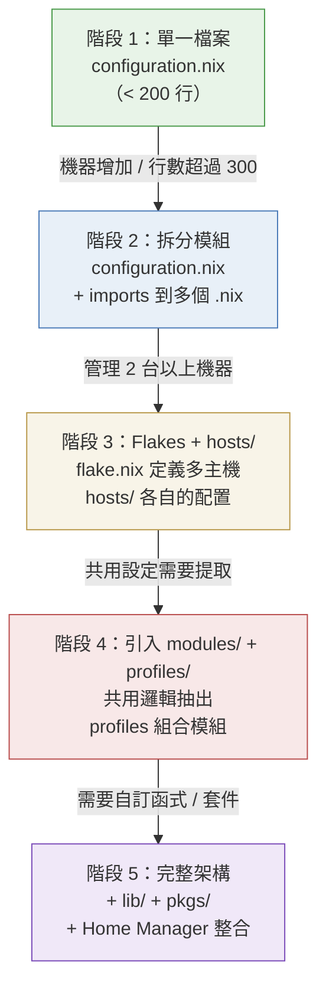
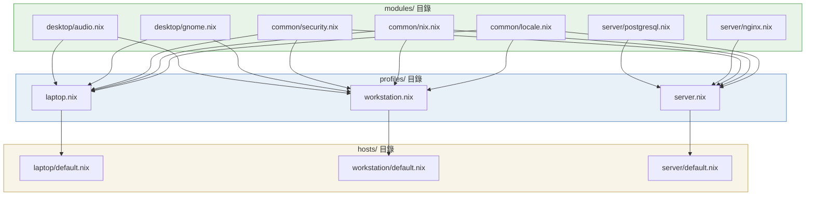
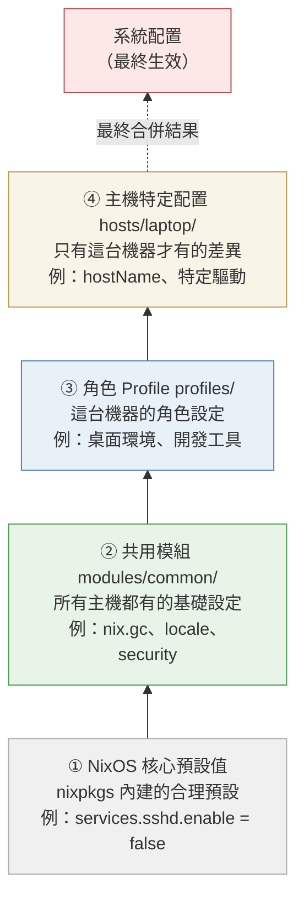
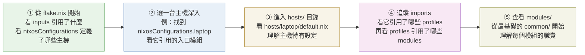

# 第20章：大型配置專案架構

---

## 本章學習目標

完成本章後，你將能夠：

1. 判斷何時需要從單一檔案升級到多層架構，並說出判斷依據
2. 設計 monorepo 風格的 NixOS Flakes 配置目錄結構，正確劃分每個目錄的職責
3. 區分 `modules/`（單一功能）與 `profiles/`（功能組合）的角色，並實際套用
4. 理解 Configuration Layering（配置分層）的合併順序，以及 `lib.mkDefault` 與 `lib.mkForce` 的使用時機
5. 閱讀別人的開源 NixOS 配置 repo，快速找到核心架構與主機設定

---

## 前置知識

在進入本章前，請確認你已完成：

- 第17章：Flakes 基礎——你知道 `flake.nix` 的 `inputs` 與 `outputs` 是什麼
- 第18章：Flakes 與 NixOS 系統配置——你知道 `nixosConfigurations` 如何定義一台主機
- 第19章：Home Manager——你知道 `home-manager` 的基本使用方式

如果對上述任何概念感到不確定，建議先回頭複習再繼續。

---

## 20.1 為什麼需要架構設計？

### 單一 configuration.nix 的極限

剛開始使用 NixOS 時，所有設定都放在 `/etc/nixos/configuration.nix` 是完全合理的。

一台簡單的桌面機器，配置可能只有 80–120 行。

然而，隨著需求增加，檔案會快速膨脹：

- 安裝更多套件
- 設定更多服務（nginx、postgresql、samba）
- 加入桌面環境的細部設定
- 設定使用者、群組、SSH 金鑰

當檔案超過 **300 行**，痛苦就開始了：

- 想改「字型設定」，你不知道在第幾行
- 想知道「這台機器有沒有開 firewall」，你必須搜尋整份檔案
- 不同區塊之間互相干擾，難以單獨測試某一段配置

這是 configuration drift 的另一種形式：**配置本身變得難以理解和維護**。

### 多台機器時的挑戰

當你管理超過一台機器時，問題會倍增。

假設你有三台機器：

- `laptop`：Alice 的日常工作筆電，需要桌面環境、省電管理
- `workstation`：Alice 的開發主機，需要較高效能配置、大量開發工具
- `server`：遠端伺服器，只需要 nginx、postgresql，不需要桌面

這三台機器有很多**相同的設定**：

- 相同的 Nix 設定（garbage collection 週期、binary cache）
- 相同的 locale 與時區
- 相同的 SSH 安全設定
- 相同的使用者 alice

但也有很多**不同的設定**：

- 桌面環境：`laptop` 和 `workstation` 有，`server` 沒有
- 省電設定：只有 `laptop` 需要
- 伺服器服務：只有 `server` 需要

**問題：** 如何在不重複 300 行程式碼的情況下，管理這三台機器？

把共用設定複製貼上到三份配置？

這會導致一個典型的反模式：

> 修改 locale 設定時，你必須同時修改三個檔案，而且很容易遺漏其中一個。

### 配置設計的三個核心原則

好的 NixOS 大型配置，必須遵守三個核心原則：

**原則一：單一真實來源（Single Source of Truth）**

每一份配置資訊，只存在於一個地方。

`locale.nix` 是 locale 的唯一真相來源。
所有主機引用這份檔案，而不是各自定義自己的 locale。

**原則二：職責分離（Separation of Concerns）**

每個檔案只負責一件事。

`nix.nix` 只管 Nix 設定。
`audio.nix` 只管音效。
`hosts/laptop/default.nix` 只管 laptop 特有的差異。

**原則三：漸進式複雜度（Progressive Complexity）**

架構從簡單開始，按實際需求演進。

不要在只有一台機器時就建立完整的多層架構。
在需要時才引入新的抽象層次。

### 從單一大檔案到分層架構的演進路徑

下面的 Mermaid 圖展示了一個典型的演進過程：



不要跳過階段。

從階段 1 直接跳到階段 5，是初學者最常犯的錯誤之一。

---

## 20.2 推薦目錄結構

以下是管理三台機器時的推薦完整目錄結構。

每個目錄都有其明確的職責，不可隨意合併或省略。

```text
my-nixos-config/
├── flake.nix                   # 入口點，定義所有主機的 nixosConfigurations
├── flake.lock                  # 鎖定所有依賴版本（自動生成，需納入版本控制）
│
├── hosts/                      # 每台主機的個別配置
│   ├── laptop/
│   │   ├── default.nix         # 主機特有設定（hostname、特定服務、硬體微調）
│   │   └── hardware.nix        # 硬體配置（nixos-generate-config 自動生成）
│   ├── workstation/
│   │   ├── default.nix
│   │   └── hardware.nix
│   └── server/
│       ├── default.nix
│       └── hardware.nix
│
├── modules/                    # 可重用的 NixOS 模組（單一功能為單位）
│   ├── common/                 # 所有主機共用的基本設定
│   │   ├── default.nix         # 滙入此目錄所有模組的入口
│   │   ├── locale.nix          # 語系、時區設定
│   │   ├── nix.nix             # Nix 設定（GC、binary cache、flakes 啟用）
│   │   └── security.nix        # 基本安全設定（SSH hardening、sudo 規則）
│   ├── desktop/                # 桌面主機專用模組
│   │   ├── default.nix         # 滙入 desktop 所有模組
│   │   ├── gnome.nix           # GNOME 桌面環境
│   │   └── audio.nix           # PipeWire 音效設定
│   └── server/                 # 伺服器專用模組
│       ├── default.nix         # 滙入 server 所有模組
│       ├── nginx.nix           # Nginx 配置
│       └── postgresql.nix      # PostgreSQL 配置
│
├── profiles/                   # 角色組合（把多個 modules 打包成一個 profile）
│   ├── workstation.nix         # common + desktop + development 工具
│   ├── laptop.nix              # common + desktop + 省電管理
│   └── server.nix              # common + server 模組
│
├── home/                       # Home Manager 使用者配置
│   ├── alice/
│   │   └── default.nix         # alice 使用者的主配置
│   └── shared/                 # 跨使用者共用的 Home Manager 設定
│       └── git.nix             # 共用的 git 基礎設定
│
├── pkgs/                       # 自訂套件（不在 nixpkgs 中的套件）
│   └── myapp/
│       └── default.nix         # 自訂套件的 derivation
│
└── lib/                        # 自訂輔助函式
    └── default.nix             # 封裝重複性高的 Nix 表達式
```

### 各目錄的職責說明

下面逐一說明每個目錄「為什麼這樣分」。

**`flake.nix`：唯一入口點**

這是整個配置的起點。

它負責兩件事：宣告外部依賴（`inputs`），以及定義所有主機的 `nixosConfigurations`（`outputs`）。

你不應該在 `flake.nix` 裡直接寫大量配置邏輯，它只是「組裝各部分」的地方。

**`flake.lock`：版本鎖定**

由 Nix 自動生成，記錄每個 input 的精確 commit hash。

必須納入 git 版本控制（不要加入 `.gitignore`）。

這個檔案是「可重現性」的保證：任何人 clone 這個 repo，得到的系統完全相同。

**`hosts/`：主機個別差異**

每台機器都有自己的目錄。

這個目錄只存放「這台機器與其他機器不同的地方」。

不要在這裡放共用配置，共用配置屬於 `modules/` 和 `profiles/`。

**`modules/`：單一功能的可重用模組**

每個 `.nix` 檔案只負責一件具體的事情。

按功能分組到子目錄（`common/`、`desktop/`、`server/`）。

`modules/` 裡的每個模組，設計上應該可以被任何主機引用，不依賴特定主機的設定。

**`profiles/`：功能組合**

`profiles/` 是 `modules/` 的上一層抽象。

一個 profile 把多個相關的 modules 打包成一個「角色」。

例如：「筆電角色」= common 模組 + 桌面模組 + 省電管理模組。

主機只需要引用對應的 profile，不需要逐一引用每個 module。

**`home/`：使用者層級配置**

Home Manager 配置放在這裡，與系統層配置分開。

這使得「系統配置」和「使用者環境配置」的關注點清楚分離。

`shared/` 目錄存放多個使用者共用的 Home Manager 設定。

**`pkgs/`：自訂套件**

當你需要安裝的套件不在 nixpkgs 裡，或者需要修改 nixpkgs 裡現有套件的某些選項時，把自訂 derivation 放在這裡。

**`lib/`：自訂輔助函式**

封裝重複性高的 Nix 表達式。

規則：同一個模式出現超過 **3 次**，才值得抽象成 lib 函式。

---

## 20.3 hosts/：主機個別配置

### 目錄的標準結構

每個主機目錄至少包含兩個檔案：

```text
hosts/laptop/
├── default.nix     # 主機特有配置
└── hardware.nix    # 硬體配置
```

`hardware.nix` 通常由 `nixos-generate-config` 指令自動生成，包含：

- 核心模組（initrd、filesystems）
- 硬體驅動（顯卡、網卡）
- 檔案系統掛載點

這個檔案不需要手動修改，除非你有特殊的硬體需求。

`default.nix` 才是你的主戰場，它負責：

- 宣告這台機器的 `networking.hostName`
- 引用對應的 profile（例如 `profiles/laptop.nix`）
- 設定這台機器特有的差異（例如：只有這台機器需要特定的驅動）

### laptop/default.nix 完整範例

下面是一個完整的 `hosts/laptop/default.nix` 範例。

注意它非常簡短——所有共用邏輯都在 profile 裡，這裡只放差異。

```nix
# hosts/laptop/default.nix
#
# 這個檔案只負責 laptop 這台機器「與其他機器不同」的部分。
# 共用設定請看 profiles/laptop.nix 和 modules/ 目錄。

{ config, pkgs, lib, ... }:

{
  imports = [
    # 硬體配置（自動生成）
    ./hardware.nix

    # 引用 laptop 角色 profile，包含：
    #   - modules/common（所有主機共用設定）
    #   - modules/desktop（桌面環境）
    #   - 省電管理
    ../../profiles/laptop.nix
  ];

  # ── 主機識別 ──────────────────────────────────────────────────────
  networking.hostName = "alice-laptop";

  # ── 主機特有設定 ──────────────────────────────────────────────────
  # 這台 laptop 使用 Intel 無線網卡，需要額外的 firmware
  hardware.enableRedistributableFirmware = true;
  hardware.cpu.intel.updateMicrocode = true;

  # 這台機器的螢幕解析度特別高，需要調整 HiDPI 設定
  services.xserver.dpi = 220;

  # ── 使用者設定 ────────────────────────────────────────────────────
  # 使用者 alice 的基本設定（密碼、群組）
  users.users.alice = {
    isNormalUser = true;
    description = "Alice";
    extraGroups = [ "wheel" "networkmanager" "audio" "video" ];
    # 實際使用時，密碼應使用 hashedPassword 或 passwordFile
    initialPassword = "changeme";
  };

  # ── Home Manager 整合 ─────────────────────────────────────────────
  # 引入 alice 的 Home Manager 配置
  home-manager.users.alice = import ../../home/alice/default.nix;

  # ── 系統版本 ──────────────────────────────────────────────────────
  system.stateVersion = "25.05";
}
```

這個檔案結構清晰：

1. 硬體配置由獨立檔案管理
2. 角色功能由 profile 統一提供
3. 這個檔案只寫「這台機器獨有的設定」

未來如果要新增一台筆電，你只需要複製這個目錄，改 `hostName` 和硬體特有設定，其他全部自動繼承。

### flake.nix 如何引用主機配置

在 `flake.nix` 的 `nixosConfigurations` 裡，我們這樣引用 laptop 主機：

```nix
# flake.nix（片段）
nixosConfigurations = {
  laptop = nixpkgs.lib.nixosSystem {
    system = "x86_64-linux";
    modules = [
      ./hosts/laptop/default.nix
    ];
    # specialArgs 讓 hosts/ 裡的模組可以存取自訂的 lib
    specialArgs = { inherit inputs; };
  };
};
```

注意：我們只傳入 `./hosts/laptop/default.nix`。

這個 `default.nix` 再 import `hardware.nix` 和 profile，形成一個清楚的樹狀引用關係。

---

## 20.4 modules/ vs profiles/：兩層抽象

### 為什麼需要兩層？

這是整章最核心的概念。

許多初學者把 `modules/` 和 `profiles/` 的職責搞混，導致架構一開始清晰，後來越來越混亂。

讓我們用一個比喻來解釋：

**`modules/` = 樂高積木**

每塊積木有固定的形狀和功能。

`gnome.nix` 就是「GNOME 積木」，它的唯一職責是設定 GNOME 桌面。
`audio.nix` 就是「音效積木」，它只管 PipeWire 音效。
`nix.nix` 就是「Nix 設定積木」，它只管 garbage collection 和 binary cache。

**`profiles/` = 樂高套組**

套組是由多塊積木組合而成的完整結構。

`laptop.nix` 這個套組包含：common 積木 + desktop 積木 + 省電積木。
`server.nix` 這個套組包含：common 積木 + nginx 積木 + postgresql 積木。

**`hosts/` = 你的房間**

你的房間是最終的成品。

房間裡放了「客廳套組」（來自 profiles），再加上一些你個人的物品（hosts 的特有設定）。

### modules 和 profiles 的引用關係圖



從這張圖可以清楚看出：

- `modules/` 是最底層，每個模組獨立存在
- `profiles/` 在中間，組合多個模組
- `hosts/` 在最上層，引用對應的 profile 再加上特有設定

### profiles/workstation.nix 完整範例

workstation 這個角色，組合了 common 設定、桌面環境、以及開發工具。

```nix
# profiles/workstation.nix
#
# workstation 角色：適合開發工作站。
# 包含所有共用設定、完整桌面環境，以及開發工具鏈。

{ config, pkgs, lib, ... }:

{
  imports = [
    # 所有主機共用的基本設定
    ../modules/common/default.nix

    # 桌面環境（GNOME + 音效）
    ../modules/desktop/default.nix
  ];

  # ── 開發工具 ──────────────────────────────────────────────────────
  # 這些是工作站特有的開發工具，laptop 不一定需要
  environment.systemPackages = with pkgs; [
    # 版本控制
    git
    git-lfs

    # 容器
    docker
    docker-compose

    # 開發輔助
    direnv
    nix-direnv
    just

    # 系統監控
    htop
    btop
    iotop
  ];

  # ── Docker 服務 ────────────────────────────────────────────────────
  # 工作站需要 Docker daemon
  virtualisation.docker = {
    enable = true;
    autoPrune = {
      enable = true;
      dates = "weekly";
    };
  };

  # ── 虛擬化 ────────────────────────────────────────────────────────
  # 工作站有足夠資源跑 VM
  virtualisation.libvirtd.enable = true;

  # ── 效能調整 ──────────────────────────────────────────────────────
  # 工作站不需要省電，可以使用效能模式
  powerManagement.cpuFreqGovernor = lib.mkDefault "performance";
}
```

### modules/common/nix.nix 完整範例

`nix.nix` 是所有主機都需要的 Nix 基本設定。

把它放在 `common/` 裡，確保所有機器的 Nix 行為一致。

```nix
# modules/common/nix.nix
#
# 所有主機共用的 Nix 設定。
# 包含：garbage collection、binary cache、flakes 啟用。

{ config, pkgs, lib, ... }:

{
  # ── Nix 基本設定 ──────────────────────────────────────────────────
  nix = {
    # 啟用 Flakes 與新版 CLI（nix develop、nix build 等）
    settings = {
      experimental-features = [ "nix-command" "flakes" ];

      # Binary Cache 設定
      # 優先從 cache.nixos.org 下載預建二進位，避免本地重新編譯
      substituters = [
        "https://cache.nixos.org"
        "https://nix-community.cachix.org"
      ];
      trusted-public-keys = [
        "cache.nixos.org-1:6NCHdD59X431o0gWypbMrAURkbJ16ZPMQFGspcDShjY="
        "nix-community.cachix.org-1:mB9FSh9qf2dde0rEc8CvveDygV5h0/l4aJ3tvgm8j78="
      ];

      # 允許 wheel 群組的使用者使用受信任的 binary cache
      trusted-users = [ "root" "@wheel" ];
    };

    # ── Garbage Collection 自動清理 ───────────────────────────────────
    # 每週自動清理超過 30 天未使用的世代
    gc = {
      automatic = true;
      dates = "weekly";
      options = "--delete-older-than 30d";
    };

    # ── 硬體加速（選擇性啟用）────────────────────────────────────────
    # 保留最近 5 個世代，確保有足夠的 rollback 選項
    extraOptions = ''
      keep-outputs = true
      keep-derivations = true
    '';
  };

  # ── nixpkgs 設定 ──────────────────────────────────────────────────
  nixpkgs.config = {
    # 允許使用有 unfree 授權的套件（例如 NVIDIA 驅動、VS Code）
    allowUnfree = true;
  };
}
```

### modules/desktop/default.nix 完整範例

`desktop/default.nix` 作為桌面模組的入口，它的職責是「引入所有桌面相關模組」，本身不寫太多邏輯。

```nix
# modules/desktop/default.nix
#
# 桌面環境模組的入口點。
# 這個檔案只負責引入 desktop/ 目錄下所有子模組。
# 各個子模組各司其職，這裡不寫具體的設定邏輯。

{ ... }:

{
  imports = [
    ./gnome.nix    # GNOME 桌面環境
    ./audio.nix    # PipeWire 音效
  ];
}
```

這種「目錄有一個 `default.nix` 作為入口」的模式，在 NixOS 配置中非常常見。

好處是：當你需要新增一個新模組（例如 `fonts.nix`），只要把它加到 `imports` 列表，不需要修改其他檔案。

---

## 20.5 Configuration Layering（配置分層）

### 概念：配置在多個層次合併

NixOS 的模組系統有一個強大的特性：

**來自多個檔案的配置，最終會被合併成一份完整的系統配置。**

這不是簡單的「後者覆蓋前者」，而是更細緻的合併規則。

理解這個合併順序，是避免配置衝突的關鍵。

### 四個配置層次

一台 NixOS 機器的配置，實際上由四個層次疊加而成：



在合併時，**較高層次的設定會覆蓋較低層次的設定**。

但有一些重要的細節需要了解。

### lib.mkDefault 與 lib.mkForce 的作用

NixOS 模組系統用**優先級（priority）**來決定哪個值生效。

- 一般設定的預設優先級是 **1000**
- `lib.mkDefault` 的優先級是 **1500**（比一般設定**低**，意思是「如果有人覆蓋我，那沒問題」）
- `lib.mkForce` 的優先級是 **50**（比一般設定**高**，意思是「我的值一定要生效，不許覆蓋」）

**`lib.mkDefault` 的使用時機：**

在 profile 或 module 裡設定一個「建議值」，但允許主機特定配置覆蓋它。

```nix
# profiles/laptop.nix
#
# 筆電角色的省電設定。
# 使用 mkDefault，讓主機配置可以根據具體硬體情況覆蓋這個值。

{ lib, ... }:

{
  # 預設使用省電模式，但如果某台筆電需要效能模式，可以在 hosts/ 裡覆蓋
  powerManagement.cpuFreqGovernor = lib.mkDefault "powersave";

  # 預設開啟省電功能
  services.tlp.enable = lib.mkDefault true;
}
```

```nix
# hosts/laptop/default.nix（片段）
#
# 這台筆電用來做影片渲染，需要效能模式。
# 直接指定值（優先級 1000）就可以覆蓋 mkDefault（優先級 1500）。

{ ... }:

{
  imports = [ ../../profiles/laptop.nix ];

  # 覆蓋 profile 裡的 mkDefault 值
  powerManagement.cpuFreqGovernor = "performance";
}
```

**`lib.mkForce` 的使用時機：**

在安全相關的模組裡，強制某些設定不被覆蓋。

```nix
# modules/common/security.nix
#
# 安全模組。
# 使用 mkForce 確保安全設定不會被主機配置意外關掉。

{ lib, ... }:

{
  # 強制開啟防火牆，任何層次都無法關閉它
  networking.firewall.enable = lib.mkForce true;

  # 強制禁止 root SSH 登入
  services.openssh.settings.PermitRootLogin = lib.mkForce "no";
}
```

### 合併衝突的處理

當兩個模組設定同一個選項，且沒有使用 `mkDefault` 或 `mkForce` 時，NixOS 的行為取決於選項的類型：

| 選項類型 | 合併行為 | 範例 |
|---|---|---|
| `listOf` | 兩個列表**合併** | `environment.systemPackages` 兩個模組都加套件，最後都有 |
| `attrsOf` | 兩個 attr set **遞迴合併** | `services.nginx.virtualHosts` 兩個模組的 virtual host 都保留 |
| 純量值（bool、string、int）| 若有衝突**報錯** | 兩個模組都設定 `networking.hostName`，Nix 會報錯 |

對於純量值，解決方法是讓其中一個使用 `lib.mkDefault`，或是只在一個地方設定它。

---

## 20.6 lib/：自訂輔助函式

### 為什麼需要自訂 lib

當你管理多台機器，你會發現某些模式一再出現。

例如，你有三個使用者需要在三台機器上定義，每次定義都要寫相同的結構：

```nix
# 沒有自訂 lib 時，每個使用者都要重複這段
users.users.alice = {
  isNormalUser = true;
  shell = pkgs.zsh;
  extraGroups = [ "wheel" "networkmanager" ];
  openssh.authorizedKeys.keys = [
    "ssh-ed25519 AAAA... alice@laptop"
  ];
};
```

如果你有 5 個使用者，這段程式碼會重複 5 次，只有使用者名稱和 SSH 金鑰不同。

這是抽象成 lib 函式的好時機。

### 範例：lib.myLib.mkUser 函式

在 `lib/default.nix` 裡定義一個 `mkUser` 函式：

```nix
# lib/default.nix
#
# 自訂輔助函式庫。
# 封裝重複性高的 Nix 表達式，減少樣板程式碼。
#
# 使用方式：在 flake.nix 的 specialArgs 中傳入此 lib，
# 然後在任何模組中用 myLib.mkUser { ... } 使用。

{ lib, pkgs }:

{
  # ── mkUser：快速定義標準使用者 ────────────────────────────────────
  #
  # 參數：
  #   name        - 使用者名稱（string）
  #   sshKeys     - SSH 公鑰列表（list of string），預設空列表
  #   extraGroups - 額外群組（list of string），預設空列表
  #   shell       - 登入 shell（package），預設 pkgs.bash
  #
  # 使用範例：
  #   users.users = myLib.mkUser {
  #     name = "alice";
  #     sshKeys = [ "ssh-ed25519 AAAA..." ];
  #     extraGroups = [ "docker" ];
  #   };
  mkUser = { name, sshKeys ? [], extraGroups ? [], shell ? pkgs.bash }:
    lib.nameValuePair name {
      isNormalUser = true;
      inherit shell;
      extraGroups = [ "wheel" "networkmanager" ] ++ extraGroups;
      openssh.authorizedKeys.keys = sshKeys;
    };

  # ── mkUsers：批次建立多個使用者 ───────────────────────────────────
  #
  # 接受一個使用者定義的 list，返回 users.users 的 attr set。
  #
  # 使用範例：
  #   users.users = myLib.mkUsers [
  #     { name = "alice"; sshKeys = [ "..." ]; }
  #     { name = "bob";   sshKeys = [ "..." ]; extraGroups = [ "docker" ]; }
  #   ];
  mkUsers = userList:
    builtins.listToAttrs (map (u: myLib.mkUser u) userList);

  # ── 將 lib 自身暴露，讓函式可以互相引用 ──────────────────────────
  # （在更複雜的 lib 設計中需要）
}
```

在 `hosts/laptop/default.nix` 裡使用這個函式：

```nix
# hosts/laptop/default.nix（使用 myLib 的版本）
#
# 透過 myLib.mkUser 簡化使用者定義。

{ config, pkgs, lib, myLib, ... }:

{
  imports = [
    ./hardware.nix
    ../../profiles/laptop.nix
  ];

  networking.hostName = "alice-laptop";

  # 使用自訂 lib 定義使用者，比手寫更簡潔
  users.users = {
    "${(myLib.mkUser {
      name = "alice";
      shell = pkgs.zsh;
      sshKeys = [
        "ssh-ed25519 AAAAC3NzaC1lZDI1NTE5AAAAIExample alice@laptop"
      ];
      extraGroups = [ "audio" "video" "docker" ];
    }).name}" = (myLib.mkUser {
      name = "alice";
      shell = pkgs.zsh;
      sshKeys = [
        "ssh-ed25519 AAAAC3NzaC1lZDI1NTE5AAAAIExample alice@laptop"
      ];
      extraGroups = [ "audio" "video" "docker" ];
    }).value;
  };

  system.stateVersion = "25.05";
}
```

實際上，更常見的用法是透過 `mkUsers` 搭配列表：

```nix
# hosts/laptop/default.nix（更簡潔的版本）

{ pkgs, myLib, ... }:

{
  imports = [ ./hardware.nix ../../profiles/laptop.nix ];

  networking.hostName = "alice-laptop";

  # mkUsers 接受列表，一次批次建立所有使用者
  users.users = myLib.mkUsers [
    {
      name = "alice";
      shell = pkgs.zsh;
      sshKeys = [ "ssh-ed25519 AAAAC3NzaC1lZDI1NTE5AAAAIExample alice@laptop" ];
      extraGroups = [ "audio" "video" "docker" ];
    }
  ];

  system.stateVersion = "25.05";
}
```

### 在 flake.nix 中傳遞自訂 lib

要讓 `myLib` 在所有 `hosts/` 和 `modules/` 裡都能使用，必須透過 `specialArgs` 傳入：

```nix
# flake.nix（片段）
#
# 透過 specialArgs 把 myLib 傳給所有 NixOS 模組。

{
  outputs = { self, nixpkgs, ... }@inputs:
  let
    # 建立 myLib，並把 nixpkgs 的 lib 和 pkgs 傳入
    myLib = import ./lib {
      inherit (nixpkgs) lib;
      pkgs = nixpkgs.legacyPackages.x86_64-linux;
    };
  in
  {
    nixosConfigurations = {
      laptop = nixpkgs.lib.nixosSystem {
        system = "x86_64-linux";
        modules = [ ./hosts/laptop/default.nix ];

        # specialArgs 讓所有模組都可以接收 myLib 作為參數
        specialArgs = {
          inherit inputs myLib;
        };
      };
    };
  };
}
```

任何模組只要在函式參數裡加上 `myLib`，就可以使用它：

```nix
# 任何 module 都可以這樣使用 myLib
{ pkgs, myLib, ... }:
{
  users.users = myLib.mkUsers [ ... ];
}
```

### 何時該建立 lib 函式

遵循一個簡單的原則：

**同一個模式出現超過 3 次，才值得抽象成 lib 函式。**

過早的抽象會讓配置難以理解，因為讀者需要先找到 lib 的定義，才能理解當前模組在做什麼。

---

## 20.7 多使用者、多主機管理

### 完整的三主機 flake.nix 範例

這是管理 `laptop`、`workstation`、`server` 三台機器的完整 `flake.nix`。

每台機器都有自己的配置，但共用相同的 nixpkgs 版本。

```nix
# flake.nix
#
# 多主機 NixOS 配置的入口點。
# 管理三台機器：laptop、workstation、server。
#
# 使用方式：
#   # 在 laptop 上部署
#   sudo nixos-rebuild switch --flake .#laptop
#
#   # 在 workstation 上部署
#   sudo nixos-rebuild switch --flake .#workstation
#
#   # 在 server 上部署（可以從遠端執行）
#   nixos-rebuild switch --flake .#server --target-host alice@server.example.com

{
  description = "Alice 的 NixOS 配置 — 管理 laptop、workstation、server";

  inputs = {
    # NixOS 25.05 穩定版
    nixpkgs.url = "github:NixOS/nixpkgs/nixos-25.05";

    # Home Manager，版本對應 nixpkgs
    home-manager = {
      url = "github:nix-community/home-manager/release-25.05";
      inputs.nixpkgs.follows = "nixpkgs";
    };

    # 機密管理（agenix）——暫留，第22章詳細說明
    # agenix.url = "github:ryantm/agenix";
  };

  outputs = { self, nixpkgs, home-manager, ... }@inputs:
  let
    # ── 輔助函式 ────────────────────────────────────────────────────
    # 自訂 lib，封裝重複的使用者定義邏輯
    myLib = import ./lib {
      inherit (nixpkgs) lib;
      pkgs = nixpkgs.legacyPackages.x86_64-linux;
    };

    # 建立 NixOS 系統的輔助函式，減少重複
    # 參數：
    #   hostname - 主機名稱（也是 nixosConfigurations 的 key）
    #   system   - 系統架構，預設 x86_64-linux
    #   modules  - 額外引入的模組列表
    mkHost = { hostname, system ? "x86_64-linux", modules ? [] }:
      nixpkgs.lib.nixosSystem {
        inherit system;
        modules = [
          # 主機配置入口（每台主機必有）
          ./hosts/${hostname}/default.nix

          # Home Manager 整合（作為 NixOS 模組引入）
          home-manager.nixosModules.home-manager
          {
            home-manager.useGlobalPkgs = true;
            home-manager.useUserPackages = true;
            # Home Manager 的備份副檔名
            home-manager.backupFileExtension = "backup";
          }
        ] ++ modules;

        # 傳入所有 modules 都可以存取的額外參數
        specialArgs = {
          inherit inputs myLib;
        };
      };

  in
  {
    # ── 所有主機的配置 ───────────────────────────────────────────────
    nixosConfigurations = {

      # Alice 的日常工作筆電
      # 系統架構：x86_64-linux
      # 特色：桌面環境、省電管理、Intel 無線網卡
      laptop = mkHost { hostname = "laptop"; };

      # Alice 的開發工作站
      # 系統架構：x86_64-linux
      # 特色：完整桌面環境、Docker、虛擬化、效能模式
      workstation = mkHost { hostname = "workstation"; };

      # 遠端伺服器（Hetzner Cloud）
      # 系統架構：x86_64-linux
      # 特色：nginx、postgresql、無桌面環境
      server = mkHost { hostname = "server"; };
    };
  };
}
```

### 各主機的配置差異對比

| 設定項目 | laptop | workstation | server |
|---|---|---|---|
| 桌面環境（GNOME） | ✓ | ✓ | ✗ |
| 省電管理（TLP） | ✓ | ✗ | ✗ |
| Docker | ✗ | ✓ | ✓ |
| nginx | ✗ | ✗ | ✓ |
| PostgreSQL | ✗ | ✗ | ✓ |
| Home Manager（alice） | ✓ | ✓ | ✗ |
| HiDPI 設定 | ✓ | ✗ | ✗ |

### 讓 alice 在不同機器有不同的 Home Manager 配置

alice 的主要 Home Manager 配置放在 `home/alice/default.nix`，這是所有機器共用的部分。

但 alice 在 `laptop` 和 `workstation` 上可能有些不同：筆電上開啟省電相關的應用程式設定，工作站上則安裝更多重量級開發工具。

**共用配置：`home/alice/default.nix`**

```nix
# home/alice/default.nix
#
# alice 在所有機器上共用的 Home Manager 配置。
# 機器特有的差異，透過 imports 引入機器特定的 home 模組。

{ config, pkgs, lib, ... }:

{
  imports = [
    # 所有使用者共用的 git 設定
    ../shared/git.nix
  ];

  # ── 基本設定 ──────────────────────────────────────────────────────
  home.username = "alice";
  home.homeDirectory = "/home/alice";
  home.stateVersion = "25.05";

  # ── 所有機器都有的工具 ────────────────────────────────────────────
  home.packages = with pkgs; [
    # 基本工具
    ripgrep
    fd
    bat
    eza
    fzf
    jq

    # 編輯器
    neovim
  ];

  # ── Zsh 配置 ──────────────────────────────────────────────────────
  programs.zsh = {
    enable = true;
    enableAutosuggestions = true;
    enableSyntaxHighlighting = true;
    oh-my-zsh = {
      enable = true;
      theme = "robbyrussell";
      plugins = [ "git" "fzf" "direnv" ];
    };
  };

  # ── 啟用 Home Manager 自我管理 ───────────────────────────────────
  programs.home-manager.enable = true;
}
```

**laptop 特有的 Home Manager 設定**

在 `hosts/laptop/default.nix` 裡，可以覆蓋或擴充 alice 的 Home Manager 配置：

```nix
# hosts/laptop/default.nix（片段）
#
# 在 laptop 上，為 alice 額外安裝筆電適用的工具。

{ pkgs, myLib, ... }:

{
  imports = [ ./hardware.nix ../../profiles/laptop.nix ];

  networking.hostName = "alice-laptop";

  users.users.alice = {
    isNormalUser = true;
    extraGroups = [ "wheel" "networkmanager" "audio" "video" ];
    initialPassword = "changeme";
  };

  # Home Manager 整合：基礎配置 + laptop 特有設定
  home-manager.users.alice = { config, pkgs, ... }: {
    imports = [
      # 共用的基礎 Home Manager 配置
      ../../home/alice/default.nix
    ];

    # laptop 特有的 Home Manager 設定
    # 例如：省電相關的應用程式設定
    home.packages = with pkgs; [
      # 筆電電池管理工具
      powertop
      acpi
    ];

    # 在筆電上，使用較小的字型以符合螢幕比例
    fonts.fontconfig.enable = true;
  };

  system.stateVersion = "25.05";
}
```

**workstation 特有的 Home Manager 設定**

```nix
# hosts/workstation/default.nix（片段）
#
# 在 workstation 上，為 alice 額外安裝開發工具。

{ pkgs, myLib, ... }:

{
  imports = [ ./hardware.nix ../../profiles/workstation.nix ];

  networking.hostName = "alice-workstation";

  users.users.alice = {
    isNormalUser = true;
    extraGroups = [ "wheel" "networkmanager" "audio" "video" "docker" "libvirtd" ];
    initialPassword = "changeme";
  };

  home-manager.users.alice = { config, pkgs, ... }: {
    imports = [
      ../../home/alice/default.nix
    ];

    # 工作站上額外安裝重量級開發工具
    home.packages = with pkgs; [
      # IDE
      jetbrains.idea-ultimate

      # 資料庫工具
      dbeaver-bin

      # API 測試
      insomnia

      # 監控
      grafana
    ];
  };

  system.stateVersion = "25.05";
}
```

這樣的設計讓你在不同機器上的 alice 都有一致的基礎環境，同時允許每台機器根據自身角色加入額外工具。

---

## 20.8 實際開源配置參考

### 值得學習的開源 NixOS 配置

站在巨人的肩膀上是學習的捷徑。

以下是幾個設計良好、值得學習的開源 NixOS 配置 repo：

**1. Misterio77/nix-starter-configs**

GitHub：`https://github.com/Misterio77/nix-starter-configs`

這是最適合初學者的起點。

提供了「minimal」和「standard」兩個模板：

- `minimal`：只有最基本的 Flakes 結構，適合完全從零開始
- `standard`：包含 Home Manager 整合和基本模組分離，與本章介紹的架構非常相似

閱讀重點：

- `flake.nix` 如何組織 `outputs`
- `nixosConfigurations` 的定義方式
- Home Manager 如何作為 NixOS 模組引入

**2. ryan4yin/nix-config**

GitHub：`https://github.com/ryan4yin/nix-config`

這個 repo 包含了更進階的架構，包含：

- 多架構支援（x86_64-linux 和 aarch64-linux）
- `agenix` 機密管理整合
- 自訂 lib 的實際使用案例
- 非常詳細的中文說明

特別適合想了解「真實世界的複雜配置如何組織」的讀者。

閱讀重點：

- `lib/` 目錄如何組織自訂函式
- 如何同時管理 NixOS 和 macOS（nix-darwin）配置
- `agenix` 機密管理的整合方式

**3. EmergentMind/nix-config**

GitHub：`https://github.com/EmergentMind/nix-config`

有完整的文件說明每個設計決策背後的原因，適合想深入理解架構思考的讀者。

閱讀重點：

- 詳細的 `README`，解釋每個目錄的職責
- `profiles/` 和 `modules/` 的細緻分層
- 如何漸進地演進架構

### 閱讀別人配置的技巧

剛看到別人的大型配置 repo，常常會感到不知從何看起。

以下是一個有系統的閱讀路徑：



使用這個路徑，你可以快速理解任何陌生的 NixOS 配置 repo 的整體架構。

### 「不要一開始就用最複雜的架構」

看完這些開源配置，你可能會覺得自己的配置太簡單了，想立刻套用最複雜的架構。

這是一個常見的陷阱。

**複雜的架構是為了解決複雜的問題。**

如果你只有一台機器，一個 `flake.nix` + 幾個 `modules/` 就夠了。

如果你有兩台機器，加上 `hosts/` 和 `profiles/` 就夠了。

如果你有機密管理需求，再引入 `agenix`。

按照本章一開始的「演進路徑圖」，從最小可用結構開始，在真正遇到問題時才增加新的抽象層次。

這是「漸進式複雜度」原則的實踐。

---

## 本章小結

本章介紹了管理大型 NixOS 配置的完整架構方法。

### 核心概念回顧

**架構驅動力（什麼時候需要架構）：**

- 單一檔案超過 300 行，難以維護
- 開始管理多台機器，有共用設定需求
- 需要讓不同角色的機器（桌面、伺服器）保有各自的特色

**目錄結構的職責分層：**

| 目錄 | 職責 | 關鍵原則 |
|---|---|---|
| `hosts/` | 主機特有差異 | 只放「與其他機器不同」的設定 |
| `modules/` | 單一功能模組 | 每個檔案只做一件事 |
| `profiles/` | 功能組合角色 | 把相關模組打包成主機角色 |
| `home/` | 使用者環境 | 與系統層清楚分離 |
| `lib/` | 自訂輔助函式 | 3次以上重複才抽象 |
| `pkgs/` | 自訂套件 | 不在 nixpkgs 的套件 |

**兩層抽象（最重要的概念）：**

- `modules/` = 積木，每塊獨立
- `profiles/` = 套組，組合多塊積木
- `hosts/` = 成品，使用套組再加個人化

**配置分層合併順序：**

1. NixOS 核心預設值（最低優先）
2. `modules/common/`（所有主機共用）
3. `profiles/`（角色設定）
4. `hosts/`（主機特有，最高優先）

**分層控制工具：**

- `lib.mkDefault`：設定建議值，允許上層覆蓋
- `lib.mkForce`：強制值，不允許任何層次覆蓋

### 下一步

完成本章後，你已經掌握了大型 NixOS 配置的骨架設計。

在後續章節中，我們將繼續深入：

- **第21章**：Custom Options——如何為自己的模組定義 NixOS 風格的選項介面
- **第22章**：機密管理——使用 `agenix` 或 `sops-nix` 安全管理密碼和 SSH 金鑰
- **第23章**：CI/CD 整合——自動測試和部署你的 NixOS 配置

### 動手練習

在繼續下一章之前，建議完成以下練習：

1. 在你的現有 Flakes 配置基礎上，建立 `hosts/`、`modules/`、`profiles/` 目錄結構
2. 把 `configuration.nix` 中的 Nix 設定（GC、binary cache）抽取到 `modules/common/nix.nix`
3. 建立一個 `profiles/desktop.nix`，引入所有桌面相關模組
4. 確認重構後的配置可以正常 `nixos-rebuild build`

每一步完成後，用 git commit 記錄，這樣萬一出錯可以輕鬆回滾。

---

> **本章使用的 nixpkgs 版本：** `github:NixOS/nixpkgs/nixos-25.05`
>
> **本章主機名稱慣例：** `laptop`、`workstation`、`server`
>
> **本章使用者慣例：** `alice`
