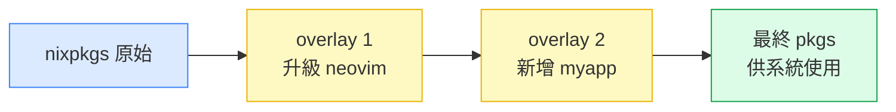
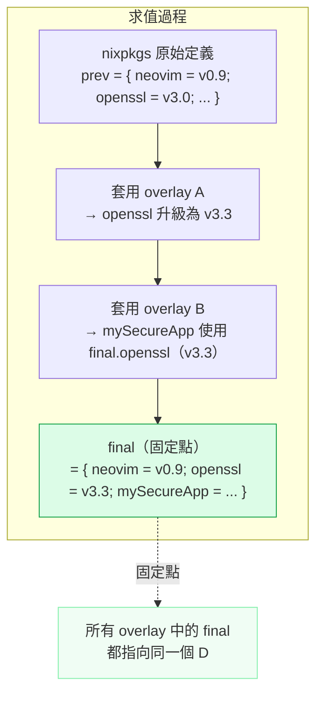
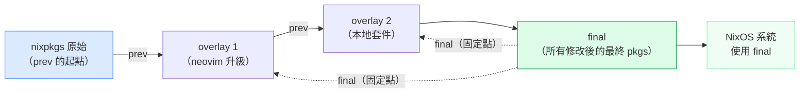

# 第21章：Overlay 與 Package Override

## 本章學習目標

完成本章後，你將能夠：

1. 解釋覆蓋層（Overlay）的運作機制，以及 `final` / `prev` 的遞迴關係
2. 使用 `.override` 與 `.overrideAttrs` 修改現有套件的屬性
3. 為套件套用修補程式（Patch），解決上游尚未合併的 bug fix
4. 撰寫可獨立運作的自訂衍生物（Derivation）
5. 在 Flakes 專案中建立本地套件 repository，並透過 overlay 注入系統

---

## 前置知識

在閱讀本章之前，你應該已經：

- 完成第五篇（第17–20章），理解 Flakes 的 `inputs` / `outputs` 結構
- 能夠以 `nixos-rebuild switch --flake .#nixos` 建構系統
- 熟悉 Nix 語言中的 attribute set、函式與 `let / in`

如果還不熟悉上述概念，建議先回顧第2章與第17章。

---

## 21.1 Overlay 的用途與基本概念

### 什麼時候需要 Overlay？

nixpkgs 提供了數萬個套件。

但在實際工作中，你可能遇到：

- 上游套件版本太舊，需要升級到尚未進入穩定版的新版本
- 套件有已知 bug，上游 PR 尚未合併，必須自己打補丁
- 需要的套件根本不在 nixpkgs 中，必須自己封裝
- 某個套件的預設編譯選項不符合需求，必須修改 configure flags

這些情況，都是使用覆蓋層（Overlay）的時機。

### Overlay 的核心思想：疊加，而非修改

傳統做法是直接修改 nixpkgs 的原始碼。

這樣做有幾個問題：

- 更新 nixpkgs 後修改會被覆蓋
- 無法與他人共用同一份 nixpkgs
- 版本管理困難

Overlay 的設計解決了這個問題：

**Overlay 不修改 nixpkgs，而是在上面疊加一層新的定義。**

當你查詢 `pkgs.neovim` 時，Nix 會先在所有 overlay 中尋找 `neovim` 的定義，若有覆蓋，就用覆蓋後的版本；若無，則使用原始 nixpkgs 的版本。

原始的 nixpkgs 完全不受影響。

### Overlay 的疊加鏈

多個 overlay 可以依序疊加，後面的 overlay 可以看見前面 overlay 的修改。



疊加的順序很重要：

- overlay 1 看不見 overlay 2 的修改
- overlay 2 可以看見 overlay 1 的修改，並在其基礎上繼續調整

### NixOS 中的三種使用方式

Overlay 有三個主要的使用入口：

**方式一：在 NixOS 模組中透過 `nixpkgs.overlays` 傳入**

這是最常見的方式，適合系統層的套件覆蓋：

```nix
# configuration.nix 或任何 NixOS module
{ config, pkgs, ... }:

{
  nixpkgs.overlays = [
    (final: prev: {
      neovim = prev.neovim.overrideAttrs (old: {
        version = "0.10.3";
      });
    })
  ];
}
```

**方式二：在 flake.nix 的 `overlays` output 中定義，供他人使用**

```nix
# flake.nix（片段）
outputs = { self, nixpkgs }: {
  overlays.default = final: prev: {
    myapp = final.callPackage ./pkgs/myapp { };
  };
};
```

**方式三：在 flake.nix 的 nixpkgs 實例化時直接傳入**

```nix
# flake.nix（片段）
let
  pkgs = import nixpkgs {
    system = "x86_64-linux";
    overlays = [ self.overlays.default ];
  };
in { ... }
```

在實際的 `nixosConfigurations` 中，最推薦的方式是方式一，因為它與 NixOS module 系統整合最緊密，且能與 `nixpkgs.config` 等設定共存。

---

## 21.2 `self` 與 `super`：固定點組合子

### Overlay 的函式簽名

每個 overlay 都是一個接受兩個參數的函式：

```nix
final: prev: {
  # 此處定義或覆蓋套件
}
```

你也常常會看到這些等價的命名：

| 參數名 | 含義 |
|--------|------|
| `final` / `self` | 套用所有 overlay 後的最終 pkgs |
| `prev` / `super` | 套用此 overlay 之前的 pkgs |

這兩個命名風格完全等價。本書統一使用 `final` 與 `prev`，但你在社群的範例中會看到兩種寫法。

### `final` 與 `prev` 的核心區別

這是初學者最常混淆的地方。讓我們用具體的場景說明。

**`prev`：取得此 overlay 套用前的套件**

當你想要基於原始 nixpkgs 的套件做修改時，使用 `prev`：

```nix
final: prev: {
  # prev.neovim 是原始 nixpkgs 中的 neovim
  # 我們在它的基礎上修改
  neovim = prev.neovim.overrideAttrs (old: {
    patches = old.patches ++ [ ./fix-clipboard.patch ];
  });
}
```

如果這裡改用 `final.neovim`，會發生什麼事？

`final.neovim` 指向的是「套用此 overlay 後的 neovim」，而這個 overlay 本身就在定義 `neovim`，所以就形成了：

> neovim = (neovim 的 overrideAttrs)，而 neovim 又參照自己

這會導致無窮遞迴（infinite recursion）。

結論：**修改現有套件時，一定要用 `prev` 取得原始版本。**

**`final`：引用其他 overlay 已修改過的套件**

當你的套件需要依賴另一個 overlay 修改後的版本時，使用 `final`：

```nix
# overlay A：升級 openssl
overlayA = final: prev: {
  openssl = prev.openssl.overrideAttrs (old: {
    version = "3.3.0";
    src = prev.fetchurl { /* ... */ };
  });
};

# overlay B：封裝一個需要新版 openssl 的套件
overlayB = final: prev: {
  mySecureApp = prev.stdenv.mkDerivation {
    # 使用 final.openssl，取得 overlayA 修改後的新版
    buildInputs = [ final.openssl ];
    # ...
  };
};
```

`final.openssl` 在此處取得的，是 overlay A 升級後的版本，而不是原始 nixpkgs 的版本。

### Fixed-Point（固定點）的求值過程

Overlay 的機制背後是一個數學概念：固定點組合子（Fixed-Point Combinator）。



「固定點」的意思是：`final` 的值，就是整個疊加鏈計算完成後的最終結果。

Nix 透過惰性求值（lazy evaluation）讓這個自我參照成為可能：

- 每個 overlay 中的 `final` 都是一個「承諾」，指向最終計算結果
- 只有當你真正存取 `final.somePackage` 時，Nix 才會去計算它
- 只要不形成實際的循環依賴，這個機制就能正確運作

實際使用規則很簡單：

- 覆蓋套件本身 → 用 `prev`
- 引用其他 overlay 的結果 → 用 `final`
- 引用本 overlay 未修改的其他套件 → 用 `final` 或 `prev` 都可以（建議 `final`）

---

## 21.3 修改現有套件版本

### `.override` 與 `.overrideAttrs` 的差異

nixpkgs 中每個套件都支援兩種覆蓋機制，它們的適用場景截然不同。

**.override：修改套件的「輸入參數」**

許多套件是透過函式定義的，函式參數包括依賴套件、功能開關等。

`.override` 讓你替換這些參數，但不改變 derivation 本身的建置邏輯：

```nix
# curl 套件函式大致長這樣：
# { stdenv, openssl, zlib, ... }:
# stdenv.mkDerivation { ... }

# 用 .override 替換 openssl 依賴
curl.override {
  openssl = myCustomOpenssl;
}
```

**.overrideAttrs：修改 derivation 的任意屬性**

`.overrideAttrs` 讓你修改 `mkDerivation` 傳入的任意屬性，包括：

- `version`
- `src`
- `patches`
- `buildPhase`
- `installPhase`
- `buildInputs`
- `meta`

這是更強大、更常用的方式：

```nix
prev.somePackage.overrideAttrs (old: {
  # old 是原始的 derivation attributes
  # 回傳新的 attribute set，會與 old 合併
  version = "2.0.0";
  src = prev.fetchFromGitHub { /* ... */ };
})
```

**選擇指引：**

| 場景 | 建議使用 |
|------|---------|
| 替換依賴套件（如換用特定版本的 openssl） | `.override` |
| 啟用 / 停用功能開關（如 `withGUI = true`） | `.override` |
| 修改版本號與下載來源 | `.overrideAttrs` |
| 新增或移除 patch | `.overrideAttrs` |
| 修改建置或安裝步驟 | `.overrideAttrs` |
| 修改 meta 資訊（如 license） | `.overrideAttrs` |

### 在 Overlay 中升級套件版本

以下是一個完整的範例：將 nixpkgs 中的 neovim 升級到特定版本。

這個 overlay 可以直接放入 `nixpkgs.overlays`：

```nix
# overlays/neovim-upgrade.nix
final: prev: {

  neovim = prev.neovim.overrideAttrs (old: rec {
    # rec 讓我們在此 attribute set 中引用其他欄位
    pname = "neovim";
    version = "0.10.3";

    src = prev.fetchFromGitHub {
      owner = "neovim";
      repo = "neovim";
      rev = "v${version}";
      # 從 https://github.com/neovim/neovim/releases 確認 hash
      hash = "sha256-xxxxxxxxxxxxxxxxxxxxxxxxxxxxxxxxxxxxxxxxxxxxxx=";
    };

    # 清除原有 patches，避免與新版不相容
    patches = [];
  });

}
```

在 NixOS 模組中啟用這個 overlay：

```nix
# modules/overlays.nix
{ ... }:

{
  nixpkgs.overlays = [
    (import ../overlays/neovim-upgrade.nix)
  ];
}
```

### 在 Overlay 中降級套件

有時候，新版套件帶來了 regression，你需要暫時降級。

方法是從 nixpkgs 的舊版 commit 中引入套件定義：

```nix
# overlays/downgrade-example.nix
final: prev: {

  # 從特定的舊版 nixpkgs commit 引入套件
  somePackage =
    let
      # 固定到一個已知可用的舊版 nixpkgs commit
      oldNixpkgs = prev.fetchFromGitHub {
        owner = "NixOS";
        repo = "nixpkgs";
        rev = "a3ed7406349a9335cb4c2a71369b697cecd9d351";
        hash = "sha256-xxxxxxxxxxxxxxxxxxxxxxxxxxxxxxxxxxxxxxxxxxxxxx=";
      };
      oldPkgs = import oldNixpkgs {
        inherit (prev) system;
        config = { allowUnfree = true; };
      };
    in
    oldPkgs.somePackage;

}
```

這種方式能精準固定到已知可用的版本，且不影響其他套件。

---

## 21.4 套用 Patch

### 什麼時候需要套用 Patch？

常見情境：

- 上游套件有已知 bug，修復的 PR 已經存在但尚未合併到穩定版
- 需要調整套件的預設行為（如修改設定檔路徑）
- 需要臨時繞過某個安全性問題

### 使用 `overrideAttrs` 加入 Patch 檔案

最基本的方式是將 `.patch` 檔案放在本地，再透過 `overrideAttrs` 加入：

```nix
# overlays/patch-example.nix
final: prev: {

  someApp = prev.someApp.overrideAttrs (old: {
    patches = (old.patches or []) ++ [
      # 使用相對路徑指向 patch 檔案
      ./patches/fix-crash-on-startup.patch
    ];
  });

}
```

注意 `(old.patches or [])` 的寫法：

- `old.patches` 可能不存在（為 null 或未定義）
- 加上 `or []` 可以避免 null concatenation 錯誤
- 這樣能保留原有的 patches，並在後面追加新的

### 使用 `fetchpatch` 直接從 URL 取得 Patch

若 patch 已經在 GitHub PR 中，可以用 `fetchpatch` 直接抓取，不需要把 patch 檔案放進 repository：

```nix
# overlays/fetchpatch-example.nix
final: prev: {

  someApp = prev.someApp.overrideAttrs (old: {
    patches = (old.patches or []) ++ [
      (prev.fetchpatch {
        # GitHub PR 的 patch URL 格式：
        # https://github.com/<owner>/<repo>/pull/<pr_number>.patch
        url = "https://github.com/someowner/someapp/pull/1234.patch";

        # hash 是必填的，確保下載內容不被竄改
        # 先填 hash = ""; 執行一次，nix 會告訴你正確的 hash
        hash = "sha256-xxxxxxxxxxxxxxxxxxxxxxxxxxxxxxxxxxxxxxxxxxxxxx=";
      })
    ];
  });

}
```

`fetchpatch` 的優點：

- 不需要將 patch 檔案放入版本控制
- hash 確保可重現性（相同 URL 可能在 PR 更新後內容改變，hash 會保護你）
- 方便追蹤「這個 patch 對應哪個上游 issue」

### 完整範例：為 htop 套用一個自訂 Patch

以下是一個完整可執行的範例，假設我們要修改 htop 的某個預設值：

首先，建立 patch 檔案：

```diff
# patches/htop-default-tree-view.patch
--- a/htop.c
+++ b/htop.c
@@ -42,7 +42,7 @@
-   settings->treeView = false;
+   settings->treeView = true;
```

然後，在 overlay 中引用它：

```nix
# overlays/htop-custom.nix
final: prev: {

  htop = prev.htop.overrideAttrs (old: {
    patches = (old.patches or []) ++ [
      ./patches/htop-default-tree-view.patch
    ];

    # 可選：修改 meta 說明這是自訂版本
    meta = (old.meta or {}) // {
      description = "${old.meta.description or "htop"} (with tree view default)";
    };
  });

}
```

在 flake.nix 的 nixosConfiguration 中啟用：

```nix
# flake.nix（片段）
{
  description = "Alice's NixOS Configuration";

  inputs = {
    nixpkgs.url = "github:NixOS/nixpkgs/nixos-25.05";
  };

  outputs = { self, nixpkgs }: {
    nixosConfigurations.nixos = nixpkgs.lib.nixosSystem {
      system = "x86_64-linux";
      modules = [
        ./configuration.nix
        {
          nixpkgs.overlays = [
            (import ./overlays/htop-custom.nix)
          ];
        }
      ];
    };
  };
}
```

---

## 21.5 自訂 Derivation 撰寫

### Derivation 是什麼？

在 Nix 中，每個套件都是一個衍生物（Derivation）。

Derivation 定義了：

- 從哪裡取得原始碼（`src`）
- 如何建置（`buildPhase`）
- 如何安裝到 Nix Store（`installPhase`）
- 依賴哪些套件（`buildInputs`、`nativeBuildInputs`）

最基本的 derivation 使用 `stdenv.mkDerivation` 建立。

### `stdenv.mkDerivation` 基本結構

```nix
{ stdenv, fetchFromGitHub, ... }:

stdenv.mkDerivation rec {
  # 套件名稱（必填）
  pname = "my-tool";

  # 版本號（必填）
  version = "1.0.0";

  # 原始碼來源（必填）
  src = fetchFromGitHub {
    owner = "someowner";
    repo = "my-tool";
    rev = "v${version}";
    hash = "sha256-xxxxxxxxxxxxxxxxxxxxxxxxxxxxxxxxxxxxxxxxxxxxxx=";
  };

  # 建置階段的依賴（工具，不進入最終產出）
  nativeBuildInputs = [ ];

  # 執行期依賴（進入最終產出的依賴）
  buildInputs = [ ];

  # 建置步驟（預設執行 make）
  buildPhase = ''
    make
  '';

  # 安裝步驟（必須將產出複製到 $out）
  installPhase = ''
    mkdir -p $out/bin
    cp my-tool $out/bin/
  '';

  # 套件的說明資訊
  meta = {
    description = "A tool that does something useful";
    license = stdenv.lib.licenses.mit;
    maintainers = [ ];
  };
}
```

關鍵變數：

- `$out`：Nix Store 中為此套件分配的目錄（如 `/nix/store/abc123-my-tool-1.0.0`）
- 所有安裝的檔案都必須放入 `$out` 的子目錄

### `fetchFromGitHub` 的使用方式

`fetchFromGitHub` 是從 GitHub 取得原始碼最常用的函式：

```nix
src = fetchFromGitHub {
  owner = "倉庫擁有者";   # GitHub 使用者名稱或組織名稱
  repo  = "倉庫名稱";
  rev   = "v1.2.3";       # tag、branch 名稱或 commit hash

  # hash 的取得方式：
  # 1. 先填入空字串：hash = "";
  # 2. 執行 nix build，nix 會報錯並告訴你正確的 hash
  # 3. 將正確的 hash 填入
  hash  = "sha256-xxxxxxxxxxxxxxxxxxxxxxxxxxxxxxxxxxxxxxxxxxxxxx=";
};
```

### `writeShellScriptBin`：快速建立 Shell 腳本套件

對於簡單的 shell 腳本，不需要完整的 mkDerivation：

```nix
# pkgs/scripts/hello-nixos.nix
{ pkgs }:

pkgs.writeShellScriptBin "hello-nixos" ''
  #!/usr/bin/env bash
  echo "Hello from NixOS, $(hostname)!"
  echo "NixOS version: $(nixos-version)"
''
```

這會建立一個套件，其中包含可執行的 `hello-nixos` 指令。

### `writeTextFile`：建立文字檔案套件

```nix
{ pkgs }:

pkgs.writeTextFile {
  name = "my-config-file";
  destination = "/etc/myapp/config.toml";
  text = ''
    [server]
    port = 8080
    host = "0.0.0.0"
  '';
}
```

### 完整範例：封裝一個 Rust CLI 工具

以下封裝一個假設的 Rust CLI 工具 `rclip`（剪貼簿管理工具），這是一個完整可運作的 derivation：

```nix
# pkgs/rclip/default.nix
{ lib
, stdenv
, fetchFromGitHub
, rustPlatform
, pkg-config
, xorg
, wayland
, libxkbcommon
}:

rustPlatform.buildRustPackage rec {
  pname = "rclip";
  version = "1.0.0";

  src = fetchFromGitHub {
    owner = "alice";
    repo = "rclip";
    rev = "v${version}";
    # 取得方式：先填 hash = ""; 執行後從錯誤訊息取得正確值
    hash = "sha256-AAAAAAAAAAAAAAAAAAAAAAAAAAAAAAAAAAAAAAAAAAA=";
  };

  # Rust 專案必填：Cargo.lock 的 hash
  cargoHash = "sha256-BBBBBBBBBBBBBBBBBBBBBBBBBBBBBBBBBBBBBBBBBBB=";

  # 建置工具
  nativeBuildInputs = [
    pkg-config
  ];

  # 執行期依賴（會進入最終套件的 closure）
  buildInputs = [
    xorg.libX11
    xorg.libXext
    wayland
    libxkbcommon
  ];

  # 若套件有測試，可以在此執行
  # doCheck = true;

  meta = with lib; {
    description = "A clipboard manager for the terminal";
    homepage    = "https://github.com/alice/rclip";
    license     = licenses.mit;
    maintainers = [ maintainers.alice ];
    platforms   = platforms.linux;
    mainProgram = "rclip";
  };
}
```

使用 `callPackage` 載入這個 derivation（在 overlay 中）：

```nix
# overlays/local-packages.nix
final: prev: {
  rclip = final.callPackage ../pkgs/rclip { };
}
```

`callPackage` 的作用是：

- 自動從 `final`（或 `prev`）中找出函式需要的參數（`lib`、`stdenv`、`fetchFromGitHub` 等）
- 將它們注入函式並呼叫

這樣就不需要手動傳入所有依賴。

---

## 21.6 在 Flakes 中使用 Overlay

### 完整範例：定義 Overlay 並在 NixOS 中使用

這是最常見的使用情境：在 flake.nix 中定義 overlay，並在 nixosConfiguration 中套用。

專案目錄結構：

```text
nixos-config/
├── flake.nix
├── flake.lock
├── configuration.nix
├── overlays/
│   ├── default.nix       ← 匯總所有 overlay
│   ├── neovim.nix
│   └── local-packages.nix
└── pkgs/
    └── rclip/
        └── default.nix
```

**overlays/neovim.nix**（升級 neovim）：

```nix
# overlays/neovim.nix
final: prev: {

  neovim = prev.neovim.overrideAttrs (old: rec {
    pname   = "neovim";
    version = "0.10.3";

    src = prev.fetchFromGitHub {
      owner = "neovim";
      repo  = "neovim";
      rev   = "v${version}";
      hash  = "sha256-xxxxxxxxxxxxxxxxxxxxxxxxxxxxxxxxxxxxxxxxxxxxxx=";
    };

    patches = [];
  });

}
```

**overlays/local-packages.nix**（注入本地套件）：

```nix
# overlays/local-packages.nix
final: prev: {
  rclip = final.callPackage ../pkgs/rclip { };
}
```

**overlays/default.nix**（匯總所有 overlay）：

```nix
# overlays/default.nix
# 這個檔案將所有 overlay 整合為一個 list
# 在 flake.nix 中只需 import 這一個檔案

[
  (import ./neovim.nix)
  (import ./local-packages.nix)
]
```

**flake.nix**（完整版）：

```nix
# flake.nix
{
  description = "Alice's NixOS Configuration";

  inputs = {
    nixpkgs.url = "github:NixOS/nixpkgs/nixos-25.05";
  };

  outputs = { self, nixpkgs }: {

    # 將 overlay 定義為 flake output，讓其他 flake 可以引用
    overlays.default = final: prev: {
      neovim = prev.neovim.overrideAttrs (old: rec {
        version = "0.10.3";
        src = prev.fetchFromGitHub {
          owner = "neovim";
          repo  = "neovim";
          rev   = "v${version}";
          hash  = "sha256-xxxxxxxxxxxxxxxxxxxxxxxxxxxxxxxxxxxxxxxxxxxxxx=";
        };
        patches = [];
      });

      rclip = final.callPackage ./pkgs/rclip { };
    };

    # NixOS 系統配置
    nixosConfigurations.nixos = nixpkgs.lib.nixosSystem {
      system = "x86_64-linux";

      modules = [
        ./configuration.nix

        # 在此 inline module 中套用 overlay
        {
          nixpkgs.overlays = [
            # 引用此 flake 自身定義的 overlay
            self.overlays.default
          ];
        }
      ];
    };

  };
}
```

**configuration.nix**（使用 overlay 後的套件）：

```nix
# configuration.nix
{ config, pkgs, ... }:

{
  networking.hostName = "nixos";

  users.users.alice = {
    isNormalUser = true;
    extraGroups  = [ "wheel" ];
  };

  environment.systemPackages = with pkgs; [
    # 這個 neovim 是 overlay 升級後的版本（0.10.3）
    neovim
    # 這個 rclip 是我們自己封裝的本地套件
    rclip
    git
    curl
  ];

  system.stateVersion = "25.05";
}
```

### 將 Overlay 定義為 Flake Output 供他人使用

如果你的 overlay 對他人也有用，可以發布為 flake output：

```nix
# 你的 flake.nix
outputs = { self, nixpkgs }: {
  # 任何人都可以在自己的 flake.nix 中引用這個 overlay
  overlays.neovim-latest = final: prev: {
    neovim = prev.neovim.overrideAttrs (old: rec {
      version = "0.10.3";
      src = prev.fetchFromGitHub {
        owner = "neovim";
        repo  = "neovim";
        rev   = "v${version}";
        hash  = "sha256-xxxxxxxxxxxxxxxxxxxxxxxxxxxxxxxxxxxxxxxxxxxxxx=";
      };
      patches = [];
    });
  };
};
```

使用者在自己的 flake.nix 中引入：

```nix
# 使用者的 flake.nix
{
  inputs = {
    nixpkgs.url    = "github:NixOS/nixpkgs/nixos-25.05";
    # 引入提供 overlay 的外部 flake
    my-overlays.url = "github:alice/my-nixos-overlays";
  };

  outputs = { self, nixpkgs, my-overlays }: {
    nixosConfigurations.nixos = nixpkgs.lib.nixosSystem {
      system = "x86_64-linux";
      modules = [
        ./configuration.nix
        {
          # 使用外部 flake 提供的 overlay
          nixpkgs.overlays = [
            my-overlays.overlays.neovim-latest
          ];
        }
      ];
    };
  };
}
```

### 在 NixOS Module 中透過 `nixpkgs.overlays` 使用 Overlay

這是最常見、最推薦的使用方式，特別適合已有多個模組的配置：

```nix
# modules/pkgs-overlay.nix
# 這是一個標準 NixOS module，可以透過 imports 引入

{ ... }:

{
  # nixpkgs.overlays 是一個 list，可以放多個 overlay
  nixpkgs.overlays = [

    # 直接 inline 定義
    (final: prev: {
      # 讓 htop 預設開啟 tree view
      htop = prev.htop.overrideAttrs (old: {
        patches = (old.patches or []) ++ [
          ./patches/htop-tree-view.patch
        ];
      });
    })

    # 或者從檔案引入
    (import ../overlays/neovim.nix)
    (import ../overlays/local-packages.nix)

  ];
}
```

然後在 configuration.nix 或 flake.nix 的 modules list 中引入：

```nix
# configuration.nix
{ config, pkgs, ... }:

{
  imports = [
    ./hardware-configuration.nix
    ./modules/pkgs-overlay.nix   # 引入 overlay 模組
  ];

  networking.hostName = "nixos";

  users.users.alice = {
    isNormalUser = true;
    extraGroups  = [ "wheel" ];
  };

  environment.systemPackages = with pkgs; [
    neovim   # 已被 overlay 升級
    htop     # 已被 overlay 修改預設值
    git
  ];

  system.stateVersion = "25.05";
}
```

---

## 21.7 本地套件 Repository 建立

### 為什麼要建立本地 Repository？

在複雜的 NixOS 配置中，你可能會有多個自訂套件：

- 公司內部工具
- 個人開發的小工具
- nixpkgs 尚未收錄的第三方套件

把這些套件散落在 overlay 定義中，會讓程式碼難以維護。

更好的做法是建立獨立的 `pkgs/` 目錄，集中管理所有自訂套件，再透過 overlay 統一注入。

### 標準目錄結構

```text
nixos-config/
├── flake.nix
├── configuration.nix
├── overlays/
│   └── default.nix      ← 負責注入 pkgs/ 中的所有套件
└── pkgs/
    ├── default.nix       ← 套件索引（類似 nixpkgs 的 top-level/all-packages.nix）
    ├── myapp/
    │   └── default.nix   ← 自訂套件一
    ├── myscript/
    │   └── default.nix   ← 自訂套件二
    └── mylib/
        └── default.nix   ← 自訂套件三
```

### pkgs/default.nix：套件索引

這個檔案負責索引所有自訂套件，讓 overlay 可以一次性引入：

```nix
# pkgs/default.nix
# 這個檔案接受 pkgs 作為參數，返回所有自訂套件的 attribute set

{ pkgs }:

{
  # 每個套件用 callPackage 引入，讓依賴自動注入
  myapp    = pkgs.callPackage ./myapp    { };
  myscript = pkgs.callPackage ./myscript { };
  mylib    = pkgs.callPackage ./mylib    { };
}
```

### pkgs/myapp/default.nix：第一個自訂套件

這是一個假設的 Python CLI 工具：

```nix
# pkgs/myapp/default.nix
{ lib
, python3
, fetchFromGitHub
}:

python3.pkgs.buildPythonApplication rec {
  pname   = "myapp";
  version = "2.1.0";

  src = fetchFromGitHub {
    owner = "alice";
    repo  = "myapp";
    rev   = "v${version}";
    hash  = "sha256-AAAAAAAAAAAAAAAAAAAAAAAAAAAAAAAAAAAAAAAAAAA=";
  };

  # Python 套件的依賴
  propagatedBuildInputs = with python3.pkgs; [
    click
    requests
    pyyaml
  ];

  # 停用預設測試（視情況調整）
  doCheck = false;

  meta = with lib; {
    description = "Alice's internal automation tool";
    license     = licenses.asl20;
    platforms   = platforms.linux;
    mainProgram = "myapp";
  };
}
```

### pkgs/myscript/default.nix：第二個自訂套件（Shell Script）

```nix
# pkgs/myscript/default.nix
{ lib
, writeShellScriptBin
, curl
, jq
}:

# writeShellScriptBin 是最簡潔的 shell 腳本封裝方式
writeShellScriptBin "deploy-status" ''
  # 依賴 curl 和 jq，透過 PATH 或 Nix 路徑存取
  STATUS=$(${curl}/bin/curl -s https://api.example.com/status | ${jq}/bin/jq -r '.status')
  echo "Deploy status: $STATUS"
''
```

注意使用 `${curl}/bin/curl` 而不是直接寫 `curl`：

- 這確保腳本在任何環境下都使用正確版本的 `curl`
- 不依賴 PATH 中的 curl，確保可重現性

### pkgs/mylib/default.nix：第三個自訂套件（設定檔）

```nix
# pkgs/mylib/default.nix
{ lib
, writeTextFile
}:

# 封裝一個設定檔作為套件
writeTextFile {
  name        = "mylib-config";
  destination = "/share/mylib/defaults.toml";
  text        = ''
    [database]
    host    = "localhost"
    port    = 5432
    timeout = 30

    [logging]
    level  = "info"
    format = "json"
  '';

  meta = with lib; {
    description = "Default configuration for mylib";
    license     = licenses.mit;
  };
}
```

### overlays/default.nix：透過 Overlay 注入所有本地套件

```nix
# overlays/default.nix
# 這個 overlay 將 pkgs/ 目錄中的所有套件注入 nixpkgs

final: prev:

# 使用 final.callPackage 讓套件可以相互依賴（透過 final）
let
  localPkgs = import ../pkgs { pkgs = final; };
in

# 將所有本地套件合併進 overlay 的結果
localPkgs
```

### flake.nix：完整整合範例

```nix
# flake.nix
{
  description = "Alice's NixOS Configuration with Local Package Repository";

  inputs = {
    nixpkgs.url = "github:NixOS/nixpkgs/nixos-25.05";
  };

  outputs = { self, nixpkgs }:

    let
      system = "x86_64-linux";
    in
    {
      # 發布 overlay，讓其他 flake 可以引用本地套件
      overlays.default = import ./overlays/default.nix;

      # NixOS 系統配置
      nixosConfigurations.nixos = nixpkgs.lib.nixosSystem {
        inherit system;

        modules = [
          ./configuration.nix

          # 套用本地套件 overlay
          {
            nixpkgs.overlays = [
              self.overlays.default
            ];
          }
        ];
      };

      # 也可以在 devShell 中使用本地套件
      devShells.${system}.default =
        let
          pkgs = import nixpkgs {
            inherit system;
            overlays = [ self.overlays.default ];
          };
        in
        pkgs.mkShell {
          packages = with pkgs; [
            myapp
            myscript
          ];
        };
    };
}
```

**configuration.nix**：

```nix
# configuration.nix
{ config, pkgs, ... }:

{
  imports = [
    ./hardware-configuration.nix
  ];

  networking.hostName = "nixos";

  users.users.alice = {
    isNormalUser = true;
    extraGroups  = [ "wheel" "networkmanager" ];

    # 設定 SSH 金鑰
    openssh.authorizedKeys.keys = [
      "ssh-ed25519 AAAAC3... alice@workstation"
    ];
  };

  environment.systemPackages = with pkgs; [
    # nixpkgs 的套件
    git
    curl
    neovim
    htop

    # 透過 overlay 注入的本地套件
    myapp       # pkgs/myapp/default.nix
    myscript    # pkgs/myscript/default.nix
    # mylib 是設定檔套件，通常不直接列在 systemPackages
  ];

  services.openssh = {
    enable = true;
    settings.PasswordAuthentication = false;
  };

  system.stateVersion = "25.05";
}
```

### 驗證本地套件是否正確注入

建構系統後，可以透過以下方式驗證：

```bash
# 確認 myapp 已安裝
which myapp
myapp --version

# 確認 myscript 已安裝
which deploy-status
deploy-status

# 透過 nix repl 確認套件屬性
nix repl
nix-repl> :lf .
nix-repl> outputs.nixosConfigurations.nixos.pkgs.myapp
```

---

## 本章小結

本章涵蓋了 overlay 與套件自訂的完整工作流程。

### 核心概念回顧

**Overlay 的疊加機制：**



**`final` vs `prev` 速查：**

| 使用場景 | 用哪個 |
|----------|--------|
| 覆蓋某個套件，基於原始版本修改 | `prev.套件名` |
| 引用另一個 overlay 修改後的套件 | `final.套件名` |
| 建立新套件，使用 `callPackage` | `final.callPackage` |
| 避免無窮遞迴 | 一定用 `prev` 取原始套件 |

**`.override` vs `.overrideAttrs` 速查：**

| 使用場景 | 用哪個 |
|----------|--------|
| 替換依賴套件或功能開關 | `.override` |
| 修改版本、src、patches | `.overrideAttrs` |
| 修改建置與安裝腳本 | `.overrideAttrs` |

### 建議的後續練習

1. 為一個現有套件（如 `bat` 或 `fd`）升級到最新版本，練習 `overrideAttrs` 的使用
2. 從 GitHub 取得一個 open PR 的 patch，使用 `fetchpatch` 套用
3. 用 `writeShellScriptBin` 封裝一個你常用的 shell 腳本
4. 建立一個包含 2–3 個套件的 `pkgs/` 目錄，透過 overlay 注入系統

### 下一章預覽

第22章將進入 **Secrets 管理**。

Overlay 讓你控制套件，而 Secrets 管理讓你安全地處理密碼、API 金鑰、TLS 憑證等敏感資訊。

你將學習：

- `agenix`：基於 age 加密的 NixOS secrets 工具
- `sops-nix`：整合 Mozilla SOPS 的 secrets 管理方案
- 如何在 flake.nix 中安全地管理 SSH 金鑰與資料庫密碼

在有了 overlay（控制套件）與 secrets（控制敏感資料）之後，你就具備了建構完整生產系統的核心能力。
