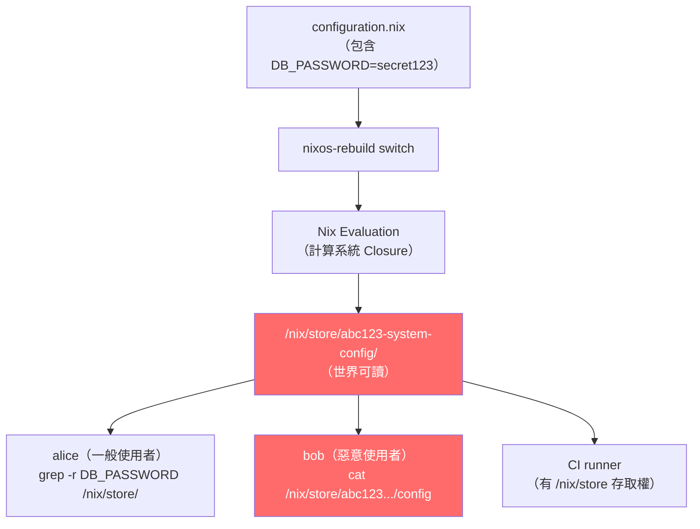
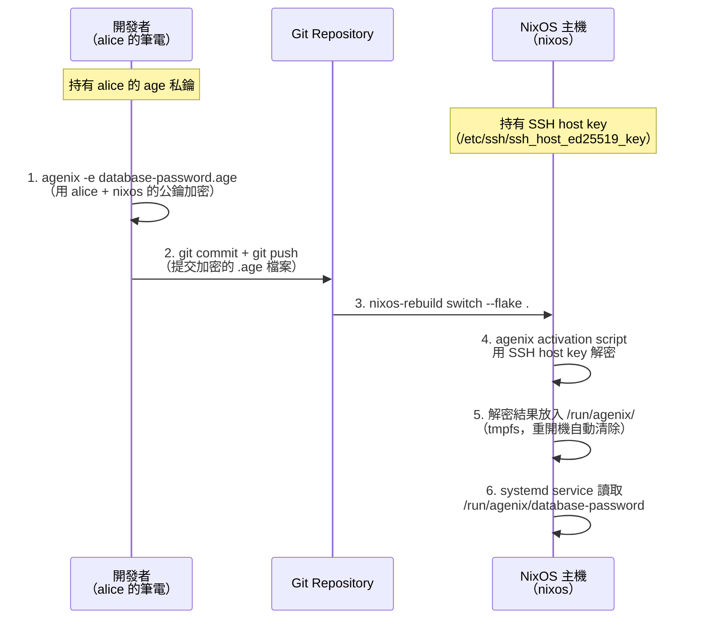
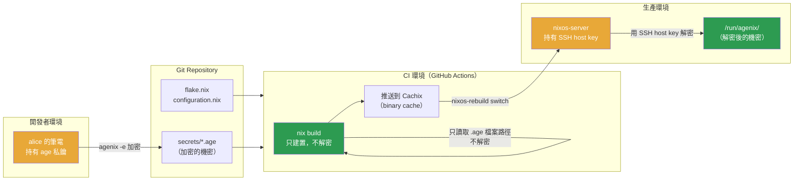

# 第22章：Secrets 管理

## 本章學習目標

完成本章後，你將能夠：

1. 解釋為什麼 Nix Store 的特性使得密碼不能直接寫入 `configuration.nix`
2. 使用 `age` 工具對機密（Secret）進行加密與解密操作
3. 使用 `agenix` 在 NixOS Flakes 專案中管理加密的機密檔案
4. 使用 `sops-nix` 作為 agenix 的替代方案，並了解兩者的適用場景
5. 設計 CI/CD 環境的機密隔離策略，以及機密 rotation 的完整流程

---

## 前置知識

閱讀本章前，建議先確認：

- 完成第21章，熟悉 Flakes 的 `inputs` 與 `outputs` 結構
- 瞭解 SSH 金鑰的基本概念（公鑰 / 私鑰的用途）
- 有基本的 Git 操作經驗（commit、push）
- 對 `systemd.services` 有基本認識（第13章）

---

## 22.1 為什麼不能把密碼放進 configuration.nix

學習 NixOS 的人，第一個直覺往往是：

「既然 `configuration.nix` 管理一切，那把資料庫密碼也寫進去不就好了？」

這個想法看似合理，卻有根本上的安全漏洞。

本節解釋原因。

### Nix Store 是世界可讀的

NixOS 編譯配置後，所有結果都存放在 `/nix/store/`。

這個路徑有一個重要特性：**任何登入系統的使用者都能讀取其中的內容**。

用以下指令驗證：

```bash
ls -la /nix/store/ | head -5
```

你會看到類似：

```text
dr-xr-xr-x  2 root root 4096 May 18 10:00 a1b2c3d4-myapp-config-1.0
dr-xr-xr-x  2 root root 4096 May 18 10:00 e5f6g7h8-openssl-3.3.0
```

注意權限是 `r-xr-xr-x`，即「所有人可讀、可執行，但不可寫」。

換句話說：

- 系統管理員可以讀
- 一般使用者也可以讀
- 甚至連 guest 帳號也能讀

如果你把 API key 或資料庫密碼直接寫入 `configuration.nix`，它的最終路徑會是：

```text
/nix/store/<hash>-your-system-config/etc/myapp/config.toml
```

任何本機使用者都能用以下指令找到並讀取它：

```bash
grep -r "DB_PASSWORD" /nix/store/ 2>/dev/null
```

這是**高危風險**。

### Git history 是永久的

另一個常見的錯誤是：

「我只是暫時把密碼放進去，等等就刪掉。」

Git 的歷史紀錄**永久保留**每一次 commit 的內容。

即使你在下一個 commit 裡刪除了密碼：

```bash
git log --all -p | grep "DB_PASSWORD"
```

任何有 repository 存取權的人，仍然可以從歷史紀錄中找到它。

清除 Git 歷史中的機密非常麻煩，需要 `git filter-branch` 或 `git-filter-repo`，並且必須強制推送、通知所有協作者重新 clone。

在企業環境中，這幾乎是不可能完全清乾淨的任務。

結論：**密碼一旦進了 Git，就要當作已經洩漏來處理。**

### 哪些東西屬於「機密」

機密（Secret）的定義是：**不能公開的資訊，一旦洩漏就會造成安全或商業損失**。

常見的機密類型：

| 類型 | 範例 |
|---|---|
| 資料庫密碼 | PostgreSQL、MySQL 的連線密碼 |
| API key | Stripe、Cloudflare、GitHub token |
| TLS 私鑰 | HTTPS 憑證的 `.key` 檔案 |
| SSH host key | 機器的 `ssh_host_ed25519_key` |
| 加密金鑰 | 應用程式用的 AES key |
| SMTP 密碼 | 郵件伺服器認證憑據 |
| OAuth secret | OAuth 2.0 應用程式的 client secret |

### 特別注意：hashedPassword 的邊界

NixOS 的使用者設定中，密碼通常用這種方式設定：

```nix
{ config, pkgs, ... }:

{
  users.users.alice = {
    isNormalUser = true;
    extraGroups = [ "wheel" ];
    # 雜湊（Hash）後的密碼，不是明文
    hashedPassword = "$6$xyz...$abc...";
  };

  system.stateVersion = "25.05";
}
```

`hashedPassword` 是透過 `mkpasswd` 或 `openssl passwd` 產生的**雜湊值（Hash）**。

這有以下特點：

- 雜湊是單向的，無法直接還原成原始密碼
- 但雜湊值本身仍然存放在 `/nix/store/`，任何人都能讀取
- 若攻擊者取得雜湊值，可以用字典攻擊或彩虹表破解弱密碼
- 更重要的是：**API key、TLS 私鑰等不是密碼，沒有雜湊可用，完全不能放進 Nix Store**

簡單記憶原則：

> `hashedPassword` 是可接受的折衷方案，但不是最佳實踐。
> API key、私鑰、SMTP 密碼等，絕對不能放進 `configuration.nix`。

### Mermaid 圖：Nix Store 可見性問題

以下流程圖說明，密碼一旦進入 `configuration.nix`，最終如何變成公開可讀的資訊：



### 正確的分離原則

正確的做法是：

**公開資訊放 Git，機密資訊加密後放 Git 或放在系統外。**

具體來說：

```text
Git Repository（公開或私有）
├── configuration.nix         ✅ 系統結構，公開沒問題
├── flake.nix                 ✅ 依賴關係，公開沒問題
├── modules/services.nix      ✅ 服務配置，公開沒問題
└── secrets/
    ├── database-password.age ✅ 加密後的機密，可以放 Git
    └── api-key.age           ✅ 加密後的機密，可以放 Git

系統外（不進 Git）
└── ~/.age/key.txt            🔑 解密用的私鑰，絕對不能進 Git
```

---

## 22.2 age 加密工具介紹

在進入 agenix 之前，需要先了解它底層使用的加密工具：`age`。

### age 是什麼

`age`（Actually Good Encryption，實際上是優質加密）是一個現代、簡單的檔案加密工具。

它的設計目標：

- **只做一件事**：檔案加密與解密
- **不需要複雜設定**：沒有 keyring、沒有 Web of Trust
- **支援多種 recipient**：可同時給多個人加密
- **可用 SSH 金鑰作為加密金鑰**：不需要額外管理 GPG keyring

相比 GPG，age 的哲學是：

> 「加密應該像 `tar` 一樣簡單，而不是像 GPG 一樣複雜。」

### 安裝 age

在 NixOS 上安裝 age 非常簡單，加入 `systemPackages` 即可：

```nix
{ config, pkgs, ... }:

{
  environment.systemPackages = with pkgs; [
    age
  ];

  system.stateVersion = "25.05";
}
```

或在 Flakes 的 devShell 中暫時使用：

```bash
nix shell nixpkgs#age
```

### 生成 age 金鑰對

age 使用**金鑰對（Key Pair）**：一個公鑰用於加密，一個私鑰用於解密。

生成金鑰對：

```bash
mkdir -p ~/.age
age-keygen -o ~/.age/key.txt
```

執行後，你會看到類似輸出：

```text
Public key: age1ql3z7hjy54pw3hyww5ayyfg7zqgvc7w3j2elw8zmrj2kg5sfn9aq3393g
```

`~/.age/key.txt` 的內容格式如下：

```text
# created: 2026-05-18T10:00:00+08:00
# public key: age1ql3z7hjy54pw3hyww5ayyfg7zqgvc7w3j2elw8zmrj2kg5sfn9aq3393g
AGE-SECRET-KEY-1QJVR...（私鑰，絕對不能洩漏）
```

注意：

- 公鑰（`age1...`）可以公開分享，用於讓別人加密給你
- 私鑰（`AGE-SECRET-KEY-1...`）必須嚴格保密，**絕對不能放進 Git**

### 加密檔案

假設你有一個包含資料庫密碼的純文字檔案 `plaintext.txt`：

```text
supersecretpassword123
```

使用公鑰加密：

```bash
age -r age1ql3z7hjy54pw3hyww5ayyfg7zqgvc7w3j2elw8zmrj2kg5sfn9aq3393g \
    -o database-password.age \
    plaintext.txt
```

參數說明：

- `-r <recipient-pubkey>`：指定接收者的公鑰（可以重複 `-r` 指定多個接收者）
- `-o database-password.age`：輸出檔案名稱
- `plaintext.txt`：要加密的來源檔案

加密後的 `database-password.age` 是二進位格式，可以安全地放進 Git。

### 解密檔案

使用私鑰解密：

```bash
age -d -i ~/.age/key.txt database-password.age
```

這會把解密結果輸出到 stdout（標準輸出）。

如果要存成檔案：

```bash
age -d -i ~/.age/key.txt -o plaintext.txt database-password.age
```

### SSH 金鑰也可作為 age recipients

age 支援直接使用 SSH 公鑰作為 recipient，不需要另外管理 age 金鑰：

```bash
# 用 SSH 公鑰加密
age -r "ssh-ed25519 AAAA...（你的 SSH 公鑰）" -o secret.age plaintext.txt

# 用對應的 SSH 私鑰解密
age -d -i ~/.ssh/id_ed25519 -o plaintext.txt secret.age
```

這個特性非常重要：**agenix 就是利用這個功能，讓 NixOS 主機用自己的 SSH host key 解密機密。**

### 一次加密給多個接收者

age 支援同時指定多個接收者，讓多台機器或多個人都能解密同一份機密：

```bash
age \
  -r age1ql3z7...（alice 的 age 公鑰）\
  -r "ssh-ed25519 AAAA...（server 的 SSH 公鑰）" \
  -o database-password.age \
  plaintext.txt
```

這樣，alice 和 server 兩者都能獨立解密這個檔案。

---

## 22.3 agenix：age-encrypted secrets for NixOS

`agenix` 是專為 NixOS 設計的機密管理工具。

它把 age 加密整合進 NixOS 的 Flakes 系統，讓你可以：

- 把加密後的機密檔案（`.age`）放進 Git repository
- 在 NixOS 部署時，自動用主機的 SSH host key 解密
- 把解密後的機密放在 `/run/agenix/`（記憶體檔案系統，重開機後消失）
- 讓特定的系統服務存取對應的機密

### agenix 的完整工作流程



關鍵點：

- **私鑰永遠不離開各自的環境**：alice 的私鑰在筆電，主機的私鑰在 `/etc/ssh/`
- **Git 中只有加密的 `.age` 檔案**：即使 repository 公開，機密也是安全的
- **解密在記憶體中完成**：`/run/agenix/` 是 tmpfs，重開機後自動消失

### 步驟一：在 flake.nix 加入 agenix

首先修改你的 `flake.nix`，加入 agenix 作為 input：

```nix
{
  description = "NixOS Configuration with Secrets Management";

  inputs = {
    nixpkgs.url = "github:NixOS/nixpkgs/nixos-25.05";

    # 加入 agenix
    agenix = {
      url = "github:ryantm/agenix";
      inputs.nixpkgs.follows = "nixpkgs";
    };
  };

  outputs = { self, nixpkgs, agenix }: {
    nixosConfigurations.nixos = nixpkgs.lib.nixosSystem {
      system = "x86_64-linux";
      modules = [
        ./configuration.nix
        # 加入 agenix NixOS module
        agenix.nixosModules.default
      ];
    };
  };
}
```

這裡有幾個重點：

- `inputs.nixpkgs.follows = "nixpkgs"`：讓 agenix 使用與主配置相同的 nixpkgs，避免版本衝突
- `agenix.nixosModules.default`：把 agenix 的 NixOS module 加入系統，這樣才能使用 `age.secrets.*` 選項

更新 lock file：

```bash
nix flake update agenix
```

### 步驟二：建立 secrets.nix 定義存取權限

`secrets.nix` 是一個特殊檔案，定義了「哪些主機可以解密哪些機密」。

建立 `secrets/secrets.nix`（注意：這個檔案本身不加密，可以公開）：

```nix
# secrets/secrets.nix
# 定義每個加密機密檔案可以被哪些公鑰解密

let
  # alice 的筆電：age 公鑰（用 age-keygen 產生）
  alice = "age1ql3z7hjy54pw3hyww5ayyfg7zqgvc7w3j2elw8zmrj2kg5sfn9aq3393g";

  # nixos 主機的 SSH host public key
  # 取得方式：cat /etc/ssh/ssh_host_ed25519_key.pub
  nixos-server = "ssh-ed25519 AAAAC3NzaC1lZDI1NTE5AAAAIBf8JNkBOa7LZxq7HHWChYPzMR1gP7q4QzXs3gYd5N4m root@nixos";

in {
  # 資料庫密碼：alice（開發時可加密）和 nixos-server（部署時可解密）都能存取
  "database-password.age".publicKeys = [ alice nixos-server ];

  # API key：只有 nixos-server 能解密，alice 不需要
  "api-key.age".publicKeys = [ nixos-server ];

  # SMTP 密碼：alice 和 nixos-server 都能存取
  "smtp-password.age".publicKeys = [ alice nixos-server ];
}
```

設計原則：

- 開發者的公鑰應該加入所有機密，這樣才能在本機加密新的機密
- 只有需要這個機密的主機才應該在列表中
- 不需要的主機不要加入，遵循最小權限原則

### 步驟三：建立加密的機密檔案

確認 `agenix` 工具已安裝（可以透過 `nix shell`）：

```bash
nix shell github:ryantm/agenix
```

在 `secrets/` 目錄下，使用 `agenix` 建立機密：

```bash
cd secrets/
agenix -e database-password.age
```

這個指令會：

1. 讀取 `secrets.nix` 取得接收者列表
2. 開啟 `$EDITOR`（預設是 `vi`）讓你輸入明文機密
3. 儲存並關閉編輯器後，自動用指定的公鑰加密
4. 產生 `database-password.age` 加密檔案

在編輯器中輸入你的資料庫密碼，例如：

```text
my-super-secret-db-password-2026
```

儲存後，`database-password.age` 就是可以安全提交到 Git 的加密檔案。

提交到 Git：

```bash
git add secrets/secrets.nix secrets/database-password.age secrets/api-key.age
git commit -m "feat: add encrypted secrets for database and api key"
```

### 步驟四：在 NixOS 配置中宣告使用機密

在 `configuration.nix` 中，宣告你要使用哪些機密：

```nix
{ config, pkgs, ... }:

{
  imports = [
    ./hardware-configuration.nix
  ];

  networking.hostName = "nixos";

  # 宣告 agenix 機密
  age.secrets = {
    # 資料庫密碼
    databasePassword = {
      file = ./secrets/database-password.age;
      owner = "myapp";          # 哪個使用者可以讀取
      group = "myapp";          # 哪個群組可以讀取
      mode = "400";             # 只有 owner 可讀（0400 = r--------）
    };

    # API key
    apiKey = {
      file = ./secrets/api-key.age;
      owner = "myapp";
      mode = "400";
    };
  };

  # 建立 myapp 使用者（機密的 owner）
  users.users.myapp = {
    isSystemUser = true;
    group = "myapp";
  };
  users.groups.myapp = {};

  system.stateVersion = "25.05";
}
```

機密解密後的路徑可以透過 `config.age.secrets.<name>.path` 取得。

### 步驟五：在服務中引用機密

以 systemd 服務為例，把機密以環境變數的形式注入：

```nix
{ config, pkgs, ... }:

{
  imports = [
    ./hardware-configuration.nix
  ];

  networking.hostName = "nixos";

  age.secrets.databasePassword = {
    file = ./secrets/database-password.age;
    owner = "myapp";
    mode = "400";
  };

  # 定義 myapp 服務
  systemd.services.myapp = {
    description = "My Application Service";
    after = [ "network.target" ];
    wantedBy = [ "multi-user.target" ];

    serviceConfig = {
      User = "myapp";
      Group = "myapp";
      ExecStart = "${pkgs.myapp}/bin/myapp";

      # 使用 EnvironmentFile 從解密後的路徑讀取密碼
      # config.age.secrets.databasePassword.path 會解析為
      # /run/agenix/databasePassword
      EnvironmentFile = config.age.secrets.databasePassword.path;

      Restart = "on-failure";
    };
  };

  users.users.myapp = {
    isSystemUser = true;
    group = "myapp";
  };
  users.groups.myapp = {};

  system.stateVersion = "25.05";
}
```

機密檔案的格式應該是 `KEY=VALUE` 格式，這樣 systemd 才能正確解析：

```text
DATABASE_PASSWORD=my-super-secret-db-password-2026
```

### 完整範例：PostgreSQL 資料庫密碼管理

以下是一個完整的真實案例：為 PostgreSQL 管理連線密碼。

首先建立 PostgreSQL 的機密檔案：

```bash
# 在 secrets/ 目錄下
agenix -e postgres-password.age
```

輸入密碼（格式：純文字，只有密碼本身）：

```text
mY-p0stgr3S-Sup3rS3cr3t!
```

然後在 `configuration.nix` 中配置：

```nix
{ config, pkgs, ... }:

{
  imports = [
    ./hardware-configuration.nix
  ];

  networking.hostName = "nixos";

  # 宣告 PostgreSQL 密碼機密
  age.secrets.postgresPassword = {
    file = ./secrets/postgres-password.age;
    owner = "postgres";   # PostgreSQL daemon 的使用者
    mode = "400";
  };

  # 啟用 PostgreSQL 服務
  services.postgresql = {
    enable = true;
    package = pkgs.postgresql_16;

    # 初始化腳本：使用解密後的密碼設定 superuser
    initialScript = pkgs.writeText "postgres-init.sql" ''
      ALTER USER postgres PASSWORD '$(cat ${config.age.secrets.postgresPassword.path})';
      CREATE DATABASE myapp_db;
      CREATE USER myapp WITH PASSWORD '$(cat ${config.age.secrets.postgresPassword.path})';
      GRANT ALL PRIVILEGES ON DATABASE myapp_db TO myapp;
    '';
  };

  system.stateVersion = "25.05";
}
```

注意：上面的 `initialScript` 方法有限制。更推薦的方式是讓應用程式直接讀取機密路徑：

```nix
{ config, pkgs, ... }:

{
  networking.hostName = "nixos";

  age.secrets.postgresPassword = {
    file = ./secrets/postgres-password.age;
    owner = "myapp";
    mode = "400";
  };

  # 讓應用程式透過 EnvironmentFile 讀取密碼
  systemd.services.myapp = {
    description = "My App with PostgreSQL";
    after = [ "postgresql.service" ];
    requires = [ "postgresql.service" ];
    wantedBy = [ "multi-user.target" ];

    serviceConfig = {
      User = "myapp";
      ExecStart = "${pkgs.myapp}/bin/myapp";
      # 從 /run/agenix/postgresPassword 讀取環境變數
      EnvironmentFile = config.age.secrets.postgresPassword.path;
    };
  };

  services.postgresql = {
    enable = true;
    package = pkgs.postgresql_16;
  };

  users.users.myapp = {
    isSystemUser = true;
    group = "myapp";
  };
  users.groups.myapp = {};

  system.stateVersion = "25.05";
}
```

機密檔案格式（在 `agenix -e` 編輯器中輸入）：

```text
POSTGRES_PASSWORD=mY-p0stgr3S-Sup3rS3cr3t!
POSTGRES_HOST=localhost
POSTGRES_DB=myapp_db
```

---

## 22.4 sops-nix：SOPS + Nix 整合

### sops 是什麼

SOPS（Secrets OPerationS）是 Mozilla 開發的機密管理工具。

與 age 相比，sops 的特點是：

- **支援多種加密後端**：age、GPG、AWS KMS、GCP KMS、Azure Key Vault、HashiCorp Vault
- **支援結構化格式**：YAML、JSON、ENV、INI，可以只加密部分欄位
- **企業級功能**：支援 IAM 角色、審計日誌、金鑰輪替策略

sops 加密後的 YAML 檔案長這樣：

```yaml
# secrets.yaml（sops 加密後）
database_password: ENC[AES256_GCM,data:abc123...,iv:xyz...,type:str]
api_key: ENC[AES256_GCM,data:def456...,iv:uvw...,type:str]
sops:
    kms: []
    age:
      - recipient: age1ql3z7...
        enc: |
            -----BEGIN AGE ENCRYPTED FILE-----
            ...
            -----END AGE ENCRYPTED FILE-----
    lastmodified: "2026-05-18T10:00:00Z"
    version: 3.8.1
```

**優點**：可以看到檔案結構（哪些 key 存在），只有 value 被加密。

這在 code review 時很有幫助：你能確認「這個 commit 修改了 api_key，但沒有動 database_password」。

### agenix vs sops-nix 選擇依據

| 比較項目 | agenix | sops-nix |
|---|---|---|
| 複雜度 | 低，配置簡單 | 中，需要 `.sops.yaml` 設定 |
| 加密後端 | 只支援 age | age、GPG、AWS KMS、GCP KMS、Vault |
| 機密格式 | 二進位（任意內容） | YAML/JSON（部分欄位加密） |
| 適合規模 | 個人、小團隊 | 企業、多雲環境 |
| 依賴 | 最小（只需 age） | 需要 sops 工具 |
| 稽核友善 | 無法看結構 | 可看 key 名稱，value 加密 |
| 多主機支援 | 透過 secrets.nix | 透過 .sops.yaml creation_rules |

選擇建議：

- **個人 homelab、小型專案**：選 agenix，配置簡單、上手快
- **有 AWS/GCP、需要 IAM 整合**：選 sops-nix，支援雲端 KMS
- **需要 code review 可見 key 名稱**：選 sops-nix，可審計性更好
- **希望最小依賴**：選 agenix

### sops-nix 安裝：在 flake.nix 加入

```nix
{
  description = "NixOS Configuration with sops-nix";

  inputs = {
    nixpkgs.url = "github:NixOS/nixpkgs/nixos-25.05";

    sops-nix = {
      url = "github:Mic92/sops-nix";
      inputs.nixpkgs.follows = "nixpkgs";
    };
  };

  outputs = { self, nixpkgs, sops-nix }: {
    nixosConfigurations.nixos = nixpkgs.lib.nixosSystem {
      system = "x86_64-linux";
      modules = [
        ./configuration.nix
        # 加入 sops-nix NixOS module
        sops-nix.nixosModules.sops
      ];
    };
  };
}
```

### 建立 .sops.yaml 定義加密規則

`.sops.yaml` 放在 repository 根目錄，定義哪些檔案用哪些金鑰加密：

```yaml
# .sops.yaml
creation_rules:
  # secrets/ 目錄下的所有 .yaml 檔案
  - path_regex: secrets/.*\.yaml$
    age:
      - age1ql3z7hjy54pw3hyww5ayyfg7zqgvc7w3j2elw8zmrj2kg5sfn9aq3393g
      - &nixos-server age1...（nixos 主機的 age 公鑰）
```

注意：sops-nix 也可以使用主機的 SSH key 轉換為 age 格式，方法如下：

```bash
# 把 SSH host key 轉換為 age 公鑰格式
nix run nixpkgs#ssh-to-age -- < /etc/ssh/ssh_host_ed25519_key.pub
```

### 建立 sops 加密的機密檔案

建立 `secrets/secrets.yaml`：

```bash
sops secrets/secrets.yaml
```

在編輯器中輸入 YAML 格式的機密：

```yaml
database_password: my-super-secret-db-password-2026
api_key: sk-proj-abcdefgh12345678
smtp_password: mail-server-password-xyz
```

儲存後，sops 自動加密 value 部分，key 名稱保持可讀。

### 在 NixOS 配置中使用 sops-nix

```nix
{ config, pkgs, ... }:

{
  imports = [
    ./hardware-configuration.nix
  ];

  networking.hostName = "nixos";

  # 設定 sops 使用的 age 私鑰（通常是主機的 SSH key 轉換）
  sops.age.sshKeyPaths = [ "/etc/ssh/ssh_host_ed25519_key" ];

  # 或者指定 age 私鑰路徑
  # sops.age.keyFile = "/var/lib/sops-nix/key.txt";

  # 定義機密檔案
  sops.defaultSopsFile = ./secrets/secrets.yaml;

  # 宣告要使用的機密
  sops.secrets = {
    database_password = {
      owner = "myapp";
      mode = "400";
    };
    api_key = {
      owner = "myapp";
      mode = "400";
    };
  };

  # 在服務中使用
  systemd.services.myapp = {
    description = "My Application";
    wantedBy = [ "multi-user.target" ];

    serviceConfig = {
      User = "myapp";
      ExecStart = "${pkgs.myapp}/bin/myapp";
      # sops 解密後的路徑格式：/run/secrets/<name>
      EnvironmentFile = config.sops.secrets.database_password.path;
    };
  };

  users.users.myapp = {
    isSystemUser = true;
    group = "myapp";
  };
  users.groups.myapp = {};

  system.stateVersion = "25.05";
}
```

sops-nix 解密後的路徑格式是 `/run/secrets/<name>`（與 agenix 的 `/run/agenix/<name>` 不同）。

### 完整範例：使用 sops-nix 管理 API key

以下是一個使用 sops-nix 管理 Cloudflare API key 的完整範例。

建立機密檔案 `secrets/cloudflare.yaml`（透過 `sops secrets/cloudflare.yaml`）：

```yaml
# 未加密時看起來像這樣，sops 加密後只有 value 被加密
cloudflare_api_token: cloudflare-api-token-abcdefgh
cloudflare_zone_id: zone-id-12345678
```

在 `configuration.nix` 中使用：

```nix
{ config, pkgs, ... }:

{
  networking.hostName = "nixos";

  sops.age.sshKeyPaths = [ "/etc/ssh/ssh_host_ed25519_key" ];
  sops.defaultSopsFile = ./secrets/cloudflare.yaml;

  sops.secrets = {
    cloudflare_api_token = {
      owner = "acme";
      mode = "400";
    };
    cloudflare_zone_id = {
      owner = "acme";
      mode = "400";
    };
  };

  # 使用 Cloudflare DNS challenge 的 ACME 憑證
  security.acme = {
    acceptTerms = true;
    defaults.email = "alice@example.com";

    certs."example.com" = {
      dnsProvider = "cloudflare";
      # 從 sops 解密後的路徑讀取 Cloudflare token
      credentialFiles = {
        "CF_DNS_API_TOKEN_FILE" = config.sops.secrets.cloudflare_api_token.path;
        "CF_ZONE_API_TOKEN_FILE" = config.sops.secrets.cloudflare_api_token.path;
      };
    };
  };

  system.stateVersion = "25.05";
}
```

---

## 22.5 GPG 金鑰管理（簡述）

### GPG 在 NixOS 的配置

GPG（GNU Privacy Guard）是一個歷史悠久的加密系統，主要用於：

- 電子郵件加密（PGP 標準）
- 程式碼簽署（Git commit signing）
- 舊版的 sops 加密後端

在 NixOS 中，GPG agent 通常透過 Home Manager 配置：

```nix
# home.nix（Home Manager 配置）
{ config, pkgs, ... }:

{
  programs.gpg = {
    enable = true;
  };

  services.gpg-agent = {
    enable = true;
    defaultCacheTtl = 1800;           # 快取 30 分鐘
    maxCacheTtl = 7200;               # 最長快取 2 小時
    enableSshSupport = true;          # 讓 gpg-agent 同時管理 SSH key
    pinentryPackage = pkgs.pinentry-gnome3;  # 密碼輸入 UI
  };
}
```

### Yubikey 搭配 GPG（進階硬體安全）

Yubikey 是硬體安全金鑰，可以把 GPG 私鑰存放在硬體中。

這樣即使電腦被入侵，攻擊者也無法取得私鑰（私鑰永不離開 Yubikey）。

在 NixOS 中啟用 Yubikey + GPG 支援：

```nix
{ config, pkgs, ... }:

{
  programs.gnupg.agent = {
    enable = true;
    enableSSHSupport = true;
  };

  # 必要的 pcscd 服務（smartcard daemon）
  services.pcscd.enable = true;

  environment.systemPackages = with pkgs; [
    yubikey-manager    # ykman 工具
    yubikey-personalization
    gnupg
  ];

  system.stateVersion = "25.05";
}
```

### 為何在 NixOS 中 age 比 GPG 更受歡迎

GPG 有以下缺點，使得 age 在 NixOS 社群更受青睞：

| 問題 | 說明 |
|---|---|
| 複雜的 keyring 管理 | GPG 的 Web of Trust 模型對自動化部署不友善 |
| 環境依賴重 | 需要 gpg-agent 持續運行 |
| 格式複雜 | ASCII armored 格式容易出錯 |
| 難以自動化 | 批次加密多個檔案需要複雜腳本 |
| 文件散落 | GPG 官方文件混亂，新手難以上手 |

相比之下，age 的設計哲學是「只做一件事，做好加密」。它沒有 Web of Trust，沒有 keyring，只有：公鑰加密、私鑰解密。

對 NixOS 這種**自動化部署**的場景，age 的簡單性是最大優勢。

---

## 22.6 CI/CD 環境的機密處理

在 CI/CD 環境中，機密管理有一個核心原則：

**CI 只負責建置（Build），不應該持有解密私鑰。**

這一節解釋原因，並說明正確的做法。

### CI 不應該有解密私鑰的原因

考慮以下情境：

你把 age 私鑰放進了 GitHub Actions Secrets，讓 CI 可以解密 agenix 機密。

這帶來的問題：

- **權限爆炸**：CI runner 一旦被入侵（惡意 PR、供應鏈攻擊），攻擊者就能解密所有機密
- **洩漏面積大**：CI secrets 通常對 repository 的所有 collaborator 可見
- **難以審計**：CI 環境的操作很難完整記錄「誰在什麼時間解密了什麼機密」
- **不必要的暴露**：CI 的職責是「建置程式碼」，不是「部署機密」

正確的職責分離：

```text
CI 的職責                    部署的職責
────────────────────         ────────────────────
✅ 編譯程式碼                ✅ 解密 agenix 機密
✅ 執行測試                  ✅ 把機密放到正確位置
✅ 建置 NixOS closure        ✅ 切換系統世代
✅ 推送到 binary cache
❌ 持有 age 私鑰             ❌ 做這些事（這是部署的工作）
❌ 解密機密
❌ 部署到生產環境
```

### Mermaid 圖：CI/CD 安全流程



### GitHub Actions Secrets 的正確用法

GitHub Actions Secrets 適合用來傳遞**建置相關的憑證**，而不是**應用程式機密**：

正確的用法：

```yaml
# .github/workflows/build.yml
name: Build NixOS Configuration

on:
  push:
    branches: [ main ]

jobs:
  build:
    runs-on: ubuntu-latest
    steps:
      - uses: actions/checkout@v4

      - name: Install Nix
        uses: cachix/install-nix-action@v27
        with:
          extra_nix_config: |
            experimental-features = nix-command flakes

      # ✅ 正確：用 GitHub token 存取私有 Flake input
      - name: Build NixOS configuration
        env:
          # 這是 GitHub 的 API token，用來存取私有 repository
          # 不是 agenix 的解密私鑰
          GITHUB_TOKEN: ${{ secrets.GITHUB_TOKEN }}
        run: |
          nix build .#nixosConfigurations.nixos.config.system.build.toplevel \
            --option extra-access-tokens "github.com=$GITHUB_TOKEN"

      # ✅ 正確：推送到 binary cache
      - name: Push to Cachix
        uses: cachix/cachix-action@v14
        with:
          name: my-nixos-cache
          authToken: ${{ secrets.CACHIX_AUTH_TOKEN }}
```

### 如何讓 CI 存取私有 Flake input

如果你的 `flake.nix` 的某些 inputs 來自私有 GitHub repository：

```nix
{
  inputs = {
    nixpkgs.url = "github:NixOS/nixpkgs/nixos-25.05";

    # 私有 repository
    my-private-modules = {
      url = "github:my-org/private-nixos-modules";
    };
  };

  outputs = { self, nixpkgs, my-private-modules }: { ... };
}
```

CI 需要存取 token，但這個 token 不是機密的**解密私鑰**，而是 GitHub 的 **API token**：

```yaml
- name: Build with private inputs
  run: |
    nix build .#nixosConfigurations.nixos.config.system.build.toplevel \
      --option extra-access-tokens "github.com=${{ secrets.GH_PRIVATE_REPO_TOKEN }}"
```

`--option extra-access-tokens` 讓 Nix 在存取 GitHub API 時使用指定的 token，這樣 CI 就能拉取私有 repository 的內容。

### CI 建置可以成功，即使不能解密機密

agenix 設計上，NixOS 的 `nix build` 階段**不需要解密機密**。

`.age` 檔案只是一個路徑參考，Nix 只會確認檔案存在，不會嘗試解密。

解密是在 `nixos-rebuild switch` 的 **activation script** 階段發生的，而這個階段只在部署目標機器上執行。

因此，CI 流程中：

```bash
# 這可以在 CI 中安全執行（不需要解密私鑰）
nix build .#nixosConfigurations.nixos.config.system.build.toplevel

# 這不應該在 CI 中執行（需要解密私鑰，且會直接改變系統）
sudo nixos-rebuild switch --flake .#nixos
```

---

## 22.7 機密 Rotation 策略

機密不是「設定一次就永遠不變」的東西。

定期更換機密（Rotation，輪替）是安全維運的基本要求。

### 為什麼需要定期更換機密

機密可能在以下情況下需要立即或定期更換：

- **定期更換（Scheduled Rotation）**：降低長期洩漏的風險，例如每 90 天換一次 API key
- **員工離職**：前員工可能仍然持有機密的知識，需要更換
- **懷疑洩漏**：發現異常存取紀錄時，立即更換
- **金鑰過期**：某些服務的 API key 有有效期限

建議的 Rotation 週期參考：

| 機密類型 | 建議週期 |
|---|---|
| 資料庫密碼 | 每 90 天 |
| API key | 每 90–180 天（或依服務規定） |
| TLS 憑證 | 每 90 天（Let's Encrypt 自動） |
| SSH host key | 僅在主機重建時更換 |
| 使用者密碼 | 依公司政策，通常每 90 天 |

### agenix 的 rotation 流程

更換 agenix 管理的機密，流程如下：

**第一步：重新加密機密**

```bash
# 進入 secrets/ 目錄
cd secrets/

# 使用 agenix -e 重新編輯並加密
# 這會開啟編輯器讓你輸入新的值
agenix -e database-password.age
```

在編輯器中，刪除舊密碼，輸入新密碼：

```text
new-super-secret-db-password-2026-q4
```

儲存後，`database-password.age` 已用新值重新加密。

**第二步：提交到 Git**

```bash
git add secrets/database-password.age
git commit -m "security: rotate database password (scheduled 90-day rotation)"
```

**第三步：部署**

```bash
sudo nixos-rebuild switch --flake .#nixos
```

部署後，agenix 會自動用新的加密檔案解密，並放置到 `/run/agenix/`。

**第四步：在應用程式層更新密碼**

不要忘記在資料庫層面也更新密碼：

```bash
# 在 PostgreSQL 中更新密碼
sudo -u postgres psql -c "ALTER USER myapp PASSWORD 'new-super-secret-db-password-2026-q4';"
```

### SSH Host Key Rotation：最複雜的情況

更換主機的 SSH host key 是最複雜的情況，因為 agenix 用這個 key 解密所有機密。

流程如下：

**第一步：在主機上生成新的 SSH host key**

```bash
# 備份舊的 host key
sudo cp /etc/ssh/ssh_host_ed25519_key /root/backup-ssh-host-key-$(date +%Y%m%d)
sudo cp /etc/ssh/ssh_host_ed25519_key.pub /root/backup-ssh-host-key-$(date +%Y%m%d).pub

# 刪除舊的 host key（系統重新啟動時會自動生成新的，或手動生成）
sudo ssh-keygen -t ed25519 -f /etc/ssh/ssh_host_ed25519_key -N "" < /dev/null
```

**第二步：取得新的公鑰**

```bash
cat /etc/ssh/ssh_host_ed25519_key.pub
```

輸出類似：

```text
ssh-ed25519 AAAAC3NzaC1lZDI1NTE5AAAAINEWPublicKey root@nixos
```

**第三步：更新 secrets.nix 中的主機公鑰**

```nix
# secrets/secrets.nix
let
  alice = "age1ql3z7...";
  # 更新為新的 SSH host key
  nixos-server = "ssh-ed25519 AAAAC3NzaC1lZDI1NTE5AAAAINEWPublicKey root@nixos";
in {
  "database-password.age".publicKeys = [ alice nixos-server ];
  "api-key.age".publicKeys = [ nixos-server ];
}
```

**第四步：用新的接收者重新加密所有機密**

```bash
cd secrets/

# 重新加密所有 .age 檔案（agenix 會用新的接收者列表重新加密）
agenix -r -i ~/.age/key.txt
```

`-r` 選項表示「rekey」：用目前的私鑰解密，再用 `secrets.nix` 中最新的接收者列表重新加密。

**第五步：提交並部署**

```bash
git add secrets/
git commit -m "security: rekey all secrets after SSH host key rotation"
sudo nixos-rebuild switch --flake .#nixos
```

### 緊急機密洩漏處理步驟

當你懷疑機密已經洩漏（例如 API key 出現在 log 中，或 Git 歷史中意外出現明文密碼），立即執行以下步驟：

**步驟 1：立即撤銷洩漏的機密**

不要等待，立即到對應的服務控制台撤銷：

- API key → 到服務提供商控制台 revoke
- 資料庫密碼 → 立即修改密碼
- TLS 私鑰 → 撤銷憑證（OCSP revocation）

**步驟 2：調查洩漏範圍**

```bash
# 確認 Git 歷史中是否有明文機密
git log --all -p | grep -i "password\|secret\|api_key\|token" | head -20

# 確認 /nix/store/ 中是否有明文機密
grep -r "password" /nix/store/ 2>/dev/null | grep -v ".drv" | head -10
```

**步驟 3：清理 Git 歷史（如果需要）**

```bash
# 安裝 git-filter-repo（比 git filter-branch 更快更安全）
nix shell nixpkgs#git-filter-repo

# 從所有歷史中移除包含機密的檔案
git-filter-repo --path secrets/plaintext-secret.txt --invert-paths

# 或是把所有歷史中的明文密碼替換掉
git-filter-repo --replace-text <(echo "actual-password==>REDACTED")
```

**步驟 4：通知相關人員**

如果是企業環境：

- 通知資安團隊（Security Team）
- 建立事件紀錄（Incident Report）
- 評估是否需要通知受影響的用戶

**步驟 5：用新值重新加密，部署**

```bash
agenix -e affected-secret.age   # 輸入新值
git add secrets/affected-secret.age
git commit -m "security: emergency rotation of compromised secret"
sudo nixos-rebuild switch --flake .#nixos
```

**步驟 6：事後改善**

分析洩漏的根本原因（Root Cause Analysis），並採取預防措施：

- 加入 git commit hook，掃描是否有未加密的機密
- 使用 `truffleHog` 或 `detect-secrets` 等工具掃描 repository
- 建立機密 Rotation 的自動提醒機制

---

## 本章小結

本章涵蓋了 NixOS 機密管理的完整體系。

核心概念回顧：

1. **Nix Store 是公開可讀的**：任何放進 `configuration.nix` 的明文機密都會進入 `/nix/store/`，被系統上任何使用者讀取

2. **age 是現代加密的基礎**：簡單、快速、支援多 recipient，適合自動化部署場景

3. **agenix 是 NixOS 的最佳實踐**：
   - 用主機 SSH host key 作為解密憑證
   - 加密的 `.age` 檔案可以安全放進 Git
   - 解密在 tmpfs 上完成，重開機後消失

4. **sops-nix 適合企業環境**：支援 AWS KMS、GCP KMS 等雲端金鑰管理服務，適合需要稽核和多雲環境的場景

5. **CI 不應該有解密私鑰**：CI 的職責是建置，部署機密是部署流程的職責，兩者必須分離

6. **機密 Rotation 是常態**：定期更換機密、建立應急響應流程，是安全維運不可缺少的一環

### 下一步

完成本章後，建議繼續閱讀：

- **第23章：自訂 NixOS Module 開發**：學習如何把機密管理邏輯封裝進可重用的 module
- **第24章：建置與部署流程**：結合 `deploy-rs` 或 `colmena`，實作完整的機密安全部署流程
- **第31章：CI/CD 與 GitOps**：在企業 GitOps 流程中整合機密管理的最佳實踐

### Lab：建立第一個 agenix 專案

以下是本章的配套實作練習。

**目標**

建立一個完整的 agenix 機密管理環境，包含：一個 systemd 服務，透過 agenix 讀取加密的資料庫密碼。

**建議環境**

| 工具 | 需求 |
|---|---|
| NixOS 版本 | 25.05 |
| Flakes 支援 | 已啟用 |
| Git | 已安裝 |
| 網路連線 | 需要（下載 agenix） |

**Step 1：初始化 Flakes 專案**

```bash
mkdir ~/nixos-secrets-lab && cd ~/nixos-secrets-lab
git init
```

建立 `flake.nix`：

```nix
{
  description = "Secrets Management Lab";

  inputs = {
    nixpkgs.url = "github:NixOS/nixpkgs/nixos-25.05";
    agenix = {
      url = "github:ryantm/agenix";
      inputs.nixpkgs.follows = "nixpkgs";
    };
  };

  outputs = { self, nixpkgs, agenix }: {
    nixosConfigurations.nixos = nixpkgs.lib.nixosSystem {
      system = "x86_64-linux";
      modules = [
        ./configuration.nix
        agenix.nixosModules.default
      ];
    };
  };
}
```

**Step 2：生成 age 金鑰**

```bash
mkdir -p ~/.age
age-keygen -o ~/.age/key.txt
# 記下輸出的公鑰：Public key: age1...
```

取得主機的 SSH host public key：

```bash
cat /etc/ssh/ssh_host_ed25519_key.pub
```

**Step 3：建立 secrets.nix**

```bash
mkdir secrets
```

建立 `secrets/secrets.nix`（把公鑰替換成你的實際值）：

```nix
let
  alice = "age1...（你的 age 公鑰）";
  nixos-server = "ssh-ed25519 AAAA...（主機的 SSH host 公鑰）";
in {
  "lab-password.age".publicKeys = [ alice nixos-server ];
}
```

**Step 4：加密機密**

```bash
cd secrets/
nix shell github:ryantm/agenix -- agenix -e lab-password.age
```

在編輯器中輸入：

```text
MY_SECRET_VALUE=hello-from-agenix-lab
```

**Step 5：建立 configuration.nix**

```nix
{ config, pkgs, ... }:

{
  imports = [ ./hardware-configuration.nix ];

  networking.hostName = "nixos";

  age.secrets.labPassword = {
    file = ./secrets/lab-password.age;
    owner = "alice";
    mode = "400";
  };

  users.users.alice = {
    isNormalUser = true;
    extraGroups = [ "wheel" ];
  };

  system.stateVersion = "25.05";
}
```

**Step 6：部署並驗證**

```bash
sudo nixos-rebuild switch --flake .#nixos
```

**驗證**

確認機密已正確解密：

```bash
# 以 alice 身份讀取解密後的機密
sudo -u alice cat /run/agenix/labPassword
```

預期輸出：

```text
MY_SECRET_VALUE=hello-from-agenix-lab
```

確認 /nix/store/ 中沒有明文機密：

```bash
grep -r "hello-from-agenix-lab" /nix/store/ 2>/dev/null
```

預期輸出：**無任何結果**（機密沒有進入 Nix Store）。

---

*本章完。*
