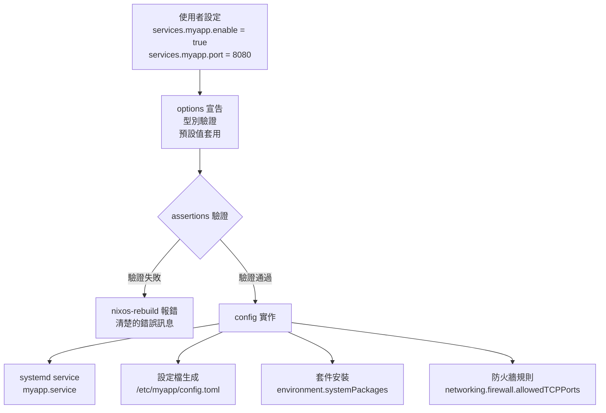
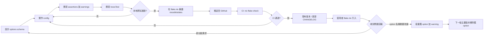

# 第23章：自訂 NixOS Module 開發

## 本章學習目標

完成本章後，你將能夠：

1. 依照六大設計原則，開發結構清晰、可重用的 NixOS module
2. 設計完整的 option schema，包含型別選擇的決策依據
3. 使用 `lib.types.submodule` 定義複雜的巢狀型別
4. 撰寫 `assertions` 與 `warnings` 進行配置驗證與使用者提醒
5. 使用 `nixosTest` 為自訂 module 撰寫自動化整合測試
6. 透過 flake.nix 的 `nixosModules` output 發布與共用 module

---

## 前置知識

本章建立在以下基礎之上：

- **第7章**（NixOS Module System）：`options` 宣告、`config` 實作、`mkOption`、`mkIf` 的基本用法
- **第17章**（Flakes 基礎）：flake.nix 的 `inputs` / `outputs` 結構
- **第18章**（使用 Flakes 管理 NixOS）：`nixosConfigurations` 與 module 引入方式

如果你尚未閱讀第7章，請先回頭熟悉 option 系統的基礎概念，再繼續本章。

---

## 23.1 Reusable Module 的設計原則

### 從第7章的概念，進入進階設計

第7章介紹了如何把配置邏輯拆進 `options` 宣告與 `config` 實作。本章要更進一步：

如何設計一個可以讓**其他人放心引入**的 module？

一個「良好的」reusable module 需要滿足以下六個原則。

### 六大設計原則

**原則一：單一職責（Single Responsibility）**

每個 module 只負責一件事。

不要把 Web 服務、資料庫、SSL 憑證管理全部塞進同一個 module。

好的做法：

- `modules/services/myapp.nix`：只負責應用本身的 systemd 服務
- `modules/services/myapp-db.nix`：只負責資料庫的建立與權限
- `modules/tls/myapp-cert.nix`：只負責憑證的申請與更新

**原則二：明確介面（Explicit Interface）**

所有可調整的行為都必須透過 `options` 暴露出來。

使用者不應該需要「閱讀 config 實作」才能知道如何使用這個 module。

良好的 option 就是文件本身。

**原則三：安全預設值（Safe Defaults）**

`default` 值應該是「最保守、最安全」的選擇。

例如：

- `enable = false`：服務預設不啟動
- `openFirewall = false`：防火牆預設不開放
- `allowEmptyPassword = false`：預設不允許空密碼

**原則四：文件完整（Self-Documenting）**

每個 option 都要有 `description`，複雜的 option 要有 `example`。

使用者在執行 `nixos-option services.myapp` 時，應該得到足夠的資訊。

**原則五：可組合（Composable）**

module 之間不應有隱含依賴。

如果 module A 需要 module B，應該在 `imports` 中明確宣告，或透過 `config.services.postgresql.enable` 這類標準 option 進行協調。

**原則六：不假設環境（Environment-Agnostic）**

module 不應假設：

- 使用者的目錄結構長什麼樣子
- 主機名稱是什麼
- 其他服務有沒有啟動

所有環境假設都應透過 option 讓使用者設定。

### Mermaid 圖：良好 Module 的結構



### 反模式：把業務邏輯寫死在 config 裡

以下是一個**不應該**這樣寫的範例。

這個 module 把所有配置寫死，使用者完全無法調整：

```nix
# 不良範例：業務邏輯寫死，沒有 options
{ config, pkgs, ... }:

{
  # 壞：port 寫死，使用者無法更改
  systemd.services.myapp = {
    wantedBy = [ "multi-user.target" ];
    serviceConfig = {
      ExecStart = "${pkgs.myapp}/bin/myapp --port 8080";
    };
  };

  # 壞：不管使用者想不想要，服務都會啟動
  networking.firewall.allowedTCPPorts = [ 8080 ];
}
```

正確的做法是使用 `options` 宣告介面，再在 `config` 中使用 `lib.mkIf cfg.enable` 進行條件實作。這樣使用者引入 module 後，服務不會自動啟動，必須明確設定 `enable = true`。

---

## 23.2 Option Schema 設計

### 命名慣例

NixOS 官方 module 遵循一套標準命名模式，自訂 module 應盡量遵循相同慣例：

| option 名稱 | 用途 |
|---|---|
| `services.<name>.enable` | 啟用整個服務 |
| `services.<name>.port` | 服務監聽的 TCP port |
| `services.<name>.host` | 監聽的網路介面位址 |
| `services.<name>.dataDir` | 資料儲存目錄 |
| `services.<name>.user` | 執行服務的系統使用者名稱 |
| `services.<name>.group` | 執行服務的系統群組名稱 |
| `services.<name>.package` | 要使用的套件（允許使用者覆寫版本） |
| `services.<name>.openFirewall` | 是否自動開放防火牆 port |
| `services.<name>.settings` | 傳遞給應用程式的設定（attrsOf） |
| `services.<name>.extraConfig` | 附加的原始設定字串 |

### 型別設計決策

選擇正確的型別是 option schema 設計最重要的一步。

以下逐一說明各型別的適用情境與選擇理由。

**`lib.types.bool`：簡單開關**

用於二選一的旗標設定。

選擇 `bool` 的理由：語意明確，使用者不會輸入 `"yes"` 或 `1` 這類模糊值。

```nix
enable = lib.mkOption {
  type = lib.types.bool;
  default = false;
  description = "是否啟用 myapp 服務。";
};
```

**`lib.types.port`：TCP/UDP Port**

用於網路 port 設定。

選擇 `port` 而非 `int` 的理由：`lib.types.port` 會自動驗證數值範圍在 1–65535 之間，輸入 `0` 或 `70000` 會立即報錯，不需要你自己寫 assertion。

```nix
port = lib.mkOption {
  type = lib.types.port;
  default = 8080;
  description = "myapp 監聽的 TCP port。";
};
```

**`lib.types.str` vs `lib.types.nonEmptyStr`：字串**

`lib.types.str` 允許空字串，`lib.types.nonEmptyStr` 不允許。

當這個欄位為空時會造成服務啟動失敗（例如 hostname、secret key），優先使用 `nonEmptyStr` 在評估階段就攔截錯誤。

```nix
# 適合用 str：允許使用者留空（代表某個預設行為）
extraArgs = lib.mkOption {
  type = lib.types.str;
  default = "";
  description = "傳遞給 myapp 的額外命令列參數。";
};

# 適合用 nonEmptyStr：此欄位為空時服務必定失敗
secretKey = lib.mkOption {
  type = lib.types.nonEmptyStr;
  description = "應用程式用於簽署 JWT 的 secret key。";
};
```

**`lib.types.nullOr lib.types.str`：可選字串**

用於「不設定時使用預設行為，設定時覆寫」的情境。

```nix
# 不設定時不傳遞此 option 給應用程式
tlsCertFile = lib.mkOption {
  type = lib.types.nullOr lib.types.path;
  default = null;
  description = "TLS 憑證檔案路徑。設為 null 表示不啟用 HTTPS。";
};
```

**`lib.types.listOf lib.types.str`：字串清單**

用於允許多個值的設定，例如允許的 IP 範圍、標籤清單。

```nix
allowedOrigins = lib.mkOption {
  type = lib.types.listOf lib.types.str;
  default = [];
  example = [ "https://example.com" "https://app.example.com" ];
  description = "允許的 CORS origin 清單。";
};
```

**`lib.types.enum`：列舉**

用於只接受固定幾個合法值的設定。

選擇 `enum` 而非 `str` 的理由：Nix 評估時就會驗證，使用者輸入 `"verbose"` 這類非法值會立即得到錯誤，而不是等服務啟動才失敗。

```nix
logLevel = lib.mkOption {
  type = lib.types.enum [ "debug" "info" "warn" "error" ];
  default = "info";
  description = "應用程式的日誌層級。";
};
```

**`lib.types.path`：檔案路徑**

用於需要指向系統上實際存在的檔案路徑。

```nix
configFile = lib.mkOption {
  type = lib.types.path;
  description = "myapp 的主要設定檔路徑。";
};
```

### 何時用 `default = null` vs 不提供 default

這是初學者常見的疑問。

- **提供 `default = null`**：代表這個欄位是可選的，使用者可以不設定。module 的 `config` 實作中要用 `lib.optionalString (cfg.foo != null) ...` 處理。
- **不提供 `default`**：代表這個欄位是**必填的**，使用者如果沒有設定，Nix 評估時會報錯 `error: The option 'services.myapp.secretKey' is used but not defined`。適合用在敏感設定（secret key、domain name）上，強制使用者明確設定。

### 完整範例：一個 Web 應用服務模組的 Option Schema

以下是一個完整的 option schema，示範如何為一個假設的 Web 應用「myapp」設計介面。

這個 module 放在 `modules/services/myapp.nix`：

```nix
{ config, pkgs, lib, ... }:

let
  cfg = config.services.myapp;
in
{
  options.services.myapp = {

    enable = lib.mkEnableOption "myapp Web 應用服務";

    package = lib.mkOption {
      type = lib.types.package;
      default = pkgs.myapp;
      defaultText = lib.literalExpression "pkgs.myapp";
      description = "要使用的 myapp 套件。可以覆寫為自訂版本。";
    };

    port = lib.mkOption {
      type = lib.types.port;
      default = 8080;
      description = "myapp 監聽的 TCP port。";
    };

    host = lib.mkOption {
      type = lib.types.str;
      default = "127.0.0.1";
      description = "myapp 監聽的網路位址。設為 0.0.0.0 可監聽所有介面。";
    };

    dataDir = lib.mkOption {
      type = lib.types.path;
      default = "/var/lib/myapp";
      description = "myapp 儲存應用資料的目錄。";
    };

    user = lib.mkOption {
      type = lib.types.str;
      default = "myapp";
      description = "執行 myapp 服務的系統使用者名稱。";
    };

    group = lib.mkOption {
      type = lib.types.str;
      default = "myapp";
      description = "執行 myapp 服務的系統群組名稱。";
    };

    openFirewall = lib.mkOption {
      type = lib.types.bool;
      default = false;
      description = "是否自動在防火牆開放 services.myapp.port。";
    };

    logLevel = lib.mkOption {
      type = lib.types.enum [ "debug" "info" "warn" "error" ];
      default = "info";
      description = "應用程式的日誌層級。";
    };

    secretKeyFile = lib.mkOption {
      type = lib.types.path;
      description = ''
        包含 JWT secret key 的檔案路徑。
        此欄位為必填，內容不應直接寫在 configuration.nix 中。
        建議使用 agenix 或 sops-nix 管理。
      '';
      example = "/run/secrets/myapp-secret-key";
    };

    tlsCertFile = lib.mkOption {
      type = lib.types.nullOr lib.types.path;
      default = null;
      description = "TLS 憑證檔案路徑。設為 null 時使用 HTTP（不加密）。";
    };

    tlsKeyFile = lib.mkOption {
      type = lib.types.nullOr lib.types.path;
      default = null;
      description = "TLS 私鑰檔案路徑。tlsCertFile 不為 null 時必須設定。";
    };

  };

  config = lib.mkIf cfg.enable {
    # 實作部分：見後續章節說明
  };
}
```

這個 schema 的設計要點：

- `enable` 使用 `mkEnableOption`，描述簡短、語意清晰
- `package` 讓使用者可以覆寫套件版本，是 NixOS module 的標準做法
- `secretKeyFile` 沒有 `default`，強制使用者設定，避免使用預設的不安全值
- `tlsCertFile` 與 `tlsKeyFile` 使用 `nullOr`，代表 HTTPS 是可選功能

---

## 23.3 `lib.types.submodule`：複雜型別定義

### 什麼時候需要 submodule

當一個 option 下有多個相關欄位時，使用 submodule。

例如，你想讓使用者設定多個上游伺服器（upstream），每個上游有自己的 host、port、weight：

```nix
# 這樣寫不夠好：三個 list 必須一一對應，容易出錯
services.myproxy.upstreamHosts = [ "server1" "server2" ];
services.myproxy.upstreamPorts = [ 8001 8002 ];
services.myproxy.upstreamWeights = [ 10 5 ];
```

正確的做法是用 submodule，把相關欄位組成一個結構：

```nix
# 好的做法：每個 upstream 是一個結構化物件
services.myproxy.upstreams = {
  primary = { host = "server1"; port = 8001; weight = 10; };
  backup  = { host = "server2"; port = 8002; weight = 5;  };
};
```

### `lib.types.attrsOf (lib.types.submodule { ... })`：動態鍵的 submodule

這是最常見的 submodule 用法。使用者用任意字串作為鍵（如 `"primary"`、`"backup"`），每個值都必須符合 submodule 定義的結構。

以下是完整的 `myproxy` module 範例，包含 options 定義和 config 實作：

```nix
{ config, pkgs, lib, ... }:

let
  cfg = config.services.myproxy;

  # 定義單個 upstream 的 submodule 結構
  upstreamSubmodule = lib.types.submodule {
    options = {

      host = lib.mkOption {
        type = lib.types.str;
        description = "上游伺服器的 hostname 或 IP 位址。";
        example = "192.168.1.10";
      };

      port = lib.mkOption {
        type = lib.types.port;
        description = "上游伺服器的 TCP port。";
        example = 8001;
      };

      weight = lib.mkOption {
        type = lib.types.ints.between 1 100;
        default = 10;
        description = "負載平衡權重（1–100）。數值越高分配到的流量越多。";
      };

      healthCheckPath = lib.mkOption {
        type = lib.types.str;
        default = "/health";
        description = "用於健康檢查的 HTTP 路徑。";
      };

    };
  };

in
{
  options.services.myproxy = {

    enable = lib.mkEnableOption "myproxy 反向代理服務";

    listenPort = lib.mkOption {
      type = lib.types.port;
      default = 80;
      description = "myproxy 對外監聽的 port。";
    };

    upstreams = lib.mkOption {
      type = lib.types.attrsOf upstreamSubmodule;
      default = {};
      description = "上游伺服器群組。鍵為識別名稱，值為伺服器設定。";
      example = lib.literalExpression ''
        {
          app1 = { host = "10.0.0.1"; port = 8001; weight = 10; };
          app2 = { host = "10.0.0.2"; port = 8002; weight = 5;  };
        }
      '';
    };

  };

  config = lib.mkIf cfg.enable {

    # 將 upstreams 轉換為設定檔內容
    environment.etc."myproxy/config.toml".text = ''
      listen_port = ${toString cfg.listenPort}

      ${lib.concatStringsSep "\n" (lib.mapAttrsToList (name: upstream: ''
        [[upstream]]
        name   = "${name}"
        host   = "${upstream.host}"
        port   = ${toString upstream.port}
        weight = ${toString upstream.weight}
        health = "${upstream.healthCheckPath}"
      '') cfg.upstreams)}
    '';

    systemd.services.myproxy = {
      description = "myproxy 反向代理服務";
      wantedBy = [ "multi-user.target" ];
      after = [ "network.target" ];
      serviceConfig = {
        ExecStart = "${pkgs.myproxy}/bin/myproxy --config /etc/myproxy/config.toml";
        Restart = "on-failure";
        DynamicUser = true;
      };
    };

  };
}
```

使用者在自己的 configuration.nix 中這樣設定：

```nix
{ config, pkgs, lib, ... }:

{
  imports = [ ./modules/services/myproxy.nix ];

  services.myproxy = {
    enable = true;
    listenPort = 80;
    upstreams = {
      app1 = {
        host = "10.0.0.1";
        port = 8001;
        weight = 10;
      };
      app2 = {
        host = "10.0.0.2";
        port = 8002;
        weight = 5;
        healthCheckPath = "/api/health";
      };
    };
  };

  system.stateVersion = "25.05";
}
```

### `lib.types.listOf (lib.types.submodule { ... })`：列表型 submodule

當順序重要，或使用者希望用清單而非 attribute set 管理時，使用 `listOf submodule`：

```nix
# 適合「有序的規則清單」，例如防火牆規則
options.services.myfw.rules = lib.mkOption {
  type = lib.types.listOf (lib.types.submodule {
    options = {
      priority = lib.mkOption {
        type = lib.types.int;
        description = "規則優先順序，數值越小越優先。";
      };
      action = lib.mkOption {
        type = lib.types.enum [ "allow" "deny" "log" ];
        description = "動作。";
      };
      source = lib.mkOption {
        type = lib.types.str;
        description = "來源 IP 或 CIDR。";
      };
    };
  });
  default = [];
  description = "防火牆規則清單，按 priority 順序套用。";
};
```

`attrsOf` 與 `listOf` 的選擇原則：

- 使用者需要用名稱引用特定項目（如「覆寫某個 upstream 的設定」）→ 選 `attrsOf`
- 順序很重要（如防火牆規則，先匹配先執行）→ 選 `listOf`
- 項目本身就有唯一識別鍵（如 virtual host 的 domain name）→ 選 `attrsOf`

---

## 23.4 `assertions`：配置驗證

### `assertions` 的結構

`assertions` 是 NixOS module system 提供的一個特殊 option，讓你在系統建構前進行配置驗證。

如果任何一個 assertion 的 `assertion` 欄位為 `false`，`nixos-rebuild` 就會報錯並顯示 `message`。

基本結構：

```nix
config = lib.mkIf cfg.enable {
  assertions = [
    {
      assertion = <條件，必須為 true 才算通過>;
      message = "<出錯時顯示給使用者的訊息>";
    }
  ];
};
```

### 何時使用 assertions

- **互斥選項**：兩個 option 不能同時啟用
- **必要前置條件**：啟用功能 A 時，必須先設定 B
- **業務規則約束**：特定組合在邏輯上不合理
- **資源衝突**：port 號與其他服務衝突

### 完整範例

以下是 `myapp` module 的 assertions 完整實作：

```nix
{ config, pkgs, lib, ... }:

let
  cfg = config.services.myapp;
in
{
  options.services.myapp = {
    enable = lib.mkEnableOption "myapp 服務";
    port = lib.mkOption {
      type = lib.types.port;
      default = 8080;
      description = "myapp 監聽的 TCP port。";
    };
    dataDir = lib.mkOption {
      type = lib.types.nullOr lib.types.path;
      default = null;
      description = "資料儲存目錄。啟用服務時必須設定。";
    };
    tlsCertFile = lib.mkOption {
      type = lib.types.nullOr lib.types.path;
      default = null;
      description = "TLS 憑證路徑。啟用 HTTPS 時必須設定。";
    };
    tlsKeyFile = lib.mkOption {
      type = lib.types.nullOr lib.types.path;
      default = null;
      description = "TLS 私鑰路徑。啟用 HTTPS 時必須設定。";
    };
    disableAuth = lib.mkOption {
      type = lib.types.bool;
      default = false;
      description = "停用驗證機制（僅限測試環境）。";
    };
  };

  config = lib.mkIf cfg.enable {
    assertions = [
      # 驗證 1：dataDir 不能為空
      {
        assertion = cfg.dataDir != null;
        message = ''
          services.myapp.dataDir 未設定。
          啟用 myapp 服務時必須指定資料目錄。
          請在 configuration.nix 中加入：
            services.myapp.dataDir = "/var/lib/myapp";
        '';
      }

      # 驗證 2：TLS 設定必須同時提供憑證和私鑰
      {
        assertion = (cfg.tlsCertFile != null) == (cfg.tlsKeyFile != null);
        message = ''
          services.myapp.tlsCertFile 與 services.myapp.tlsKeyFile
          必須同時設定或同時不設定。
          目前狀態：
            tlsCertFile = ${if cfg.tlsCertFile != null then cfg.tlsCertFile else "(未設定)"}
            tlsKeyFile  = ${if cfg.tlsKeyFile  != null then cfg.tlsKeyFile  else "(未設定)"}
          請確認兩個欄位都已設定，或兩個都留 null（使用 HTTP）。
        '';
      }

      # 驗證 3：不與 nginx 的預設 port 衝突
      {
        assertion = !(config.services.nginx.enable && cfg.port == 80);
        message = ''
          services.myapp.port = 80 與已啟用的 services.nginx 衝突。
          兩個服務都嘗試監聽 port 80。
          請將 myapp 改用其他 port，例如：
            services.myapp.port = 8080;
          或者，讓 nginx 作為反向代理，myapp 監聽內部 port。
        '';
      }

      # 驗證 4：生產環境不應停用驗證
      {
        assertion = !(cfg.disableAuth && !config.networking.hostName == "nixos-test");
        message = ''
          services.myapp.disableAuth = true 在非測試主機上不允許使用。
          停用驗證機制會讓所有 API 端點在無驗證狀態下對外開放。
          如果你確實需要測試，請使用名為 "nixos-test" 的主機。
        '';
      }
    ];
  };
}
```

### 錯誤訊息設計：好的範例 vs 壞的範例

錯誤訊息的品質直接影響使用者體驗。

**不良的錯誤訊息：**

```nix
# 壞：只說「錯了」，沒說怎麼修
{
  assertion = cfg.dataDir != null;
  message = "dataDir is null";
}
```

使用者看到這個訊息時，不知道：

- 這個 option 的完整路徑是什麼
- 應該設定成什麼值
- 在哪裡設定

**良好的錯誤訊息應包含：**

1. 哪個 option 出問題（完整路徑 `services.myapp.dataDir`）
2. 目前的狀態是什麼
3. 正確的設定方式（最好附上可直接貼上的範例）

```nix
# 好：說明問題、現況、修復方法
{
  assertion = cfg.dataDir != null;
  message = ''
    services.myapp.dataDir 未設定。
    啟用 services.myapp.enable = true 時，此欄位為必填。
    請在 configuration.nix 加入：

      services.myapp.dataDir = "/var/lib/myapp";

    如果你使用的是 ZFS 或其他掛載點，請調整路徑。
  '';
}
```

**訊息設計原則整理：**

| 原則 | 說明 |
|---|---|
| 具名 option | 永遠使用完整 option 路徑，如 `services.myapp.port` |
| 描述現況 | 印出目前的值（使用 `${toString cfg.port}`） |
| 給出解法 | 附上可複製貼上的設定範例 |
| 說明原因 | 簡短解釋為什麼這個設定組合不合法 |
| 避免技術術語 | 使用者不一定了解 Nix 內部機制 |

---

## 23.5 `warnings`：使用者提醒

### `warnings` 與 `assertions` 的差異

兩者都是 NixOS module system 的標準機制，但行為不同：

| 特性 | `assertions` | `warnings` |
|---|---|---|
| 驗證失敗時的行為 | 中止建置，報錯 | 繼續建置，印出警告訊息 |
| 適用情境 | 必須修復的錯誤 | 建議注意的狀況 |
| 使用者可忽略 | 否，必須修復 | 是，但不建議 |

### 適用場景

`warnings` 適合用在：

- **廢棄的 option（deprecated）**：舊 option 仍有效，但建議遷移到新 option
- **不建議的設定組合**：設定本身合法，但可能造成問題
- **效能風險提醒**：某個設定組合可能影響效能
- **安全性提醒**：某個設定在生產環境不建議使用

### 完整範例

`warnings` 的值是字串清單，使用 `lib.optional` 或 `lib.optionals` 配合條件：

```nix
{ config, pkgs, lib, ... }:

let
  cfg = config.services.myapp;
in
{
  options.services.myapp = {
    enable = lib.mkEnableOption "myapp 服務";

    # 舊的 option（即將廢棄）
    logVerbose = lib.mkOption {
      type = lib.types.bool;
      default = false;
      description = ''
        （已廢棄）啟用詳細日誌。
        請改用 services.myapp.logLevel = "debug"。
      '';
    };

    logLevel = lib.mkOption {
      type = lib.types.enum [ "debug" "info" "warn" "error" ];
      default = "info";
      description = "日誌層級。";
    };

    disableAuth = lib.mkOption {
      type = lib.types.bool;
      default = false;
      description = "停用驗證（僅限測試）。";
    };

    cacheSize = lib.mkOption {
      type = lib.types.ints.positive;
      default = 128;
      description = "記憶體快取大小（MB）。";
    };
  };

  config = lib.mkIf cfg.enable {
    warnings =
      # 警告 1：廢棄 option 遷移提示
      lib.optional cfg.logVerbose ''
        services.myapp.logVerbose 已廢棄，將在下一個主要版本中移除。
        請改用新的 logLevel option：
          services.myapp.logLevel = "debug";
        logVerbose 目前仍有效，但請儘早遷移。
      ''

      # 警告 2：安全性提醒
      ++ lib.optional cfg.disableAuth ''
        services.myapp.disableAuth = true 已啟用。
        此設定會停用所有 API 驗證機制，不適合部署在生產環境。
        若這是測試環境，請忽略此警告。
        若這是生產環境，請立即移除此設定並重新部署。
      ''

      # 警告 3：效能風險提醒
      ++ lib.optional (cfg.cacheSize > 4096) ''
        services.myapp.cacheSize = ${toString cfg.cacheSize} MB 超過建議上限（4096 MB）。
        過大的快取可能導致系統記憶體不足（OOM）。
        建議設定為系統總記憶體的 25% 以下。
      ''

      # 警告 4：不建議的設定組合
      ++ lib.optional (cfg.logLevel == "debug" && !config.services.myapp.disableAuth) ''
        services.myapp.logLevel = "debug" 會將完整的 request 內容（包含 headers）
        輸出到 journal，可能洩漏 Authorization token。
        在生產環境中建議使用 "info" 或 "warn" 層級。
      '';
  };
}
```

警告訊息在 `nixos-rebuild switch` 時會以醒目方式顯示在終端機輸出中，使用者不容易錯過。

---

## 23.6 Module 測試（`nixosTest`）

### `nixosTest` 的作用

`nixosTest`（在 flake context 中通常是 `pkgs.nixosTest`）讓你在一個隔離的 QEMU 虛擬機中啟動完整的 NixOS 系統，然後執行 Python 腳本來驗證系統行為。

這是 NixOS 生態系最強大的功能之一：

- 不需要真實機器
- 完全隔離，不影響開發機
- 可以測試 systemd 服務啟動、HTTP 回應、檔案系統狀態等
- 可整合進 CI/CD 流程

### 測試結構：`{ nodes, testScript }`

一個 `nixosTest` 由兩個部分組成：

- `nodes`：定義一或多個 NixOS 虛擬機的配置
- `testScript`：Python 腳本，使用 `machine` 物件驅動 VM 並進行驗證

### 常用 testScript 指令

| 指令 | 說明 |
|---|---|
| `machine.start()` | 啟動 VM |
| `machine.wait_for_unit("myapp.service")` | 等待 systemd unit 進入 active 狀態 |
| `machine.wait_for_open_port(8080)` | 等待 port 開始監聽 |
| `machine.succeed("curl http://localhost:8080/health")` | 執行指令，失敗時拋出錯誤 |
| `machine.fail("curl http://localhost:9999")` | 執行指令，成功時反而拋出錯誤 |
| `machine.wait_until_succeeds("curl ...")` | 重試直到指令成功 |
| `machine.get_unit_info("myapp.service")` | 取得 systemd unit 狀態資訊 |
| `machine.shutdown()` | 關閉 VM |

### 完整範例：測試 myapp 模組

以下是一個完整可執行的測試，放在 `tests/myapp-test.nix`：

```nix
# tests/myapp-test.nix
{ pkgs, myappModule }:

pkgs.nixosTest {
  name = "myapp-service-test";

  # 定義測試用的 NixOS VM
  nodes.machine = { config, pkgs, lib, ... }: {
    # 載入我們要測試的 module
    imports = [ myappModule ];

    # 設定要測試的 module
    services.myapp = {
      enable = true;
      port = 8080;
      dataDir = "/var/lib/myapp";
      logLevel = "debug";
    };

    system.stateVersion = "25.05";
  };

  # Python 測試腳本
  testScript = ''
    # 啟動 VM
    machine.start()

    # 等待系統多用戶模式就緒
    machine.wait_for_unit("multi-user.target")

    with subtest("myapp 服務啟動測試"):
        # 等待 myapp.service 進入 active 狀態
        machine.wait_for_unit("myapp.service")
        # 確認 port 8080 已開始監聽
        machine.wait_for_open_port(8080)

    with subtest("HTTP 健康檢查端點"):
        # 確認 /health 回傳 HTTP 200
        response = machine.succeed("curl -s -o /dev/null -w '%{http_code}' http://localhost:8080/health")
        assert response.strip() == "200", f"期望 200，收到 {response}"

    with subtest("API 回應格式驗證"):
        # 確認 /api/version 回傳含有版本號的 JSON
        output = machine.succeed("curl -s http://localhost:8080/api/version")
        assert '"version"' in output, f"回應中找不到版本號：{output}"

    with subtest("資料目錄建立"):
        # 確認 module 建立了正確的資料目錄
        machine.succeed("test -d /var/lib/myapp")
        machine.succeed("test -O /var/lib/myapp")  # 確認 owner 正確

    with subtest("非法請求應該回傳 401"):
        # 確認未驗證的請求被拒絕
        response = machine.succeed("curl -s -o /dev/null -w '%{http_code}' http://localhost:8080/api/data")
        assert response.strip() == "401", f"期望 401，收到 {response}"

    with subtest("服務停止後不可存取"):
        # 停止服務
        machine.succeed("systemctl stop myapp.service")
        # 確認 port 已關閉
        machine.fail("curl -s http://localhost:8080/health")

    machine.shutdown()
  '';
}
```

### 在 flake.nix 的 `checks` output 中加入測試

測試需要整合進 flake.nix，才能用 `nix flake check` 執行：

```nix
# flake.nix
{
  description = "My NixOS 配置與自訂 Modules";

  inputs = {
    nixpkgs.url = "github:NixOS/nixpkgs/nixos-25.05";
  };

  outputs = { self, nixpkgs }:
  let
    system = "x86_64-linux";
    pkgs = nixpkgs.legacyPackages.${system};
  in
  {
    # 暴露自訂 module（見 23.8 節）
    nixosModules.myapp = ./modules/services/myapp.nix;
    nixosModules.myproxy = ./modules/services/myproxy.nix;

    # CI/CD 測試
    checks.${system} = {

      # myapp module 的整合測試
      myapp-test = pkgs.nixosTest {
        name = "myapp-service-test";

        nodes.machine = { config, pkgs, lib, ... }: {
          imports = [ self.nixosModules.myapp ];

          services.myapp = {
            enable = true;
            port = 8080;
            dataDir = "/var/lib/myapp";
            logLevel = "info";
          };

          system.stateVersion = "25.05";
        };

        testScript = ''
          machine.start()
          machine.wait_for_unit("multi-user.target")
          machine.wait_for_unit("myapp.service")
          machine.wait_for_open_port(8080)

          with subtest("健康檢查"):
              machine.succeed("curl -f http://localhost:8080/health")

          machine.shutdown()
        '';
      };

      # myproxy module 的整合測試
      myproxy-test = import ./tests/myproxy-test.nix {
        inherit pkgs;
        myproxyModule = self.nixosModules.myproxy;
      };

    };
  };
}
```

### 執行測試

```bash
# 執行所有 checks（包含測試）
nix flake check

# 只執行特定測試
nix build .#checks.x86_64-linux.myapp-test

# 執行測試並保留詳細輸出
nix build .#checks.x86_64-linux.myapp-test --print-build-logs
```

測試執行時會自動下載 QEMU 並啟動 VM，整個流程完全自動化。通常每個測試需要 1–5 分鐘。

---

## 23.7 文件生成

### `description` 欄位的撰寫建議

`description` 是 option 文件的主體，應以 Markdown 格式撰寫（支援程式碼區塊、清單等）。

良好的 `description` 應包含：

- 這個 option 控制什麼行為
- 可能的值域或範圍
- 與其他 option 的關聯（如有）
- 安全性或效能注意事項（如有）

```nix
secretKeyFile = lib.mkOption {
  type = lib.types.path;
  description = ''
    包含 JWT 簽署用 secret key 的檔案路徑。

    檔案內容應為一行純文字字串，長度建議 32 個字元以上。
    此值不應直接寫在 configuration.nix 中，建議使用：

    - [agenix](https://github.com/ryantm/agenix)
    - [sops-nix](https://github.com/Mic92/sops-nix)

    進行 secrets 管理。

    **注意**：重新啟動服務後，原有的 JWT token 將全部失效。
  '';
};
```

### `example` 欄位：給使用者看的配置範例

`example` 讓使用者看到這個 option 應該長什麼樣子：

```nix
upstreams = lib.mkOption {
  type = lib.types.attrsOf upstreamSubmodule;
  default = {};
  description = "上游伺服器設定。";
  example = lib.literalExpression ''
    {
      app1 = {
        host   = "10.0.0.1";
        port   = 8001;
        weight = 10;
      };
      app2 = {
        host   = "10.0.0.2";
        port   = 8002;
        weight = 5;
      };
    }
  '';
};
```

`lib.literalExpression` 告訴文件生成工具：這個值是 Nix expression，不要嘗試求值它，直接顯示原始文字。

### `nixos-option` 指令查看文件

使用者可以用 `nixos-option` 在 CLI 查詢任何 option 的文件：

```bash
# 查詢 option 的型別、預設值、說明
nixos-option services.nginx.enable

# 查詢自訂 module 的 option
nixos-option services.myapp.port

# 輸出範例：
# Value: 8080
# Default: 8080
# Type: 16-bit unsigned integer; between 1 and 65535 (both inclusive)
# Description: myapp 監聽的 TCP port。
# Declared by: /etc/nixos/modules/services/myapp.nix
```

### `pkgs.nixosOptionsDoc`：從 options 生成 HTML 文件（進階）

對於公開發布的 module，可以用 `pkgs.nixosOptionsDoc` 自動生成結構化文件：

```nix
# 在 flake.nix 的 packages output 中加入
packages.${system}.docs =
  let
    # 建立一個只用於文件生成的 NixOS 評估
    evaluated = nixpkgs.lib.nixosSystem {
      inherit system;
      modules = [ self.nixosModules.myapp ];
    };
    optionsDoc = pkgs.nixosOptionsDoc {
      options = evaluated.options;
      # 可以過濾只保留自訂 module 的 options
    };
  in
  optionsDoc.optionsJSON;  # 或 optionsDoc.optionsCommonMark
```

這會生成 JSON 或 Markdown 格式的文件，可以進一步整合到 mdBook 或靜態網站中。

### 為何良好的 option description 能取代大量外部文件

當 `description`、`example`、`type` 都寫完整時：

- 使用者不需要閱讀 README 就能使用 module
- `nixos-option` 在 CLI 即可查詢
- 自動生成的文件永遠與程式碼同步，不會過期

這是 NixOS module system 的核心優勢：**文件就在程式碼裡，不需要額外維護**。

---

## 23.8 發布與共用 Module

### 在 flake.nix 中暴露 `nixosModules` output

`nixosModules` 是 flake output 的標準命名，讓其他人能夠引入你的 module：

```nix
# flake.nix
{
  description = "My Custom NixOS Modules";

  inputs = {
    nixpkgs.url = "github:NixOS/nixpkgs/nixos-25.05";
  };

  outputs = { self, nixpkgs }: {

    # 單個 module
    nixosModules.myapp = ./modules/services/myapp.nix;
    nixosModules.myproxy = ./modules/services/myproxy.nix;

    # 也可以暴露一個「全部都引入」的 meta module
    nixosModules.default = { imports = [
      self.nixosModules.myapp
      self.nixosModules.myproxy
    ]; };

    # 搭配測試（見 23.6 節）
    checks.x86_64-linux = {
      myapp-test = import ./tests/myapp-test.nix {
        pkgs = nixpkgs.legacyPackages.x86_64-linux;
        myappModule = self.nixosModules.myapp;
      };
    };

  };
}
```

### 其他人如何引入你的 module

假設你的 module repository 在 GitHub 上：`github:alice/nixos-modules`

其他使用者在自己的 `flake.nix` 中這樣引入：

```nix
# 使用者的 flake.nix
{
  description = "alice 的 NixOS 配置";

  inputs = {
    nixpkgs.url = "github:NixOS/nixpkgs/nixos-25.05";

    # 引入 alice 的自訂 module repository
    alice-modules = {
      url = "github:alice/nixos-modules";
      inputs.nixpkgs.follows = "nixpkgs";  # 確保使用相同的 nixpkgs
    };
  };

  outputs = { self, nixpkgs, alice-modules }: {
    nixosConfigurations.nixos = nixpkgs.lib.nixosSystem {
      system = "x86_64-linux";
      modules = [
        # 引入整個 module collection
        alice-modules.nixosModules.default

        # 或只引入特定 module
        # alice-modules.nixosModules.myapp

        # 自己的配置
        ./configuration.nix
      ];
    };
  };
}
```

使用者的 `configuration.nix`：

```nix
{ config, pkgs, lib, ... }:

{
  networking.hostName = "nixos";

  # 使用 alice 提供的 module
  services.myapp = {
    enable = true;
    port = 8080;
    dataDir = "/var/lib/myapp";
  };

  users.users.alice = {
    isNormalUser = true;
    extraGroups = [ "wheel" ];
  };

  system.stateVersion = "25.05";
}
```

### 版本管理與向下相容

當你的 module 開始被其他人使用，就需要考慮向下相容：

**不輕易改 option 名稱**

如果你把 `services.myapp.port` 改名為 `services.myapp.listenPort`，所有使用者都會在更新後看到錯誤。

正確的做法是：**保留舊 option，用 `warnings` 提示遷移，並在一段時間後（通常一個主要版本）才真正移除**。

```nix
# 廢棄舊 option 的標準做法
options.services.myapp.port = lib.mkOption {
  type = lib.types.port;
  default = null;
  description = ''
    （已廢棄）請改用 services.myapp.listenPort。
  '';
};

options.services.myapp.listenPort = lib.mkOption {
  type = lib.types.port;
  default = 8080;
  description = "myapp 監聽的 TCP port。";
};

config = lib.mkIf cfg.enable {
  warnings = lib.optional (cfg.port != null) ''
    services.myapp.port 已廢棄。
    請改用 services.myapp.listenPort。
    舊的設定值（${toString cfg.port}）目前仍有效。
  '';

  # 向後相容：如果使用者設定了舊 option，使用舊值
  services.myapp.listenPort = lib.mkDefault (
    if cfg.port != null then cfg.port else 8080
  );
};
```

### 測試相容性（不同 nixpkgs 版本）

當你的 module 需要支援多個 nixpkgs 版本時，可以在 flake.nix 加入多版本測試：

```nix
# flake.nix
{
  inputs = {
    nixpkgs-stable.url = "github:NixOS/nixpkgs/nixos-25.05";
    nixpkgs-unstable.url = "github:NixOS/nixpkgs/nixos-unstable";
  };

  outputs = { self, nixpkgs-stable, nixpkgs-unstable }:
  let
    makeChecks = pkgs: {
      myapp-test = pkgs.nixosTest {
        name = "myapp-test";
        nodes.machine = { imports = [ self.nixosModules.myapp ]; };
        testScript = ''
          machine.start()
          machine.wait_for_unit("multi-user.target")
          machine.shutdown()
        '';
      };
    };
  in
  {
    checks.x86_64-linux = {
      # 在 stable 版本測試
      myapp-test-stable = (makeChecks nixpkgs-stable.legacyPackages.x86_64-linux).myapp-test;
      # 在 unstable 版本測試
      myapp-test-unstable = (makeChecks nixpkgs-unstable.legacyPackages.x86_64-linux).myapp-test;
    };
  };
}
```

### Module 生命週期的 Mermaid 圖



---

## 本章小結

本章完整介紹了如何從零開始設計、實作、測試、文件化，並發布一個可重用的 NixOS module。

**核心概念回顧：**

- **設計原則**：單一職責、明確介面、安全預設值，讓 module 讓人放心使用
- **option schema**：型別的選擇影響驗證的品質，`port`、`enum`、`nonEmptyStr` 都比 `str` 提供更強的保護
- **submodule**：用 `attrsOf` 或 `listOf` 配合 `submodule` 管理複雜的巢狀設定
- **assertions**：用清楚的錯誤訊息在建置階段攔截邏輯錯誤，提供可複製貼上的修復建議
- **warnings**：廢棄 option 或不建議的設定組合用 warning 提示，不中斷使用者工作流程
- **nixosTest**：在隔離 VM 中驗證服務行為，整合進 `nix flake check` 實現 CI/CD
- **發布**：透過 `nixosModules` output 讓其他 flake 引入，`inputs.nixpkgs.follows` 確保版本一致

---

### 進階 Module 設計 Checklist

在發布一個新的 NixOS module 之前，逐項確認以下清單：

**Option Schema**

- [ ] 所有可調整的行為都透過 `options` 暴露，沒有寫死的值
- [ ] `enable = lib.mkEnableOption` 存在，服務預設不啟動
- [ ] `package` option 存在，讓使用者可以覆寫套件版本
- [ ] 每個 option 都有 `description`，複雜的有 `example`
- [ ] 型別選擇正確：`port` 用 `lib.types.port`，列舉用 `lib.types.enum`
- [ ] 必填欄位沒有提供 `default`（強制使用者設定）
- [ ] 可選欄位使用 `lib.types.nullOr` 並設 `default = null`

**安全預設值**

- [ ] `openFirewall = false`
- [ ] 涉及資安的功能預設關閉（如 `disableAuth = false`）
- [ ] 預設監聽 `127.0.0.1` 而非 `0.0.0.0`
- [ ] 服務以 non-root 使用者執行（`DynamicUser = true` 或自訂 user）

**Assertions 與 Warnings**

- [ ] 互斥或有依賴的 option 組合都有 assertion 驗證
- [ ] 錯誤訊息包含：完整 option 路徑、目前的值、修復範例
- [ ] 廢棄的 option 有 warning 說明遷移方式
- [ ] 安全風險的設定有 warning 提醒

**測試**

- [ ] 有至少一個 `nixosTest` 驗證服務啟動和基本功能
- [ ] 測試在 `flake.nix` 的 `checks` output 中
- [ ] `nix flake check` 可以在本地執行成功

**文件**

- [ ] `nixos-option services.<name>` 輸出完整且有用的資訊
- [ ] 有 README 說明基本用法（可選，但建議有）
- [ ] flake.nix 的 `description` 欄位有填寫

**發布**

- [ ] `nixosModules.<name>` 在 flake.nix 中暴露
- [ ] `inputs.nixpkgs.follows` 機制有在說明中提到
- [ ] CHANGELOG 或 release notes 記錄 API 變動

---

**下一章預覽**

第24章將介紹 NixOS 的建置與部署流程，包含 `nixos-rebuild` 的各種模式（`switch`、`boot`、`test`）、rollback 策略，以及 `deploy-rs`、`colmena` 等遠端部署工具。

如果你在本章設計了可重用的 module，下一章將教你如何把這些 module 安全地部署到遠端機器。
