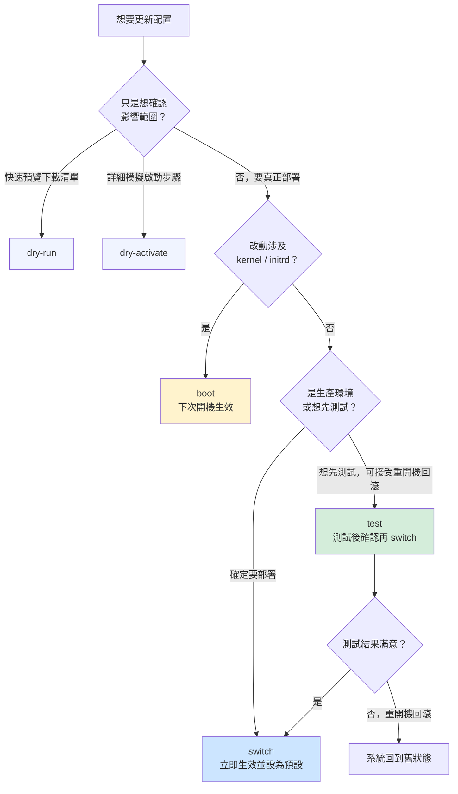
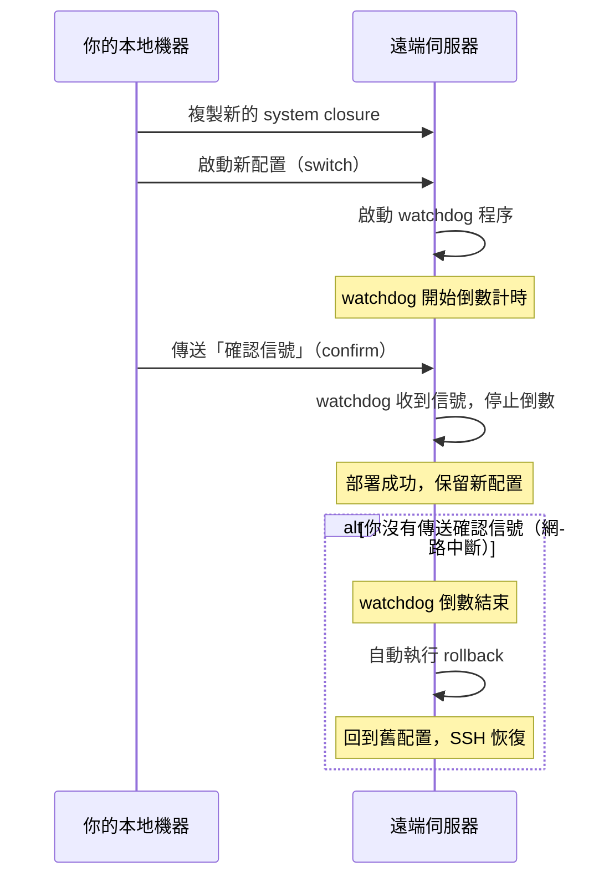
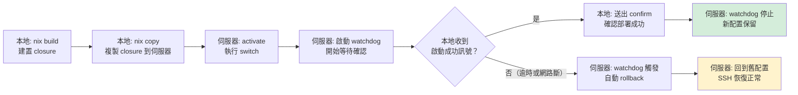
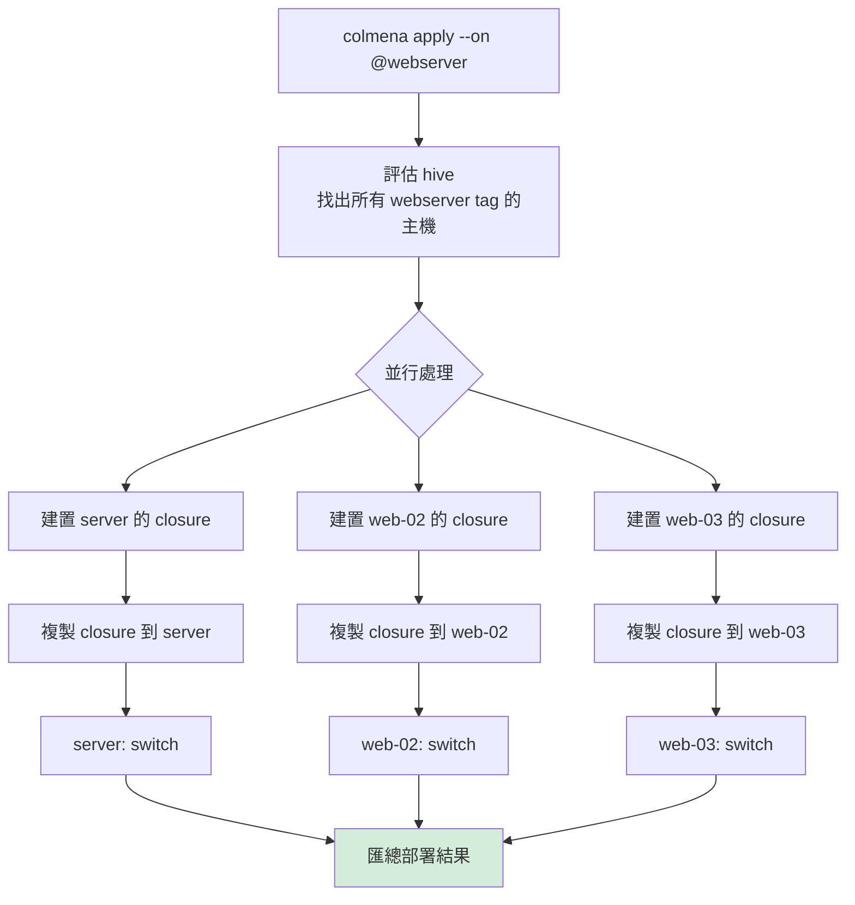
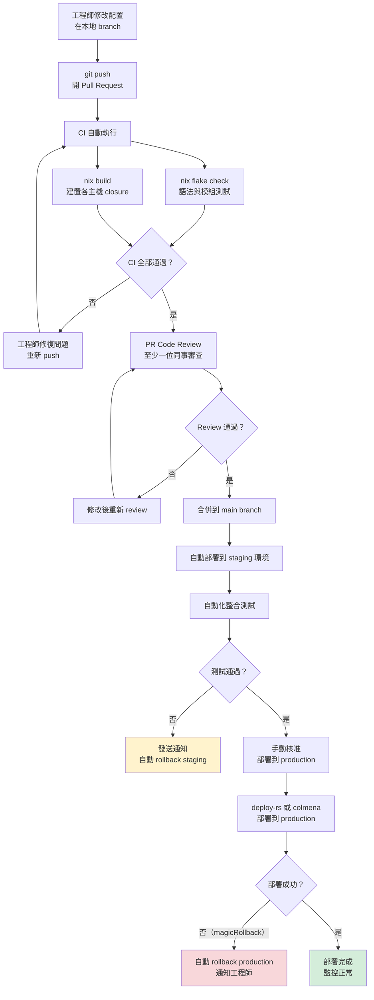
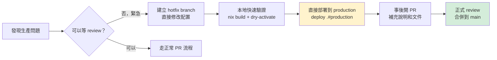

# 第24章：建置與部署流程

## 本章學習目標

完成本章後，你將能夠：

1. 精確區分 `nixos-rebuild` 每個模式的適用場景，並在正確時機選用正確模式
2. 設計多層次 rollback 策略，包含從 bootloader 選單回滾這條「不需要進入系統」的救命路線
3. 使用 `nixos-rebuild --target-host` 執行基本遠端部署，理解其限制
4. 以 deploy-rs 的 `magicRollback` 機制安全地部署遠端主機，避免網路中斷造成主機失聯
5. 以 colmena 管理多台主機的批量部署，並整合 GitHub Actions 建立完整 CI/CD 流水線

---

## 前置知識

- 完成第 23 章（自訂 NixOS Module 開發）
- 已有可運作的 Flakes 配置（第 17–18 章）
- 理解 NixOS 的「世代（generation）」概念（第 4 章）
- 有基本的 SSH 使用經驗

---

## 24.1 nixos-rebuild 模式詳解

`nixos-rebuild` 是 NixOS 日常使用最頻繁的指令。

但很多人只知道 `switch`，對其他模式一知半解。

這一節把六個主要模式全部說清楚。

---

### 六個模式一覽

`nixos-rebuild` 的基本語法是：

```bash
sudo nixos-rebuild <模式> [--flake .#主機名稱]
```

六個模式如下：

| 模式 | 建置 | 啟用（當下生效） | 設為預設開機世代 | 需要 root |
|---|---|---|---|---|
| `switch` | 是 | 是 | 是 | 是 |
| `boot` | 是 | 否 | 是 | 是 |
| `test` | 是 | 是 | 否 | 是 |
| `build` | 是 | 否 | 否 | 否 |
| `dry-run` | 否 | 否 | 否 | 否 |
| `dry-activate` | 是 | 否（模擬） | 否 | 否 |

「需要 root」欄代表是否需要 `sudo`。

---

### switch：日常最常用

```bash
sudo nixos-rebuild switch --flake .#laptop
```

執行順序：

1. 建置新的 system closure
2. 切換到新 generation（當下立即生效）
3. 將新 generation 設為下次開機的預設

**什麼情況用 switch？**

日常修改配置後，想讓改動立即生效，且希望重開機後仍使用新配置時。

例如：

- 新增一個 systemd 服務
- 修改 nginx 設定
- 安裝新套件

---

### boot：下次開機才生效

```bash
sudo nixos-rebuild boot --flake .#server
```

執行順序：

1. 建置新的 system closure
2. 將新 generation 設為下次開機的預設
3. **當下不切換**，系統繼續使用舊配置

**什麼情況用 boot？**

改動涉及 kernel 或 initrd，需要完整重開機才能生效時。

例如：

- 更換 Linux kernel 版本
- 修改 kernel parameters
- 更新 initrd modules

這種情況用 `switch` 沒有意義，因為 kernel 無法在運行中替換。

---

### test：測試用，不影響下次開機

```bash
sudo nixos-rebuild test --flake .#laptop
```

執行順序：

1. 建置新的 system closure
2. 切換到新 generation（當下立即生效）
3. **不設為預設**，下次開機仍回到舊配置

**什麼情況用 test？**

想在不影響開機世代的前提下，測試配置是否能正常運作。

這是最安全的探索方式：

- 嘗試新的服務配置
- 測試網路設定
- 驗證腳本或 hook

如果測試結果滿意，再執行 `switch` 讓它成為預設。

如果測試失敗，只需重開機，系統就回到舊狀態。

---

### build：只建置，不部署

```bash
nixos-rebuild build --flake .#server
```

不需要 `sudo`，因為只建置，不修改系統。

**什麼情況用 build？**

- 驗證配置語法正確、能成功建置
- 在 CI 環境中預建置，產生 store path 供後續步驟使用
- 確認 binary cache 命中率（配合 `--log-format bar-with-logs`）

建置結果會存放在 `./result` 這個 symlink。

---

### dry-run：快速預覽將要下載什麼

```bash
nixos-rebuild dry-run --flake .#laptop
```

**注意**：`dry-run` 不會真正建置，只評估 derivation 圖。

它回答的問題是：「這次更新會拉哪些新套件？」

適合在執行大型更新前，先確認影響範圍。

---

### dry-activate：最詳細的模擬

```bash
nixos-rebuild dry-activate --flake .#laptop
```

`dry-activate` 會真正建置，但模擬 switch 的所有啟動步驟，不實際執行。

它回答的問題是：「如果我執行 switch，系統會做哪些具體改動？」

輸出範例：

```text
would activate:
  starting systemd services: nginx.service
  stopping systemd services: apache2.service
  reloading systemd service: sshd.service
```

比 `dry-run` 更詳細，適合：

- 在生產環境部署前的最終確認
- 理解哪些 systemd 服務會被重啟

---

### 模式決策流程圖



---

## 24.2 Rollback 策略

NixOS 的世代（generation）機制，讓 rollback 成為一流功能，而不是事後補救。

這一節介紹四個層次的 rollback 方式，從最方便到最底層。

---

### 層次 1：nixos-rebuild switch --rollback

```bash
sudo nixos-rebuild switch --rollback
```

這是最快速的方式。

它會回到**上一個世代**，立即生效，並設為預設開機。

適合情境：

- 剛剛執行 `switch`，發現某個服務壞掉了
- 配置更新後，應用程式行為異常
- 趕時間，需要快速恢復

---

### 層次 2：指定世代 rollback

先查看所有世代：

```bash
nixos-rebuild list-generations
```

輸出範例：

```text
Generation  Build-date          NixOS version  Kernel   Configuration Revision
84          2026-05-10 14:22    25.05          6.12.1   abc123def
83          2026-05-09 09:11    25.05          6.12.1   bcd234efe
82          2026-05-01 22:05    25.05          6.11.8   cde345fgh
```

若想回到第 82 代：

```bash
sudo nix-env --switch-generation 82 -p /nix/var/nix/profiles/system
sudo /nix/var/nix/profiles/system/bin/switch-to-configuration switch
```

這提供比 `--rollback` 更精細的控制，可以跨越多個世代。

---

### 層次 3：從 bootloader 選單回滾（最強救命路線）

這是最重要，也最常被新手忽略的能力。

**不需要能夠正常登入系統。**

只要機器能開機，你就能回滾。

操作步驟：

1. 重新啟動機器
2. 在開機畫面（GRUB 或 systemd-boot）停下來
3. 選擇舊的 NixOS 世代

GRUB 選單示意：

```text
NixOS (Generation 84, 2026-05-10)   <-- 這是當前壞掉的版本
NixOS (Generation 83, 2026-05-09)   <-- 選這個
NixOS (Generation 82, 2026-05-01)
```

systemd-boot 選單示意：

```text
NixOS (84)
NixOS (83)   <-- 選這個
NixOS (82)
```

**為什麼這很重要？**

傳統 Linux：服務壞掉 → SSH 進不去 → 需要實體機器或 KVM console。

NixOS：服務壞掉 → 重開機 → 選舊世代 → 系統恢復正常 → SSH 進去修問題。

這個機制讓 NixOS 在遠端伺服器管理上比傳統 Linux 安全得多。

---

### 層次 4：更細粒度的 profile 操作

```bash
# 查看 system profile 的所有世代
sudo nix-env --list-generations -p /nix/var/nix/profiles/system

# 回滾 profile 一個世代
sudo nix-env --rollback -p /nix/var/nix/profiles/system

# 切換到指定世代
sudo nix-env --switch-generation 82 -p /nix/var/nix/profiles/system
```

這是底層操作，適合需要對 profile 進行精確控制時使用。

---

### 清理舊世代

舊世代保存在 `/nix/store` 中，會佔用磁碟空間。

定期清理：

```bash
# 刪除 30 天前的舊世代
sudo nix-collect-garbage --delete-older-than 30d

# 刪除所有舊世代（只保留當前）
sudo nix-collect-garbage -d
```

**注意**：清理前確認系統運作正常。

清理後就無法從那些世代回滾了。

建議保留至少 2–3 個世代作為緩衝。

---

### 安全部署的黃金流程

結合 `test` 模式與 rollback，形成最安全的日常部署習慣：

```bash
# 步驟 1：先用 test 模式測試
sudo nixos-rebuild test --flake .#server

# 步驟 2：觀察一段時間，確認服務正常

# 步驟 3：確認沒問題，正式切換
sudo nixos-rebuild switch --flake .#server

# 萬一 switch 後出問題
sudo nixos-rebuild switch --rollback
```

---

### 自動回滾概念

對於生產環境，可以加入 health check 機制：

```bash
#!/usr/bin/env bash
# deploy-with-check.sh

# 部署
sudo nixos-rebuild switch --flake .#server

# 等待服務啟動
sleep 10

# 檢查關鍵服務
if ! systemctl is-active --quiet nginx; then
  echo "nginx 啟動失敗，執行 rollback"
  sudo nixos-rebuild switch --rollback
  exit 1
fi

echo "部署成功"
```

這個概念在 deploy-rs 的 `magicRollback` 機制中有更完善的實作。

---

## 24.3 遠端部署概念

到目前為止，我們的部署都是在目標機器上直接執行 `nixos-rebuild`。

但在實際工程場景中，這有很大的限制：

- 伺服器通常不安裝開發工具
- 不方便直接在伺服器上編輯 Nix 配置
- 多台機器時，需要一台一台 SSH 進去執行

NixOS 提供了一個更好的模式：**在開發機上建置，部署到目標機器**。

---

### nixos-rebuild 遠端部署

```bash
sudo nixos-rebuild switch \
  --flake .#server \
  --target-host alice@192.0.2.10 \
  --use-remote-sudo
```

這一行指令做了什麼：

1. 在**本地**評估 Flake 配置
2. 在**本地**建置 system closure
3. 把 closure 複製到 `192.0.2.10`（透過 SSH）
4. 在 `192.0.2.10` 上執行 `switch`

---

### --build-host 與 --target-host 的組合

```bash
sudo nixos-rebuild switch \
  --flake .#server \
  --build-host builder@build-machine \
  --target-host alice@192.0.2.10 \
  --use-remote-sudo
```

| 參數 | 說明 |
|---|---|
| `--build-host` | 在哪台機器執行建置（預設：本地） |
| `--target-host` | 部署到哪台機器 |

這個組合適合：

- 本地機器效能不足（例如 MacBook 交叉建置 ARM 伺服器）
- 有專用 build server 的場景

---

### 前置條件

使用 `nixos-rebuild` 遠端部署前，需要確保：

1. **SSH 免密登入**：目標機器能用 key 認證

   ```bash
   ssh-copy-id alice@192.0.2.10
   ```

2. **sudo 或 root 權限**：目標機器的使用者能執行系統修改

3. **Nix 已安裝**：目標機器已安裝 Nix（NixOS 本身就有）

---

### nixos-rebuild 遠端部署的限制

`nixos-rebuild` 遠端部署雖然方便，但有幾個明顯限制：

- 一次只能部署一台機器
- 部署中途若網路斷線，目標機器可能卡在不確定狀態
- 沒有自動 rollback 機制
- 沒有部署狀態追蹤

這就是 deploy-rs 和 colmena 存在的原因。

---

## 24.4 deploy-rs：宣告式遠端部署

deploy-rs 是 NixOS 社群最廣泛使用的遠端部署工具。

它的核心設計哲學：

**把部署配置寫進 `flake.nix`，讓部署本身也成為版本化的宣告式配置。**

---

### 在 flake.nix 中加入 deploy-rs

首先，把 deploy-rs 加入 Flake inputs：

```nix
# flake.nix
{
  description = "Alice 的 NixOS 多主機配置";

  inputs = {
    nixpkgs.url = "github:NixOS/nixpkgs/nixos-25.05";

    deploy-rs = {
      url = "github:serokell/deploy-rs";
      inputs.nixpkgs.follows = "nixpkgs";
    };
  };

  outputs = { self, nixpkgs, deploy-rs, ... }:
  let
    system = "x86_64-linux";
    pkgs = nixpkgs.legacyPackages.${system};
  in
  {
    # NixOS 配置
    nixosConfigurations = {
      server = nixpkgs.lib.nixosSystem {
        inherit system;
        modules = [ ./hosts/server/configuration.nix ];
      };

      laptop = nixpkgs.lib.nixosSystem {
        inherit system;
        modules = [ ./hosts/laptop/configuration.nix ];
      };
    };

    # deploy-rs 部署配置
    deploy = {
      nodes = {
        server = {
          hostname = "192.0.2.10";
          profiles.system = {
            user = "root";
            path = deploy-rs.lib.${system}.activate.nixos
              self.nixosConfigurations.server;
          };
        };
      };
    };

    # deploy-rs 要求的 checks
    checks = builtins.mapAttrs
      (system: deployLib: deployLib.deployChecks self.deploy)
      deploy-rs.lib;
  };
}
```

這個 `flake.nix` 同時定義了：

- `nixosConfigurations`：各主機的系統配置
- `deploy.nodes`：各主機的部署參數

兩者並排，清楚，版本一致。

---

### 執行部署

部署到 server：

```bash
deploy .#server
```

部署所有節點：

```bash
deploy .
```

---

### deploy.nodes 各欄位說明

以下是一個更完整的節點配置範例：

```nix
# flake.nix 的 deploy.nodes 區段
deploy.nodes.server = {
  # 目標主機的 IP 或 hostname
  hostname = "192.0.2.10";

  # 部署失敗時是否自動 rollback
  autoRollback = true;

  # 網路中斷時是否自動 rollback（magicRollback）
  magicRollback = true;

  # SSH 連線使用的 user（不是執行部署的 user）
  sshUser = "alice";

  # 多長時間沒有確認訊號就觸發 magicRollback（秒）
  # 預設 30 秒
  activationTimeout = 45;

  profiles.system = {
    # 在目標機器上用哪個 user 執行 switch
    user = "root";

    # 路徑：把哪個 nixosConfiguration 部署到這裡
    path = deploy-rs.lib.x86_64-linux.activate.nixos
      self.nixosConfigurations.server;
  };
};
```

---

### magicRollback：deploy-rs 的殺手級功能

`magicRollback` 解決了遠端部署最危險的問題：

**「如果部署導致 SSH 連不回來，怎麼辦？」**

傳統遠端部署的惡夢場景：

```text
你執行 nixos-rebuild switch --target-host alice@server
↓
新配置把防火牆規則搞錯了
↓
SSH port 被封鎖
↓
你再也 SSH 不進去了
↓
只能去機房實體操作
```

magicRollback 的運作方式：



這個機制讓遠端部署的最壞結果從「主機失聯」變成「靜靜地回到舊狀態」。

---

### autoRollback 與 magicRollback 的差異

| 機制 | 觸發時機 | 說明 |
|---|---|---|
| `autoRollback` | 部署指令本身失敗（例如 switch 失敗） | 標準的部署失敗回滾 |
| `magicRollback` | 網路中斷，本地機器無法確認部署成功 | 防止「部署成功但自己連不回來」的場景 |

兩者建議同時啟用：

```nix
autoRollback = true;
magicRollback = true;
```

---

### deploy-rs 部署流程圖



---

### 多主機部署範例

假設有 `laptop` 和 `server` 兩台機器：

```nix
# flake.nix（完整多主機範例）
{
  description = "Alice 的多主機 NixOS 配置";

  inputs = {
    nixpkgs.url = "github:NixOS/nixpkgs/nixos-25.05";
    deploy-rs = {
      url = "github:serokell/deploy-rs";
      inputs.nixpkgs.follows = "nixpkgs";
    };
  };

  outputs = { self, nixpkgs, deploy-rs, ... }:
  let
    mkSystem = modules: nixpkgs.lib.nixosSystem {
      system = "x86_64-linux";
      inherit modules;
    };
  in
  {
    nixosConfigurations = {
      laptop = mkSystem [ ./hosts/laptop/configuration.nix ];
      server = mkSystem [ ./hosts/server/configuration.nix ];
    };

    deploy.nodes = {
      laptop = {
        hostname = "192.168.1.10";
        autoRollback = true;
        magicRollback = true;
        sshUser = "alice";
        profiles.system = {
          user = "root";
          path = deploy-rs.lib.x86_64-linux.activate.nixos
            self.nixosConfigurations.laptop;
        };
      };

      server = {
        hostname = "192.0.2.10";
        autoRollback = true;
        magicRollback = true;
        sshUser = "alice";
        activationTimeout = 60;
        profiles.system = {
          user = "root";
          path = deploy-rs.lib.x86_64-linux.activate.nixos
            self.nixosConfigurations.server;
        };
      };
    };

    checks = builtins.mapAttrs
      (system: deployLib: deployLib.deployChecks self.deploy)
      deploy-rs.lib;
  };
}
```

部署指令：

```bash
# 部署到 server
deploy .#server

# 部署到 laptop
deploy .#laptop

# 部署所有節點
deploy .
```

---

## 24.5 colmena：多主機部署工具

colmena 的定位比 deploy-rs 更偏向「大規模多主機管理」。

它的設計理念類似 Ansible：以 tag 和篩選器管理機器群組，但完全以 Nix 實作。

---

### colmena 與 deploy-rs 的定位比較

| 特性 | deploy-rs | colmena |
|---|---|---|
| 設計定位 | 單台到數台主機，Flakes 原生 | 多台到大規模主機，tag 管理 |
| 配置方式 | `flake.nix` 的 `deploy` output | `hive.nix` 或 `flake.nix` 的 `colmena` output |
| 批量操作 | 逐一部署 | 並行批量部署 |
| Tag 篩選 | 無 | 支援（`--on @tag`） |
| magicRollback | 是 | 否（需要手動處理） |
| 適合規模 | 1–10 台 | 10 台以上 |

**選擇建議**：

小型 Homelab 或個人伺服器（5 台以下）→ deploy-rs

大型基礎設施（10 台以上，需要分組管理）→ colmena

---

### 在 flake.nix 中定義 colmena 配置

```nix
# flake.nix
{
  description = "Alice 的伺服器群配置";

  inputs = {
    nixpkgs.url = "github:NixOS/nixpkgs/nixos-25.05";
    colmena = {
      url = "github:zhaofengli/colmena";
      inputs.nixpkgs.follows = "nixpkgs";
    };
  };

  outputs = { self, nixpkgs, colmena, ... }: {

    # colmena output
    colmena = {
      # meta 區塊：全局預設值
      meta = {
        nixpkgs = import nixpkgs {
          system = "x86_64-linux";
        };
        specialArgs = {
          # 可傳遞自訂參數給所有主機模組
        };
      };

      # 每台主機的配置
      laptop = { name, nodes, pkgs, ... }: {
        # deployment 設定
        deployment = {
          targetHost = "192.168.1.10";
          targetUser = "alice";
          tags = [ "workstation" "laptop" ];
        };

        # 引入這台主機的 NixOS 模組
        imports = [ ./hosts/laptop/configuration.nix ];
      };

      server = { name, nodes, pkgs, ... }: {
        deployment = {
          targetHost = "192.0.2.10";
          targetUser = "alice";
          tags = [ "server" "webserver" ];
        };

        imports = [ ./hosts/server/configuration.nix ];
      };

      db-server = { name, nodes, pkgs, ... }: {
        deployment = {
          targetHost = "192.0.2.20";
          targetUser = "alice";
          tags = [ "server" "database" ];
        };

        imports = [ ./hosts/db-server/configuration.nix ];
      };
    };
  };
}
```

---

### colmena 常用指令

部署所有主機：

```bash
colmena apply
```

只部署指定主機：

```bash
colmena apply --on laptop
colmena apply --on server
```

依 tag 批量部署（這是 colmena 的核心優勢）：

```bash
# 部署所有有 webserver tag 的主機
colmena apply --on @webserver

# 部署所有有 server tag 的主機
colmena apply --on @server

# 排除特定主機
colmena apply --on '!laptop'
```

只建置，不部署：

```bash
colmena build
```

查看 eval 結果：

```bash
colmena eval -E '{ nodes, pkgs, ... }: nodes.server.config.networking.hostName'
```

---

### colmena 多主機部署示意圖



colmena 的並行部署讓管理大量伺服器時的效率大幅提升。

---

### 共用模組的處理

colmena 的 `nodes` 參數讓你能在一台主機的配置中存取其他主機的資訊：

```nix
# 例如：讓 nginx 主機知道 db-server 的 IP
server = { name, nodes, pkgs, ... }: {
  deployment = {
    targetHost = "192.0.2.10";
    targetUser = "alice";
  };

  # 利用 nodes 存取其他主機的配置資訊
  services.nginx = {
    enable = true;
    virtualHosts."app.example.com" = {
      locations."/api" = {
        proxyPass = "http://${nodes.db-server.config.networking.hostName}:5432";
      };
    };
  };

  imports = [ ./hosts/server/configuration.nix ];
};
```

這讓多主機間的配置相依關係得以在 Nix 中宣告式地表達。

---

## 24.6 CI 整合：在合併前驗證配置

手動部署有人為疏失的風險。

加入 CI（Continuous Integration）流水線，讓每次 push 都自動驗證配置，在合併前就攔截問題。

---

### 基本 CI 策略

NixOS 配置的 CI 通常包含以下步驟：

1. `nix flake check`：語法檢查 + 執行 module tests
2. `nix build`：建置各主機的 system closure，確保可以成功建置
3. （可選）推送到 binary cache，加速後續部署

---

### GitHub Actions 完整 Workflow

在你的 NixOS 配置 repository 中建立以下檔案：

```yaml
# .github/workflows/ci.yml
name: NixOS CI

on:
  push:
    branches: [ main, develop ]
  pull_request:
    branches: [ main ]

jobs:
  check:
    name: Flake Check
    runs-on: ubuntu-latest

    steps:
      - name: Checkout
        uses: actions/checkout@v4

      - name: Install Nix
        uses: cachix/install-nix-action@v27
        with:
          nix_path: nixpkgs=channel:nixos-25.05
          extra_nix_config: |
            experimental-features = nix-command flakes
            accept-flake-config = true

      - name: Setup Cachix（加速 CI）
        uses: cachix/cachix-action@v15
        with:
          name: alice-nixos-config
          authToken: '${{ secrets.CACHIX_AUTH_TOKEN }}'

      - name: 執行 flake check
        run: nix flake check --all-systems

  build-laptop:
    name: Build laptop
    runs-on: ubuntu-latest
    needs: check

    steps:
      - name: Checkout
        uses: actions/checkout@v4

      - name: Install Nix
        uses: cachix/install-nix-action@v27
        with:
          extra_nix_config: |
            experimental-features = nix-command flakes

      - name: Setup Cachix
        uses: cachix/cachix-action@v15
        with:
          name: alice-nixos-config
          authToken: '${{ secrets.CACHIX_AUTH_TOKEN }}'

      - name: 建置 laptop 的 system closure
        run: |
          nix build .#nixosConfigurations.laptop.config.system.build.toplevel \
            --log-format bar-with-logs

  build-server:
    name: Build server
    runs-on: ubuntu-latest
    needs: check

    steps:
      - name: Checkout
        uses: actions/checkout@v4

      - name: Install Nix
        uses: cachix/install-nix-action@v27
        with:
          extra_nix_config: |
            experimental-features = nix-command flakes

      - name: Setup Cachix
        uses: cachix/cachix-action@v15
        with:
          name: alice-nixos-config
          authToken: '${{ secrets.CACHIX_AUTH_TOKEN }}'

      - name: 建置 server 的 system closure
        run: |
          nix build .#nixosConfigurations.server.config.system.build.toplevel \
            --log-format bar-with-logs

  notify:
    name: 通知結果
    runs-on: ubuntu-latest
    needs: [ build-laptop, build-server ]
    if: always()

    steps:
      - name: 成功通知
        if: ${{ needs.build-laptop.result == 'success' && needs.build-server.result == 'success' }}
        run: echo "所有主機建置成功，可以安全合併"

      - name: 失敗通知
        if: ${{ needs.build-laptop.result == 'failure' || needs.build-server.result == 'failure' }}
        run: |
          echo "建置失敗，請檢查配置"
          exit 1
```

---

### 建置特定主機的 system closure

這個指令在 CI 中很重要，也適合本地測試：

```bash
# 建置 server 主機的完整系統
nix build .#nixosConfigurations.server.config.system.build.toplevel

# 建置 laptop 主機
nix build .#nixosConfigurations.laptop.config.system.build.toplevel
```

建置成功後，`./result` 會是一個 symlink，指向建置出的系統。

---

### Cachix：讓 CI 更快

Nix 的 binary cache 機制讓 CI 不必每次重新編譯所有套件。

Cachix 是最常用的第三方 binary cache 服務。

設定方式：

```bash
# 在本地安裝 cachix
nix profile install nixpkgs#cachix

# 建立 cache
cachix create alice-nixos-config

# 授權
cachix authtoken <你的 token>

# 把本地建置結果推送到 cache
nix build .#nixosConfigurations.server.config.system.build.toplevel
cachix push alice-nixos-config ./result
```

在 NixOS 配置中加入 cache 設定，讓部署機器也能使用：

```nix
# configuration.nix 或 common module
{ config, pkgs, ... }:
{
  nix.settings = {
    substituters = [
      "https://cache.nixos.org"
      "https://alice-nixos-config.cachix.org"
    ];

    trusted-public-keys = [
      "cache.nixos.org-1:6NCHdD59X431o0gWypbMrAURkbJ16ZPMQFGspcDShjY="
      "alice-nixos-config.cachix.org-1:<你的公鑰>"
    ];
  };
}
```

---

### 為什麼 CI 如此重要

以下是沒有 CI 的典型問題場景：

```text
工程師 A 修改了 server 的配置
→ 本地沒有測試
→ Push 到 main branch
→ 工程師 B deploy 到生產環境
→ 發現配置語法錯誤，建置失敗
→ 生產環境服務中斷
```

加入 CI 後：

```text
工程師 A 修改了 server 的配置
→ 開 Pull Request
→ CI 自動執行 nix flake check + nix build
→ 建置失敗，PR 被標記為紅色
→ 工程師 A 在合併前修復問題
→ 生產環境從未受影響
```

---

## 24.7 部署流程設計

有了前面的工具，現在來設計一套完整的生產環境部署流程。

---

### GitOps 的核心原則

GitOps 是指：

**Git Repository 是系統狀態的唯一真實來源（Single Source of Truth）。**

具體體現在：

1. 所有配置改動都透過 Git commit 進行
2. 不在伺服器上手動修改任何配置
3. 部署行為由 Git 事件觸發，不靠人工記憶
4. 任何時間點的系統狀態都可以從 Git history 追溯

**為什麼這比傳統部署更安全？**

| 比較項目 | 傳統部署 | NixOS + GitOps |
|---|---|---|
| 配置追蹤 | 散落在各處，靠文件 | Git history 完整記錄 |
| 配置一致性 | 容易 drift | 宣告式，不能 drift |
| Rollback | 困難，可能無法還原 | 切換世代，秒級 |
| 誰改了什麼 | 難以追查 | git blame 一目了然 |
| 多人協作 | 容易衝突，缺乏審查 | PR + review 流程 |
| 災難恢復 | 需要文件 + 人工重建 | 從 Git 重新部署即可 |

---

### 完整 GitOps 部署流程



---

### 生產環境部署設定範例

以下是一個包含 staging 和 production 的完整 `flake.nix`：

```nix
# flake.nix（生產環境完整範例）
{
  description = "Alice 的生產環境 NixOS 配置";

  inputs = {
    nixpkgs.url = "github:NixOS/nixpkgs/nixos-25.05";
    deploy-rs = {
      url = "github:serokell/deploy-rs";
      inputs.nixpkgs.follows = "nixpkgs";
    };
  };

  outputs = { self, nixpkgs, deploy-rs, ... }:
  let
    system = "x86_64-linux";
    mkSystem = modules: nixpkgs.lib.nixosSystem {
      inherit system;
      inherit modules;
    };
  in
  {
    nixosConfigurations = {
      laptop = mkSystem [ ./hosts/laptop/configuration.nix ];

      # Staging 環境
      staging-server = mkSystem [
        ./hosts/server/configuration.nix
        ./profiles/staging.nix
      ];

      # Production 環境
      prod-server = mkSystem [
        ./hosts/server/configuration.nix
        ./profiles/production.nix
      ];
    };

    deploy = {
      # 全局預設：所有節點都啟用 rollback 保護
      autoRollback = true;
      magicRollback = true;

      nodes = {
        laptop = {
          hostname = "192.168.1.10";
          sshUser = "alice";
          profiles.system = {
            user = "root";
            path = deploy-rs.lib.${system}.activate.nixos
              self.nixosConfigurations.laptop;
          };
        };

        staging = {
          hostname = "192.0.2.5";
          sshUser = "alice";
          activationTimeout = 60;
          profiles.system = {
            user = "root";
            path = deploy-rs.lib.${system}.activate.nixos
              self.nixosConfigurations.staging-server;
          };
        };

        production = {
          hostname = "192.0.2.10";
          sshUser = "alice";
          # production 給更長的 activation timeout
          activationTimeout = 120;
          profiles.system = {
            user = "root";
            path = deploy-rs.lib.${system}.activate.nixos
              self.nixosConfigurations.prod-server;
          };
        };
      };
    };

    checks = builtins.mapAttrs
      (system: deployLib: deployLib.deployChecks self.deploy)
      deploy-rs.lib;
  };
}
```

---

### staging 與 production 的差異化配置

staging 環境可以使用更寬鬆的設定，方便測試：

```nix
# profiles/staging.nix
{ config, pkgs, ... }:
{
  # Staging 特有設定
  networking.hostName = "staging-server";

  # 允許更詳細的 log
  services.journald.extraConfig = ''
    MaxRetentionSec=7day
  '';

  # 可以開放更多 debug 端口
  networking.firewall.allowedTCPPorts = [
    22    # SSH
    80    # HTTP
    443   # HTTPS
    9090  # Prometheus（staging 可以開）
    3000  # Grafana（staging 可以開）
  ];

  system.stateVersion = "25.05";
}
```

production 環境應該更嚴格：

```nix
# profiles/production.nix
{ config, pkgs, ... }:
{
  networking.hostName = "prod-server";

  # 更嚴格的 log 策略
  services.journald.extraConfig = ''
    MaxRetentionSec=30day
    SystemMaxUse=4G
  '';

  # 只開放必要端口
  networking.firewall = {
    enable = true;
    allowedTCPPorts = [
      22   # SSH（可進一步限制來源 IP）
      80   # HTTP
      443  # HTTPS
    ];
  };

  # 開啟 fail2ban
  services.fail2ban.enable = true;

  system.stateVersion = "25.05";
}
```

---

### 緊急修復流程（Hotfix）

當生產環境出現緊急問題，需要快速修復時：



緊急部署指令：

```bash
# 在 hotfix branch 上，快速驗證
nixos-rebuild dry-activate --flake .#prod-server

# 確認沒問題，直接部署
deploy .#production

# 如果部署後問題更嚴重，立即回滾
# magicRollback 會自動處理，或手動：
ssh alice@192.0.2.10 'sudo nixos-rebuild switch --rollback'
```

**重要原則**：

緊急部署後，一定要事後補齊 PR 和說明。

Git history 需要完整記錄，「因為緊急所以跳過」只是製造未來的技術債。

---

### 不要手動修改伺服器

這是 GitOps 最重要的原則，也是最常被違反的一條。

**錯誤示範**：

```bash
# 直接 SSH 進伺服器修改配置
ssh alice@server
sudo vim /etc/nginx/nginx.conf
sudo systemctl reload nginx
```

這樣的修改：

- 沒有記錄在 Git 中
- 下次 `nixos-rebuild switch` 會被覆蓋掉
- 其他人不知道這個修改的存在
- 無法重現

**正確做法**：

```bash
# 在本地修改配置
vim hosts/server/services/nginx.nix

# 提交
git add hosts/server/services/nginx.nix
git commit -m "fix: nginx upstream timeout 設定"

# 部署
deploy .#server
```

唯一的例外：

**排查問題時**，可以臨時修改伺服器上的配置，但事後必須把修改反映到 Git 中。

---

### Lab 24：建立完整的部署流程

**目標**

建立一個包含 CI 驗證和 deploy-rs 部署的完整流程。

**建議環境**

| 項目 | 需求 |
|---|---|
| 本地機器 | NixOS 或有安裝 Nix 的 Linux |
| 遠端主機 | 一台 NixOS VM 或 VPS（IP: 192.0.2.10） |
| GitHub | 一個 repository |
| Cachix | 免費帳號（可選，加速 CI） |

**Step 1：確認 Flake 基礎架構**

確保你的 `flake.nix` 定義了至少一個 `nixosConfiguration`：

```bash
nix flake check
nix build .#nixosConfigurations.server.config.system.build.toplevel
```

**Step 2：加入 deploy-rs**

修改 `flake.nix`，加入 deploy-rs input 和 `deploy.nodes` 配置。

**Step 3：測試 magicRollback**

部署時，啟動另一個 terminal 監控目標機器：

```bash
# terminal 1：執行部署
deploy .#server

# terminal 2：觀察 server 上的 watchdog
ssh alice@server 'journalctl -f -u deploy-rs'
```

**Step 4：加入 GitHub Actions**

在 repository 中建立 `.github/workflows/ci.yml`，加入 `nix flake check` 和 `nix build` 步驟。

**Step 5：驗證流程**

1. 修改一個配置（例如加入一個套件）
2. Push 到 GitHub
3. 觀察 Actions 自動執行
4. Actions 成功後，手動執行 `deploy .#server`
5. 確認部署成功

---

## 本章小結

本章涵蓋了 NixOS 部署的完整知識體系。

**核心概念回顧**：

- `nixos-rebuild` 有六個模式，各有明確適用場景
  - 日常更新用 `switch`
  - 測試先用 `test`，確認再 `switch`
  - kernel 改動用 `boot`
  - 預覽用 `dry-run` 或 `dry-activate`

- Rollback 有四個層次，最強大的是從 bootloader 選單回滾，不需要能進入系統

- 遠端部署可以用 `nixos-rebuild --target-host`，但缺乏 rollback 保護

- deploy-rs 的 `magicRollback` 解決了「部署後 SSH 連不回來」的根本問題

- colmena 適合大規模多主機批量管理，支援 tag 篩選

- CI 整合讓配置問題在合併前就被攔截，保護生產環境

- GitOps 讓 Git 成為系統狀態的唯一真實來源，提供完整的可追溯性和可重現性

**下一步**：

第 25 章將討論效能與儲存最佳化，包含 binary cache 設定、garbage collection 策略和 Nix store 的 deduplication 機制。

---

**關鍵指令速查**：

```bash
# nixos-rebuild 各模式
sudo nixos-rebuild switch --flake .#laptop
sudo nixos-rebuild test --flake .#laptop
sudo nixos-rebuild boot --flake .#laptop
nixos-rebuild dry-run --flake .#laptop
nixos-rebuild dry-activate --flake .#laptop
nixos-rebuild build --flake .#laptop

# Rollback
sudo nixos-rebuild switch --rollback
nixos-rebuild list-generations
sudo nix-collect-garbage --delete-older-than 30d

# 遠端部署
sudo nixos-rebuild switch --flake .#server --target-host alice@192.0.2.10 --use-remote-sudo

# deploy-rs
deploy .#server
deploy .

# colmena
colmena apply
colmena apply --on @webserver
colmena apply --on server
colmena build

# CI 驗證
nix flake check
nix build .#nixosConfigurations.server.config.system.build.toplevel
```
