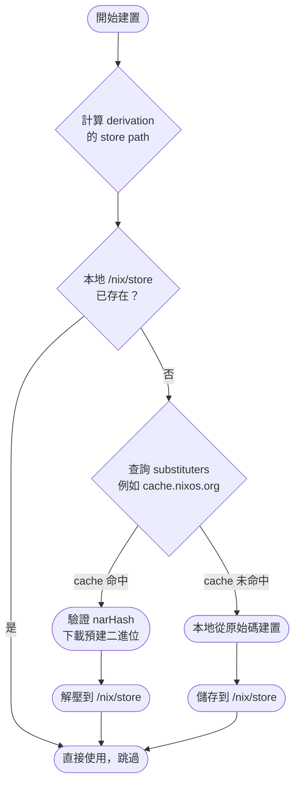
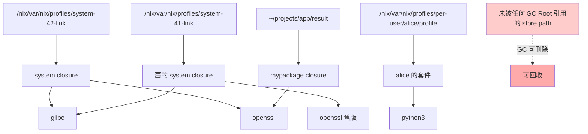

# 第25章：效能與儲存最佳化

## 本章學習目標

完成本章後，你將能夠：

1. 理解 Binary Cache（二進制快取）的運作原理，並正確配置 substituters
2. 整合 Cachix 第三方快取服務，大幅縮短套件下載時間
3. 自行架設內網 binary cache，避免重複從網際網路下載
4. 設定 Garbage Collection（垃圾回收）自動清理 Nix Store，釋放儲存空間
5. 使用 closure 分析工具找出依賴膨脹原因，並調整建置效能參數

---

## 前置知識

- 完成第24章（建置與部署流程），了解 `nixos-rebuild` 的執行流程
- 理解 derivation 的概念：每個套件是由一組輸入計算出的輸出
- 知道 `/nix/store` 的基本作用：所有建置結果都存放於此

---

## 25.1 Binary Cache 的運作原理

### 為什麼 Nix 建置可能很慢

Nix 的可重現性（Reproducibility）來自一個根本設計：

**每個 derivation 的輸出，完全由其輸入決定。**

這代表：理論上，只要給定相同的輸入，任何人都能重新建置出完全一樣的結果。

然而，「重新建置」就代表從原始碼編譯。

一台剛安裝的 NixOS 機器，如果沒有快取，安裝 GCC 或 LLVM 這類大型工具鏈可能需要數小時。

對初學者來說，這是最常見的挫折感來源之一。

---

### Binary Cache（二進制快取）的解法

Binary Cache 的概念很直觀：

「如果有人已經用相同的輸入建置過，把他的結果直接下載下來就好。」

NixOS 官方維護的 binary cache 伺服器位於：

```
https://cache.nixos.org
```

nixpkgs 中幾乎所有套件，官方 CI 系統（Hydra）都已預先建置並上傳到這個 cache。

因此，一般使用者安裝 `pkgs.git` 或 `pkgs.firefox`，幾秒內就能完成——下載的是預先編譯好的二進位檔案，不需要本地編譯。

---

### Nix 建置決策流程

當你執行 `nixos-rebuild switch` 或 `nix build` 時，Nix 的決策流程如下：



整個流程的核心是：**store path 由輸入的 hash 決定**。

只要輸入相同，store path 就相同。

Binary cache 伺服器也是用這個 store path 當作索引，判斷快取是否命中。

---

### narHash：確保 Cache 正確性

Nix Archive（NAR）是 Nix 自定義的封存格式，用來序列化整個 store path。

`narHash` 是這個封存的 SHA256 雜湊值。

下載 cache 之後，Nix 會：

1. 重新計算下載內容的 narHash
2. 與 cache 伺服器提供的 narHash 比對
3. 若不符則拒絕使用，改為本地建置

這個機制保證：**即使 cache 伺服器被入侵，攻擊者也無法在不被發現的情況下投毒。**

驗證的另一層保障是「公鑰簽名」——後續在 25.2 節說明。

---

## 25.2 配置 substituters

### 核心選項：substituters 與 trusted-public-keys

在 NixOS 的 `configuration.nix` 中，binary cache 相關設定集中在 `nix.settings` 底下：

```nix
{ config, pkgs, ... }:

{
  nix.settings = {
    # substituters（替代建置來源）：Nix 會依序查詢這些伺服器
    substituters = [
      "https://cache.nixos.org"
    ];

    # 對應每個 substituter 的公鑰，用來驗證 cache 的簽名
    trusted-public-keys = [
      "cache.nixos.org-1:6NCHdD59X431o0gWypbMrAURkbJ16ZPMQFGspcDShjY="
    ];
  };

  system.stateVersion = "25.05";
}
```

`substituters` 是一個清單。

Nix 會**依照清單順序**查詢每個 cache 伺服器。

若第一個命中，則直接使用，不再查詢後面的伺服器。

---

### trusted-public-keys：防止投毒攻擊

每個 cache 伺服器在上傳 binary 時，都會用私鑰對內容簽名。

`trusted-public-keys` 就是對應的公鑰清單。

Nix 只接受**被信任公鑰簽名的 cache**。

若某個 substituter 的 binary 無法被任何信任公鑰驗證，Nix 會：

- 拒絕使用該快取
- 退回本地建置

這是 Nix 安全模型的重要防線。

---

### 多個 substituter 的完整配置範例

以下是一個加入官方 cache、Cachix 社群 cache 及自建內網 cache 的完整配置：

```nix
{ config, pkgs, ... }:

{
  nix.settings = {
    substituters = [
      # 官方 cache（優先度最高）
      "https://cache.nixos.org"
      # Cachix 上的 nix-community cache（提供社群套件，例如 neovim nightly）
      "https://nix-community.cachix.org"
      # 公司內網的自建 cache（局域網速度最快，但未必包含所有套件）
      "http://cache.internal.example.com:5000"
    ];

    trusted-public-keys = [
      "cache.nixos.org-1:6NCHdD59X431o0gWypbMrAURkbJ16ZPMQFGspcDShjY="
      "nix-community.cachix.org-1:mB9FSh9qf2dCimDSUo8Zy7bkq5CX+/rkCWyvRCUSEDY="
      # 自建 cache 的公鑰（由 nix-store --generate-binary-cache-key 產生）
      "cache.internal.example.com-1:AbCdEfGh1234...（公鑰內容）"
    ];
  };

  system.stateVersion = "25.05";
}
```

清單的順序即優先順序。

建議把速度最快、命中率最高的放在前面。

---

### trusted-substituters：讓一般使用者也能使用

預設情況下，只有 root 和 `trusted-users` 清單中的使用者可以在 `nix.conf` 中新增 substituter。

若想讓 `alice` 也能臨時使用自訂 cache（例如 `nix build --option substituters ...`），需要加入：

```nix
{ config, pkgs, ... }:

{
  nix.settings = {
    substituters = [
      "https://cache.nixos.org"
    ];

    trusted-public-keys = [
      "cache.nixos.org-1:6NCHdD59X431o0gWypbMrAURkbJ16ZPMQFGspcDShjY="
    ];

    # 允許 alice 在指令中自行指定 substituter
    trusted-users = [ "root" "alice" ];
  };

  system.stateVersion = "25.05";
}
```

`trusted-users` 賦予使用者在不修改系統配置的情況下，臨時添加 substituter 的能力。

這在開發和測試自己的 cache 時非常方便。

---

## 25.3 Cachix：第三方 Binary Cache

### Cachix 是什麼

Cachix（https://cachix.org）是一個提供 Nix binary cache 的雲端服務。

它解決了一個常見問題：

**nixpkgs 的官方 cache 只涵蓋 nixpkgs 本身的套件。**

如果你用了：

- Flakes 中自定義的套件
- 從 GitHub 引入的第三方 overlay
- 本地開發中的 derivation

這些都沒有官方 cache。每次 `nixos-rebuild` 都要重新編譯，非常耗時。

Cachix 的角色是：**讓個人或團隊也能輕鬆建立和分享自己的 binary cache。**

---

### 使用公開的 Cachix Cache

Cachix 上有許多社群維護的公開 cache。

以最常用的 `nix-community` cache 為例，它提供了 neovim nightly、home-manager 等套件的預建二進位。

在 NixOS 配置中直接加入：

```nix
{ config, pkgs, ... }:

{
  nix.settings = {
    substituters = [
      "https://cache.nixos.org"
      "https://nix-community.cachix.org"
    ];

    trusted-public-keys = [
      "cache.nixos.org-1:6NCHdD59X431o0gWypbMrAURkbJ16ZPMQFGspcDShjY="
      "nix-community.cachix.org-1:mB9FSh9qf2dCimDSUo8Zy7bkq5CX+/rkCWyvRCUSEDY="
    ];
  };

  system.stateVersion = "25.05";
}
```

套用後執行：

```bash
sudo nixos-rebuild switch
```

之後安裝 `nix-community` 提供的套件，就會優先從 Cachix 下載預建結果。

---

### 使用 cachix CLI 快速設定（非 NixOS 系統或臨時使用）

若想快速體驗某個 cache，也可以直接使用 `cachix` 指令：

```bash
# 安裝 cachix 工具
nix-env -iA nixpkgs.cachix

# 一鍵設定 nix-community cache（會自動修改 /etc/nix/nix.conf）
cachix use nix-community
```

在 NixOS 環境中，建議還是用宣告式配置（`nix.settings`）管理，保持系統一致性。

---

### 推送自己的建置結果到 Cachix

假設你在 alice 的機器上建置了一個自訂套件，想把結果上傳到名為 `my-cache` 的 Cachix 快取：

**Step 1：建置套件**

```bash
nix build .#mypackage
```

建置完成後，`result` 符號連結指向建置結果的 store path。

**Step 2：用私鑰對 store path 簽名**

```bash
nix store sign --key-file /path/to/my-cache-private-key.pem result
```

私鑰由 Cachix 在建立 cache 時提供，或用 `nix-store --generate-binary-cache-key` 自行產生。

**Step 3：推送到 Cachix**

```bash
cachix push my-cache result
```

`cachix push` 會遞迴上傳 `result` 及其所有閉包（closure）中的 store path。

之後其他機器就能從 `https://my-cache.cachix.org` 直接下載這個建置結果。

---

### 在 GitHub Actions 中自動推送

CI 流程中自動快取建置結果是 Cachix 最常見的使用場景。

以下是一個完整的 GitHub Actions 工作流程範例：

```yaml
# .github/workflows/build.yml
name: Build and Cache

on:
  push:
    branches: [ main ]

jobs:
  build:
    runs-on: ubuntu-latest
    steps:
      - uses: actions/checkout@v4

      - uses: cachix/install-nix-action@v27
        with:
          nix_path: nixpkgs=channel:nixos-25.05

      - uses: cachix/cachix-action@v15
        with:
          name: my-cache
          # Cachix 的推送 token，存放在 GitHub Secrets
          authToken: '${{ secrets.CACHIX_AUTH_TOKEN }}'

      - run: nix build .#mypackage
```

`cachix-action` 會在建置完成後，自動把所有新產生的 store path 推送到 Cachix。

---

### Cachix 免費方案說明

| 方案 | 限制 |
|---|---|
| 公開 cache（免費） | 無限儲存、無限下載 |
| 私有 cache（付費） | 依方案收費，適合商業用途 |

對大多數開源專案和個人用途，公開 cache 完全免費且無使用限制。

---

## 25.4 自建 Binary Cache

### 為什麼需要自建 Cache

Cachix 是雲端服務，依賴網際網路連線。

以下場景更適合自建 cache：

- **家庭實驗室（Homelab）**：多台機器共用同一批套件，避免每台都要從外網重複下載
- **公司內網**：網路速度受限，或有資安政策禁止直接連外部 cache
- **離線環境**：完全沒有外部網路的機器

---

### 使用 nix-serve 建立最簡單的本地 Cache

`nix-serve` 是 NixOS 官方提供的 binary cache 伺服器，配置極為簡單。

在要作為 cache 伺服器的機器（假設 IP 為 `192.168.1.10`）上，加入以下配置：

```nix
{ config, pkgs, ... }:

{
  networking.hostName = "nixos-cache";

  # 啟用 nix-serve
  services.nix-serve = {
    enable = true;
    # 監聽 port（預設 5000）
    port = 5000;
    # 簽名私鑰路徑（若不設定，cache 內容將不被簽名，客戶端必須明確信任）
    secretKeyFile = "/etc/nix/cache-priv-key.pem";
  };

  # 開放防火牆 port
  networking.firewall.allowedTCPPorts = [ 5000 ];

  system.stateVersion = "25.05";
}
```

---

### 生成簽名金鑰對

在 cache 伺服器上執行以下指令，生成一對簽名金鑰：

```bash
# 生成私鑰（存在伺服器上，不能外洩）和公鑰（分發給客戶端）
sudo nix-store --generate-binary-cache-key \
  "nixos-cache.internal:1" \
  /etc/nix/cache-priv-key.pem \
  /etc/nix/cache-pub-key.pem
```

指令格式說明：

- `"nixos-cache.internal:1"`：金鑰名稱，格式為 `名稱:版本號`，任意命名即可
- 第二個參數：私鑰輸出路徑
- 第三個參數：公鑰輸出路徑

查看產生的公鑰內容：

```bash
cat /etc/nix/cache-pub-key.pem
# 輸出範例：
# nixos-cache.internal:1:AbCdEf1234567890+abcdefghijklmnopqrstuvwxyz0123456789ABCDE=
```

把這個公鑰字串記下來，要填入客戶端的 `trusted-public-keys`。

---

### 在客戶端配置使用自建 Cache

在 alice 的工作站（或任何需要使用這個 cache 的機器）上：

```nix
{ config, pkgs, ... }:

{
  nix.settings = {
    substituters = [
      "https://cache.nixos.org"
      # 自建的局域網 cache 伺服器
      "http://192.168.1.10:5000"
    ];

    trusted-public-keys = [
      "cache.nixos.org-1:6NCHdD59X431o0gWypbMrAURkbJ16ZPMQFGspcDShjY="
      # 自建 cache 的公鑰
      "nixos-cache.internal:1:AbCdEf1234567890+abcdefghijklmnopqrstuvwxyz0123456789ABCDE="
    ];
  };

  system.stateVersion = "25.05";
}
```

---

### 使用 Nginx 加上 HTTPS

若要對外提供 cache 服務（或需要 HTTPS），可以在 nix-serve 前面加一層 Nginx 反向代理：

```nix
{ config, pkgs, ... }:

{
  services.nix-serve = {
    enable = true;
    port = 5000;
    secretKeyFile = "/etc/nix/cache-priv-key.pem";
  };

  services.nginx = {
    enable = true;

    virtualHosts."cache.example.com" = {
      # 使用 Let's Encrypt 自動申請 TLS 憑證
      enableACME = true;
      forceSSL = true;

      locations."/" = {
        proxyPass = "http://127.0.0.1:5000";
        extraConfig = ''
          proxy_set_header Host $host;
          proxy_set_header X-Real-IP $remote_addr;
          # 提升大型 NAR 檔案的傳輸效率
          proxy_buffering off;
        '';
      };
    };
  };

  # ACME（Let's Encrypt）聯絡信箱
  security.acme.defaults.email = "alice@example.com";
  security.acme.acceptTerms = true;

  networking.firewall.allowedTCPPorts = [ 80 443 ];

  system.stateVersion = "25.05";
}
```

---

### 把現有的 Store Path 推送到自建 Cache

自建 cache 伺服器本身只提供 `/nix/store` 的內容給外部查詢。

若要主動把某台機器上的建置結果推送過去，使用 `nix copy`：

```bash
# 把 /run/current-system 及其所有依賴推送到 cache 伺服器
nix copy \
  --to "http://192.168.1.10:5000" \
  /run/current-system
```

這對「預先暖機（warm-up）」cache 非常有用：

在一台機器上完整建置後，其他機器就能直接從 cache 下載，無需重新編譯。

---

## 25.5 Garbage Collection：釋放儲存空間

### Nix Store 為什麼會不斷增長

Nix 的設計原則之一是「不可變（Immutable）」：

每次 `nixos-rebuild switch`，新的系統 generation 會被建立，但舊的 store path 不會立即刪除。

這保障了 rollback 的能力——但代價是磁碟空間會持續增加。

幾個月後，一台 NixOS 機器的 `/nix/store` 輕易就會超過 50GB，甚至更多。

---

### GC Roots：什麼東西不會被刪除

Garbage Collection（垃圾回收）會刪除「沒有任何引用」的 store path。

但什麼叫做「有引用」？

Nix 定義了一組 **GC Roots（垃圾回收根節點）**：

| GC Root 類型 | 位置 |
|---|---|
| 系統 profile（每個 generation） | `/nix/var/nix/profiles/system-*-link` |
| 使用者 profile | `/nix/var/nix/profiles/per-user/alice/profile-*-link` |
| `nix build` 產生的 result 連結 | 任何目錄下的 `result` 或 `result-*` 符號連結 |
| nix-env 安裝的套件 | 使用者 profile |
| 開發中的 flake lock | flake 引用的輸入 |

只要一個 store path 被任何 GC Root 直接或間接引用，它就不會被回收。



---

### 手動執行 Garbage Collection

**方法一：刪除所有非當前 generation 的路徑**

```bash
# 先刪除舊的 system profiles（保留當前 generation）
sudo nix-collect-garbage -d

# -d 代表 --delete-old，刪除所有舊世代的 profile，然後進行 GC
```

這是最激進的方式，執行後將無法 rollback 到任何舊 generation。

**方法二：保留最近幾天的世代**

```bash
# 刪除 30 天前的 profiles，再進行 GC
sudo nix-collect-garbage --delete-older-than 30d
```

這保留了最近 30 天的所有 generation，維持一定的 rollback 能力。

**查看回收前後的 Store 大小：**

```bash
# 查看 /nix/store 目前佔用
du -sh /nix/store

# 執行 GC
sudo nix-collect-garbage --delete-older-than 30d

# 再次查看
du -sh /nix/store
```

---

### 清理 result 符號連結

`nix build` 在當前目錄產生的 `result` 符號連結也是 GC Root。

若不刪除 `result`，即使 profile 清理了，被 result 引用的 store path 也不會被 GC 回收。

```bash
# 列出目前目錄中的 result 連結
ls -la result result-*

# 刪除後，GC 才能回收對應的 store path
rm result result-*
```

---

### 自動 Garbage Collection

手動 GC 容易忘記，建議在系統配置中加入自動排程：

```nix
{ config, pkgs, ... }:

{
  nix.gc = {
    # 啟用自動 GC
    automatic = true;
    # 執行頻率（使用 systemd.time 格式）
    dates = "weekly";
    # GC 選項（等同於手動執行時的旗標）
    options = "--delete-older-than 30d";
  };

  system.stateVersion = "25.05";
}
```

這會建立一個 systemd timer，每週自動執行一次 GC，刪除 30 天以前的舊 generation。

`dates` 接受 systemd 時間格式，例如：

| 值 | 說明 |
|---|---|
| `"weekly"` | 每週一次（週一 00:00） |
| `"daily"` | 每天一次（00:00） |
| `"Mon *-*-* 03:00:00"` | 每週一凌晨 3 點 |
| `"*-*-1 04:00:00"` | 每月 1 日凌晨 4 點 |

---

## 25.6 nix store optimise：Hard Link 去重

### 問題：相同內容佔用多倍空間

在 Nix Store 中，不同的 derivation 可能會包含完全相同的檔案。

例如：

- `python3` 和 `python3-with-packages-abc` 可能都包含完全相同的 `libpython3.so`
- 不同版本的 derivation 可能共用 `libc`

但因為它們是不同的 store path，檔案系統預設以獨立檔案存放，造成空間浪費。

---

### 解法：Hard Link 去重

`nix store optimise` 會掃描整個 `/nix/store`：

1. 計算每個檔案的 hash
2. 找出內容完全相同的檔案
3. 將它們替換為 Hard Link（硬連結）

Hard Link 讓多個路徑指向同一個底層 inode，不會真的複製資料，因此能大幅節省空間。

**手動執行：**

```bash
# 執行 store 最佳化（可能需要幾分鐘）
nix store optimise

# 顯示詳細進度
nix store optimise --verbose
```

---

### 自動最佳化設定

建議在系統配置中啟用，讓每次建置完成後自動進行去重：

```nix
{ config, pkgs, ... }:

{
  nix.settings = {
    # 每次建置後自動進行 hard link 去重
    auto-optimise-store = true;
  };

  system.stateVersion = "25.05";
}
```

啟用 `auto-optimise-store` 後，建置速度會略微下降（需要額外計算 hash），但長期而言能持續保持 store 的高效利用率。

---

### 預期的節省效果

Hard Link 去重的效果因系統用途而異：

| 使用場景 | 預期節省空間 |
|---|---|
| 桌面系統（多種語言工具鏈） | 10–25% |
| 伺服器（套件相對集中） | 5–15% |
| 開發環境（大量 devShell） | 20–35% |
| CI 環境（大量不同建置） | 10–30% |

實際效果可以在執行前後分別用 `du -sh /nix/store` 比較。

---

## 25.7 Closure 大小分析工具

### 什麼是 Closure（閉包）

在 Nix 中，一個 derivation 的 **closure** 是指：

**這個 derivation 加上它所有直接與間接依賴的完整集合。**

例如，`firefox` 的 closure 包含：

- firefox 本身
- GTK
- fontconfig
- glib
- 所有系統函式庫
- ... 共可能高達數百個套件

整個 NixOS 系統的 closure 就是 `/run/current-system` 的 closure，通常包含數千個 store path。

---

### 查看 Closure 大小

**查看當前系統的 closure 大小：**

```bash
nix path-info -rsSh /run/current-system
```

選項說明：

| 選項 | 說明 |
|---|---|
| `-r` | recursive，展開所有依賴 |
| `-s` | 顯示 store path 的 nar-size |
| `-S` | 顯示 store path 的累計 closure size |
| `-h` | human-readable（KB/MB/GB） |

預期輸出格式（節錄）：

```
/nix/store/abc123-glibc-2.40    9.8M     9.8M
/nix/store/def456-openssl-3.3   12.3M   22.1M
/nix/store/ghi789-systemd-256   45.2M   67.3M
...
/nix/store/xyz000-nixos-system  1.2M    3.8G
```

左欄是 store path 本身的大小，右欄是包含其 closure 的累計大小。

---

### 找出最大的依賴

```bash
# 依 closure size 排序，找出前 20 個最大的 store path
nix path-info -rSh /run/current-system | sort -k2 -h | tail -20
```

這個指令能快速定位「哪個套件的依賴鏈最肥大」，是最佳化 closure 的第一步。

---

### nix why-depends：找出依賴原因

有時候你會疑惑：**為什麼我的系統 closure 包含某個意料之外的套件？**

使用 `nix why-depends` 可以找出依賴路徑：

```bash
# 找出 /run/current-system 為什麼依賴 python3
nix why-depends /run/current-system $(nix eval --raw nixpkgs#python3)
```

輸出範例：

```
/nix/store/xyz000-nixos-system
└── /nix/store/aaa111-systemd-256
    └── /nix/store/bbb222-python3-3.12
```

這表示：`systemd` 依賴了 `python3`（用於某些 udev 腳本），進而把 python3 拉進系統 closure。

---

### nix-tree：互動式 Closure 探索

`nix-tree` 是一個終端機互動式工具，可以圖形化地瀏覽 closure 的依賴樹。

先確認已安裝（或臨時使用）：

```bash
# 臨時使用
nix run nixpkgs#nix-tree -- /run/current-system

# 或加入系統套件
environment.systemPackages = with pkgs; [ nix-tree ];
```

啟動後的介面：

```
/run/current-system (3.8G)
├── systemd (245M)
│   ├── python3 (180M)          <-- 按右鍵展開
│   ├── util-linux (12M)
│   └── ...
├── nixos-config (5M)
├── glibc (10M)
└── ...
```

鍵盤操作：

| 鍵 | 動作 |
|---|---|
| `→` / `Enter` | 展開選中節點 |
| `←` | 折疊 |
| `u` | 顯示哪些節點依賴了這個 |
| `s` | 依大小排序 |
| `q` | 退出 |

---

### 常見的 Closure 膨脹原因與對策

| 原因 | 對策 |
|---|---|
| 開發工具被混入系統套件 | 改用 `nix develop` / devShell，不加入 `environment.systemPackages` |
| 不必要的語言執行環境（Python、Perl） | 確認是哪個服務引入，考慮改用靜態連結版本 |
| 大型 GUI 函式庫被 CLI 工具拉入 | 使用 `-headless` 或 `-minimal` 版本的套件 |
| 多個版本的同一個函式庫共存 | 使用 overlay 統一版本，或更新到使用相同依賴版本的套件 |
| 大量 locale 資料 | 使用 `glibcLocalesUtf8` 代替完整 glibc locale |

---

## 25.8 建置效能最佳化

### 開啟平行建置

Nix 預設以有限的平行度進行建置。

在多核心機器上，可以大幅提升建置速度：

```nix
{ config, pkgs, ... }:

{
  nix.settings = {
    # max-jobs：同時進行建置的最大數量
    # "auto" 代表等於 CPU 核心數
    max-jobs = "auto";

    # cores：每個建置任務可使用的 CPU 核心數
    # 0 代表使用所有可用核心（但會與 max-jobs 分享）
    # 建議設定為 1，讓 max-jobs 決定平行度
    cores = 1;
  };

  system.stateVersion = "25.05";
}
```

`max-jobs` 和 `cores` 的關係：

| max-jobs | cores | 行為 |
|---|---|---|
| 4 | 1 | 4 個建置任務同時進行，每個用 1 核心 |
| 1 | 4 | 1 個建置任務用 4 核心（適合大型套件如 LLVM） |
| "auto" | 1 | 核心數個任務同時進行，每個用 1 核心（最常用） |

---

### CPU 排程優先級

NixOS 建置過程可能會消耗大量 CPU，影響前台作業。

透過設定 CPU 排程策略，讓建置任務在系統「閒置時」才搶占資源：

```nix
{ config, pkgs, ... }:

{
  nix.daemonCPUSchedPolicy = "idle";

  system.stateVersion = "25.05";
}
```

`daemonCPUSchedPolicy` 可選值：

| 值 | 說明 |
|---|---|
| `"other"` | 預設（與一般程序相同） |
| `"idle"` | 只在 CPU 完全閒置時使用（推薦桌面環境） |
| `"batch"` | 低優先級批次作業（介於 other 和 idle 之間） |

---

### IO 排程優先級

大型建置也會大量讀寫磁碟，影響系統整體 IO 響應速度：

```nix
{ config, pkgs, ... }:

{
  # IO 排程等級（idle = 只在 IO 閒置時使用）
  nix.daemonIOSchedClass = "idle";

  system.stateVersion = "25.05";
}
```

`daemonIOSchedClass` 可選值：

| 值 | 說明 |
|---|---|
| `"best-effort"` | 預設（與一般程序相同） |
| `"idle"` | 只在 IO 系統閒置時使用（推薦桌面環境） |
| `"realtime"` | 最高優先級（不適合 Nix daemon） |

---

### keep-outputs 與 keep-derivations

正常情況下，GC 只保留 derivation 的輸出（建置結果），不保留中間產物。

若要加速重建（例如開發中頻繁修改），可以保留這些中間產物：

```nix
{ config, pkgs, ... }:

{
  nix.settings = {
    # 保留 build output（即使沒有 GC root 引用也不刪除）
    keep-outputs = true;

    # 保留 .drv 檔案（derivation 描述檔）
    keep-derivations = true;
  };

  system.stateVersion = "25.05";
}
```

啟用後的效果：

- `keep-outputs = true`：讓 `nix-shell` 或 `nix develop` 不需要重新下載依賴
- `keep-derivations = true`：讓 `nix-store --query` 等工具能讀取完整的建置描述

**注意**：這兩個選項會讓 GC 保留更多資料，磁碟用量會增加。

---

### Content-Addressed Derivations（概念介紹）

Nix 傳統的 derivation 是「Input-Addressed」：

store path 的 hash 由**輸入（Input）**決定，即使輸出完全相同，只要輸入有任何差異就是不同的 store path。

這有一個問題：修改一個工具鏈中間的套件（例如 GCC），會導致所有依賴它的套件都需要重新建置，即使最終輸出一模一樣。

**Content-Addressed Derivations（內容定址 derivation）** 是 Nix 正在推進的實驗性功能：

store path 由**輸出內容的 hash** 決定。

若最終輸出相同（例如 GCC 修了個文件錯誤，但生成的 binary 完全一樣），下游套件就不需要重新建置。

目前可在 `nix.settings` 中啟用實驗性支援：

```nix
{ config, pkgs, ... }:

{
  nix.settings = {
    experimental-features = [
      "nix-command"
      "flakes"
      # 啟用 content-addressed derivation（實驗性）
      "ca-derivations"
    ];
  };

  system.stateVersion = "25.05";
}
```

`ca-derivations` 目前仍為實驗性功能，生產環境建議先觀望，等待正式穩定。

---

## Lab 25：建立完整的 Nix 效能最佳化配置

### 目標

完成本 Lab 後，你的系統將具備：

- 設定多個 binary cache，縮短套件下載時間
- 自動每週回收舊 generation，釋放磁碟空間
- Hard Link 去重，提升 store 空間利用率
- 平行建置與低優先級排程，避免影響日常使用

---

### 建議環境

| 項目 | 建議 |
|---|---|
| NixOS 版本 | 25.05 |
| 硬碟空間 | 建議 50GB 以上（分析 store 時需要空間） |
| 網路 | 需連外（下載 Cachix cache） |
| 使用者 | alice（sudoer） |

---

### Step 1：建立效能最佳化的系統配置

建立或修改 `/etc/nixos/configuration.nix`：

```nix
{ config, pkgs, ... }:

{
  networking.hostName = "nixos";

  users.users.alice = {
    isNormalUser = true;
    extraGroups = [ "wheel" ];
  };

  # ── Binary Cache 設定 ──────────────────────────────────────
  nix.settings = {
    substituters = [
      "https://cache.nixos.org"
      "https://nix-community.cachix.org"
    ];

    trusted-public-keys = [
      "cache.nixos.org-1:6NCHdD59X431o0gWypbMrAURkbJ16ZPMQFGspcDShjY="
      "nix-community.cachix.org-1:mB9FSh9qf2dCimDSUo8Zy7bkq5CX+/rkCWyvRCUSEDY="
    ];

    # 允許 alice 臨時添加 substituter
    trusted-users = [ "root" "alice" ];

    # ── 建置效能 ──────────────────────────────────────────────
    max-jobs = "auto";
    cores = 1;

    # 自動 Hard Link 去重
    auto-optimise-store = true;

    # 保留建置產物（加速 nix develop）
    keep-outputs = true;
    keep-derivations = true;

    # 啟用 flakes 與新版 nix 指令
    experimental-features = [ "nix-command" "flakes" ];
  };

  # ── CPU / IO 排程（讓建置不影響前台） ─────────────────────
  nix.daemonCPUSchedPolicy = "idle";
  nix.daemonIOSchedClass = "idle";

  # ── 自動 Garbage Collection ───────────────────────────────
  nix.gc = {
    automatic = true;
    dates = "weekly";
    options = "--delete-older-than 30d";
  };

  # ── 常用分析工具 ──────────────────────────────────────────
  environment.systemPackages = with pkgs; [
    nix-tree       # 互動式 closure 探索
    cachix         # Cachix CLI 工具
  ];

  system.stateVersion = "25.05";
}
```

---

### Step 2：套用配置

```bash
sudo nixos-rebuild switch
```

---

### Step 3：驗證 Binary Cache 設定

確認 Nix 知道哪些 substituter：

```bash
nix show-config | grep substituters
```

預期輸出：

```
substituters = https://cache.nixos.org https://nix-community.cachix.org
```

---

### Step 4：分析當前系統 Closure 大小

```bash
# 查看系統 closure 總大小
nix path-info -rSh /run/current-system | tail -1

# 找出最大的前 10 個依賴
nix path-info -rSh /run/current-system | sort -k2 -h | tail -10
```

記錄下目前的大小，後續最佳化後可以比較。

---

### Step 5：執行一次手動 GC 和 Optimise

```bash
# 查看 GC 前的大小
du -sh /nix/store

# 刪除 30 天前的舊 generation 並 GC
sudo nix-collect-garbage --delete-older-than 30d

# 執行 Hard Link 去重
nix store optimise

# 查看 GC 後的大小
du -sh /nix/store
```

---

### 驗證

確認自動 GC 的 systemd timer 已啟用：

```bash
systemctl status nix-gc.timer
```

預期輸出中應包含 `Active: active (waiting)` 以及下次觸發時間。

---

## 本章小結

本章完整介紹了 NixOS 的效能與儲存最佳化策略。

### 核心概念回顧

- **Binary Cache** 是 Nix 避免重複編譯的核心機制，以 store path（由輸入 hash 決定）作為索引
- **substituters** 設定 cache 伺服器清單，**trusted-public-keys** 確保 cache 內容的完整性
- **Cachix** 讓個人和團隊也能輕鬆建立和分享 binary cache，搭配 CI 使用效果最佳
- **自建 cache**（nix-serve）適合局域網環境，避免重複從外網下載
- **Garbage Collection** 需定期執行，理解 GC Roots 的概念才能正確控制哪些路徑被保留
- **nix store optimise** 透過 Hard Link 去重，在不影響功能的前提下節省 10–35% 的空間
- **Closure 分析**（`nix path-info`、`nix-tree`、`nix why-depends`）幫助找出依賴膨脹的根源
- **建置效能**可透過平行化（`max-jobs`）、低優先級排程（`idle`）和快取保留（`keep-outputs`）同時最佳化

---

### 完整的 Nix 效能最佳化 Checklist

**Binary Cache：**

- [ ] 確認 `substituters` 包含 `https://cache.nixos.org`
- [ ] 根據使用情境加入適合的 Cachix 公開 cache
- [ ] 若有內網環境，架設 `nix-serve` 並設定客戶端使用
- [ ] CI 流程中加入 Cachix 推送步驟

**儲存空間：**

- [ ] 啟用 `nix.settings.auto-optimise-store = true`
- [ ] 設定 `nix.gc.automatic = true` 搭配 `--delete-older-than 30d`
- [ ] 定期刪除不再需要的 `result` 符號連結
- [ ] 監控 `/nix/store` 大小（`du -sh /nix/store`）

**Closure 最佳化：**

- [ ] 用 `nix path-info -rSh` 了解當前 closure 大小
- [ ] 用 `nix-tree` 找出最大的依賴節點
- [ ] 用 `nix why-depends` 找出非預期的依賴原因
- [ ] 把開發工具移出 `environment.systemPackages`，改用 devShell

**建置效能：**

- [ ] 設定 `max-jobs = "auto"` 充分利用多核心
- [ ] 設定 `daemonCPUSchedPolicy = "idle"` 避免影響前台
- [ ] 設定 `daemonIOSchedClass = "idle"` 避免影響系統 IO
- [ ] 根據需求決定是否啟用 `keep-outputs`（開發環境適合啟用）

---

### 進入第七篇之前

第六篇到此告一段落。

你已經學會了：

- Overlay 客製套件（第21章）
- Secrets 管理（第22章）
- 自訂 Module 開發（第23章）
- 建置與部署流程（第24章）
- 效能與儲存最佳化（本章）

這些是 NixOS 進階使用者的核心技能。

第七篇將進入「除錯與維護」：

當系統出現問題時，如何系統性地找出原因、閱讀 Nix 的錯誤訊息、以及如何安全地升級系統。
