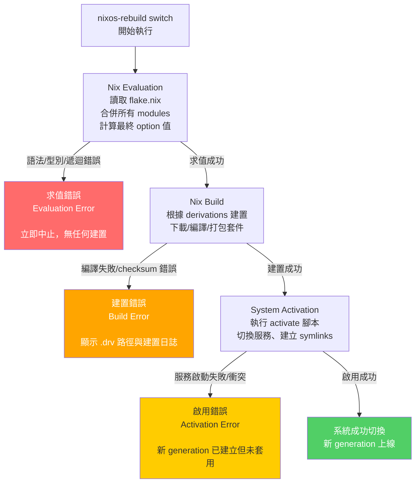
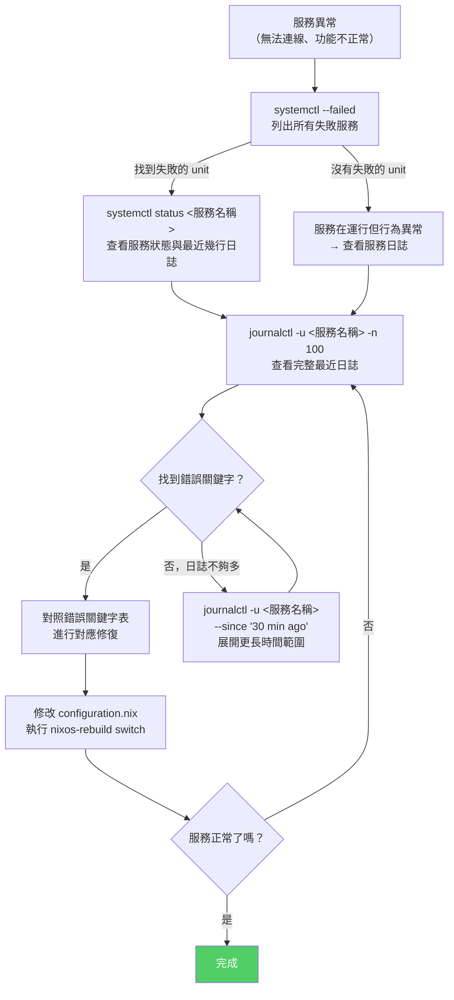
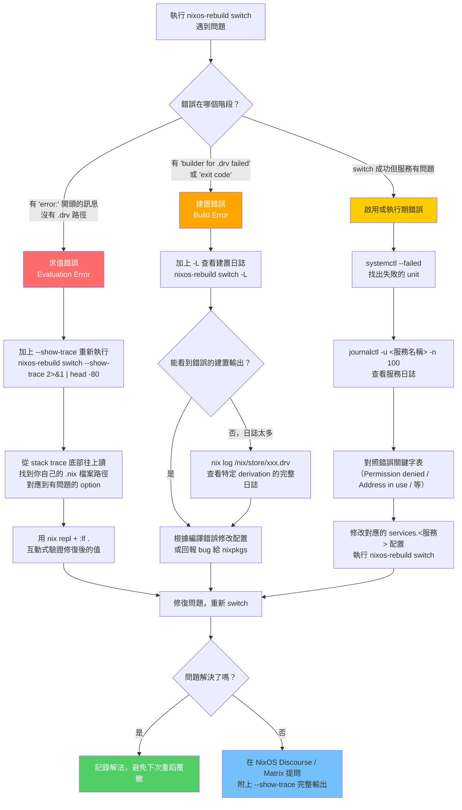

# 第26章：NixOS 除錯技巧

---

## 本章學習目標

完成本章後，你將能夠：

1. 區分求值錯誤（Evaluation Error）與建置錯誤（Build Error）的本質差異，選擇正確的除錯方向
2. 使用 `--show-trace` 展開完整錯誤調用鏈，並讀懂真實的 stack trace
3. 熟練操作 `nix repl` 互動式除錯環境，在 REPL 中載入 flake 並查詢配置值
4. 透過 `nixos-option` 與 `nix eval` 查詢 option 的實際合併值
5. 使用 `journalctl` 分析服務日誌，快速定位服務啟動失敗的根本原因

---

## 前置知識

閱讀本章前，建議已完成：

- 第五篇（Flakes 與新世代配置架構）
- 第24章（建置與部署流程）
- 對 `nixos-rebuild switch` 的基本流程有概念

---

## 26.1 Nix 錯誤的種類

NixOS 的錯誤並不都長得一樣。

你可能看過這樣的訊息：

```
error: infinite recursion encountered
```

也可能看過：

```
error: builder for '/nix/store/xxx-my-package.drv' failed with exit code 1
```

這兩種錯誤，根本原因不同，除錯方法也完全不同。

---

### 兩大核心分類

#### 第一類：求值錯誤（Evaluation Error）

求值錯誤發生在 Nix 語言本身的評估階段。

Nix 在執行 `nixos-rebuild` 時，會先把 `flake.nix` 和所有 `configuration.nix` 模組展開成一個大型的 attribute set。這個過程叫做「evaluation（求值）」。

如果這個過程失敗，就是求值錯誤。

常見原因：
- 語法錯誤（漏掉分號、括號不對稱）
- 型別錯誤（把字串傳給期望整數的 option）
- 無限遞迴（infinite recursion）
- attribute 不存在（`error: attribute 'foo' missing`）
- 模組衝突（兩個模組對同一 option 設定不相容的值）

求值錯誤的特徵：**在 derivation 被建立之前就失敗**，不會產生任何建置動作。

---

#### 第二類：建置錯誤（Build Error）

建置錯誤發生在 derivation 實際編譯或安裝的過程中。

求值成功後，Nix 會將配置翻譯成一系列的 derivation（建置描述），然後開始執行建置。這時才接觸實際的檔案系統、編譯器、網路。

如果這個過程失敗，就是建置錯誤。

常見原因：
- 套件原始碼編譯失敗
- 依賴函式庫版本不相容
- 網路下載失敗（找不到 tarball）
- checksum 不符
- 自訂 derivation 的建置腳本出錯

建置錯誤的特徵：**有具體的 `.drv` 路徑**，錯誤訊息通常包含 `/nix/store/xxx.drv`。

---

#### 第三類：啟用錯誤（Activation Error）

啟用錯誤是第三種情況，也是最容易被忽視的一種。

`nixos-rebuild switch` 的最後一個階段，是執行啟用腳本（activation script）：把新的系統 closure 套用到正在執行的系統上，包含建立 symlinks、執行 `systemctl daemon-reload`、啟動新服務等。

如果這個階段失敗，求值和建置都已成功，但系統沒有切換過去。

常見原因：
- 服務啟動失敗（配置值邏輯正確，但執行時才發現問題）
- 權限不足（activation script 需要 root 但執行環境有誤）
- 手動修改過的系統狀態與宣告式配置衝突

---

### 三個階段的視覺化

下圖說明三種錯誤在 NixOS 建構流程中的位置：



---

### 為什麼這三種錯誤需要不同的除錯方法？

因為它們的「根」在不同地方。

| 錯誤類型 | 除錯入口 | 主要工具 |
|---|---|---|
| 求值錯誤 | Nix 語言與模組配置 | `--show-trace`、`nix repl`、`nix eval` |
| 建置錯誤 | derivation 的建置環境 | `--print-build-logs`（`-L`）、`nix log`、`nix develop` |
| 啟用錯誤 | systemd 服務與 activation script | `journalctl`、`systemctl status`、`nixos-rebuild dry-activate` |

混淆這三種錯誤，是 NixOS 初學者最常見的卡關原因之一。

---

## 26.2 `--show-trace`：展開完整錯誤路徑

### 預設錯誤訊息的問題

執行 `sudo nixos-rebuild switch` 遇到錯誤時，預設輸出往往像這樣：

```
error: infinite recursion encountered
```

就這一行。沒有行號，沒有檔案名稱，完全不知道從哪裡開始查。

這是因為 Nix 預設只顯示最後一層的錯誤摘要，隱藏了導致這個錯誤的完整調用鏈。

---

### 加上 `--show-trace`

加上這個旗標，Nix 會展開完整的錯誤路徑：

```bash
sudo nixos-rebuild switch --show-trace 2>&1 | head -80
```

注意事項：
- `--show-trace` 輸出非常長，先用 `| head -80` 截取前段看清楚結構
- `2>&1` 是因為 Nix 的錯誤訊息輸出到 stderr，需要重新導向才能 pipe

---

### 搭配 `--print-build-logs`（`-L`）

`--print-build-logs` 旗標會顯示建置過程中每個 derivation 的標準輸出（stdout/stderr）。

這對建置錯誤特別有用，因為你可以直接看到編譯器或建置腳本輸出了什麼。

```bash
sudo nixos-rebuild switch --print-build-logs
# 縮寫形式
sudo nixos-rebuild switch -L
```

---

### 組合使用：同時對付求值與建置錯誤

```bash
sudo nixos-rebuild switch --show-trace -L 2>&1 | tee /tmp/nixos-rebuild.log
```

說明：
- `--show-trace`：展開求值錯誤的完整路徑
- `-L`：顯示建置日誌
- `tee /tmp/nixos-rebuild.log`：同時輸出到螢幕並存檔，方便事後翻閱

這是遇到任何不明錯誤時的標準起手式。

---

### 真實錯誤輸出範例：infinite recursion

假設你在 `flake.nix` 的 `specialArgs` 中傳遞了一個依賴自身的值，執行後看到：

```
error: infinite recursion encountered
(use '--show-trace' to show detailed location information)
```

加上 `--show-trace` 後的輸出（節錄）：

```
error: infinite recursion encountered

... while evaluating the attribute 'config.system.build.toplevel'

... while evaluating the attribute 'config.environment.etc'

... while evaluating the attribute 'config.security.pam.services'

... while evaluating 'config.security.pam.makeLoginConf'

... while calling the 'map' builtin
       at /nix/store/q8bv...-nixpkgs-25.05/lib/lists.nix:322:23:
          321|
          322|     map f list
          323|

... while evaluating anonymous lambda
       at /nix/store/q8bv...-nixpkgs-25.05/nixos/modules/security/pam.nix:1024:7:
         1023|
         1024|       loginConf =
         1025|

... while evaluating the attribute 'users'
       at /etc/nixos/users.nix:5:3:
            4|
            5|   users.users = builtins.listToAttrs (map (u: {
            6|

error: infinite recursion encountered
```

現在你知道問題出在 `/etc/nixos/users.nix` 的第 5 行，正在對 `users.users` 做某個引用自身的計算。

---

## 26.3 Stack Trace 閱讀技巧

### 從下往上讀

這是最重要的一個觀念：**stack trace 要從下往上讀**。

最底部是原始錯誤發生的位置，最上部是整個求值的入口點（通常是 `system.build.toplevel`）。

初學者常犯的錯誤是從第一行開始看，但第一行只告訴你「整個系統配置求值失敗」——這是結果，不是原因。

---

### 識別關鍵行：三種標記

#### 1. `while evaluating the attribute '...'`

告訴你 Nix 正在處理哪個 option 或 attribute。

```
... while evaluating the attribute 'config.services.nginx.virtualHosts'
```

這說明錯誤與 nginx 的 virtualHosts 配置有關。

#### 2. `at /nix/store/.../xxx.nix:行號:欄號`

這是最關鍵的資訊：告訴你錯誤發生的**確切檔案與行號**。

```
at /etc/nixos/services/nginx.nix:15:5:
     14|
     15|   services.nginx.virtualHosts = {
     16|
```

找到這行，就找到了問題的根源。

#### 3. `called from ...` 或 `while calling the '...' builtin`

告訴你誰呼叫了哪個函式。

```
... while calling the 'map' builtin
       at /nix/store/q8bv...-nixpkgs-25.05/lib/lists.nix:322:23:
```

這表示問題在 `map` 函式的執行過程中發生。

---

### 一個完整的 stack trace 逐行解析

以下是一個真實的 `attribute missing` 錯誤，完整 stack trace：

```
error: attribute 'hyprland' missing

... while evaluating the attribute 'config.home-manager.users.alice.wayland.windowManager'

... while evaluating the attribute 'config.home-manager.sharedModules'

... while evaluating the attribute 'config.system.build.toplevel'
       at /nix/store/q8bv...-nixpkgs-25.05/nixos/modules/system/activation/top-level.nix:7:5

... while evaluating 'config.home-manager.users'
       at /nix/store/yyy...-home-manager/nixos/default.nix:100:5

... while evaluating anonymous lambda
       at /etc/nixos/home/alice.nix:12:5:
           11|
           12|   wayland.windowManager.hyprland = {
           13|     enable = true;
           14|
```

逐行分析（**從下往上**）：

1. **`at /etc/nixos/home/alice.nix:12:5`** — 問題根源。你的 `alice.nix` 第 12 行在使用 `wayland.windowManager.hyprland`
2. **`while evaluating anonymous lambda`** — 在評估你定義的那個 Home Manager 配置函式
3. **`while evaluating 'config.home-manager.users'`** — Home Manager 的 NixOS 模組在合併使用者配置
4. **`while evaluating the attribute 'config.system.build.toplevel'`** — 最頂層，整個系統建構的入口

真正的錯誤原因：使用了 `wayland.windowManager.hyprland` 這個 option，但對應的 `hyprland` Home Manager 模組沒有被載入（可能忘記在 `inputs` 中引入 hyprland flake 或在 `sharedModules` 中匯入）。

---

### 可以安全忽略的噪音行

在 stack trace 中，你會看到大量來自 nixpkgs 內部的行，例如：

```
at /nix/store/q8bv...-nixpkgs-25.05/lib/fixedPoints.nix:12:14
at /nix/store/q8bv...-nixpkgs-25.05/lib/modules.nix:355:17
at /nix/store/q8bv...-nixpkgs-25.05/lib/lists.nix:322:23
```

這些行是 NixOS 模組系統本身的內部實作。**除非你在開發 nixpkgs 本身，否則這些行可以跳過**，專注於：

- 路徑包含你自己的配置目錄（`/etc/nixos/`、你的 flake 目錄）
- 行號前後的 code context 顯示你自己寫的 option

---

## 26.4 `nix repl`：互動式除錯

### 什麼是 nix repl？

`nix repl` 是 Nix 的互動式求值環境（Read-Eval-Print Loop）。

你可以在這裡直接輸入 Nix 表達式，立刻看到求值結果，而不需要修改配置檔再執行整個 `nixos-rebuild`。

這對於：
- 驗證一個 Nix 表達式是否產生預期的值
- 探索 nixpkgs 的套件結構
- 查詢你的 NixOS 配置的實際合併值

都非常有用。

---

### 啟動 nix repl

```bash
nix repl
```

你會看到：

```
Nix 2.24.x
Type :? for help.

nix-repl>
```

---

### 基本操作指令

在 `nix-repl>` 提示符後輸入：

| 指令 | 功能 |
|---|---|
| `:help` 或 `:?` | 顯示所有可用指令 |
| `:q` | 離開 repl |
| `:t <expression>` | 顯示表達式的型別（type） |
| `:p <expression>` | 完整展開（pretty-print）大型 attribute set，不截斷 |
| `:e <expression>` | 在 `$EDITOR` 中編輯表達式 |
| `:lf <path-or-url>` | 載入一個 flake（load flake） |
| `Tab` | 自動補全 attribute 名稱 |

---

### 基本求值練習

```
nix-repl> 1 + 1
2

nix-repl> "hello" + " world"
"hello world"

nix-repl> builtins.typeOf {}
"set"

nix-repl> builtins.typeOf []
"list"

nix-repl> builtins.typeOf 42
"int"

nix-repl> { name = "alice"; age = 30; }
{ age = 30; name = "alice"; }
```

---

### Tab 補全：探索 attribute set

Tab 補全是 `nix repl` 最強大的功能之一。

假設你想探索 `builtins` 有哪些函式：

```
nix-repl> builtins.<Tab>
builtins.add            builtins.attrNames      builtins.attrValues
builtins.baseNameOf     builtins.catAttrs       builtins.ceil
builtins.compareVersions  builtins.concatLists  builtins.concatMap
...（共幾十個）
```

或者探索一個 attribute set 的結構：

```
nix-repl> x = { services = { nginx = { enable = true; }; }; }

nix-repl> x.<Tab>
x.services

nix-repl> x.services.<Tab>
x.services.nginx

nix-repl> x.services.nginx.<Tab>
x.services.nginx.enable
```

這讓你不需要查文件就能探索一個複雜 attribute set 的所有欄位。

---

### 載入目前目錄的 flake

如果你的終端機目前在一個包含 `flake.nix` 的目錄下，可以這樣載入：

```bash
# 先進入你的配置目錄
cd /etc/nixos   # 或你的 flake 所在目錄
nix repl
```

```
nix-repl> :lf .
Added 12 variables.
```

`:lf .` 中的 `.` 代表目前目錄。載入後，flake 的所有 `outputs` 欄位都會成為 repl 的變數。

你可以立刻查詢：

```
nix-repl> outputs.<Tab>
outputs.nixosConfigurations

nix-repl> nixosConfigurations.<Tab>
nixosConfigurations.nixos
```

---

> **舊語法補充**：在舊版 Nix 或使用 channels 的環境中，可以直接執行 `nix repl nixpkgs`。在 flakes 環境中，標準做法是進入 repl 後執行 `:lf "github:NixOS/nixpkgs/nixos-25.05"`。

---

## 26.5 在 repl 中載入 nixpkgs 與配置

### 載入 nixpkgs 並查詢套件

載入 nixpkgs 後，可以查詢套件的相關資訊：

```
nix-repl> :lf "github:NixOS/nixpkgs/nixos-25.05"
Added 10 variables.

nix-repl> legacyPackages.x86_64-linux.git
«derivation /nix/store/xxx-git-2.50.0.drv»

nix-repl> legacyPackages.x86_64-linux.git.version
"2.50.0"

nix-repl> legacyPackages.x86_64-linux.git.meta.description
"Distributed version control system"
```

說明：
- `legacyPackages` 是 nixpkgs 在 flake outputs 中暴露套件的欄位名稱
- `x86_64-linux` 是目標平台，依你的機器架構調整
- 直接輸出 derivation 時顯示 `«derivation ...»`，後面加 `.version` 等欄位才能看到純文字值

---

### 在 repl 中載入你的 flake 並查詢系統配置

這是最強大的使用方式：直接在 repl 中探索你的整個系統配置的最終合併值。

```bash
cd /etc/nixos   # 進入你的 flake 目錄（包含 flake.nix 的目錄）
nix repl
```

```
nix-repl> :lf .
Added 12 variables.
```

接下來查詢各種配置值：

```
nix-repl> nixosConfigurations.nixos.config.services.nginx.enable
true

nix-repl> nixosConfigurations.nixos.config.networking.hostName
"nixos"

nix-repl> nixosConfigurations.nixos.config.users.users.alice.isNormalUser
true

nix-repl> nixosConfigurations.nixos.config.system.stateVersion
"25.05"
```

這些是**所有模組合併後的最終值**，不是任何單一 `.nix` 檔案中的值。這正是除錯「我設定了這個 option 但好像沒有生效」時最直接的驗證方式。

---

### 用 `:p` 完整展開大型 attribute set

NixOS 的 `config` 是一個非常大的 attribute set，直接查看的話很多地方會被截斷顯示為 `«...»`。

使用 `:p` 旗標可以完整展開：

```
nix-repl> nixosConfigurations.nixos.config.networking
{ ... }   # 只顯示頂層，不展開內部

nix-repl> :p nixosConfigurations.nixos.config.networking
{
  bridges = { };
  defaultGateway = null;
  defaultGateway6 = null;
  dhcpcd = { ... };
  enableIPv6 = true;
  firewall = {
    allowPing = true;
    allowedTCPPortRanges = [ ];
    allowedTCPPorts = [ ];
    allowedUDPPortRanges = [ ];
    allowedUDPPorts = [ ];
    enable = true;
    ...
  };
  hostName = "nixos";
  interfaces = { ... };
  nameservers = [ ];
  ...
}
```

注意：`:p` 展開非常大的 attribute set（如整個 `config`）可能會輸出數萬行。建議縮窄範圍，例如 `:p nixosConfigurations.nixos.config.services.nginx`，而非 `:p nixosConfigurations.nixos.config`。

---

> **進階技巧**：頻繁查詢同一主機時，建立縮寫變數可以減少輸入量：
> ```
> nix-repl> cfg = nixosConfigurations.nixos.config
> nix-repl> cfg.services.openssh.enable
> true
> nix-repl> cfg.networking.firewall.allowedTCPPorts
> [ 22 80 443 ]
> ```
> 若想查看某個 option 由哪個模組定義，可以查詢 `:p nixosConfigurations.nixos.options.services.nginx.enable.definedBy`。

---

## 26.6 Option 值查詢方法

### `nixos-option`：傳統查詢工具

`nixos-option` 是 NixOS 內建的指令行工具，專門用來查詢 option 的定義、目前值、預設值和說明。

基本用法：

```bash
nixos-option services.openssh.enable
```

輸出範例：

```
Value:
true

Default:
false

Example:
true

Description:
Whether to enable the OpenSSH secure shell daemon, which allows
secure remote logins.

Declared by:
  <nixpkgs/nixos/modules/services/openssh.nix>

Defined by:
  /etc/nixos/configuration.nix
```

輸出欄位說明：
- **Value**：目前系統配置的實際值（所有模組合併後）
- **Default**：option 的預設值（若未設定會是這個值）
- **Example**：文件中的使用範例
- **Description**：option 的功能說明
- **Declared by**：哪個 nixpkgs 模組定義了這個 option
- **Defined by**：哪個你的配置檔設定了這個值

---

再查詢一個更複雜的 option：

```bash
nixos-option boot.kernelPackages
```

輸出：

```
Value:
«derivation /nix/store/xxx-linux-6.6.50.drv»

Default:
«derivation /nix/store/yyy-linux-6.1.50.drv»

Description:
This option allows you to override the Linux kernel used by NixOS...
```

---

### `nixos-option` 在 Flakes 環境下的限制

`nixos-option` 預設讀取 `/etc/nixos/configuration.nix`，使用傳統 channel 模式。

如果你使用 Flakes，直接執行 `nixos-option` 可能會出現：

```
error: attribute 'nixosConfigurations' missing
```

或者查詢到的值是舊版配置（上次 switch 成功後的值），而不是你目前正在修改的配置。

---

**在 Flakes 環境中使用 `nixos-option` 的正確方式：**

對於已套用到系統的配置，`nixos-option` 仍然有效，因為系統啟用時會建立 `/run/current-system`。

如果你想查詢尚未套用的 flake 配置，建議改用 `nix eval`（見下節）。

---

### 用 `nix eval` 查詢 Flakes 配置值

`nix eval` 是 flakes 時代的標準查詢方式，可以直接評估任意 Nix 表達式：

```bash
# 查詢單一 option 值
nix eval .#nixosConfigurations.nixos.config.services.nginx.enable

# 輸出：true
```

更多範例：

```bash
# 查詢防火牆允許的 TCP 埠
nix eval .#nixosConfigurations.nixos.config.networking.firewall.allowedTCPPorts
# 輸出：[ 22 80 443 ]

# 查詢主機名稱
nix eval .#nixosConfigurations.nixos.config.networking.hostName
# 輸出："nixos"

# 以 JSON 格式輸出（方便用 jq 處理）
nix eval --json .#nixosConfigurations.nixos.config.networking.firewall
```

說明：
- `.` 代表目前目錄的 flake（需在 flake 目錄下執行）
- `#` 後面是 flake 的 attribute path
- `nixosConfigurations.nixos` 對應你在 `flake.nix` 中定義的主機名稱

---

> **小技巧**：`nix eval` 也能查詢 GitHub 上的 flake，無需 clone：`nix eval "github:alice/nixos-config#nixosConfigurations.nixos.config.services.nginx.enable"`。這在參考他人配置時非常方便。

對於需要交互探索（不確定 option 路徑、需要 Tab 補全）的情況，`nix repl` 配合 `:lf .` 更為靈活；對於腳本化或一次性查詢，`nix eval` 更簡潔。

---

## 26.7 journalctl：服務日誌分析

### 為什麼 journalctl 是服務除錯的核心工具？

在 NixOS 中，所有系統服務都由 systemd 管理。systemd 會收集每個服務的 stdout 和 stderr 輸出，存入一個稱為 journal（日誌）的結構化資料庫。

`journalctl` 是讀取這個資料庫的工具。當一個服務無法啟動或行為異常時，它的所有輸出都在 journal 裡，`journalctl` 是找到答案的第一個地方。

---

### 快速查看特定服務的日誌

```bash
# 查看 nginx 服務最近 30 分鐘的日誌
journalctl -u nginx.service --since "30 min ago"

# 查看最近 100 行
journalctl -u nginx.service -n 100

# 查看從特定時間點起的日誌
journalctl -u postgresql.service --since "2026-05-18 10:00"
```

選項說明：
- `-u <服務名稱>`：指定要查看的 systemd unit
- `--since "..."`：起始時間，支援自然語言如 `"1 hour ago"`、`"yesterday"`
- `-n <行數>`：顯示最後 N 行

---

### 即時追蹤日誌（類似 tail -f）

```bash
journalctl -u nginx.service -f
```

`-f` 旗標會讓 journalctl 持續輸出新的日誌行。這在你剛執行 `nixos-rebuild switch` 後想即時觀察服務啟動過程時非常有用。

```bash
# 在另一個終端機執行
sudo nixos-rebuild switch
# 同時在這個終端機觀察
journalctl -u nginx.service -f
```

---

### 按優先級過濾

systemd journal 使用標準的 syslog 優先級（0 = emerg, 3 = err, 6 = info, 7 = debug）。

```bash
# 只看錯誤（err 及以上）
journalctl -p err

# 只看特定服務的警告以上
journalctl -u postgresql.service -p warning

# 只看嚴重錯誤
journalctl -p crit
```

常用優先級關鍵字：
- `emerg`：緊急，系統無法使用
- `alert`：需要立即處理
- `crit`：嚴重錯誤
- `err`：錯誤（最常用的過濾起點）
- `warning`：警告
- `info`：一般資訊

---

### 查看開機日誌

```bash
# 本次開機的所有日誌
journalctl -b

# 上次開機的日誌（上次開機期間發生了什麼）
journalctl -b -1

# 上上次開機
journalctl -b -2

# 列出所有可查詢的開機紀錄
journalctl --list-boots
```

當你的系統在某次重啟後出現問題，`-b -1` 可以讓你查看上次開機的完整日誌。

---

### 系統整體健康狀態快速診斷

```bash
# 查看所有服務的整體狀態摘要
systemctl status

# 只看有問題的服務（failed 狀態）
systemctl --failed

# 查看特定服務的狀態（包含最近幾行日誌）
systemctl status nginx.service
```

`systemctl --failed` 是遇到「系統 `nixos-rebuild switch` 成功但感覺有東西壞了」時的第一個指令。

---

### 服務問題診斷流程



---

### 常見服務失敗模式與日誌關鍵字對應表

以下是最常見的 8 種服務啟動失敗模式，每種都有對應的日誌關鍵字和診斷方向：

| # | 日誌關鍵字 | 錯誤範例 | 可能原因 | 診斷方向 |
|---|---|---|---|---|
| 1 | `Permission denied` | `open("/var/lib/nginx/logs"): Permission denied` | 服務帳號沒有存取目錄的權限 | 檢查目錄擁有者（`ls -la`），確認 `services.<服務>.user` 設定，考慮 `systemd.tmpfiles` |
| 2 | `Address already in use` | `bind(): Address already in use: 0.0.0.0:80` | 指定的 port 已被其他程序佔用 | `ss -tulnp \| grep :80`，找出佔用的程序，可能是兩個服務同時監聽同一 port |
| 3 | `No such file or directory` | `config file "/etc/nginx/nginx.conf" not found` | 服務期待的設定檔或目錄不存在 | 確認路徑是否正確，使用 `systemd.tmpfiles` 建立必要目錄，檢查 `services.<服務>.configFile` |
| 4 | `Connection refused` | `connect to PostgreSQL: Connection refused` | 依賴的服務（如資料庫）尚未啟動或未監聽 | `systemctl status postgresql.service`，檢查服務依賴順序（`after`/`requires`）|
| 5 | `failed to load` / `syntax error` | `nginx: [emerg] unexpected "}" in /nix/store/xxx` | 服務配置語法錯誤 | 手動執行服務的設定檢查指令（如 `nginx -t`、`sshd -t`）|
| 6 | `Out of memory` / `OOM killed` | `Memory cgroup out of memory: Kill process` | 服務使用的記憶體超過系統限制 | `journalctl -k \| grep -i oom`，考慮增加 `systemd.services.<服務>.serviceConfig.MemoryMax` |
| 7 | `Failed to connect to bus` | `Failed to connect to system bus: No such file` | D-Bus 服務未啟動或 socket 不存在 | 確認 `services.dbus.enable = true`，在容器環境中常見 |
| 8 | `CERTIFICATE_VERIFY_FAILED` / `SSL` | `SSL certificate problem: certificate has expired` | TLS 憑證過期或路徑錯誤 | 檢查憑證有效期（`openssl x509 -in cert.pem -noout -dates`），確認 ACME 設定 |

---

> **Kernel 相關問題**：若懷疑問題與 kernel 模組有關，使用 `journalctl -k -p err` 查看 kernel 錯誤訊息，或 `journalctl -k | grep -i "oom\|killed"` 尋找記憶體不足事件。

---

## 26.8 nixos-rebuild 的詳細輸出模式

### 詳細輸出：`-v` 旗標

```bash
sudo nixos-rebuild switch -v
```

加上 `-v`（verbose）後，nixos-rebuild 會輸出更多關於建置進度的資訊，包含正在建置哪些 derivation。

---

### 建置日誌：`--print-build-logs`

```bash
sudo nixos-rebuild switch --print-build-logs
# 縮寫
sudo nixos-rebuild switch -L
```

使用 `-L` 後，每個 derivation 在建置時的 stdout/stderr 都會即時顯示到終端機。這對追蹤「套件建置失敗」特別有幫助。

不使用 `-L` 時，建置日誌會被靜默收集。失敗後才能用 `nix log` 查看：

```bash
# 查看特定 derivation 的建置日誌
nix log /nix/store/xxx-my-package.drv
```

---

### 模擬啟用：`dry-activate`

這是一個非常安全的選項：它會完成求值和建置，但**不實際切換系統**。

```bash
sudo nixos-rebuild dry-activate
```

輸出範例：

```
these 3 derivations will be built:
  /nix/store/xxx-my-package.drv
  /nix/store/yyy-system-units.drv
  /nix/store/zzz-nixos-system.drv
these paths will be fetched (10.23 MiB download, 45.67 MiB unpacked):
  /nix/store/aaa-some-dependency

would activate:
  start: postgresql.service
  restart: nginx.service
  stop: old-service.service
```

`dry-activate` 讓你在真正執行之前，看到：
- 需要建置哪些 derivation
- 哪些服務會被啟動、重啟或停止

這在生產環境中進行變更前，是重要的安全確認步驟。

---

### 查看啟用腳本的內容

每個 NixOS generation 都有一個 activation script，存放在 Nix store 中。

你可以查看它的內容來了解系統切換時會執行哪些操作：

```bash
# 查看目前系統的 activation script 路徑
ls -la /run/current-system/activate

# 查看 activation script 的實際內容
cat $(readlink -f /run/current-system/activate)
```

activation script 包含：
- 建立必要的系統目錄（`/var/lib/xxx`）
- 設定 `/etc` 下的設定檔 symlinks
- 執行 `systemctl daemon-reload`
- 重啟有變更的服務

---

### 查看系統依賴關係

```bash
# 查看目前系統 closure 的直接依賴
nix-store --query --references /run/current-system

# 查看完整的遞迴依賴（closure）—— 輸出很長
nix-store --query --requisites /run/current-system | wc -l

# 找出某個套件是被什麼依賴的
nix-store --query --referrers /nix/store/xxx-openssl-3.3.0
```

這些指令幫助你理解「為什麼我的系統 closure 這麼大」或「這個套件是誰引入的」。

---

### 查看 generation 歷史

```bash
# 列出所有系統 generation
nixos-rebuild list-generations

# 或者用 nix profile 的方式查看
nix profile history --profile /nix/var/nix/profiles/system
```

輸出範例：

```
   Generation 42 (current)
     NixOS 25.05.20260517.abc1234

   Generation 41
     NixOS 25.05.20260510.def5678

   Generation 40
     NixOS 25.05.20260501.ghi9012
```

---

### 回滾到上一個 generation

如果最新的 switch 導致問題，可以立刻回滾：

```bash
# 回滾到上一個 generation
sudo nixos-rebuild switch --rollback

# 或者指定特定 generation 號碼
sudo nix-env --switch-generation 41 -p /nix/var/nix/profiles/system
sudo /nix/var/nix/profiles/system/bin/switch-to-configuration switch
```

---

### 遠端建置除錯

如果你使用 colmena 或 deploy-rs 管理遠端主機，可以先在本機測試建置：

```bash
# 在本機建置但不 switch
sudo nixos-rebuild build --flake .#nixos

# 建置遠端主機的配置（在本機建置）
nixos-rebuild build --flake .#remote-server
```

建置成功的 result 會 symlink 到目前目錄的 `./result`：

```bash
ls -la ./result
# result -> /nix/store/xxx-nixos-system-25.05
```

這讓你在把配置推送到遠端之前，可以先確認本機能成功建置。

---

## 本章小結

本章從三個層次（求值、建置、啟用）系統性地介紹了 NixOS 的除錯方法。

主要工具整理：

| 工具 | 適用場景 | 最常用的旗標/子指令 |
|---|---|---|
| `--show-trace` | 求值錯誤，展開完整 stack trace | 搭配 `-L` 使用 |
| `nix repl` | 互動式驗證表達式、探索配置值 | `:lf .`、`:p`、Tab 補全 |
| `nix eval` | 非互動式查詢 flake 的 option 值 | `.#nixosConfigurations.nixos.config...` |
| `nixos-option` | 快速查詢 option 的定義與預設值 | 無特殊旗標（channel 環境） |
| `journalctl` | 服務日誌、啟動失敗診斷 | `-u`、`-f`、`-p err`、`-b` |
| `nixos-rebuild dry-activate` | 預覽變更，確認服務會如何受影響 | — |
| `systemctl --failed` | 快速找出失敗的服務 | — |

---

### NixOS 除錯決策樹

遇到任何問題時，依照這個流程逐步縮小範圍：



---

### 核心觀念回顧

三個最重要的除錯習慣：

1. **先確認錯誤類型**。是求值錯誤、建置錯誤還是啟用錯誤？不同類型要用不同工具，不要用求值除錯工具去追建置錯誤。

2. **Stack trace 從下往上讀**。最底部的行才是原始錯誤。找到你自己的 `.nix` 檔案路徑，那就是問題根源。

3. **用 `nix repl` 驗證假設**。在修改配置之前，先在 repl 中確認你的修改會產生預期的值，能大幅縮短「改了 → rebuild → 等待 → 還是錯」的循環。

---

### 下一章預告

第27章「升級策略」將介紹如何安全地進行 NixOS 版本升級（channel 更新、flake update、跨大版本遷移），以及如何在升級出問題時用 rollback 回到安全狀態。升級的除錯技巧與本章所學的工具高度重疊，但有一些升級特有的注意事項需要了解。
