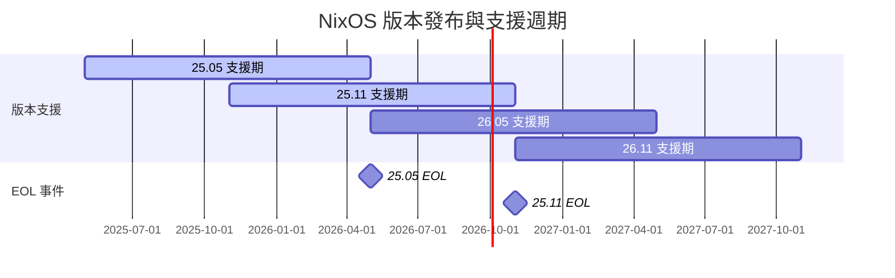
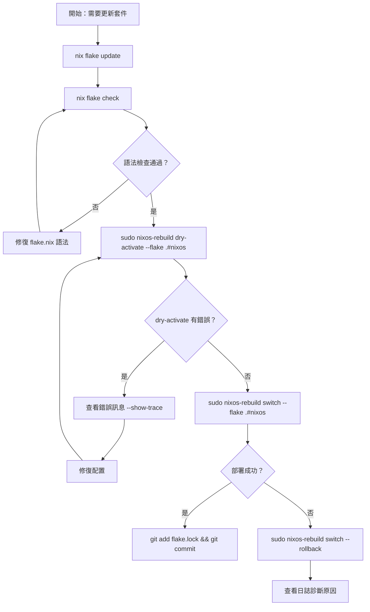
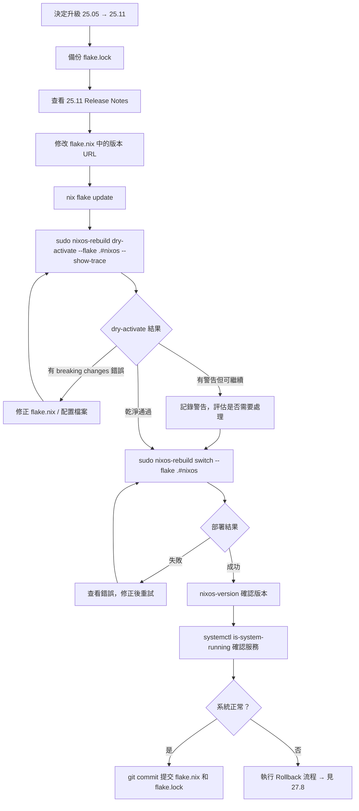
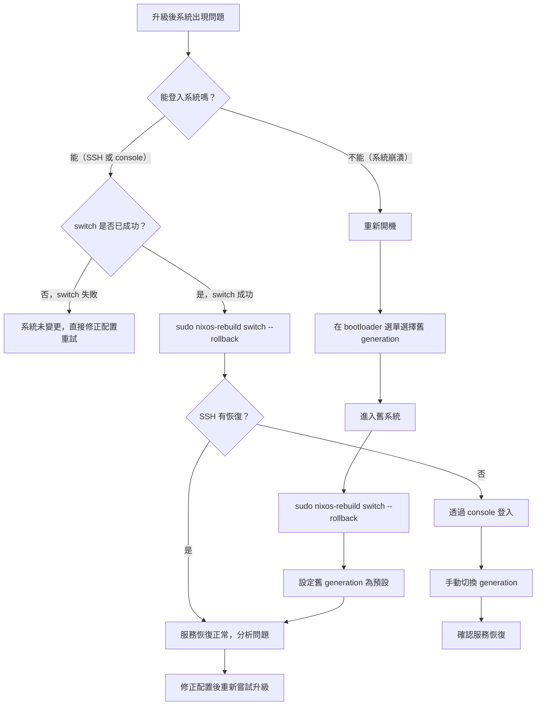

# 第27章：升級策略

## 本章學習目標

完成本章後，你將能夠：

1. 理解 NixOS 的發布節奏與版本支援週期
2. 安全地使用 `nix flake update` 更新 Flake 依賴
3. 執行 Major Release 升級（25.05 → 25.11）並應對 breaking changes
4. 正確理解 `system.stateVersion` 的用途，避免常見誤操作
5. 在升級失敗時，依據不同場景執行對應的 rollback 流程

---

## 前置知識

- 完成第26章（NixOS 除錯技巧）
- 熟悉 Flakes 基本操作（第五篇）
- 理解 NixOS generations 概念（第一篇）

---

## 27.1 NixOS 的發布節奏

### 穩定版本每年兩次

NixOS 採用固定的發布週期：

- **5月**發布：版本號 `YY.05`（例如 `25.05`）
- **11月**發布：版本號 `YY.11`（例如 `25.11`）

每個版本名稱由年份後兩位加月份組成。

`25.05` 代表 2025年5月發布的穩定版本。

### 支援週期

每個穩定版本的支援時間約為一年。

具體來說：當下下個版本發布時，當前版本正式結束支援（End of Life）。

舉例：

- `25.05` 在 `26.05` 發布後結束支援
- `25.11` 在 `26.11` 發布後結束支援

這意味著你有足夠的時間規劃升級，不必每半年都立即升版本。

### 版本發布與支援週期時間軸

以下圖表呈現從 25.05 到 26.11 的發布與支援週期：



### 三種 Channel 類型

在選擇要追蹤哪個版本時，你有三種選擇：

| Channel | 說明 | 建議對象 |
|---|---|---|
| `nixos-25.05` | 穩定版，僅收安全更新與重要修正 | 生產環境、初學者 |
| `nixos-25.11` | 穩定版（較新），同上 | 想使用較新套件的穩定用戶 |
| `nixpkgs-unstable` | 滾動更新，每日變動 | 進階用戶、開發者 |

本書統一使用穩定版策略。

追蹤 `nixpkgs-unstable` 的優缺點會在 27.9 詳細說明。

---

## 27.2 Channel 更新流程（非 Flakes）

> 如果你使用 Flakes 管理配置，可以直接跳到 **27.3**。
> 本節說明傳統 channel 方式，供尚未遷移 Flakes 的讀者參考。

### 查看目前使用的 Channel

```bash
sudo nix-channel --list
```

你會看到類似：

```text
nixos https://nixos.org/channels/nixos-25.05
```

這代表系統目前追蹤 `nixos-25.05` channel。

### 更新 Channel（套件更新，版本不變）

在同一個版本內，定期更新可以取得安全修補與套件更新：

```bash
# 更新 channel 的套件索引
sudo nix-channel --update

# 套用更新到系統
sudo nixos-rebuild switch
```

這個操作不會升級 NixOS 版本號，只會更新目前版本的套件。

### 升版本（例如 25.05 → 25.11）

要升級到新版本，先切換 channel 再更新：

```bash
# 切換到新版本的 channel
sudo nix-channel --add https://nixos.org/channels/nixos-25.11 nixos

# 確認已切換
sudo nix-channel --list

# 更新並套用
sudo nix-channel --update
sudo nixos-rebuild switch
```

### 傳統 Channel 方式的限制

Channel 方式存在幾個問題：

- 無法精確鎖定套件版本（缺乏 lock file）
- 不同機器可能因 channel 狀態不同而產生差異
- 無法輕易回溯到特定版本

這就是為什麼現代 NixOS 配置普遍轉向 Flakes。

---

## 27.3 `nix flake update`：更新 Flake 依賴

### 什麼是 `flake.lock`？

當你第一次執行 `nix flake update` 或 `nixos-rebuild switch --flake .#nixos` 時，Nix 會產生 `flake.lock` 檔案。

這個檔案記錄了每個 input 的精確 Git commit hash：

```json
{
  "nodes": {
    "nixpkgs": {
      "locked": {
        "lastModified": 1747123456,
        "narHash": "sha256-abc123...",
        "owner": "NixOS",
        "repo": "nixpkgs",
        "rev": "a1b2c3d4e5f6...",
        "type": "github"
      }
    }
  }
}
```

只要 `flake.lock` 沒有變動，任何時候、任何機器建構出的結果都會完全相同。

### 更新所有依賴

```bash
# 更新 flake.lock 中所有 input 到最新版本
nix flake update
```

這個指令會：

1. 查詢每個 input 的最新 commit
2. 更新 `flake.lock` 的對應記錄
3. 不會自動套用到系統（還需要 nixos-rebuild）

### 安全的更新工作流程

更新 `flake.lock` 之後，強烈建議先驗證再部署：

```bash
# Step 1：更新 lock file
nix flake update

# Step 2：靜態檢查配置語法
nix flake check

# Step 3：模擬套用（dry-activate 不會真的改變系統）
sudo nixos-rebuild dry-activate --flake .#nixos

# Step 4：確認無誤後正式部署
sudo nixos-rebuild switch --flake .#nixos
```

`dry-activate` 會列出將要套用的變更，讓你在實際切換前看清楚差異。

### 安全更新完整流程圖



### 提交 `flake.lock` 的重要性

更新完成後，務必將 `flake.lock` 提交到版本控制：

```bash
git add flake.lock
git commit -m "chore: update flake inputs (2026-05-18)"
```

`flake.lock` 是讓系統可重現的關鍵。

不提交 `flake.lock` 就等於放棄了 Flakes 帶來的確定性。

---

## 27.4 部分更新：只更新特定 Input

### 為什麼要部分更新？

全量更新（`nix flake update`）一次更新所有 input，有時會帶來預料外的變化。

部分更新讓你：

- 只更新需要更新的 input
- 一次只引入一個來源的變化
- 更容易追蹤「是哪個 input 造成問題」

### 只更新 nixpkgs

```bash
# 只更新 nixpkgs，其他 input 保持不動
nix flake update nixpkgs
```

### 只更新 home-manager

```bash
# 只更新 home-manager
nix flake update home-manager
```

### 確認更新了哪些版本

在更新 `flake.lock` 前後，使用 `git diff` 查看具體變化：

```bash
# 查看 flake.lock 的差異
git diff flake.lock
```

輸出範例：

```diff
-        "rev": "a1b2c3d4e5f6789012345678901234567890abcd",
+        "rev": "b2c3d4e5f6789012345678901234567890abcde1",
```

這讓你清楚知道 nixpkgs 從哪個 commit 更新到哪個 commit。

你也可以進一步查看兩個 commit 之間的 changelog：

```bash
# 在瀏覽器中查看 nixpkgs 的 commit 差異
# 將下面的 hash 替換成實際的 rev
echo "https://github.com/NixOS/nixpkgs/compare/a1b2c3d...b2c3d4e"
```

### 部分更新比全量更新更安全的原因

全量更新同時改變多個 input，若系統出問題：

- 很難判斷是 nixpkgs 版本、home-manager 版本還是其他 input 造成的
- 需要逐一 bisect 才能找到原因

部分更新每次只動一個變量：

- 問題出現時，原因範圍明確
- 可以快速確認或排除各個 input
- 對生產環境特別重要

### 推薦的部分更新順序

1. 先更新 `nixpkgs`，部署驗證
2. 確認穩定後，再更新 `home-manager`
3. 確認穩定後，再更新其他自訂 input

---

## 27.5 Major Release 升級流程（25.05 → 25.11）

Major Release 升級對許多人來說是最令人擔心的操作。

好消息是：NixOS 的設計讓這個過程比傳統 Linux 安全得多。

就算升級出問題，你隨時可以從 bootloader 選單回到舊版本。

以下是完整的升級步驟，按照順序執行：

### 升級前的 flake.nix 範例（25.05 版本）

假設 alice 的 `flake.nix` 目前是這樣：

```nix
{
  description = "alice 的 NixOS 配置";

  inputs = {
    nixpkgs.url = "github:NixOS/nixpkgs/nixos-25.05";

    home-manager = {
      url = "github:nix-community/home-manager/release-25.05";
      inputs.nixpkgs.follows = "nixpkgs";
    };
  };

  outputs = { self, nixpkgs, home-manager, ... }:
    let
      system = "x86_64-linux";
      pkgs = nixpkgs.legacyPackages.${system};
    in {
      nixosConfigurations.nixos = nixpkgs.lib.nixosSystem {
        inherit system;
        modules = [
          ./hosts/nixos/configuration.nix
          home-manager.nixosModules.home-manager
          {
            home-manager.useGlobalPkgs = true;
            home-manager.useUserPackages = true;
            home-manager.users.alice = import ./home/alice.nix;
          }
        ];
      };
    };
}
```

### Step 1：備份現有 `flake.lock`

在任何操作之前，先備份：

```bash
cp flake.lock flake.lock.backup-25.05
```

這個備份讓你在緊急時可以手動還原到升級前的狀態。

### Step 2：修改 `flake.nix` 中的版本 URL

將兩個 input 從 `25.05` 改為 `25.11`：

```nix
{
  description = "alice 的 NixOS 配置";

  inputs = {
    # 修改：nixos-25.05 → nixos-25.11
    nixpkgs.url = "github:NixOS/nixpkgs/nixos-25.11";

    home-manager = {
      # 修改：release-25.05 → release-25.11
      url = "github:nix-community/home-manager/release-25.11";
      inputs.nixpkgs.follows = "nixpkgs";
    };
  };

  outputs = { self, nixpkgs, home-manager, ... }:
    let
      system = "x86_64-linux";
      pkgs = nixpkgs.legacyPackages.${system};
    in {
      nixosConfigurations.nixos = nixpkgs.lib.nixosSystem {
        inherit system;
        modules = [
          ./hosts/nixos/configuration.nix
          home-manager.nixosModules.home-manager
          {
            home-manager.useGlobalPkgs = true;
            home-manager.useUserPackages = true;
            home-manager.users.alice = import ./home/alice.nix;
          }
        ];
      };
    };
}
```

注意：`system.stateVersion` **不需要修改**，這點非常重要（詳見 27.6）。

### Step 3：更新 `flake.lock`

```bash
nix flake update
```

這會下載 `nixos-25.11` 的最新套件索引，並更新 `flake.lock`。

第一次執行時，Nix 需要從網路拉取大量資料，可能需要幾分鐘。

### Step 4：查看 Release Notes

在實際建構之前，先了解 25.11 帶來了哪些 breaking changes：

```text
官方 Release Notes：
https://nixos.org/manual/nixos/stable/release-notes.html

nixpkgs changelog：
https://github.com/NixOS/nixpkgs/blob/nixos-25.11/nixos/doc/manual/release-notes/
```

特別注意 Release Notes 中標有 **Breaking Changes** 的部分。

常見的 breaking changes 包括：

- 某些 option 被重新命名（例如 `services.foo.bar` → `services.foo.baz`）
- 某些 option 的預設值改變
- 某些套件移除或改名
- 服務配置格式變更

### Step 5：模擬升級（dry-activate）

```bash
sudo nixos-rebuild dry-activate --flake .#nixos --show-trace
```

加上 `--show-trace` 可以在出錯時看到完整的錯誤路徑。

這個步驟不會改變任何系統設定，只是計算出「如果套用，會發生什麼」。

如果輸出中出現警告（warning）或棄用提示（deprecated），記下來準備處理。

### Step 6：修復 Breaking Changes

根據 dry-activate 的輸出和 Release Notes，修正配置中受影響的部分。

以一個假設的 breaking change 為例：

```nix
# 25.05 的舊寫法（25.11 已移除）
services.someService.oldOption = true;
```

```nix
# 25.11 的新寫法
services.someService.newOption = {
  enable = true;
};
```

修改後再次執行 dry-activate 確認：

```bash
sudo nixos-rebuild dry-activate --flake .#nixos --show-trace
```

反覆修正直到 dry-activate 乾淨通過。

### Step 7：正式部署

確認 dry-activate 無誤後，執行正式切換：

```bash
sudo nixos-rebuild switch --flake .#nixos
```

建構時間比平時更長是正常現象。

NixOS 需要下載並建構新版本的核心套件。

### Step 8：驗證升級結果

部署完成後，確認版本正確：

```bash
# 確認 NixOS 版本
nixos-version

# 應該輸出類似：
# 25.11.20251101.a1b2c3d (Vicuna)
```

確認核心服務正常：

```bash
systemctl is-system-running
```

確認 generations 歷史：

```bash
sudo nix-env --list-generations --profile /nix/var/nix/profiles/system
```

你應該看到新舊兩個 generation，確保有退路。

### Step 9：提交配置

升級成功後，提交所有變更：

```bash
git add flake.nix flake.lock
git commit -m "feat: upgrade NixOS 25.05 → 25.11

- 更新 nixpkgs input 到 nixos-25.11
- 更新 home-manager input 到 release-25.11
- 修正 [列出修正的 breaking changes]
- 升級成功，所有服務正常運行"
```

清楚的 commit message 讓未來的你（或同事）能快速理解升級內容。

### Major Upgrade 完整流程圖



---

## 27.6 `system.stateVersion` 的正確處理

### 這是最常見的誤解之一

許多初學者在升級版本後，直覺地把 `system.stateVersion` 一起改成新版本號。

> **警告：這樣做可能造成資料遷移問題或服務配置損壞。**

請記住這個規則：

> `system.stateVersion` 記錄的是「這台機器**最初安裝時**的 NixOS 版本」，
> 與你現在運行的版本**無關**。

### `system.stateVersion` 實際控制什麼？

`system.stateVersion` 影響的是「有狀態資料」的格式和預設值：

- 資料庫的初始化格式（例如 PostgreSQL 的 cluster 版本）
- 某些服務的預設配置路徑
- 特定 option 的預設值語義

NixOS 用這個值來決定「應該用哪個版本的格式來理解現有的資料目錄」。

### 修改 `stateVersion` 的正確時機

| 情況 | 是否修改 `stateVersion` |
|---|---|
| 升級 25.05 → 25.11 | **不修改** |
| 從備份還原到新機器 | **不修改**（沿用備份的值）|
| 全新安裝一台新機器 | 使用當前安裝版本號 |
| 重新安裝抹掉所有資料 | 使用當前安裝版本號 |

### 正確的配置範例

alice 在 2025年5月安裝了 NixOS 25.05。

升級到 25.11 之後，`stateVersion` 保持不變：

```nix
# /etc/nixos/hosts/nixos/configuration.nix

{ config, pkgs, ... }:

{
  imports = [
    ./hardware-configuration.nix
  ];

  networking.hostName = "nixos";

  time.timeZone = "Asia/Taipei";

  users.users.alice = {
    isNormalUser = true;
    extraGroups = [ "wheel" "networkmanager" ];
  };

  environment.systemPackages = with pkgs; [
    vim
    git
    curl
  ];

  # 這裡記錄的是「最初安裝時」的版本
  # 升級到 25.11 之後不需要修改這個值
  system.stateVersion = "25.05";
}
```

### 如果不小心修改了 `stateVersion` 怎麼辦？

如果你已經把 `stateVersion` 從 `"25.05"` 改成 `"25.11"` 並且套用了：

1. 如果系統服務（如資料庫）仍然正常運作，不用擔心
2. 如果某些服務出現格式錯誤，回到舊的 generation 並恢復 `stateVersion` 的值

正確做法是立刻把 `stateVersion` 改回來，再次執行 `sudo nixos-rebuild switch`。

---

## 27.7 升級前的檢查清單

養成習慣：每次升級前，依序確認以下項目。

| 檢查項目 | 確認指令 | 通過條件 |
|---|---|---|
| 系統服務全部正常 | `systemctl is-system-running` | 輸出 `running` 或 `degraded`（後者需確認哪個服務有問題）|
| Nix Store 空間足夠 | `df -h /nix` | 至少 10GB 可用空間 |
| 有多個可用 generation | `sudo nix-env --list-generations --profile /nix/var/nix/profiles/system` | 至少 2 個 generation |
| 沒有未提交的配置變更 | `git status` | 工作區乾淨（所有變更已提交）|
| 已查看目標版本 Release Notes | 手動確認 | 了解 breaking changes 清單 |
| 重要資料已備份 | 手動確認 | 資料庫、`/home` 等重要目錄有備份 |
| 測試環境驗證過 | 在 VM 或測試機執行完整流程 | 測試機升級成功且服務正常 |
| SSH 連線有備用方案 | 確認有 console / KVM 存取權 | 萬一 SSH 失效仍能操作主機 |

### 關於測試環境的建議

在正式機器升級之前，在虛擬機或第二台機器重演相同步驟是最保險的做法。

如果你沒有實體測試環境，可以使用 `nixos-rebuild build-vm`：

```bash
# 建立一個臨時 VM 測試升級後的配置
sudo nixos-rebuild build-vm --flake .#nixos

# 啟動 VM（需要安裝 QEMU）
./result/bin/run-nixos-vm
```

這個 VM 使用你的配置但不影響實際系統。

---

## 27.8 升級失敗的 Rollback 流程

NixOS 的 generation 機制讓 rollback 幾乎總是可行的。

下面按照「嚴重程度」分四個場景說明。

### 場景一：`nixos-rebuild switch` 本身就失敗了

這是最輕鬆的場景。

`switch` 如果在切換過程中出錯，系統會停留在原本的狀態不變。

你的 generation 沒有改變。

```bash
# 查看錯誤訊息（加上 --show-trace 取得完整路徑）
sudo nixos-rebuild switch --flake .#nixos --show-trace

# 修正配置後重試
# （參考第26章的除錯技巧）
```

### 場景二：`switch` 成功，但系統行為不正常

Switch 成功代表新的 generation 已經啟用。

但如果系統運作異常（服務崩潰、效能劣化等），可以立即切換回上一個 generation：

```bash
# 切換回上一個 generation
sudo nixos-rebuild switch --rollback
```

確認回滾成功：

```bash
# 確認目前 generation
sudo nix-env --list-generations --profile /nix/var/nix/profiles/system

# 確認版本
nixos-version
```

### 場景三：SSH 失效或無法遠端登入

這是讓許多人緊張的場景。

但只要你能透過 console（實體鍵盤或 KVM、VM console）登入，就能輕鬆解決。

**操作步驟：**

1. 透過 console 登入主機（或 VM 的終端機視窗）
2. 執行回滾：

```bash
# 列出所有可用 generation
sudo nix-env --list-generations --profile /nix/var/nix/profiles/system

# 切換到指定 generation（以 generation 42 為例）
sudo nix-env --switch-generation 42 --profile /nix/var/nix/profiles/system

# 套用（不用 switch，直接切換 generation）
sudo /nix/var/nix/profiles/system/bin/switch-to-configuration switch
```

或者直接使用 rollback：

```bash
sudo nixos-rebuild switch --rollback
```

3. 確認 SSH 服務恢復正常：

```bash
systemctl status sshd
```

### 場景四：系統開機後崩潰（無法進入系統）

這是最嚴重的場景，但也不是沒有解決方法。

NixOS 的 bootloader（GRUB 或 systemd-boot）會在開機選單列出所有可用的 generations。

**操作步驟：**

1. 重新開機，在 bootloader 選單停住

   - GRUB：開機時看到 GRUB 選單，按 `e` 或等待自動出現
   - systemd-boot：開機時按住 `Space` 鍵進入選單

2. 選擇舊的 generation

   選單中會列出類似：
   ```text
   NixOS - Default
   NixOS - generation 45 (2026-05-18)
   NixOS - generation 44 (2026-05-10)   ← 選擇這個
   NixOS - generation 43 (2026-04-20)
   ```

3. 進入系統後執行回滾，讓舊版本成為預設：

```bash
# 確認目前使用的 generation
nixos-version

# 設定這個 generation 為預設 boot 目標
sudo nixos-rebuild switch --rollback
```

4. 分析問題原因後再嘗試升級

### 緊急回滾決策樹



### 關鍵安心原則

只要你的 `/nix/store` 還有舊 generation 的資料，rollback 就一定有效。

NixOS 不會在升級時刪除舊的 generation（直到你手動執行 `nix-collect-garbage`）。

---

## 27.9 長期維護策略

升級不是一次性的任務，而是持續的系統維護工作。

建立良好的更新習慣，可以避免長期積累的風險。

### 建議的更新頻率

| 更新類型 | 建議頻率 | 說明 |
|---|---|---|
| Minor 更新（套件版本）| 每 1–3 個月 | `nix flake update nixpkgs` |
| Major Release 升級 | 每個新版本發布後 1–2 個月內 | 等社群回報 breaking changes 後再升 |
| 安全緊急更新 | 立即（收到 CVE 通知後） | 針對性更新 nixpkgs |

每 1–3 個月更新一次的頻率讓每次更新的變化量可控，既不會積累過多版本差距，也不會頻繁引入不穩定因素。

### 為什麼不建議長期停留在舊版本？

停在舊版本超過一年以上會面臨：

- 已知安全漏洞（CVE）無法修補
- 套件版本過舊，與新工具不相容
- 當版本 EOL 後，channel 不再更新
- 長期積累的版本差距讓單次升級風險大幅增加

定期更新讓每次升級的跨度小，問題更容易定位。

### 為什麼不建議追 `nixpkgs-unstable`？

`nixpkgs-unstable` 是滾動更新，每天都有大量 commit 進入。

追蹤 `nixpkgs-unstable` 的問題：

- 套件偶爾會在沒有警告的情況下發生 breaking changes
- 建構失敗（build failure）比穩定版更頻繁
- 難以確定「是哪個 commit 破壞了系統」
- 安全更新有時比穩定版還慢（沒有專門的 backport 流程）

建議：

- **個人開發環境的 devShell**：可以考慮追 `unstable`
- **系統配置（NixOS）**：使用穩定版

```nix
# 混合策略：系統使用穩定版，devShell 允許使用 unstable
{
  inputs = {
    nixpkgs.url = "github:NixOS/nixpkgs/nixos-25.11";          # 系統穩定版
    nixpkgs-unstable.url = "github:NixOS/nixpkgs/nixpkgs-unstable"; # devShell 用
  };
}
```

### 自動化安全更新

對於希望盡量減少手動操作的用戶，可以設定自動定期清理和簡單的更新提示：

```nix
# /etc/nixos/hosts/nixos/configuration.nix

{ config, pkgs, ... }:

{
  # 自動執行 Nix 垃圾回收（每週一次）
  nix.gc = {
    automatic = true;
    dates = "weekly";
    options = "--delete-older-than 30d";
  };

  # 自動最佳化 Nix Store（刪除重複檔案）
  nix.settings.auto-optimise-store = true;

  system.stateVersion = "25.05";
}
```

注意：自動垃圾回收會刪除舊的 generation。

建議設定 `--delete-older-than 30d`，保留最近 30 天的 generations 以確保 rollback 能力。

如果你想讓 flake.lock 的更新也自動化，可以設定 CI/CD（如 GitHub Actions）定期執行 `nix flake update` 並送出 Pull Request。

不過自動更新後仍需要人工 review 再合併，避免無人監控的更新破壞系統。

### 用 Git Commit Message 記錄升級歷史

每次升級都應該在 Git commit message 中記錄：

```bash
# Minor 更新範例
git commit -m "chore: update flake inputs (2026-05-18)

- nixpkgs: a1b2c3d → b2c3d4e（包含 curl 安全更新 CVE-XXXX-XXXX）
- home-manager: 無變動

測試：sudo nixos-rebuild dry-activate 通過，服務正常"

# Major 升級範例
git commit -m "feat!: upgrade NixOS 25.05 → 25.11

Breaking changes 處理：
- services.openssh 配置格式更新（見 release notes）
- postgresql 預設版本升至 17

升級時間：2025-12-01
驗證：所有服務正常，nixos-version 確認為 25.11"
```

清楚的升級記錄讓你在排查問題時能快速定位：「是哪次更新之後開始出問題的？」

### 建立升級後的驗證腳本

你可以在版本庫中準備一個簡單的驗證腳本，每次升級後執行：

```bash
#!/usr/bin/env bash
# scripts/post-upgrade-check.sh
# 升級後快速驗證腳本

set -euo pipefail

echo "=== NixOS 升級後驗證 ==="
echo ""

echo "--- 系統版本 ---"
nixos-version
echo ""

echo "--- 系統運行狀態 ---"
systemctl is-system-running || true
echo ""

echo "--- 關鍵服務狀態 ---"
for service in sshd NetworkManager; do
  status=$(systemctl is-active "$service" 2>/dev/null || echo "not-found")
  echo "  $service: $status"
done
echo ""

echo "--- Nix Store 空間 ---"
df -h /nix | tail -1
echo ""

echo "--- 最近的 Generations ---"
sudo nix-env --list-generations --profile /nix/var/nix/profiles/system | tail -5
echo ""

echo "=== 驗證完成 ==="
```

使用方式：

```bash
# 賦予執行權限
chmod +x scripts/post-upgrade-check.sh

# 升級後執行
./scripts/post-upgrade-check.sh
```

---

## 本章小結

本章涵蓋了 NixOS 升級的完整知識體系。

**核心觀念回顧：**

- NixOS 每年兩次穩定版發布（5月、11月），每個版本支援約一年
- Flakes 用戶應透過 `nix flake update` 更新，並善用 `flake.lock` 確保可重現性
- 部分更新（只更新特定 input）比全量更新更容易追蹤問題
- Major Release 升級的核心步驟：備份 → 查看 Release Notes → 改 URL → 更新 → dry-activate → 修正 → switch
- `system.stateVersion` 不是版本號，而是初始安裝記錄，**升級時絕對不要修改**
- 升級前做好檢查清單，升級失敗時按場景選擇對應的 rollback 方式
- 建議每 1–3 個月更新套件，每個 Major Release 在發布 1–2 個月後升版本

**NixOS 升級為什麼比傳統 Linux 更安全？**

因為：

- 升級是原子化的，要麼成功要麼回到原狀
- 舊 generation 在垃圾回收之前永遠保留在 Nix Store 中
- bootloader 選單讓你不需要任何工具就能回到任意舊版本
- dry-activate 讓你在不動系統的情況下預覽升級結果

只要養成「升級前備份、dry-activate 先跑、git 記錄每次更新」的習慣，升級就不再是需要擔心的事。

---

**下一章預告：第28章 常見陷阱與錯誤訊息速查**

第28章將整理 NixOS 新手最常遇到的錯誤訊息，以及對應的解決方法，幫助你快速定位問題。
