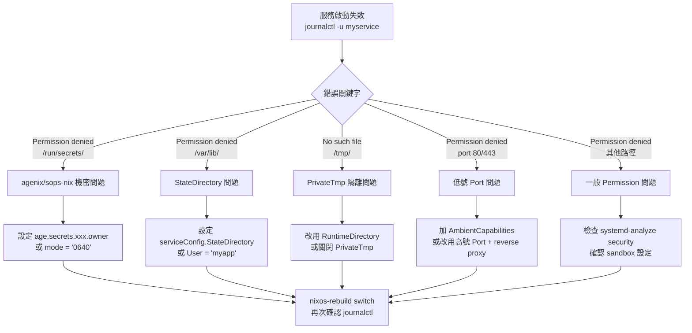
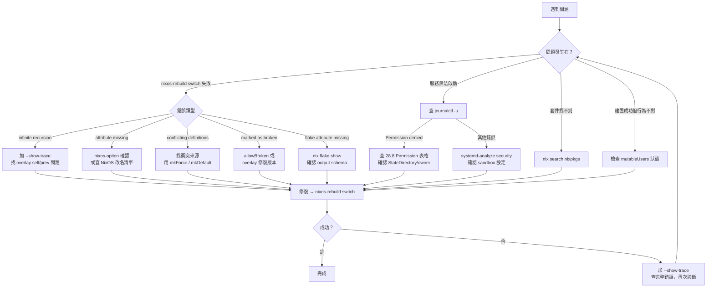

# 第28章：常見問題與陷阱

---

## 本章學習目標

完成本章後，你將能夠：

1. 識別 `infinite recursion` 的觸發原因，並利用 `--show-trace` 定位遞迴起點
2. 解決 `attribute missing` 問題，包括拼字錯誤、套件改名、缺少 import 三類情境
3. 使用 `lib.mkForce` 與 `lib.mkDefault` 解決多模組設定衝突（option conflict）
4. 處理 broken package 與編譯失敗，選擇最適合的修復策略
5. 診斷 systemd 服務的 Permission denied、mutableUsers 狀態衝突等系統級陷阱

---

## 前置知識

- 完成第26章（NixOS 除錯工具與技巧）
- 完成第27章（升級與遷移）
- 熟悉 `nixos-rebuild switch`、`journalctl`、Flakes 基本語法

---

## 章節說明

本章是**查詢手冊（Reference）**，而不是線性閱讀的教學章節。

建議的使用方式：

- 遇到具體錯誤時，**先看錯誤訊息的關鍵字**，對照本章節標題
- 每一節都遵循「症狀 → 原因 → 解法」三段結構，可以快速跳讀
- 「28.9 其他常見問題速查」提供最短路徑的解答，不需閱讀完整原因

> 如果你是第一次遭遇某個問題，建議完整閱讀對應節次；如果是老問題，直接看「解決方法」。

---

## 28.1 Infinite Recursion：無限遞迴

### 症狀

執行 `nixos-rebuild switch` 或 `nix build` 時，看到：

```
error: infinite recursion encountered
       at /nix/store/...-source/pkgs/top-level/all-packages.nix:1234:5
```

加上 `--show-trace` 後會看到更長的堆疊追蹤。

### 原因一：Overlay 中誤用 `final` 覆蓋自身

這是最常見的情境。

**錯誤的寫法（會無限遞迴）：**

```nix
# /etc/nixos/overlays/my-overlay.nix
final: prev: {
  # 錯誤：ffmpeg 呼叫 final.ffmpeg，
  # final.ffmpeg 又呼叫這段程式碼，無限循環
  ffmpeg = final.ffmpeg.override {
    withCuda = true;
  };
}
```

**正確的寫法（用 `prev` 取得原始套件）：**

```nix
# /etc/nixos/overlays/my-overlay.nix
final: prev: {
  # 正確：用 prev.ffmpeg 取得「覆蓋前」的版本
  ffmpeg = prev.ffmpeg.override {
    withCuda = true;
  };
}
```

`final` 與 `prev` 的區別：

- `prev`：套用此 overlay **之前**的套件集合（覆蓋的原始來源）
- `final`：套用所有 overlay **之後**的最終套件集合

覆蓋自己時使用 `final` → 永遠等待「之後」的自己完成 → 無限遞迴。


### 原因二：`config` 選項循環依賴

**錯誤範例：**

```nix
# /etc/nixos/modules/my-module.nix
{ config, lib, ... }:
{
  options.my.enableFeature = lib.mkOption {
    type = lib.types.bool;
    # 錯誤：default 參照 config.my.enableFeature 本身
    default = config.my.enableFeature;
  };
}
```

**正確做法：使用靜態預設值，或參照其他 option：**

```nix
{ config, lib, ... }:
{
  options.my.enableFeature = lib.mkOption {
    type = lib.types.bool;
    default = false;  # 靜態預設值，無循環
  };

  options.my.enableAdvanced = lib.mkOption {
    type = lib.types.bool;
    # 參照「不同」的 option 是允許的
    default = config.my.enableFeature;
  };
}
```

### 如何用 `--show-trace` 找遞迴起點

```bash
# 加上 --show-trace 取得完整堆疊
sudo nixos-rebuild switch --show-trace 2>&1 | head -60

# 在 flake 環境中
nix build .#nixosConfigurations.nixos.config.system.build.toplevel \
  --show-trace 2>&1 | head -60
```

閱讀輸出的技巧：

- 找第一個出現**兩次**的檔案路徑和行號，那就是遞迴的進入點
- 通常第一個 `at` 指向的位置比最後一個更有參考價值

---

## 28.2 Attribute Missing：找不到屬性

### 症狀

```
error: attribute 'xyz' missing
       at /etc/nixos/configuration.nix:15:5
```

或：

```
error: undefined variable 'xyz'
       at /etc/nixos/configuration.nix:22:18
```

### 原因一：Option 名稱拼字錯誤

**錯誤範例：**

```nix
{ config, pkgs, ... }:
{
  # 錯誤：services.openssh 少了 d
  services.openssh.enable = true;   # ← 正確
  services.openssh.pemritRoot = "no";  # ← 拼錯，正確是 permitRootLogin
}
```

**診斷方法：用 `nixos-option` 確認 option 名稱：**

```bash
# 查詢 option 是否存在
nixos-option services.openssh.permitRootLogin

# 輸出範例（存在時）：
# Value:
#   "prohibit-password"
# Default:
#   "prohibit-password"
# Description:
#   ...

# 輸出範例（不存在時）：
# error: attribute 'pemritRoot' missing
```

**用 `nix repl` 探索 option tree：**

```bash
nix repl '<nixpkgs/nixos>'

# 在 repl 中
nix-repl> config.services.openssh.<Tab>   # 按 Tab 補全，看有哪些屬性
```

### 原因二：套件在 nixpkgs 中不存在或已改名

**症狀：**

```nix
environment.systemPackages = with pkgs; [
  google-chrome  # error: attribute 'google-chrome' missing
];
```

**診斷方法：用 `nix search` 找正確名稱：**

```bash
# 搜尋套件
nix search nixpkgs google-chrome

# 輸出：
# * legacyPackages.x86_64-linux.google-chrome (xxx.xxx)
#   Google Chrome browser

# 注意：套件名稱可能有連字號（-）差異
# google-chrome vs googleChrome vs google_chrome
```

**NixOS 25.05 常見的改名清單：**

| 舊名稱 | 新名稱 | 影響版本 |
|---|---|---|
| `hardware.opengl` | `hardware.graphics` | 25.05 起 |
| `services.xserver.layout` | `services.xserver.xkb.layout` | 24.05 起 |
| `boot.cleanTmpDir` | `boot.tmp.cleanOnBoot` | 23.05 起 |
| `services.kubernetes.*` | 部分選項結構重組 | 24.11 起 |
| `programs.steam.enable` | 未改名，但需 `hardware.graphics.enable` 支援 | 25.05 起 |

**遇到改名時的完整修復流程：**

```bash
# 步驟 1：確認舊 option 是否仍然存在
nixos-option hardware.opengl.enable

# 步驟 2：用 grep 找新名稱的說明
nix-instantiate --eval -E \
  '(import <nixpkgs/nixos> {}).options.hardware.graphics' \
  --strict --json 2>/dev/null | python3 -m json.tool | grep -A3 description

# 步驟 3：更新 configuration.nix
```

**更新後的配置範例：**

```nix
# /etc/nixos/configuration.nix
{ config, pkgs, ... }:
{
  system.stateVersion = "25.05";

  # NixOS 25.05 起：hardware.opengl 已改名為 hardware.graphics
  hardware.graphics = {
    enable = true;
    enable32Bit = true;
  };
}
```

### 原因三：Option 需要額外 import

有些 option 定義在非預設載入的模組中。

**範例：**

```bash
# 錯誤：找不到 home-manager 的 option
error: attribute 'home-manager' missing
```

**解法：確保相關模組已 import：**

```nix
# /etc/nixos/configuration.nix
{ config, pkgs, ... }:
{
  system.stateVersion = "25.05";

  imports = [
    ./hardware-configuration.nix
    # 必須 import home-manager 模組，才能使用 home-manager 的 options
    <home-manager/nixos>
  ];

  home-manager.users.alice = { pkgs, ... }: {
    home.stateVersion = "25.05";
    home.packages = with pkgs; [ htop ];
  };
}
```

---

## 28.3 Option Conflict：多個模組設定衝突

### 症狀

```
error: The option `services.nginx.enable' has conflicting definition values:
- In `/etc/nixos/modules/webserver.nix': true
- In `/etc/nixos/modules/reverse-proxy.nix': false
Use `lib.mkForce value' or `lib.mkDefault value' to change the priority of the definition.
```

### 原因

Bool、String、Int 等**純量類型（scalar types）**的 option，當多個模組都用 `=` 直接設定同一個值時，NixOS 不知道哪個優先，就會回報衝突。

> **注意：List 類型不會衝突**，NixOS 會自動合併所有模組的 list。

### 衝突情境示範

**模組 A（webserver.nix）：**

```nix
# /etc/nixos/modules/webserver.nix
{ config, lib, ... }:
{
  services.nginx.enable = true;   # ← 衝突點
  services.nginx.virtualHosts."alice.example.com" = {
    root = "/var/www/alice";
  };
}
```

**模組 B（reverse-proxy.nix）：**

```nix
# /etc/nixos/modules/reverse-proxy.nix
{ config, lib, ... }:
{
  services.nginx.enable = false;  # ← 衝突點（與上面不同值）
  services.nginx.virtualHosts."proxy.example.com" = {
    locations."/" = {
      proxyPass = "http://127.0.0.1:8080";
    };
  };
}
```

### 解法一：用 `lib.mkDefault` 設定「可被覆蓋的預設值」

適合在「通用模組」中使用，讓使用者可以在上層覆蓋：

```nix
# /etc/nixos/modules/webserver.nix
{ config, lib, ... }:
{
  # mkDefault：優先度低，可被其他模組覆蓋
  services.nginx.enable = lib.mkDefault true;
}
```

```nix
# /etc/nixos/modules/reverse-proxy.nix
{ config, lib, ... }:
{
  # 不加 mkDefault/mkForce → 預設優先度，會覆蓋 mkDefault
  services.nginx.enable = false;
}
```

結果：`false` 勝出（因為它的優先度高於 `mkDefault`）。

### 解法二：用 `lib.mkForce` 強制覆蓋

適合在「最終配置」中，確保某個值一定生效：

```nix
# /etc/nixos/configuration.nix
{ config, lib, pkgs, ... }:
{
  system.stateVersion = "25.05";

  imports = [
    ./modules/webserver.nix      # 設 enable = mkDefault true
    ./modules/reverse-proxy.nix  # 設 enable = false
  ];

  # mkForce：最高優先度，無論其他模組怎麼設定，這個值一定生效
  services.nginx.enable = lib.mkForce true;
}
```

### 優先度層級（由低到高）

```
lib.mkDefault (priority 1000)
  ↓ 一般賦值 = (priority 100)
    ↓ lib.mkForce (priority 50)
      ↓ lib.mkForce (lib.mkForce ...) (priority 10)
```

數字越小，優先度越高。`mkForce` 的數字最小，所以優先度最高。

### 如何找出衝突來源

用 `nixos-option` 的 `files` 欄位查看所有設定此 option 的檔案：

```bash
# 查詢是哪些檔案設定了 services.nginx.enable
nixos-option services.nginx.enable

# 輸出範例：
# Value:
#   true
# Default:
#   false
# Files defining this option:
#   /etc/nixos/modules/webserver.nix
#   /etc/nixos/modules/reverse-proxy.nix
# Description:
#   ...
```

---

## 28.4 Broken Package：套件建置失敗

### 症狀一：套件被標記為 broken

```
error: Package 'hello-2.12' in /nix/store/...-source/pkgs/by-name/he/hello/package.nix:1:1
       is marked as broken, refusing to evaluate.

       a) To temporarily allow broken packages, you can set { allowBroken = true; }
          in your nixpkgs config.
       b) For `nixos-rebuild` you can set:
            { nixpkgs.config.allowBroken = true; }
```

### 症狀二：真正的編譯失敗（build error）

```
error: builder for '/nix/store/xxx-my-package-1.0.drv' failed with exit code 1;
       last 10 log lines:
       > make: *** [Makefile:42: all] Error 1
       > ./src/main.c:15:10: fatal error: missing-header.h: No such file or directory
       ...
       For full logs, run 'nix log /nix/store/xxx-my-package-1.0.drv'.
```

### 處理「marked as broken」的策略

四個選項，依優先順序：

**選項 A：overlay 提供修復版本（最推薦）：**

```nix
# /etc/nixos/configuration.nix
{ pkgs, ... }:
{
  system.stateVersion = "25.05";
  nixpkgs.overlays = [
    (final: prev: {
      some-broken-package = prev.some-broken-package.overrideAttrs (old: {
        # 只是標記問題：關閉 broken 標記
        meta = old.meta // { broken = false; };
        # 或替換 source 為有修復的版本
        # src = prev.fetchFromGitHub { owner = "..."; rev = "fix-sha"; hash = "..."; };
      });
    })
  ];
  environment.systemPackages = with pkgs; [ some-broken-package ];
}
```

**選項 B：允許 broken（不建議用於生產環境）：** `nixpkgs.config.allowBroken = true;`

**選項 C：改用替代套件：** `nix search nixpkgs <功能關鍵字>`

**選項 D：查 nixpkgs issue tracker：** `https://github.com/NixOS/nixpkgs/issues?q=<套件名稱>`

### 處理真正的編譯失敗

```bash
# 取得完整 build log
nix build .#myPackage --print-build-logs

# 進入失敗套件的 build 環境，手動重現錯誤
nix develop /nix/store/xxx-my-package-1.0.drv
genericBuild

# 或用 nix-shell 重現
nix-shell '<nixpkgs>' -A some-broken-package
configurePhase && buildPhase
```

---

## 28.5 Impurity 問題

### 症狀

配置在 alice 的機器可以正常建置，在另一台機器失敗；或每次 `nix build` 的結果都不同。

```
error: the path '/home/alice/my-config.txt' does not exist
```

或更隱晦的：同樣的 flake，不同機器 build 出不同結果。

### 原因一：使用了時間相關的 builtins

**錯誤範例：**

```nix
# 不純：每次 build 時間不同
{ pkgs, ... }:
{
  environment.etc."build-time.txt".text = builtins.toString builtins.currentTime;
}
```

**正確做法：改用 git commit hash 或固定字串：**

```nix
# 在 flake.nix 中傳入 git revision
{
  outputs = { self, nixpkgs }: {
    nixosConfigurations.nixos = nixpkgs.lib.nixosSystem {
      modules = [
        ({ ... }: {
          # 使用 flake 的 git revision（固定值）
          environment.etc."build-rev.txt".text =
            self.rev or "dirty";
        })
      ];
    };
  };
}
```

### 原因二：讀取了 flake 管理範圍外的檔案

**錯誤範例：**

```nix
# 不純：讀取 flake 外部的檔案
{ ... }:
{
  services.nginx.virtualHosts = builtins.fromJSON
    (builtins.readFile /home/alice/vhosts.json);  # ← 外部路徑
}
```

**正確做法：改用相對路徑（flake 內部），讓 Nix 追蹤：**

```nix
{
  services.nginx.virtualHosts = builtins.fromJSON
    (builtins.readFile ./vhosts.json);  # ← 相對路徑，納入 Nix store
}
```

### 原因三：IFD（Import From Derivation）問題

IFD 指在 evaluation 階段 import 一個需要先 build 的 derivation 輸出。

```
error: cannot build '/nix/store/xxx.drv' during evaluation
       because the option 'allow-import-from-derivation' is not enabled
```

**解法：** 臨時允許 `nix build .#myTarget --allow-import-from-derivation`；長期解法是重構配置，改用 `pkgs.runCommand` 在 build phase 處理，避免 evaluation 階段依賴 build 結果。

### 原因四：Home directory 路徑寫死

**錯誤範例（不純）：** 直接在模組中寫死 `/home/alice`，其他機器使用者名稱不同就會失敗。

**正確做法：** 用 NixOS option 傳入，讓每台機器自行設定：

```nix
# /etc/nixos/modules/user-config.nix
{ config, lib, ... }:
{
  options.my.userName = lib.mkOption { type = lib.types.str; };

  config.environment.etc."gitconfig".text = ''
    [user]
      name = ${config.my.userName}
      home = /home/${config.my.userName}
  '';
}
```

```nix
# /etc/nixos/configuration.nix（各機器各自設定）
{ ... }:
{
  system.stateVersion = "25.05";
  imports = [ ./modules/user-config.nix ];
  my.userName = "alice";  # ← 每台機器可以不同
}
```

---

## 28.6 Flakes 相容性問題

### 症狀一：flake 不提供指定的 attribute

```
error: flake 'github:someuser/somerepo' does not provide attribute
       'packages.x86_64-linux.default'
```

### 症狀二：non-flake 依賴引入失敗

```
error: input 'my-dependency' has unsupported type 'tarball'
       or the repository does not have a flake.nix
```

### 問題一：non-flake 依賴的正確引入方式

**錯誤的寫法（假設對方是 flake）：**

```nix
# flake.nix
{
  inputs = {
    some-non-flake = {
      url = "github:someuser/non-flake-repo";
      # ↑ 會嘗試讀取對方的 flake.nix，失敗
    };
  };
}
```

**正確的寫法（標記為非 flake）：**

```nix
# flake.nix
{
  inputs = {
    some-non-flake = {
      url = "github:someuser/non-flake-repo";
      flake = false;  # ← 關鍵：告知 Nix 這不是 flake
    };
  };

  outputs = { self, nixpkgs, some-non-flake }: {
    nixosConfigurations.nixos = nixpkgs.lib.nixosSystem {
      system = "x86_64-linux";
      modules = [
        ({ pkgs, ... }: {
          system.stateVersion = "25.05";

          # 使用 non-flake source（it's just a path）
          environment.systemPackages = [
            (pkgs.callPackage "${some-non-flake}/default.nix" {})
          ];
        })
      ];
    };
  };
}
```

### 問題二：output schema 不同（`packages` vs `legacyPackages`）

**查看 flake 提供哪些 output：**

```bash
# 查看 flake 的所有 output
nix flake show github:someuser/somerepo

# 輸出範例：
# github:someuser/somerepo/main
# ├───packages
# │   └───x86_64-linux
# │       ├───default: package 'hello-2.12'
# │       └───myTool: package 'my-tool-1.0'
# └───nixosModules
#     └───default: NixOS module
```

**根據查到的 schema 調整引用方式：**

```nix
# 如果提供 packages.x86_64-linux.default
inputs.somerepo.packages.${system}.default

# 如果提供 legacyPackages（如 nixpkgs 本身）
inputs.nixpkgs.legacyPackages.${system}.hello
```

### 問題三：`follows` 導致版本不相容

`follows` 讓兩個 input 共用同一個版本，但某些工具（如 home-manager）對 nixpkgs 版本有嚴格要求。

**錯誤範例：**

```nix
# flake.nix
{
  inputs = {
    nixpkgs.url = "github:NixOS/nixpkgs/nixos-25.05";

    home-manager = {
      url = "github:nix-community/home-manager/release-24.11";  # ← 版本不符
      inputs.nixpkgs.follows = "nixpkgs";  # 強制用 25.05，但 HM 要 24.11
    };
  };
}
```

**正確做法：確保版本對齊：**

```nix
# flake.nix
{
  inputs = {
    nixpkgs.url = "github:NixOS/nixpkgs/nixos-25.05";

    home-manager = {
      # home-manager release 與 nixpkgs 版本對齊
      url = "github:nix-community/home-manager/release-25.05";
      inputs.nixpkgs.follows = "nixpkgs";  # 安全：版本一致
    };
  };

  outputs = { self, nixpkgs, home-manager }: {
    nixosConfigurations.nixos = nixpkgs.lib.nixosSystem {
      system = "x86_64-linux";
      modules = [
        home-manager.nixosModules.home-manager
        ({ ... }: {
          system.stateVersion = "25.05";
          home-manager.useGlobalPkgs = true;
          home-manager.useUserPackages = true;
        })
      ];
    };
  };
}
```

---

## 28.7 mutableUsers 造成的狀態衝突

### 症狀

執行 `nixos-rebuild switch` 成功，但使用者密碼或群組設定沒有更新。或者，設定在 `configuration.nix` 的 `hashedPassword` 沒有生效。

### 理解 mutableUsers

NixOS 的使用者管理有兩種模式：

| 模式 | 設定 | 行為 |
|---|---|---|
| mutable（預設） | `users.mutableUsers = true` | 允許手動修改 /etc/passwd，宣告式設定在「建立時」或「衝突時」才套用 |
| immutable | `users.mutableUsers = false` | 完全由 configuration.nix 控制，每次 switch 都強制套用 |

### 場景一：hashedPassword 沒有生效

**症狀：** 在 `configuration.nix` 設定了 `hashedPassword`，但用舊密碼仍然可以登入。

**原因：** `mutableUsers = true`（預設）時，`/etc/shadow` 中的手動修改比 `hashedPassword` 優先。

**解法：區分 `hashedPassword` 與 `initialHashedPassword`：**

```nix
# /etc/nixos/configuration.nix
{ config, pkgs, lib, ... }:
{
  system.stateVersion = "25.05";

  users.users.alice = {
    isNormalUser = true;
    home = "/home/alice";
    extraGroups = [ "wheel" "networkmanager" ];

    # initialHashedPassword：只在帳號「第一次建立時」套用
    # 之後手動改密碼不受影響
    # initialHashedPassword = "$y$j9T$...";

    # hashedPassword：每次 nixos-rebuild switch 都強制套用
    # 注意：這會覆蓋手動設定的密碼
    hashedPassword = "$y$j9T$xxxxxxxxxxxxxxxxxxxxxxxxxxxxxxx";
  };
}
```

**生成 hashedPassword 的方法：**

```bash
# 方法一：用 mkpasswd（推薦）
mkpasswd -m yescrypt
# 輸入密碼後，複製輸出的 hash 字串

# 方法二：用 openssl
openssl passwd -6 -salt $(openssl rand -base64 6)
```

### 場景二：改成 `mutableUsers = false` 後鎖定自己

**症狀：** 設定 `users.mutableUsers = false` 後，沒有在 configuration.nix 設定密碼，導致無法登入。

**從此情境復原的步驟：**

```
步驟 1：重開機，在 bootloader 選「上一個世代」（older generation）
         → GRUB 選單中選擇前一個可以登入的版本

步驟 2：登入後，修改 configuration.nix
         → 加入 hashedPassword 或還原 mutableUsers = true

步驟 3：重新 switch
```

**或者，不重開機的緊急修復：**

```bash
# 臨時設定密碼（mutableUsers = false 時，這種方式不會持久）
# 但如果仍可以用 root 登入：
sudo passwd alice

# 然後立刻修改 configuration.nix 並 switch
sudo nano /etc/nixos/configuration.nix
sudo nixos-rebuild switch
```

### 場景三：群組設定沒有生效

**症狀：** 在 `configuration.nix` 把 alice 加入 `docker` 群組，但 `groups` 指令看不到。

**原因與解法：**

```nix
# /etc/nixos/configuration.nix
{ config, pkgs, ... }:
{
  system.stateVersion = "25.05";

  # 確保 docker 群組被宣告式建立
  virtualisation.docker.enable = true;

  users.users.alice = {
    isNormalUser = true;
    extraGroups = [
      "wheel"
      "docker"  # ← 加入 docker 群組
    ];
  };
}
```

```bash
# switch 之後，需要重新登入（或重開機）群組才會生效
# 驗證：
groups alice  # 或重新登入後執行 groups
```

---

## 28.8 Permission 問題與 systemd 服務

### 症狀

服務啟動失敗，`journalctl -u myservice` 顯示：

```
Permission denied
No such file or directory
Operation not permitted
```

### 常見 Permission 問題速查表

| 錯誤訊息 | 可能原因 | 解決方法 |
|---|---|---|
| `/run/secrets/myapp Permission denied` | agenix/sops-nix 機密的 owner 未設定 | `age.secrets.myapp.owner = "myapp";` |
| `/var/lib/myapp Permission denied` | StateDirectory 未設定，目錄 owner 不對 | `serviceConfig.StateDirectory = "myapp";` |
| `/tmp/myapp.sock No such file or directory` | PrivateTmp 隔離，/tmp 被替換 | 改用 `serviceConfig.RuntimeDirectory = "myapp";` |
| `socket /run/myapp.sock Permission denied` | Socket 群組設定錯誤 | `serviceConfig.SocketGroup = "myapp";` |
| `/etc/myapp/config.conf Permission denied` | 配置檔 mode 不正確 | `environment.etc."myapp/config.conf".mode = "0640";` |
| `bind: Permission denied` on port < 1024 | 非 root 服務嘗試綁定低號 port | `serviceConfig.AmbientCapabilities = "CAP_NET_BIND_SERVICE";` |

### 完整的 Permission 問題診斷流程



### 服務 Permission 配置要點範例

以下摘錄 systemd 服務中與 permission 最相關的設定：

```nix
# /etc/nixos/modules/myapp-service.nix（permission 關鍵部分）
{ config, lib, pkgs, ... }:
{
  # 1. 建立專屬系統使用者（服務不應以 root 執行）
  users.users.myapp = { isSystemUser = true; group = "myapp"; };
  users.groups.myapp = {};

  # 2. agenix 機密：owner 必須與服務使用者一致
  age.secrets.myapp-db-password = {
    file = ./secrets/myapp-db-password.age;
    owner = "myapp";   # ← 對應 serviceConfig.User
    mode = "0400";
  };

  systemd.services.myapp = {
    wantedBy = [ "multi-user.target" ];
    serviceConfig = {
      User = "myapp";
      Group = "myapp";
      # StateDirectory → /var/lib/myapp，owner 自動設為 myapp
      StateDirectory = "myapp";
      StateDirectoryMode = "0750";
      # RuntimeDirectory → /run/myapp（取代 /tmp，避免 PrivateTmp 問題）
      RuntimeDirectory = "myapp";
      # 若需綁定 80/443 等低號 port
      # AmbientCapabilities = "CAP_NET_BIND_SERVICE";
      NoNewPrivileges = true;
      ProtectSystem = "strict";
      ExecStart = "${pkgs.myapp}/bin/myapp --data-dir /var/lib/myapp";
    };
  };
}
```

### 診斷 systemd 隔離設定

```bash
# 查看服務的 security 設定分析
systemd-analyze security myapp.service

# 查看服務的實際執行環境
systemctl show myapp.service | grep -E "^(User|Group|StateDirectory|RuntimeDirectory)"

# 查看詳細的錯誤訊息
journalctl -u myapp.service -n 50 --no-pager

# 查看 /run/myapp 的 permission
ls -la /run/myapp/

# 查看 /var/lib/myapp 的 permission
ls -la /var/lib/myapp/
```

---

## 28.9 其他常見問題速查

### Q1：`nixos-rebuild switch` 非常慢，如何加速？

**原因：** 未設定 binary cache，需從頭編譯。

```nix
# /etc/nixos/configuration.nix
{ ... }:
{
  system.stateVersion = "25.05";
  nix.settings = {
    substituters = [ "https://cache.nixos.org" "https://nix-community.cachix.org" ];
    trusted-public-keys = [
      "cache.nixos.org-1:6NCHdD59X431o0gWypbMrAURkbJ16ZPMQFGspcDShjY="
      "nix-community.cachix.org-1:mB9FSh9qf2dCimDSUo8Zy7bkq5CX+/rkCWyvRCUSeBw="
    ];
    max-jobs = "auto";
    cores = 0;
  };
  # 定期自動清理舊世代，減少下次 build 時間
  nix.gc = { automatic = true; dates = "weekly"; options = "--delete-older-than 14d"; };
  nix.settings.auto-optimise-store = true;
}
```

### Q2：Nix Store 磁碟空間滿了，如何清理？

```bash
# 刪除所有舊世代並清理（最有效）
sudo nix-collect-garbage -d

# 只刪除超過 30 天的世代（較保守）
sudo nix-collect-garbage --delete-older-than 30d

# 查看 store 使用量
du -sh /nix/store
```

預防：在 `configuration.nix` 設定 `nix.gc.automatic = true` 搭配 `nix.settings.auto-optimise-store = true`（見 Q1 範例）。

### Q3：忘記 root 密碼，如何重設？

三種方式（任選一種）：

1. **GRUB 單人模式**：開機時按 `e` 編輯，在 `linux` 行尾加 `init=/bin/sh`，開機後執行 `mount -o remount,rw / && passwd root && reboot -f`
2. **NixOS Live USB**：用 installer 開機 → `mount /dev/sdaX /mnt` → `nixos-enter --root /mnt` → `passwd alice`
3. **舊世代（NixOS 特有）**：GRUB 選舊世代登入 → 修改 `configuration.nix` 加入 `hashedPassword` → `sudo nixos-rebuild switch`

### Q4：WiFi 密碼如何宣告式管理？

使用 `networking.wireless.networks`（wpa_supplicant）：

```nix
# /etc/nixos/configuration.nix
{ config, ... }:
{
  system.stateVersion = "25.05";
  networking.wireless = {
    enable = true;
    # 推薦：從加密檔讀取，避免明文入 git
    environmentFile = config.age.secrets.wifi-env.path;
    networks."MyHomeWiFi".psk = "@HOME_WIFI_PSK@";  # environmentFile 替換
  };
  age.secrets.wifi-env.file = ./secrets/wifi.env.age;
}
```

不用 secrets 時，也可直接寫 `psk = "my-password"`（不建議 commit 到 git）。

### Q5：`nix develop` 後找不到工具？

**原因：** 開發用工具應放在 `packages`，不是 `buildInputs`（後者用於 C 函式庫 header）。

```nix
# flake.nix（devShell 片段）
devShells.x86_64-linux.default = nixpkgs.legacyPackages.x86_64-linux.mkShell {
  packages = with nixpkgs.legacyPackages.x86_64-linux; [
    git curl jq python3 nodejs  # ← 開發工具放 packages
  ];
  buildInputs = with nixpkgs.legacyPackages.x86_64-linux; [
    openssl zlib                 # ← 編譯時 C 函式庫放 buildInputs
  ];
};
```

```bash
# 確認工具是否在 PATH 中
nix develop
which python3  # 或 echo $PATH | tr ':' '\n' | grep nix
```

---

## 本章小結

本章涵蓋了 NixOS 使用者最常遭遇的八大類問題，以及五個快速查詢情境。

**核心診斷原則：**

1. **先看錯誤訊息**：Nix 的錯誤訊息通常包含檔案名稱和行號，是診斷的起點
2. **加 `--show-trace`**：遇到 evaluation 錯誤，這個選項能提供更深的堆疊資訊
3. **用 `journalctl -u <service>`**：服務相關問題一定要看完整 log
4. **用 `nixos-option`**：確認 option 名稱與定義來源

**NixOS 問題診斷決策樹：**



**各節重點複習：**

| 節次 | 問題 | 關鍵解法 |
|---|---|---|
| 28.1 | Infinite Recursion | overlay 用 `prev` 而非 `final` 覆蓋自身 |
| 28.2 | Attribute Missing | `nixos-option` 確認名稱，查改名清單 |
| 28.3 | Option Conflict | `lib.mkForce` / `lib.mkDefault` 調整優先度 |
| 28.4 | Broken Package | overlay 提供修復版，或 `allowBroken`（謹慎） |
| 28.5 | Impurity | 避免 `currentTime`，用參數傳入可變資訊 |
| 28.6 | Flakes 相容性 | non-flake 加 `flake = false`，版本要對齊 |
| 28.7 | mutableUsers 衝突 | 理解 `hashedPassword` vs `initialHashedPassword` |
| 28.8 | Permission 問題 | `StateDirectory`、`age.secrets.owner` 正確設定 |

---

## 延伸閱讀

- NixOS Manual - 錯誤訊息參考：https://nixos.org/manual/nixos/stable/
- nixpkgs issue tracker（查套件狀態）：https://github.com/NixOS/nixpkgs/issues
- Nix Pills - Overlay 深入說明：https://nixos.org/guides/nix-pills/
- 第26章：NixOS 除錯工具與技巧
- 第27章：升級與遷移策略
