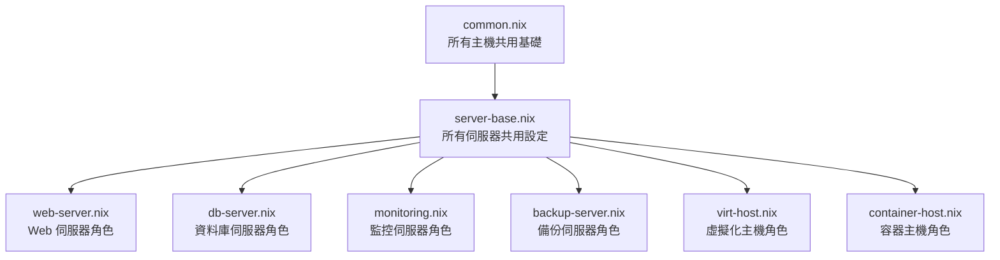
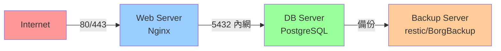
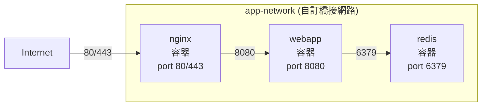
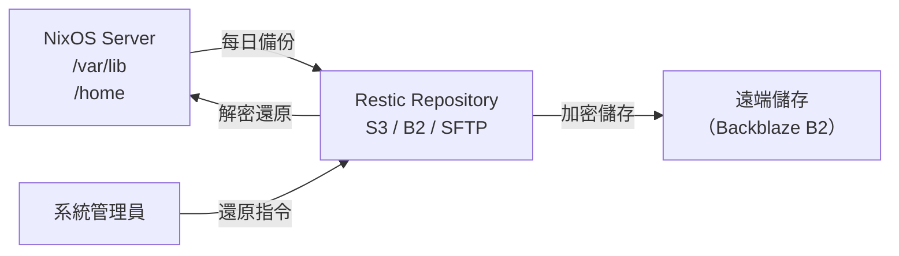
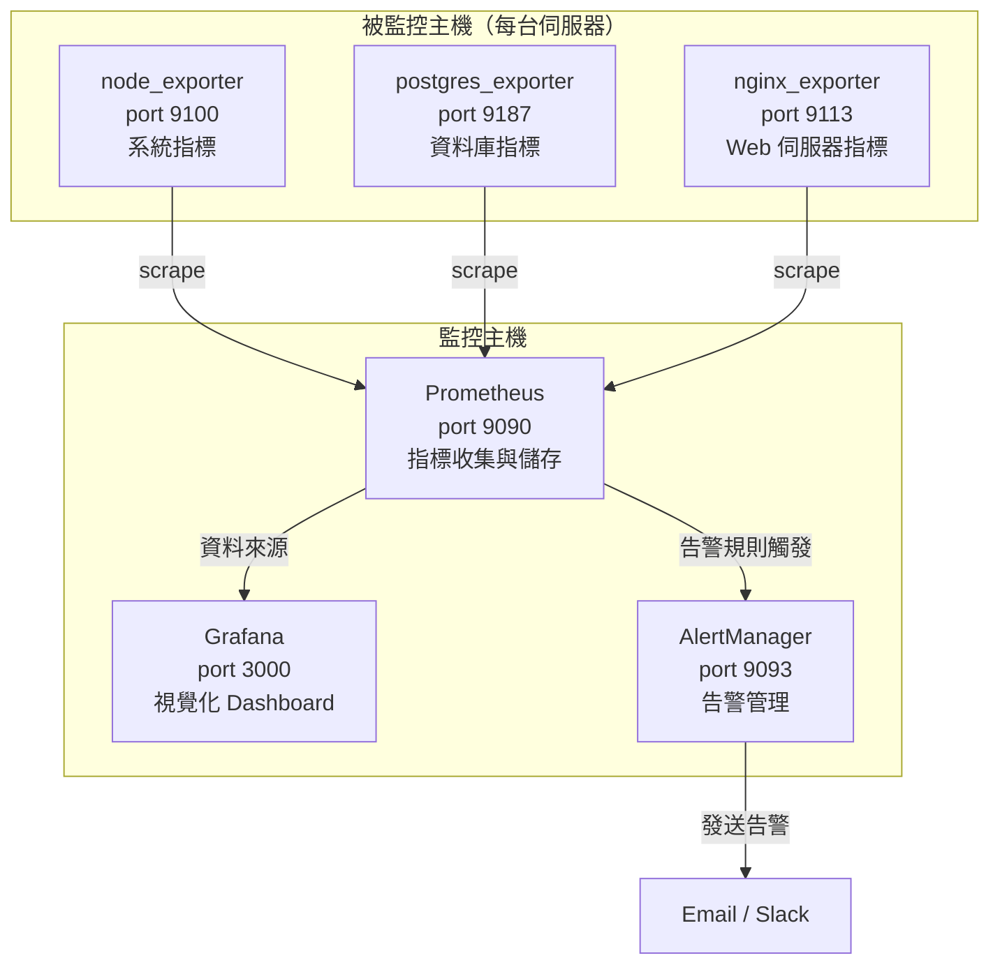

# 第29章：伺服器配置模式

本章進入企業級 NixOS 的核心主題：**如何將不同職責的伺服器系統化地用 profile 管理**。

你在前幾篇學到了模組化設計、Flakes 架構、多主機管理。

現在，我們把這些能力組合起來，設計出真實伺服器環境會用到的配置模式。

---

## 本章學習目標

完成本章後，你將能夠：

1. 設計以最小化原則為核心的伺服器 profile 架構
2. 建立完整的 Web Server profile（Nginx + TLS + Let's Encrypt）
3. 配置 PostgreSQL Database Server 並實作自動備份
4. 建立 Virtualization Host（KVM/QEMU + libvirtd）
5. 使用 `virtualisation.oci-containers` 宣告式管理多容器服務
6. 實作 restic 或 BorgBackup 備份方案並驗證還原流程
7. 建立最小可用的 Prometheus + Grafana 監控整合

---

## 前置知識

學習本章之前，請確認你已掌握：

- 第5章：`imports` 機制與模組化設計
- 第7章：NixOS Module System
- 第14章：Docker/Podman 容器配置
- 第20章：`profiles/` 概念與多主機架構
- 第21章：自訂 NixOS Module 開發

---

## 29.1 Profile 設計模式

### 回顧：profile 是什麼？

第20章介紹了 `profiles/` 目錄的概念。

Profile 是一組**有主題、可重複使用**的配置集合。

例如：`profiles/desktop.nix` 包含桌面環境、字型、聲音。

伺服器場景中，我們用同樣的模式設計不同伺服器角色。

### 最小化原則

伺服器 profile 設計有一條黃金規則：

**只安裝這台伺服器實際需要的服務。**

傳統 Linux 管理員常會安裝「可能有用」的工具。

在 NixOS 中，這個習慣是反效果的：

- 增加 attack surface（攻擊面）
- 浪費 Nix Store 空間
- 讓 profile 的職責模糊化

正確做法是：每個 profile 只啟用自己職責內的服務。

### Profile 繼承架構

實際的企業環境中，profile 通常分為三層：



各層的職責如下：

| 層級 | 檔案 | 職責 |
|---|---|---|
| 第一層 | `common.nix` | 時區、locale、基本工具、SSH |
| 第二層 | `server-base.nix` | 防火牆、`deploy` 使用者、日誌管理、安全更新 |
| 第三層 | `web-server.nix` | Nginx、TLS、憑證 |
| 第三層 | `db-server.nix` | PostgreSQL、備份 |
| 第三層 | `monitoring.nix` | Prometheus、Grafana |

### server-base.nix 範例

在進入各角色 profile 之前，先建立所有伺服器共用的基礎層。

`profiles/server-base.nix` 的設計目標：最小化共用設定，讓角色 profile 能安全繼承。

```nix
# profiles/server-base.nix
{ config, pkgs, lib, ... }:

{
  # 伺服器共用：所有伺服器都需要一個專用的部署使用者
  users.users.deploy = {
    isNormalUser = true;
    # deploy 使用者只透過 SSH 金鑰登入，不設密碼
    hashedPassword = "!";
    # 加入 wheel 讓 deploy 可以執行 nixos-rebuild
    extraGroups = [ "wheel" ];
    openssh.authorizedKeys.keys = [
      # 在此填入你的 CI/CD 系統的 SSH 公鑰
      "ssh-ed25519 AAAA... deploy@ci"
    ];
    shell = pkgs.bash;
  };

  # 伺服器共用：SSH 安全設定
  services.openssh = {
    enable = true;
    settings = {
      # 禁止 root 直接登入
      PermitRootLogin = "no";
      # 禁止密碼登入，只允許金鑰
      PasswordAuthentication = false;
      # 限制認證嘗試次數
      MaxAuthTries = 3;
    };
  };

  # 伺服器共用：基本防火牆（角色 profile 各自開放所需 port）
  networking.firewall = {
    enable = true;
    # 只預設開放 SSH
    allowedTCPPorts = [ 22 ];
  };

  # 伺服器共用：系統日誌持久化
  services.journald.extraConfig = ''
    SystemMaxUse=2G
    MaxRetentionSec=30day
  '';

  # 伺服器共用：自動安全更新（只更新安全補丁，不自動重啟）
  system.autoUpgrade = {
    enable = true;
    # 使用 nixos-25.05 的安全更新
    flake = "github:NixOS/nixpkgs/nixos-25.05";
    # 每天凌晨 4 點檢查更新
    dates = "04:00";
    # 不自動重啟（等人工確認）
    allowReboot = false;
  };

  # 伺服器共用：基本監控工具（非 Prometheus，只是本機診斷用）
  environment.systemPackages = with pkgs; [
    htop
    iotop
    nmap
    tcpdump
    curl
    jq
    git
  ];

  system.stateVersion = "25.05";
}
```

這個 `server-base.nix` 繼承後，角色 profile 只需要聚焦在自己的職責。

---

## 29.2 Web Server Profile（Nginx + TLS + Let's Encrypt）

### 設計目標

一個標準的 Web Server profile 需要：

1. 啟用 Nginx 並設定安全 header
2. 自動取得和更新 TLS 憑證（Let's Encrypt）
3. 強制 HTTP → HTTPS redirect
4. 開放防火牆 80 和 443

### 關於 Let's Encrypt Rate Limit

**重要：先用 staging 環境測試！**

Let's Encrypt 有嚴格的 rate limit：

- 每個 domain 每週最多 5 張正式憑證
- 測試錯誤配置會浪費這個額度

正確流程：

1. 先設定 `security.acme.server` 指向 staging 環境
2. 確認憑證取得流程正常
3. 移除 staging 設定，改為正式環境

staging ACME server URL：
`https://acme-staging-v02.api.letsencrypt.org/directory`

### 完整的 web-server.nix

```nix
# profiles/web-server.nix
{ config, pkgs, lib, ... }:

{
  # ── 防火牆：開放 HTTP 和 HTTPS ──────────────────────────────
  networking.firewall.allowedTCPPorts = [ 80 443 ];

  # ── Let's Encrypt ACME 設定 ────────────────────────────────
  security.acme = {
    # 必須同意 Let's Encrypt 的服務條款
    # 未設定此選項，nixos-rebuild switch 會失敗
    acceptTerms = true;

    # 設定聯絡 email（憑證即將過期時 Let's Encrypt 會通知）
    defaults.email = "admin@example.com";

    # 開發/測試時使用 staging，避免消耗正式 rate limit
    # 確認流程正確後，將這行整個移除
    # defaults.server = "https://acme-staging-v02.api.letsencrypt.org/directory";
  };

  # ── Nginx 主服務設定 ────────────────────────────────────────
  services.nginx = {
    enable = true;

    # 建議的效能與安全性設定
    recommendedGzipSettings = true;
    recommendedOptimisation = true;
    recommendedProxySettings = true;
    recommendedTlsSettings = true;

    # 全域安全 header（適用於所有 virtual host）
    appendHttpConfig = ''
      # 防止點擊劫持（Clickjacking）
      add_header X-Frame-Options "SAMEORIGIN" always;

      # 防止 MIME sniffing
      add_header X-Content-Type-Options "nosniff" always;

      # 啟用 XSS 過濾
      add_header X-XSS-Protection "1; mode=block" always;

      # 嚴格傳輸安全（HSTS）：強制瀏覽器只用 HTTPS
      # max-age=31536000 代表一年
      add_header Strict-Transport-Security "max-age=31536000; includeSubDomains" always;

      # Referrer 政策
      add_header Referrer-Policy "strict-origin-when-cross-origin" always;
    '';

    # ── 虛擬主機設定 ─────────────────────────────────────────
    virtualHosts = {

      # 主要 domain：www.example.com
      "www.example.com" = {
        # 讓 NixOS 自動處理 Let's Encrypt 憑證
        # 等同於設定 ssl_certificate 和 ssl_certificate_key
        enableACME = true;

        # 強制所有 HTTP 流量 redirect 到 HTTPS
        forceSSL = true;

        # 根目錄（靜態網站）
        root = "/var/www/example.com";

        locations."/" = {
          # 嘗試直接提供檔案，找不到就回傳 404
          tryFiles = "$uri $uri/ =404";
        };
      };

      # 如果有 API 後端，可以加入 proxy 設定
      "api.example.com" = {
        enableACME = true;
        forceSSL = true;

        locations."/" = {
          # 轉發到本機的 backend 服務
          proxyPass = "http://127.0.0.1:8080";
          # proxyWebsockets 開啟後支援 WebSocket
          proxyWebsockets = true;
        };
      };

      # HTTP -> HTTPS redirect（不設 SSL，只做 redirect）
      # 當 forceSSL = true 時，NixOS 會自動產生這個 vhost
      # 這裡列出只是說明 NixOS 背後做了什麼
    };
  };

  # ── 靜態網站目錄（確保目錄存在）──────────────────────────────
  systemd.tmpfiles.rules = [
    "d /var/www/example.com 0755 nginx nginx -"
  ];
}
```

### 驗證憑證取得狀態

部署後，可用以下指令確認憑證狀態：

```bash
# 查看 ACME 服務的日誌
systemctl status acme-www.example.com.service

# 查看憑證詳細資訊
openssl x509 -in /var/lib/acme/www.example.com/cert.pem -text -noout | grep -E "Subject|Issuer|Not"

# 如果使用 staging，Issuer 會包含 "Fake" 字樣
# 切換到正式環境後，Issuer 會是 "Let's Encrypt"
```

### 多 domain 的 profile 化設計

如果你管理多個 domain，建議用選項（option）讓 profile 更靈活：

```nix
# profiles/web-server.nix（加入 options）
{ config, pkgs, lib, ... }:

let
  cfg = config.myProfiles.webServer;
in
{
  options.myProfiles.webServer = {
    domains = lib.mkOption {
      type = lib.types.listOf lib.types.str;
      default = [];
      description = "需要申請 Let's Encrypt 憑證的 domain 清單";
      example = [ "www.example.com" "api.example.com" ];
    };

    adminEmail = lib.mkOption {
      type = lib.types.str;
      description = "憑證到期通知的 email";
      example = "admin@example.com";
    };
  };

  config = lib.mkIf (cfg.domains != []) {
    security.acme = {
      acceptTerms = true;
      defaults.email = cfg.adminEmail;
    };

    services.nginx = {
      enable = true;
      recommendedTlsSettings = true;
      virtualHosts = lib.genAttrs cfg.domains (domain: {
        enableACME = true;
        forceSSL = true;
        root = "/var/www/${domain}";
      });
    };

    networking.firewall.allowedTCPPorts = [ 80 443 ];
  };
}
```

這樣在主機配置中只需要：

```nix
myProfiles.webServer = {
  domains = [ "www.example.com" "blog.example.com" ];
  adminEmail = "ops@example.com";
};
```

---

## 29.3 Database Server Profile（PostgreSQL + 備份）

### 設計原則

資料庫伺服器的設計原則：

1. **不對外暴露**：PostgreSQL 只監聽 `127.0.0.1`，不接受外部連線
2. **最小權限**：每個應用程式有自己的資料庫使用者，只有必要的權限
3. **自動備份**：設定每日備份，並定期驗證備份可還原

### 資料庫與 Web Server 的隔離

為什麼建議資料庫和 Web Server 分開在不同機器？



好處：

- Web Server 被攻破，攻擊者無法直接存取資料庫
- 資料庫可以獨立擴展資源（CPU、記憶體、磁碟）
- 備份策略可以針對資料庫最佳化

如果你的資源有限（例如 VPS 方案），在同一台機器上也可以，但要確保 PostgreSQL 只監聽 `127.0.0.1`。

### 完整的 db-server.nix

```nix
# profiles/db-server.nix
{ config, pkgs, lib, ... }:

{
  # ── PostgreSQL 服務 ─────────────────────────────────────────
  services.postgresql = {
    enable = true;

    # 使用 NixOS 25.05 對應的 PostgreSQL 16
    package = pkgs.postgresql_16;

    # 資料目錄（預設 /var/lib/postgresql/16）
    dataDir = "/var/lib/postgresql/16";

    # 只監聽本機，不對外暴露
    # 這是最重要的安全設定
    settings = {
      listen_addresses = "127.0.0.1";
      # 效能調整（依伺服器記憶體調整）
      shared_buffers = "256MB";
      effective_cache_size = "1GB";
      max_connections = 100;
    };

    # 認證設定（pg_hba.conf）
    # 本機連線使用 peer（Unix socket）或 md5（TCP）
    authentication = pkgs.lib.mkOverride 10 ''
      # TYPE  DATABASE  USER      ADDRESS     METHOD
      local   all       all                   peer
      host    all       all       127.0.0.1/32  scram-sha-256
    '';

    # 宣告式建立資料庫
    ensureDatabases = [
      "webapp_production"
      "webapp_staging"
    ];

    # 宣告式建立使用者
    ensureUsers = [
      {
        name = "webapp";
        ensureDBOwnership = false;
        ensureClauses = {
          login = true;
          # 不給 superuser 權限
          superuser = false;
          createdb = false;
          createrole = false;
        };
      }
      {
        name = "readonly";
        ensureClauses = {
          login = true;
          superuser = false;
          createdb = false;
          createrole = false;
        };
      }
    ];
  };

  # ── PostgreSQL 備份設定 ─────────────────────────────────────
  # 使用 NixOS 內建的 postgresqlBackup service
  # 比自己寫 cron job 更安全、更整合
  services.postgresqlBackup = {
    enable = true;

    # 備份哪些資料庫（空陣列 = 備份所有）
    databases = [ "webapp_production" ];

    # 備份目錄
    location = "/var/backup/postgresql";

    # 備份格式：custom（壓縮，支援選擇性還原）
    # 比 plain SQL 更靈活，推薦用於生產環境
    pgdumpOptions = "--format=custom --compress=9";

    # 備份時間：每天凌晨 2 點
    startAt = "02:00";
  };

  # ── 備份目錄的保留策略 ─────────────────────────────────────
  # postgresqlBackup 本身不處理舊備份清理
  # 用 systemd timer 每天清理超過 7 天的備份檔案
  systemd.services.postgresql-backup-cleanup = {
    description = "Clean up old PostgreSQL backups";
    serviceConfig = {
      Type = "oneshot";
      ExecStart = "${pkgs.findutils}/bin/find /var/backup/postgresql -name '*.dump.gz' -mtime +7 -delete";
    };
  };

  systemd.timers.postgresql-backup-cleanup = {
    description = "Daily PostgreSQL backup cleanup";
    wantedBy = [ "timers.target" ];
    timerConfig = {
      # 每天凌晨 3 點清理（備份完成後一小時）
      OnCalendar = "03:00";
      Persistent = true;
    };
  };

  # ── 防火牆：資料庫伺服器不對外開放 5432 ──────────────────────
  # 不在 allowedTCPPorts 裡加 5432
  # 如果需要外部連線，應透過 SSH tunnel 或 VPN

  # ── 備份目錄建立 ───────────────────────────────────────────
  systemd.tmpfiles.rules = [
    "d /var/backup/postgresql 0700 postgres postgres -"
  ];
}
```

### 驗證備份與還原

備份沒有測試過還原，等於沒有備份。

以下是完整的備份驗證流程：

```bash
# 1. 確認備份服務狀態
systemctl status postgresqlBackup-webapp_production.service

# 2. 手動觸發備份（測試用）
systemctl start postgresqlBackup-webapp_production.service

# 3. 確認備份檔案存在
ls -lh /var/backup/postgresql/

# 預期輸出類似：
# -rw------- 1 postgres postgres 1.2M May 18 02:01 webapp_production.dump.gz

# 4. 測試還原：先建立一個測試資料庫
sudo -u postgres createdb webapp_restore_test

# 5. 從備份還原到測試資料庫
sudo -u postgres pg_restore \
  --dbname=webapp_restore_test \
  --verbose \
  /var/backup/postgresql/webapp_production.dump.gz

# 6. 驗證資料完整性（確認資料表存在）
sudo -u postgres psql webapp_restore_test -c "\dt"

# 7. 確認沒有問題後，刪除測試資料庫
sudo -u postgres dropdb webapp_restore_test
```

每個月至少執行一次完整的還原測試。

---

## 29.4 Virtualization Host（libvirtd / QEMU）

### 使用場景

Virtualization Host（虛擬化主機）的典型用途：

- 在一台實體伺服器上跑多個虛擬機（VM）
- 開發環境的隔離測試
- 將老舊實體伺服器遷移到虛擬化

NixOS 支援以 KVM/QEMU 為基礎的虛擬化，並透過 `libvirt` 管理 VM 生命週期。

### 完整的 virt-host.nix

```nix
# profiles/virt-host.nix
{ config, pkgs, lib, ... }:

{
  # ── 核心虛擬化支援 ─────────────────────────────────────────
  virtualisation.libvirtd = {
    enable = true;

    # 使用最新的 QEMU（支援 KVM 加速）
    qemu = {
      package = pkgs.qemu_kvm;
      # 允許 QEMU 使用 UEFI 開機
      ovmf.enable = true;
      # 允許 QEMU 使用 swtpm（軟體 TPM，Windows 11 需要）
      swtpm.enable = true;
    };
  };

  # ── 橋接網路設定 ───────────────────────────────────────────
  # 橋接網路讓 VM 直接連到實體網路，取得與宿主機同層的 IP
  networking = {
    bridges = {
      # 建立橋接介面 br0
      "br0" = {
        # 綁定到實體網卡（修改為你的實際網卡名稱）
        interfaces = [ "eth0" ];
      };
    };

    # 橋接介面使用 DHCP 取得 IP
    # （宿主機透過 br0 連網，VM 也透過 br0 連網）
    interfaces.br0.useDHCP = true;

    # 關閉實體網卡的 DHCP（由橋接介面取代）
    interfaces.eth0.useDHCP = false;
  };

  # ── 使用者群組設定 ─────────────────────────────────────────
  # alice 和 deploy 都需要加入 libvirtd 群組才能管理 VM
  users.users.alice.extraGroups = [ "libvirtd" "kvm" ];
  users.users.deploy.extraGroups = [ "libvirtd" "kvm" ];

  # ── Cockpit 管理介面（選用）────────────────────────────────
  # Cockpit 提供 Web-based 的 VM 管理介面
  # 不需要安裝 virt-manager 桌面工具
  services.cockpit = {
    enable = true;
    # 預設埠 9090，只在內網存取
    port = 9090;
    settings = {
      WebService = {
        AllowUnencrypted = false;
      };
    };
  };

  # 開放 Cockpit 的埠（只在內網使用時，可限制來源 IP）
  networking.firewall.allowedTCPPorts = [ 9090 ];

  # ── 虛擬化管理工具 ─────────────────────────────────────────
  environment.systemPackages = with pkgs; [
    # 命令列 VM 管理
    virtiofsd
    # 網路設定工具
    bridge-utils
    # 查看 KVM 支援狀態
    qemu_kvm
  ];

  # ── 確認 KVM 核心模組載入 ──────────────────────────────────
  boot.kernelModules = [
    "kvm-intel"  # Intel CPU 使用這個
    # "kvm-amd"  # AMD CPU 改用這個
  ];
}
```

### 驗證虛擬化環境

```bash
# 確認 KVM 支援
egrep -c '(vmx|svm)' /proc/cpuinfo
# 輸出 > 0 表示 CPU 支援虛擬化

# 確認 KVM 模組載入
lsmod | grep kvm

# 確認 libvirtd 服務運作
systemctl status libvirtd

# 列出現有 VM
virsh list --all

# 透過 Cockpit 管理：在瀏覽器開啟
# https://your-server-ip:9090
```

---

## 29.5 Container Host（Docker / Podman）

### oci-containers：宣告式容器管理

第14章介紹了基本的 Docker/Podman 配置。

本節進入更實用的場景：**如何用宣告式方式管理多個容器服務**。

`virtualisation.oci-containers` 是 NixOS 提供的宣告式容器管理介面。

它的設計理念和整個 NixOS 一致：

- 你宣告「系統裡有哪些容器、容器長什麼樣」
- NixOS 負責啟動、停止、更新
- 配置進 git，容器狀態可追蹤

### 三容器服務架構

以下是一個完整的 webapp + redis + nginx reverse proxy 三容器架構：



三個容器透過自訂網路互連，外部只能存取 nginx 的 80/443。

### 完整的 container-host.nix

```nix
# profiles/container-host.nix
{ config, pkgs, lib, ... }:

{
  # ── 容器後端選擇（Docker 或 Podman）─────────────────────────
  # 選擇 Podman（rootless，安全性更好）
  virtualisation.podman = {
    enable = true;
    # 建立 docker 相容的命令介面（podman 當 docker 用）
    dockerCompat = true;
    # 允許建立自訂網路
    defaultNetwork.settings.dns_enabled = true;
  };

  # ── 宣告式容器定義 ─────────────────────────────────────────
  virtualisation.oci-containers = {
    # 使用 Podman 後端
    backend = "podman";

    containers = {

      # ── Redis 容器 ──────────────────────────────────────────
      redis = {
        image = "redis:7-alpine";

        # 不對外暴露，只在容器網路內部存取
        # webapp 透過容器名稱 "redis" 連線到 6379
        ports = [];

        # 資料持久化：Volume 掛載
        volumes = [
          "redis-data:/data"
        ];

        # 容器啟動設定
        extraOptions = [
          # 加入自訂網路
          "--network=app-network"
          # 給容器一個固定的主機名稱
          "--hostname=redis"
        ];

        # 健康檢查
        extraOptions = [
          "--network=app-network"
          "--hostname=redis"
          "--health-cmd=redis-cli ping"
          "--health-interval=10s"
          "--health-timeout=5s"
          "--health-retries=3"
        ];
      };

      # ── Webapp 容器 ─────────────────────────────────────────
      webapp = {
        # 替換為你實際的 webapp image
        image = "ghcr.io/myorg/webapp:latest";

        # 只暴露給 nginx 容器，不直接對外
        ports = [];

        # 環境變數（敏感值應從 secrets 讀取）
        environment = {
          # Redis 連線：使用容器名稱（在同一個網路中可解析）
          REDIS_URL = "redis://redis:6379";
          DATABASE_URL = "postgresql://webapp@127.0.0.1/webapp_production";
          NODE_ENV = "production";
        };

        # 從 NixOS secrets 讀取敏感值
        environmentFiles = [
          # 這個檔案包含 SECRET_KEY、DATABASE_PASSWORD 等
          "/run/secrets/webapp-env"
        ];

        volumes = [
          # 應用程式上傳的檔案
          "webapp-uploads:/app/uploads"
        ];

        extraOptions = [
          "--network=app-network"
          "--hostname=webapp"
          # 依賴 redis 啟動後再啟動
          "--requires=container-redis.service"
        ];
      };

      # ── Nginx Reverse Proxy 容器 ────────────────────────────
      nginx = {
        image = "nginx:1.25-alpine";

        # 對外暴露 80 和 443
        ports = [
          "80:80"
          "443:443"
        ];

        volumes = [
          # Nginx 配置檔（從宿主機掛載）
          "/etc/nginx/app.conf:/etc/nginx/conf.d/default.conf:ro"
          # TLS 憑證（從宿主機掛載）
          "/var/lib/acme/www.example.com:/etc/nginx/ssl:ro"
          # 靜態資源（如有需要）
          "webapp-static:/var/www/static:ro"
        ];

        extraOptions = [
          "--network=app-network"
          "--hostname=nginx"
          "--requires=container-webapp.service"
        ];
      };
    };
  };

  # ── 建立容器所需的 Volume 和 Network ──────────────────────
  # Podman 網路和 Volume 需要在容器啟動前建立
  systemd.services.podman-app-setup = {
    description = "Set up Podman network and volumes for app";
    before = [
      "podman-redis.service"
      "podman-webapp.service"
      "podman-nginx.service"
    ];
    wantedBy = [ "multi-user.target" ];
    serviceConfig = {
      Type = "oneshot";
      RemainAfterExit = true;
    };
    script = ''
      # 建立自訂網路（如果不存在）
      ${pkgs.podman}/bin/podman network exists app-network || \
        ${pkgs.podman}/bin/podman network create app-network

      # 建立持久化 Volume（如果不存在）
      ${pkgs.podman}/bin/podman volume exists redis-data || \
        ${pkgs.podman}/bin/podman volume create redis-data

      ${pkgs.podman}/bin/podman volume exists webapp-uploads || \
        ${pkgs.podman}/bin/podman volume create webapp-uploads

      ${pkgs.podman}/bin/podman volume exists webapp-static || \
        ${pkgs.podman}/bin/podman volume create webapp-static
    '';
  };

  # ── 防火牆設定 ─────────────────────────────────────────────
  # 只有 nginx 的埠需要對外開放
  networking.firewall.allowedTCPPorts = [ 80 443 ];

  # ── 容器管理工具 ───────────────────────────────────────────
  environment.systemPackages = with pkgs; [
    podman
    podman-compose
    dive          # 分析容器 image 大小
    skopeo        # 容器 image 管理工具
  ];
}
```

### 驗證容器服務

```bash
# 查看所有容器狀態
podman ps -a

# 查看容器日誌
podman logs webapp --follow

# 確認容器網路連通
podman exec webapp ping redis

# 查看 Volume 使用情況
podman volume ls
podman volume inspect redis-data

# 強制重新拉取 image 並重啟
systemctl restart podman-webapp.service
```

---

## 29.6 Backup Server（restic / borgbackup）

### 為什麼 NixOS 環境特別需要備份？

很多 NixOS 使用者有個誤解：

「反正 NixOS 可以從配置重建系統，不需要備份。」

這個想法**部分正確，但有盲點**：

| 可以重建 | 無法重建 |
|---|---|
| 作業系統配置（`/etc/nixos/`） | `/var/lib/` 中的應用程式資料 |
| 已安裝的套件 | `/var/lib/postgresql/`（資料庫） |
| 系統服務設定 | `/home/alice/`（使用者檔案） |
| Nix Store 的套件 | `/var/lib/grafana/`（Grafana 資料） |

**結論：Nix 配置放 git，應用程式資料放備份。**

### restic 備份架構



### 完整的 restic 備份配置

```nix
# profiles/backup-server.nix
{ config, pkgs, lib, ... }:

{
  # ── restic 備份設定 ─────────────────────────────────────────
  # services.restic.backups 是 NixOS 提供的宣告式 restic 備份介面
  services.restic.backups = {

    # ── 主要備份任務：daily-s3 ──────────────────────────────
    daily-s3 = {
      # 備份的來源路徑
      paths = [
        "/var/lib"          # 所有服務的資料目錄
        "/home"             # 使用者家目錄
        "/etc/nixos"        # NixOS 配置（雖然在 git，多一份無妨）
        "/var/backup"       # 資料庫備份檔案（再備份一次到遠端）
      ];

      # 排除不需要備份的路徑
      exclude = [
        "/var/lib/docker"          # Docker 的 layer，可以重新 pull
        "/var/lib/containers"      # Podman 的 layer
        "/var/lib/systemd/coredump" # Core dump 檔案
        "*.tmp"
        "*.log"
        "/home/*/.cache"           # 使用者快取
        "/home/*/.local/share/Trash" # 垃圾桶
      ];

      # 備份目標：Backblaze B2
      # repository 格式：s3:s3.us-east-005.backblazeb2.com/bucket-name
      repository = "s3:s3.us-east-005.backblazeb2.com/my-nixos-backup";

      # 認證資訊從 NixOS secrets 讀取（不要硬寫在配置裡）
      # 這個檔案包含：
      #   AWS_ACCESS_KEY_ID=your-b2-key-id
      #   AWS_SECRET_ACCESS_KEY=your-b2-application-key
      environmentFile = "/run/secrets/restic-b2-credentials";

      # restic 加密密碼（從 secrets 讀取）
      passwordFile = "/run/secrets/restic-password";

      # 備份排程：每天凌晨 1 點
      timerConfig = {
        OnCalendar = "01:00";
        # 系統啟動後如果錯過了，立即補跑
        Persistent = true;
      };

      # 保留策略：
      # - 最近 7 天，每天保留一份
      # - 最近 4 週，每週保留一份
      # - 最近 12 個月，每月保留一份
      pruneOpts = [
        "--keep-daily 7"
        "--keep-weekly 4"
        "--keep-monthly 12"
        "--keep-yearly 1"
      ];

      # 備份前執行的指令（確保資料庫備份是最新的）
      backupPrepareCommand = ''
        # 手動觸發 PostgreSQL 備份，確保備份是最新的
        systemctl start postgresqlBackup-webapp_production.service || true
      '';

      # 備份後執行的指令（可選：發送通知）
      # backupCleanupCommand = ''
      #   curl -X POST https://healthchecks.io/ping/your-uuid
      # '';
    };

    # ── 測試備份任務：weekly-sftp（異地備份）──────────────────
    # 多一個備份目標，增加冗餘性（3-2-1 備份策略）
    weekly-sftp = {
      paths = [
        "/var/lib/postgresql"  # 只備份資料庫
        "/etc/nixos"
      ];

      # 備份到另一台伺服器（透過 SSH）
      repository = "sftp:backup-user@backup-server.example.com:/backups/nixos-server";

      environmentFile = "/run/secrets/restic-sftp-credentials";
      passwordFile = "/run/secrets/restic-password";

      timerConfig = {
        OnCalendar = "Sun 03:00";
        Persistent = true;
      };

      pruneOpts = [
        "--keep-weekly 8"
        "--keep-monthly 6"
      ];
    };
  };

  # ── 備份監控：讓備份失敗被發現 ───────────────────────────────
  # 如果備份任務失敗，發送警告
  systemd.services."restic-backups-daily-s3" = {
    # 失敗時發送 email（需要配置 mailx 或其他工具）
    serviceConfig = {
      # 備份失敗重試一次
      Restart = "on-failure";
      RestartSec = "5min";
    };
  };

  # ── 備份工具 ───────────────────────────────────────────────
  environment.systemPackages = with pkgs; [
    restic
    # rclone 可以當 restic 的後端，或獨立使用
    rclone
  ];
}
```

### 備份還原指令

知道如何還原和知道如何備份同樣重要。

以下是常用的 restic 還原指令：

```bash
# 設定環境變數（從 secrets 取得）
export RESTIC_REPOSITORY="s3:s3.us-east-005.backblazeb2.com/my-nixos-backup"
export RESTIC_PASSWORD_FILE="/run/secrets/restic-password"
export AWS_ACCESS_KEY_ID="your-key"
export AWS_SECRET_ACCESS_KEY="your-secret"

# 1. 列出所有備份快照
restic snapshots

# 輸出類似：
# ID       Time                 Host         Tags  Paths
# abc12345 2026-05-17 01:00:00  nixos-server       /var/lib, /home

# 2. 查看特定快照的內容
restic ls abc12345 /home/alice

# 3. 還原特定目錄（還原到暫時位置，確認無誤後再覆蓋）
restic restore abc12345 \
  --target /tmp/restore-test \
  --include /home/alice

# 4. 確認還原的檔案
ls -la /tmp/restore-test/home/alice

# 5. 還原到原始位置（生產還原，謹慎操作）
restic restore abc12345 \
  --target / \
  --include /home/alice \
  --verify  # 驗證還原完整性

# 6. 只還原特定檔案
restic restore abc12345 \
  --target /tmp/restore \
  --include /home/alice/.bashrc

# 7. 驗證備份完整性（定期執行，確認備份沒有損壞）
restic check

# 8. 測試讀取備份資料（不實際還原）
restic restore abc12345 --target /dev/null --dry-run
```

### BorgBackup 替代方案

如果你偏好 BorgBackup，NixOS 也有對應的宣告式介面：

```nix
# BorgBackup 設定範例（替代 restic）
services.borgbackup.jobs = {
  nixos-daily = {
    paths = [
      "/var/lib"
      "/home"
      "/etc/nixos"
    ];

    exclude = [
      "/var/lib/docker"
      "/home/*/.cache"
    ];

    # BorgBackup 倉庫位置
    repo = "ssh://backup-user@backup-server.example.com/./backups/nixos";

    # 加密設定
    encryption = {
      mode = "repokey-blake2";
      # 密碼從 secrets 讀取
      passCommand = "cat /run/secrets/borg-passphrase";
    };

    # 備份排程
    startAt = "daily";

    # 保留策略
    prune.keep = {
      daily = 7;
      weekly = 4;
      monthly = 6;
    };

    # SSH 金鑰
    environment = {
      BORG_RSH = "ssh -i /run/secrets/borg-ssh-key";
    };
  };
};
```

---

## 29.7 Monitoring Stack（Prometheus + Grafana）

### 為什麼需要監控？

在企業環境中，你需要回答這些問題：

- 哪台伺服器的 CPU 使用率超過 80%？
- 磁碟空間還剩多少，什麼時候會滿？
- 應用程式的回應時間有沒有變慢？
- 某個服務有沒有異常重啟？

**監控**讓你在問題擴大之前發現它。

### 監控架構



### 被監控主機的配置

每一台需要被監控的主機，都要啟用 `node_exporter`：

```nix
# profiles/monitored-host.nix
# 這個 profile 加到所有需要被監控的主機
{ config, pkgs, lib, ... }:

{
  # ── Node Exporter：系統指標 ─────────────────────────────────
  services.prometheus.exporters.node = {
    enable = true;

    # 監聽埠（Prometheus 來 scrape 這個埠）
    port = 9100;

    # 要收集哪些指標群組
    enabledCollectors = [
      "systemd"      # systemd 服務狀態
      "processes"    # 程序資訊
      "filesystem"   # 磁碟使用情況
      "netdev"       # 網路介面
      "cpu"          # CPU 使用率
      "meminfo"      # 記憶體使用情況
      "diskstats"    # 磁碟 IO
      "loadavg"      # 系統負載
    ];

    # 限制哪些來源可以存取（只允許監控伺服器）
    extraFlags = [
      "--web.listen-address=0.0.0.0:9100"
    ];
  };

  # ── PostgreSQL Exporter（資料庫主機才需要）────────────────
  # 如果這台主機有跑 PostgreSQL
  services.prometheus.exporters.postgres = {
    enable = config.services.postgresql.enable;
    port = 9187;
    # 連線到本機 PostgreSQL
    dataSourceName = "user=postgres host=/var/run/postgresql dbname=postgres";
  };

  # ── Nginx Exporter（Web 伺服器才需要）─────────────────────
  services.prometheus.exporters.nginx = {
    enable = config.services.nginx.enable;
    port = 9113;
    # 需要 Nginx 開啟 stub_status
    scrapeUri = "http://localhost/nginx_status";
  };

  # 開放 exporter 的埠（只允許監控伺服器來源）
  # 生產環境建議用防火牆限制來源 IP
  networking.firewall.allowedTCPPorts = [ 9100 9187 9113 ];
}
```

### 監控主機的配置

監控主機是一台專門負責收集指標和顯示 Dashboard 的伺服器：

```nix
# profiles/monitoring-server.nix
{ config, pkgs, lib, ... }:

let
  # 被監控的主機清單（修改為你的實際主機）
  monitoredHosts = [
    { job = "web-server";  host = "192.168.1.10"; port = 9100; }
    { job = "db-server";   host = "192.168.1.11"; port = 9100; }
    { job = "db-postgres"; host = "192.168.1.11"; port = 9187; }
  ];
in
{
  # ── Prometheus：指標收集與儲存 ─────────────────────────────
  services.prometheus = {
    enable = true;
    port = 9090;

    # 資料保留時間：30 天
    retentionTime = "30d";

    # scrape 設定：從哪些主機收集指標
    scrapeConfigs = map (h: {
      job_name = h.job;
      static_configs = [{
        targets = [ "${h.host}:${toString h.port}" ];
      }];
      # 每 15 秒收集一次指標
      scrape_interval = "15s";
    }) monitoredHosts;

    # 告警規則（觸發條件）
    rules = [
      ''
        groups:
          - name: system_alerts
            rules:
              # CPU 使用率超過 90% 持續 5 分鐘
              - alert: HighCPUUsage
                expr: 100 - (avg by(instance) (rate(node_cpu_seconds_total{mode="idle"}[5m])) * 100) > 90
                for: 5m
                labels:
                  severity: warning
                annotations:
                  summary: "High CPU usage on {{ $labels.instance }}"
                  description: "CPU usage is {{ $value }}%"

              # 磁碟使用率超過 85%
              - alert: DiskSpaceLow
                expr: (1 - node_filesystem_avail_bytes / node_filesystem_size_bytes) * 100 > 85
                for: 10m
                labels:
                  severity: warning
                annotations:
                  summary: "Disk space low on {{ $labels.instance }}"
                  description: "Disk {{ $labels.mountpoint }} is {{ $value }}% full"

              # 記憶體使用率超過 90%
              - alert: HighMemoryUsage
                expr: (1 - node_memory_MemAvailable_bytes / node_memory_MemTotal_bytes) * 100 > 90
                for: 5m
                labels:
                  severity: critical
                annotations:
                  summary: "High memory usage on {{ $labels.instance }}"
      ''
    ];

    # AlertManager 設定
    alertmanager = {
      enable = true;
      port = 9093;

      configuration = {
        # 預設路由
        route = {
          group_by = [ "alertname" "instance" ];
          group_wait = "30s";
          group_interval = "5m";
          repeat_interval = "4h";
          receiver = "email-admin";
        };

        # 接收器：發送 Email
        receivers = [
          {
            name = "email-admin";
            email_configs = [
              {
                to = "admin@example.com";
                from = "alertmanager@example.com";
                smarthost = "smtp.example.com:587";
                auth_username = "alertmanager@example.com";
                auth_password_file = "/run/secrets/smtp-password";
              }
            ];
          }
        ];
      };
    };
  };

  # ── Grafana：視覺化 Dashboard ──────────────────────────────
  services.grafana = {
    enable = true;

    settings = {
      server = {
        # 監聽埠
        http_port = 3000;
        # 如果有 domain，設定這個
        domain = "grafana.example.com";
        # 讓 Grafana 知道自己的完整 URL
        root_url = "https://grafana.example.com";
      };

      # 安全設定
      security = {
        # 禁止匿名存取
        allow_embedding = false;
        # 管理員密碼從 secrets 讀取
        admin_password = "$__file{/run/secrets/grafana-admin-password}";
        admin_user = "admin";
        # 禁止新使用者自行註冊
        disable_gravatar = true;
      };

      analytics = {
        # 關閉使用統計回報
        reporting_enabled = false;
        check_for_updates = false;
      };
    };

    # ── 宣告式資料來源：Prometheus ────────────────────────────
    # 不需要在 Grafana UI 手動設定，NixOS 會自動配置
    provision = {
      enable = true;

      datasources.settings = {
        apiVersion = 1;
        datasources = [
          {
            name = "Prometheus";
            type = "prometheus";
            url = "http://localhost:9090";
            # 設為預設資料來源
            isDefault = true;
            # 讓 Grafana 能存取 Prometheus 的所有資料
            access = "proxy";
          }
        ];
      };

      # ── 宣告式 Dashboard ───────────────────────────────────
      # 自動載入預設 Dashboard
      dashboards.settings = {
        apiVersion = 1;
        providers = [
          {
            name = "default";
            # Dashboard JSON 存放目錄
            folder = "";
            type = "file";
            options = {
              path = "/var/lib/grafana/dashboards";
            };
          }
        ];
      };
    };
  };

  # ── 下載常用 Dashboard ─────────────────────────────────────
  # Node Exporter Full Dashboard（ID 1860）
  # 在 NixOS 中，用 systemd.tmpfiles 確保目錄和檔案存在
  systemd.tmpfiles.rules = [
    "d /var/lib/grafana/dashboards 0755 grafana grafana -"
  ];

  # 使用 activation script 下載 Dashboard JSON
  system.activationScripts.grafana-dashboards = ''
    mkdir -p /var/lib/grafana/dashboards
    chown -R grafana:grafana /var/lib/grafana/dashboards

    # 下載 Node Exporter Full Dashboard
    if [ ! -f /var/lib/grafana/dashboards/node-exporter-full.json ]; then
      ${pkgs.curl}/bin/curl -sL \
        "https://grafana.com/api/dashboards/1860/revisions/latest/download" \
        -o /var/lib/grafana/dashboards/node-exporter-full.json || true
    fi
  '';

  # ── 防火牆設定 ─────────────────────────────────────────────
  # 監控主機對外開放 Grafana（Prometheus 和 AlertManager 只在內部）
  networking.firewall.allowedTCPPorts = [
    3000   # Grafana（或透過 Nginx 反向代理）
    # 9090 # Prometheus（只在內網，不對外）
    # 9093 # AlertManager（只在內網，不對外）
  ];

  # ── 建議：用 Nginx 反向代理 Grafana ────────────────────────
  # 讓 Grafana 透過 Nginx + TLS 對外，而不是直接暴露 3000 埠
  services.nginx = {
    enable = true;
    recommendedTlsSettings = true;

    virtualHosts."grafana.example.com" = {
      enableACME = true;
      forceSSL = true;

      locations."/" = {
        proxyPass = "http://127.0.0.1:3000";
        proxyWebsockets = true;
      };
    };
  };

  # 如果用 Nginx 反向代理，開放 80/443 而不是 3000
  # networking.firewall.allowedTCPPorts = [ 80 443 ];
}
```

### 驗證監控系統

```bash
# 1. 確認 Prometheus 正在收集指標
curl http://localhost:9090/api/v1/targets | jq '.data.activeTargets[].health'

# 2. 查詢 CPU 使用率（在 Prometheus HTTP API）
curl 'http://localhost:9090/api/v1/query?query=100-(avg(rate(node_cpu_seconds_total{mode="idle"}[5m]))*100)'

# 3. 確認 Grafana 可以連到 Prometheus
# 在 Grafana UI 中：Configuration → Data Sources → Prometheus → Test

# 4. 確認 AlertManager 設定
curl http://localhost:9093/api/v2/status | jq .

# 5. 測試告警規則（手動觸發）
# 在 Prometheus UI（http://localhost:9090/alerts）查看告警狀態

# 6. 確認 node_exporter 正在運作
curl http://localhost:9100/metrics | grep node_cpu
```

---

## 本章小結

本章建立了七種常用伺服器 profile 的完整配置模式。

以下是選擇 profile 的決策表：

| 伺服器角色 | 主要使用的 Profile | 關鍵技術 | 注意事項 |
|---|---|---|---|
| **Web 伺服器** | `web-server.nix` | Nginx + ACME | 先用 staging 測試 Let's Encrypt |
| **資料庫伺服器** | `db-server.nix` | PostgreSQL + postgresqlBackup | 定期驗證備份可還原 |
| **虛擬化主機** | `virt-host.nix` | libvirtd + QEMU | 確認 CPU 支援 KVM 加速 |
| **容器主機** | `container-host.nix` | Podman + oci-containers | Volume 資料需要另外備份 |
| **備份伺服器** | `backup-server.nix` | restic + BorgBackup | 定期測試還原流程 |
| **監控主機** | `monitoring-server.nix` | Prometheus + Grafana | 確保監控主機本身也被監控 |
| **被監控主機** | `monitored-host.nix` | node_exporter | 限制 exporter 埠的存取來源 |

### 組合使用

在實際環境中，一台主機可以同時使用多個 profile：

```nix
# hosts/web-01/default.nix
{ config, pkgs, lib, inputs, ... }:

{
  imports = [
    ./hardware-configuration.nix
    ../../profiles/common.nix
    ../../profiles/server-base.nix   # 第一層
    ../../profiles/web-server.nix    # 角色
    ../../profiles/monitored-host.nix # 讓監控主機可以收集指標
    ../../profiles/backup-server.nix  # 本機資料定期備份
  ];

  # 主機特定設定
  networking.hostName = "web-01";

  myProfiles.webServer = {
    domains = [ "www.example.com" "api.example.com" ];
    adminEmail = "ops@example.com";
  };
}
```

### 重要提醒

- **Profile 是起點，不是終點**：每個環境有自己的需求，請根據你的情況調整配置
- **Secrets 管理**：本章的配置多次提到 `/run/secrets/`，這需要搭配第25章的 `agenix` 或 `sops-nix`
- **3-2-1 備份原則**：3 份資料、2 種不同媒介、1 份異地
- **監控監控系統**：確保你的監控主機本身也被外部監控（否則監控掛了你也不知道）

下一章（第30章）將介紹如何在雲端和虛擬化環境中部署這些伺服器 profile，包括 AWS、GCP 和 Hetzner Cloud 的 NixOS 部署方案。
