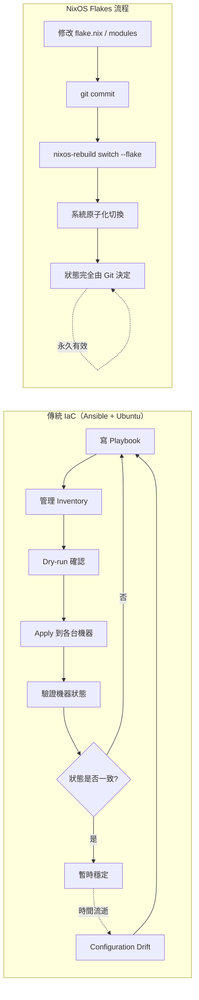
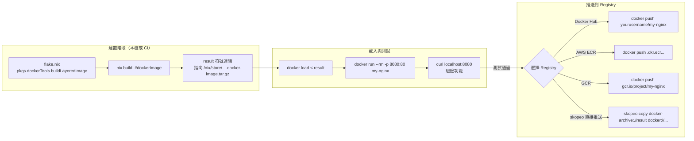
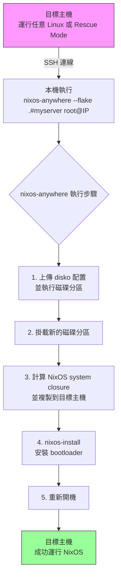

# 第30章：雲端與虛擬化

## 本章學習目標

完成本章後，你將能夠：

1. 理解 NixOS 為何天生適合雲端與不可變基礎設施（Immutable Infrastructure）的場景
2. 在 Proxmox 上部署 NixOS VM，並整合 QEMU Guest Agent 與備份機制
3. 使用 `nixos-rebuild build-vm` 在本機建置 VM 進行配置測試，再推送到伺服器
4. 將 NixOS 應用打包成符合 OCI 規範的 Docker image，並推送到 Container Registry
5. 使用 `nixos-anywhere` 配合 `disko` 宣告式分區，透過 SSH 把任意 Linux 主機轉換成 NixOS

---

## 前置知識

- 完成第29章（伺服器配置模式）
- 了解 Flakes 基本概念（第17–18章）
- 了解 NixOS 模組系統（第7章）
- 具備基本 Linux 網路與虛擬化概念（KVM / LXC / Docker）

---

## 30.1 NixOS 在雲端的優勢

### 不可變基礎設施的天然契合

雲端工程的黃金法則是：

**「不要修補（patch）你的伺服器，直接換掉它。」**

這個法則對傳統 Linux 發行版來說只是口號，因為每台機器都有自己的歷史狀態。
但對 NixOS 而言，這就是日常操作。

NixOS 系統的本質是：

```text
flake.nix + flake.lock
        ↓
完整系統描述（configuration）
        ↓
Nix 計算出的 system closure
        ↓
可部署到任何機器的不可變系統快照
```

新建一台機器，就像把這份快照「印」上去。

---

### 沒有「Configuration Drift」

Configuration Drift（配置漂移）是傳統基礎設施的最大敵人。

問題的根源：

- 工程師 A 登入 server-01，手動安裝了 `libssl-dev`
- 工程師 B 登入 server-02，修改了 `/etc/nginx/nginx.conf` 的 timeout
- 三個月後，沒有人知道哪台機器長什麼樣子

NixOS 的解法：

- 所有配置都在 Git repository
- 新機器 = 完整重建，行為可預期
- 機器的狀態 100% 由配置決定，不存在「在機器上累積的歷史狀態」

---

### Infrastructure as Code 的最終形態

Infrastructure as Code（IaC）概念本身不新，但 NixOS 把它推進到作業系統層級。

| 工具 | 管理層次 | 可重現性 |
|---|---|---|
| Ansible | 套件 + 配置檔 | 部分（冪等性有限） |
| Terraform | 基礎設施資源 | 高（資源宣告） |
| Docker | 應用程式層 | 高（image 固定） |
| NixOS Flakes | 整個作業系統 | 極高（完整 closure） |

NixOS Flakes 管理的是整個作業系統，包括：kernel、bootloader、系統服務、套件版本。
這是其他 IaC 工具無法做到的。

---

### 傳統做法 vs NixOS Flakes 部署工作量對比

傳統做法（Ansible + Ubuntu）需要：

```text
1. 寫 Ansible playbook（可能 500 行）
2. 管理 roles 與 variables
3. 每次部署前 dry-run 確認
4. 手動確認 idempotency
5. 管理 inventory 主機清單
6. 處理 Ansible 版本相容性
7. 擔心某台機器狀態跑掉
```

NixOS Flakes 做法：

```text
1. 修改 flake.nix 或 modules/
2. git commit && git push
3. nixos-rebuild switch --flake .#hostname --target-host user@ip
```

所有機器的狀態都由同一份 Git repository 決定。

---

### Mermaid 圖：傳統 IaC 流程 vs NixOS Flakes 流程



---

## 30.2 Proxmox 上的 NixOS 部署

Proxmox VE（虛擬化環境）是常見的自建雲端平台。
以下說明如何在 Proxmox 上建立並管理 NixOS VM。

---

### Step 1：上傳 NixOS ISO

前往 NixOS 官方下載頁面取得最新 stable ISO：

```bash
# 在 Proxmox host 或本機下載
wget https://channels.nixos.org/nixos-25.05/latest-nixos-minimal-x86_64-linux.iso
```

在 Proxmox 管理介面：

1. 選擇儲存空間（如 `local`）
2. 點選「Upload」
3. 上傳 ISO 檔案

---

### Step 2：建立 VM（建議規格）

| 設定 | 建議值 | 說明 |
|---|---|---|
| CPU | 2 vCPU | 基本伺服器配置 |
| RAM | 2048 MB | 最小，建議 4096 MB |
| Disk | 20 GB | /nix/store 需要足夠空間 |
| BIOS | OVMF (UEFI) | 建議使用 UEFI |
| Machine | q35 | 支援更多 PCI 功能 |
| Network | VirtIO | 效能最佳的網路介面 |
| Storage | VirtIO SCSI | 效能最佳的儲存介面 |

---

### Step 3：安裝 NixOS（使用 disko 自動分區）

開機進入 installer 後，手動分區較繁瑣。
建議使用 `disko` 宣告式分區工具（詳見 30.8）。

若使用傳統手動安裝：

```bash
# 在安裝環境內（以 ext4 + UEFI 為例）
sudo parted /dev/vda -- mklabel gpt
sudo parted /dev/vda -- mkpart ESP fat32 1MB 512MB
sudo parted /dev/vda -- mkpart primary ext4 512MB 100%
sudo parted /dev/vda -- set 1 esp on

sudo mkfs.fat -F 32 /dev/vda1
sudo mkfs.ext4 -L nixos /dev/vda2

sudo mount /dev/vda2 /mnt
sudo mkdir -p /mnt/boot
sudo mount /dev/vda1 /mnt/boot

sudo nixos-generate-config --root /mnt
```

接著編輯配置並安裝：

```bash
sudo nano /mnt/etc/nixos/configuration.nix
sudo nixos-install
```

---

### Step 4：加入 Flakes 配置管理

安裝完成後，將機器加入你的 Flakes repository。

在 `hosts/proxmox-vm-01/default.nix` 建立主機配置：

```nix
{ config, pkgs, ... }:

{
  imports = [
    ./hardware-configuration.nix
    ../../modules/server/base.nix
    ../../modules/cloud/proxmox.nix
  ];

  networking.hostName = "proxmox-vm-01";

  # Proxmox 環境特定設定
  services.qemuGuest.enable = true;

  system.stateVersion = "25.05";
}
```

在 `flake.nix` 中加入這台機器：

```nix
{
  description = "NixOS Infrastructure";

  inputs = {
    nixpkgs.url = "github:NixOS/nixpkgs/nixos-25.05";
  };

  outputs = { self, nixpkgs }: {
    nixosConfigurations = {
      proxmox-vm-01 = nixpkgs.lib.nixosSystem {
        system = "x86_64-linux";
        modules = [
          ./hosts/proxmox-vm-01/default.nix
        ];
      };
    };
  };
}
```

---

### QEMU Guest Agent

QEMU Guest Agent 讓 Proxmox host 能夠與 VM 溝通，提供以下功能：

- 取得 VM 的 IP 位址
- 安全關機（Graceful shutdown）
- 即時備份（Freeze/thaw filesystem）
- 記憶體氣球（Memory ballooning）

在 NixOS 中啟用：

```nix
{ config, pkgs, ... }:

{
  # 啟用 QEMU Guest Agent
  # 需要 Proxmox VM 設定中開啟 QEMU Agent 選項
  services.qemuGuest.enable = true;

  # 確保 VirtIO 相關模組載入
  boot.initrd.availableKernelModules = [
    "virtio_pci"
    "virtio_scsi"
    "virtio_net"
    "virtio_blk"
  ];

  system.stateVersion = "25.05";
}
```

---

### 快照與備份整合（Proxmox Backup Server）

Proxmox Backup Server（PBS）是 Proxmox 的企業級備份解決方案。

NixOS 配合 PBS 備份的注意事項：

```text
1. 啟用 QEMU Guest Agent（確保檔案系統一致性）
2. 在 PBS 設定排程備份
3. /nix/store 不需要備份（可重建）
4. 重要的需備份：/etc/nixos、/home、/var/lib（狀態資料）
```

由於 NixOS 的系統本身可從 flake.nix 重建，
真正需要備份的只有：

- `/home`：使用者資料
- `/var/lib`：服務狀態（資料庫、設定等）
- `/var/secrets`（若有）：密鑰資料

這大幅減少了備份所需空間。

---

## 30.3 KVM / QEMU VM 配置

### `virtualisation.vmVariant`：為 VM 產生特殊配置

NixOS 提供 `vmVariant` 選項，讓你可以在不修改實體機配置的情況下，
額外加入「只在 VM 中才有效」的配置。

這對以下場景非常有用：

- 本機測試時開放更多 forwarded ports
- VM 中使用不同的登入密碼（方便開發）
- 增加 VM 的記憶體或 CPU 設定

```nix
{ config, pkgs, lib, ... }:

{
  # 實體機配置（正常的 production 設定）
  networking.hostName = "web-server";
  services.nginx.enable = true;

  networking.firewall = {
    enable = true;
    allowedTCPPorts = [ 80 443 ];
  };

  # VM 專屬配置（只在 nixos-rebuild build-vm 時有效）
  virtualisation.vmVariant = {
    # VM 資源設定
    virtualisation.memorySize = 2048;  # 2GB RAM
    virtualisation.cores = 2;

    # 將 host 的 8080 port 對應到 VM 的 80 port
    virtualisation.forwardPorts = [
      {
        from = "host";
        host.port = 8080;
        guest.port = 80;
      }
    ];

    # VM 中使用簡單密碼方便測試（絕不用於 production）
    users.users.admin = {
      isNormalUser = true;
      password = "test";
      extraGroups = [ "wheel" ];
    };
  };

  system.stateVersion = "25.05";
}
```

---

### `nixos-rebuild build-vm`：在本機建置並測試 VM

`build-vm` 是 NixOS 最強大的開發工具之一。

它能在本機建置一個 QEMU VM，讓你在推送配置到真實伺服器之前，
先在本機完整測試新配置是否正常運作。

基本用法：

```bash
# 建置 VM（不啟動）
nixos-rebuild build-vm --flake .#web-server

# 建置並啟動 VM
result/bin/run-web-server-vm

# 或直接用 nixos-rebuild
nixos-rebuild build-vm --flake .#web-server
./result/bin/run-*-vm
```

啟動後，VM 會在前景執行。

---

### 用 VM 測試新配置的完整工作流程

這是 NixOS 工程實踐中最重要的習慣之一：

**先在 VM 測試，確認無誤再部署到伺服器。**

```bash
# Step 1：修改配置
vim hosts/web-server/default.nix

# Step 2：在本機建置 VM 進行測試
nixos-rebuild build-vm --flake .#web-server

# Step 3：啟動 VM
./result/bin/run-web-server-vm

# Step 4：在 VM 內測試服務是否正常
# （VM 的 80 port 被 forward 到 host 的 8080）
curl http://localhost:8080

# Step 5：確認 VM 內無錯誤
journalctl -u nginx --no-pager

# Step 6：按 Ctrl+A 再按 X 關閉 QEMU VM

# Step 7：確認測試通過後，部署到真實伺服器
nixos-rebuild switch --flake .#web-server \
  --target-host admin@192.168.1.100 \
  --build-host localhost

# Step 8：git commit 固化這次配置變更
git add -A && git commit -m "feat(web-server): update nginx configuration"
```

---

### buildVM 的進階設定

在 Flake 中可以直接在 `outputs` 暴露 VM 建置目標：

```nix
{
  description = "NixOS Infrastructure";

  inputs = {
    nixpkgs.url = "github:NixOS/nixpkgs/nixos-25.05";
  };

  outputs = { self, nixpkgs }: let
    system = "x86_64-linux";
    pkgs = nixpkgs.legacyPackages.${system};
  in {
    nixosConfigurations = {
      web-server = nixpkgs.lib.nixosSystem {
        inherit system;
        modules = [ ./hosts/web-server/default.nix ];
      };
    };

    # 直接在 flake outputs 暴露 VM 建置目標
    # 使用：nix build .#vm
    packages.${system} = {
      vm = self.nixosConfigurations.web-server.config.system.build.vm;
    };
  };
}
```

這樣可以用更簡短的指令建置：

```bash
nix build .#vm
./result/bin/run-*-vm
```

---

## 30.4 LXC Container 配置

### NixOS 作為 LXC Container（Proxmox）

LXC（Linux Containers）比 VM 更輕量，共用 host 的 kernel，
啟動速度快，資源消耗低。

Proxmox 支援 LXC Container，但 NixOS 在 LXC 環境中有一些限制需要了解。

---

### LXC 的限制

| 限制 | 說明 | 因應方式 |
|---|---|---|
| 無法使用獨立 kernel | 共用 host kernel | 確保 host kernel 版本夠新 |
| systemd 功能受限 | 無法掛載某些 cgroup | 使用 `boot.isContainer = true` |
| 不能使用 KVM | 無硬體虛擬化 | 無（LXC 本身限制） |
| 網路命名空間受限 | 依 Proxmox 設定 | 確認 veth 介面設定 |

---

### 完整範例：Proxmox LXC 中的 NixOS 配置

```nix
{ config, pkgs, lib, ... }:

{
  # 告知 NixOS 這是一個 container 環境
  # 這會自動調整許多不適合 container 的設定
  boot.isContainer = true;

  # 在 container 中啟用 lxcfs（提供更真實的 /proc 視圖）
  virtualisation.lxc.lxcfs.enable = true;

  # LXC 中通常不需要 bootloader
  # boot.loader 相關設定會被 boot.isContainer 自動跳過

  # 網路設定（Proxmox 會透過 veth 介面提供）
  networking = {
    hostName = "lxc-service";
    useDHCP = false;
    interfaces.eth0 = {
      ipv4.addresses = [{
        address = "192.168.1.200";
        prefixLength = 24;
      }];
    };
    defaultGateway = "192.168.1.1";
    nameservers = [ "8.8.8.8" "1.1.1.1" ];
  };

  # LXC 中的服務（基本服務可正常運行）
  services.openssh = {
    enable = true;
    settings.PasswordAuthentication = false;
  };

  # 示範：在 LXC 中跑 nginx
  services.nginx = {
    enable = true;
    virtualHosts."lxc-service" = {
      root = "/var/www/html";
    };
  };

  # 使用者設定
  users.users.admin = {
    isNormalUser = true;
    extraGroups = [ "wheel" ];
    openssh.authorizedKeys.keys = [
      "ssh-ed25519 AAAAC3NzaC1lZDI1NTE5AAAAI... your-public-key"
    ];
  };

  # 允許 wheel 免密碼 sudo（container 環境常見設定）
  security.sudo.wheelNeedsPassword = false;

  environment.systemPackages = with pkgs; [
    vim
    curl
    htop
  ];

  system.stateVersion = "25.05";
}
```

在 Proxmox 中建立 NixOS LXC 的步驟：

```bash
# 1. 下載 NixOS LXC template（在 Proxmox host 執行）
# Proxmox 的 LXC template 目錄通常是 /var/lib/vz/template/cache/

# 2. 建立 LXC container（使用 pct 工具）
pct create 200 local:vztmpl/nixos-25.05-amd64.tar.xz \
  --hostname lxc-service \
  --memory 1024 \
  --swap 512 \
  --net0 name=eth0,bridge=vmbr0,ip=192.168.1.200/24,gw=192.168.1.1 \
  --storage local-lvm \
  --rootfs local-lvm:8 \
  --unprivileged 1

# 3. 啟動 container
pct start 200

# 4. 進入 container 進行初始配置
pct exec 200 -- bash
```

---

## 30.5 AWS EC2 部署（nixpkgs AMI）

### nixpkgs 提供的官方 AWS AMI

NixOS 團隊在每個 stable 版本發布時，都會同步在 AWS 所有主要區域發布官方 AMI。

尋找最新的官方 AMI：

```bash
# 使用 AWS CLI 搜尋 NixOS AMI（以 us-east-1 為例）
aws ec2 describe-images \
  --owners 080433136561 \
  --filters "Name=name,Values=nixos-25.05*" \
  --query "sort_by(Images, &CreationDate)[-1].ImageId" \
  --region us-east-1
```

你也可以在 [https://nixos.org/download/#nixos-amazon](https://nixos.org/download/#nixos-amazon) 找到各區域的 AMI ID 清單。

---

### 在 EC2 Launch 後的基本設定

EC2 instance 啟動後，NixOS 預設會透過 cloud-init 設定 SSH key。

```bash
# 用你的 EC2 key pair 連線
ssh -i ~/.ssh/my-ec2-key.pem ec2-user@<public-ip>

# 進入系統後確認 NixOS 版本
nixos-version
```

---

### `modules/cloud/aws.nix`：AWS 特定配置模組

建立一個 AWS 環境專用的模組，集中管理 AWS 特有設定：

```nix
# modules/cloud/aws.nix
{ config, pkgs, lib, ... }:

{
  # 啟用 cloud-init（處理 EC2 UserData 與 SSH key 注入）
  services.cloud-init = {
    enable = true;
    # 指定 cloud-init 使用 EC2 datasource
    settings = {
      datasource_list = [ "Ec2" ];
      datasource.Ec2 = {
        # EC2 metadata endpoint
        metadata_urls = [ "http://169.254.169.254" ];
        timeout = 10;
        max_wait = 20;
      };
    };
  };

  # EC2 HVM instance 必要設定
  # 確保 HVM 所需的虛擬化功能正確設定
  virtualisation.ec2.hvm = true;

  # AWS SSM Agent（選用，若需要 Session Manager 連線）
  # services.amazon-ssm-agent.enable = true;

  # 啟用 ENA（Elastic Network Adapter）支援
  # 新世代 EC2 instance 必備
  boot.kernelModules = [ "ena" ];

  # 設定時區同步（AWS 使用 169.254.169.123 作為 NTP）
  services.timesyncd = {
    enable = true;
    servers = [ "169.254.169.123" ];
  };

  # 開放 SSH（EC2 安全群組也需要對應設定）
  services.openssh = {
    enable = true;
    settings = {
      PasswordAuthentication = false;
      PermitRootLogin = "no";
    };
  };

  # EC2 預設的 ec2-user
  users.users.ec2-user = {
    isNormalUser = true;
    extraGroups = [ "wheel" ];
    # SSH key 由 cloud-init 注入
  };

  security.sudo.wheelNeedsPassword = false;
}
```

---

### 用 `nixos-rebuild switch --target-host` 管理 EC2

NixOS Flakes 的優勢在於，管理遠端 EC2 與管理本機幾乎相同：

```bash
# 在你的開發機器上執行（不需要登入 EC2）
nixos-rebuild switch \
  --flake .#ec2-web-server \
  --target-host ec2-user@<ec2-public-ip> \
  --build-host localhost

# 這個指令會：
# 1. 在本機（build-host）計算並建置新的 system closure
# 2. 透過 SSH 將 closure 複製到 EC2
# 3. 在 EC2 上執行 nixos-rebuild switch（原子化切換）
```

---

### 完整範例：一台 EC2 Web Server 的配置

```nix
# hosts/ec2-web-server/default.nix
{ config, pkgs, lib, ... }:

{
  imports = [
    ../../modules/cloud/aws.nix
    ../../modules/server/base.nix
  ];

  networking = {
    hostName = "ec2-web-server";
    firewall = {
      enable = true;
      allowedTCPPorts = [ 22 80 443 ];
    };
  };

  # Nginx 反向代理
  services.nginx = {
    enable = true;

    recommendedGzipSettings = true;
    recommendedOptimisation = true;
    recommendedProxySettings = true;
    recommendedTlsSettings = true;

    virtualHosts."example.com" = {
      enableACME = true;
      forceSSL = true;

      locations."/" = {
        proxyPass = "http://127.0.0.1:3000";
        proxyWebsockets = true;
      };
    };
  };

  # Let's Encrypt SSL 憑證
  security.acme = {
    acceptTerms = true;
    defaults.email = "admin@example.com";
  };

  # 應用程式服務（示範用 Node.js App）
  # 實際上可能是任何服務
  systemd.services.my-app = {
    description = "My Web Application";
    after = [ "network.target" ];
    wantedBy = [ "multi-user.target" ];

    serviceConfig = {
      ExecStart = "${pkgs.nodejs}/bin/node /srv/app/server.js";
      Restart = "always";
      User = "www-data";
      WorkingDirectory = "/srv/app";
    };
  };

  # 建立應用程式使用者
  users.users.www-data = {
    isSystemUser = true;
    group = "www-data";
  };
  users.groups.www-data = {};

  # 監控（CloudWatch Agent 或自建 Prometheus）
  services.prometheus.exporters.node = {
    enable = true;
    port = 9100;
  };

  environment.systemPackages = with pkgs; [
    awscli2
    curl
    jq
  ];

  system.stateVersion = "25.05";
}
```

---

## 30.6 OCI Image 生成（dockerTools）

### `pkgs.dockerTools.buildLayeredImage`

Nix 可以直接建置符合 OCI 規範的 Docker image，
不需要 Dockerfile，不需要 Docker daemon，不需要 build context。

這帶來幾個傳統 Dockerfile 做不到的優勢：

| 特性 | Dockerfile | Nix dockerTools |
|---|---|---|
| 可重現性 | 低（apt 版本不固定）| 極高（hash 鎖定） |
| 最小化 image | 困難（需要 multi-stage） | 天然（只包含宣告的依賴）|
| Layer 快取 | 手動優化 | 自動依依賴計算 |
| 需要 shell | 通常有 | 可以完全不包含 |
| 安全性 | 中（工具鏈殘留）| 高（minimal by default） |

---

### 完整範例：把 Nginx 靜態網站打包成 OCI image

在 `flake.nix` 中定義 image 建置：

```nix
{
  description = "NixOS OCI Image Example";

  inputs = {
    nixpkgs.url = "github:NixOS/nixpkgs/nixos-25.05";
  };

  outputs = { self, nixpkgs }: let
    system = "x86_64-linux";
    pkgs = nixpkgs.legacyPackages.${system};

    # 靜態網站內容
    webContent = pkgs.runCommand "web-content" {} ''
      mkdir -p $out/usr/share/nginx/html
      cat > $out/usr/share/nginx/html/index.html << 'EOF'
      <!DOCTYPE html>
      <html>
        <head><title>NixOS OCI Demo</title></head>
        <body><h1>Built with Nix, zero Dockerfile!</h1></body>
      </html>
      EOF
    '';

    # Nginx 設定檔
    nginxConf = pkgs.writeText "nginx.conf" ''
      user nobody nobody;
      daemon off;
      error_log /dev/stderr;
      pid /tmp/nginx.pid;

      events {
        worker_connections 1024;
      }

      http {
        include ${pkgs.nginx}/conf/mime.types;
        access_log /dev/stdout;

        server {
          listen 80;
          root /usr/share/nginx/html;
          index index.html;

          location / {
            try_files $uri $uri/ =404;
          }
        }
      }
    '';

  in {
    # 建置 OCI image
    # 使用：nix build .#dockerImage
    packages.${system}.dockerImage = pkgs.dockerTools.buildLayeredImage {
      name = "my-nginx";
      tag = "latest";

      # image 包含的內容
      contents = [
        pkgs.nginx
        pkgs.fakeNss  # 提供 /etc/passwd 等檔案（nginx 需要）
        webContent
      ];

      # 建置 image 時執行的設定（類似 Dockerfile 的 RUN）
      extraCommands = ''
        # 建立 nginx 需要的執行時目錄
        mkdir -p tmp/nginx
        mkdir -p var/log/nginx
        mkdir -p var/cache/nginx
      '';

      # OCI image 設定（等同 Dockerfile 的 CMD、EXPOSE 等）
      config = {
        Cmd = [
          "${pkgs.nginx}/bin/nginx"
          "-c" "${nginxConf}"
          "-g" "daemon off;"
        ];
        ExposedPorts = {
          "80/tcp" = {};
        };
        # 無 shell（minimal image）
        # 這樣 `docker exec container sh` 會失敗，但 image 更安全
      };
    };
  };
}
```

建置並載入 image：

```bash
# 建置 image（輸出是 .tar.gz）
nix build .#dockerImage

# 載入到本機 Docker
docker load < result

# 確認 image 存在
docker images | grep my-nginx

# 測試執行
docker run --rm -p 8080:80 my-nginx:latest

# 驗證
curl http://localhost:8080
```

---

### 推送到 Container Registry

```bash
# 推送到 Docker Hub
docker tag my-nginx:latest yourusername/my-nginx:latest
docker push yourusername/my-nginx:latest

# 推送到 AWS ECR
aws ecr get-login-password --region ap-northeast-1 \
  | docker login --username AWS \
    --password-stdin <account-id>.dkr.ecr.ap-northeast-1.amazonaws.com

docker tag my-nginx:latest \
  <account-id>.dkr.ecr.ap-northeast-1.amazonaws.com/my-nginx:latest

docker push \
  <account-id>.dkr.ecr.ap-northeast-1.amazonaws.com/my-nginx:latest

# 推送到 Google Container Registry (GCR)
docker tag my-nginx:latest gcr.io/my-project/my-nginx:latest
docker push gcr.io/my-project/my-nginx:latest
```

也可以用 Nix 直接推送（不需要先 docker load）：

```bash
# 使用 skopeo（Nix 生態中的 OCI 工具）
nix run nixpkgs#skopeo -- copy \
  docker-archive:./result \
  docker://yourusername/my-nginx:latest
```

---

### Mermaid 圖：OCI Image 建置流程



---

## 30.7 cloud-init 整合

### cloud-init 的作用

cloud-init 是雲端平台標準的 VM 初始化工具。
當 VM 第一次啟動時，cloud-init 會執行一系列初始化任務：

- 注入 SSH public key
- 設定主機名稱
- 配置網路介面
- 執行 UserData script
- 擴展 root 磁碟分區

這讓雲端平台可以在不預先設定 VM 的情況下，
透過 metadata API 動態注入初始配置。

---

### 啟用 cloud-init

```nix
{ config, pkgs, ... }:

{
  # 啟用 cloud-init（適用 AWS、GCP、Azure、Proxmox Cloud-Init）
  services.cloud-init = {
    enable = true;

    # 在 NixOS 中，network 配置通常交給 NixOS 管理
    # 可以停用 cloud-init 的 network 配置，避免衝突
    network.enable = false;
  };

  system.stateVersion = "25.05";
}
```

---

### NixOS 與 cloud-init 的共存策略

cloud-init 和 NixOS Flakes 管理的職責劃分很重要：

```text
cloud-init 負責（僅首次開機）：
  ├── 注入 SSH public key
  ├── 設定初始主機名稱
  └── 執行首次開機 script

NixOS Flakes 負責（長期管理）：
  ├── 套件安裝
  ├── 服務配置
  ├── 使用者管理
  ├── 網路配置
  └── 所有系統狀態
```

這個分工的原則是：

**cloud-init 只在首次開機執行，之後所有配置由 Flakes 管理。**

當你修改 NixOS 配置並執行 `nixos-rebuild switch` 後，
cloud-init 不會再次執行，NixOS 完整接管系統狀態。

---

### 常見 cloud-init 任務在 NixOS 的對應做法

| cloud-init 任務 | NixOS 對應做法 |
|---|---|
| 設定 SSH key | `users.users.xxx.openssh.authorizedKeys.keys` |
| 設定主機名稱 | `networking.hostName` |
| 設定靜態 IP | `networking.interfaces.eth0.ipv4.addresses` |
| 安裝套件 | `environment.systemPackages` |
| 執行初始 script | `systemd.services.my-init`（oneshot） |

在 NixOS 中，這些任務用配置宣告即可，不需要 cloud-init script。

---

### `nixos-generate-config` 在雲端環境的使用

在新的雲端 VM 上，`nixos-generate-config` 是取得硬體配置的好工具：

```bash
# 安裝完成後，或在 rescue mode 中
sudo nixos-generate-config --root /mnt

# 這會生成：
# /mnt/etc/nixos/configuration.nix    （基本配置骨架）
# /mnt/etc/nixos/hardware-configuration.nix（硬體特定配置）
```

生成的 `hardware-configuration.nix` 包含：

- 磁碟掛載點（fileSystems）
- Swap 設定
- 核心模組（boot.initrd.availableKernelModules）
- 硬體特定的啟動參數

這個檔案應該加入你的 Git repository（每台機器各自的版本），
因為它包含了該台機器的硬體特定設定。

---

## 30.8 nixos-anywhere：任意主機遠端安裝

### nixos-anywhere 是什麼

nixos-anywhere 是近年來 NixOS 社群最熱門的部署工具之一。

它解決了一個長期存在的問題：

**「我有一台運行其他 Linux 的伺服器，我想把它變成 NixOS，但不想親自去機房插 USB。」**

nixos-anywhere 透過 SSH 連線到目標主機，
完整執行 NixOS 安裝程序（包含分區、格式化、安裝），
最後重開機成為 NixOS 系統。

---

### 工作流程概覽



---

### disko：宣告式磁碟分區工具

disko 是 nixos-anywhere 的最佳搭檔。
它讓你用 Nix 宣告磁碟分區配置，nixos-anywhere 會自動執行。

以下是常見的 GPT + UEFI + ext4 分區配置：

```nix
# hosts/myserver/disko.nix
{ ... }:

{
  disko.devices = {
    disk = {
      # 主要磁碟（依實際設備調整，如 /dev/sda、/dev/nvme0n1）
      main = {
        type = "disk";
        device = "/dev/sda";

        content = {
          type = "gpt";
          partitions = {
            # EFI 系統分區
            ESP = {
              size = "512M";
              type = "EF00";  # EFI 系統分區類型
              content = {
                type = "filesystem";
                format = "vfat";
                mountpoint = "/boot";
                mountOptions = [ "umask=0077" ];
              };
            };

            # 根目錄分區
            root = {
              size = "100%";  # 使用剩餘所有空間
              content = {
                type = "filesystem";
                format = "ext4";
                mountpoint = "/";
              };
            };
          };
        };
      };
    };
  };
}
```

更進階的分區方案（使用 LVM + LUKS 加密）：

```nix
# hosts/myserver/disko-luks-lvm.nix
{ ... }:

{
  disko.devices = {
    disk.main = {
      type = "disk";
      device = "/dev/sda";

      content = {
        type = "gpt";
        partitions = {
          boot = {
            size = "1M";
            type = "EF02";  # BIOS Boot Partition（用於 GRUB MBR）
          };

          ESP = {
            size = "512M";
            type = "EF00";
            content = {
              type = "filesystem";
              format = "vfat";
              mountpoint = "/boot";
            };
          };

          luks = {
            size = "100%";
            content = {
              type = "luks";
              name = "cryptroot";
              # 加密金鑰（實際部署中使用 sops-nix 管理）
              settings.allowDiscards = true;

              content = {
                type = "lvm_pv";
                vg = "vg0";
              };
            };
          };
        };
      };
    };

    lvm_vg.vg0 = {
      type = "lvm_vg";
      lvs = {
        swap = {
          size = "8G";
          content = {
            type = "swap";
          };
        };
        root = {
          size = "100%FREE";
          content = {
            type = "filesystem";
            format = "ext4";
            mountpoint = "/";
          };
        };
      };
    };
  };
}
```

---

### 完整的 disko + nixos-anywhere 工作流程範例

假設你有一台 Hetzner 裸機伺服器，已進入 Rescue Mode（運行 Debian）。

**Step 1：在本機準備 Flake 配置**

建立主機配置：

```nix
# hosts/hetzner-01/default.nix
{ config, pkgs, ... }:

{
  imports = [
    ./hardware-configuration.nix
    ./disko.nix
    ../../modules/server/base.nix
    ../../modules/cloud/hetzner.nix
  ];

  networking = {
    hostName = "hetzner-01";
    firewall = {
      enable = true;
      allowedTCPPorts = [ 22 80 443 ];
    };
  };

  services.openssh = {
    enable = true;
    settings = {
      PasswordAuthentication = false;
      PermitRootLogin = "prohibit-password";
    };
  };

  # 初始 SSH key（安裝後立即可用）
  users.users.root.openssh.authorizedKeys.keys = [
    "ssh-ed25519 AAAAC3NzaC1lZDI1NTE5AAAAI... your-public-key"
  ];

  # 正式使用者
  users.users.admin = {
    isNormalUser = true;
    extraGroups = [ "wheel" ];
    openssh.authorizedKeys.keys = [
      "ssh-ed25519 AAAAC3NzaC1lZDI1NTE5AAAAI... your-public-key"
    ];
  };

  security.sudo.wheelNeedsPassword = false;

  system.stateVersion = "25.05";
}
```

建立 disko 分區配置：

```nix
# hosts/hetzner-01/disko.nix
{ ... }:

{
  disko.devices = {
    disk.main = {
      type = "disk";
      # Hetzner 裸機通常是 /dev/sda 或 /dev/nvme0n1
      device = "/dev/sda";

      content = {
        type = "gpt";
        partitions = {
          ESP = {
            size = "512M";
            type = "EF00";
            content = {
              type = "filesystem";
              format = "vfat";
              mountpoint = "/boot";
            };
          };

          swap = {
            size = "8G";
            content = {
              type = "swap";
              resumeDevice = true;
            };
          };

          root = {
            size = "100%";
            content = {
              type = "filesystem";
              format = "ext4";
              mountpoint = "/";
              mountOptions = [ "noatime" ];
            };
          };
        };
      };
    };
  };
}
```

在 `flake.nix` 中加入 nixos-anywhere 和 disko 作為 inputs：

```nix
{
  description = "NixOS Infrastructure";

  inputs = {
    nixpkgs.url = "github:NixOS/nixpkgs/nixos-25.05";

    # disko：宣告式磁碟分區
    disko = {
      url = "github:nix-community/disko";
      inputs.nixpkgs.follows = "nixpkgs";
    };

    # nixos-anywhere：遠端安裝工具
    nixos-anywhere = {
      url = "github:nix-community/nixos-anywhere";
      inputs.nixpkgs.follows = "nixpkgs";
    };
  };

  outputs = { self, nixpkgs, disko, nixos-anywhere, ... }: {
    nixosConfigurations = {
      hetzner-01 = nixpkgs.lib.nixosSystem {
        system = "x86_64-linux";
        modules = [
          disko.nixosModules.disko       # 引入 disko 模組
          ./hosts/hetzner-01/default.nix
        ];
      };
    };
  };
}
```

**Step 2：執行 nixos-anywhere 安裝**

```bash
# 在本機執行（目標主機需在 Rescue Mode 或運行任意 Linux）
nix run github:nix-community/nixos-anywhere -- \
  --flake .#hetzner-01 \
  root@<hetzner-ip>

# 如果目標主機的 SSH host key 不在 known_hosts 中：
nix run github:nix-community/nixos-anywhere -- \
  --flake .#hetzner-01 \
  --no-reboot \          # 安裝完不自動重開機（方便檢查）
  root@<hetzner-ip>
```

nixos-anywhere 執行過程：

```text
# 你會看到類似這樣的輸出：
### Uploading nixos configurations
### Formatting disk with disko
### Installing NixOS
### Copying nix store paths
### Copying secrets
### Rebooting
```

**Step 3：安裝完成後管理**

重開機後，機器已運行 NixOS，後續管理與一般 NixOS 主機相同：

```bash
# 後續配置更新
nixos-rebuild switch \
  --flake .#hetzner-01 \
  --target-host admin@<hetzner-ip>

# 進入機器
ssh admin@<hetzner-ip>

# 確認 NixOS 版本
ssh admin@<hetzner-ip> nixos-version
```

---

### 適用場景比較

| 場景 | 推薦做法 | 說明 |
|---|---|---|
| Hetzner 裸機 | nixos-anywhere + Rescue Mode | 官方支援，流程最順 |
| Proxmox 新 VM | nixos-anywhere + cloud-init | 或直接 ISO 安裝 |
| Oracle Cloud Free Tier | nixos-anywhere + ARM64 配置 | 需注意 `system = "aarch64-linux"` |
| AWS EC2 | 官方 AMI + nixos-rebuild | 最簡單，直接用官方 AMI |
| GCP Compute Engine | nixos-anywhere 或 官方 image | GCP 亦有社群維護 image |
| 本機測試 | nixos-rebuild build-vm | 不需要實體硬體 |

---

## 本章小結

本章介紹了 NixOS 在雲端與虛擬化場景的完整工具鏈。

### 核心概念回顧

1. **NixOS 天生是雲端原生的**：不可變系統 + 宣告式配置 = 真正的 Infrastructure as Code

2. **VM 測試先行**：`nixos-rebuild build-vm` 讓你在本機測試配置，確認無誤再部署到伺服器

3. **OCI Image 零 Dockerfile**：`pkgs.dockerTools.buildLayeredImage` 產生可重現、最小化的 container image

4. **nixos-anywhere + disko** 是現代 NixOS 部署的黃金組合：從任意 Linux 遠端轉換為 NixOS，磁碟分區也宣告式管理

---

### 雲端/虛擬化方案選擇表

| 場景 | 工具 | 難度 | 推薦程度 |
|---|---|---|---|
| 本機 VM 測試 | `nixos-rebuild build-vm` | 低 | 強烈推薦 |
| Proxmox VM | ISO 安裝 + QEMU Guest Agent | 低 | 推薦 |
| Proxmox LXC | LXC template + `boot.isContainer` | 中 | 適合輕量服務 |
| AWS EC2 | 官方 AMI + `nixos-rebuild switch` | 低 | 推薦 |
| Hetzner 裸機 | nixos-anywhere + disko | 中 | 強烈推薦 |
| 任意 Linux 主機 | nixos-anywhere + disko | 中 | 推薦 |
| Container Image | `pkgs.dockerTools.buildLayeredImage` | 中 | 強烈推薦 |
| ARM 平台（Oracle Free Tier）| nixos-anywhere + `system = "aarch64-linux"` | 高 | 進階用戶 |

---

### 延伸閱讀

- **第31章**：GitOps 與 CI/CD — 把本章的部署流程自動化
- **第32章**：團隊協作 — 多人共同維護 NixOS Flake repository

---

### 實作練習

**練習 1**：在本機用 `nixos-rebuild build-vm` 建置並測試一個 Nginx VM，
確認 8080 port 可以存取靜態頁面。

**練習 2**：用 `pkgs.dockerTools.buildLayeredImage` 建置一個最小化的 Nginx OCI image，
比較與傳統 Dockerfile 建置的 image 大小差異。

**練習 3**：如果你有一台閒置的 VPS 或虛擬機（運行任意 Linux），
試著用 nixos-anywhere 把它轉換成 NixOS。
從 disko 配置開始，規劃磁碟分區，然後執行安裝。
