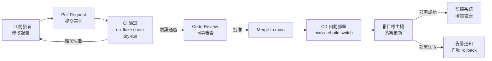
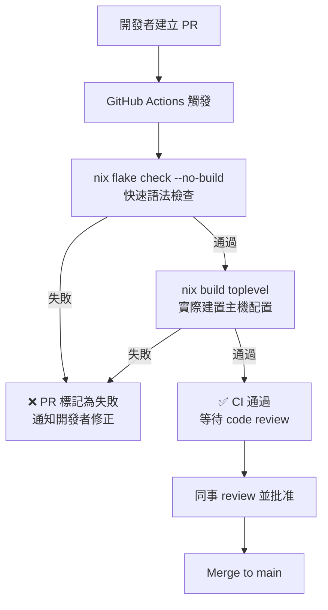
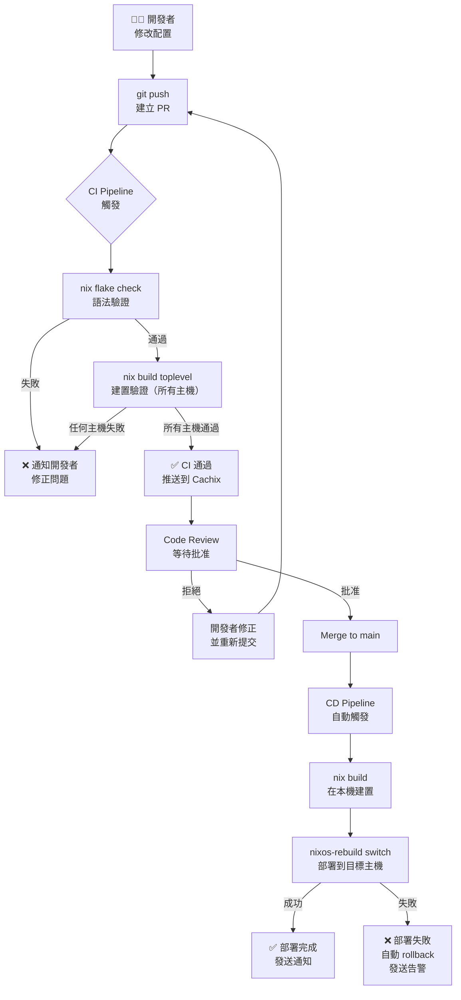
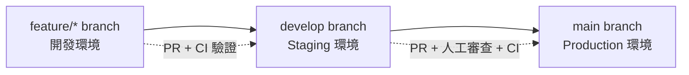
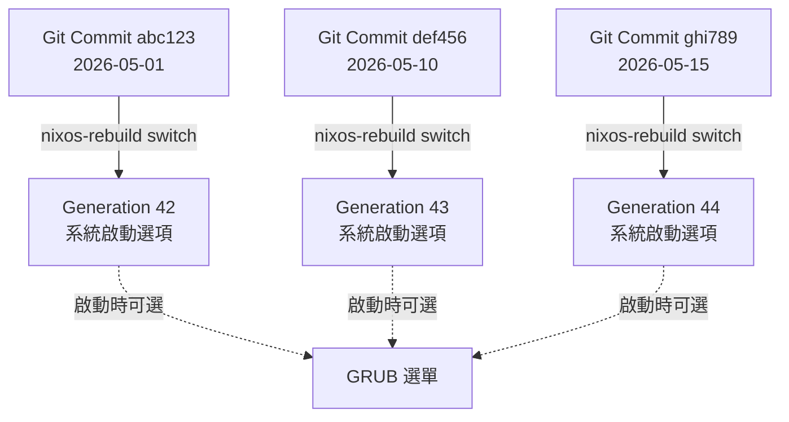
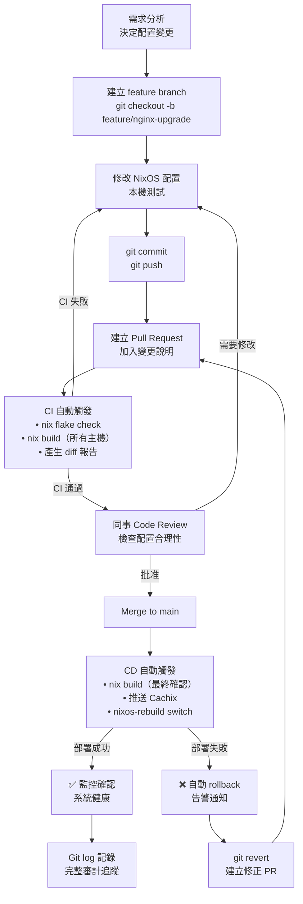

# 第31章：CI/CD 與 GitOps

## 本章學習目標

完成本章後，你將能夠：

1. 理解 GitOps（Git Operations）的核心哲學，以及它與 NixOS 的天然契合之處
2. 在 GitHub Actions 中建立完整的 Nix 建置環境，執行配置語法驗證
3. 整合 Cachix binary cache，將 CI 建置時間從數十分鐘縮短到幾分鐘
4. 設計 PR 觸發的 dry-run 驗證流程，防止錯誤配置合併到主線
5. 建立自動部署 pipeline，實現 merge 到 main 後自動部署到目標主機

---

## 前置知識

- 完成第30章（雲端與虛擬化）
- 熟悉 Flakes 基本結構（第17章）
- 了解 `nixos-rebuild` 的各個子命令（第4章）
- 有基本的 Git 操作經驗（commit、branch、pull request）
- 有 GitHub 帳號，並了解 GitHub Actions 基本概念

---

## 31.1 GitOps 的核心概念

### GitOps 是什麼？

GitOps（Git Operations）是一種基礎設施管理方法論。

它的核心宣言只有一句話：

**Git 倉庫是基礎設施的唯一真實來源（Single Source of Truth）。**

這意味著：

- 所有系統配置都存在 Git 中
- 任何系統變更都必須先改 Git，再由自動化系統套用
- 不允許直接 SSH 進伺服器手動修改配置
- 系統的實際狀態應該與 Git 中的宣告完全一致

### GitOps 的三個原則

**原則一：宣告式（Declarative）**

系統配置描述的是「應該是什麼狀態」，而不是「如何到達這個狀態」。

傳統方式：

```bash
# 命令式：一步步告訴系統怎麼做
sudo apt install nginx
sudo vim /etc/nginx/nginx.conf
sudo systemctl enable --now nginx
```

GitOps 方式：

```nix
# 宣告式：描述期望的最終狀態
services.nginx = {
  enable = true;
  virtualHosts."example.com" = { ... };
};
```

**原則二：版本控制（Versioned）**

所有配置變更都有完整的 Git history。

這帶來幾個好處：

- 知道誰、在什麼時間、改了什麼
- 可以 `git diff` 比較任意兩個版本
- 可以 `git revert` 回到任何歷史狀態
- Pull Request 流程強迫進行 code review

**原則三：自動化（Automated）**

系統同步是自動完成的，不需要人工操作。

Git 收到新 commit 後，CI/CD 系統自動：

1. 驗證配置語法是否正確
2. 建置新的系統 closure
3. 部署到目標主機
4. 回報結果

### NixOS + Flakes 天然符合 GitOps 哲學

NixOS 的設計與 GitOps 的理念高度吻合：

| GitOps 要求 | NixOS 如何實現 |
|---|---|
| 宣告式配置 | 所有系統狀態由 `configuration.nix` 定義 |
| 版本控制 | `flake.lock` 鎖定所有依賴的精確版本 |
| 可重現 | 相同 `flake.lock` 必然建置出相同系統 |
| Rollback | `nixos-rebuild switch --rollback` 或 `git revert` + 重新部署 |
| 審計記錄 | Git log 是完整的配置變更歷史 |

傳統 Linux 系統需要額外工具（Ansible、Puppet、Chef）才能達到 GitOps 的效果。

NixOS 從設計之初就內建了這些能力。

### GitOps 工作流程

以下是標準 GitOps 工作流程：



### GitOps 與傳統 IT 部署的根本差異

傳統部署流程：

```text
工程師 SSH 進伺服器
        ↓
手動執行指令修改配置
        ↓
祈禱不要出錯
        ↓
沒有記錄，沒有 rollback
```

GitOps 部署流程：

```text
工程師修改 Git 倉庫中的配置
        ↓
提交 Pull Request
        ↓
CI 自動驗證語法與建置
        ↓
同事 code review
        ↓
Merge 後 CD 自動部署
        ↓
完整審計記錄在 Git history
```

兩者最根本的差別：

傳統部署是「人控制系統」。

GitOps 是「Git 倉庫控制系統，CI/CD 執行人的意圖」。

---

## 31.2 GitHub Actions + Nix 建置環境

### 為什麼選擇 GitHub Actions？

GitHub Actions 的優點：

- 與 GitHub 倉庫深度整合，無需額外設定
- 免費方案提供每月 2,000 分鐘的 Linux 執行時間
- 支援 pull request 觸發、push 觸發、定時觸發
- 有豐富的社群 action，包括專門為 Nix 設計的 action

### 在 GitHub Actions 中安裝 Nix

推薦使用 `cachix/install-nix-action`，這是目前最主流的方式。

它的優點：

- 正確處理 `nix.conf` 權限設定
- 支援多使用者 Nix 安裝模式
- 支援直接啟用 Flakes 實驗性功能

基本安裝步驟如下：

```yaml
- uses: cachix/install-nix-action@v29
  with:
    nix_path: nixpkgs=channel:nixos-25.05
    extra_nix_config: |
      experimental-features = nix-command flakes
```

這段設定做了三件事：

1. 在 CI runner 上安裝 Nix
2. 設定預設的 nixpkgs channel 為 nixos-25.05
3. 啟用 `nix-command` 和 `flakes` 兩個實驗性功能

### 第一個完整 Nix CI Workflow

建立 `.github/workflows/nix-check.yml`：

以下是一個最基本、可直接複製使用的 workflow：

```yaml
name: Nix Check

on:
  push:
    branches:
      - main
      - develop
  pull_request:
    branches:
      - main

jobs:
  check:
    name: nix flake check
    runs-on: ubuntu-latest

    steps:
      # Step 1：取得原始碼
      - name: Checkout repository
        uses: actions/checkout@v4

      # Step 2：安裝 Nix
      - name: Install Nix
        uses: cachix/install-nix-action@v29
        with:
          nix_path: nixpkgs=channel:nixos-25.05
          extra_nix_config: |
            experimental-features = nix-command flakes
            accept-flake-config = true

      # Step 3：驗證 flake 語法與完整性
      - name: Run nix flake check
        run: nix flake check --no-build
```

這個 workflow 在每次 push 到 main 或 develop，以及所有針對 main 的 pull request 時觸發。

### 利用 GitHub Actions Cache 加速 Nix 求值

Nix 第一次求值（evaluation）需要下載大量依賴。

善用 GitHub Actions 的 cache 機制可以顯著加快速度。

在 workflow 中加入以下 step：

```yaml
- name: Cache Nix store
  uses: actions/cache@v4
  with:
    path: |
      ~/.cache/nix
      /nix/store
    key: nix-${{ runner.os }}-${{ hashFiles('flake.lock') }}
    restore-keys: |
      nix-${{ runner.os }}-
```

`hashFiles('flake.lock')` 的含義：

- 當 `flake.lock` 沒有變動時，完全使用快取
- 當 `flake.lock` 更新時，重新建立快取

這樣第一次執行可能需要 10 分鐘，但後續執行通常在 1-2 分鐘內完成。

不過在實務中，更推薦直接使用 Cachix（31.4 節），它的效果比 GitHub Actions Cache 更好，且不受 Actions Cache 的 10 GB 上限限制。

### 查看可用的 Flakes outputs

在本機開發時，可以先確認 flake 的輸出內容：

```bash
# 列出所有 outputs
nix flake show

# 輸出範例
git+file:///home/user/nixos-config
├── nixosConfigurations
│   ├── laptop: NixOS configuration
│   ├── desktop: NixOS configuration
│   └── server: NixOS configuration
└── packages
    └── x86_64-linux
        └── default: package 'my-script-1.0'
```

CI 執行 `nix flake check` 時，會針對這些 outputs 進行驗證。

---

## 31.3 配置語法驗證（nix flake check）

### nix flake check 做了什麼？

`nix flake check` 是 NixOS 配置驗證的核心命令。

它依序執行以下檢查：

1. **語法檢查**：確認所有 `.nix` 檔案語法正確
2. **outputs 完整性**：確認 `flake.nix` 的所有 outputs 可以正確求值
3. **nixosConfigurations 驗證**：確認每個主機配置可以建置出有效的系統
4. **nixosTests 執行**（如有定義）：執行自動化測試

使用方式：

```bash
# 基本驗證（不實際建置）
nix flake check --no-build

# 完整驗證（包括建置）
nix flake check

# 顯示詳細輸出
nix flake check --show-trace
```

`--no-build` 旗標的意義：

- 只驗證語法和求值，不實際建置套件
- 在 CI 中通常先用 `--no-build`，通過後再執行實際建置
- 這樣可以快速發現語法錯誤，而不需要等待長時間的建置

### PR 觸發的驗證流程

在實際工程中，PR 驗證的觸發時機設計如下：



### 完整 CI Workflow（ci.yml）

以下是針對 PR 和 push 設計的完整驗證 workflow：

```yaml
name: CI

on:
  push:
    branches:
      - main
      - "feature/**"
      - "fix/**"
  pull_request:
    branches:
      - main
    types:
      - opened
      - synchronize
      - reopened

# 同一分支同時只允許一個 workflow 執行
concurrency:
  group: ${{ github.workflow }}-${{ github.ref }}
  cancel-in-progress: true

jobs:
  syntax-check:
    runs-on: ubuntu-latest
    steps:
      - uses: actions/checkout@v4
      - uses: cachix/install-nix-action@v29
        with:
          extra_nix_config: |
            experimental-features = nix-command flakes
      - run: nix flake check --no-build --show-trace

  build-configs:
    runs-on: ubuntu-latest
    needs: syntax-check
    strategy:
      matrix:
        host: [laptop, desktop, server]
      fail-fast: false
    steps:
      - uses: actions/checkout@v4
      - uses: cachix/install-nix-action@v29
        with:
          extra_nix_config: |
            experimental-features = nix-command flakes
      - name: Build ${{ matrix.host }} configuration
        run: |
          nix build \
            .#nixosConfigurations.${{ matrix.host }}.config.system.build.toplevel \
            --no-link --print-build-logs
```

### 建置但不部署

在 CI 中驗證配置最完整的方式是建置整個系統 toplevel：

```bash
# 建置 server 主機的完整系統 closure
nix build .#nixosConfigurations.server.config.system.build.toplevel \
  --no-link \
  --print-build-logs
```

各個旗標的意義：

- `--no-link`：不在目前目錄建立 `result` 符號連結
- `--print-build-logs`：顯示詳細的建置日誌，方便除錯

這個命令會建置整個 NixOS 系統，包含所有 packages、services 配置、systemd units 等。

如果建置成功，代表這份配置是完整可用的，可以安心部署。

CI workflow 中的 `fail-fast: false` 設定很重要：

- 預設情況下，matrix 任何一個 job 失敗，其餘 job 會被取消
- 設為 `false` 後，即使一台主機建置失敗，其他主機仍繼續建置
- 這樣可以一次看到所有主機的問題，而不是逐一發現

---

## 31.4 Cachix：CI Binary Cache

### Binary Cache 解決什麼問題？

Nix 的建置系統是完全可重現的，但這也意味著：

每次 CI 執行時，如果沒有 cache，都需要從原始碼重新編譯所有套件。

以一個中型 NixOS 配置為例：

| 場景 | 建置時間 |
|---|---|
| 無 cache，從頭編譯 | 30–60 分鐘 |
| 只有本機 cache | 5–15 分鐘（需要重新下載） |
| 使用 Cachix | 1–3 分鐘（直接下載二進位） |

Cachix 的工作原理：

- 建置完成後，將結果上傳到 Cachix 的 CDN
- 下次建置相同的 derivation 時，直接從 CDN 下載
- CI runner 無需重新編譯

### Cachix 免費帳號的限制

在整合 Cachix 之前，需要了解免費帳號的實際限制：

| 項目 | 免費方案 | 付費方案（起跳） |
|---|---|---|
| 公開 cache 數量 | 無限 | 無限 |
| 私有 cache 數量 | 0 | 1 個起 |
| Cache 儲存空間 | 5 GB | 50 GB 起 |
| 月流量限制 | 50 GB | 500 GB 起 |
| 保留時間 | 30 天未使用則刪除 | 可設定 |

對個人專案或小型團隊：

- 開源專案使用公開 cache 完全免費
- 5 GB 對於一般 NixOS 配置通常足夠
- 私有專案需要考慮付費方案，或使用 GitHub Actions Cache 替代

### 完整設定步驟

**Step 1：在 Cachix 建立 cache**

前往 [https://app.cachix.org](https://app.cachix.org) 並登入。

點選「New Cache」，輸入 cache 名稱（例如 `my-nixos-config`），選擇公開或私有。

**Step 2：取得 auth token**

在 Cachix 設定頁面，前往「Auth Tokens」，建立新的 token。

將 token 值記下來備用。

**Step 3：在 GitHub 倉庫加入 Secret**

進入 GitHub 倉庫的 Settings → Secrets and variables → Actions。

新增一個 secret：

- Name：`CACHIX_AUTH_TOKEN`
- Value：剛才取得的 Cachix token

**Step 4：在 workflow 中加入 Cachix**

以下是整合 Cachix 的完整 workflow：

```yaml
name: CI with Cachix

on:
  push:
    branches: [main]
  pull_request:
    branches: [main]

jobs:
  build:
    runs-on: ubuntu-latest

    steps:
      - name: Checkout
        uses: actions/checkout@v4

      - name: Install Nix
        uses: cachix/install-nix-action@v29
        with:
          extra_nix_config: |
            experimental-features = nix-command flakes

      # 設定 Cachix：自動下載和上傳 cache
      - name: Setup Cachix
        uses: cachix/cachix-action@v15
        with:
          name: my-nixos-config
          authToken: ${{ secrets.CACHIX_AUTH_TOKEN }}
          # 也可以同時使用官方的 nixpkgs cache
          extraPullNames: nix-community, nixpkgs

      - name: Check flake
        run: nix flake check --no-build

      - name: Build server configuration
        run: |
          nix build \
            .#nixosConfigurations.server.config.system.build.toplevel \
            --no-link \
            --print-build-logs
```

`cachix/cachix-action@v15` 會自動：

- 設定 Nix 使用 Cachix 作為 binary cache 來源（加速下載）
- 建置完成後，將新的 store paths 上傳到 Cachix（讓下次更快）

### 驗證 Cache 是否運作

在 CI 日誌中，可以看到 cache hit 的指示：

```text
# 有 cache（直接下載）
copying path '/nix/store/abc123-nginx-1.24.0' from 'https://my-nixos-config.cachix.org'...

# 無 cache（需要建置）
building '/nix/store/xyz789-nginx-1.24.0.drv'...
```

當 cache hit 率高時，整個 CI 流程通常可以在 1-3 分鐘內完成。

---

## 31.5 PR 觸發的 Dry-Run 驗證

### 什麼是 dry-run？

`nixos-rebuild dry-activate` 是 NixOS 的一個特殊子命令。

它的功能：

- 建置新的系統 closure
- 計算從當前系統到新系統需要進行的所有變更
- **顯示會發生的變更，但不實際執行**

這就像是在 Terraform 中執行 `terraform plan`。

使用範例：

```bash
# 在本機執行 dry-run
sudo nixos-rebuild dry-activate --flake .#myhost
```

輸出範例：

```text
these derivations will be built:
  /nix/store/abc123-nginx-config.drv
these paths will be fetched (15.3 MiB download, 67.8 MiB unpacked):
  /nix/store/xyz789-nginx-1.26.0

# 服務變更
would start the following units: nginx.service
would restart the following units: sshd.service
```

### 在 PR 中執行 dry-run 的挑戰

在 CI 環境中執行 `dry-activate` 有一個特殊之處：

`dry-activate` 需要連接到目標主機，才能計算「當前狀態」和「新狀態」之間的差異。

因此，在 PR 驗證中，通常採用以下替代方案：

- **方案一**：建置 toplevel，確認配置可以成功建置（較簡單，CI 推薦）
- **方案二**：建立一個 staging 環境，實際執行 dry-activate
- **方案三**：比較兩個 toplevel 的差異，在 PR comment 中報告

### 完整 PR 驗證 Workflow

以下是針對多主機配置設計的完整 PR 驗證 workflow：

```yaml
name: PR Validation

on:
  pull_request:
    branches: [main]
    types:
      - opened
      - synchronize
      - reopened

permissions:
  contents: read
  pull-requests: write  # 允許在 PR 留言

jobs:
  validate:
    runs-on: ubuntu-latest
    strategy:
      matrix:
        host: [webserver, database, monitoring]
      fail-fast: false

    steps:
      - uses: actions/checkout@v4
      - uses: cachix/install-nix-action@v29
        with:
          extra_nix_config: |
            experimental-features = nix-command flakes
      - uses: cachix/cachix-action@v15
        with:
          name: my-nixos-config
          authToken: ${{ secrets.CACHIX_AUTH_TOKEN }}

      - name: Build ${{ matrix.host }} toplevel
        id: build
        run: |
          nix build \
            .#nixosConfigurations.${{ matrix.host }}.config.system.build.toplevel \
            --no-link --print-build-logs

      - name: Comment on PR
        uses: actions/github-script@v7
        if: always()
        with:
          script: |
            const status = '${{ steps.build.outcome }}' === 'success' ? '✅' : '❌';
            github.rest.issues.createComment({
              issue_number: context.issue.number,
              owner: context.repo.owner,
              repo: context.repo.repo,
              body: `${status} \`${{ matrix.host }}\` 配置驗證結果`
            });
```

### 使用 nix store diff-closures 比較變更

`nix store diff-closures` 是一個非常有用的命令，可以比較兩個系統 closure 的差異：

```bash
# 比較兩個建置結果的差異
nix store diff-closures \
  /nix/store/old-toplevel \
  /nix/store/new-toplevel
```

輸出範例：

```text
nginx: 1.24.0 → 1.26.0, +0.4 MiB
openssl: 3.0.12 → 3.0.15, +0.1 MiB
(removed) legacy-package: 2.1.0, -15.2 MiB
(added) new-tool: 1.0.0, +2.3 MiB
```

這讓 code reviewer 可以清楚看到這個 PR 會帶來哪些套件版本變更。

---

## 31.6 自動部署 Pipeline

### 自動部署的觸發條件

在 GitOps 模型中，自動部署的觸發條件是：

**Merge 到 main branch。**

這代表配置已經通過：

1. CI 語法驗證
2. CI 建置測試
3. 至少一位工程師的 code review
4. PR 觸發的 dry-run 驗證

只有通過所有關卡，才會觸發自動部署。

### SSH Key 安全管理

自動部署需要 CI 系統能夠 SSH 連接目標主機。

這需要謹慎處理 SSH key，遵循「最小權限原則（Principle of Least Privilege）」：

**Step 1：建立專用的部署 SSH key**

```bash
# 建立無密碼的 deploy 專用 ed25519 key
ssh-keygen -t ed25519 -C "github-actions-deploy" \
  -f ~/.ssh/deploy_key -N ""
# deploy_key      ← 私鑰（上傳到 GitHub Secrets）
# deploy_key.pub  ← 公鑰（加到目標主機的 authorized_keys）
```

**Step 2：在 NixOS 配置中授權部署 key**

```nix
{ config, pkgs, ... }:

{
  # 建立最小權限的部署帳號
  users.users.deploy = {
    isSystemUser = true;
    group = "deploy";
    shell = pkgs.bash;

    # 只允許特定的公鑰登入
    openssh.authorizedKeys.keys = [
      # 從 deploy_key.pub 複製公鑰內容
      "ssh-ed25519 AAAAC3NzaC1lZDI1NTE5AAAA... github-actions-deploy"
    ];
  };

  users.groups.deploy = {};

  # 允許 deploy 帳號執行 nixos-rebuild，不需要密碼
  security.sudo.extraRules = [
    {
      users = [ "deploy" ];
      commands = [
        {
          command = "/run/current-system/sw/bin/nixos-rebuild";
          options = [ "NOPASSWD" ];
        }
      ];
    }
  ];
}
```

這個設定的安全性設計：

- `deploy` 帳號不是普通用戶（`isSystemUser = true`）
- 只能執行 `nixos-rebuild`，不能執行其他 sudo 命令
- 使用 ed25519 key，比 RSA 更安全
- 公鑰明確寫在配置中，有完整的 Git 歷史記錄

**Step 3：將私鑰加入 GitHub Secrets**

進入倉庫的 Settings → Secrets and variables → Actions。

新增以下 secrets：

| Secret 名稱 | 值 |
|---|---|
| `SSH_PRIVATE_KEY` | `deploy_key` 的完整內容（含 `-----BEGIN...` 標頭） |
| `SERVER_IP` | 目標主機的 IP 或 hostname |
| `SERVER_SSH_PORT` | SSH 連接埠（預設 22） |

### 完整 CD Workflow（deploy.yml）

以下是完整的自動部署 workflow：

```yaml
name: Deploy

on:
  push:
    branches: [main]

concurrency:
  group: deploy-production
  cancel-in-progress: false

jobs:
  deploy:
    runs-on: ubuntu-latest
    environment: production

    steps:
      - uses: actions/checkout@v4

      - uses: cachix/install-nix-action@v29
        with:
          extra_nix_config: |
            experimental-features = nix-command flakes

      - uses: cachix/cachix-action@v15
        with:
          name: my-nixos-config
          authToken: ${{ secrets.CACHIX_AUTH_TOKEN }}

      - name: Build server configuration
        run: |
          nix build \
            .#nixosConfigurations.server.config.system.build.toplevel \
            --no-link --print-build-logs

      - name: Configure SSH
        run: |
          mkdir -p ~/.ssh && chmod 700 ~/.ssh
          echo "${{ secrets.SSH_PRIVATE_KEY }}" > ~/.ssh/deploy_key
          chmod 600 ~/.ssh/deploy_key
          ssh-keyscan "${{ secrets.SERVER_IP }}" >> ~/.ssh/known_hosts 2>/dev/null

      - name: Deploy to server
        run: |
          nixos-rebuild switch \
            --flake .#server \
            --target-host "deploy@${{ secrets.SERVER_IP }}" \
            --build-host localhost \
            --use-remote-sudo \
            -i ~/.ssh/deploy_key

      - name: Verify deployment
        run: |
          ssh -i ~/.ssh/deploy_key "deploy@${{ secrets.SERVER_IP }}" \
            "nixos-version && systemctl is-system-running --wait"

      - name: Cleanup SSH keys
        if: always()
        run: rm -f ~/.ssh/deploy_key ~/.ssh/known_hosts
```

### 使用 deploy-rs 的 CD 方案

如果你在第24章中已設定 `deploy-rs`，可以用更優雅的方式進行 CD：

```yaml
- name: Deploy with deploy-rs
  run: |
    nix run github:serokell/deploy-rs -- \
      --ssh-opts "-i /tmp/deploy_key -o StrictHostKeyChecking=yes" \
      .#server
```

`deploy-rs` 的優勢：

- 自動處理 NixOS 系統切換的健康檢查
- 部署失敗時自動 rollback
- 支援並行部署多台主機
- 與 Flakes 深度整合

### CI/CD 完整 Pipeline 流程圖



---

## 31.7 Hydra：NixOS 自托管 CI

### Hydra 是什麼？

Hydra 是 NixOS 官方使用的持續整合系統。

它本身也是一個 NixOS 的套件，由 NixOS 團隊維護。

NixOS 官方的 nixpkgs 倉庫（擁有超過 100,000 個套件）就是用 Hydra 進行自動建置和測試的。

Hydra 的核心優勢：

- **Nix-native**：原生理解 Nix 的 derivation 系統，不需要額外設定
- **Binary cache 整合**：建置結果自動推送到 Nix binary cache
- **分散式建置**：支援多台建置機器（build machine）並行工作
- **Dependency 追蹤**：自動偵測哪些套件需要重新建置
- **Web UI**：提供完整的建置狀態和日誌介面

### 啟用 Hydra 服務

在 NixOS 中啟用 Hydra 的基本配置：

```nix
{ config, pkgs, ... }:

{
  # Hydra 依賴 PostgreSQL
  services.postgresql = {
    enable = true;
    package = pkgs.postgresql_15;
  };

  services.hydra = {
    enable = true;
    hydraURL = "https://hydra.internal.example.com";
    notificationSender = "hydra@example.com";
    allowedUris = [
      "https://github.com/my-org/"
    ];
    useSubstitutes = true;
  };

  nix.settings.allowed-users = [ "hydra" "hydra-queue-runner" ];

  services.nginx = {
    enable = true;
    virtualHosts."hydra.internal.example.com" = {
      locations."/" = {
        proxyPass = "http://127.0.0.1:3000";
      };
    };
  };

  system.stateVersion = "25.05";
}
```

### Hydra vs GitHub Actions 選擇建議

| 考量因素 | 選擇 GitHub Actions | 選擇 Hydra |
|---|---|---|
| 團隊規模 | 1–20 人 | 20 人以上 |
| 倉庫位置 | GitHub 公開或私有 | 可以是任何 Git 服務 |
| 建置規模 | 一般 NixOS 配置 | nixpkgs 等級（萬個套件） |
| 預算 | 免費或低成本 | 需要自行維護伺服器 |
| Binary cache | 依賴 Cachix | 自托管完整 cache |
| 維護成本 | 幾乎零維護 | 需要專人維護 |
| 適合場景 | 個人 homelab、小型企業 | 大型組織、ISP、企業私有雲 |

**建議原則**：

從 GitHub Actions + Cachix 開始。

當你的 NixOS 配置規模超過 10 台主機，並且開始有「CI 費用過高」或「需要完全私有化」的需求時，再考慮遷移到 Hydra。

---

## 31.8 完整 GitOps 工作流程設計

### 環境分離策略

在正式的 GitOps 架構中，通常設計三個環境：



各環境的對應關係：

| Git Branch | 環境 | 部署方式 | 保護措施 |
|---|---|---|---|
| `feature/*` | 開發（本機） | 手動 `nixos-rebuild` | 無 |
| `develop` | Staging | CI 通過後自動部署 | 1 人 review |
| `main` | Production | CI 通過後自動部署 | 2 人 review + 環境保護 |

### 配置版本與系統世代的對應

NixOS 的「系統世代（Generation）」與 Git commit 之間有明確的對應關係：



查看系統世代歷史：

```bash
nixos-rebuild list-generations
# Generation  Build Date             NixOS Version  Kernel
# 42          2026-05-01 10:23:45   25.05.1234     6.6.10
# 43          2026-05-10 14:55:12   25.05.1456     6.6.12
# 44          2026-05-15 09:30:01   25.05.1589     6.6.14
```

結合 `git log` 即可找到任何世代對應的配置 commit，實現完整的可追蹤性（traceability）。

### Rollback：git revert + 重新部署

當生產環境出現問題時，GitOps 的 rollback 方式：

**方式一：nixos-rebuild rollback（快速）**

```bash
# 在目標主機上直接切換到上一個世代
sudo nixos-rebuild switch --rollback
```

這是最快的方式，但有一個問題：

Git 倉庫中的配置和實際系統不一致。

這違反了 GitOps 的「Git 是唯一真實來源」原則。

**方式二：git revert + CD 重新部署（推薦）**

```bash
# 找到出問題的 commit
git log --oneline

# 輸出：
ghi789 feat: 更換 nginx 配置（有問題的提交）
def456 feat: 升級 PostgreSQL 到 16.0
abc123 fix: 修正使用者權限

# Revert 出問題的 commit
git revert ghi789 --no-edit

# 推送，觸發 CD 自動部署
git push origin main
```

為什麼 `git revert + 重新部署` 比手動 rollback 更好？

| 比較面向 | git revert + CD | 手動 rollback |
|---|---|---|
| 審計記錄 | 有完整的 revert commit 記錄 | 沒有 Git 記錄 |
| 可重現性 | Git 倉庫狀態與系統一致 | Git 與系統狀態不一致 |
| 可見性 | 所有人都可以在 Git 看到 rollback | 只有登入伺服器的人知道 |
| 安全性 | 不需要 SSH 進入生產環境 | 需要直接操作生產主機 |
| 下次部署 | 不會意外「重新部署」有問題的配置 | 下次 CD 可能覆蓋手動 rollback |

### 變更審計：Git log 是完整歷史

GitOps 最重要的副產品是完整的審計記錄。

任何配置變更都在 Git history 中：

```bash
# 查看誰改了什麼
git log --format="%h %an %s" -- hosts/server/

# 輸出：
ghi789 Alice Wang   feat: upgrade nginx to 1.26.0
def456 Bob Chen     fix: 修正 PostgreSQL 連線池設定
abc123 Charlie Lin  feat: 新增 Redis 快取服務

# 查看特定文件的完整變更歷史
git log --follow -p -- modules/networking/firewall.nix
```

這個審計能力對企業來說非常重要：

- 資安事件調查：「這個防火牆規則是什麼時候開放的？誰批准的？」
- 合規要求（如 SOC 2、ISO 27001）
- 問題排查：「系統在 5 月 10 日出問題，那天改了什麼？」

### 完整 GitOps 生命週期

以下是從開發到生產的完整 GitOps 生命週期：



---

## 本章小結

本章從 GitOps 的哲學出發，建立了完整的 CI/CD 流程。

**關鍵概念回顧：**

- **GitOps** 的核心：Git 是基礎設施的唯一真實來源，所有變更都必須通過 Git 和自動化系統
- **nix flake check**：一鍵驗證 flake 語法、outputs 完整性，是 CI 的第一道防線
- **Cachix**：透過 binary cache 將建置時間從數十分鐘縮短到幾分鐘
- **PR 驗證**：在配置合併前自動建置並報告變更，防止錯誤進入生產
- **最小權限原則**：deploy 帳號只能執行 `nixos-rebuild`，保護生產環境安全
- **git revert + CD**：比手動 rollback 更好，保持 Git 與系統狀態一致，並留下完整審計記錄

**NixOS GitOps 與其他系統的根本差異：**

傳統 GitOps（Kubernetes + Helm）：

```text
Git 配置 → Helm values → 渲染成 YAML → kubectl apply
```

NixOS GitOps：

```text
Git 配置 = 整個系統定義 → nix build → 原子化部署
```

NixOS 的優勢在於：

- 沒有「配置和系統狀態不一致」的問題
- Nix 的可重現性保證相同配置必然得到相同系統
- `flake.lock` 精確記錄所有依賴版本，包括 nixpkgs 本身

**課後練習：**

1. 在自己的 GitHub 倉庫中建立 `ci.yml`，執行 `nix flake check --no-build`
2. 申請 Cachix 帳號，整合到你的 CI workflow 中
3. 建立一個故意有語法錯誤的 PR，觀察 CI 如何攔截
4. 設定 deploy SSH key 和 GitHub Secrets，實作第一次自動部署

**下一章預告：**

第32章將討論「團隊協作架構」，包括多人維護 NixOS 配置時的 Git flow 設計、模組共享策略，以及如何建立讓新成員快速上手的 onboarding 流程。
