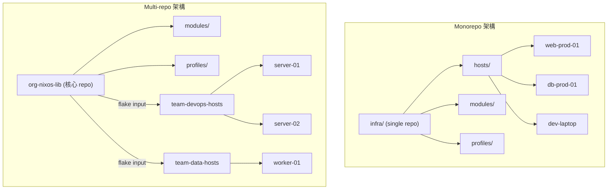
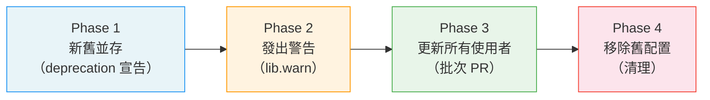
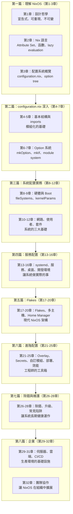

# 第32章：NixOS 團隊協作架構

## 本章學習目標

完成本章後，你將能夠：

1. 依團隊規模選擇合適的 repository 組織策略（monorepo 或 multi-repo）
2. 制定 branch 策略與 PR 工作流程，讓配置變更有跡可循
3. 建立 NixOS 專屬的 code review checklist，識別配置特有的風險點
4. 設計配置命名慣例與 module ownership 機制，降低維護負擔
5. 規劃新人 onboarding 流程與文件策略，讓 NixOS 的宣告式優勢真正發揮

---

## 前置知識

- 完成第31章（CI/CD 與 GitOps）
- 了解 Git 基本操作（branch、PR、merge）
- 熟悉 Flakes 基礎架構（第17-18章）

---

## 32.1 Repository 策略：Monorepo vs Multi-repo

第一個問題不是「要用什麼工具」，而是「配置放在哪裡」。

這個決策決定了團隊協作的基礎架構。

---

### 兩種策略的對比

```
                      Monorepo                   Multi-repo
─────────────────────────────────────────────────────────────
代表情境         中小型團隊，< 20 人          大型組織，跨部門管理
主機數量         < 100 台                    > 100 台，多個 SLA 等級
共用模組         直接引用，路徑簡單           跨 repo，需要 flake input
CI/CD 速度       所有主機都會觸發 build       只有改動的 repo 觸發
存取控制         較難做細粒度權限控制         各 repo 可獨立設定權限
變更可見度       所有人看到所有變更           各團隊只看自己的 repo
```

---

### Monorepo（推薦起點）

所有主機的配置放在同一個 repository。

優點：

- 共用模組、profiles 容易引用（相對路徑即可）
- 跨主機的變更可以在同一個 PR 完成
- 搜尋、閱覽整個系統配置只需一個地方
- 新人只需 clone 一個 repo 就能看到全貌

缺點：

- 大型環境下，每次 PR 都要跑所有主機的 `nix flake check`，CI 很慢
- 無法針對不同團隊做細粒度的 repository 存取控制
- 主機數量超過 100 台後，`flake.nix` 的 `nixosConfigurations` 屬性集會很長

典型的 monorepo 結構：

```
infra/
├── flake.nix
├── flake.lock
├── hosts/
│   ├── web-prod-01/
│   │   └── default.nix
│   ├── db-prod-01/
│   │   └── default.nix
│   └── dev-laptop-alice/
│       └── default.nix
├── modules/
│   ├── networking/
│   ├── security/
│   └── services/
├── profiles/
│   ├── server.nix
│   ├── workstation.nix
│   └── monitoring.nix
├── lib/
│   └── mkHost.nix
└── secrets/
    ├── secrets.nix
    └── *.age
```

---

### Multi-repo（大型組織）

核心 lib 與 modules 放一個 repo，各團隊的主機配置放各自的 repo。

```
org-nixos-lib          (核心模組，所有團隊共用)
  └── modules/
  └── profiles/
  └── lib/

team-devops-hosts      (DevOps 團隊的主機)
  └── flake.nix        (inputs.org-nixos-lib.url = "github:org/nixos-lib")
  └── hosts/

team-data-hosts        (資料工程團隊的主機)
  └── flake.nix
  └── hosts/
```

缺點：

- 更新 `org-nixos-lib` 後，各下游 repo 需要手動執行 `nix flake update` 並提 PR
- 跨 repo 的協調成本高，容易出現版本不一致（某個 team 還在用舊版 module）
- 新人理解整體架構需要更多時間

---

### 架構對比圖



---

### 選擇建議

從 monorepo 開始，有明確需求再遷移。

「明確需求」指的是：

- 不同部門的主機有嚴格的讀寫權限隔離需求（例如資安合規要求）
- CI build 時間超過 30 分鐘，工程師開始抱怨等待時間
- 主機數量超過 100 台，`flake.nix` 的維護已成為瓶頸

在沒有上述需求前，monorepo 的協作成本遠低於 multi-repo。

---

## 32.2 Branch 與 PR 工作流程

Repository 策略決定後，接下來要建立「配置如何被修改」的流程。

NixOS 的宣告式特性讓 Git 工作流程特別有價值：每次 commit 就是一個可重現的系統快照。

---

### 推薦的 Branch 策略

```
main ─────────────────────────────────────────────▶ production 環境
  │
  └── staging ──────────────────────────────────▶ staging 環境
        │
        ├── feature/add-monitoring-module
        ├── fix/nginx-tls-config
        └── chore/update-flake-inputs
```

各 branch 的職責：

- `main`：穩定版本，合併後自動觸發 production 部署（透過第31章的 CI/CD pipeline）
- `staging`：整合測試，各 feature branch 先合入 staging 驗證後再往 main 推
- `feature/*`：新功能開發（例如加入新主機、新模組）
- `fix/*`：修復問題（例如修正防火牆規則、修正服務配置）
- `chore/*`：維護性工作（例如 `nix flake update`、更新 `stateVersion`）

---

### PR 規範

PR title 格式：

```
[host/module] 簡短描述（動詞開頭，不超過 72 字元）

範例：
[nginx] 啟用 HTTP/2 與 TLS 1.3
[monitoring] 新增 Grafana dashboard for PostgreSQL
[web-prod-01] 遷移至 systemd-networkd
[flake] 更新 nixpkgs 至 25.11
```

PR 至少需要一個 reviewer 核准才能 merge（透過 branch protection rule 強制執行）。

---

### PR Template 範例

以下是一份可直接使用的 `.github/pull_request_template.md`：

```markdown
## 變更摘要

<!-- 說明這個 PR 做了什麼，為什麼要做這個變更 -->

## 影響範圍

<!-- 列出受影響的主機或模組 -->

- 主機：
- 模組：
- Profile：

## 測試方式

<!-- 說明如何驗證這個變更是正確的 -->

- [ ] 在本機執行 `nix flake check` 通過
- [ ] 在 staging 環境執行 `nixos-rebuild switch` 成功
- [ ] 使用 `nixos-rebuild build-vm` 在 VM 中驗證行為
- [ ] 相關服務在變更後仍正常運作（附上驗證指令或截圖）

## Rollback 計畫

<!-- 如果這個變更導致問題，如何恢復？ -->

- 執行 `nixos-rebuild switch --rollback` 即可回到前一個世代
- 或是 revert 這個 PR 後重新 deploy

## NixOS 特有檢查

- [ ] 未修改 `system.stateVersion`（或已確認修改的必要性）
- [ ] 無明文 secrets 進入 Nix Store
- [ ] 新服務已設定防火牆規則（若有開放 port）
- [ ] `lib.mkForce` 的使用有在 PR 說明中解釋原因

## 相關 Issue / 文件

<!-- 連結到相關的 Issue、ADR 或外部文件 -->
```

將這個檔案放在 repository 根目錄的 `.github/pull_request_template.md`，GitHub 會在建立 PR 時自動填入此模板。

---

## 32.3 Code Review 重點：NixOS 配置的審查

NixOS 配置的 code review 與一般程式碼不同。

普通程式碼的 review 關注邏輯錯誤、效能、安全漏洞。

NixOS 配置的 review 還需要額外關注：宣告式配置的隱藏副作用、系統狀態的持久性影響、以及 Nix Store 的不可變限制。

---

### 特有風險點

**1. `system.stateVersion` 的修改**

`stateVersion` 決定了 NixOS 初始化時使用的格式版本。

這個值應該永遠保持在「第一次安裝時的版本」，不應該隨著 NixOS 升級而更改。

```nix
# 正確：第一次安裝時設定 25.05，之後永不更改
system.stateVersion = "25.05";

# 錯誤：隨著升級更改為新版本（會破壞依賴舊格式的狀態資料）
system.stateVersion = "25.11";  # ← 如果原本是 25.05，這是危險的！
```

Review 時看到 `stateVersion` 被修改，要強制要求解釋原因。

---

**2. Secrets 的明文暴露**

Nix Store 的路徑是公開的（`/nix/store/<hash>-...`），任何可以讀取 Nix Store 的使用者都可以看到存在其中的內容。

絕對不能這樣寫：

```nix
# 錯誤：密碼明文進入 Nix Store
services.postgresql.initialScript = pkgs.writeText "init.sql" ''
  ALTER USER postgres PASSWORD 'my-secret-password';
'';

# 錯誤：API key 進入 Nix Store
services.my-app.apiKey = "sk-1234567890abcdef";
```

正確做法是使用 agenix 或 sops-nix 管理 secrets（第22章），只在配置中引用加密後的檔案路徑。

---

**3. `lib.mkForce` 的使用**

`lib.mkForce` 會強制覆蓋其他模組設定的值，跳過正常的合併邏輯。

```nix
# 這樣做可能會讓其他模組的安全設定失效
networking.firewall.enable = lib.mkForce false;
```

Review 時遇到 `lib.mkForce`，要確認：

- 為什麼無法用 `lib.mkDefault` 或優先度調整解決？
- 被強制覆蓋的選項是否有安全性或穩定性含義？
- 是否有更好的模組設計能避免需要 `mkForce`？

---

**4. 新服務的防火牆規則**

NixOS 預設啟用防火牆（`networking.firewall.enable = true`）。

啟用一個新服務後，如果沒有對應開放 port，服務可能默默地無法被外部存取，但也可能某個模組自動打開了 port（行為不明顯）。

Review 時對於新啟用的 `services.*` 區塊，要確認：

```nix
# 啟用服務後，確認防火牆規則是明確的
services.prometheus = {
  enable = true;
  port = 9090;
};

# 明確指定是否對外開放
networking.firewall.allowedTCPPorts = [ 9090 ];  # 如果要對外
# 或
networking.firewall.interfaces."lo".allowedTCPPorts = [ 9090 ];  # 只允許 localhost
```

---

**5. `mutableUsers` 的變更影響**

`users.mutableUsers`（預設 `true`）控制 NixOS 是否允許透過 `passwd`、`useradd` 等指令在執行時修改使用者。

當從 `true` 切換到 `false`（強制宣告式使用者管理）時：

- 所有不在配置中宣告的使用者帳號將在下次 `nixos-rebuild switch` 後消失
- 使用者的 shell 登入密碼將由配置管理（必須設定 `hashedPassword` 或 `passwordFile`）

Review 時如果看到這個選項被修改，需要確認：

- 現有的使用者帳號都已在配置中宣告
- 使用者密碼的遷移方案已準備好

---

### Code Review Checklist

以下是可以加入 PR template 或作為 reviewer 標準的 checklist：

```markdown
### NixOS 配置審查 Checklist

**安全性**
- [ ] 無明文 secrets 出現在 `.nix` 檔案中（密碼、API key、token）
- [ ] 新開放的 port 有充分說明（為何要對外？誰有存取需求？）
- [ ] 使用者權限設定（sudo、groups）符合最小權限原則
- [ ] SSH 配置沒有降低安全性（如 PasswordAuthentication 被啟用）

**狀態管理**
- [ ] `system.stateVersion` 未被修改（或有充分說明）
- [ ] `mutableUsers` 的變更影響已被評估
- [ ] 有狀態的服務（資料庫、儲存）的遷移計畫已說明

**配置正確性**
- [ ] `lib.mkForce` 的使用有合理說明
- [ ] Option 類型正確（布林、字串、列表、attrset 不混用）
- [ ] 引用了正確的 package 名稱（未使用過時的別名）
- [ ] `imports` 路徑正確，沒有循環依賴風險

**可維護性**
- [ ] 新模組或選項有 description
- [ ] 複雜邏輯有 inline comment 解釋「為什麼」
- [ ] 命名符合專案慣例（見32.4節）
- [ ] 測試方式已在 PR 說明中描述

**Breaking Change 評估**
- [ ] 這個變更是否影響已有的主機配置？
- [ ] 是否需要其他主機同步更新（若影響共用 module）？
```

---

### 何時需要更謹慎的 Review

有些配置變更風險特別高，應該要求兩位以上 reviewer 核准：

- 修改 `system.stateVersion`
- 切換 `users.mutableUsers`
- 對 `modules/security/` 下的模組做重大修改
- 修改共用 profile（影響所有套用此 profile 的主機）
- 大型重構（目錄結構調整、option 重新命名）

---

## 32.4 配置命名慣例

命名慣例是「低成本高回報」的投資。

一致的命名讓閱讀配置的人不需要額外解釋就能理解意圖。

---

### Option 命名

遵循 nixpkgs 的命名慣例：

```
services.<name>.<option>
programs.<name>.<option>
hardware.<name>.<option>
```

自訂模組的 option 應該也遵循這個命名空間結構：

```nix
# 好的命名：遵循 nixpkgs 慣例
options.services.my-monitor = {
  enable = lib.mkEnableOption "my monitoring service";
  port = lib.mkOption {
    type = lib.types.port;
    default = 9100;
    description = "The port on which the monitor listens.";
  };
};

# 避免：扁平的命名空間
options.myMonitorEnable = lib.mkEnableOption "...";  # 不清楚屬於哪個 namespace
```

---

### 主機命名

使用「功能 + 環境 + 序號」的格式：

```
<function>-<environment>-<index>

範例：
web-prod-01     ← Web 伺服器，production 環境，第一台
web-prod-02     ← Web 伺服器，production 環境，第二台
db-prod-01      ← 資料庫伺服器，production 環境
db-staging-01   ← 資料庫伺服器，staging 環境
monitor-prod-01 ← 監控伺服器，production 環境
dev-alice       ← Alice 的開發用筆電（個人機例外）
```

避免使用：

- VM ID（`vm-1234`）：無法從名稱理解用途
- 地名或人名作為 production 主機名稱（`tokyo-01`、`bob-server`）：換人或換地點時造成混亂
- 太籠統的名稱（`server-01`）：無法理解是什麼類型的伺服器

---

### Profile 命名

Profile 是一組預設配置的集合，命名應該直接描述「這台機器的角色」：

```
profiles/
├── workstation.nix      ← 工程師的工作站
├── server.nix           ← 通用伺服器基本設定
├── web-server.nix       ← Web 伺服器角色
├── database.nix         ← 資料庫角色
├── monitoring.nix       ← 監控節點角色
└── minimal.nix          ← 最小化安裝（CI runner、container）
```

---

### Module 檔案命名

對應功能，使用路徑來表達層次結構：

```
modules/
├── networking/
│   ├── base.nix         ← 基本網路設定
│   ├── vpn.nix          ← VPN 配置
│   └── firewall.nix     ← 防火牆規則
├── security/
│   ├── hardening.nix    ← 系統強化
│   └── audit.nix        ← 稽核日誌
└── services/
    ├── nginx.nix
    ├── postgresql.nix
    └── redis.nix
```

**避免的命名：**

```
config2.nix         ← 不清楚與 config.nix 的差異
test-new.nix        ← 「test」和「new」都是暫時性描述，不該進 repo
alice-settings.nix  ← 個人名字不適合作為模組名稱（人會離職）
misc.nix            ← 「雜項」是命名失敗的信號，代表需要重新分類
backup.nix.bak      ← 備份檔不應進入版本控制
```

---

## 32.5 Module Ownership 機制

「這個模組壞了，誰來修？」

「這個 PR 應該 tag 誰 review？」

Module Ownership 機制回答這些問題。

---

### CODEOWNERS 檔案

GitHub 的 `CODEOWNERS` 檔案讓你宣告：哪些路徑的 PR 必須由哪些人核准。

在 repository 根目錄建立 `.github/CODEOWNERS`：

```
# .github/CODEOWNERS
# 格式：<路徑模式> <@GitHub使用者名稱或@組織/團隊>

# 預設：所有變更都需要 devops-lead 核准
*                          @org/devops-lead

# 網路相關模組：alice 和 bob 負責
/modules/networking/       @alice @bob

# 安全相關模組：charlie 負責，且 security-team 都能 review
/modules/security/         @charlie @org/security-team

# Production 主機：只有 devops-team 可以核准
/hosts/web-prod-*/         @org/devops-team
/hosts/db-prod-*/          @org/devops-team

# Staging 主機：開發者也可以核准
/hosts/*-staging-*/        @org/developers @org/devops-team

# Secrets 相關：只有 devops-lead 可以核准
/secrets/                  @org/devops-lead

# CI 配置：devops-lead 核准
/.github/                  @org/devops-lead
/flake.nix                 @org/devops-lead
```

設定 `CODEOWNERS` 後，在 GitHub repository 設定中啟用 branch protection：

```
Settings → Branches → Branch protection rules → main
  ✓ Require a pull request before merging
  ✓ Require approvals: 1
  ✓ Require review from Code Owners
```

---

### Owner 責任

成為某個模組的 owner，意味著：

- 熟悉這個模組的配置邏輯和設計決策
- 審查涉及此模組的 PR（不只是語法正確，還要確認設計合理）
- 維護此模組的 inline comment 和 option description
- 當此模組出現問題時，是第一線的聯絡人

---

### 避免 Bus Factor 1

Bus Factor（巴士因子）是指：「如果這個人被巴士撞到，專案會不會停擺？」

每個關鍵模組至少要有 2 個 owner：

```
# 危險：只有一個 owner
/modules/security/    @charlie

# 較安全：至少兩個 owner
/modules/security/    @charlie @diana

# 最好：有個備援團隊
/modules/security/    @charlie @diana @org/security-team
```

建議每季進行一次 ownership review：

- 確認每個模組至少有 2 個有效的 owner（沒有離職或離開團隊）
- 確認 owner 對自己負責的模組還有足夠了解
- 有沒有長期沒有 owner 查看的模組（潛在的 orphan module）

---

## 32.6 文件策略

「這裡為什麼要用 `lib.mkForce`？」

「這個 module 的 `enable` 選項預設是什麼？為什麼？」

「新人要怎麼在本地跑起來？」

文件的存在是為了回答這些問題，不是為了讓 README 看起來很充實。

---

### README.md

整個 repository 的快速上手說明。

一個好的 `README.md` 讓新工程師在 30 分鐘內理解整個 repo 的結構。

以下是一個實用的結構：

````markdown
# Org Infrastructure

以 NixOS 管理的基礎設施配置。

## 環境需求

| 工具 | 版本 |
|---|---|
| Nix | 2.18+ （需啟用 flakes） |
| Git | 任意版本 |

## 快速開始

```bash
# 1. clone repo
git clone git@github.com:org/infra.git && cd infra

# 2. 進入開發環境（安裝所有工具）
nix develop

# 3. 驗證配置語法
nix flake check

# 4. 在 VM 中測試某台主機的配置
nixos-rebuild build-vm --flake .#web-staging-01
./result/bin/run-web-staging-01-vm
```

## 目錄結構

```
hosts/      各主機的個別配置
modules/    共用的 NixOS 模組
profiles/   主機角色預設集合
lib/        工具函數
secrets/    加密後的 secrets（agenix）
```

## 常用指令

| 指令 | 說明 |
|---|---|
| `make check` | 驗證所有主機的配置語法 |
| `make deploy HOST=web-prod-01` | 部署到指定主機 |
| `make update` | 更新 flake.lock |
| `make secrets` | 重新加密 secrets |

## 貢獻指南

請閱讀 [ONBOARDING.md](./ONBOARDING.md) 了解工作流程。
````

---

### Option Description

自訂 module 中的每個 option 都應該有 `description`，說明用途和預設行為：

```nix
{ config, lib, pkgs, ... }:

{
  options.services.internal-proxy = {
    enable = lib.mkEnableOption "the internal reverse proxy";

    port = lib.mkOption {
      type = lib.types.port;
      default = 8080;
      example = 9090;
      description = ''
        The port on which the proxy listens for incoming connections.
        Only accepts connections from localhost by default.
        To expose externally, add the port to networking.firewall.allowedTCPPorts.
      '';
    };

    upstreams = lib.mkOption {
      type = lib.types.listOf (lib.types.submodule {
        options = {
          name = lib.mkOption {
            type = lib.types.str;
            example = "api-backend";
            description = "Identifier for this upstream, used in logs.";
          };
          address = lib.mkOption {
            type = lib.types.str;
            example = "127.0.0.1:3000";
            description = "The address of the backend service (host:port).";
          };
        };
      });
      default = [];
      description = ''
        List of upstream services to proxy.
        Each entry requires a name and address.
      '';
    };
  };
}
```

---

### Inline Comments

只在「為什麼」不明顯時加 comment，不要解釋「是什麼」（程式碼本身已經說明了）。

```nix
# 不好：解釋「是什麼」（多餘的 comment）
# 啟用 SSH 服務
services.openssh.enable = true;

# 好：解釋「為什麼」
# 允許 root 登入是為了 deploy-rs 的初始部署流程
# 正式環境設定好後應關閉（見 issue #42）
services.openssh.settings.PermitRootLogin = "yes";

# 好：說明非直觀的行為
# mkForce 是因為 desktop profile 預設開啟了 CUPS
# 但這台是 headless server，不需要印表機支援
services.printing.enable = lib.mkForce false;
```

---

### ADR（Architecture Decision Record）

重大技術決策應該記錄「為什麼這樣做」，讓六個月後的自己（和隊友）理解當時的脈絡。

建立 `docs/decisions/` 目錄，每個決策一個 Markdown 檔案：

```
docs/decisions/
├── 001-monorepo-structure.md
├── 002-agenix-over-sops.md
├── 003-colmena-for-deployment.md
└── 004-home-manager-as-nixos-module.md
```

每個 ADR 的格式：

```markdown
# ADR 002：使用 agenix 而非 sops-nix 管理 Secrets

**狀態**：已採納（2025-03-15）

## 問題

我們需要在 Git repository 中安全地儲存 secrets（資料庫密碼、API keys），
同時讓 NixOS 在部署時能自動解密使用。

## 考慮的方案

| 方案 | 優點 | 缺點 |
|---|---|---|
| agenix | 語法簡單，與 age 生態整合好 | 功能相對基本 |
| sops-nix | 功能豐富，支援多種加密後端 | 配置較複雜，需要額外工具 |
| git-crypt | 簡單 | 不支援細粒度的 key 管理 |

## 決策

採用 agenix。

## 原因

- 團隊規模小（< 5 人），sops-nix 的進階功能暫時不需要
- 所有工程師已有 age key 作為 SSH key 的補充
- agenix 的配置更接近 NixOS 的宣告式風格

## 後續

若未來需要跨團隊 secret 管理或 KMS 整合，可以重新評估 sops-nix。
```

---

### CHANGELOG.md

記錄主要版本升級和重大配置變更：

```markdown
# Changelog

## [2026-01] NixOS 25.11 升級

### 重大變更
- 所有主機的 `system.stateVersion` 保持在 25.05（不升級）
- nixpkgs input 更新至 25.11 branch

### 新增
- 新增 `profiles/monitoring.nix`，所有 production 主機自動加入監控

### 修正
- 修正 web-prod-01 的 TLS 配置（見 PR #87）

## [2025-09] 遷移至 Flakes

- 從 channels 遷移至 flake.nix 管理（見 ADR #001）
- 新增 `nix develop` 開發環境
```

---

## 32.7 新人 Onboarding 流程設計

NixOS 的宣告式特性讓新人 onboarding 有機會比傳統環境更快、更可靠。

傳統環境的 onboarding 往往依賴「口耳相傳的魔法步驟」：

```
「你要先 apt install 幾個東西，
 然後手動改 /etc/hosts，
 啊對還有那個 .bashrc 要加幾行，
 某個 config 檔要從 Alice 那邊複製...」
```

NixOS 環境可以把這些全部自動化。

---

### 理想的 Day 1 體驗

新工程師的第一天應該這樣進行：

**Step 1：Clone Repo（5 分鐘）**

```bash
git clone git@github.com:org/infra.git
cd infra
```

**Step 2：執行 Onboarding 腳本（10 分鐘，自動化）**

```bash
./scripts/onboard.sh
```

這個腳本做什麼：

- 檢查 Nix 是否安裝（未安裝時提供安裝指引）
- 確認 flakes 已啟用
- 執行 `nix develop` 進入開發環境（安裝所有需要的工具）
- 驗證 SSH key 格式並顯示下一步（將 public key 加入配置）

```bash
#!/usr/bin/env bash
# scripts/onboard.sh

set -euo pipefail

echo "=== NixOS Infra Onboarding ==="

# 確認 Nix 存在
if ! command -v nix &>/dev/null; then
  echo "Nix 尚未安裝。請先執行："
  echo "  curl -L https://nixos.org/nix/install | sh"
  exit 1
fi

# 確認 flakes 已啟用
if ! nix flake show . &>/dev/null 2>&1; then
  echo "Flakes 尚未啟用。請在 ~/.config/nix/nix.conf 加入："
  echo "  experimental-features = nix-command flakes"
  exit 1
fi

echo "環境檢查通過。"

# 顯示你的 SSH public key（稍後需要加入配置）
echo ""
echo "你的 SSH public key（加入 hosts/dev-YOUR_NAME/default.nix 時需要）："
cat ~/.ssh/id_ed25519.pub 2>/dev/null || \
  cat ~/.ssh/id_rsa.pub 2>/dev/null || \
  echo "（找不到 SSH public key，請先執行 ssh-keygen）"

echo ""
echo "下一步："
echo "  1. 閱讀 ONBOARDING.md"
echo "  2. 執行 nix develop 進入開發環境"
echo "  3. 執行 nix flake check 驗證配置語法"
```

**Step 3：閱讀 ONBOARDING.md（30 分鐘）**

了解整個 repo 的架構、工作流程、常用指令。

**Step 4：在本機跑起第一台主機的 VM（15 分鐘）**

```bash
# 在開發環境中
nix develop

# 建立 VM（以 staging 主機為例）
nixos-rebuild build-vm --flake .#web-staging-01

# 啟動 VM
./result/bin/run-web-staging-01-vm
```

這一步讓新工程師親眼看到「宣告式配置如何變成一台可運行的機器」。

對比傳統環境需要：「安裝 VirtualBox → 下載 ISO → 手動安裝 → 手動配置」，這個體驗差異是巨大的。

**Step 5：提交第一個 PR（45 分鐘）**

最有意義的第一個 PR：將自己的 SSH public key 加入配置。

```nix
# hosts/dev-alice/default.nix
{ config, pkgs, ... }:

{
  imports = [
    ./hardware-configuration.nix
    ../../profiles/workstation.nix
  ];

  networking.hostName = "dev-alice";

  # Alice 的 SSH key
  users.users.alice = {
    isNormalUser = true;
    extraGroups = [ "wheel" "docker" ];
    openssh.authorizedKeys.keys = [
      "ssh-ed25519 AAAAC3NzaC1lZDI1NTE5AAAAI... alice@org"
    ];
  };

  system.stateVersion = "25.05";
}
```

這個 PR 讓新人：

- 走過一次完整的 Git 工作流程（branch → commit → PR → review → merge）
- 親手修改 NixOS 配置並理解影響
- 得到第一個 review comment（通常是 reviewer 幫助確認 key 格式正確）

---

### ONBOARDING.md 範例

以下是一份完整的新人引導文件結構：

````markdown
# Onboarding 指南

歡迎加入團隊！這份文件幫助你在第一天就能獨立運作。

## 環境設定

### 需求

| 工具 | 說明 |
|---|---|
| Nix（啟用 flakes） | 建置和部署工具 |
| Git | 版本控制 |
| SSH key | 部署到主機需要 |

### 一鍵設定

```bash
./scripts/onboard.sh
```

## Repo 架構快速導覽

```
hosts/         各主機的配置（每台主機一個目錄）
modules/       可重用的 NixOS 模組
profiles/      主機角色（workstation、server、database...）
lib/           工具函數（mkHost、mkModule...）
secrets/       加密後的 secrets（不含明文）
docs/          ADR 和其他文件
scripts/       維護腳本
```

## 你的第一個 PR

把你的 SSH key 加入 `hosts/dev-YOUR_NAME/default.nix`：

1. 從 main branch 建立一個新 branch：
   ```bash
   git checkout -b feature/add-alice-ssh-key
   ```
2. 複製最近的 dev 主機配置作為模板：
   ```bash
   cp -r hosts/dev-bob hosts/dev-alice
   ```
3. 修改 `hosts/dev-alice/default.nix`，填入你的名字和 SSH key
4. 執行 `nix flake check` 確認語法正確
5. 提交 PR，請求 @bob 或 @charlie review

## 常用操作

### 驗證配置語法
```bash
nix flake check
```

### 在 VM 中測試配置
```bash
nixos-rebuild build-vm --flake .#web-staging-01
./result/bin/run-web-staging-01-vm
```

### 部署到主機
```bash
make deploy HOST=web-staging-01
```

### 更新套件版本
```bash
nix flake update
git add flake.lock
git commit -m "chore: update flake inputs"
```

## 常見問題

**Q：nix flake check 失敗，顯示 attribute missing**

通常是 import 路徑錯誤，或是 option 名稱打錯。
執行 `nix flake check --show-trace` 看詳細錯誤位置。

**Q：我修改了 staging 主機，但 production 沒有更新？**

staging 和 production 是獨立的主機配置。
若要讓兩邊同步，應修改共用的 profile 或 module，不要直接修改各主機配置。
````

---

### 避免的問題

**文件過時**

文件過時比沒有文件更危險：

- 讀了過時的文件並照著做，會花更多時間除錯
- 用 `nix develop` 保證開發環境一致：凡是「需要安裝某工具」的操作，都要放入 `devShell`

```nix
# flake.nix - devShell 作為「文件即程式碼」
devShells.default = pkgs.mkShell {
  buildInputs = with pkgs; [
    # 部署工具
    colmena
    deploy-rs
    # Secrets 管理
    agenix
    # 格式化和驗證
    nixfmt-rfc-style
    deadnix
    statix
    # 便利工具
    jq
    yq
  ];

  shellHook = ''
    echo "NixOS Infra Dev Environment"
    echo "執行 make help 查看可用指令"
  '';
};
```

**口耳相傳的「魔法步驟」**

每次有人說「對對對，還要做一個步驟，就是...」，那個步驟就應該被記錄下來或自動化。

---

## 32.8 配置演進：如何安全引入 Breaking Changes

任何活著的配置都會演進。

模組會被重新命名，option 會被廢棄，目錄結構會被重組。

問題不是「要不要改」，而是「怎麼改不讓人措手不及」。

---

### 什麼是 Breaking Change

以下操作對使用者（其他工程師、其他主機配置）來說是 Breaking Change：

- 將 option 重新命名（`services.my-app.listenPort` → `services.my-app.port`）
- 移除一個 option（不再支援某個功能）
- 改變 option 的預設值（可能影響未明確設定此值的主機）
- 移動模組檔案路徑（所有 `import` 這個路徑的地方都要更新）
- 改變 module 的行為邏輯（即使 interface 不變）

---

### 四步驟安全遷移



---

**Phase 1：新舊並存**

不要直接移除舊的 option，先新增新的，讓兩者並存：

```nix
options.services.my-app = {
  # 舊的 option（保留，稍後廢棄）
  listenPort = lib.mkOption {
    type = lib.types.port;
    default = 8080;
    description = "Deprecated: use `port` instead.";
  };

  # 新的 option
  port = lib.mkOption {
    type = lib.types.port;
    default = 8080;
    description = "The port on which the service listens.";
  };
};
```

---

**Phase 2：發出警告**

使用 `lib.warn` 在舊 option 被使用時發出廢棄警告：

```nix
config = {
  # 如果使用者設定了舊的 listenPort，警告並自動沿用到新的 port
  services.my-app.port = lib.mkIf (config.services.my-app.listenPort != 8080)
    (lib.warn
      "services.my-app.listenPort is deprecated, use services.my-app.port instead."
      config.services.my-app.listenPort);
};
```

使用者在 `nixos-rebuild` 時會看到：

```
warning: services.my-app.listenPort is deprecated, use services.my-app.port instead.
```

這樣他們知道需要更新，但系統不會壞。

---

**Phase 3：更新所有使用者**

在發出警告的 PR 合入後，開一個批次 PR 更新所有使用此 option 的主機配置：

```bash
# 找出所有使用舊 option 的地方
grep -r "listenPort" hosts/ modules/

# 逐一更新
# hosts/web-prod-01/default.nix: listenPort = 9090 → port = 9090
```

---

**Phase 4：移除舊配置**

確認所有使用者都已更新後，移除舊的 option：

```nix
# 移除 listenPort option 和相關的 mkIf 邏輯
# 只保留 port option
```

Commit message 格式：

```
fix(my-app): remove deprecated listenPort option

BREAKING CHANGE: services.my-app.listenPort has been removed.
Use services.my-app.port instead.

All existing usages have been migrated in the previous PR (#95).
```

---

### 遷移腳本

對於複雜的遷移（例如目錄結構重組），提供一個自動化腳本：

```bash
#!/usr/bin/env bash
# scripts/migrate-module-paths.sh
# 將 modules/services/ 下的模組遷移到新路徑 modules/apps/

set -euo pipefail

echo "Migrating module import paths..."

# 更新所有 import 路徑
find hosts/ -name "*.nix" -exec \
  sed -i 's|../../modules/services/|../../modules/apps/|g' {} \;

echo "Done. Please run 'nix flake check' to verify."
```

---

### 在 Commit Message 標注 Breaking Change

遵循 Conventional Commits 格式，在 footer 加入 `BREAKING CHANGE:`：

```
feat(networking): rename vpn module options

BREAKING CHANGE: services.internal-vpn.serverAddress has been renamed
to services.internal-vpn.server.address to match the nixpkgs naming
convention for nested options.

Migration: replace `services.internal-vpn.serverAddress = "..."` with
`services.internal-vpn.server.address = "..."` in your host configs.
```

這讓 `git log --grep="BREAKING CHANGE"` 可以快速找出所有 breaking change。

---

## 本章小結與全書總結

### 本章重點回顧

本章涵蓋了 NixOS 在團隊環境中的協作基礎設施：

- **Repository 策略**：從 monorepo 開始，有明確痛點再考慮 multi-repo
- **PR 工作流程**：標準化的 branch 策略、PR template、review 機制
- **Code Review**：NixOS 特有的風險點（stateVersion、secrets、mkForce、防火牆）
- **命名慣例**：一致的命名降低認知負擔，讓配置「自我說明」
- **Module Ownership**：CODEOWNERS 將責任明確化，避免 Bus Factor 1
- **文件策略**：README 快速上手、option description、ADR 記錄決策脈絡
- **Onboarding**：讓宣告式配置的優勢在新人第一天就展現
- **Breaking Changes**：四步驟安全遷移，不讓配置演進成為隊友的負擔

---

### 全書回顧

你剛剛完成了一段從 NixOS 哲學到企業協作架構的完整旅程。

讓我們回顧這32章走過的路：



---

### 核心技能地圖

讀完本書，你應該具備以下能力：

**宣告式思維**

- 理解「描述系統應該長什麼樣子」vs「告訴系統要做什麼」的根本差異
- 能夠閱讀和理解任何 NixOS 配置檔案

**模組化設計**

- 將大型 `configuration.nix` 拆分為可重用的模組
- 設計帶有 option schema 的自訂模組
- 用 profiles 管理主機角色

**Flakes 現代架構**

- 用 `flake.nix` 管理多台主機的配置
- 固定依賴版本（`flake.lock`），確保可重現性
- 整合 Home Manager 管理使用者環境

**企業部署**

- 用 colmena 或 deploy-rs 進行遠端部署
- 整合 GitHub Actions 實現 GitOps 工作流程
- 用 Cachix 加速 CI binary cache

**團隊協作**

- 建立 PR 工作流程和 code review 機制
- 設計 module ownership 和 CODEOWNERS
- 規劃新人 onboarding 和文件策略

---

### 下一步：加入 NixOS 社群

NixOS 是一個活躍的開源社群，這裡有很多地方可以繼續學習和貢獻：

**社群討論**

- [NixOS Discourse](https://discourse.nixos.org/)：官方論壇，提問和討論的最佳場所
- [Matrix chat](https://matrix.to/#/#community:nixos.org)：即時討論，有各種主題頻道（`#nixos`、`#flakes`、`#home-manager`）
- [Reddit r/NixOS](https://www.reddit.com/r/NixOS/)：分享配置、提問、討論

**貢獻 nixpkgs**

你讀完這本書後，已經有足夠的能力貢獻 [nixpkgs](https://github.com/NixOS/nixpkgs)——NixOS 的核心套件倉庫：

- 回報 bug：在 GitHub Issues 回報套件問題或配置錯誤
- 更新套件版本：這是最容易的第一個貢獻
- 修正文件：option 的 description 有錯誤或不清楚
- 新增套件：你用到的工具還不在 nixpkgs 中

第一次貢獻建議從「更新套件版本」開始，流程直觀，reviewers 也很友善。

**進階主題探索**

NixOS 生態持續在成長，以下是值得探索的進階方向：

| 主題 | 說明 |
|---|---|
| [nix-darwin](https://github.com/LnL7/nix-darwin) | 在 macOS 上使用 Nix 管理系統配置，與 NixOS 共用 module |
| [WSL2 + NixOS](https://github.com/nix-community/NixOS-WSL) | 在 Windows 的 WSL2 中運行完整的 NixOS |
| [Disko](https://github.com/nix-community/disko) | 宣告式磁碟分割，讓安裝流程也能自動化 |
| [NixOS on ARM](https://nixos.wiki/wiki/NixOS_on_ARM) | 在 Raspberry Pi、Apple Silicon 上運行 NixOS |
| [Nix on embedded](https://github.com/nix-community/nixos-generators) | 生成各種格式的系統映像（ISO、VM、cloud image） |
| [Devenv](https://devenv.sh/) | 以 Nix 為基礎的開發環境管理工具 |
| [Nixpkgs cross-compilation](https://nixos.org/manual/nixpkgs/stable/#chap-cross) | 交叉編譯，為不同架構建置套件 |

---

### 一個工具鏈，無限可能

你也許從「想搞懂 `configuration.nix`」開始讀這本書。

現在你知道的不只是語法：

你理解的是一種思維方式。

宣告式系統的核心洞察是：

**「與其描述步驟，不如描述目標。」**

這個洞察不只適用於 NixOS。

它適用於 Kubernetes、Terraform、Ansible，以及所有「Infrastructure as Code」的工具。

NixOS 只是這個洞察最純粹、最徹底的實現之一。

---

你已經準備好了。

從一個主機的 `configuration.nix` 開始。

把它放進 Git。

邀請一個同事 review。

然後看著你的基礎設施變得可追蹤、可重現、可維護。

這就是 NixOS 的承諾。

而你，已經知道如何兌現它。

---

*感謝你讀完這本書。*

*願你的 `nixos-rebuild switch` 永遠成功，*
*願你的 `flake.lock` 永遠鎖在你期望的版本，*
*願你的系統在十年後仍然能夠從頭重建。*

---

> **延伸閱讀**
>
> - [NixOS 官方手冊](https://nixos.org/manual/nixos/stable/)
> - [Nixpkgs 手冊](https://nixos.org/manual/nixpkgs/stable/)
> - [Nix Pills](https://nixos.org/guides/nix-pills/)（深入理解 Nix 語言）
> - [nix.dev](https://nix.dev/)（官方學習資源聚合）
> - [Awesome NixOS](https://github.com/nix-community/awesome-nix)（社群精選資源清單）
