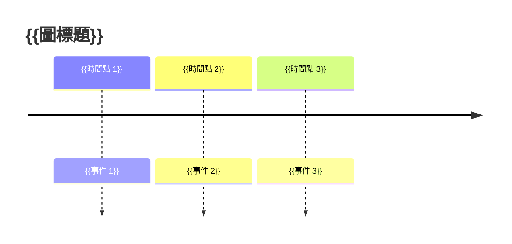

# 第{{章節編號}}章：{{章節主題}}

## 本章學習目標

完成本章後，你將能夠：

1. {{學習目標 1，以「能夠...」「理解...」「解釋...」開頭}}
2. {{學習目標 2}}
3. {{學習目標 3}}
4. {{學習目標 4，建議 4–6 條}}
5. {{學習目標 5}}

## 前置知識

- {{先備技能 1，例如：完成第 N 章}}
- {{先備技能 2，例如：基本 Linux 終端操作}}
- {{先備技能 3，可選}}

---

## {{章節編號}}.1 {{第一小節標題：通常為「問題情境」或「為什麼需要這個概念」}}

### {{用故事或具體場景開頭的子標題}}

{{用 2–4 個短段落點出問題。短句為主，一行一個概念。}}

{{若有「漂移、混亂、不可重現」這類抽象問題，用具體指令或時間軸 Mermaid 圖呈現：}}



### {{術語首次定義的子標題}}

{{術語名稱}}（{{Term in English}}）是指：

**{{用一句話定義該術語}}**

它的特徵 / 症狀 / 表現是：

- {{特徵 1}}
- {{特徵 2}}
- {{特徵 3}}

---

## {{章節編號}}.2 {{第二小節標題：通常為「NixOS 的解法」或「核心概念」}}

### {{解法的本質}}

{{1–2 段，描述 NixOS 如何處理上一節提出的問題。}}

### {{第一個程式碼範例，最簡形式}}

{{先敘述「為什麼這樣寫」，再放程式碼。}}

```nix
{ config, pkgs, ... }:

{
  # {{用簡短註解標示重點，但不過度註解}}
  {{核心設定 1}};
  {{核心設定 2}};

  system.stateVersion = "25.05";
}
```

{{程式碼後說明：}}

- `{{設定鍵 1}}` 的作用是 {{說明}}
- `{{設定鍵 2}}` 的作用是 {{說明}}

### {{對比表，說明 NixOS 與傳統做法的差異}}

| 面向 | 傳統做法 | NixOS 做法 |
|---|---|---|
| {{面向 1}} | {{傳統}} | {{NixOS}} |
| {{面向 2}} | {{傳統}} | {{NixOS}} |
| {{面向 3}} | {{傳統}} | {{NixOS}} |

---

## {{章節編號}}.3 {{進階概念或第二個範例}}

{{在最簡範例之後，加入一個稍複雜的變體，展示如何擴展。每章建議 2–4 個小節，由淺入深。}}

```nix
{ config, pkgs, ... }:

{
  imports = [
    {{若有 imports，在此展示模組組合}}
  ];

  {{進階設定}};
}
```

{{進階範例後，用 Mermaid 圖呈現資料流或模組關係：}}

```mermaid
graph TD
  A[{{節點 1}}] --> B[{{節點 2}}]
  B --> C[{{節點 3}}]
  B --> D[{{節點 4}}]
```

---

## {{章節編號}}.N {{選用：實戰小演練，建議放在章節中段以後}}

{{若本章適合動手做，加入一段「最小可行演練」。完整 Lab 留給對應的 `labs/` 目錄；這裡只示範核心動作。}}

```bash
# {{演練動作 1}}
{{command}}

# {{演練動作 2}}
{{command}}
```

**預期結果：**

```
{{預期輸出}}
```

---

## 常見問題

### 問題 1：{{常見錯誤訊息或誤解，以症狀描述}}

**症狀：** {{描述使用者會看到什麼}}

**原因：** {{說明為何發生}}

**解法：**

```bash
{{解法指令}}
```

{{若解法需文字補充，在此說明}}

---

### 問題 2：{{第二個常見問題}}

**症狀：** {{描述}}

**原因：** {{原因}}

**解法：** {{解法}}

---

### 問題 3：{{第三個常見問題，建議每章 3–5 條}}

**症狀：** {{描述}}

**原因：** {{原因}}

**解法：** {{解法}}

---

## 延伸練習

### 練習 1：{{練習名稱，動手即可完成}}

{{1–2 段任務描述，明確指出該改哪個檔、預期看到什麼結果。}}

### 練習 2：{{練習名稱，需要查閱文件}}

{{練習說明}}

### 練習 3：{{練習名稱，可選的進階挑戰}}

{{練習說明}}

---

## 本章小結

{{用 3–5 個條列，回顧本章的核心觀念。}}

- {{重點 1，呼應學習目標 1}}
- {{重點 2}}
- {{重點 3}}
- {{重點 4}}

**下一章預告：** 第 {{下一章編號}} 章將進入 {{下一章主題}}，{{說明銜接點，例如：在此基礎上學習如何 ...}}。

---

## 延伸閱讀

- [{{文件名稱}}]({{URL}}) — {{一句話說明這個資源為何值得讀}}
- [{{NixOS Manual 章節}}]({{URL}}) — {{說明}}
- [{{社群文章}}]({{URL}}) — {{說明}}
